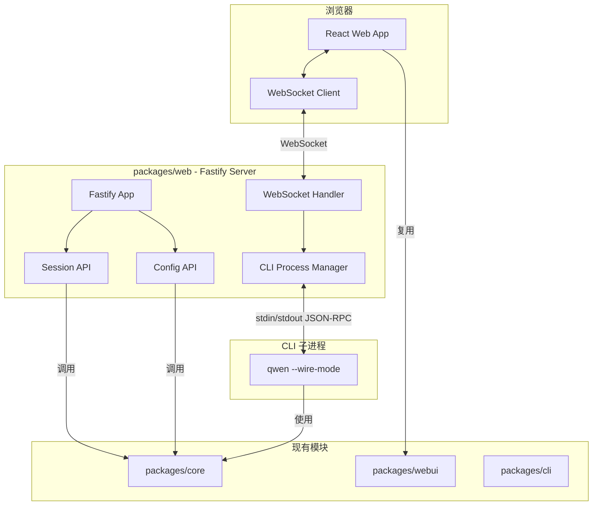

# GUI for Qwen Code CLI 实现计划

## 架构设计



## 目录结构

```
packages/web/
├── package.json
├── tsconfig.json
├── vite.config.ts              # 前端构建配置
├── index.html                  # 前端入口
├── src/
│   ├── server/                 # 后端代码
│   │   ├── index.ts           # 服务器入口
│   │   ├── app.ts             # Fastify 应用
│   │   ├── routes/
│   │   │   ├── sessions.ts    # Session CRUD API
│   │   │   ├── config.ts      # 配置 API
│   │   │   └── health.ts      # 健康检查
│   │   ├── websocket/
│   │   │   ├── handler.ts     # WebSocket 连接处理
│   │   │   └── protocol.ts    # JSON-RPC 协议定义
│   │   └── process/
│   │       ├── manager.ts     # CLI 进程管理器
│   │       └── session.ts     # 单个会话进程
│   └── client/                 # 前端代码
│       ├── main.tsx           # React 入口
│       ├── App.tsx            # 主应用组件
│       ├── hooks/
│       │   ├── useWebSocket.ts
│       │   └── useSession.ts
│       ├── pages/
│       │   └── Chat.tsx       # 主聊天页面
│       └── store/             # 状态管理
│           └── chatStore.ts
```

## 关键实现细节

### 1. CLI Wire Mode（需新增）

在 `packages/cli` 中添加 `--wire-mode` 参数，使 CLI 以 JSON-RPC 模式运行：

- 从 stdin 读取 JSON-RPC 请求
- 向 stdout 输出 JSON-RPC 响应/事件
- 参考现有 [acp.ts](packages/cli/src/acp-integration/acp.ts) 中的 JSON-RPC 实现

### 2. 后端服务器 (Fastify)

关键依赖：

- `fastify` + `@fastify/websocket` + `@fastify/static` + `@fastify/cors`
- 复用 `@qwen-code/qwen-code-core` 的 `SessionService`

REST API 端点：

- `GET /api/sessions` - 列出会话（分页）
- `POST /api/sessions` - 创建新会话
- `GET /api/sessions/:id` - 获取会话详情
- `DELETE /api/sessions/:id` - 删除会话
- `GET /api/config` - 获取配置
- `PUT /api/config` - 更新配置

WebSocket 端点：

- `/ws/sessions/:id` - 会话实时通信

### 3. CLI 进程管理器

参考 kimi 的 `KimiCLIRunner` 设计：

- 每个活跃会话对应一个 CLI 子进程
- 通过 stdin/stdout 进行 JSON-RPC 通信
- 支持多 WebSocket 客户端连接同一会话
- 进程空闲超时自动关闭

### 4. 前端应用

复用现有 webui 组件：

- [InputForm](packages/webui/src/components/layout/InputForm.tsx) - 输入框
- [SessionSelector](packages/webui/src/components/layout/SessionSelector.tsx) - 会话选择
- [ChatViewer](packages/webui/src/components/ChatViewer/ChatViewer.tsx) - 消息展示
- [ChatHeader](packages/webui/src/components/layout/ChatHeader.tsx) - 头部导航

### 5. `/web` 命令

在 [BuiltinCommandLoader.ts](packages/cli/src/services/BuiltinCommandLoader.ts) 中添加 `webCommand`：

- 启动 Fastify 服务器
- 查找可用端口（默认 5173）
- 自动打开浏览器

## 通信协议（JSON-RPC 2.0）

```typescript
// 客户端 -> 服务器
interface PromptRequest {
  jsonrpc: '2.0';
  id: string;
  method: 'prompt';
  params: {
    content: string;
    attachments?: Array<{ type: string; data: string }>;
  };
}

// 服务器 -> 客户端（事件流）
interface StreamEvent {
  jsonrpc: '2.0';
  method: 'stream';
  params: {
    type: 'text' | 'tool_call' | 'thinking' | 'done' | 'error';
    data: unknown;
  };
}
```

## 依赖关系

```
packages/web
├── @qwen-code/qwen-code-core  (Session, Config)
├── @qwen-code/webui           (UI 组件)
├── fastify ecosystem          (后端)
├── react + vite               (前端构建)
└── packages/cli               (spawn 子进程)
```
