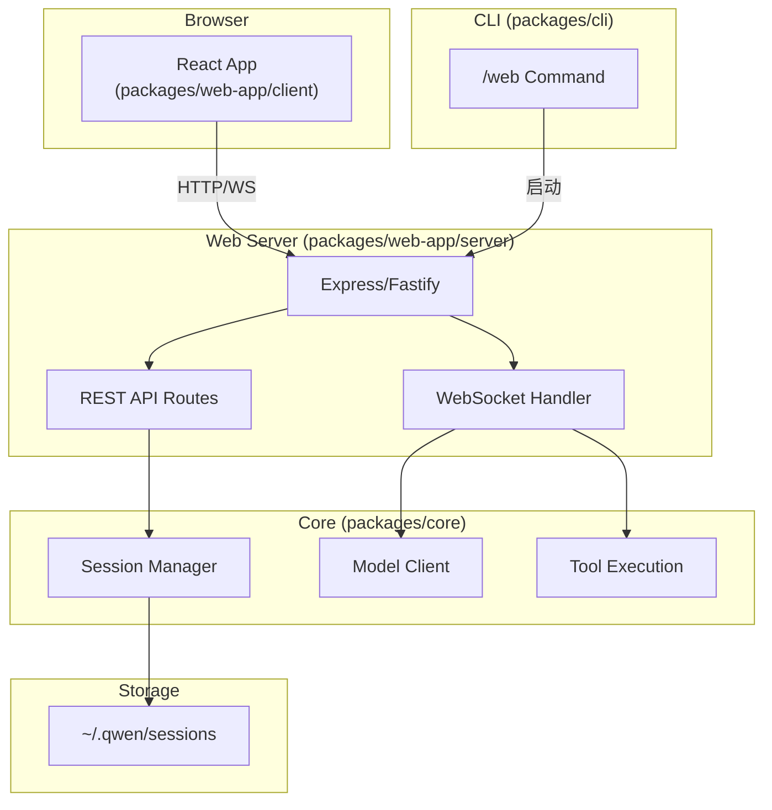

# Web GUI for Qwen Code CLI

## 架构概述



## 技术方案

### 1. 包结构

- 新建 `packages/web-app`，包含 server 和 client 两部分
- 复用 `@qwen-code/webui` 组件库
- 复用 `@qwen-code/qwen-code-core` 的 Session 和 Model 功能

### 2. 后端技术栈

- **HTTP 服务**: Express.js (轻量、生态成熟)
- **WebSocket**: `ws` 库 (与 core 包一致)
- **静态文件**: 内嵌 Vite 构建产物

### 3. 前端技术栈

- **框架**: React 18+ (与 webui 一致)
- **构建**: Vite
- **样式**: Tailwind CSS
- **组件**: 复用 `@qwen-code/webui` 导出的组件

### 4. 关键文件

**CLI 命令** - 新增 `/web` 命令:

```typescript
// packages/cli/src/ui/commands/webCommand.ts
export const webCommand: SlashCommand = {
  name: 'web',
  kind: CommandKind.BUILT_IN,
  description: 'Start Web GUI server',
  action: async (context, args) => {
    // 解析参数 --port, --host, --no-open
    // 启动 web-app 服务器
    // 自动打开浏览器
  },
};
```

**API 路由** - Session 管理:

```typescript
// packages/web-app/src/server/routes/sessions.ts
router.get('/api/sessions', async (req, res) => {
  /* 列表 */
});
router.post('/api/sessions', async (req, res) => {
  /* 创建 */
});
router.get('/api/sessions/:id', async (req, res) => {
  /* 详情 */
});
```

**WebSocket 协议**:

```typescript
// 消息类型
type WSMessage =
  | { type: 'user_message'; content: string }
  | { type: 'assistant_message'; content: string; streaming: boolean }
  | { type: 'tool_call'; name: string; args: unknown; status: string }
  | { type: 'permission_request'; operation: string }
  | { type: 'permission_response'; allow: boolean; scope: string }
  | { type: 'cancel' };
```

**前端应用**:

```typescript
// packages/web-app/src/client/App.tsx
function App() {
  return (
    <div className="flex h-screen">
      <Sidebar sessions={sessions} onSelect={handleSelect} />
      <main className="flex-1 flex flex-col">
        <ChatHeader title={session.title} contextUsage={usage} />
        <ChatViewer messages={messages} />
        <InputForm onSubmit={handleSubmit} />
      </main>
    </div>
  );
}
```

## 复用的现有组件

从 `@qwen-code/webui` 复用:

- `ChatViewer` - 聊天消息展示
- `SessionSelector` - Session 选择器 (适配为 Sidebar)
- `InputForm` - 输入表单
- `ContextIndicator` - 上下文指示器
- `*ToolCall` 组件族 - 工具调用展示
- `PermissionDrawer` - 权限审批
- 全套 Icons

## 待确认问题

1. **Session 状态同步**: 多客户端同时操作同一 Session 如何处理？
2. **文件上传**: Web 端是否支持直接上传文件作为上下文？
3. **安全性**: `--host 0.0.0.0` 时是否需要认证？
4. **工作目录**: Web 端创建 Session 使用什么工作目录？

## OpenSpec 文档位置

- PRD: [openspec/changes/add-web-gui/context/1_refined_prd.dev.md](openspec/changes/add-web-gui/context/1_refined_prd.dev.md)
- Proposal: [openspec/changes/add-web-gui/proposal.md](openspec/changes/add-web-gui/proposal.md)
- Tasks: [openspec/changes/add-web-gui/tasks.md](openspec/changes/add-web-gui/tasks.md)
- Spec: [openspec/changes/add-web-gui/specs/web-gui/spec.md](openspec/changes/add-web-gui/specs/web-gui/spec.md)
