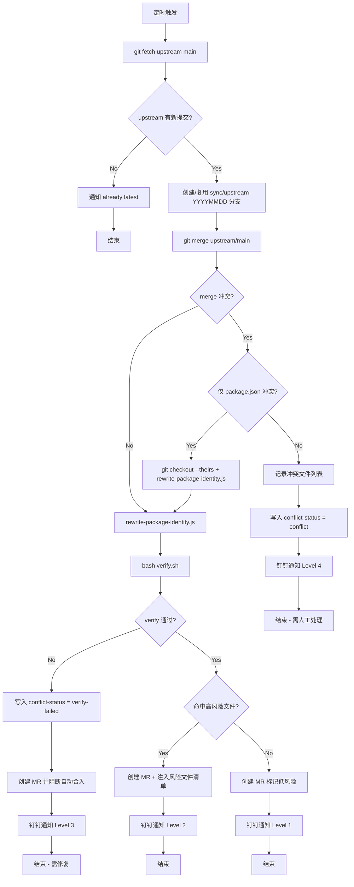

# Fork Patches

本目录包含 fork 相对于 upstream 的所有长期定制 patch。每个 patch 对应一个独立的功能维度。

## Upstream 同步方案

### 整体策略

采用 **Guarded Merge**（受保护的自动合并），而非 Patch Replay：

- CI 每天自动 fetch upstream/main 并尝试合入
- Git 正常 merge，保留 upstream 的自然演进
- 不自动解冲突，避免静默丢失 fork 定制
- 出现风险信号时升级人工或 agent 处理
- 通过 `verify.sh` + manifest 保护关键业务能力

### 分级处理

| Level | 条件                       | 自动行为                      | 人工介入         |
| ----- | -------------------------- | ----------------------------- | ---------------- |
| 0     | 无 upstream 新提交         | 跳过，通知 already latest     | 不需要           |
| 1     | merge 成功，guard 通过     | 创建 MR，标记低风险           | 通常不需要       |
| 2     | merge 成功，命中高风险文件 | 创建 MR，列出重点 review 文件 | review 重点文件  |
| 3     | merge 成功，guard 测试失败 | 创建 MR 并阻断自动合入        | agent 或人工修复 |
| 4     | Git merge conflict         | 停止，输出冲突报告            | agent 或人工处理 |

### CI 自动同步流程



**文字摘要：**

```
每天定时触发 .aoneci/upstream-sync-merge.yml:
  1. git fetch upstream main
  2. 检查 upstream 是否有新提交
  3. 创建/复用 sync/upstream-YYYYMMDD 分支
  4. git merge upstream/main
  5. 确定性解决 package.json 冲突（--theirs + rewrite-package-identity.js）
  6. 运行 verify.sh 检测 fork 定制是否丢失
  7. 创建/更新 sync MR，注入高风险文件清单
  8. 钉钉通知结果
```

### 本地手动同步（Patch Replay 模式）

适用于需要精细控制的场景：

```bash
bash .fork/sync-upstream.sh
# 流程: unapply patches → merge upstream → re-apply patches → verify → commit
```

## Patch 跟踪表

| #    | Patch                         | 功能说明                                        | 负责人       | 关联 MR                                                                                                                                            |
| ---- | ----------------------------- | ----------------------------------------------- | ------------ | -------------------------------------------------------------------------------------------------------------------------------------------------- |
| 0001 | branding-header               | DataWorks DataAgent CLI 品牌标识                | 继风         | [#1](https://code.alibaba-inc.com/alishu/qwen-code/codereview/26585259), [#4](https://code.alibaba-inc.com/alishu/qwen-code/codereview/26585660)   |
| 0002 | branding-tips                 | DataWorks 启动提示和 beta 引导                  | 继风, 秦奇   | [#11](https://code.alibaba-inc.com/alishu/qwen-code/codereview/26668680), [#13](https://code.alibaba-inc.com/alishu/qwen-code/codereview/26675235) |
| 0003 | i18n-dataworks                | DataWorks 专有 i18n 占位符和示例                | 今井         | [#50](https://code.alibaba-inc.com/alishu/qwen-code/codereview/26907000)                                                                           |
| 0004 | dsw-oauth-redirect            | DSW 环境 MCP OAuth 重定向改写                   | 克竟         | [#100](https://code.alibaba-inc.com/alishu/qwen-code/codereview/27413710)                                                                          |
| 0005 | osc8-internal                 | 内部终端 OSC8 超链接兼容                        | 克竟         | —                                                                                                                                                  |
| 0006 | dingtalk-channel-enhancements | 钉钉 Channel 卡片/Markdown/路由增强             | 沅沅         | [#116](https://code.alibaba-inc.com/alishu/qwen-code/codereview/27639454)                                                                          |
| 0007 | feishu-channel                | 飞书 Channel 集成                               | 沅沅         | [#107](https://code.alibaba-inc.com/alishu/qwen-code/codereview/27532149)                                                                          |
| 0009 | claude-websearch-compat       | Claude WebSearch 转换兼容                       | 今井         | —                                                                                                                                                  |
| 0010 | build-single-bundle           | 单文件 bundle 输出 + feishu 构建顺序            | 今井, 胡玮文 | —                                                                                                                                                  |
| 0011 | test-fork-adaptations         | 测试适配（OAuth 菜单、Aone CI、Node v22 guard） | 今井         | —                                                                                                                                                  |

### 已退休 Patches

| #                                  | 原因                                |
| ---------------------------------- | ----------------------------------- |
| ~~0008~~ dynamic-swarm-tool        | upstream 已 revert，fork 也不再使用 |
| ~~0012~~ dashscope-internal-origin | upstream 已有等价实现（PR #4157）   |

## Fork 基础设施文件

除 patches 外，以下文件也是 fork 同步保护机制的组成部分：

### `.fork/` 目录

| 文件                          | 用途                                                  |
| ----------------------------- | ----------------------------------------------------- |
| `manifest.json`               | Fork 定制声明：patch 定义、路径、packageIdentity 映射 |
| `apply.sh`                    | 按 series 顺序 apply 所有 patch                       |
| `unapply.sh`                  | 反向撤销所有 patch（sync 前使用）                     |
| `sync-upstream.sh`            | 本地 patch replay 同步流程                            |
| `verify.sh`                   | 检测 fork 定制是否丢失（签名行匹配）                  |
| `refresh-patch.sh`            | upstream 变动后刷新某个 patch                         |
| `create-patch.sh`             | 从当前 diff 创建新 patch                              |
| `generate-patches.js`         | 从 manifest 定义自动生成 patch 文件                   |
| `rewrite-package-identity.js` | sync 时重写 package.json 的 name/registry             |

### `.aoneci/` CI 相关

| 文件                             | 用途                          |
| -------------------------------- | ----------------------------- |
| `upstream-sync-merge.yml`        | 每日自动同步 CI pipeline 定义 |
| `scripts/send-dingtalk-alert.js` | 同步结果钉钉通知              |
| `scripts/build-standalone-ci.sh` | Standalone 产物构建脚本       |

### `scripts/` fork-only 脚本

| 文件                         | 用途                       |
| ---------------------------- | -------------------------- |
| `regen-fork-patches.sh`      | 重新生成所有 patch 文件    |
| `publish-packages.js`        | 内部 npm 发布              |
| `prepare-cli-for-publish.js` | 发布前准备 CLI 产物        |
| `copy-to-package.sh`         | 复制 bundle 产物到 package |
| `build-standalone.sh`        | 本地 standalone 构建       |
| `install-standalone.sh`      | Standalone 安装脚本        |
| `update-qwen-binary.sh`      | 升级 qwen 二进制           |

## 已合入 MR 完整覆盖情况（76 个）

以下列出所有合入的 MR 及其 patch 覆盖状态，按 iid 排序。

| MR                                                                        | 标题                                                    | 作者 | 覆盖状态              |
| ------------------------------------------------------------------------- | ------------------------------------------------------- | ---- | --------------------- |
| [#1](https://code.alibaba-inc.com/alishu/qwen-code/codereview/26585259)   | feat: customize branding for DataWorks DataAgent        | 继风 | 0001                  |
| [#2](https://code.alibaba-inc.com/alishu/qwen-code/codereview/26585513)   | fix: remove trailing space in header                    | 继风 | 0001                  |
| [#3](https://code.alibaba-inc.com/alishu/qwen-code/codereview/26585642)   | publish dataworks scope npm                             | 今井 | packageIdentity       |
| [#4](https://code.alibaba-inc.com/alishu/qwen-code/codereview/26585660)   | feat: update ASCII logo for DataWorks branding          | 继风 | 0001                  |
| [#6](https://code.alibaba-inc.com/alishu/qwen-code/codereview/26626511)   | 新增精简模式切换                                        | 秦奇 | upstream 已有等价实现 |
| [#10](https://code.alibaba-inc.com/alishu/qwen-code/codereview/26668570)  | feat: dataworks tips                                    | 继风 | 0002                  |
| [#11](https://code.alibaba-inc.com/alishu/qwen-code/codereview/26668680)  | feat: dataworks tips                                    | 继风 | 0002                  |
| [#12](https://code.alibaba-inc.com/alishu/qwen-code/codereview/26669574)  | refactor: compact tool group display                    | 秦奇 | upstream 已有等价实现 |
| [#13](https://code.alibaba-inc.com/alishu/qwen-code/codereview/26675235)  | refactor: update tips message                           | 秦奇 | 0002                  |
| [#14](https://code.alibaba-inc.com/alishu/qwen-code/codereview/26675865)  | update message folding style                            | 秦奇 | upstream 已有等价实现 |
| [#15](https://code.alibaba-inc.com/alishu/qwen-code/codereview/26688249)  | feat(cli): keep user shell commands expanded            | 秦奇 | upstream 已有等价实现 |
| [#16](https://code.alibaba-inc.com/alishu/qwen-code/codereview/26706519)  | fix(permissions): env-prefixed shell command matching   | 今井 | upstream 已合入       |
| [#17](https://code.alibaba-inc.com/alishu/qwen-code/codereview/26710182)  | fix: guard mid-turn drain against cancelled turns       | 今井 | upstream 已有等价实现 |
| [#18](https://code.alibaba-inc.com/alishu/qwen-code/codereview/26714246)  | feat: delete model show                                 | 继风 | upstream 已有等价实现 |
| [#19](https://code.alibaba-inc.com/alishu/qwen-code/codereview/26714297)  | refactor: remove unused imports in Header               | 今井 | 0001                  |
| [#21](https://code.alibaba-inc.com/alishu/qwen-code/codereview/26716883)  | fix(followup): prevent tool call UI leak                | 今井 | fork-only 新功能      |
| [#22](https://code.alibaba-inc.com/alishu/qwen-code/codereview/26716903)  | feat(cli): add queue input editing via Up arrow         | 今井 | upstream 已有等价实现 |
| [#23](https://code.alibaba-inc.com/alishu/qwen-code/codereview/26716904)  | feat(core): intelligent tool parallelism                | 今井 | upstream 已有等价实现 |
| [#24](https://code.alibaba-inc.com/alishu/qwen-code/codereview/26716905)  | feat(core): mid-turn queue drain for agent execution    | 今井 | upstream 已有等价实现 |
| [#27](https://code.alibaba-inc.com/alishu/qwen-code/codereview/26718190)  | feat(prompt): dangerous actions behavior guidance       | 今井 | upstream 已有等价实现 |
| [#28](https://code.alibaba-inc.com/alishu/qwen-code/codereview/26737689)  | fix(cli): get all packages/cli unit tests passing       | 清羽 | 0011                  |
| [#29](https://code.alibaba-inc.com/alishu/qwen-code/codereview/26741792)  | qwen-code 支持双输出模式                                | 秦奇 | upstream 已有等价实现 |
| [#31](https://code.alibaba-inc.com/alishu/qwen-code/codereview/26744727)  | refactor: update copy script path structure             | 秦奇 | fork-only 脚本        |
| [#32](https://code.alibaba-inc.com/alishu/qwen-code/codereview/26751508)  | fix(cli): cherry-pick verbose/compact mode improvements | 秦奇 | upstream 已有等价实现 |
| [#34](https://code.alibaba-inc.com/alishu/qwen-code/codereview/26762123)  | fix(build): fix webui types and eslint errors           | 今井 | fork-only 构建修复    |
| [#35](https://code.alibaba-inc.com/alishu/qwen-code/codereview/26767373)  | 发布正式版                                              | 秦奇 | release               |
| [#36](https://code.alibaba-inc.com/alishu/qwen-code/codereview/26767752)  | fix(vscode-ide-companion): unblock test suite           | 清羽 | 0011                  |
| [#39](https://code.alibaba-inc.com/alishu/qwen-code/codereview/26807359)  | 构建脚本优化                                            | 今井 | fork-only 脚本        |
| [#40](https://code.alibaba-inc.com/alishu/qwen-code/codereview/26807367)  | fix: persist ProceedAlways in compact mode              | 今井 | upstream 已有等价实现 |
| [#41](https://code.alibaba-inc.com/alishu/qwen-code/codereview/26819487)  | chore: sync upstream (399 commits - 0.14.3)             | 今井 | upstream sync         |
| [#42](https://code.alibaba-inc.com/alishu/qwen-code/codereview/26819585)  | style: quote workflow job names                         | 今井 | fork-only CI          |
| [#43](https://code.alibaba-inc.com/alishu/qwen-code/codereview/26837934)  | fix(core): fallback after empty stream retries          | 今井 | upstream 已合入       |
| [#44](https://code.alibaba-inc.com/alishu/qwen-code/codereview/26843438)  | build: add npm publish workflow                         | 今井 | fork-only 脚本        |
| [#47](https://code.alibaba-inc.com/alishu/qwen-code/codereview/26881335)  | 构建 qwen code 打包的二进制脚本                         | 今井 | fork-only 脚本        |
| [#48](https://code.alibaba-inc.com/alishu/qwen-code/codereview/26889902)  | fix(dingtalk): prioritize senderStaffId                 | 今井 | 0006                  |
| [#49](https://code.alibaba-inc.com/alishu/qwen-code/codereview/26904912)  | refactor: clean up bundle-publish branch                | 今井 | 0010                  |
| [#50](https://code.alibaba-inc.com/alishu/qwen-code/codereview/26907000)  | fix(i18n): restore DataWorks placeholder and tips       | 今井 | 0003                  |
| [#52](https://code.alibaba-inc.com/alishu/qwen-code/codereview/26921615)  | fix(core): allow thought-only responses in GeminiChat   | 今井 | upstream 已合入       |
| [#53](https://code.alibaba-inc.com/alishu/qwen-code/codereview/26938960)  | chore: sync upstream (56 commits - 0.14.5)              | 今井 | upstream sync         |
| [#54](https://code.alibaba-inc.com/alishu/qwen-code/codereview/26940867)  | feat(core): integrate upstream agent features           | 今井 | upstream sync         |
| [#55](https://code.alibaba-inc.com/alishu/qwen-code/codereview/26940966)  | refactor(mcp-oauth): move copy hint                     | 克竟 | 0004                  |
| [#58](https://code.alibaba-inc.com/alishu/qwen-code/codereview/26959860)  | feat(cli): Add OAuth flags to mcp add                   | 克竟 | 0004                  |
| [#60](https://code.alibaba-inc.com/alishu/qwen-code/codereview/26972646)  | fix: align DualOutputBridge with upstream               | 今井 | upstream sync         |
| [#61](https://code.alibaba-inc.com/alishu/qwen-code/codereview/26974885)  | fix: align StreamJsonOutputAdapter with upstream        | 今井 | upstream sync         |
| [#62](https://code.alibaba-inc.com/alishu/qwen-code/codereview/26975295)  | fix: align cli/config.ts with upstream                  | 今井 | upstream sync         |
| [#63](https://code.alibaba-inc.com/alishu/qwen-code/codereview/26976368)  | fix: align gemini.tsx with upstream                     | 今井 | upstream sync         |
| [#64](https://code.alibaba-inc.com/alishu/qwen-code/codereview/26976669)  | fix: align mcp/add.test.ts with upstream                | 今井 | upstream sync         |
| [#65](https://code.alibaba-inc.com/alishu/qwen-code/codereview/26977267)  | chore: sync upstream 2026-04-20 (48 commits)            | 今井 | upstream sync         |
| [#66](https://code.alibaba-inc.com/alishu/qwen-code/codereview/26978689)  | feat(ui): Header 展示当前 model 名称                    | 今井 | upstream 已有等价实现 |
| [#69](https://code.alibaba-inc.com/alishu/qwen-code/codereview/26985929)  | fix(build): bundle i18n locales into dist/              | 秦奇 | 0010                  |
| [#71](https://code.alibaba-inc.com/alishu/qwen-code/codereview/26996251)  | fix(mcp): OAuth URL clickable when wrapped              | 克竟 | 0004                  |
| [#72](https://code.alibaba-inc.com/alishu/qwen-code/codereview/27016717)  | chore(release): bump version to 0.14.7                  | 今井 | release               |
| [#74](https://code.alibaba-inc.com/alishu/qwen-code/codereview/27071384)  | refactor: BFF endpoint for OAuth redirect               | 克竟 | 0004                  |
| [#75](https://code.alibaba-inc.com/alishu/qwen-code/codereview/27074746)  | fix(cli): stabilize startup tip across remounts         | 秦奇 | 0002                  |
| [#80](https://code.alibaba-inc.com/alishu/qwen-code/codereview/27202180)  | test(cli): 精简 CLI 定制测试修复                        | 今井 | 0011                  |
| [#82](https://code.alibaba-inc.com/alishu/qwen-code/codereview/27202215)  | chore(release): bump version to 0.14.8                  | 今井 | release               |
| [#84](https://code.alibaba-inc.com/alishu/qwen-code/codereview/27240813)  | test(cli): pre-resolve AppContainer sync conflict       | 今井 | 0011                  |
| [#85](https://code.alibaba-inc.com/alishu/qwen-code/codereview/27247735)  | chore: upstream sync 2026-05-07 (4889 commits)          | 今井 | upstream sync         |
| [#86](https://code.alibaba-inc.com/alishu/qwen-code/codereview/27270879)  | fix(cli): validate model slash command arguments        | 今井 | upstream 已合入       |
| [#87](https://code.alibaba-inc.com/alishu/qwen-code/codereview/27271078)  | fix(cli): unfreeze Ctrl+O compact-mode toggle           | 秦奇 | upstream 已有等价实现 |
| [#88](https://code.alibaba-inc.com/alishu/qwen-code/codereview/27272361)  | Merge dataworks-20260508 into feat/test-release         | 今井 | branch merge          |
| [#91](https://code.alibaba-inc.com/alishu/qwen-code/codereview/27317082)  | Sync QwenLM/qwen-code main 20260511                     | 今井 | upstream sync         |
| [#92](https://code.alibaba-inc.com/alishu/qwen-code/codereview/27359639)  | fix: put ding talk card                                 | 沅沅 | 0006                  |
| [#93](https://code.alibaba-inc.com/alishu/qwen-code/codereview/27382776)  | Merge sync/upstream-20260511                            | 今井 | upstream sync         |
| [#95](https://code.alibaba-inc.com/alishu/qwen-code/codereview/27384835)  | feat(cli): wrap markdown links in OSC 8                 | 克竟 | 0005                  |
| [#96](https://code.alibaba-inc.com/alishu/qwen-code/codereview/27385182)  | fix: update card bug and add stop btn                   | 沅沅 | 0006                  |
| [#97](https://code.alibaba-inc.com/alishu/qwen-code/codereview/27386500)  | chore: upstream sync 2026-05-14 (40 commits)            | 今井 | upstream sync         |
| [#98](https://code.alibaba-inc.com/alishu/qwen-code/codereview/27399741)  | 优化发布脚本                                            | 今井 | fork-only 脚本        |
| [#100](https://code.alibaba-inc.com/alishu/qwen-code/codereview/27413710) | feat: add default OAuth redirect URI builder            | 克竟 | 0004                  |
| [#101](https://code.alibaba-inc.com/alishu/qwen-code/codereview/27416044) | fix(cli): restore alishu OSC 8 signals                  | 克竟 | 0005                  |
| [#104](https://code.alibaba-inc.com/alishu/qwen-code/codereview/27523343) | fix(ci): add always:true to schedule trigger            | 今井 | fork-only CI          |
| [#105](https://code.alibaba-inc.com/alishu/qwen-code/codereview/27524072) | fix(core): extend DashScope provider detection          | 今井 | upstream 已合入       |
| [#106](https://code.alibaba-inc.com/alishu/qwen-code/codereview/27524077) | fix: remove built-in web_search tool                    | 今井 | 0009                  |
| [#107](https://code.alibaba-inc.com/alishu/qwen-code/codereview/27532149) | feishu channel                                          | 沅沅 | 0007                  |
| [#113](https://code.alibaba-inc.com/alishu/qwen-code/codereview/27579065) | fix(build): tree-shake React reconciler dev build       | 今井 | fork-only 构建修复    |
| [#116](https://code.alibaba-inc.com/alishu/qwen-code/codereview/27639454) | fix(dingtalk): remove default cardTemplateId            | 沅沅 | 0006                  |

> **覆盖状态说明**:
>
> - `0001`–`0011`: 对应 patch 编号，该 MR 的改动受 patch 保护
> - `packageIdentity`: 由 `rewrite-package-identity.js` 在 sync 时自动处理
> - `upstream 已有等价实现`: fork 先做的功能，upstream 后来也实现了，当前无 delta
> - `upstream 已合入`: fork 的修复已被 upstream 采纳（PR 合入 GitHub）
> - `upstream sync`: 对齐 upstream 的 MR，不是 fork 定制
> - `fork-only 脚本/CI/构建修复/新功能`: 仅存在于 fork 的文件，upstream merge 不会触碰
> - `release`: 版本发布，不涉及源码差异
> - `branch merge`: 分支合并操作

## 维护指南

### 新增 patch

1. 在 `.fork/manifest.json` 的 `definitions` 中添加 patch 定义
2. 运行 `bash scripts/regen-fork-patches.sh --write` 生成 patch 文件
3. 更新本表格，填写负责人和 MR 链接

### 验证 patch 覆盖

```bash
# 检查所有 fork commit 的改动是否仍在当前代码中
VERBOSE=1 bash .fork/verify.sh

# 检查 patch 文件与 manifest 一致
node .fork/generate-patches.js --check
```

### 刷新 patch（upstream 变动导致 patch 无法 apply 时）

```bash
bash .fork/refresh-patch.sh <patch-name>
```

### 判断新 MR 是否需要 patch

合入 main 的 MR 满足以下**所有条件**时需要新增/更新 patch：

1. 改动的文件在 upstream 中也存在（fork-only 新文件不需要）
2. 改动内容与 upstream 不同（如果 upstream 已有等价实现则不需要）
3. 不属于 packageIdentity 管理范围（name/registry 由脚本自动处理）
