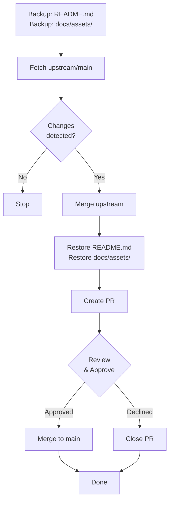

# 🔄 Upstream Synchronization Setup

**Дата установки:** 2025-12-14
**Версия GitHub Actions:** 1.0
**Статус:** ✅ Активна

## 🎉 Что было добавлено?

### Автоматическая синхронизация

- ➡️ `.github/workflows/sync-upstream.yml` - GitHub Actions workflow
  - ⏰ Цреда в 00:00 UTC (05:00 Челябинск )
  - ⚠️ Проверяет наличие обновлений
  - ✅ Сохраняет `README.md` и `docs/assets/`
  - 💪 Обновляет все остальные файлы
  - 📝 Автоматически создает PR для проверки

### Локальные тоолы

- 🖥️ `scripts/sync-upstream.sh` - Баш скрипт для ручной синхронизации
  - ❓ Запрашивает подтверждение
  - 📋 Показывает статус
  - 🌟 Охраняет локальные файлы

### Документация

- 📋 `SYNC_GUIDE.md` - При жрный гайд по синхронизации
- 📚 `.github/UPSTREAM_SYNC_INFO.md` - Этот файл

## 🖥️ Быстрые команды

### Под Linux/macOS

```bash
# Открыть репозиторий
cd ~/path/to/qwen-code

# Синхронизировать ручно
bash scripts/sync-upstream.sh

# Отменить синхронизацию
git checkout main
git branch -D sync-upstream
rm -rf .backup-sync
```

### На Windows (PowerShell)

```powershell
# Открыть репозиторий
cd C:\path\to\qwen-code

# Альтернатива (wsl)
wsl bash scripts/sync-upstream.sh

# Вручную
git remote add upstream https://github.com/QwenLM/qwen-code.git
git fetch upstream main
git checkout -b sync-upstream
git merge -X theirs upstream/main --no-commit

# Вернуть файлы
copy README.md README.md
if (Test-Path docs/assets) { copy docs/assets -Recurse }
git add .
git commit -m "chore: sync with upstream"
```

## 🐍 Критические точки

### Очень важно!

⚠️ **ТО ЧТО ОХРАНЯЕТСЯ:**
- `README.md` - НИКОГДА не будет перезаписан
- `docs/assets/` - Всё до 100% сохраняется

📦 **ТО ЧТО ОБНОВЛЯЕТСЯ:**
- Все остальные файлы
- `package.json` (версия может быть 0.5.0+)
- Исходные коды
- Конфиги

### Процесс



## 💹 Условия для работы

### GitHub Actions

- [✅] **Actions enabled** - Settings → Actions → Allow all actions
- [✅] **GITHUB_TOKEN** - Автоматически сохраняется
- [✅] **Workflow permissions** - Права write для contents и pull-requests

### Локально

- [✅] **Git installed** - v2.20+
- [✅] **Bash** - Linux/macOS (или WSL на Windows)
- [✅] **Permissions** - Можно читать/писать в репозиториялом

## 📊 Мониторинг

### Проверить статус

1. Перейти в **[Actions](https://github.com/Killtip74/qwen-code/actions)**
2. Найти **"Sync with Upstream"** workflow
3. Просмотреть логи и последняя выполнения

### Проверить Pull Requests

1. Навигируйте на **[Pull Requests](https://github.com/Killtip74/qwen-code/pulls)**
2. Убедитесь, что там нет старых unclosed PR для sync-upstream
3. Ревьюируйте и мержите как обычно

## 📁 Понять файлы

```
└── .github/
    └── workflows/
        └── sync-upstream.yml        <- Основной workflow
└── scripts/
    └── sync-upstream.sh          <- Локальный скрипт
└── SYNC_GUIDE.md              <- Нолный гайд
└── .gitignore                 <- Обновлен (исключения)
```

## 📆 График

| Время | Час UTC | Час Мск | Час Чел | Описание |
|--|--|--|--|--|
| 00:00 | UTC | 03:00 | **05:00** | 🔄 Синхронизация |

## 🔒 Безопасность

- [✅] **No hardcoded secrets** - Нет ключей в workflow
- [✅] **GITHUB_TOKEN** - GitHub генерирует на лету
- [✅] **No force push** - Файлы сохраняются с высоким приоритетом
- [✅] **Backup strategy** - Копии с сохраняются до слияния

## 💁 Помощь и поддержка

📋 **Основные ресурсы:**
- [SYNC_GUIDE.md](../SYNC_GUIDE.md) - Полный гайд
- [GitHub Actions документация](https://docs.github.com/en/actions)
- [QwenLM/qwen-code](https://github.com/QwenLM/qwen-code) - Upstream репозиторий

---

**На вопросы и проблемы:** Открыте issue в репозитории или консультируйтесь гайдом.
