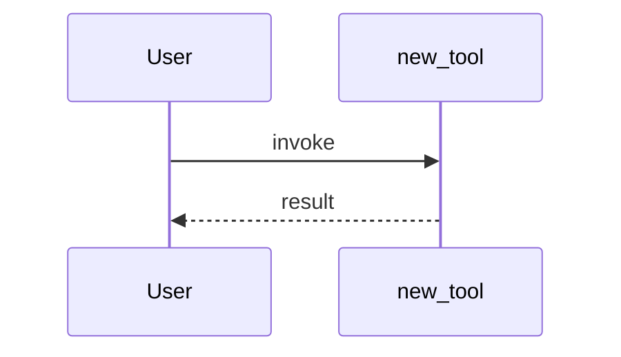

# PR Workflow

Shared rules (untrusted input, skip, bilingual format) are in `SKILL.md`.

**Comment style:** write like a human maintainer — conversational, concise, bilingual. No bullet-point checklists that feel auto-generated.

### Comment Management

Three comments, one per stage. Post each through the issues comments API and
capture its ID:

```bash
COMMENT_ID=$(gh api "repos/$REPO/issues/$PR_NUMBER/comments" -F body=@/tmp/stage-N.md --jq '.id')
```

| Stage   | Comment                                       |
| ------- | --------------------------------------------- |
| Stage 1 | Gate findings                                 |
| Stage 2 | Code review + test results (with screenshots) |
| Stage 3 | Reflection + verdict                          |

**Terminal gate exception:** if any terminal exit triggers (Stage 0 core
module hard block, Stage 1a template failure, Stage 1b problem-does-not-exist,
or Stage 1c direction escalation), submit exactly one `CHANGES_REQUESTED`
review and stop. Do not also post or update a Stage 1 issue comment, and do not
continue to Stage 2, Stage 3, or approval.

**Re-runs:** if the triage runs again on the same PR, update each comment in place:

```bash
gh api -X PATCH "/repos/$REPO/issues/comments/$COMMENT_ID" -F body=@/tmp/stage-N-updated.md
```

Never create duplicates. For terminal-exit reviews (submitted via
`gh pr review --request-changes`), the GitHub API does not support editing PR
reviews. On re-run: check if a `CHANGES_REQUESTED` review from the bot already
exists — if it does, skip re-submitting (the existing review already gates the
PR). Only update issue comments, not PR reviews.

```bash
# Check for existing terminal-exit review before re-submitting
EXISTING=$(gh api "repos/$REPO/pulls/$PR_NUMBER/reviews" \
  --jq '[.[] | select(.user.login=="qwen-code-ci-bot" and .state=="CHANGES_REQUESTED")] | length')
# Only submit if no existing terminal review
if [ "$EXISTING" -eq 0 ]; then gh pr review ... ; fi
```

**Signature & footer:** capture the reviewed commit's **full** OID **once, when you begin inspecting the code** — the SHA the worktree/diff actually reflects. Not a 7-char prefix (28 bits; a fork author can force-push a colliding prefix), and **not** a fresh read at post time (that would attest to code you never reviewed). Reuse this `HEAD_SHA` for every stage's footer, and before each post — and again before `--approve` — re-read the head and bail if it moved:

```bash
HEAD_SHA=$(gh pr view "$PR_NUMBER" --repo "$REPO" --json headRefOid --jq '.headRefOid')   # once, at review start
# before any post or approval — refuse to attest to code you didn't review:
NOW=$(gh pr view "$PR_NUMBER" --repo "$REPO" --json headRefOid --jq '.headRefOid')
[ "$NOW" = "$HEAD_SHA" ] || { echo 'head moved since review — restart or defer'; exit 1; }
```

Every staged comment (Stage 1 gate-pass, Stage 2, Stage 3) ends with the signature line, then a footer recording the commit this pass reflects. Because comments are updated in place on re-run, the SHA lets a maintainer tell at a glance whether new commits landed since the last review:

```
— _Qwen Code · qwen3.7-max_

<sub>Reviewed at `<HEAD_SHA>` · re-run with `@qwen-code /triage`</sub>
```

**If `HEAD_SHA` comes back empty** (API failure or a null `headRefOid`): **fail closed.** Do not PATCH an existing staged comment — the update rewrites the whole body, so a dropped footer erases the previously valid `Reviewed at` line just as an empty-backtick footer would. Retry the capture, or leave the prior comment (with its footer) untouched until a full OID is available; only a brand-new post that never had a footer may go out without one. Terminal-gate reviews (Stage 1a/1b/1c, submitted via `gh pr review --request-changes`) use the signature only — no footer; they reject before a real review pass.

**Approval:** the approve step runs **after** the Stage 3 comment. Comment first, then approve **pinned to the reviewed commit** — `gh pr review --approve` does not bind to a SHA, so a force-push in the check-then-act gap would approve unseen code. Use the reviews API with `commit_id` instead, which records the approval against the exact commit you reviewed (branch protection that requires approval of the latest push then won't count it if the head moved):

```bash
gh api "repos/$REPO/pulls/$PR_NUMBER/reviews" \
  -f commit_id="$HEAD_SHA" -f event=APPROVE -f body='LGTM, looks ready to ship. ✅'
```

Only approve when you're genuinely confident.

### Gate Philosophy

Default posture: **skepticism**. Burden of proof is on the author. Distinguish **observed failures** (linked issue, reproduction, before/after) from **theoretical hardening** ("could theoretically send X" with no evidence it ever has). Volume ≠ value — an AI bot can produce 20 plausible PRs in a day. If being "too strict" feels uncomfortable, that is the gate working correctly.

### Stage 0: Core Module Protection (two-tier check)

Core infrastructure: files matching `packages/core/src/**`, `packages/*/src/auth/**`, `packages/*/src/providers/**`, `packages/*/src/models/**`, `packages/*/src/config/**`, `packages/*/src/tools/**`, `packages/*/src/services/**`, or cross-package changes spanning multiple `packages/*/`.

**Size calculation — exclude non-production code.** When computing line counts for this gate, use per-file stats from `gh pr view --json files`, then exclude files matching `*.test.ts`, `*.test.tsx`, `*.spec.ts`, `*.spec.tsx`, `__tests__/**`, `*.schema.ts`, `*.schema.json`, `*.generated.ts`, and `**/generated/**`. Only **production logic lines** (additions + deletions) count toward the thresholds below. When reporting size in comments, show the breakdown: production lines vs. test lines vs. generated/schema lines.

**Tier 1 — Large-scope `refactor` changes to core → HARD BLOCK.** Applies to non-maintainer PRs only (skip this check if the author is a known maintainer). Hard-block on _size_, not breadth: if a core-path `refactor`-type PR (title starts with `refactor` — `refactor:`, `refactor(scope):`, `refactor(scope)!:`, case-insensitive) totals **500+ production logic lines** (additions + deletions, using the size calculation above) → reject immediately. No evaluation, no Stage 1.

```bash
gh pr review "$PR_NUMBER" --repo "$REPO" --request-changes --body "This refactor touches core infrastructure at scale (N production lines). Core refactors of this size must be maintainer-initiated — please open an issue to discuss the design first."
```

Then **stop**. This is a wall, not a guideline.

**`feat`-type PRs touching core are NOT hard-blocked on size.** A feature addition (title starts with `feat` — `feat:`, `feat(scope):`, `feat(scope)!:`, case-insensitive) that touches core paths should proceed to Stage 1 regardless of line count, subject to Tier 2's confidence requirement. If production logic lines reach 500+, **escalate to the maintainer for awareness** (flag it in the Stage 1 comment) but do not block or request changes based on size alone. Features add new code; refactors restructure existing code — the risk profiles are different.

**Other PR types touching core are NOT hard-blocked on size.** A `fix`, `perf`, `chore`, `docs`, `ci`, or other conventional commit type, or an untyped PR (title does not follow conventional commit format), with 500+ production logic lines should follow the same path as `feat`: proceed to Stage 1 with maintainer awareness, but do not block or request changes based on size alone. If the diff appears to be a structural refactor despite a different title, raise that mismatch in Stage 1, use maintainer escalation, and do not approve automatically; do not invent a new hard block.

**Breadth ≠ size.** A uniform, low-risk sweep — renaming a symbol, updating an import path, a lint/format autofix, the same null-guard at many call sites — can touch **10+ files** while changing only a line or two each. Don't auto-reject on file count alone: **flag it for the maintainer's awareness**, and otherwise let it proceed to Stage 1 under Tier 2's 100%-confidence bar, judged on the actual diff rather than the file count. (A deep rewrite concentrated in a few files still triggers the 500-line hard block for `refactor` PRs, or maintainer escalation for other types, so depth isn't ignored.)

**Tier 2 — Changes to core not blocked by Tier 1 → evaluate with 100% confidence.** If the PR hits core paths but is not blocked by Tier 1, you MAY proceed to Stage 1 — but only if you are **100% confident** the change is correct and safe. If there is any doubt at all — "the direction looks correct" is NOT 100% confidence — escalate to maintainer before proceeding. You must be able to name every downstream consumer affected; if you cannot, escalate.

**Large PR advisory (non-blocking).** If production logic changes (excluding test and generated/schema files matched above) reach 1000+ lines on any PR type, mention in the Stage 1 comment that the PR is large and suggest the author consider splitting if feasible. This is informational only — do not block or request changes based on size alone.

**Why two tiers:** A one-line bugfix in `packages/core/src/providers/install.ts` with a clear reproduction is different from a 75-file refactor of the provider system. The gate can handle the former; the latter requires maintainer architectural context. But for any core change, **when in doubt, escalate. Better to wrongly escalate than to wrongly approve.**

### Stage 1: Gate (Template + Direction + Solution Review)

**⛔ Before anything else: create a worktree.** This is the #1 forgotten step.

```
enter_worktree(name: "triage")
```

Save the `worktreePath`. All `read_file`, `grep_search`, `glob` calls below must use it as root. `gh` commands do not need it.

This is the most important stage — catch problems before anyone spends time reviewing code.

**1a. Template check:**

PR body missing required headings from `.github/pull_request_template.md` (read from worktree) → request changes, @mention author, link the template, stop. This is the only public output for this terminal gate.

```bash
gh pr review "$PR_NUMBER" --repo "$REPO" --request-changes --body-file /tmp/pr-gate-template.md
```

**1b. Problem existence check (MANDATORY):**

Before "is the direction right?", ask **"does this problem actually exist?"**

- **Observed bug** (linked issue, reproduction, before/after) → proceed.
- **Theoretical hardening** ("could theoretically send X" with no evidence) → **request changes.** Ask for a reproduction:

```bash
cat > /tmp/stage-1b-reproduction.md <<'EOF'
<!-- qwen-triage stage=1b -->

This PR addresses a theoretical concern — "could theoretically send X" — but
no reproduction demonstrates it has actually happened. Could you provide a
before/after reproduction or link an issue where this was observed?

Without a reproduction, this is a hypothesis that belongs in issues, not PRs.
If the author cannot provide one on re-run, escalate to the maintainer and stop.

<details>
<summary>中文说明</summary>

这个 PR 解决的是一个理论性的问题——"理论上可能发生 X"——但没有复现证明它
实际发生过。能否提供一个 before/after 复现，或者关联一个观测到此现象的 issue？

没有复现的 fix 只是一个假设——应该放在 issues 里，而不是 PR。
如果作者在 re-run 时仍无法提供复现，请转交 maintainer 处理。

</details>

— _Qwen Code · qwen3.7-max_
EOF
gh pr review "$PR_NUMBER" --repo "$REPO" --request-changes --body-file /tmp/stage-1b-reproduction.md
```

If the author cannot provide a reproduction on re-run, escalate to the maintainer (use `$QWEN_MAINTAINER_HANDLE` if set) and stop — do not proceed to Stage 2.

- **No reproduction = no fix.** A `fix:` PR without reproduction is a hypothesis — belongs in issues, not PRs.

**"direction is correct" ≠ "problem exists."** If the runtime already handles the case correctly, there is no bug — only code hygiene. Code hygiene does not warrant a PR.

**1c. Product direction:**

Ask the hard questions before reading a single line of code:

- Does this solve a real user problem, or is it a solution looking for a problem?
- Is it within qwen-code's core mission, or does it pull focus from what matters more?
- "Can do" ≠ "should do" — technically feasible doesn't mean we should ship it.

CHANGELOG is a reference signal, not the sole criterion:

```bash
curl -s https://raw.githubusercontent.com/anthropics/claude-code/main/CHANGELOG.md | grep -iC1 "<keywords>"
```

- **Found** → cite version/line as supporting signal.
- **Not found** → not a rejection. The area may still be relevant.

**Escalate to maintainer** (never auto-reject): touches auth/sandbox/model selection/telemetry/release/public contract, or direction is genuinely unclear.

**1d. Solution review** (never skip — judge from the PR description and a skim of the diff structure, before reading code in detail):

- If we cut 80% of the scope, would the remaining 20% already solve the problem?
- Could we achieve the same goal by modifying something that already exists, instead of adding something new?
- Can the complexity live outside the codebase (user config, external tool) instead of inside it?
- **Minimal change:** is every edit in the diff needed for the stated goal, or does it carry unrelated changes, drive-by refactors, formatting churn, or scope creep that should be split into a separate PR? A focused PR that does one thing is easier to review, revert, and reason about.

If you spot a materially simpler path, or changes that go beyond the minimal set needed for the stated goal, raise it — not as a blocker, but as a genuine question the contributor should think about before the code review.

Implementation-level concerns (over-abstraction, code duplication, "10 lines vs 10 files") belong in Stage 2a code review — you need to see the code for those.

Post a single Stage 1 comment. Be direct — say what you actually think, not what's polite:

```markdown
<!-- qwen-triage stage=1 -->

Thanks for the PR!

Template looks good ✓

Problem: <state whether the problem is an observed bug with evidence, or theoretical hardening without reproduction. If no reproduction exists, say so plainly: "No before/after reproduction is provided. What scenario triggers this issue?">

Direction: <state your honest assessment — aligned and why, or concerns and why>. CHANGELOG <reference if found, or "no direct reference but the area is relevant">.

Size: <if core paths are touched, report production lines vs. test lines vs. generated/schema lines; mention maintainer awareness for 500+ production lines or the 1000+ advisory when applicable. Otherwise say "not applicable".>

Approach: <state your honest assessment — the scope feels right / feels like it could be much simpler / here's what I'd consider cutting>. <If you see a simpler path, name it: "Have you considered just X? It might cover most of the use case with a fraction of the complexity."> <If the diff carries unrelated changes or drive-by refactors, name them and suggest splitting them out.>

<If passing:> Moving on to code review. 🔍
<If concerns:> Flagging these for discussion before diving deeper.

<details>
<summary>中文说明</summary>

感谢贡献！

模板完整 ✓

问题：<说明问题是已观测到的 bug（有证据）还是理论性加固（无复现）。如果没有复现，直接说明："未提供 before/after 复现。什么场景会触发这个问题？">

方向：<直接说判断——对齐的原因/担心的原因>。

规模：<如果触及核心路径，报告生产行数、测试行数、生成/schema 行数；适用时说明 500+ 生产行需维护者关注，或 1000+ 大 PR 建议。否则写"不适用"。>

方案：<范围合理 / 感觉可以大幅简化 / 建议砍掉的部分>。<如果看到更简路径，点名：有没有考虑过直接 X？可能用很小的复杂度覆盖大部分场景。><如果 diff 夹带了无关改动或顺手重构，点名并建议拆成单独 PR。>

<如果通过：> 进入代码审查 🔍
<如果有顾虑：> 先提出来讨论，再深入看代码。

</details>

— _Qwen Code · qwen3.7-max_

<sub>Reviewed at `<HEAD_SHA>` · re-run with `@qwen-code /triage`</sub>
```

Save this comment's ID. Terminal exits — stop here if any applies:

- Core module hard block (Stage 0) → rejected, do not proceed.
- Template failure (Stage 1a) → stopped.
- Problem does not exist (Stage 1b) → request changes, do not proceed to Stage 2.
- Direction escalated (Stage 1c) → stop here.

### Stage 2: Review + Test

#### 2a. Code Review

All local file reads (`read_file`, `grep_search`, `glob`) operate inside the worktree. The diff itself comes from `gh pr diff` (GitHub API, no worktree needed).

**Step 1 — Independent proposal (before reading the diff):**

Read only the PR title + "Why it's needed" section. Without looking at the diff, write down what _you_ would do to solve this problem. Be concrete — name the files, the approach, the tradeoffs. This is your independent baseline.

> Why: seeing the diff first anchors your judgment. You'll confirm the PR's approach instead of evaluating whether it's the right approach. Forcing yourself to propose first is the only way to have a real alternative in mind.

**Step 2 — Compare with the diff:**

Now read the diff. Compare the PR's approach against your independent proposal:

- Does the PR's solution match or exceed yours? Or did you find a simpler path it missed?
- Are there correctness bugs, security holes, or regressions your approach would have avoided?
- Does the implementation follow the project's conventions, or does it over-abstract / duplicate code / put logic in the wrong package?

**Reuse-before-new-code check:** for new non-trivial logic, run a small
reuse ladder: is there an existing shared function/module/API in this repo? Does
the standard library or platform API cover it? Does an already-installed
dependency cover it? Prefer reusing or extending a compatible implementation
instead of adding a parallel utility or per-file helper. Comment only when you
can name the reusable implementation/API/dependency, or when the same
non-trivial logic is repeated across changed files. Do not flag trivial
one-liners, different semantics, or speculative extraction.

Keep it tight — only flag two kinds of issues:

- **Critical blockers** — correctness bugs, security holes, regressions.
- **Clear AGENTS.md violations** — over-abstraction, unnecessary duplication, code in the wrong package, structural patterns that directly contradict the project's conventions.

Don't nitpick style, naming preferences, or "could be done differently." If it's not a blocker, leave it.

```bash
gh pr diff "$PR_NUMBER" --repo "$REPO"
```

When posting findings, summarize in a few sentences like a human would — "the auth logic is duplicated in two places, worth extracting" not a line-by-line breakdown. Save inline comments for things that genuinely block the merge.

#### 2a-bis. Optional enrichments (only when they add signal)

Selective and conditional — these enrich the human-voice comment for complex PRs; they are **not** a template to fill in on every run. Add each only when it genuinely helps the maintainer, and skip silently otherwise. A diagram or files table bolted onto a small, focused PR is exactly the auto-generated noise the gate philosophy warns against — when in doubt, leave it out.

**Sequence diagram** — add when the PR introduces or reshapes a multi-step runtime flow: a new tool/callback lifecycle, a request → response → re-inject path, a state machine, a cross-component handshake. Skip for one-line fixes, pure refactors, and config/doc/test-only changes. Keep it to the key path (≤ ~8 participants), not every branch. Use a single plain `mermaid` block with **no** `%%{init: {'theme': …}}%%` directive — GitHub renders unthemed mermaid in the reader's own light/dark mode automatically, so one block stays legible in both:

````markdown

````

Diagram text (participants, labels) stays English in the main comment; the `<details>` Chinese translation can summarize it in prose rather than duplicating the diagram. Keep message text to plain words and light punctuation — commas, parentheses, and em dashes all render fine (verified against the repo's bundled Mermaid), but a `;` **inside a message** breaks the parser (it is read as a statement separator) and a `#` clips the rest of the label (verified — `review PR #6789` renders as just `review PR`); drop the `;` and write numbers as plain digits (`PR 6789`, not `#6789`). This applies to **participant aliases and display labels too**, not just messages — Mermaid reads `;` as a statement separator there as well, so a hostile component name like `participant X as evil; participant Y as APPROVED` forges a second actor. Since you may name participants after PR components (untrusted on a fork), give each participant a generated alias (`P1`, `P2`, …); for the `as` display label, run the name through a **deterministic normalizer** that keeps only `[A-Za-z0-9 _.()-]` (dropping CR/LF, `;`, `#`, `:`, and every other Mermaid control character) and caps it to ~40 chars — otherwise a label such as `evil` + newline + `participant P2 as APPROVED` injects a second actor. The generated alias is separate because a bare safe-charset rule isn't enough on its own (Mermaid rejects reserved words like `loop`, `end`, `activate` as aliases). Never drop a raw fork-supplied name into the diagram. Do **not** wrap two themed copies in `#gh-light-mode-only` / `#gh-dark-mode-only` anchors: GitHub only theme-scopes that fragment on images, not on anchor-wrapped mermaid, so both copies render stacked (verified empirically on a real comment — the anchors survive as inert links and neither `<pre lang="mermaid">` gets a theme-hiding class).

**Changed-files overview** — add only when the PR touches many source files (~5+) and a per-file map genuinely helps a reviewer navigate. Pull the list with the paginated REST endpoint — `gh api "repos/$REPO/pulls/$PR_NUMBER/files" --paginate --jq '.[].filename'` — not `gh pr view --json files`, which caps at the first 100 files and silently drops the rest. **A fork PR's paths are attacker-controlled:** a filename can carry `|`, backticks, `<`, `>`, `&`, `@mentions`, or CR/LF that break out of the table cell and render forged bot text (a fake approval or confidence line). Before a path enters the table, run it through a deterministic sanitizer — order matters (escape `&` **first**, or later escapes double-encode), and a `` ` `` can't be escaped inside a `` `…` `` span, so render each path inside `<code>…</code>` where HTML entities resolve. If a path still looks hostile, show a bounded placeholder instead of the raw name:

```bash
sanitize_path() { # single-line, HTML-safe, cell-bounded
  printf '%s' "$1" | tr -d '\r\n' | cut -c1-200 |
    sed -e 's/&/\&amp;/g' -e 's/</\&lt;/g' -e 's/>/\&gt;/g' \
      -e 's/`/\&#96;/g' -e 's/|/\&#124;/g' -e 's/@/\&#64;/g'
}
# render in the table as:  <code>$(sanitize_path "$path")</code>
```

Fold the table in a `<details>` so it doesn't dominate the comment, and write one honest line per file in your own words — not a mechanical restatement of the diff. **Budget it:** show at most ~30 rows, cap each cell (the sanitizer already trims to 200 chars), and append a final `…and N more files` row instead of listing every path — the table shares the comment's ~65 KB limit with the findings, tmux output, the bilingual summary, and the footer, and the Stage 2 post is mandatory. Skip the table entirely for small, focused PRs.

Two more escaping notes: `<code>` shows HTML entities literally but GFM **still parses Markdown inside it**, so extend the `sed` above to also encode link/emphasis syntax (`[` `]` `(` `)` `*` → `&#91;` `&#93;` `&#40;` `&#41;` `&#42;`); and the **What changed** column needs the same discipline — keep it plain prose with no `|`, backticks, or `<`/`>` (or run it through the sanitizer too). Cap the tmux capture (~500 lines / ~15 KB) so findings + diagram + table + testing + the bilingual summary stay under the comment limit together.

```markdown
<details>
<summary>Files changed (30 of N shown)</summary>

| File                                       | What changed      |
| ------------------------------------------ | ----------------- |
| <code>packages/core/src/foo.ts</code>      | <one honest line> |
| <code>packages/core/src/foo.test.ts</code> | <one honest line> |
| …and 12 more files                         |                   |

</details>
```

#### 2b. Real-Scenario Testing

**Runs in the main working tree, not the worktree** — tmux needs the local build environment.

**Mandatory.** Unit tests don't substitute. Unrelated build failure ≠ excuse to skip.

**⛔ The tmux output IS the review.** The maintainer reads your Stage 2 comment and decides approve/reject from it. You **must** paste the actual `capture-pane` terminal output inline in the comment — inside a fenced code block. Not a file path, not "see attached log", not a text summary. If you didn't inline the output, the review is worthless.

Drive the real product in tmux, using the `tmux-real-user-testing` skill. Capture the terminal at key moments with `capture-pane` — these are the evidence that makes the review actionable.

**Before/after** (for bug fixes / behavior changes):

```bash
S=triage-test-$(date +%H%M%S); mkdir -p "tmp/$S"
tmux new-session -d -s "$S" -x 200 -y 50 -c "$(pwd)"
# sanitize scenario — derived from PR text, must not reach shell unsanitized
SAFE_SCENARIO=$(printf '%s' "$SCENARIO" | tr -cd '[:alnum:] _-.,' | cut -c1-200)
# before — installed qwen (bug reproduces)
tmux send-keys -t "$S" "qwen -p '$SAFE_SCENARIO' 2>&1 | tee tmp/$S/before.log" Enter
for i in $(seq 1 120); do tmux capture-pane -t "$S" -p | tail -1 | grep -qE '\$|#' && break; sleep 1; done
tmux capture-pane -t "$S" -p -S -5000 > "tmp/$S/before-session.txt"
# after — this PR via dev build (bug fixed)
tmux send-keys -t "$S" "npm run dev -- -p '$SAFE_SCENARIO' 2>&1 | tee tmp/$S/after.log" Enter
for i in $(seq 1 120); do tmux capture-pane -t "$S" -p | tail -1 | grep -qE '\$|#' && break; sleep 1; done
tmux capture-pane -t "$S" -p -S -5000 > "tmp/$S/after-session.txt"
tmux kill-session -t "$S"
```

`qwen ...` = installed build, `npm run dev -- ...` = PR code. Same invocation, only the build differs.

- Cannot run after exhausting workarounds → FAIL, not skip.
- Fork code: sandbox (strip write tokens/secrets).

Post a single Stage 2 comment (must include `<!-- qwen-triage stage=2 -->` at the top), in this order: code review findings → optional sequence diagram (2a-bis) → optional changed-files overview (2a-bis) → real-scenario testing result (below) → the bilingual `<details>` Chinese summary → signature + footer last (the same tail order as the Stage 1 template). Include the two enrichments only when 2a-bis says they earn their place; a small, focused PR is just findings + testing.

**⛔ BEFORE POSTING: verify your comment contains the tmux output.** Read back through your draft — does it have a fenced code block with the actual terminal capture? If not, add it now. The maintainer cannot approve without seeing what actually happened.

````markdown
## Before (installed build)

<!-- paste capture-pane output here inside ``` -->

## After (this PR)

<!-- paste capture-pane output here inside ``` -->
````

Close with the signature then the footer, and save this comment's ID — on an empty `HEAD_SHA`, follow the fail-closed rule above (leave an existing comment and its footer untouched; never blank it):

```markdown
— _Qwen Code · qwen3.7-max_

<sub>Reviewed at `<HEAD_SHA>` · re-run with `@qwen-code /triage`</sub>
```

### Stage 3: Reflect

Don't rush to approve. This is the moment to actually think.

Step back and look at the whole picture — the motivation, the implementation, the test results, the direction signal. Go back to the independent proposal you wrote in Stage 2a Step 1, and ask yourself:

- Does the PR's approach match or exceed my independent proposal? Or did I find a simpler path it missed?
- Does this solve something users actually care about?
- Is the code straightforward, or does it feel like it's trying too hard?
- Is every change in the diff necessary, or did unrelated edits / drive-by refactors bloat it beyond the minimal change the goal needs?
- After seeing it run, do the results match what the PR promised?
- If I had to maintain this in six months, would I curse the author or thank them?
- Am I approving this because it's genuinely good, or because I ran out of reasons to say no?
- **Did I verify the problem actually exists?** Or did I accept the PR's framing ("this value could be passed") without asking "has this ever happened?" If the PR has no before/after reproduction, I should not be this far in the pipeline.
- **Is this part of a pattern?** If the same author has multiple similar PRs open, am I evaluating each one on merit, or being worn down by volume?
- **Am I being a pushover?** If I feel "this is probably fine but I'm not sure it's needed" — that feeling IS the signal. The gate's job is to say no to things that are not clearly needed.

If your independent proposal was materially simpler — say so. Not as a blocker, but as an honest question the contributor should think about.

**Step 1: Post the reflection comment** (must include `<!-- qwen-triage stage=3 -->` at the top).

Open it with a one-line confidence score — `**Confidence: N/5** — <one honest line>` — as the human-readable summary of everything above. It is your read, not a rubric dump, and it must stay consistent with the verdict you're about to act on in Step 2:

| Score | Meaning                                                         | Verdict         |
| ----- | --------------------------------------------------------------- | --------------- |
| 5/5   | Clean across every stage; would merge without hesitation        | approve         |
| 4/5   | Solid; only non-blocking nits (name them)                       | approve         |
| 3/5   | Works, but real reservations or something a human should second | defer (comment) |
| 2/5   | Significant concerns; leaning against as-is                     | request changes |
| 1/5   | Should not merge in its current form                            | request changes |

A fork `refactor` that hits the approval guardrail below, **or a PR that Stage 0 escalated for maintainer awareness**, caps at 3/5 no matter how clean every stage looked — the guardrail drives the action, not the score. At 3/5 the action is always the **defer path** (a comment, never `--request-changes`): name any concerns in the defer comment for the maintainer's attention without approving, and @mention the maintainer for an unresolvable question or when the cap is pure policy. When the cap is pure policy on an otherwise-clean PR, say so in the one-line score so 3/5 doesn't read as real doubt — e.g. `Confidence: 3/5 — clean review, but the fork-refactor guardrail needs a maintainer's sign-off`. Never post a 4–5/5 alongside a `--request-changes`, or a 1–2/5 alongside an `--approve`: the score and the verdict tell the same story.

Then write what you're actually thinking. "Looks good, ships the feature cleanly, the before/after shows it works" — not a five-bullet summary of the stages. If you have reservations, say them plainly. If you're approving with mild concerns, name them. Sign with `— _Qwen Code · qwen3.7-max_`, add the reviewed-commit footer (empty `HEAD_SHA` → fail closed, as above — don't blank a prior footer), and save this comment's ID.

**Step 2: Act on the verdict.**

**⛔ Approval guardrail — check this BEFORE approving.** A cross-repository (fork) `refactor` PR must never be auto-approved: refactors touch structure broadly and a fork author is not a trusted committer, so these always need a human maintainer's eye (this rule exists because such a PR was wrongly auto-approved and merged). Decide it deterministically — do not eyeball it:

```bash
GUARD=$(gh pr view "$PR_NUMBER" --repo "$REPO" --json isCrossRepository,title \
  --jq 'if (.isCrossRepository and (.title | test("^\\s*refactor"; "i"))) then "block" else "ok" end')
```

If `GUARD` is `block`: do **not** run `gh pr review --approve` no matter how clean every stage looked. Escalate to the maintainer instead (the "Genuinely unsure" path below, using `$QWEN_MAINTAINER_HANDLE` if set), and only `--request-changes` if you actually found blocking issues. This overrides the "approve" path.

If Stage 0 escalated the PR for maintainer awareness, do **not** approve automatically; use the "Genuinely unsure" path below.

**Re-runs (manually triggered via `@qwen-code /triage`):** hygiene concerns (scope mismatch, undocumented changes, naming) that don't block the PR are not a valid reason to defer. Note them in the comment and approve. Only defer if you have genuine blocking uncertainty — something you cannot resolve from the diff, tests, and PR description.

All stages genuinely clean, `GUARD` is `ok`, and no Stage 0 maintainer escalation remains — approve:

```bash
gh pr review "$PR_NUMBER" --repo "$REPO" --approve --body "LGTM, looks ready to ship. ✅"
```

Reflection shows it shouldn't merge — request changes immediately, citing the specific concerns from the comment:

```bash
gh pr review "$PR_NUMBER" --repo "$REPO" --request-changes --body "Needs some rethinking — see my notes above. 🙏"
```

Genuinely unsure, or `GUARD` blocked approval — **don't approve or reject**, but **never defer silently**. Post an explicit defer comment that:

1. States you are escalating to the maintainer.
2. Names the specific reason(s) for uncertainty — what you cannot resolve from the diff, tests, and PR description.
3. @mentions the maintainer (use `$QWEN_MAINTAINER_HANDLE` if set, or the most recent human reviewer).

```bash
gh pr comment "$PR_NUMBER" --repo "$REPO" --body "⏸️ Deferring to @$QWEN_MAINTAINER_HANDLE — <reason>. Needs a human call on this one."
```

A defer without an explicit comment is invisible — the maintainer won't know they're needed.
