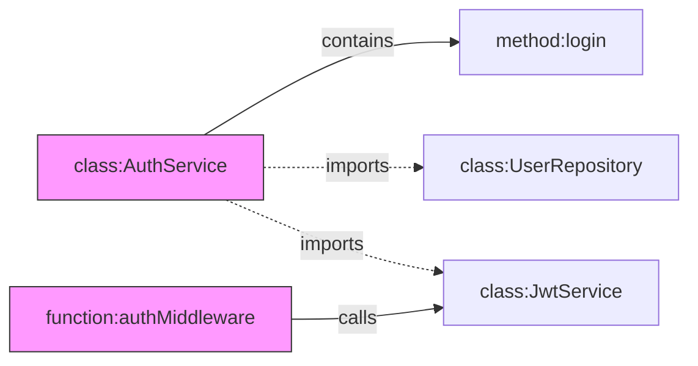

# Qwen Code - Codebase Index 设计文档

> **版本**: v1.4  
> **日期**: 2026-01-29  
> **状态**: 设计定稿

## 1. 概述

### 1.1 背景与目标

Qwen Code 是一个完全开源、轻量级、无后端的 AI Coding CLI 应用。为了增强 AI 对大型代码库的理解能力，我们计划引入 **Codebase Index** 功能，通过建立代码库的向量索引，实现基于语义的代码检索（RAG）和上下文增强。

**业务目标**：

- 解决 **FP2（错过高排名文档）**：通过混合检索确保关键代码被召回
- 解决 **FP4（未能提取）**：通过结构感知分块保持代码完整性
- 解决 **FP6（特异性不正确）**：通过联合语义嵌入提升跨语言/模糊查询能力
- 解决 **FP7（不完整）**：通过知识图谱实现跨文件依赖追踪

**技术目标**：

- 帮助 AI 理解大型代码库（10万+ 文件）的整体结构
- 提供 <500ms 的语义检索响应时间
- 实现低延迟、低资源占用的本地化索引方案
- 支持代码变更时的快速增量更新

### 1.2 设计原则

1. **本地化优先**：所有数据存储和计算都在本地完成，无需后端服务
2. **轻量级**：最小化内存（<500MB）和磁盘占用，不影响开发环境性能
3. **增量更新**：只处理变更的文件，避免全量重建
4. **非阻塞**：索引构建在后台 Worker 线程进行，不阻塞主交互流程
5. **纯 TypeScript**：使用纯 TypeScript + NAPI 实现，便于维护和扩展
6. **架构一致性**：遵循 qwen-code 现有的服务类设计模式和代码风格
7. **复用优先**：优先使用 qwen-code 现有的工具方法，避免重复造轮子

### 1.3 平台支持

> ⚠️ **当前版本仅支持 macOS 和 Linux 平台，不支持 Windows。**

由于 Zvec NAPI 原生模块的限制，Codebase Index 功能暂不支持 Windows 平台。在功能的各个入口处需要进行平台检查。

**支持的平台：**

- macOS (darwin) - x64, arm64
- Linux (linux) - x64, arm64

**不支持的平台：**

- Windows (win32) - 所有架构

**平台检查**：复用 qwen-code 现有的 `isWindows` 工具

```typescript
// 复用现有的平台工具
// 来源: packages/vscode-ide-companion/src/utils/platform.ts
// 或 packages/cli/src/ui/utils/platformConstants.ts

import { isWindows } from '../utils/platform.js';

// 在功能入口处直接使用 isWindows 进行检查:
if (isWindows) {
  // 返回不支持的错误信息
  return {
    type: 'message',
    messageType: 'error',
    content: '❌ Codebase Index 功能暂不支持 Windows 平台',
  };
}
```

---

## 2. 整体架构

### 2.1 系统架构图

```
┌──────────────────────────────────────────────────────────────────────────────┐
│                              Qwen Code CLI (Main Thread)                      │
├──────────────────────────────────────────────────────────────────────────────┤
│                                                                               │
│  ┌─────────────┐    ┌─────────────────┐    ┌────────────────────────────┐    │
│  │  /codebase  │───▶│   Retrieval     │───▶│     Context Builder        │    │
│  │   Command   │    │   Coordinator   │    │  (Token Budget Management) │    │
│  └─────────────┘    └─────────────────┘    └────────────────────────────┘    │
│        │                    │                           │                     │
│        │                    ▼                           ▼                     │
│        │           ┌─────────────────┐          ┌─────────────┐              │
│        │           │  Query Enhancer │          │     LLM     │              │
│        │           │ (Multi-Query)   │          │   Request   │              │
│        │           └─────────────────┘          └─────────────┘              │
│        │                    │                                                 │
│        │    ┌───────────────┼───────────────┐                                │
│        │    │               │               │                                 │
│        │    ▼               ▼               ▼                                 │
│        │ ┌──────┐     ┌──────────┐    ┌──────────┐                           │
│        │ │ BM25 │     │  Vector  │    │ Recently │     Hybrid Search         │
│        │ │ FTS  │     │  Search  │    │  Edited  │     with RRF Fusion       │
│        │ └──────┘     └──────────┘    └──────────┘                           │
│        │    │               │               │                                 │
│        │    └───────────────┴───────────────┘                                │
│        │                    │                                                 │
│        │                    ▼                                                 │
│        │           ┌─────────────────┐                                       │
│        │           │    Reranker     │  (Cross-Encoder, Optional)            │
│        │           └─────────────────┘                                       │
│        │                                                                      │
├────────┼──────────────────────────────────────────────────────────────────────┤
│        │                      IPC Channel (MessagePort)                       │
├────────┼──────────────────────────────────────────────────────────────────────┤
│        │                                                                      │
│        │                     Worker Thread (IndexWorker)                      │
│        ▼                                                                      │
│  ┌─────────────────────────────────────────────────────────────────────────┐ │
│  │                         IndexManager                                     │ │
│  │  ┌─────────────┐  ┌─────────────┐  ┌─────────────┐  ┌───────────────┐   │ │
│  │  │ FileScanner │  │   Chunker   │  │  Embedder   │  │ ChangeDetector│   │ │
│  │  │ (ripgrep)   │  │ (AST-based) │  │ (Qwen API)  │  │ (10min poll)  │   │ │
│  │  └─────────────┘  └─────────────┘  └─────────────┘  └───────────────┘   │ │
│  └─────────────────────────────────────────────────────────────────────────┘ │
│                                        │                                      │
├────────────────────────────────────────┼──────────────────────────────────────┤
│                                        │         Storage Layer                │
│                                        ▼                                      │
│  ┌─────────────────────────────────────────────────────────────────────────┐ │
│  │                          SQLite (better-sqlite3)                         │ │
│  │  ┌───────────────┐  ┌───────────────┐  ┌───────────────────────────┐    │ │
│  │  │  file_meta    │  │    chunks     │  │   fts_chunks (FTS5)       │    │ │
│  │  │  (hash, mtime)│  │ (content,line)│  │   (BM25 full-text)        │    │ │
│  │  └───────────────┘  └───────────────┘  └───────────────────────────┘    │ │
│  └─────────────────────────────────────────────────────────────────────────┘ │
│                                                                               │
│  ┌─────────────────────────────────────────────────────────────────────────┐ │
│  │                         Zvec (NAPI Binding)                              │ │
│  │  ┌───────────────────────────────────────────────────────────────────┐  │ │
│  │  │  Collection: codebase_vectors                                      │  │ │
│  │  │  - Dense Vector: content_embedding (1024 dim, HNSW, Cosine)       │  │ │
│  │  │  - Scalar Fields: chunk_id, file_path, branch                     │  │ │
│  │  └───────────────────────────────────────────────────────────────────┘  │ │
│  └─────────────────────────────────────────────────────────────────────────┘ │
│                                                                               │
└──────────────────────────────────────────────────────────────────────────────┘
```

### 2.2 核心模块职责

> **架构说明**：遵循 qwen-code 现有的服务类设计模式，使用 `*Service` 后缀命名服务类，接口使用 `I*` 前缀。核心模块放置在 `packages/core/src/indexing/`，CLI 集成放置在 `packages/cli/src/`。优先复用现有工具（如 `FileDiscoveryService`、`ripgrepUtils`、`isWindows` 等）。

| 模块                 | 所在线程 | 职责                                         | 关键类/文件                                          |
| -------------------- | -------- | -------------------------------------------- | ---------------------------------------------------- |
| **IndexService**     | Main     | 索引服务门面，管理 Worker 生命周期           | `packages/core/src/indexing/indexService.ts`         |
| **IndexManager**     | Worker   | 索引生命周期管理，协调各组件                 | `packages/core/src/indexing/indexManager.ts`         |
| **FileScanner**      | Worker   | 复用 `FileDiscoveryService` + `ripgrepUtils` | `packages/core/src/indexing/fileScanner.ts`          |
| **ChunkingService**  | Worker   | AST 分块 + 滑动窗口 fallback                 | `packages/core/src/indexing/chunkingService.ts`      |
| **EmbeddingService** | Worker   | 批量调用 Embedding API                       | `packages/core/src/indexing/embeddingService.ts`     |
| **ChangeDetector**   | Worker   | 定时轮询检测变更                             | `packages/core/src/indexing/changeDetector.ts`       |
| **RetrievalService** | Main     | 多路召回 + RRF 融合 + 图扩展                 | `packages/core/src/indexing/retrievalService.ts`     |
| **MetadataStore**    | Both     | SQLite 元数据 + FTS 存储                     | `packages/core/src/indexing/stores/metadataStore.ts` |
| **VectorStore**      | Both     | Zvec 向量存储                                | `packages/core/src/indexing/stores/vectorStore.ts`   |
| **GraphStore**       | Both     | RuVector 依赖图谱存储                        | `packages/core/src/indexing/stores/graphStore.ts`    |
| **EntityExtractor**  | Worker   | AST 实体提取（函数/类/模块）                 | `packages/core/src/indexing/entityExtractor.ts`      |
| **GraphTraverser**   | Main     | 图遍历与子图提取                             | `packages/core/src/indexing/graphTraverser.ts`       |

### 2.3 数据流

```
┌─────────────────────────────────────────────────────────────────────────────┐
│                           索引构建数据流                                     │
├─────────────────────────────────────────────────────────────────────────────┤
│                                                                              │
│  [文件系统]                                                                   │
│      │                                                                       │
│      ▼                                                                       │
│  FileScanner ──────────────────────────────────────────────────────────────▶ │
│  ├─ ripgrep 扫描 (并行, 排除 .gitignore/.qwenignore)                         │
│  ├─ 计算 SHA-256 hash                                                        │
│  └─ 输出: FileMetadata[]  (path, hash, mtime, size, language)               │
│      │                                                                       │
│      ▼  批量处理: 100 files/batch                                            │
│  Chunker ──────────────────────────────────────────────────────────────────▶ │
│  ├─ Tree-sitter AST 解析 (函数/类/模块边界)                                  │
│  ├─ 滑动窗口 fallback (512 tokens, 50 tokens overlap)                       │
│  └─ 输出: Chunk[] (content, startLine, endLine, type, metadata)             │
│      │                                                                       │
│      ▼  批量处理: 20 chunks/batch, 10 并发 (p-map)                          │
│  Embedder ──────────────────────────────────────────────────────────────────▶│
│  ├─ 调用 BaseLlmClient.generateEmbedding()                                   │
│  ├─ 使用 text-embedding-v4 (1024 dim)                                        │
│  ├─ 并发控制: maxConcurrency=10, timeout=30s                                 │
│  └─ 输出: number[][] (embeddings)                                            │
│      │                                                                       │
│      ▼  批量写入: 500 records/batch                                          │
│  Storage ──────────────────────────────────────────────────────────────────▶ │
│  ├─ SQLite: file_meta, chunks, fts_chunks                                    │
│  └─ Zvec: collection.insert() with vectors                                   │
│                                                                              │
└─────────────────────────────────────────────────────────────────────────────┘
```

---

## 3. 功能设计

### 3.1 索引构建

#### 3.1.1 触发时机与开关控制

```typescript
// packages/core/src/indexing/types.ts

interface IndexConfig {
  enabled: boolean; // 总开关，关闭时不进行任何索引操作
  autoIndex: boolean; // 是否自动索引新项目
  pollIntervalMs: number; // 变更检测间隔，默认 600000 (10分钟)
}
```

| 触发场景     | 条件                                             | 行为                         |
| ------------ | ------------------------------------------------ | ---------------------------- |
| 首次进入项目 | `enabled=true && autoIndex=true && !indexExists` | 后台启动全量构建             |
| 手动触发     | `/codebase build` 命令                           | 后台启动全量重建             |
| 定时轮询     | `enabled=true && indexExists`                    | 每 10 分钟检测变更，增量更新 |
| 索引关闭     | `enabled=false`                                  | 停止轮询，不接受构建请求     |

#### 3.1.2 构建流程详细设计

```
┌─────────────────────────────────────────────────────────────────────────────┐
│                       索引构建流水线 (Worker Thread)                         │
├─────────────────────────────────────────────────────────────────────────────┤
│                                                                              │
│  阶段1: 文件扫描 (FileScanner)                                               │
│  ┌─────────────────────────────────────────────────────────────────────┐    │
│  │ 输入: projectRoot, ignorePatterns                                    │    │
│  │ 处理:                                                                │    │
│  │   1. 调用 ripgrep --files (复用 ripgrepUtils.ts)                     │    │
│  │   2. 过滤: .gitignore + .qwenignore + 二进制文件                     │    │
│  │   3. 并行计算 SHA-256 hash (4 并发, crypto.createHash)               │    │
│  │ 输出: FileMetadata[] (~10,000 files/sec on SSD)                      │    │
│  │ 批量: 全量扫描一次性完成                                              │    │
│  └─────────────────────────────────────────────────────────────────────┘    │
│                               │                                              │
│                               ▼                                              │
│  阶段2: 代码分块 (Chunker)                                                   │
│  ┌─────────────────────────────────────────────────────────────────────┐    │
│  │ 输入: FileMetadata[]                                                 │    │
│  │ 处理:                                                                │    │
│  │   1. 按语言选择解析策略 (Tree-sitter AST / 行分割)                    │    │
│  │   2. AST 分块: 函数、类、模块为单位                                   │    │
│  │   3. 超大块递归分割 (>512 tokens), 保留 50 tokens 重叠                │    │
│  │   4. 生成元数据: startLine, endLine, type, imports                    │    │
│  │ 输出: Chunk[]                                                        │    │
│  │ 批量: 100 files/batch, 处理完一批写入 SQLite 后继续                   │    │
│  └─────────────────────────────────────────────────────────────────────┘    │
│                               │                                              │
│                               ▼                                              │
│  阶段3: Embedding 生成 (Embedder)                                            │
│  ┌─────────────────────────────────────────────────────────────────────┐    │
│  │ 输入: Chunk[]                                                        │    │
│  │ 处理:                                                                │    │
│  │   1. 查询 embedding_cache (SQLite), 命中则跳过                        │    │
│  │   2. 构建 embedding 输入: [filepath, content, metadata].join('\\n')   │    │
│  │   3. 并发调用 BaseLlmClient.generateEmbedding() (p-map)              │    │
│  │   4. 写入 embedding_cache                                            │    │
│  │ 输出: {chunkId, embedding}[]                                         │    │
│  │ 批量: 20 chunks/batch, 10 并发, 30s 超时, 失败自动重试               │    │
│  └─────────────────────────────────────────────────────────────────────┘    │
│                               │                                              │
│                               ▼                                              │
│  阶段4: 存储写入 (StorageWriter)                                             │
│  ┌─────────────────────────────────────────────────────────────────────┐    │
│  │ 输入: Chunk[] with embeddings                                        │    │
│  │ 处理:                                                                │    │
│  │   1. SQLite 事务写入 (chunks 表 + fts_chunks 虚拟表)                  │    │
│  │   2. Zvec collection.insert() 批量写入                                │    │
│  │ 输出: 写入成功的 chunk count                                          │    │
│  │ 批量: 500 records/batch (SQLite), 100 docs/batch (Zvec)              │    │
│  └─────────────────────────────────────────────────────────────────────┘    │
│                                                                              │
└─────────────────────────────────────────────────────────────────────────────┘
```

#### 3.1.3 进度反馈与控制

```typescript
// packages/core/src/indexing/types.ts
interface IndexingProgress {
  status:
    | 'idle'
    | 'scanning'
    | 'chunking'
    | 'embedding'
    | 'storing'
    | 'done'
    | 'paused'
    | 'error';
  phase: number; // 1-4 对应上述四个阶段
  phaseProgress: number; // 当前阶段进度 0-100
  overallProgress: number; // 总体进度 0-100

  // 阶段性数据
  scannedFiles: number;
  totalFiles: number;
  chunkedFiles: number;
  embeddedChunks: number;
  totalChunks: number;
  storedChunks: number;

  // 时间估算
  startTime: number;
  estimatedTimeRemaining?: number; // seconds

  // 错误信息
  error?: string;
  failedFiles?: string[];
}

// Worker -> Main 进度消息
interface IndexProgressMessage {
  type: 'progress';
  payload: IndexingProgress;
}

// Main -> Worker 控制消息
interface IndexControlMessage {
  type: 'pause' | 'resume' | 'cancel' | 'rebuild';
}
```

**UI 显示格式**：

```
索引状态显示:
┌────────────────────────────────────────────────────────────────┐
│ 📊 Codebase Index                                               │
│ ├─ Status: Building (Phase 3/4: Embedding)                     │
│ ├─ Progress: ████████░░░░░░░░░░░░ 42%                          │
│ ├─ Files: 1,234 / 2,891 chunked                                │
│ ├─ Chunks: 4,521 / 10,800 embedded                             │
│ └─ ETA: ~3 minutes remaining                                   │
└────────────────────────────────────────────────────────────────┘
```

### 3.2 变更检测与增量更新

#### 3.2.1 定时轮询机制

> **设计决策**：采用纯轮询而非实时文件监听（fs.watch）。理由：
>
> 1. **性能优先**：fs.watch 在大型代码库中会产生显著的 CPU 和内存开销
> 2. **稳定性**：不同操作系统的 fs.watch 行为不一致，存在兼容性问题
> 3. **CLI 场景特点**：用户主动发起操作，10 分钟轮询间隔足够响应需求
> 4. **可预测性**：轮询行为确定，便于调试和性能分析

```typescript
// packages/core/src/indexing/changeDetector.ts

/**
 * Detects file changes in the workspace and triggers incremental index updates.
 * Uses a polling-based approach for stability and predictable performance.
 */
class ChangeDetector {
  private pollTimer: NodeJS.Timeout | null = null;
  private readonly POLL_INTERVAL = 10 * 60 * 1000; // 10 minutes

  /**
   * Starts the periodic change detection polling.
   * @param config The index configuration.
   */
  start(config: IndexConfig): void {
    if (!config.enabled) {
      return; // 索引关闭时不启动轮询
    }

    this.pollTimer = setInterval(() => {
      this.detectAndUpdate();
    }, this.POLL_INTERVAL);
  }

  /**
   * Stops the periodic change detection polling.
   */
  stop(): void {
    if (this.pollTimer) {
      clearInterval(this.pollTimer);
      this.pollTimer = null;
    }
  }

  /**
   * Detects file changes and triggers incremental update if needed.
   */
  async detectAndUpdate(): Promise<void> {
    // 1. 扫描当前文件状态
    const currentFiles = await this.scanCurrentFiles();

    // 2. 加载已索引文件的 hash
    const indexedFiles = await this.loadIndexedFileHashes();

    // 3. 对比计算变更
    const changes = this.computeChanges(currentFiles, indexedFiles);

    // 4. 如果有变更，触发增量更新
    if (changes.hasChanges()) {
      await this.applyIncrementalUpdate(changes);
    }
  }
}
```

#### 3.2.2 变更检测算法

```typescript
// packages/core/src/indexing/types.ts
interface FileMetadata {
  path: string;
  contentHash: string;     // SHA-256，只在 mtime 变化时重算
  lastModified: number;    // fs.stat.mtimeMs
  size: number;
}

interface ChangeSet {
  added: FileMetadata[];      // 新增文件
  modified: FileMetadata[];   // 修改的文件 (hash 变化)
  deleted: string[];          // 删除的文件路径

  hasChanges(): boolean {
    return this.added.length > 0 || this.modified.length > 0 || this.deleted.length > 0;
  }
}

// packages/core/src/indexing/changeDetector.ts
function computeChanges(
  current: Map<string, FileMetadata>,
  indexed: Map<string, FileMetadata>
): ChangeSet {
  const result: ChangeSet = { added: [], modified: [], deleted: [] };

  // O(n) 遍历当前文件
  for (const [path, currentMeta] of current) {
    const indexedMeta = indexed.get(path);

    if (!indexedMeta) {
      // 新增文件
      result.added.push(currentMeta);
    } else if (currentMeta.lastModified > indexedMeta.lastModified) {
      // mtime 变化，检查 hash
      if (currentMeta.contentHash !== indexedMeta.contentHash) {
        result.modified.push(currentMeta);
      }
    }
  }

  // O(m) 检测删除
  for (const path of indexed.keys()) {
    if (!current.has(path)) {
      result.deleted.push(path);
    }
  }

  return result;
}
```

#### 3.2.3 增量更新执行

```typescript
// packages/core/src/indexing/changeDetector.ts
async function applyIncrementalUpdate(changes: ChangeSet): Promise<void> {
  const { added, modified, deleted } = changes;

  // 1. 删除操作 (最快, 先执行)
  if (deleted.length > 0) {
    await db.run(
      `DELETE FROM chunks WHERE file_path IN (${deleted.map(() => '?').join(',')})`,
      deleted,
    );
    await db.run(
      `DELETE FROM file_meta WHERE path IN (${deleted.map(() => '?').join(',')})`,
      deleted,
    );
    // Zvec 按 file_path filter 删除
    for (const path of deleted) {
      await collection.delete({ filter: `file_path = '${path}'` });
    }
  }

  // 2. 修改操作 (先删后加)
  if (modified.length > 0) {
    const modifiedPaths = modified.map((m) => m.path);
    await db.run(
      `DELETE FROM chunks WHERE file_path IN (${modifiedPaths.map(() => '?').join(',')})`,
      modifiedPaths,
    );
    // Zvec 删除
    for (const path of modifiedPaths) {
      await collection.delete({ filter: `file_path = '${path}'` });
    }
  }

  // 3. 新增 + 修改 统一走 chunking -> embedding -> storage 流程
  const filesToProcess = [...added, ...modified];
  if (filesToProcess.length > 0) {
    await this.indexFiles(filesToProcess);
  }
}
```

### 3.3 分支切换处理

由于 qwen-code 是 CLI 工具，每次启动可能处于不同分支。我们采用**单索引 + 分支标记**策略（而非多分支独立索引），因为：

1. 避免磁盘空间爆炸（每个分支一份索引）
2. 大多数分支间差异 <10%，增量更新更高效
3. CLI 场景下用户通常关注当前分支

```typescript
// packages/core/src/indexing/branchHandler.ts

class BranchHandler {
  private lastBranch: string | null = null;

  async checkBranchChange(): Promise<void> {
    const currentBranch = await this.getCurrentBranch();

    if (this.lastBranch && this.lastBranch !== currentBranch) {
      // 分支发生切换，立即触发变更检测
      await this.changeDetector.detectAndUpdate();
    }

    this.lastBranch = currentBranch;
  }

  private async getCurrentBranch(): Promise<string> {
    // 复用 gitService.ts
    const { stdout } = await exec('git rev-parse --abbrev-ref HEAD');
    return stdout.trim();
  }
}
```

**分支切换触发时机**：

- 应用启动时检测
- 每次 10 分钟轮询时检测
- `/codebase status` 命令时检测

### 3.4 RAG 检索

#### 3.4.1 混合检索架构 (Hybrid Search)

基于业界最佳实践（参考 DeepWiki RAG），我们采用 **BM25 + 向量 + 最近编辑** 三路召回 + **RRF 融合**：

```
┌─────────────────────────────────────────────────────────────────────────────┐
│                          检索流水线 (Main Thread)                            │
├─────────────────────────────────────────────────────────────────────────────┤
│                                                                              │
│  用户查询: "如何实现文件上传功能"                                              │
│      │                                                                       │
│      ▼                                                                       │
│  ┌─────────────────────────────────────────────────────────────────────┐    │
│  │ 查询增强 (QueryEnhancer) - 可选，Phase 2                             │    │
│  │ ├─ 同义词扩展: "文件上传" → ["file upload", "上传文件", "upload"]     │    │
│  │ └─ 框架术语: → ["multer", "formidable", "FormData"]                  │    │
│  └─────────────────────────────────────────────────────────────────────┘    │
│      │                                                                       │
│      ├────────────────────┬────────────────────┬────────────────────┐       │
│      ▼                    ▼                    ▼                    ▼       │
│  ┌────────┐          ┌────────┐          ┌────────┐          ┌────────┐    │
│  │  BM25  │          │ Vector │          │ Recent │          │ Import │    │
│  │  FTS   │          │ Search │          │ Files  │          │ Graph  │    │
│  │ top=50 │          │ top=50 │          │ top=20 │          │(Phase2)│    │
│  └────────┘          └────────┘          └────────┘          └────────┘    │
│      │                    │                    │                    │       │
│      └────────────────────┴────────────────────┴────────────────────┘       │
│                                   │                                          │
│                                   ▼                                          │
│                    ┌─────────────────────────────┐                          │
│                    │   RRF Fusion (k=60)         │                          │
│                    │   score = Σ 1/(k + rank_i)  │                          │
│                    └─────────────────────────────┘                          │
│                                   │                                          │
│                                   ▼                                          │
│                    ┌─────────────────────────────┐                          │
│                    │   Reranker (Optional)       │                          │
│                    │   Cross-Encoder 精排 top=20 │                          │
│                    └─────────────────────────────┘                          │
│                                   │                                          │
│                                   ▼                                          │
│                    ┌─────────────────────────────┐                          │
│                    │   Context Builder           │                          │
│                    │   Token Budget: 8000        │                          │
│                    └─────────────────────────────┘                          │
│                                                                              │
└─────────────────────────────────────────────────────────────────────────────┘
```

#### 3.4.2 各路召回实现

```typescript
// packages/core/src/indexing/retrievalService.ts

interface RetrievalConfig {
  topK: number; // 最终返回数量，默认 20
  bm25TopK: number; // BM25 召回数量，默认 50
  vectorTopK: number; // 向量召回数量，默认 50
  recentTopK: number; // 最近编辑召回，默认 20
  rrfK: number; // RRF 参数，默认 60
  maxTokens: number; // 上下文 token 限制，默认 8000
  enableReranker: boolean; // 是否启用重排，默认 false
}

class RetrievalCoordinator {
  async retrieve(
    query: string,
    config: RetrievalConfig,
  ): Promise<RetrievalResult[]> {
    // 1. 并行执行三路召回
    const [bm25Results, vectorResults, recentResults] = await Promise.all([
      this.bm25Search(query, config.bm25TopK),
      this.vectorSearch(query, config.vectorTopK),
      this.recentFilesSearch(config.recentTopK),
    ]);

    // 2. RRF 融合
    const fused = this.rrfFusion(
      [
        { results: bm25Results, weight: 1.0 },
        { results: vectorResults, weight: 1.0 },
        { results: recentResults, weight: 0.5 },
      ],
      config.rrfK,
    );

    // 3. 可选重排
    let ranked = fused.slice(0, config.topK * 2);
    if (config.enableReranker) {
      ranked = await this.rerank(query, ranked);
    }

    // 4. Token 预算裁剪
    return this.trimToTokenBudget(
      ranked.slice(0, config.topK),
      config.maxTokens,
    );
  }

  // BM25 全文检索 (SQLite FTS5)
  private async bm25Search(
    query: string,
    topK: number,
  ): Promise<ScoredChunk[]> {
    const results = await this.db.all(
      `
      SELECT 
        c.id, c.file_path, c.content, c.start_line, c.end_line,
        bm25(fts_chunks) as score
      FROM fts_chunks
      JOIN chunks c ON fts_chunks.rowid = c.id
      WHERE fts_chunks MATCH ?
      ORDER BY score
      LIMIT ?
    `,
      [this.tokenizeQuery(query), topK],
    );

    return results.map((r, i) => ({ ...r, rank: i + 1 }));
  }

  // 向量检索 (Zvec)
  private async vectorSearch(
    query: string,
    topK: number,
  ): Promise<ScoredChunk[]> {
    // 生成查询向量
    const queryEmbedding = await this.llmClient.generateEmbedding([query]);

    // Zvec 查询
    const results = this.collection.query({
      fieldName: 'content_embedding',
      topk: topK,
      vector: new Float32Array(queryEmbedding[0]),
    });

    return results.map((r, i) => ({
      id: r.fields.chunk_id,
      file_path: r.fields.file_path,
      score: r.score,
      rank: i + 1,
    }));
  }

  // RRF 融合算法
  private rrfFusion(
    sources: Array<{ results: ScoredChunk[]; weight: number }>,
    k: number,
  ): ScoredChunk[] {
    const scores = new Map<string, number>();
    const chunks = new Map<string, ScoredChunk>();

    for (const { results, weight } of sources) {
      for (const chunk of results) {
        const id = chunk.id;
        const rrfScore = weight / (k + chunk.rank);
        scores.set(id, (scores.get(id) || 0) + rrfScore);
        chunks.set(id, chunk);
      }
    }

    return Array.from(scores.entries())
      .sort((a, b) => b[1] - a[1])
      .map(([id, score]) => ({ ...chunks.get(id)!, fusedScore: score }));
  }
}
```

#### 3.4.3 `/codebase` Slash Command

```typescript
// packages/cli/src/ui/commands/codebaseCommand.ts

import type { SlashCommand, SlashCommandProcessorResult } from '../types.js';

export const codebaseCommand: SlashCommand = {
  name: 'codebase',
  description: 'Search and retrieve relevant code from the indexed codebase',

  subCommands: [
    {
      name: 'query',
      description: 'Search codebase with a natural language query',
      // 用法: /codebase query 如何实现文件上传
    },
    {
      name: 'status',
      description: 'Show current indexing status',
      // 用法: /codebase status
    },
    {
      name: 'build',
      description: 'Start or restart index building',
      // 用法: /codebase build
    },
    {
      name: 'pause',
      description: 'Pause ongoing index building',
      // 用法: /codebase pause
    },
    {
      name: 'resume',
      description: 'Resume paused index building',
      // 用法: /codebase resume
    },
    {
      name: 'disable',
      description: 'Disable codebase indexing',
      // 用法: /codebase disable
    },
    {
      name: 'enable',
      description: 'Enable codebase indexing',
      // 用法: /codebase enable
    },
  ],

  async action(context, args): Promise<SlashCommandProcessorResult> {
    // 平台支持性检查（复用已有工具）
    if (isWindows) {
      return {
        type: 'message',
        messageType: 'error',
        content: '❌ Codebase Index 功能暂不支持 Windows 平台',
      };
    }

    const [subCommand, ...queryParts] = args;
    const indexService = context.services.indexService;

    switch (subCommand) {
      case 'query':
      case undefined: {
        // 默认行为：检索并注入上下文
        const query = queryParts.join(' ') || context.currentInput;
        const results = await indexService.retrieve(query);
        const contextContent = buildCodebaseContext(results);
        return {
          type: 'submit_prompt',
          content: `Based on the following relevant code from the codebase:\n\n${contextContent}\n\nUser question: ${query}`,
        };
      }

      case 'status': {
        const status = await indexService.getStatus();
        return {
          type: 'message',
          messageType: 'info',
          content: formatIndexStatus(status),
        };
      }

      case 'build': {
        await indexService.rebuild();
        return {
          type: 'message',
          messageType: 'info',
          content:
            '🔄 Index rebuild started in background. Use /codebase status to check progress.',
        };
      }

      case 'pause': {
        await indexService.pause();
        return {
          type: 'message',
          messageType: 'info',
          content: '⏸️ Index building paused.',
        };
      }

      case 'resume': {
        await indexService.resume();
        return {
          type: 'message',
          messageType: 'info',
          content: '▶️ Index building resumed.',
        };
      }

      case 'disable': {
        await indexService.disable();
        return {
          type: 'message',
          messageType: 'info',
          content: '🚫 Codebase indexing disabled.',
        };
      }

      case 'enable': {
        await indexService.enable();
        return {
          type: 'message',
          messageType: 'info',
          content: '✅ Codebase indexing enabled.',
        };
      }

      default:
        return {
          type: 'message',
          messageType: 'error',
          content: `Unknown subcommand: ${subCommand}. Available: query, status, build, pause, resume, disable, enable`,
        };
    }
  },

  async completion(context, args) {
    const subCommands = [
      'query',
      'status',
      'build',
      'pause',
      'resume',
      'disable',
      'enable',
    ];
    if (args.length <= 1) {
      return subCommands.filter((cmd) => cmd.startsWith(args[0] || ''));
    }
    return [];
  },
};

function formatIndexStatus(status: IndexingProgress): string {
  const statusIcons: Record<string, string> = {
    idle: '💤',
    scanning: '🔍',
    chunking: '✂️',
    embedding: '🧠',
    storing: '💾',
    done: '✅',
    paused: '⏸️',
    error: '❌',
  };

  const lines = [
    `${statusIcons[status.status]} Codebase Index Status: ${status.status.toUpperCase()}`,
    `├─ Files: ${status.chunkedFiles} / ${status.totalFiles} processed`,
    `├─ Chunks: ${status.embeddedChunks} / ${status.totalChunks} embedded`,
    `├─ Progress: ${status.overallProgress}%`,
  ];

  if (status.estimatedTimeRemaining) {
    lines.push(
      `└─ ETA: ~${Math.ceil(status.estimatedTimeRemaining / 60)} minutes`,
    );
  }

  if (status.error) {
    lines.push(`└─ Error: ${status.error}`);
  }

  return lines.join('\n');
}
```

### 3.5 知识图谱（依赖图）

为了解决 **FP7（不完整）** 问题——即跨文件依赖追踪，我们引入知识图谱层，基于 AST 自动提取代码实体与关系，形成全局依赖图。

#### 3.5.1 图数据模型

```
╒═════════════════════════════════════════════════════════════════════════╕
│                          实体节点 (Nodes)                              │
├─────────────────────────────────────────────────────────────────────────┤
│  ┌──────────┐   ┌──────────┐   ┌──────────┐   ┌──────────┐       │
│  │  Module  │   │   Class  │   │ Function │   │ Variable │       │
│  │  (文件)   │   │  (类)    │   │  (函数)   │   │  (变量)   │       │
│  └──────────┘   └──────────┘   └──────────┘   └──────────┘       │
│       │              │              │                              │
│       │              │              │                              │
├───────┴──────────────┴──────────────┴──────────────────────────────┤
│                          关系边 (Edges)                               │
├─────────────────────────────────────────────────────────────────────────┤
│                                                                       │
│  IMPORTS   : Module ─────▶ Module    (导入关系)                       │
│  EXPORTS   : Module ─────▶ Function  (导出关系)                       │
│  CONTAINS  : Module ─────▶ Class     (包含关系)                       │
│  CALLS     : Function ───▶ Function  (调用关系)                       │
│  EXTENDS   : Class ──────▶ Class     (继承关系)                       │
│  IMPLEMENTS: Class ──────▶ Interface (实现关系)                       │
│  USES      : Function ───▶ Variable  (使用关系)                       │
│  DEFINES   : Module ─────▶ Variable  (定义关系)                       │
│                                                                       │
└─────────────────────────────────────────────────────────────────────────┘
```

**实体类型定义**：

```typescript
// packages/core/src/indexing/types.ts

// 图谱实体类型
type EntityType =
  | 'module'
  | 'class'
  | 'function'
  | 'method'
  | 'interface'
  | 'variable'
  | 'type';

// 关系类型
type RelationType =
  | 'IMPORTS' // 模块导入
  | 'EXPORTS' // 模块导出
  | 'CONTAINS' // 包含（模块包含类/函数，类包含方法）
  | 'CALLS' // 函数调用
  | 'EXTENDS' // 类继承
  | 'IMPLEMENTS' // 接口实现
  | 'USES' // 变量/类型使用
  | 'DEFINES'; // 定义

// 图谱实体
interface GraphEntity {
  id: string; // 唯一标识: `${filePath}#${name}`
  name: string; // 实体名称
  type: EntityType; // 实体类型
  filePath: string; // 所在文件
  startLine: number; // 起始行
  endLine: number; // 结束行
  signature?: string; // 函数签名 / 类定义
  docstring?: string; // 文档注释
  chunkId?: string; // 关联的 chunk ID
}

// 图谱关系
interface GraphRelation {
  sourceId: string; // 源实体 ID
  targetId: string; // 目标实体 ID
  type: RelationType; // 关系类型
  metadata?: {
    // 关系元数据
    line?: number; // 关系发生的行号
    alias?: string; // 导入别名
  };
}

// 图遍历结果
interface GraphSubgraph {
  entities: GraphEntity[];
  relations: GraphRelation[];
  seedIds: string[]; // 种子实体 ID
  depth: number; // 遍历深度
}
```

#### 3.5.2 实体提取（EntityExtractor）

基于 AST 遍历提取代码实体，复用已有的 Tree-sitter 基础设施：

```typescript
// packages/core/src/indexing/entityExtractor.ts

import Parser from 'tree-sitter';
import TypeScript from 'tree-sitter-typescript';

/**
 * AST-based entity and relation extractor.
 * Extracts functions, classes, imports, and their relationships.
 */
export class EntityExtractor {
  private parser: Parser;

  constructor() {
    this.parser = new Parser();
  }

  /**
   * Extract entities and relations from a source file.
   */
  async extract(
    filePath: string,
    content: string,
    language: string,
  ): Promise<{
    entities: GraphEntity[];
    relations: GraphRelation[];
  }> {
    this.parser.setLanguage(this.getLanguage(language));
    const tree = this.parser.parse(content);

    const entities: GraphEntity[] = [];
    const relations: GraphRelation[] = [];

    // 模块实体（文件本身）
    const moduleId = filePath;
    entities.push({
      id: moduleId,
      name: path.basename(filePath),
      type: 'module',
      filePath,
      startLine: 1,
      endLine: content.split('\n').length,
    });

    // 遍历 AST
    this.traverse(tree.rootNode, (node) => {
      // 提取 import 语句
      if (node.type === 'import_statement') {
        const importInfo = this.parseImport(node, filePath);
        if (importInfo) {
          relations.push({
            sourceId: moduleId,
            targetId: importInfo.targetModule,
            type: 'IMPORTS',
            metadata: { line: node.startPosition.row + 1 },
          });
        }
      }

      // 提取函数定义
      if (
        node.type === 'function_declaration' ||
        node.type === 'arrow_function'
      ) {
        const funcEntity = this.parseFunction(node, filePath);
        if (funcEntity) {
          entities.push(funcEntity);
          relations.push({
            sourceId: moduleId,
            targetId: funcEntity.id,
            type: 'CONTAINS',
          });

          // 提取函数内的调用关系
          this.extractCalls(node, funcEntity.id, relations);
        }
      }

      // 提取类定义
      if (node.type === 'class_declaration') {
        const classEntity = this.parseClass(node, filePath);
        if (classEntity) {
          entities.push(classEntity);
          relations.push({
            sourceId: moduleId,
            targetId: classEntity.id,
            type: 'CONTAINS',
          });

          // 提取继承关系
          const extendsClause = node.childForFieldName('heritage');
          if (extendsClause) {
            const superClass = this.parseHeritage(extendsClause, filePath);
            if (superClass) {
              relations.push({
                sourceId: classEntity.id,
                targetId: superClass,
                type: 'EXTENDS',
              });
            }
          }

          // 提取方法
          this.extractMethods(
            node,
            classEntity.id,
            filePath,
            entities,
            relations,
          );
        }
      }

      // 提取 export 语句
      if (node.type === 'export_statement') {
        const exportedName = this.parseExport(node);
        if (exportedName) {
          relations.push({
            sourceId: moduleId,
            targetId: `${filePath}#${exportedName}`,
            type: 'EXPORTS',
          });
        }
      }
    });

    return { entities, relations };
  }

  private traverse(
    node: Parser.SyntaxNode,
    callback: (node: Parser.SyntaxNode) => void,
  ): void {
    callback(node);
    for (const child of node.children) {
      this.traverse(child, callback);
    }
  }

  private parseFunction(
    node: Parser.SyntaxNode,
    filePath: string,
  ): GraphEntity | null {
    const nameNode = node.childForFieldName('name');
    if (!nameNode) return null;

    const name = nameNode.text;
    return {
      id: `${filePath}#${name}`,
      name,
      type: 'function',
      filePath,
      startLine: node.startPosition.row + 1,
      endLine: node.endPosition.row + 1,
      signature: this.extractSignature(node),
    };
  }

  private parseClass(
    node: Parser.SyntaxNode,
    filePath: string,
  ): GraphEntity | null {
    const nameNode = node.childForFieldName('name');
    if (!nameNode) return null;

    const name = nameNode.text;
    return {
      id: `${filePath}#${name}`,
      name,
      type: 'class',
      filePath,
      startLine: node.startPosition.row + 1,
      endLine: node.endPosition.row + 1,
    };
  }

  private extractCalls(
    funcNode: Parser.SyntaxNode,
    funcId: string,
    relations: GraphRelation[],
  ): void {
    // 遍历函数体，查找调用表达式
    this.traverse(funcNode, (node) => {
      if (node.type === 'call_expression') {
        const callee = node.childForFieldName('function');
        if (callee) {
          relations.push({
            sourceId: funcId,
            targetId: callee.text, // 注意: 需要解析为完整 ID
            type: 'CALLS',
            metadata: { line: node.startPosition.row + 1 },
          });
        }
      }
    });
  }

  // ... 其他辅助方法
}
```

#### 3.5.3 图遍历与子图提取

从种子块出发，沿调用/继承/导入关系扩展，提取最小完备子图：

```typescript
// packages/core/src/indexing/graphTraverser.ts

import { GraphStore } from './stores/graphStore';

/**
 * Graph traversal service for extracting relevant subgraphs.
 * Uses multi-hop BFS to find related entities from seed chunks.
 */
export class GraphTraverser {
  constructor(private graphStore: GraphStore) {}

  /**
   * Extract a minimal complete subgraph starting from seed entities.
   *
   * @param seedChunkIds - Chunk IDs from initial retrieval results
   * @param options - Traversal options
   * @returns Subgraph containing related entities and relations
   */
  async extractSubgraph(
    seedChunkIds: string[],
    options: {
      maxDepth?: number; // 最大跳数，默认 2
      maxNodes?: number; // 最大节点数，默认 50
      relationTypes?: RelationType[]; // 要遍历的关系类型
      direction?: 'outgoing' | 'incoming' | 'both'; // 遍历方向
    } = {},
  ): Promise<GraphSubgraph> {
    const {
      maxDepth = 2,
      maxNodes = 50,
      relationTypes = ['CALLS', 'IMPORTS', 'EXTENDS', 'IMPLEMENTS'],
      direction = 'both',
    } = options;

    // 1. 从 chunk ID 查找对应的实体 ID
    const seedEntityIds =
      await this.graphStore.getEntitiesByChunkIds(seedChunkIds);

    if (seedEntityIds.length === 0) {
      return { entities: [], relations: [], seedIds: [], depth: 0 };
    }

    // 2. Cypher 查询：多跳遍历
    const query = `
      MATCH path = (seed:Entity)-[r:${relationTypes.join('|')}*1..${maxDepth}]-(related:Entity)
      WHERE seed.id IN $seedIds
      RETURN DISTINCT 
        nodes(path) as pathNodes,
        relationships(path) as pathRels
      LIMIT ${maxNodes * 2}
    `;

    const result = await this.graphStore.query(query, {
      seedIds: seedEntityIds,
    });

    // 3. 去重并构建子图
    const entityMap = new Map<string, GraphEntity>();
    const relationSet = new Set<string>();
    const relations: GraphRelation[] = [];

    for (const row of result) {
      for (const node of row.pathNodes) {
        if (!entityMap.has(node.id) && entityMap.size < maxNodes) {
          entityMap.set(node.id, node);
        }
      }
      for (const rel of row.pathRels) {
        const relKey = `${rel.sourceId}-${rel.type}->${rel.targetId}`;
        if (!relationSet.has(relKey)) {
          relationSet.add(relKey);
          relations.push(rel);
        }
      }
    }

    return {
      entities: Array.from(entityMap.values()),
      relations,
      seedIds: seedEntityIds,
      depth: maxDepth,
    };
  }

  /**
   * Find shortest path between two entities.
   */
  async findPath(
    sourceId: string,
    targetId: string,
    maxDepth: number = 5,
  ): Promise<GraphRelation[]> {
    const query = `
      MATCH path = shortestPath((a:Entity {id: $source})-[*1..${maxDepth}]-(b:Entity {id: $target}))
      RETURN relationships(path) as rels
    `;
    const result = await this.graphStore.query(query, {
      source: sourceId,
      target: targetId,
    });
    return result[0]?.rels || [];
  }
}
```

#### 3.5.4 增强的检索流程

将图谱集成到现有的检索流程中：

```
检索增强流程:

┌──────────┐     ┌─────────────────┐     ┌─────────────────┐
│  Query   │────▶│  Hybrid Search  │────▶│  Seed Chunks    │
└──────────┘     │  (BM25+Vector)  │     │  (Top-K 结果)    │
                  └─────────────────┘     └────────┬────────┘
                                                 │
                                                 ▼
                  ┌─────────────────┐     ┌─────────────────┐
                  │ Graph Traverser │◀────│ Chunk → Entity  │
                  │ (Multi-hop BFS) │     │   ID Mapping    │
                  └────────┬────────┘     └─────────────────┘
                           │
                           ▼
                  ┌─────────────────┐
                  │ Minimal Subgraph│
                  │ (实体 + 关系)    │
                  └────────┬────────┘
                           │
                           ▼
┌──────────────────────────────────────────────────┐
│              Context Builder                   │
├───────────────────────┬──────────────────────────┤
│  Text View              │   Graph View           │
│  (代码块内容)           │   (依赖关系图)          │
└───────────────────────┴──────────────────────────┘
```

**更新 RetrievalService**：

````typescript
// packages/core/src/indexing/retrievalService.ts (增强版)

export class RetrievalService {
  constructor(
    private vectorStore: VectorStore,
    private metadataStore: MetadataStore,
    private graphStore: GraphStore, // 新增
    private graphTraverser: GraphTraverser, // 新增
    private llmClient: BaseLlmClient,
  ) {}

  async retrieve(
    query: string,
    options: RetrieveOptions = {},
  ): Promise<RetrievalResult> {
    const {
      topK = 10,
      enableGraph = true, // 是否启用图扩展
      graphDepth = 2, // 图遍历深度
      maxGraphNodes = 30, // 最大图节点数
      maxTokens = 8000,
    } = options;

    // 1. 混合检索获取种子块
    const seedChunks = await this.hybridSearch(query, topK);

    // 2. 图扩展（可选）
    let subgraph: GraphSubgraph | null = null;
    if (enableGraph && seedChunks.length > 0) {
      const seedChunkIds = seedChunks.map((c) => c.id);
      subgraph = await this.graphTraverser.extractSubgraph(seedChunkIds, {
        maxDepth: graphDepth,
        maxNodes: maxGraphNodes,
        relationTypes: ['CALLS', 'IMPORTS', 'EXTENDS', 'IMPLEMENTS'],
      });
    }

    // 3. 构建结果
    return {
      chunks: seedChunks,
      subgraph,
      textView: this.buildTextView(seedChunks, maxTokens),
      graphView: subgraph ? this.buildGraphView(subgraph) : null,
    };
  }

  /**
   * Build text view: code content with file paths.
   */
  private buildTextView(chunks: ScoredChunk[], maxTokens: number): string {
    const lines: string[] = ['## Relevant Code\n'];
    let tokenCount = 0;

    for (const chunk of chunks) {
      const chunkTokens = this.estimateTokens(chunk.content);
      if (tokenCount + chunkTokens > maxTokens) break;

      lines.push(`### ${chunk.filePath}:${chunk.startLine}-${chunk.endLine}`);
      lines.push('```' + chunk.language);
      lines.push(chunk.content);
      lines.push('```\n');
      tokenCount += chunkTokens;
    }

    return lines.join('\n');
  }

  /**
   * Build graph view: dependency relationships in Mermaid format.
   */
  private buildGraphView(subgraph: GraphSubgraph): string {
    const lines: string[] = ['## Dependency Graph\n', '```mermaid', 'graph LR'];

    // 添加节点
    for (const entity of subgraph.entities) {
      const label = `${entity.type}:${entity.name}`;
      const isSeed = subgraph.seedIds.includes(entity.id);
      const style = isSeed ? ':::seed' : '';
      lines.push(`  ${this.sanitizeId(entity.id)}["${label}"]${style}`);
    }

    // 添加边
    for (const rel of subgraph.relations) {
      const arrow = this.getArrowStyle(rel.type);
      lines.push(
        `  ${this.sanitizeId(rel.sourceId)} ${arrow} ${this.sanitizeId(rel.targetId)}`,
      );
    }

    lines.push('  classDef seed fill:#f9f,stroke:#333');
    lines.push('```');

    return lines.join('\n');
  }

  private getArrowStyle(relType: RelationType): string {
    const arrows: Record<RelationType, string> = {
      CALLS: '-->|calls|',
      IMPORTS: '-.->|imports|',
      EXTENDS: '==>|extends|',
      IMPLEMENTS: '-.->|implements|',
      CONTAINS: '-->|contains|',
      EXPORTS: '-->|exports|',
      USES: '-->|uses|',
      DEFINES: '-->|defines|',
    };
    return arrows[relType] || '-->';
  }
}

// 更新的返回类型
interface RetrievalResult {
  chunks: ScoredChunk[];
  subgraph: GraphSubgraph | null;
  textView: string; // 代码内容视图
  graphView: string | null; // Mermaid 图谱视图
}
````

#### 3.5.5 输出示例

检索查询 `"用户认证如何实现"` 后的输出：

````markdown
## Relevant Code

### src/services/authService.ts:15-45

```typescript
export class AuthService {
  constructor(
    private userRepo: UserRepository,
    private jwt: JwtService,
  ) {}

  async login(email: string, password: string): Promise<AuthResult> {
    const user = await this.userRepo.findByEmail(email);
    if (!user || !(await this.verifyPassword(password, user.passwordHash))) {
      throw new UnauthorizedError('Invalid credentials');
    }
    return { token: this.jwt.sign({ userId: user.id }) };
  }
}
```
````

### src/middleware/authMiddleware.ts:8-25

```typescript
export function authMiddleware(
  req: Request,
  res: Response,
  next: NextFunction,
) {
  const token = req.headers.authorization?.split(' ')[1];
  if (!token) return res.status(401).json({ error: 'No token' });
  // ...
}
```

## Dependency Graph



````

---

## 4. 技术选型

### 4.1 代码分块策略

#### 4.1.1 基于 AST 的智能分块 (cAST 方法)

根据业界最佳实践（参考 DeepWiki RAG 预检索阶段），我们采用**结构感知的代码分块**，核心原则：

- 保证函数、类、方法等完整单元的语法和语义连续性
- 避免传统行数分块破坏逻辑边界
- 使用 AST 递归分割与合并，既保持完整性又避免过度碎片化

```typescript
// packages/core/src/indexing/chunkingService.ts

interface Chunk {
  id: string; // UUID
  filepath: string;
  content: string;
  startLine: number;
  endLine: number;
  index: number; // chunk 在文件中的序号
  contentHash: string; // SHA-256 of content
  type: ChunkType; // 语义类型
  metadata: ChunkMetadata; // 元数据增强
}

type ChunkType =
  | 'function'
  | 'class'
  | 'method'
  | 'interface'
  | 'module'
  | 'import'
  | 'config'
  | 'block';

interface ChunkMetadata {
  language: string;
  functionName?: string;
  className?: string;
  imports?: string[]; // 依赖的模块
  exports?: string[]; // 导出的符号
  signature?: string; // 函数签名
}

// 分块配置
const CHUNKING_CONFIG = {
  maxChunkTokens: 512, // 最大 token 数
  minChunkTokens: 100, // 最小 token 数（太小合并）
  overlapTokens: 50, // 重叠 token 数
  maxChunkLines: 100, // 最大行数（硬限制）
};
````

#### 4.1.2 分块算法

```typescript
// packages/core/src/indexing/chunkingService.ts

class ChunkingService {
  async chunkFile(filepath: string, content: string): Promise<Chunk[]> {
    const language = detectLanguage(filepath);

    // 尝试 AST 分块
    if (this.supportedLanguages.has(language)) {
      try {
        return await this.astChunk(filepath, content, language);
      } catch (error) {
        // AST 解析失败，fallback 到行分块
        console.warn(
          `AST parsing failed for ${filepath}, falling back to line-based chunking`,
        );
      }
    }

    // Fallback: 滑动窗口分块
    return this.lineBasedChunk(filepath, content, language);
  }

  private async astChunk(
    filepath: string,
    content: string,
    language: string,
  ): Promise<Chunk[]> {
    const parser = await getTreeSitterParser(language);
    const tree = parser.parse(content);

    const chunks: Chunk[] = [];
    const nodeTypes = this.getChunkableNodeTypes(language);

    // 遍历 AST，提取可分块节点
    this.walkTree(tree.rootNode, (node) => {
      if (nodeTypes.includes(node.type)) {
        const nodeContent = content.slice(node.startIndex, node.endIndex);
        const tokenCount = this.countTokens(nodeContent);

        if (tokenCount <= CHUNKING_CONFIG.maxChunkTokens) {
          // 节点大小合适，直接作为 chunk
          chunks.push(this.createChunk(filepath, node, nodeContent, language));
        } else {
          // 节点太大，递归分割子节点
          const subChunks = this.splitLargeNode(
            filepath,
            node,
            content,
            language,
          );
          chunks.push(...subChunks);
        }
      }
    });

    // 合并过小的相邻 chunks
    return this.mergeSmallChunks(chunks);
  }

  private getChunkableNodeTypes(language: string): string[] {
    const typeMap: Record<string, string[]> = {
      typescript: [
        'function_declaration',
        'method_definition',
        'class_declaration',
        'interface_declaration',
        'type_alias_declaration',
        'export_statement',
      ],
      javascript: [
        'function_declaration',
        'method_definition',
        'class_declaration',
        'export_statement',
      ],
      python: [
        'function_definition',
        'class_definition',
        'decorated_definition',
      ],
      rust: [
        'function_item',
        'impl_item',
        'struct_item',
        'enum_item',
        'mod_item',
      ],
      go: ['function_declaration', 'method_declaration', 'type_declaration'],
      java: [
        'method_declaration',
        'class_declaration',
        'interface_declaration',
      ],
    };
    return typeMap[language] || [];
  }

  private lineBasedChunk(
    filepath: string,
    content: string,
    language: string,
  ): Chunk[] {
    const lines = content.split('\n');
    const chunks: Chunk[] = [];
    let currentChunk: string[] = [];
    let startLine = 1;
    let tokenCount = 0;

    for (let i = 0; i < lines.length; i++) {
      const line = lines[i];
      const lineTokens = this.countTokens(line);

      if (
        tokenCount + lineTokens > CHUNKING_CONFIG.maxChunkTokens &&
        currentChunk.length > 0
      ) {
        // 当前 chunk 已满，保存并开始新 chunk
        chunks.push(
          this.createLineChunk(
            filepath,
            currentChunk.join('\n'),
            startLine,
            i,
            language,
            chunks.length,
          ),
        );

        // 保留 overlap
        const overlapLines = this.getOverlapLines(
          currentChunk,
          CHUNKING_CONFIG.overlapTokens,
        );
        currentChunk = [...overlapLines, line];
        startLine = i + 1 - overlapLines.length;
        tokenCount = this.countTokens(currentChunk.join('\n'));
      } else {
        currentChunk.push(line);
        tokenCount += lineTokens;
      }
    }

    // 保存最后一个 chunk
    if (currentChunk.length > 0) {
      chunks.push(
        this.createLineChunk(
          filepath,
          currentChunk.join('\n'),
          startLine,
          lines.length,
          language,
          chunks.length,
        ),
      );
    }

    return chunks;
  }
}
```

#### 4.1.3 支持的语言

| 语言       | Tree-sitter Parser       | 分块节点类型                             |
| ---------- | ------------------------ | ---------------------------------------- |
| TypeScript | `tree-sitter-typescript` | function, class, interface, type, export |
| JavaScript | `tree-sitter-javascript` | function, class, export                  |
| Python     | `tree-sitter-python`     | function_definition, class_definition    |
| Rust       | `tree-sitter-rust`       | function_item, impl_item, struct_item    |
| Go         | `tree-sitter-go`         | function_declaration, type_declaration   |
| Java       | `tree-sitter-java`       | method_declaration, class_declaration    |
| 其他       | N/A                      | 基于行的滑动窗口                         |

### 4.2 向量数据库: Zvec

#### 4.2.1 为什么选择 Zvec

1. **高性能**：Rust 实现，HNSW 索引，查询延迟 <10ms
2. **In-process**：无需外部服务，通过 NAPI 直接调用
3. **轻量级**：单文件存储，无额外依赖
4. **功能完整**：支持 Dense/Sparse 向量、标量字段过滤、CRUD 操作

#### 4.2.2 Zvec 集成实现

```typescript
// packages/core/src/indexing/stores/vectorStore.ts

import {
  ZVecCollection,
  ZVecCollectionSchema,
  ZVecCreateAndOpen,
  ZVecOpen,
  ZVecDataType,
  ZVecDoc,
  ZVecFieldSchema,
  ZVecIndexType,
  ZVecMetricType,
  ZVecVectorSchema,
  ZVecInitialize,
  ZVecInitOptions,
  ZVecLogLevel,
  ZVecLogType,
} from 'zvec';

class VectorStore {
  private collection: ZVecCollection | null = null;
  private readonly collectionPath: string;

  constructor(projectHash: string) {
    this.collectionPath = path.join(
      getGlobalQwenPath(),
      'index',
      projectHash,
      'vectors',
    );
  }

  async initialize(): Promise<void> {
    // 全局初始化（只需一次）
    ZVecInitialize({
      logType: ZVecLogType.CONSOLE,
      logLevel: ZVecLogLevel.WARN,
    });

    // 定义 schema
    const contentEmbedding: ZVecVectorSchema = {
      name: 'content_embedding',
      dataType: ZVecDataType.VECTOR_FP32,
      dimension: 1024, // text-embedding-v4 维度
      indexParams: {
        indexType: ZVecIndexType.HNSW,
        metricType: ZVecMetricType.COSINE,
      },
    };

    const chunkId: ZVecFieldSchema = {
      name: 'chunk_id',
      dataType: ZVecDataType.STRING,
      nullable: false,
    };

    const filePath: ZVecFieldSchema = {
      name: 'file_path',
      dataType: ZVecDataType.STRING,
      nullable: false,
      indexParams: {
        indexType: ZVecIndexType.INVERT, // 支持按文件路径过滤
      },
    };

    const chunkContent: ZVecFieldSchema = {
      name: 'chunk_content',
      dataType: ZVecDataType.STRING,
      nullable: false,
    };

    const schema = new ZVecCollectionSchema({
      name: 'codebase_vectors',
      vectors: [contentEmbedding],
      fields: [chunkId, filePath, chunkContent],
    });

    // 创建或打开 collection
    try {
      if (await this.collectionExists()) {
        this.collection = ZVecOpen(this.collectionPath);
      } else {
        this.collection = ZVecCreateAndOpen(this.collectionPath, schema);
      }
    } catch (error) {
      throw new Error(`Failed to initialize vector store: ${error}`);
    }
  }

  // 批量插入 (100 docs/batch)
  async insertBatch(
    docs: Array<{ chunk: Chunk; embedding: number[] }>,
  ): Promise<void> {
    const BATCH_SIZE = 100;

    for (let i = 0; i < docs.length; i += BATCH_SIZE) {
      const batch = docs.slice(i, i + BATCH_SIZE);
      const zvecDocs: ZVecDoc[] = batch.map(({ chunk, embedding }) => ({
        id: chunk.id,
        vectors: {
          content_embedding: new Float32Array(embedding),
        },
        fields: {
          chunk_id: chunk.id,
          file_path: chunk.filepath,
          chunk_content: chunk.content,
        },
      }));

      const result = this.collection!.insert(zvecDocs);
      if (!result.ok) {
        throw new Error(`Batch insert failed at index ${i}`);
      }
    }
  }

  // 向量查询
  async query(
    queryVector: number[],
    topK: number,
    filter?: string,
  ): Promise<VectorSearchResult[]> {
    const results = this.collection!.query({
      fieldName: 'content_embedding',
      topk: topK,
      vector: new Float32Array(queryVector),
      ...(filter && { filter }),
    });

    return results.map((doc, rank) => ({
      chunkId: doc.fields.chunk_id as string,
      filePath: doc.fields.file_path as string,
      content: doc.fields.chunk_content as string,
      score: doc.score || 0,
      rank: rank + 1,
    }));
  }

  // 按文件路径删除
  async deleteByFilePath(filePath: string): Promise<void> {
    // Zvec 目前不直接支持按 filter 删除，需要先查询再删除
    const docs = this.collection!.query({
      topk: 10000,
      filter: `file_path = '${filePath}'`,
    });

    for (const doc of docs) {
      this.collection!.delete(doc.id);
    }
  }

  // 优化索引（构建完成后调用）
  optimize(): void {
    this.collection!.optimize();
  }

  // 销毁
  destroy(): void {
    if (this.collection) {
      this.collection.destroy();
      this.collection = null;
    }
  }
}
```

### 4.3 关系型存储: SQLite

使用 **better-sqlite3** 存储元数据和 FTS 索引：

```typescript
// packages/core/src/indexing/stores/metadataStore.ts

import Database from 'better-sqlite3';

const SCHEMA = `
-- 文件元数据
CREATE TABLE IF NOT EXISTS file_meta (
    id INTEGER PRIMARY KEY AUTOINCREMENT,
    path TEXT NOT NULL UNIQUE,
    content_hash TEXT NOT NULL,
    last_modified INTEGER NOT NULL,
    size INTEGER NOT NULL,
    language TEXT,
    indexed_at INTEGER NOT NULL DEFAULT (strftime('%s', 'now'))
);

CREATE INDEX IF NOT EXISTS idx_file_meta_path ON file_meta(path);
CREATE INDEX IF NOT EXISTS idx_file_meta_hash ON file_meta(content_hash);

-- 代码块
CREATE TABLE IF NOT EXISTS chunks (
    id TEXT PRIMARY KEY,
    file_id INTEGER NOT NULL,
    file_path TEXT NOT NULL,
    content TEXT NOT NULL,
    start_line INTEGER NOT NULL,
    end_line INTEGER NOT NULL,
    chunk_index INTEGER NOT NULL,
    content_hash TEXT NOT NULL,
    chunk_type TEXT,
    metadata_json TEXT,
    FOREIGN KEY (file_id) REFERENCES file_meta(id) ON DELETE CASCADE
);

CREATE INDEX IF NOT EXISTS idx_chunks_file_id ON chunks(file_id);
CREATE INDEX IF NOT EXISTS idx_chunks_file_path ON chunks(file_path);
CREATE INDEX IF NOT EXISTS idx_chunks_hash ON chunks(content_hash);

-- Embedding 缓存（避免重复计算）
CREATE TABLE IF NOT EXISTS embedding_cache (
    content_hash TEXT PRIMARY KEY,
    embedding BLOB NOT NULL,
    created_at INTEGER NOT NULL DEFAULT (strftime('%s', 'now'))
);

-- FTS5 全文搜索
CREATE VIRTUAL TABLE IF NOT EXISTS fts_chunks USING fts5(
    file_path,
    content,
    content='chunks',
    content_rowid='rowid',
    tokenize='trigram'
);

-- FTS 同步触发器
CREATE TRIGGER IF NOT EXISTS chunks_ai AFTER INSERT ON chunks BEGIN
    INSERT INTO fts_chunks(rowid, file_path, content) VALUES (new.rowid, new.file_path, new.content);
END;

CREATE TRIGGER IF NOT EXISTS chunks_ad AFTER DELETE ON chunks BEGIN
    INSERT INTO fts_chunks(fts_chunks, rowid, file_path, content) VALUES('delete', old.rowid, old.file_path, old.content);
END;

CREATE TRIGGER IF NOT EXISTS chunks_au AFTER UPDATE ON chunks BEGIN
    INSERT INTO fts_chunks(fts_chunks, rowid, file_path, content) VALUES('delete', old.rowid, old.file_path, old.content);
    INSERT INTO fts_chunks(rowid, file_path, content) VALUES (new.rowid, new.file_path, new.content);
END;

-- 索引状态
CREATE TABLE IF NOT EXISTS index_status (
    id INTEGER PRIMARY KEY CHECK (id = 1),
    status TEXT NOT NULL DEFAULT 'idle',
    total_files INTEGER DEFAULT 0,
    indexed_files INTEGER DEFAULT 0,
    total_chunks INTEGER DEFAULT 0,
    current_branch TEXT,
    last_poll_at INTEGER,
    started_at INTEGER,
    completed_at INTEGER,
    error TEXT
);

INSERT OR IGNORE INTO index_status (id) VALUES (1);

-- 断点续传（支持崩溃恢复）
CREATE TABLE IF NOT EXISTS build_checkpoint (
    id INTEGER PRIMARY KEY CHECK (id = 1),
    phase TEXT,                    -- 'scanning' | 'chunking' | 'embedding' | 'storing'
    last_processed_path TEXT,      -- 最后成功处理的文件路径
    pending_chunk_ids TEXT,        -- JSON array of chunk IDs pending embedding
    updated_at INTEGER NOT NULL DEFAULT (strftime('%s', 'now'))
);

INSERT OR IGNORE INTO build_checkpoint (id, phase) VALUES (1, NULL);
`;

/**
 * SQLite-based metadata storage for codebase indexing.
 * Handles file metadata, chunks, FTS index, and embedding cache.
 */
class MetadataStore {
  private db: Database.Database;

  constructor(projectHash: string) {
    const dbPath = path.join(
      getGlobalQwenPath(),
      'index',
      projectHash,
      'metadata.db',
    );
    ensureDir(path.dirname(dbPath));

    this.db = new Database(dbPath);
    this.db.pragma('journal_mode = WAL');
    this.db.pragma('synchronous = NORMAL');
    this.db.pragma('foreign_keys = ON');
    this.db.exec(SCHEMA);
  }

  /**
   * Inserts or updates file metadata in a single transaction.
   * @param files Array of file metadata to insert.
   */
  insertFileMeta(files: FileMetadata[]): void {
    const insert = this.db.prepare(`
      INSERT OR REPLACE INTO file_meta (path, content_hash, last_modified, size, language)
      VALUES (?, ?, ?, ?, ?)
    `);

    const transaction = this.db.transaction((files: FileMetadata[]) => {
      for (const file of files) {
        insert.run(
          file.path,
          file.contentHash,
          file.lastModified,
          file.size,
          file.language,
        );
      }
    });

    transaction(files);
  }

  /**
   * Inserts chunks in batches of 500 for optimal performance.
   * @param chunks Array of chunks to insert.
   */
  insertChunks(chunks: Chunk[]): void {
    const insert = this.db.prepare(`
      INSERT INTO chunks (id, file_id, file_path, content, start_line, end_line, chunk_index, content_hash, chunk_type, metadata_json)
      SELECT ?, id, ?, ?, ?, ?, ?, ?, ?, ?
      FROM file_meta WHERE path = ?
    `);

    const transaction = this.db.transaction((chunks: Chunk[]) => {
      for (const chunk of chunks) {
        insert.run(
          chunk.id,
          chunk.filepath,
          chunk.content,
          chunk.startLine,
          chunk.endLine,
          chunk.index,
          chunk.contentHash,
          chunk.type,
          JSON.stringify(chunk.metadata),
          chunk.filepath,
        );
      }
    });

    // 分批执行，每批 500
    const BATCH_SIZE = 500;
    for (let i = 0; i < chunks.length; i += BATCH_SIZE) {
      transaction(chunks.slice(i, i + BATCH_SIZE));
    }
  }

  // BM25 全文搜索
  searchFTS(
    query: string,
    limit: number,
  ): Array<{
    chunkId: string;
    filePath: string;
    content: string;
    score: number;
  }> {
    return this.db
      .prepare(
        `
      SELECT 
        c.id as chunkId,
        c.file_path as filePath,
        c.content,
        bm25(fts_chunks, 1.0, 0.75) as score
      FROM fts_chunks
      JOIN chunks c ON fts_chunks.rowid = c.rowid
      WHERE fts_chunks MATCH ?
      ORDER BY score
      LIMIT ?
    `,
      )
      .all(query, limit) as any[];
  }

  // 获取 embedding 缓存
  getEmbeddingCache(contentHash: string): number[] | null {
    const row = this.db
      .prepare('SELECT embedding FROM embedding_cache WHERE content_hash = ?')
      .get(contentHash) as { embedding: Buffer } | undefined;
    if (row) {
      return Array.from(new Float32Array(row.embedding.buffer));
    }
    return null;
  }

  // 存储 embedding 缓存
  setEmbeddingCache(contentHash: string, embedding: number[]): void {
    const buffer = Buffer.from(new Float32Array(embedding).buffer);
    this.db
      .prepare(
        'INSERT OR REPLACE INTO embedding_cache (content_hash, embedding) VALUES (?, ?)',
      )
      .run(contentHash, buffer);
  }

  close(): void {
    this.db.close();
  }
}
```

### 4.4 图数据库: @ruvector/graph-node

为支持知识图谱的高效多跳遍历查询，我们选择 **@ruvector/graph-node** 作为嵌入式图数据库。

> ⚠️ **选型说明**：Kuzu 原本是优选方案，但已于 2025年10月归档停止维护。RuVector Graph 提供类似的 Cypher 查询支持和嵌入式特性，且维护活跃。

#### 4.4.1 为什么选择 @ruvector/graph-node

| 方案                        | 3跳查询性能 | Node.js 支持       | 依赖复杂度  | 嵌入式 | 维护状态  |
| --------------------------- | ----------- | ------------------ | ----------- | ------ | --------- |
| **@ruvector/graph-node** ✅ | 10-20ms     | ✅ NAPI-RS binding | 单一 npm 包 | ✅     | 活跃维护  |
| SQLite CTE                  | 200-500ms   | ✅                 | 已有        | ✅     | 非图优化  |
| LevelGraph                  | 60-100ms    | ✅ 纯 JS           | leveldb     | ✅     | 维护少    |
| Kuzu                        | 10-20ms     | ✅ 官方 binding    | 单一 npm 包 | ✅     | ❌ 已归档 |
| Neo4j                       | 5-10ms      | ⚠️ 需 JVM          | 重          | ❌     | 成熟      |

**RuVector Graph 的优势**：

1. **NAPI-RS 原生绑定**：Rust 实现，无 WASM 开销，性能优异
2. **真正嵌入式**：无需独立进程，符合"无后端服务"原则
3. **Cypher 查询语言**：兼容 Neo4j 语法，表达力强，图模式匹配直观
4. **全平台支持**：Linux/macOS/Windows x64/arm64
5. **内置向量搜索**：支持 k-NN 向量搜索，可与图遍历结合
6. **活跃维护**：MIT 协议，~25K 周下载量

**性能基准**（官方 benchmark）：

| 操作类型        | 吞吐量          | 延迟   |
| --------------- | --------------- | ------ |
| 批量节点创建    | 131.10K ops/sec | 7.63μs |
| 边创建          | 9.30K ops/sec   | 107μs  |
| k-hop 遍历      | 10.28K ops/sec  | 97μs   |
| 向量搜索 (k=10) | 2.35K ops/sec   | 425μs  |

#### 4.4.2 RuVector Graph 集成实现

```typescript
// packages/core/src/indexing/stores/graphStore.ts

import { GraphDatabase } from '@ruvector/graph-node';
import path from 'path';

/**
 * RuVector Graph-based graph storage for code dependency relationships.
 * Stores entities (functions, classes, modules) and their relationships.
 */
export class GraphStore {
  private db: GraphDatabase | null = null;

  constructor(private dbPath: string) {}

  async initialize(): Promise<void> {
    // 创建数据库目录
    const dbDir = path.dirname(this.dbPath);
    await fs.mkdir(dbDir, { recursive: true });

    // 初始化 RuVector Graph 数据库
    this.db = new GraphDatabase(this.dbPath);

    // 创建 Schema
    await this.createSchema();
  }

  private async createSchema(): Promise<void> {
    // 实体节点表
    await this.db!.execute(`
      CREATE NODE TABLE IF NOT EXISTS Entity (
        id STRING PRIMARY KEY,
        name STRING,
        type STRING,           -- 'module' | 'class' | 'function' | 'method' | 'interface' | 'variable'
        filePath STRING,
        startLine INT64,
        endLine INT64,
        signature STRING,
        docstring STRING,
        chunkId STRING         -- 关联的 chunk ID
      )
    `);

    // 关系边表
    await this.db!.execute(`
      CREATE REL TABLE IF NOT EXISTS IMPORTS (
        FROM Entity TO Entity,
        line INT64,
        alias STRING
      )
    `);

    await this.db!.execute(`
      CREATE REL TABLE IF NOT EXISTS CALLS (
        FROM Entity TO Entity,
        line INT64
      )
    `);

    await this.db!.execute(`
      CREATE REL TABLE IF NOT EXISTS EXTENDS (
        FROM Entity TO Entity
      )
    `);

    await this.db!.execute(`
      CREATE REL TABLE IF NOT EXISTS IMPLEMENTS (
        FROM Entity TO Entity
      )
    `);

    await this.db!.execute(`
      CREATE REL TABLE IF NOT EXISTS CONTAINS (
        FROM Entity TO Entity
      )
    `);

    await this.db!.execute(`
      CREATE REL TABLE IF NOT EXISTS EXPORTS (
        FROM Entity TO Entity
      )
    `);

    await this.db!.execute(`
      CREATE REL TABLE IF NOT EXISTS USES (
        FROM Entity TO Entity,
        line INT64
      )
    `);

    await this.db!.execute(`
      CREATE REL TABLE IF NOT EXISTS DEFINES (
        FROM Entity TO Entity
      )
    `);
  }

  /**
   * Insert entities in batch.
   */
  async insertEntities(entities: GraphEntity[]): Promise<void> {
    const BATCH_SIZE = 500;

    for (let i = 0; i < entities.length; i += BATCH_SIZE) {
      const batch = entities.slice(i, i + BATCH_SIZE);

      // 使用 RuVector 的 COPY FROM 或参数化插入
      for (const entity of batch) {
        await this.db!.execute(
          `
          MERGE (e:Entity {id: $id})
          SET e.name = $name,
              e.type = $type,
              e.filePath = $filePath,
              e.startLine = $startLine,
              e.endLine = $endLine,
              e.signature = $signature,
              e.docstring = $docstring,
              e.chunkId = $chunkId
        `,
          {
            id: entity.id,
            name: entity.name,
            type: entity.type,
            filePath: entity.filePath,
            startLine: entity.startLine,
            endLine: entity.endLine,
            signature: entity.signature || null,
            docstring: entity.docstring || null,
            chunkId: entity.chunkId || null,
          },
        );
      }
    }
  }

  /**
   * Insert relations in batch.
   */
  async insertRelations(relations: GraphRelation[]): Promise<void> {
    for (const rel of relations) {
      const query = this.buildRelationQuery(rel);
      await this.db!.execute(query.cypher, query.params);
    }
  }

  private buildRelationQuery(rel: GraphRelation): {
    cypher: string;
    params: Record<string, unknown>;
  } {
    const baseQuery = `
      MATCH (a:Entity {id: $sourceId}), (b:Entity {id: $targetId})
      MERGE (a)-[r:${rel.type}]->(b)
    `;

    const params: Record<string, unknown> = {
      sourceId: rel.sourceId,
      targetId: rel.targetId,
    };

    // 添加关系属性
    if (rel.metadata?.line) {
      params.line = rel.metadata.line;
    }
    if (rel.metadata?.alias) {
      params.alias = rel.metadata.alias;
    }

    return { cypher: baseQuery, params };
  }

  /**
   * Execute a Cypher query.
   */
  async query(
    cypher: string,
    params: Record<string, unknown> = {},
  ): Promise<unknown[]> {
    const result = await this.db!.execute(cypher, params);
    const rows: unknown[] = [];

    while (result.hasNext()) {
      rows.push(result.getNext());
    }

    return rows;
  }

  /**
   * Get entity IDs from chunk IDs.
   */
  async getEntitiesByChunkIds(chunkIds: string[]): Promise<string[]> {
    const result = await this.db!.execute(
      `
      MATCH (e:Entity)
      WHERE e.chunkId IN $chunkIds
      RETURN e.id as id
    `,
      { chunkIds },
    );

    const ids: string[] = [];
    while (result.hasNext()) {
      const row = result.getNext();
      ids.push(row.id as string);
    }
    return ids;
  }

  /**
   * Delete all entities and relations for a file (for incremental update).
   */
  async deleteByFilePath(filePath: string): Promise<void> {
    // 先删除相关的边
    await this.db!.execute(
      `
      MATCH (e:Entity {filePath: $filePath})-[r]-()
      DELETE r
    `,
      { filePath },
    );

    // 再删除节点
    await this.db!.execute(
      `
      MATCH (e:Entity {filePath: $filePath})
      DELETE e
    `,
      { filePath },
    );
  }

  /**
   * Get graph statistics.
   */
  async getStats(): Promise<{ nodeCount: number; edgeCount: number }> {
    const nodeResult = await this.db!.execute(
      'MATCH (n) RETURN count(n) as count',
    );
    const edgeResult = await this.db!.execute(
      'MATCH ()-[r]->() RETURN count(r) as count',
    );

    return {
      nodeCount: nodeResult.getNext().count as number,
      edgeCount: edgeResult.getNext().count as number,
    };
  }

  async close(): Promise<void> {
    if (this.conn) {
      this.conn = null;
    }
    if (this.db) {
      this.db.close();
      this.db = null;
    }
  }
}
```

#### 4.4.3 存储架构总览

三层存储架构：

```
┌─────────────────────────────────────────────────────────────────────────────┐
│                           存储架构                                          │
├─────────────────────────────────────────────────────────────────────────────┤
│                                                                             │
│  ┌─────────────────────┐  ┌─────────────────────┐  ┌─────────────────────┐ │
│  │   SQLite            │  │   RuVector Graph    │  │    Zvec             │ │
│  │   (better-sqlite3)  │  │ (@ruvector/graph)   │  │    (NAPI binding)   │ │
│  ├─────────────────────┤  ├─────────────────────┤  ├─────────────────────┤ │
│  │ • file_meta         │  │ • Entity nodes      │  │ • content_embedding │ │
│  │ • chunks            │  │ • IMPORTS edges     │  │ • 1024-dim vectors  │ │
│  │ • fts_chunks (FTS5) │  │ • CALLS edges       │  │ • HNSW index        │ │
│  │ • embedding_cache   │  │ • EXTENDS edges     │  │ • Cosine similarity │ │
│  │ • index_status      │  │ • IMPLEMENTS edges  │  │                     │ │
│  │ • build_checkpoint  │  │ • CONTAINS edges    │  │                     │ │
│  ├─────────────────────┤  ├─────────────────────┤  ├─────────────────────┤ │
│  │ 用途:               │  │ 用途:               │  │ 用途:               │ │
│  │ - 元数据存储        │  │ - 依赖关系图        │  │ - 语义向量检索      │ │
│  │ - BM25 全文搜索     │  │ - 多跳图遍历        │  │ - 相似代码发现      │ │
│  │ - Embedding 缓存    │  │ - 子图提取          │  │                     │ │
│  │ - 状态持久化        │  │ - 最短路径查询      │  │                     │ │
│  └─────────────────────┘  └─────────────────────┘  └─────────────────────┘ │
│                                                                             │
│  存储路径: ~/.qwen-code/index/{projectHash}/                                │
│  ├── metadata.db    (SQLite)                                               │
│  ├── graph/         (RuVector)                                             │
│  └── vectors/       (Zvec)                                                 │
│                                                                             │
└─────────────────────────────────────────────────────────────────────────────┘
```

### 4.5 Embedding 服务

复用已有的 `BaseLlmClient.generateEmbedding()` 方法，支持并发请求以提升性能：

```typescript
// packages/core/src/indexing/embeddingService.ts

/**
 * Configuration for EmbeddingService.
 */
interface EmbeddingServiceConfig {
  batchSize: number; // API 批量限制，默认 20
  maxConcurrency: number; // 最大并发请求数，默认 10
  requestTimeoutMs: number; // 请求超时时间，默认 30000ms
  maxRetries: number; // 最大重试次数，默认 3
  retryDelayMs: number; // 重试初始延迟，默认 1000ms
}

/**
 * Generates embeddings for code chunks with caching support.
 *
 * Features:
 * - Two-level caching (memory + SQLite)
 * - Concurrent batch processing with p-map
 * - Automatic retry with exponential backoff
 * - Request timeout handling
 */
class EmbeddingService {
  private readonly config: EmbeddingServiceConfig = {
    batchSize: 20,
    maxConcurrency: 10, // 30 QPS 限制下，10 并发较安全
    requestTimeoutMs: 30000,
    maxRetries: 3,
    retryDelayMs: 1000,
  };

  constructor(
    private readonly llmClient: BaseLlmClient,
    private readonly cache: EmbeddingCache,
  ) {}

  /**
   * Generates embeddings for chunks with caching and concurrency.
   */
  async embedChunks(
    chunks: Chunk[],
  ): Promise<Array<{ chunk: Chunk; embedding: number[] }>> {
    const results: Array<{ chunk: Chunk; embedding: number[] }> = [];
    const uncachedChunks: Chunk[] = [];

    // 1. 检查缓存
    for (const chunk of chunks) {
      const cacheKey = this.computeEmbeddingCacheKey(chunk);
      const cached = this.cache.getByKey(cacheKey);
      if (cached) {
        results.push({ chunk, embedding: cached });
      } else {
        uncachedChunks.push(chunk);
      }
    }

    // 2. 并发批量调用 API (使用 p-map)
    if (uncachedChunks.length > 0) {
      const newEmbeddings =
        await this.generateConcurrentEmbeddings(uncachedChunks);
      // ... 缓存并收集结果
    }

    return results;
  }

  /**
   * Generate embeddings with concurrent batch processing using p-map.
   */
  private async generateConcurrentEmbeddings(
    chunks: Chunk[],
  ): Promise<Array<number[] | null>> {
    const { batchSize, maxConcurrency } = this.config;
    const results: Array<number[] | null> = new Array(chunks.length).fill(null);
    const failedBatches: BatchTask[] = [];

    // 创建批次任务
    const batches = this.createBatchTasks(chunks);

    // 使用 p-map 并发处理
    await pMap(
      batches,
      async (batch) => {
        try {
          const embeddings = await this.generateWithRetryAndTimeout(
            batch.texts,
          );
          for (let j = 0; j < embeddings.length; j++) {
            results[batch.batchIndex + j] = embeddings[j];
          }
        } catch (error) {
          failedBatches.push(batch);
        }
      },
      { concurrency: maxConcurrency },
    );

    // 重试失败的批次
    if (failedBatches.length > 0) {
      await this.retryFailedBatches(failedBatches, results);
    }

    return results;
  }

  /**
   * Calls embedding API with timeout and exponential backoff retry.
   */
  private async generateWithRetryAndTimeout(
    texts: string[],
  ): Promise<number[][]> {
    const { maxRetries, retryDelayMs, requestTimeoutMs } = this.config;

    for (let attempt = 0; attempt < maxRetries; attempt++) {
      try {
        // 超时控制
        const timeoutPromise = new Promise<never>((_, reject) => {
          setTimeout(
            () => reject(new Error('Request timeout')),
            requestTimeoutMs,
          );
        });

        return await Promise.race([
          this.llmClient.generateEmbedding(texts),
          timeoutPromise,
        ]);
      } catch (error) {
        if (attempt < maxRetries - 1) {
          await sleep(retryDelayMs * Math.pow(2, attempt)); // 指数退避
        } else {
          throw error;
        }
      }
    }
    throw new Error('Failed after all retries');
  }

  /**
   * Computes the cache key for embedding.
   * Note: Line numbers are excluded to allow reuse after code refactoring.
   */
  private computeEmbeddingCacheKey(chunk: Chunk): string {
    const input = [
      chunk.filepath, // 文件路径影响上下文理解
      chunk.type, // chunk 类型影响元数据前缀
      chunk.contentHash, // 内容本身
    ].join('|');

    return crypto.createHash('sha256').update(input).digest('hex').slice(0, 32);
  }

  /**
   * Builds the embedding input with metadata enhancement.
   */
  private buildEmbeddingInput(chunk: Chunk): string {
    const parts = [`File: ${chunk.filepath}`, `Type: ${chunk.type}`];

    if (chunk.metadata.functionName) {
      parts.push(`Function: ${chunk.metadata.functionName}`);
    }
    if (chunk.metadata.className) {
      parts.push(`Class: ${chunk.metadata.className}`);
    }
    if (chunk.metadata.signature) {
      parts.push(`Signature: ${chunk.metadata.signature}`);
    }

    parts.push('', chunk.content);

    return parts.join('\n');
  }
}
```

**性能优化说明**：

| 优化项   | 原实现     | 新实现       | 提升       |
| -------- | ---------- | ------------ | ---------- |
| 批次延迟 | 100ms/批次 | 无延迟       | -          |
| 并发处理 | 串行       | p-map 10并发 | ~10x       |
| 请求超时 | 无         | 30s 超时     | 避免阻塞   |
| 失败处理 | 单次重试   | 双重重试     | 更高成功率 |

**吞吐量估算**（1000 chunks, batchSize=20, API延迟300ms）：

- 原实现：50批 × (300ms + 100ms) ≈ **20秒**
- 新实现：50批 / 10并发 × 300ms ≈ **1.5秒**

---

## 5. Worker Thread 后台运行架构

### 5.1 整体架构

索引构建是 CPU 和 I/O 密集型任务，必须在 Worker Thread 中执行，避免阻塞主线程的用户交互。

```
┌─────────────────────────────────────────────────────────────────────────────┐
│                              Main Thread                                     │
│                                                                              │
│  ┌─────────────┐    IPC (MessagePort)    ┌───────────────────────────────┐  │
│  │ IndexService│◀──────────────────────▶│      IndexWorker Thread        │  │
│  │  (Facade)   │                         │                                │  │
│  └─────────────┘                         │  ┌─────────────────────────┐   │  │
│        │                                 │  │     IndexManager        │   │  │
│        │                                 │  │  ┌───────┬───────────┐  │   │  │
│        ▼                                 │  │  │Scanner│  Chunker  │  │   │  │
│  ┌─────────────┐                         │  │  └───────┴───────────┘  │   │  │
│  │ /codebase   │                         │  │  ┌───────┬───────────┐  │   │  │
│  │  Command    │                         │  │  │Embedder│ Detector │  │   │  │
│  └─────────────┘                         │  │  └───────┴───────────┘  │   │  │
│        │                                 │  └─────────────────────────┘   │  │
│        ▼                                 │              │                 │  │
│  ┌─────────────┐                         │              ▼                 │  │
│  │ Retrieval   │◀─── query ─────────────│  ┌─────────────────────────┐   │  │
│  │ Coordinator │                         │  │   MetadataStore (SQLite)│   │  │
│  └─────────────┘                         │  │   VectorStore (Zvec)    │   │  │
│                                          │  └─────────────────────────┘   │  │
│                                          └───────────────────────────────┘  │
└─────────────────────────────────────────────────────────────────────────────┘
```

### 5.2 Worker Thread 实现

```typescript
// packages/core/src/indexing/worker/indexWorker.ts

import { parentPort, workerData } from 'worker_threads';
import { IndexManager } from '../IndexManager.js';

// Worker 启动时初始化
const manager = new IndexManager(
  workerData.projectRoot,
  workerData.projectHash,
);

// 消息处理
parentPort?.on('message', async (message: WorkerMessage) => {
  try {
    switch (message.type) {
      case 'build':
        await handleBuild(message.payload);
        break;
      case 'incremental_update':
        await handleIncrementalUpdate(message.payload);
        break;
      case 'pause':
        manager.pause();
        postMessage({ type: 'paused' });
        break;
      case 'resume':
        manager.resume();
        postMessage({ type: 'resumed' });
        break;
      case 'cancel':
        await manager.cancel();
        postMessage({ type: 'cancelled' });
        break;
      case 'get_status':
        postMessage({ type: 'status', payload: manager.getStatus() });
        break;
    }
  } catch (error) {
    postMessage({
      type: 'error',
      payload: { message: (error as Error).message },
    });
  }
});

async function handleBuild(payload: BuildPayload): Promise<void> {
  for await (const progress of manager.build(payload)) {
    postMessage({ type: 'progress', payload: progress });
  }
  postMessage({ type: 'build_complete' });
}

async function handleIncrementalUpdate(
  payload: IncrementalPayload,
): Promise<void> {
  for await (const progress of manager.incrementalUpdate(payload.changes)) {
    postMessage({ type: 'progress', payload: progress });
  }
  postMessage({ type: 'update_complete' });
}

function postMessage(msg: WorkerResponse): void {
  parentPort?.postMessage(msg);
}
```

### 5.3 主线程 Facade

````typescript
// packages/core/src/indexing/indexService.ts

import { Worker } from 'worker_threads';
import path from 'path';
import { EventEmitter } from 'events';

/**
 * Facade service for codebase indexing functionality.
 *
 * This service manages the lifecycle of the index worker thread and provides
 * a simple API for controlling index operations. It follows the service pattern
 * used throughout qwen-code.
 *
 * @example
 * ```typescript
 * const indexService = new IndexService(projectRoot, projectHash, config);
 * indexService.on('progress', (progress) => console.log(progress));
 * await indexService.start();
 * ```
 */
export class IndexService extends EventEmitter {
  private worker: Worker | null = null;
  private pollTimer: NodeJS.Timeout | null = null;
  private enabled: boolean = true;
  private status: IndexingProgress = { status: 'idle' /* ... */ };

  private readonly POLL_INTERVAL = 10 * 60 * 1000; // 10 minutes

  /**
   * Creates a new IndexService instance.
   * @param projectRoot The root path of the project to index.
   * @param projectHash A unique hash identifying the project.
   * @param config The index configuration.
   */
  constructor(
    private readonly projectRoot: string,
    private readonly projectHash: string,
    private readonly config: IndexConfig,
  ) {
    super();
  }

  /**
   * Starts the index service and worker thread.
   * If autoIndex is enabled and no index exists, initiates first build.
   * @throws Error if the platform is not supported (Windows).
   */
  async start(): Promise<void> {
    // 平台支持性检查（复用已有工具）
    if (isWindows) {
      this.emit('error', new Error('Codebase Index 功能暂不支持 Windows 平台'));
      return;
    }

    if (!this.config.enabled) {
      this.enabled = false;
      return;
    }

    // 启动 Worker
    this.worker = new Worker(path.join(__dirname, 'worker', 'indexWorker.js'), {
      workerData: {
        projectRoot: this.projectRoot,
        projectHash: this.projectHash,
      },
    });

    this.worker.on('message', this.handleWorkerMessage.bind(this));
    this.worker.on('error', this.handleWorkerError.bind(this));

    // 检查是否需要首次构建
    const indexExists = await this.checkIndexExists();
    if (!indexExists && this.config.autoIndex) {
      this.build();
    }

    // 启动定时轮询
    this.startPolling();
  }

  // 停止服务
  async stop(): Promise<void> {
    this.stopPolling();
    if (this.worker) {
      await this.worker.terminate();
      this.worker = null;
    }
  }

  // 触发构建
  build(): void {
    this.postMessage({ type: 'build', payload: {} });
  }

  // 暂停
  pause(): void {
    this.postMessage({ type: 'pause' });
  }

  // 恢复
  resume(): void {
    this.postMessage({ type: 'resume' });
  }

  // 取消
  cancel(): void {
    this.postMessage({ type: 'cancel' });
  }

  // 启用/禁用
  enable(): void {
    this.enabled = true;
    this.startPolling();
  }

  disable(): void {
    this.enabled = false;
    this.stopPolling();
    this.cancel();
  }

  // 获取状态
  getStatus(): IndexingProgress {
    return this.status;
  }

  // 定时轮询
  private startPolling(): void {
    if (!this.enabled) return;

    this.pollTimer = setInterval(() => {
      this.postMessage({ type: 'incremental_update', payload: {} });
    }, this.POLL_INTERVAL);
  }

  private stopPolling(): void {
    if (this.pollTimer) {
      clearInterval(this.pollTimer);
      this.pollTimer = null;
    }
  }

  // Worker 消息处理
  private handleWorkerMessage(msg: WorkerResponse): void {
    switch (msg.type) {
      case 'progress':
        this.status = msg.payload;
        this.emit('progress', msg.payload);
        break;
      case 'build_complete':
      case 'update_complete':
        this.status.status = 'done';
        this.emit('complete');
        break;
      case 'error':
        this.status.status = 'error';
        this.status.error = msg.payload.message;
        this.emit('error', msg.payload);
        break;
    }
  }

  private handleWorkerError(error: Error): void {
    this.status.status = 'error';
    this.status.error = error.message;
    this.emit('error', { message: error.message });
  }

  private postMessage(msg: WorkerMessage): void {
    this.worker?.postMessage(msg);
  }
}
````

### 5.4 批处理参数汇总

| 阶段            | 批处理大小        | 并发数       | 延迟  | 说明                     |
| --------------- | ----------------- | ------------ | ----- | ------------------------ |
| **文件扫描**    | 全量一次          | 4 (hash计算) | -     | ripgrep 扫描 + 并行 hash |
| **代码分块**    | 100 files/batch   | 1            | -     | AST 解析 CPU 密集        |
| **Embedding**   | 20 chunks/batch   | 1            | 100ms | API QPS 限制             |
| **SQLite 写入** | 500 records/batch | 1            | -     | 事务批量写               |
| **Zvec 写入**   | 100 docs/batch    | 1            | -     | 批量 insert              |
| **变更检测**    | 10 min            | 1            | -     | 定时轮询                 |

---

## 6. 存储设计

### 6.1 目录结构

```
~/.qwen/
├── index/
│   └── <project_hash>/           # SHA-256(projectRoot) 前 16 位
│       ├── metadata.db           # SQLite: 文件元数据 + chunks + FTS + embedding 缓存
│       └── vectors/              # Zvec: 向量存储
│           └── codebase_vectors/
│               ├── data/
│               └── index/
└── ...

示例:
~/.qwen/index/a1b2c3d4e5f67890/metadata.db
~/.qwen/index/a1b2c3d4e5f67890/vectors/codebase_vectors/
```

### 6.2 Embedding 缓存策略

Embedding 计算是最耗时的环节（API 调用），缓存设计至关重要：

```typescript
// packages/core/src/indexing/embeddingCache.ts

/**
 * 两级缓存策略:
 * 1. SQLite 持久化缓存 (embedding_cache 表)
 * 2. 内存 LRU 缓存 (热点数据)
 */
class EmbeddingCache {
  // 内存 LRU: 最多 5000 条，约 20MB (1024 dim * 4 bytes * 5000)
  private memoryCache = new LRUCache<string, Float32Array>({
    max: 5000,
    maxSize: 20 * 1024 * 1024,
    sizeCalculation: (value) => value.byteLength,
  });

  constructor(private readonly db: MetadataStore) {}

  async get(contentHash: string): Promise<number[] | null> {
    // 1. 内存缓存命中
    const memCached = this.memoryCache.get(contentHash);
    if (memCached) {
      return Array.from(memCached);
    }

    // 2. SQLite 缓存命中
    const dbCached = this.db.getEmbeddingCache(contentHash);
    if (dbCached) {
      // 写入内存缓存
      this.memoryCache.set(contentHash, new Float32Array(dbCached));
      return dbCached;
    }

    return null;
  }

  async set(contentHash: string, embedding: number[]): Promise<void> {
    const typed = new Float32Array(embedding);

    // 1. 写入内存缓存
    this.memoryCache.set(contentHash, typed);

    // 2. 异步写入 SQLite
    setImmediate(() => {
      this.db.setEmbeddingCache(contentHash, embedding);
    });
  }

  // 缓存统计
  getStats(): CacheStats {
    return {
      memorySize: this.memoryCache.calculatedSize || 0,
      memoryCount: this.memoryCache.size,
      // dbCount 需要查询 SQLite
    };
  }
}
```

### 6.3 存储容量估算

以一个典型的中型项目（5000 个源文件，平均每文件产生 5 个 chunks）为例：

| 存储项          | 单条大小        | 总条数 | 总大小      |
| --------------- | --------------- | ------ | ----------- |
| file_meta       | ~200 bytes      | 5,000  | ~1 MB       |
| chunks          | ~2 KB           | 25,000 | ~50 MB      |
| fts_chunks      | ~1 KB           | 25,000 | ~25 MB      |
| embedding_cache | 4 KB (1024 dim) | 25,000 | ~100 MB     |
| Zvec vectors    | 4 KB + overhead | 25,000 | ~150 MB     |
| **总计**        |                 |        | **~330 MB** |

---

## 7. 实施 TODO List

> 以下是按依赖顺序排列的可执行任务列表。每个步骤包含具体的实现任务、验证方法和通过标准。
> 完成一个步骤的所有任务并验证通过后，再进入下一个步骤。
>
> **注意**：性能优化和大仓库支持的考量已融入各步骤的具体实现中，而非作为独立步骤。

### 7.1 Step 1: 基础设施与存储层

**目标**: 建立索引系统的数据存储基础，为后续功能提供持久化支持。

**前置条件**:

- `zvec` 已安装 ✅
- `better-sqlite3` 需安装
- `@ruvector/graph-node` 需安装（图数据库）
- 仅支持 macOS 和 Linux 平台（复用已有 `isWindows` 工具进行检查）

#### 任务清单

| #    | 任务                             | 文件路径                                                  | 说明                                               |
| ---- | -------------------------------- | --------------------------------------------------------- | -------------------------------------------------- |
| 1.1  | 创建 indexing 模块目录结构       | `packages/core/src/indexing/`                             | 创建主目录、`stores/`、`worker/` 子目录            |
| 1.2  | 定义核心类型和接口               | `packages/core/src/indexing/types.ts`                     | 见附录 A，使用 `I*` 前缀定义接口，包含图谱类型     |
| 1.3  | 添加 `better-sqlite3` 依赖       | `packages/core/package.json`                              | `npm install better-sqlite3 @types/better-sqlite3` |
| 1.4  | 添加 `@ruvector/graph-node` 依赖 | `packages/core/package.json`                              | `npm install @ruvector/graph-node`                 |
| 1.5  | 实现 MetadataStore (SQLite)      | `packages/core/src/indexing/stores/metadataStore.ts`      | 表结构见 4.3 节，包含断点续传表                    |
| 1.6  | 实现 VectorStore (Zvec)          | `packages/core/src/indexing/stores/vectorStore.ts`        | 使用 NAPI binding，批量操作优化                    |
| 1.7  | 实现 GraphStore (RuVector)       | `packages/core/src/indexing/stores/graphStore.ts`         | 图数据库存储，见 4.4 节                            |
| 1.8  | 编写 MetadataStore 单测          | `packages/core/src/indexing/stores/metadataStore.test.ts` | 覆盖 CRUD + FTS 查询                               |
| 1.9  | 编写 VectorStore 单测            | `packages/core/src/indexing/stores/vectorStore.test.ts`   | 覆盖 insert + query + delete                       |
| 1.10 | 编写 GraphStore 单测             | `packages/core/src/indexing/stores/graphStore.test.ts`    | 覆盖节点/边 CRUD + 图查询                          |

#### 验证计划

```bash
# 1. 检查目录结构
ls -la packages/core/src/indexing/
# 预期: types.ts, stores/, worker/

# 2. 检查依赖安装
cat packages/core/package.json | grep better-sqlite3
# 预期: "better-sqlite3": "^x.x.x"

# 3. 运行单元测试
npm test -- packages/core/src/indexing/stores/metadataStore.test.ts
npm test -- packages/core/src/indexing/stores/vectorStore.test.ts
# 预期: 全部通过

# 4. 手动验证 (可选)
node -e "
const { MetadataStore } = require('./packages/core/dist/indexing/stores/metadataStore');
const store = new MetadataStore('/tmp/test-index');
store.upsertFile({ path: 'test.ts', contentHash: 'abc', lastModified: Date.now(), size: 100 });
console.log(store.getFile('test.ts')); // 应输出文件记录
"

# 5. 测试平台检查（使用现有工具）
node -e "
const { isWindows } = require('./packages/vscode-ide-companion/dist/utils/platform');
console.log('Is Windows:', isWindows);
// 在 macOS/Linux 上应输出: Is Windows: false
// 在 Windows 上应输出: Is Windows: true
"
```

**通过标准**:

- [ ] 目录结构完整
- [ ] 依赖安装成功（better-sqlite3, @ruvector/graph-node）
- [ ] MetadataStore 单测全部通过（≥5 个用例）
- [ ] VectorStore 单测全部通过（≥4 个用例）
- [ ] GraphStore 单测全部通过（≥5 个用例）

---

### 7.2 Step 2: 索引构建核心（含智能分块与实体提取）

**目标**: 实现文件扫描、智能分块、Embedding 生成、实体关系提取的核心流水线。

**前置条件**: Step 1 完成

#### 任务清单

| #    | 任务                          | 文件路径                                             | 说明                                                                                       |
| ---- | ----------------------------- | ---------------------------------------------------- | ------------------------------------------------------------------------------------------ |
| 2.1  | 实现 FileScanner              | `packages/core/src/indexing/fileScanner.ts`          | 复用 `FileDiscoveryService` + `ripgrepUtils`                                               |
| 2.2  | 添加 Tree-sitter 依赖         | `packages/core/package.json`                         | `npm install tree-sitter tree-sitter-typescript tree-sitter-javascript tree-sitter-python` |
| 2.3  | 实现 ChunkingService (双模式) | `packages/core/src/indexing/chunkingService.ts`      | 行分块 + AST 分块（函数/类边界）                                                           |
| 2.4  | 实现 EntityExtractor          | `packages/core/src/indexing/entityExtractor.ts`      | AST 实体提取（函数/类/模块/调用/继承/导入），见 3.5.2                                      |
| 2.5  | 实现 EmbeddingCache           | `packages/core/src/indexing/embeddingCache.ts`       | 内存 LRU + SQLite 持久化，见 6.2 节                                                        |
| 2.6  | 实现 EmbeddingService         | `packages/core/src/indexing/embeddingService.ts`     | 调用 `BaseLlmClient.generateEmbedding`，带缓存和批量，使用优化的缓存键                     |
| 2.7  | 实现 IndexManager             | `packages/core/src/indexing/indexManager.ts`         | 协调 Scanner→Chunker→EntityExtractor→Embedder→Store                                        |
| 2.8  | 编写 ChunkingService 单测     | `packages/core/src/indexing/chunkingService.test.ts` | 覆盖行分块 + AST 分块                                                                      |
| 2.9  | 编写 EntityExtractor 单测     | `packages/core/src/indexing/entityExtractor.test.ts` | 覆盖函数/类/导入提取                                                                       |
| 2.10 | 添加索引配置到 Config         | `packages/core/src/config/config.ts`                 | `codebaseIndex` 配置项，包含图谱开关                                                       |
| 2.11 | 实现大仓库流式处理            | `IndexManager.buildStreaming()`                      | 超过 50,000 文件时使用流式处理，避免内存溢出                                               |

#### 验证计划

```bash
# 1. 检查 Tree-sitter 依赖
cat packages/core/package.json | grep tree-sitter
# 预期: tree-sitter, tree-sitter-typescript 等

# 2. 运行 ChunkingService 单测
npm test -- packages/core/src/indexing/ChunkingService.test.ts
# 预期: 全部通过

# 3. 验证 AST 分块 (TypeScript 文件)
node -e "
const { ChunkingService } = require('./packages/core/dist/indexing/ChunkingService');
const chunker = new ChunkingService();
const code = 'function foo() { return 1; }\nclass Bar { method() {} }';
const chunks = chunker.astChunk(code, 'typescript');
console.log(chunks.length); // 预期: 2 (function + class)
console.log(chunks[0].type); // 预期: 'function'
"

# 4. 验证 IndexManager 完整流程 (小规模)
node -e "
const { IndexManager } = require('./packages/core/dist/indexing/IndexManager');
const manager = new IndexManager({ workspacePath: './packages/core', /* mock embedder */ });
// 预期: 不报错，完成扫描和分块
"
```

**通过标准**:

- [ ] FileScanner 可扫描项目、正确过滤 .gitignore（复用 FileDiscoveryService）
- [ ] ChunkingService 行分块产生合理大小的 chunks（~512 tokens）
- [ ] ChunkingService AST 分块能识别 TS/JS 函数和类边界
- [ ] EmbeddingCache 内存/SQLite 双层缓存工作正常，缓存键包含文件路径和类型
- [ ] ChunkingService 单测全部通过
- [ ] 大仓库（>50,000 文件）不会导致内存溢出

---

### 7.3 Step 3: Worker Thread 架构与断点续传

**目标**: 将耗时的索引构建移到 Worker Thread，保持主线程响应性，支持断点续传。

**前置条件**: Step 2 完成

#### 任务清单

| #   | 任务                       | 文件路径                                           | 说明                                           |
| --- | -------------------------- | -------------------------------------------------- | ---------------------------------------------- |
| 3.1 | 实现 indexWorker           | `packages/core/src/indexing/worker/indexWorker.ts` | Worker 入口，接收消息执行构建                  |
| 3.2 | 实现 IndexService (Facade) | `packages/core/src/indexing/IndexService.ts`       | 主线程 API，管理 Worker 生命周期，遵循服务模式 |
| 3.3 | 实现进度上报机制           | `IndexManager` → `IndexService`                    | 实时推送 `IndexingProgress`                    |
| 3.4 | 实现暂停/恢复/取消控制     | `IndexManager` + `IndexService`                    | pause/resume/cancel 命令                       |
| 3.5 | 实现断点续传机制           | `packages/core/src/indexing/CheckpointManager.ts`  | 记录构建进度，崩溃后可恢复                     |
| 3.6 | 实现 Worker 错误恢复       | `IndexService`                                     | Worker 崩溃时自动重启并从断点恢复              |

#### 验证计划

```bash
# 1. 验证 Worker 启动
node -e "
const { IndexService } = require('./packages/core/dist/indexing/IndexService');
const service = new IndexService({ workspacePath: './packages/core' });
service.on('progress', (p) => console.log(p.status, p.overallProgress));
service.startBuild();
// 预期: 输出 scanning 0%, chunking 25%, embedding 50%, ... done 100%
"

# 2. 验证暂停/恢复
node -e "
const { IndexService } = require('./packages/core/dist/indexing/IndexService');
const service = new IndexService({ workspacePath: './packages/core' });
service.startBuild();
setTimeout(() => service.pause(), 1000);
setTimeout(() => console.log(service.getStatus()), 1500); // 预期: status = 'paused'
setTimeout(() => service.resume(), 2000);
"

# 3. 验证断点续传
# a) 开始构建，中途 kill 进程
# b) 重新启动，验证从断点继续而非重新开始

# 3. 验证主线程响应性
# 启动构建后，主线程仍可处理其他事件（如用户输入）
```

**通过标准**:

- [ ] IndexService.startBuild() 在 Worker 中执行，主线程不阻塞
- [ ] 进度回调正确触发，各阶段进度递增
- [ ] pause/resume/cancel 命令生效
- [ ] Worker 崩溃后 IndexService 能检测并报告错误

---

### 7.4 Step 4: 变更检测与增量更新

**目标**: 实现基于轮询的变更检测，支持增量索引更新。

**前置条件**: Step 3 完成

#### 任务清单

| #   | 任务                     | 文件路径                                            | 说明                                |
| --- | ------------------------ | --------------------------------------------------- | ----------------------------------- |
| 4.1 | 实现 ChangeDetector      | `packages/core/src/indexing/ChangeDetector.ts`      | 对比当前文件与 metadata.db 中的记录 |
| 4.2 | 实现增量更新逻辑         | `IndexManager.incrementalUpdate()`                  | 只处理 added/modified/deleted       |
| 4.3 | 实现 10 分钟轮询         | `IndexService.startPolling()`                       | setInterval 触发 ChangeDetector     |
| 4.4 | 实现分支切换检测         | `packages/core/src/indexing/BranchHandler.ts`       | Git HEAD 变化时触发完整变更检测     |
| 4.5 | 编写 ChangeDetector 单测 | `packages/core/src/indexing/ChangeDetector.test.ts` | 覆盖各种变更场景                    |

#### 验证计划

```bash
# 1. 验证变更检测
node -e "
const { ChangeDetector } = require('./packages/core/dist/indexing/ChangeDetector');
const detector = new ChangeDetector(metadataStore, '/path/to/workspace');
const changes = await detector.detectChanges();
console.log(changes); // 预期: { added: [...], modified: [...], deleted: [...] }
"

# 2. 验证增量更新
# a) 完成初始构建
# b) 添加一个新文件
# c) 手动触发增量更新
# d) 验证只处理了新文件

# 3. 验证轮询
node -e "
const { IndexService } = require('./packages/core/dist/indexing/IndexService');
const service = new IndexService({ workspacePath: './', pollIntervalMs: 5000 }); // 5s for test
service.on('incremental_complete', () => console.log('poll triggered'));
service.startPolling();
// 预期: 每 5 秒输出 'poll triggered'（如有变更）
"

# 4. 运行 ChangeDetector 单测
npm test -- packages/core/src/indexing/ChangeDetector.test.ts
```

**通过标准**:

- [ ] ChangeDetector 正确识别新增、修改、删除的文件
- [ ] 增量更新只处理变更文件，耗时明显少于全量构建
- [ ] 轮询按配置间隔触发
- [ ] 分支切换时自动触发变更检测
- [ ] ChangeDetector 单测全部通过

---

### 7.5 Step 5: 检索功能（含 Query 增强与图遍历）

**目标**: 实现混合检索（BM25 + Vector + Recent），支持查询扩展、RRF 融合和图谱扩展。

**前置条件**: Step 4 完成（索引数据已存在）

#### 任务清单

| #    | 任务                       | 文件路径                                              | 说明                                        |
| ---- | -------------------------- | ----------------------------------------------------- | ------------------------------------------- |
| 5.1  | 实现 QueryEnhancer         | `packages/core/src/indexing/queryEnhancer.ts`         | 同义词扩展、术语规范化                      |
| 5.2  | 实现 GraphTraverser        | `packages/core/src/indexing/graphTraverser.ts`        | 多跳图遍历、子图提取，见 3.5.3 节           |
| 5.3  | 实现 RetrievalService      | `packages/core/src/indexing/retrievalService.ts`      | 混合检索服务，遵循 \*Service 命名模式       |
| 5.4  | 实现 BM25 检索             | `RetrievalService.bm25Search()`                       | 基于 FTS5 的全文检索                        |
| 5.5  | 实现向量检索               | `RetrievalService.vectorSearch()`                     | Zvec 近邻搜索                               |
| 5.6  | 实现最近编辑检索           | `RetrievalService.recentFilesSearch()`                | 基于 last_modified 排序                     |
| 5.7  | 实现 RRF 融合              | `RetrievalService.rrfFusion()`                        | k=60，见 3.4.1 节                           |
| 5.8  | 实现图扩展检索             | `RetrievalService.expandWithGraph()`                  | 从种子块出发，沿依赖关系扩展，见 3.5.4      |
| 5.9  | 实现 Context Builder       | `packages/core/src/indexing/contextBuilder.ts`        | 去重、截断、格式化为 LLM 上下文（含图视图） |
| 5.10 | 编写 GraphTraverser 单测   | `packages/core/src/indexing/graphTraverser.test.ts`   | 覆盖多跳遍历、子图提取                      |
| 5.11 | 编写 RetrievalService 单测 | `packages/core/src/indexing/retrievalService.test.ts` | 覆盖各检索路径                              |

#### 验证计划

```bash
# 1. 验证 BM25 检索
node -e "
const { RetrievalService } = require('./packages/core/dist/indexing/retrievalService');
const service = new RetrievalService(metadataStore, vectorStore, graphStore);
const results = await service.bm25Search('function handler');
console.log(results.length, results[0]?.content.slice(0, 100));
"

# 2. 验证向量检索
node -e "
const results = await service.vectorSearch('用户认证逻辑');
console.log(results.length, results[0]?.score);
"

# 3. 验证 RRF 融合
node -e "
const results = await service.retrieve('how does authentication work');
console.log(results.map(r => ({ path: r.filePath, score: r.fusedScore })));
// 预期: 按 fusedScore 降序排列
"

# 4. 验证图扩展检索
node -e "
const results = await service.retrieve('how does authentication work', { enableGraph: true, graphDepth: 2 });
console.log('Chunks:', results.chunks.length);
console.log('Graph nodes:', results.subgraph?.entities.length);
console.log('Graph edges:', results.subgraph?.relations.length);
// 预期: 返回代码块 + 相关的依赖图谱
"

# 5. 验证 Context Builder（含图视图）
node -e "
const result = await service.retrieve('authentication');
console.log('Text View length:', result.textView.length);
console.log('Graph View:', result.graphView ? 'present' : 'null');
// 预期: textView 包含代码，graphView 包含 Mermaid 图
"

# 6. 运行单测
npm test -- packages/core/src/indexing/graphTraverser.test.ts
npm test -- packages/core/src/indexing/retrievalService.test.ts
```

**通过标准**:

- [ ] BM25 检索返回相关结果
- [ ] 向量检索返回语义相关结果
- [ ] RRF 融合后的结果比单路检索更准确
- [ ] 图扩展能正确返回相关实体和关系
- [ ] GraphTraverser 单测全部通过（≥4 个用例）
- [ ] Context Builder 输出 textView + graphView
- [ ] RetrievalService 单测全部通过

---

### 7.6 Step 6: CLI 集成

**目标**: 将索引功能集成到 CLI 应用，提供用户可见的命令和状态显示。遵循现有的命令系统架构（ICommandLoader 模式）。

**前置条件**: Step 5 完成

#### 任务清单

| #   | 任务                              | 文件路径                                             | 说明                                        |
| --- | --------------------------------- | ---------------------------------------------------- | ------------------------------------------- |
| 6.1 | 实现 `/codebase` 命令             | `packages/cli/src/ui/commands/codebaseCommand.ts`    | 子命令: status, rebuild, pause, resume      |
| 6.2 | 实现 CodebaseCommandLoader        | `packages/cli/src/services/CodebaseCommandLoader.ts` | 遵循 ICommandLoader 接口                    |
| 6.3 | 注册 Loader 到 CommandService     | `packages/cli/src/ui/commands/index.ts`              | 在 loaders 数组中添加 CodebaseCommandLoader |
| 6.4 | 集成 IndexService 到 CLI 启动流程 | `packages/cli/src/core/initializer.ts`               | 应用启动时初始化 IndexService               |
| 6.5 | 实现索引状态 UI 组件              | `packages/cli/src/ui/components/IndexStatus.tsx`     | 状态栏显示：idle/scanning 5%/done           |
| 6.6 | 实现 `@codebase` Context Provider | `packages/cli/src/context/codebaseProvider.ts`       | 支持 `@codebase 查询` 语法                  |
| 6.7 | 编写 CLI 集成测试                 | `integration-tests/codebase-index.test.ts`           | E2E: 启动→构建→检索→验证结果                |

#### 验证计划

```bash
# 1. 验证命令注册
node packages/cli/dist/gemini.js
# 输入: /help
# 预期: 命令列表中包含 /codebase

# 2. 验证 /codebase 命令
# 输入: /codebase status
# 预期: 显示当前索引状态

# 输入: /codebase rebuild
# 预期: 触发重建，显示进度

# 3. 验证状态栏
# 构建过程中，底部状态栏显示 "Indexing: 45%"

# 4. 验证 @codebase Context
# 输入: @codebase 用户认证是怎么实现的
# 预期: 自动检索相关代码片段，添加到上下文

# 5. 运行 E2E 测试
npm test -- integration-tests/codebase-index.test.ts
```

**通过标准**:

- [ ] `/codebase` 命令可识别和执行
- [ ] `/codebase status` 显示正确的索引状态
- [ ] `/codebase rebuild` 触发重建并显示进度
- [ ] 状态栏实时更新索引进度
- [ ] `@codebase` 语法正确触发检索
- [ ] E2E 测试通过

---

### 7.7 Step 7: 文档与收尾

**目标**: 完善文档，确保功能可用、可维护。

**前置条件**: Step 6 完成

#### 任务清单

| #   | 任务            | 文件路径                                  | 说明                         |
| --- | --------------- | ----------------------------------------- | ---------------------------- |
| 7.1 | 编写用户文档    | `docs/users/codebase-index.md`            | 功能说明、使用方法、配置指南 |
| 7.2 | 更新 CLI README | `packages/cli/README.md`                  | 添加 codebase index 功能说明 |
| 7.3 | 添加配置示例    | `docs/users/configuration.md`             | codebaseIndex 配置项说明     |
| 7.4 | 性能基准测试    | `packages/core/src/indexing/benchmark.ts` | 记录典型项目的构建/检索耗时  |
| 7.5 | 代码审查与清理  | 全部 indexing 模块                        | 移除 console.log、添加 JSDoc |

#### 验证计划

```bash
# 1. 检查文档
cat docs/users/codebase-index.md
# 预期: 包含功能介绍、快速开始、配置说明、常见问题

# 2. 运行全部测试
npm test

# 3. 运行基准测试
node packages/core/src/indexing/benchmark.ts --workspace ./packages/core
# 预期输出:
# Files: 150, Chunks: 800
# Build time: 45s
# Query time (avg): 120ms

# 4. 代码质量检查
npm run lint
# 预期: 无 error
```

**通过标准**:

- [ ] 用户文档完整且准确
- [ ] 全部单元测试通过
- [ ] E2E 测试通过
- [ ] 基准测试结果记录在文档中
- [ ] Lint 无 error

---

## 8. 参考资料

1. [Continue - Codebase Indexing](https://github.com/continuedev/continue/tree/main/core/indexing)
2. [DeepWiki RAG 最佳实践](内部文档 - 预检索阶段 + 检索阶段)
3. [Zvec Documentation](https://zvec.org/en/docs/)
4. [Tree-sitter](https://tree-sitter.github.io/tree-sitter/)
5. [SQLite FTS5](https://www.sqlite.org/fts5.html)
6. [RRF - Reciprocal Rank Fusion](https://plg.uwaterloo.ca/~gvcormac/cormacksigir09-rrf.pdf)

---

## 9. 附录

### A. 完整类型定义

> **命名规范**：遵循 qwen-code 现有风格，接口使用 `I*` 前缀（如 `IFileScanner`），服务类使用 `*Service` 后缀。

```typescript
// packages/core/src/indexing/types.ts

/**
 * @license
 * Copyright 2025 Qwen
 * SPDX-License-Identifier: Apache-2.0
 */

// ===== 接口定义 =====

/**
 * Interface for file scanning operations.
 * Implementations should handle .gitignore and .qwenignore filtering.
 */
export interface IFileScanner {
  scanFiles(projectRoot: string): Promise<FileMetadata[]>;
  countFiles(projectRoot: string): Promise<number>;
}

/**
 * Interface for code chunking operations.
 */
export interface IChunkingService {
  chunkFile(filepath: string, content: string): Promise<Chunk[]>;
}

/**
 * Interface for embedding generation.
 */
export interface IEmbeddingService {
  embedChunks(
    chunks: Chunk[],
  ): Promise<Array<{ chunk: Chunk; embedding: number[] }>>;
}

/**
 * Interface for metadata storage operations.
 */
export interface IMetadataStore {
  insertFileMeta(files: FileMetadata[]): void;
  insertChunks(chunks: Chunk[]): void;
  searchFTS(query: string, limit: number): ScoredChunk[];
  getEmbeddingCache(cacheKey: string): number[] | null;
  setEmbeddingCache(cacheKey: string, embedding: number[]): void;
  close(): void;
}

/**
 * Interface for vector storage operations.
 */
export interface IVectorStore {
  initialize(): Promise<void>;
  insertBatch(
    docs: Array<{ chunk: Chunk; embedding: number[] }>,
  ): Promise<void>;
  query(
    queryVector: number[],
    topK: number,
    filter?: string,
  ): Promise<VectorSearchResult[]>;
  deleteByFilePath(filePath: string): Promise<void>;
  optimize(): void;
  destroy(): void;
}

// ===== 配置类型 =====
export interface IndexConfig {
  enabled: boolean; // 总开关
  autoIndex: boolean; // 是否自动索引新项目
  pollIntervalMs: number; // 变更检测间隔 (默认 600000 = 10min)
  chunkMaxTokens: number; // 最大 chunk token 数 (默认 512)
  chunkOverlapTokens: number; // chunk 重叠 token 数 (默认 50)
  embeddingBatchSize: number; // embedding 批量大小 (默认 20)
  embeddingBatchDelayMs: number; // 批次间延迟 (默认 100)
  streamThreshold: number; // 超过此文件数使用流式处理 (默认 50000)
}

export interface RetrievalConfig {
  topK: number; // 最终返回数量 (默认 20)
  bm25TopK: number; // BM25 召回数量 (默认 50)
  vectorTopK: number; // 向量召回数量 (默认 50)
  recentTopK: number; // 最近编辑召回 (默认 20)
  rrfK: number; // RRF 参数 (默认 60)
  maxTokens: number; // 上下文 token 限制 (默认 8000)
  weights: {
    bm25: number; // 默认 1.0
    vector: number; // 默认 1.0
    recent: number; // 默认 0.5
  };
}

// ===== 数据类型 =====
export interface FileMetadata {
  path: string;
  contentHash: string;
  lastModified: number;
  size: number;
  language?: string;
}

export type ChunkType =
  | 'function'
  | 'class'
  | 'method'
  | 'interface'
  | 'module'
  | 'import'
  | 'config'
  | 'block';

export interface ChunkMetadata {
  language: string;
  functionName?: string;
  className?: string;
  imports?: string[];
  exports?: string[];
  signature?: string;
}

export interface Chunk {
  id: string;
  filepath: string;
  content: string;
  startLine: number;
  endLine: number;
  index: number;
  contentHash: string;
  type: ChunkType;
  metadata: ChunkMetadata;
}

// ===== 状态类型 =====
export type IndexStatus =
  | 'idle'
  | 'scanning'
  | 'chunking'
  | 'embedding'
  | 'storing'
  | 'done'
  | 'paused'
  | 'error';

export interface IndexingProgress {
  status: IndexStatus;
  phase: number;
  phaseProgress: number;
  overallProgress: number;
  scannedFiles: number;
  totalFiles: number;
  chunkedFiles: number;
  embeddedChunks: number;
  totalChunks: number;
  storedChunks: number;
  startTime: number;
  estimatedTimeRemaining?: number;
  error?: string;
  failedFiles?: string[];
}

// ===== 变更类型 =====
export interface ChangeSet {
  added: FileMetadata[];
  modified: FileMetadata[];
  deleted: string[];
}

// ===== 检索类型 =====
export interface ScoredChunk {
  id: string;
  filePath: string;
  content: string;
  startLine: number;
  endLine: number;
  score: number;
  rank: number;
  source: 'bm25' | 'vector' | 'recent';
}

export interface RetrievalResult extends ScoredChunk {
  fusedScore: number;
}

// ===== 断点续传类型 =====
export interface BuildCheckpoint {
  phase: IndexStatus;
  lastProcessedPath: string | null;
  pendingChunkIds: string[];
  updatedAt: number;
}

// ===== Worker 消息类型 =====
export type WorkerMessage =
  | { type: 'build'; payload: { resumeFromCheckpoint?: boolean } }
  | { type: 'incremental_update'; payload: { changes?: ChangeSet } }
  | { type: 'pause' }
  | { type: 'resume' }
  | { type: 'cancel' }
  | { type: 'get_status' };

export type WorkerResponse =
  | { type: 'progress'; payload: IndexingProgress }
  | { type: 'build_complete' }
  | { type: 'update_complete' }
  | { type: 'paused' }
  | { type: 'resumed' }
  | { type: 'cancelled' }
  | { type: 'status'; payload: IndexingProgress }
  | { type: 'error'; payload: { message: string } };
```

### B. 默认配置

```typescript
// packages/core/src/indexing/defaults.ts

export const DEFAULT_INDEX_CONFIG: IndexConfig = {
  enabled: true,
  autoIndex: true,
  pollIntervalMs: 10 * 60 * 1000, // 10 minutes
  chunkMaxTokens: 512,
  chunkOverlapTokens: 50,
  embeddingBatchSize: 20,
  embeddingBatchDelayMs: 100,
  streamThreshold: 50_000, // 超过 5 万文件使用流式处理
};

export const DEFAULT_RETRIEVAL_CONFIG: RetrievalConfig = {
  topK: 20,
  bm25TopK: 50,
  vectorTopK: 50,
  recentTopK: 20,
  rrfK: 60,
  maxTokens: 8000,
  weights: {
    bm25: 1.0,
    vector: 1.0,
    recent: 0.5,
  },
};
```

### C. 用户配置示例

```json
// .qwen/settings.json
{
  "codebaseIndex": {
    "enabled": true,
    "autoIndex": true,
    "pollIntervalMinutes": 10,
    "graph": {
      "enabled": true,
      "maxDepth": 2,
      "maxNodes": 50
    },
    "retrieval": {
      "topK": 20,
      "enableGraph": true,
      "weights": {
        "bm25": 1.0,
        "vector": 1.0,
        "recent": 0.5
      }
    },
    "exclude": ["**/*.min.js", "**/vendor/**", "**/dist/**"]
  }
}
```

### D. 目录结构

```
packages/core/src/indexing/
├── types.ts                    # 类型定义（含图谱类型）
├── defaults.ts                 # 默认配置
├── indexService.ts             # 主线程服务门面
├── indexManager.ts             # Worker 内索引管理器
├── fileScanner.ts              # 文件扫描（复用 FileDiscoveryService + ripgrepUtils）
├── chunkingService.ts          # 代码分块服务
├── entityExtractor.ts          # AST 实体提取（函数/类/模块/调用/继承/导入）
├── embeddingService.ts         # Embedding 生成服务
├── embeddingCache.ts           # Embedding 缓存
├── changeDetector.ts           # 变更检测
├── branchHandler.ts            # 分支切换处理
├── retrievalService.ts         # 检索服务（含图扩展）
├── graphTraverser.ts           # 图遍历与子图提取
├── queryEnhancer.ts            # 查询增强
├── contextBuilder.ts           # 上下文构建（Text + Graph 视图）
├── checkpointManager.ts        # 断点续传管理
├── stores/
│   ├── metadataStore.ts        # SQLite 元数据存储
│   ├── vectorStore.ts          # Zvec 向量存储
│   └── graphStore.ts           # @ruvector/graph-node 图数据库存储
└── worker/
    └── indexWorker.ts          # Worker Thread 入口

packages/cli/src/
├── services/
│   └── CodebaseCommandLoader.ts  # 命令加载器（遵循现有 Loader 命名）
├── ui/commands/
│   └── codebaseCommand.ts        # /codebase 命令
└── ui/components/
    └── IndexStatus.tsx           # 索引状态 UI（React 组件用 PascalCase）
```

---

## 10. 版本历史

| 版本 | 日期       | 变更内容                                                                                                                                                                    |
| ---- | ---------- | --------------------------------------------------------------------------------------------------------------------------------------------------------------------------- |
| v1.0 | 2026-01-27 | 初始版本                                                                                                                                                                    |
| v1.1 | 2026-01-28 | 架构风格对齐 qwen-code 现有设计；优化变更检测策略（纯轮询）；增加 embedding 缓存键优化；增加断点续传机制；性能优化融入各步骤；完善接口定义和目录结构                        |
| v1.2 | 2026-01-28 | 明确平台支持范围（仅 macOS/Linux）；在功能入口处进行平台校验                                                                                                                |
| v1.3 | 2026-01-28 | 新增知识图谱（依赖图）功能：基于 AST 自动提取实体与关系，使用嵌入式图数据库存储；检索时从种子块沿依赖关系多跳扩展提取最小完备子图；返回 Text View + Graph View 双视图       |
| v1.4 | 2026-01-29 | **复用优化**：平台检查复用已有 `isWindows` 工具而非新建模块；FileScanner 复用 `FileDiscoveryService` + `ripgrepUtils`；图数据库从 Kuzu（已归档）改为 `@ruvector/graph-node` |
