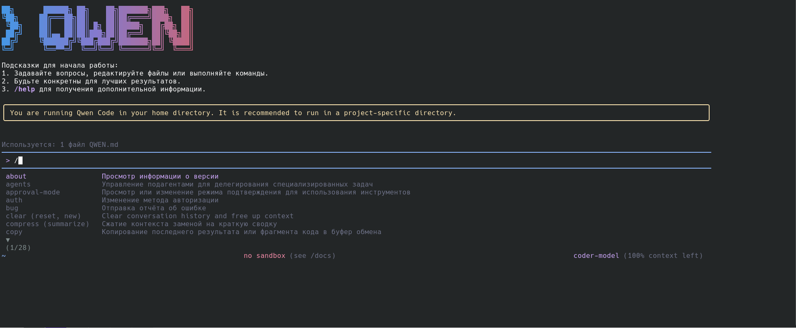

# Qwen Code

<div align="center">



[](https://www.npmjs.com/package/@qwen-code/qwen-code)
[](./LICENSE)
[](https://nodejs.org/)
[](https://www.npmjs.com/package/@qwen-code/qwen-code)

**AI-powered command-line workflow tool for developers**

[Installation](#installation) • [Quick Start](#quick-start) • [Features](#key-features) • [Documentation](./docs/) • [Contributing](./CONTRIBUTING.md)

</div>

<div align="center">
  
  <a href="https://qwenlm.github.io/qwen-code-docs/de/">Deutsch</a> | 
  <a href="https://qwenlm.github.io/qwen-code-docs/fr">français</a> | 
  <a href="https://qwenlm.github.io/qwen-code-docs/ja/">日本語</a> | 
  <a href="https://qwenlm.github.io/qwen-code-docs/ru">Русский</a> | 
  <a href="https://qwenlm.github.io/qwen-code-docs/zh/">中文</a>
  
</div>

Qwen Code - это мощный инструмент для работы с ИИ в командной строке, адаптированный из [**Gemini CLI**](https://github.com/google-gemini/gemini-cli ) и специально оптимизированный для моделей [Qwen3-Coder](https://github.com/QwenLM/Qwen3-Coder ). Это расширяет рабочий процесс разработки за счет расширенного понимания кода, автоматизированных задач и интеллектуальной поддержки.

## 💡 Доступны бесплатные опции

Начните работу с Qwen Code бесплатно, используя любую из этих бесплатных опций:

### 🔥 Qwen OAuth (рекомендуется)

- **2000 запросов в день** без ограничений по токенам
- **60 запросов в минуту** ограничение по скорости
- Просто запустите "qwen" и выполните аутентификацию под своей учетной записью qwen.ai
- Автоматическое управление учетными данными и их обновление
- Используйте команду "/auth", чтобы переключиться на Qwen OAuth, если вы инициализировались в режиме, совместимом с OpenAI

### 🌏 Региональные бесплатные сторонние приложения

- **Материковый Китай **: ModelScope предлагает ** 2000 бесплатных вызовов API в день**
- **Международный **: OpenRouter предоставляет ** до 1000 бесплатных вызовов API в день ** по всему миру

Подробные инструкции по настройке см. в разделе [Авторизация](#authorization).

> [!ВНИМАНИЕ!]
> ** Уведомление об использовании токенов **: Код Qwen может выполнять несколько вызовов API за цикл, что приводит к увеличению использования токенов (аналогично коду Claude). Мы активно оптимизируем эффективность API.

## Ключевые особенности

- ** Понимание и редактирование кода ** - Запрос и редактирование больших кодовых баз за пределами традиционных рамок контекстного окна
- **Автоматизация рабочего процесса ** - Автоматизация операционных задач, таких как обработка запросов на извлечение и сложных перебазировок
- ** Улучшенный синтаксический анализатор ** - Адаптированный синтаксический анализатор, специально оптимизированный для моделей Qwen-кодеров
- ** Поддержка моделей Vision ** - Автоматическое распознавание изображений во входных данных и плавное переключение на модели с поддержкой vision для мультимодального анализа

## Установка

### Предварительные требования

Убедитесь, что у вас установлена [Node.js версия 20](https://nodejs.org/en/download ) или более поздняя.

``bash
curl -qL https://www.npmjs.com/install.sh | sh
```

### Установить из npm

```bash
npm install -g @qwen-code/qwen-code@последняя версия
qwen --версия
```

### Установить из исходного кода c поддержкой русского языка

```bash
git clone https://github.com/Killtip74/qwen-code
cd qwen-сode
Решение:
   1. Перед установкой пакета необходимо выполнить полный процесс подготовки, включающий:
      - QWEN_CODE_LANG=ru npm run bundle
      - npm run prepare:package
   2. Затем переустановить пакет из папки dist:
      - cd dist
      - npm install -g .
```

### Глобальная установка с помощью Homebrew (macOS/Linux)

```bash
brew устанавливает qwen-код
```

## Код расширения VS

В дополнение к инструменту CLI, Qwen Code также предоставляет расширение ** VS Code**, которое обеспечивает поддержку программирования на базе искусственного интеллекта непосредственно в вашем редакторе с помощью таких функций, как операции с файловой системой, встроенные различия, интерактивный чат и многое другое.

> 📦 В настоящее время расширение находится в разработке. Инструкции по установке, функциональным возможностям и разработке смотрите в [расширении VS Code README](./packages/vscode-ide-companion/README.md).

## Быстрый запуск

```bash"
# Запуск Qwen-кода
qwen

# Примеры команд
> Объясните эту структуру кодовой базы
> Помогите мне реорганизовать эту функцию
> Сгенерировать модульные тесты для этого модуля
```

### Управление сеансами

Контролируйте использование токенов с помощью настраиваемых лимитов сеанса для оптимизации затрат и производительности.

#### Настройте лимит токенов сеанса

Создайте или отредактируйте файл ".qwen/settings.json" в вашем домашнем каталоге:

```json
{
  "sessionTokenLimit": 32000
}
```

#### Команды сеанса

- **`/сжать"** - Сжать историю разговоров, чтобы продолжить в пределах лимита токенов
- **"/очистить"** - Очистить всю историю разговоров и начать заново
- **`/статистика`** - Проверить текущее использование токенов и ограничения

> 📝 **Примечание**: Ограничение по токенам сеанса применяется к одному разговору, а не к совокупным вызовам API.

### Конфигурация модели Vision

Код Qwen включает автоматическое переключение модели intelligent vision, которое распознает изображения во входных данных и может автоматически переключаться на модели с поддержкой vision для мультимодального анализа. **Эта функция включена по умолчанию** - когда вы добавляете изображения в свои запросы, вы увидите диалоговое окно с запросом о том, как вы хотели бы использовать переключение модели vision.

#### Пропустите диалоговое окно переключения (необязательно).

Если вы не хотите каждый раз видеть интерактивное диалоговое окно, настройте поведение по умолчанию в вашем файле `.qwen/settings.json`:

```json
{
  "experimental": {
    "vlmSwitchMode": "once"
  }
}
```

**Доступные режимы:**

- **`"один раз"`** - Переключение на модель vision только для этого запроса, затем возврат
- **`"сессия"** - Переключение на модель vision для всего сеанса
- **`"сохранять"`** - Продолжать использовать текущую модель (без переключения)
- **Не задано** - Каждый раз показывать интерактивный диалог (по умолчанию)

#### Переопределение командной строки

Вы также можете настроить поведение с помощью командной строки:

```bash"
# Переключать один раз для каждого запроса
qwen --vlm-переключение в однократный режим

# Переключение на весь сеанс
qwen --vlm-переключение в сессионный режим

# Никогда не переключаться автоматически
qwen --vlm-переключение в постоянный режим
```

#### Отключить визуальные модели (необязательно)

Чтобы полностью отключить поддержку vision model, добавьте в свой файл `.qwen/settings.json`:

```json
{
  "experimental": {
    "visionModelPreview": false
  }
}
```

> 💡 ** Совет**: В режиме YOLO (`--yolo`) переключение зрения происходит автоматически без подсказок при обнаружении изображений.

### Авторизация

Выберите предпочтительный метод аутентификации в зависимости от ваших потребностей:

#### 1. Qwen OAuth (🚀 Рекомендуется - запуск через 30 секунд)

Самый простой способ начать работу - совершенно бесплатно и с большими квотами:

```bash"
# Просто запустите эту команду и выполните аутентификацию в браузере
qwen
```

**Что происходит:**

1. **Мгновенная настройка **: CLI автоматически открывает ваш браузер
2. ** Вход в систему в один клик **: Аутентификация с помощью вашей учетной записи qwen.ai
3. **Автоматическое управление **: Учетные данные кэшируются локально для использования в будущем
4. ** Без настройки **: Настройка не требуется - просто начните кодировать!

** Преимущества бесплатного уровня:**

- ✅ **2000 запросов в день ** (подсчет токенов не требуется)
- ✅ **60 запросов в минуту** ограничение скорости
- ✅ **Автоматическое обновление учетных данных**
- ✅ ** Нулевая стоимость ** для отдельных пользователей
- ℹ️ ** Примечание**: Для поддержания качества обслуживания может потребоваться изменение модели

#### 2. Совместимость с OpenAI-API

Используйте API-ключи для OpenAI или других совместимых провайдеров:

**Методы настройки:**

1. **Переменные среды**

   ```bash"
   экспорт OPENAI_API_KEY="your_api_key_here"
   экспортировать OPENAI_BASE_URL="your_api_endpoint"
   экспортировать OPENAI_MODEL="your_model_choice"
   ```

2. **Файл проекта `.env'**
   Создайте файл '.env' в корневом каталоге вашего проекта:
   ```.env
   OPENAI_API_KEY=ваш_api_key_here
   OPENAI_BASE_URL=ваша_api_endpoint
   OPENAI_MODEL=ваш_модельный выбор
   ```

**Параметры поставщика API**

> ❗️ **Региональное уведомление:**
>
> - **Материковый Китай**: Используйте Alibaba Cloud Bailian или ModelScope
> - **Международный**: используйте Alibaba Cloud ModelStudio или OpenRouter

<подробности>
<краткое описание><b>🇨🇳 Для пользователей в материковом Китае</b></краткое описание>

**Вариант 1: Alibaba Cloud Bailian** ([Подать заявку на получение ключа API](https://bailian.console.aliyun.com /))

```bash
экспортирует OPENAI_API_KEY="ваш_api_key_here"
экспортирует OPENAI_BASE_URL="https://dashscope.aliyuncs.com/compatible-mode/v1 "
экспорт OPENAI_MODEL="qwen3-coder-plus"
```

**Вариант 2: ModelScope (бесплатный уровень)** ([Подать заявку на получение ключа API](https://modelscope.cn/docs/model-service/API-Inference/intro ))

- ✅ **2000 бесплатных вызовов API в день**
- ⚠️ Подключите свою учетную запись Aliyun, чтобы избежать ошибок аутентификации

```bash
export OPENAI_API_KEY="ваш_api_key_here"
export OPENAI_BASE_URL="https://api-inference.modelscope.cn/v1 "
export OPENAI_MODEL="Qwen/Qwen3-Coder-480B-A35B-Инструкция"
```

</подробности>

<подробности>
<краткое описание><b>🌍 Для международных пользователей</b></краткое описание>

**Вариант 1: Alibaba Cloud ModelStudio** ([Подать заявку на получение ключа API](https://modelstudio.console.alibabacloud.com /))

```bash
export OPENAI_API_KEY="ваш_api_key_here"
export OPENAI_BASE_URL="https://dashscope-intl.aliyuncs.com/compatible-mode/v1 "
export OPENAI_MODEL="qwen3-coder-plus"
```

**Вариант 2: OpenRouter (доступен бесплатный уровень) ** ([Подать заявку на получение ключа API](https://openrouter.ai /))

```bash
export OPENAI_API_KEY="your_api_key_here"
export OPENAI_BASE_URL="https://openrouter.ai/api/v1 "
export OPENAI_MODEL="qwen/qwen3-кодер:бесплатный"
```

</подробности>

## Примеры использования

### 🔍 Изучите кодовые базы

```bash
создайте свой проект на cd/
qwen

# Анализ архитектуры
> Опишите основные элементы архитектуры этой системы
> Каковы ключевые зависимости и как они взаимодействуют?
> Найдите все конечные точки API и их методы аутентификации
```

### 💻 Разработка кода

```bash
# Рефакторинг
> Переработайте эту функцию, чтобы улучшить читаемость и производительность
> Преобразуйте этот класс для использования внедрения зависимостей
> Разделите этот большой модуль на более мелкие специализированные компоненты

# Генерация кода
> Создайте конечную точку REST API для управления пользователями
> Создайте модульные тесты для модуля аутентификации
> Добавить обработку ошибок ко всем операциям с базой данных
```

### 🔄 Автоматизировать рабочие процессы

```bash"
# Автоматизация Git
> Проанализировать git-коммиты за последние 7 дней, сгруппировав их по функциям
> Создать журнал изменений на основе последних коммитов
> Найдите все комментарии к текущим задачам и создайте проблемы на GitHub

# Файловые операции
> Преобразуйте все изображения в этом каталоге в формат PNG
> Переименуйте все тестовые файлы в соответствии с шаблоном *.test.ts
> Найдите и удалите все инструкции console.инструкции журнала
```

### 🐛 Отладка и анализ

```bash
# Анализ производительности
