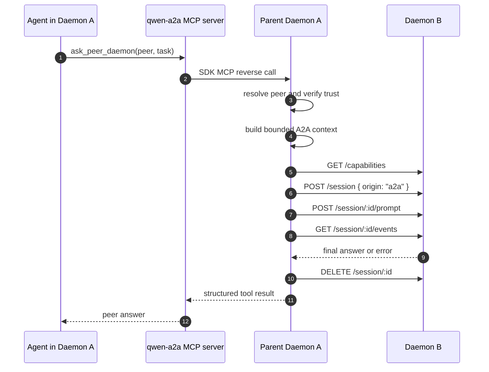

# Daemon A2A v1 Design

## Summary

A2A v1 lets one `qwen serve` daemon ask another daemon to work in its own
workspace. The first version is intentionally narrow:

- local daemons are discovered automatically;
- remote daemons are added through explicit configuration;
- discovered peers are candidates only and cannot be called until explicitly
  trusted;
- the local agent sees a single `ask_peer_daemon` tool through a daemon-hosted
  runtime MCP server;
- peer calls send the current user request plus a bounded recent-session
  summary, not the full transcript, files, attachments, environment, or secrets;
- the peer daemon keeps its own permission mediation and does not inherit the
  caller daemon's local permissions.

The implementation should stay at the daemon HTTP boundary. The ACP child should
see a normal MCP tool call; discovery, trust, peer tokens, and HTTP calls remain
owned by the parent daemon process.

## Goals

- Let an agent in workspace A delegate a bounded task to a trusted daemon bound
  to workspace B.
- Reuse the existing daemon REST/SSE protocol and runtime MCP mutation path.
- Keep peer discovery separate from peer authorization.
- Preserve the existing "one daemon = one workspace" model.
- Keep the first user-facing tool simple enough to audit and test.

## Non-goals

- No LAN broadcast or mDNS discovery in v1.
- No automatic trust for discovered local daemons.
- No direct ACP-child-to-ACP-child transport.
- No transparent passthrough of every remote tool into the local tool registry.
- No full transcript, file, attachment, or secret propagation.
- No multi-hop peer calls; v1 caps A2A depth at one.

## Architecture

```text
qwen serve A
  A2aRegistry        discovers local peers and reads explicit remote peers
  A2aTrustStore     records which peer identities are allowed to be called
  A2aMcpServer      exposes ask_peer_daemon as an SDK-type runtime MCP server
  A2aPeerClient     calls trusted peer daemon REST/SSE endpoints
  A2aContextBuilder builds the bounded context sent to peers

agent in daemon A
  -> ask_peer_daemon(peer, task)
  -> parent daemon A
  -> daemon B REST/SSE
  -> result returns as the MCP tool result
```

### `A2aRegistry`

`A2aRegistry` owns the candidate peer list. It merges two sources:

- local auto-discovery entries written by running daemons under the user's Qwen
  state directory;
- explicit remote peer entries from settings.

Local entries should include daemon id, workspace cwd, URL, PID, start time,
last heartbeat/update time, and a capabilities hash. Reads must prune stale
entries by checking age, PID when available, and `/health` reachability. The
registry must not store bearer tokens.

### `A2aTrustStore`

`A2aTrustStore` records trusted peer identities. Trust should key off a stable
peer id plus URL/workspace evidence, not just a mutable display name. A peer can
be visible in `/workspace/a2a/peers` while still not callable.

The v1 design only requires a storage shape and daemon API boundary; UX for
trusting peers can be CLI, Web Shell, or direct settings mutation in later work.

### `A2aMcpServer`

The parent daemon registers an SDK-type runtime MCP server, for example
`qwen-a2a`, using the existing `addRuntimeMcpServer` path. The ACP child then
discovers a normal MCP tool while tool execution routes back to the parent
daemon through the existing SDK MCP reverse channel.

This avoids a new stdio shim process and prevents peer tokens from entering the
ACP child. If there is no live ACP channel yet, registration is delayed until
preheat or the first session creates a channel.

### `A2aPeerClient`

`A2aPeerClient` calls peers through the existing daemon surface:

1. `GET /capabilities` to verify protocol and A2A-compatible feature tags.
2. `POST /session` to create a per-call A2A session on the peer.
3. `POST /session/:id/prompt` to submit the delegated task.
4. `GET /session/:id/events` to observe completion and collect the final answer.
5. `DELETE /session/:id`, best-effort, once the peer answer is collected.

The client should carry a dedicated A2A client id, for example
`daemon-a2a:<caller-daemon-id>`, and attach metadata such as `origin: 'a2a'`,
`callerDaemonId`, `callerWorkspace`, and `a2aDepth`.

### `A2aContextBuilder`

The context builder emits only:

- the current user request;
- a recent-session summary capped at 4,000 characters;
- caller workspace identity and daemon id;
- the explicit `task` string supplied by the local agent.

It must not automatically include the full transcript, files, attachments,
environment variables, API keys, bearer tokens, or MCP/tool outputs. If the
local agent wants to share file content, it must place that content explicitly
in the task.

## Tool Contract

The v1 MCP server exposes one tool:

```ts
ask_peer_daemon({
  peer: string,
  task: string,
});
```

The result should be a structured tool result with either:

- a peer answer, including peer id, workspace label, session id, and a concise
  final response; or
- a typed A2A error that the local agent can explain to the user.

The `peer` parameter accepts a trusted peer id or display alias. Ambiguous aliases
must fail with a typed error rather than choosing arbitrarily.

## Discovery and Trust Flow

1. A daemon starts and writes or refreshes its local registry entry.
2. Other daemons read the registry and show the entry as `discovered`.
3. Explicit remote peers are loaded from settings and shown as `configured`.
4. A peer remains `callable: false` until `A2aTrustStore` marks it trusted.
5. Trusted peers become visible to `ask_peer_daemon`.

Discovery should be best-effort. Failure to write the registry must not prevent
the daemon from serving normal local clients.

## Call Flow



The peer's permission mediation is unchanged. If daemon B needs human approval
for a tool call, daemon B asks its own clients according to its policy. Daemon A
does not vote on daemon B's permission requests unless daemon B has explicitly
configured such a client relationship in later work.

## Capabilities and Configuration

Add daemon capability tags:

- `daemon_a2a_discovery`
- `daemon_a2a_peer_call`
- `daemon_a2a_mcp_tool`

Add settings under an `a2a` namespace:

```json
{
  "a2a": {
    "enabled": true,
    "explicitPeers": [
      {
        "id": "peer-id",
        "url": "http://127.0.0.1:4171",
        "tokenRef": "env:QWEN_A2A_PEER_PEER_ID_TOKEN"
      }
    ],
    "trustedPeers": {
      "peer-id": {
        "url": "http://127.0.0.1:4171",
        "tokenRef": "env:QWEN_A2A_PEER_PEER_ID_TOKEN"
      }
    }
  }
}
```

`tokenRef` supports `env:<NAME>` in v1. The daemon resolves the referenced
environment variable at call time. The local auto-discovery registry must never
contain the resolved token.

## Security Invariants

- Discovery never grants call permission.
- Trust is explicit and revocable.
- Peer calls require the peer daemon's bearer token when the peer requires auth.
- Peer tokens stay in the parent daemon process and are never included in
  prompts, summaries, logs, tool output, or ACP child state.
- A2A calls use bounded context by default.
- A peer daemon enforces its own auth, CORS, host checks, rate limits, and
  permission mediation.
- `a2aDepth` is capped at one in v1. A prompt received with depth one must not be
  allowed to initiate another peer call.
- Tool results and logs must sanitize peer-provided error messages before
  writing to stderr or structured daemon logs.

## Failure Semantics

`ask_peer_daemon` returns structured errors for expected failures:

| Code                       | Meaning                                                                    |
| -------------------------- | -------------------------------------------------------------------------- |
| `peer_not_found`           | No discovered or configured peer matches the requested id or alias.        |
| `peer_not_trusted`         | The peer exists but is not trusted for agent calls.                        |
| `peer_unreachable`         | The peer URL cannot be reached or fails health/capability checks.          |
| `peer_auth_failed`         | The peer rejects the configured token.                                     |
| `peer_capability_mismatch` | The peer does not advertise required daemon protocol support.              |
| `peer_permission_timeout`  | The peer is waiting for local permission and times out.                    |
| `peer_prompt_failed`       | The peer prompt returns a daemon or agent failure.                         |
| `peer_response_timeout`    | The peer accepted the prompt but did not complete within the A2A deadline. |
| `a2a_depth_exceeded`       | A peer call attempts to call another peer in v1.                           |
| `peer_alias_ambiguous`     | The supplied peer alias maps to more than one candidate.                   |

Unexpected errors should be mapped to `peer_prompt_failed` with a sanitized
message and an internal log entry containing the detailed cause.

## Observability

Daemon logs should include:

- registry refresh result and stale-entry pruning counts;
- trust changes;
- runtime MCP registration success/failure;
- peer call start/finish with peer id, caller daemon id, duration, status code,
  and error code;
- A2A depth rejection.

Do not log prompt content, summaries, bearer tokens, or peer responses by
default.

## Implementation Notes

- `createServeApp` already owns `ClientMcpSenderRegistry` and runtime MCP wiring
  for SDK-type servers. A2A should reuse the same pattern rather than adding a
  new child transport.
- `bridge.addRuntimeMcpServer` requires a live ACP channel. Register the
  `qwen-a2a` MCP server after preheat succeeds or after the first
  `spawnOrAttach`; retry idempotently when a channel is recreated.
- Use `RUNTIME_MCP_IF_ABSENT_CONFIG_FLAG`-style conflict behavior so A2A does
  not shadow a user-configured MCP server name.
- Keep all new REST routes under `/workspace/a2a/*`. Do not overload
  `/capabilities` beyond additive feature tags and optional metadata.
- Avoid adding peer config to `POST /session`; daemon-wide A2A should remain
  settings/runtime driven like daemon-wide MCP.

## Testing Plan

- Registry unit tests: local registration, refresh, stale pruning, duplicate
  daemon id update, and health-check pruning.
- Trust unit tests: discovered-but-untrusted peers are listed but not callable;
  trust revocation disables calls.
- MCP server unit tests: `ask_peer_daemon` parameter validation, alias ambiguity,
  and error mapping.
- Peer client unit tests: capabilities preflight, session creation, prompt
  submission, SSE completion, auth failure, timeout, and malformed peer events.
- Serve integration tests: two fake daemons where A discovers B, trust is added,
  and A's agent can call B through the A2A MCP tool.
- Security regression tests: no token in registry or logs, untrusted peers
  refused, wrong token refused, and `a2aDepth > 1` refused.
- Lifecycle tests: A2A MCP registration after preheat, after first session when
  preheat fails, and after ACP channel restart.

## Open Follow-ups

- Design the CLI/Web Shell UX for trusting, untrusting, and naming peers.
- Consider keychain-backed token references after the `env:` reference path
  proves useful.
- Consider LAN discovery only after the local/explicit model is stable and the
  trust UX is proven.
