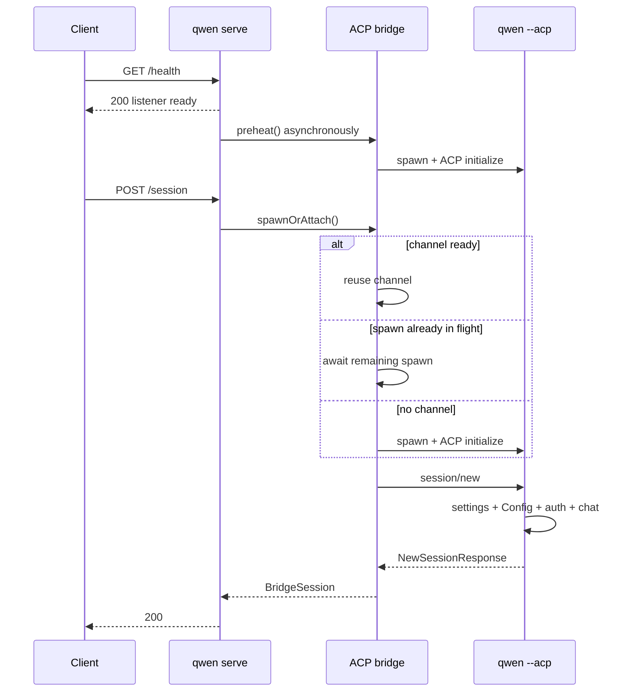

# Cold first-session profiling design

## Decision

The next implementation slice for #4748 is observability, not another startup cache or a new session protocol. It must explain one cold request across the daemon, the shared ACP channel, and the ACP child while preserving the current fast `/health` behavior.

The implementation reuses the existing daemon OpenTelemetry request/bridge spans and ACP `_meta` extension point. It adds:

- bootstrap request timing so a deferred-runtime wait is included in the later HTTP span instead of being mistaken for proxy/network time;
- a per-request channel-wait span that says whether the Session reused a ready channel, joined an in-flight spawn, or spawned on demand;
- an opaque ID on each ACP channel so an automatic-preheat trace can be correlated with the later Session trace without inventing a false parent/child relationship;
- trace-context injection on ACP `session/new`;
- one ACP-child `session/new` span with bounded stage durations for settings, Config initialization, authentication, file-system setup, Session registration, and response construction;
- the ACP Session ID in the existing opt-in `QWEN_CODE_PROFILE_SESSION_START` JSONL record so its detailed `startChat` stages can be joined to the trace.

This slice does not add response headers, public JSON fields, capability flags, or a second profiler format. ACP readiness remains a separate P1 client/API change after the P0 breakdown is available.

## Evidence

The downstream `0.19.3-preview.2` sample showed a 2,534ms P50 from health success to Session success and a 1,713ms P50 for `POST /session`. The negative correlation between health-to-request delay and POST duration is consistent with a first request waiting for the remainder of automatic preheat, but browser timing cannot separate proxy, daemon, channel, and child work.

A local dry-run with the globally installed `qwen 0.19.10` confirmed the same shape:

| Scenario                                            |                    Observation |
| --------------------------------------------------- | -----------------------------: |
| Process start → listener                            |                          203ms |
| Health followed immediately by cold `POST /session` | 1,033ms browser / 962ms daemon |
| Already-preheated `POST /session` in a separate run |   222ms browser / 221ms daemon |

These are illustrative single runs, not an acceptance benchmark. They show that the current coarse route duration hides roughly 700–800ms that can be channel wait, ACP child bootstrap, or both.

## Current architecture

Existing observability already provides:

- an HTTP request span for `POST /session` after the runtime app receives the request;
- bridge spans for `channel.spawn`, `channel.initialize`, and `session.new`;
- W3C trace-context injection and extraction through reserved ACP `_meta` keys, currently used for prompt dispatch;
- an opt-in JSONL profiler for detailed `GeminiClient.startChat()` stages.

The missing pieces are any bootstrap-layer deferred-runtime wait before that request span, the current request's channel wait, correlation to an independently-started preheat trace, propagation on `session/new`, and timing before `startChat` inside the child.

## Design

### Parent daemon and bridge

When a non-bootstrap request arrives before the deferred runtime is mounted, the delegating bootstrap app records its wall-clock arrival time, the remaining runtime wait, and whether that request started runtime loading or joined work already started by health/fallback scheduling. The runtime telemetry middleware receives the same request object after mounting and backdates the HTTP span to that arrival time. Route duration metrics use the same boundary. This makes browser duration minus daemon request duration a meaningful proxy/network residual even on the cold deferred-runtime path.

Before `doSpawn()` awaits `ensureChannel()`, it classifies the synchronous channel state:

- `reused`: a non-dying channel is already available;
- `joined`: `inFlightChannelSpawn` already exists;
- `spawned_on_request`: neither a live channel nor an in-flight spawn exists.

It then wraps the await in a `channel.wait` bridge span. The production telemetry implementations invoke their callback synchronously, so the classification is read and `ensureChannel()` is invoked without yielding the JavaScript event loop.

Each new `ChannelInfo` receives a random UUID before `channelFactory()` is called. The same ID is attached only to spans for:

- `channel.spawn`;
- `channel.initialize`;
- `session.new` once the channel is known.

The ID is diagnostic trace data, not a metrics label or public identifier. Automatic preheat and the first Session can belong to separate traces; the channel ID links them without claiming that the later HTTP request caused the earlier work.

`preheat()` receives its own `channel.preheat` bridge span. A Session that joins it has a `channel.wait` span measuring only the remaining wait. `channel.initialize` and `channel.wait` overlap in that case and must not be summed.

Inside the existing `session.new` span, the bridge injects the active trace context into `NewSessionRequest._meta`. The existing injection helper already strips client-supplied reserved keys before adding daemon-owned values. After the child responds, a span event records the ACP Session ID for correlation with the JSONL profiler.

### ACP child

`QwenAgent.newSession()` extracts the daemon context from the request and starts a child `qwen-code.daemon.session_start` span under the parent bridge `session.new` span. If context is absent or invalid, normal OTel root-span behavior applies.

The child records fixed, non-overlapping durations using `performance.now()`:

| Stage               | Boundary                                                                                                                                                                           |
| ------------------- | ---------------------------------------------------------------------------------------------------------------------------------------------------------------------------------- |
| `settings_load`     | `loadSettingsCached(cwd)`                                                                                                                                                          |
| `config_setup`      | `newSessionConfig()`, including `loadCliConfig()`, `config.initialize()`, and the normal first `startChat()`                                                                       |
| `auth`              | `ensureAuthenticated()`                                                                                                                                                            |
| `file_system_setup` | `setupFileSystem()`                                                                                                                                                                |
| `session_register`  | `createAndStoreSession()`, normally constructing and registering the ACP `Session`; its defensive Gemini initialization is timed here only if Config did not already initialize it |
| `response_build`    | models, modes, config options, and response object construction                                                                                                                    |

The implementation E2E showed `config_setup` at about 200ms, with about 140ms recorded by the existing nested `startChat` profiler. That confirms the normal `startChat()` happens during `config.initialize()`, not during the later Session registration. The JSONL Session ID makes that nested cost joinable without file timestamp guesses. A later optimization can split Config construction from `config.initialize()` if representative downstream traces show the remaining unattributed Config cost is material; doing so in this slice would require threading a profiler through a method shared by new/load/resume/transcript paths.

### Attribute contract

Only fixed attribute names and bounded values are emitted:

- `qwen-code.daemon.channel.path` = `reused | joined | spawned_on_request`;
- `qwen-code.daemon.runtime.path` = `started_on_request | joined` when the request crossed the deferred-runtime gate;
- `qwen-code.daemon.runtime.wait_ms` = finite non-negative remaining runtime wait;
- HTTP request duration histogram `runtime_path` = `started_on_request | joined` for requests that crossed the deferred-runtime gate, otherwise `none`;
- `qwen-code.daemon.acp_channel.id` = daemon-generated UUID;
- `qwen-code.daemon.session_start.<stage>_ms` = finite non-negative duration;
- `qwen-code.daemon.session_start.failed_stage` = one fixed stage name;
- `session.id` = ACP-generated Session ID.

No workspace path, prompt, settings value, credential, model response, or file content is added.

## Failure, concurrency, and compatibility

- OTel disabled: existing behavior is unchanged; the bridge still runs through its no-op telemetry seam and the child profiler avoids file output unless the existing environment flag is enabled.
- Deferred runtime failure: the bootstrap app still returns the existing startup error; timing metadata is process-local and is never exposed in the response.
- Invalid or missing trace metadata: the child creates an unparented span or no span, and Session creation continues.
- Telemetry attribute failure: stage attributes are recorded best-effort and cannot change the Session result.
- Preheat failure: `channel.wait` reflects the request's retry path; existing child cleanup and lazy retry semantics remain unchanged.
- Concurrent first Sessions: each request gets its own `channel.wait` and child Session span while all can reference the same channel ID.
- Old or non-daemon ACP clients: `_meta` is optional, so the child continues to accept ordinary `NewSessionRequest` messages.
- Existing JSONL consumers: `sessionId` is additive and optional; existing fields and file layout do not change.
- Channel teardown: the diagnostic UUID lives only on `ChannelInfo` and disappears with the channel; it does not alter reuse, idle timeout, or kill logic.

## Alternatives rejected for this slice

### A custom profile ID and ACP response envelope

Returning a second timing schema in `NewSessionResponse._meta` would duplicate OTel, require validation/versioning, and create two sources of truth. W3C context already carries causality and the channel UUID handles the one intentionally separate preheat trace.

### `Server-Timing` and `X-Qwen-Profile-Id`

These would help browser-only diagnosis, but they require proxy header pass-through and CORS exposure decisions outside this repository. The daemon request span and existing route duration already provide server time. Header work can follow if downstream tracing remains unavailable.

### Making `/health` wait for ACP

This moves latency into readiness and risks health-probe regressions. `/health` remains listener/liveness readiness; ACP readiness is a separate future capability-gated contract.

### Sharing Config or pre-creating a Session

Both change isolation and lifecycle semantics before profiling identifies a dominant stage. They are explicitly out of scope.

## Verification

Focused unit tests must prove:

- `session/new` receives daemon-owned trace metadata;
- a Session request that crosses the deferred-runtime gate starts its HTTP span at bootstrap arrival and records whether it started or joined runtime loading;
- `channel.wait` reports spawned, joined, and reused paths;
- one channel UUID links spawn, initialize, and Session spans;
- the child extracts the parent context and records all fixed stages;
- a failed stage is recorded and the original error is preserved;
- session-start JSONL includes the Session ID when supplied and remains backward compatible when absent;
- telemetry disabled or malformed metadata does not change Session behavior.

The E2E dry-run compares two cases with the same workspace and auth:

1. health followed immediately by `POST /session`;
2. health followed by explicit preheat, then `POST /session`.

For both, verify Session success and inspect the trace tree. The cold case must contain the request `channel.wait` path and the child stage attributes; the preheated case must report `reused`. Performance conclusions require at least 30 serialized cold starts in the representative downstream environment and are not inferred from local single-run timings.

## Implementation boundary and review gate

Production changes are limited to the deferred-runtime request handoff and telemetry middleware in `run-qwen-serve`, the existing telemetry seam in `packages/acp-bridge`, ACP `newSession`, and the existing core session-start profiler. No Session/config/auth behavior changes.

The cross-package downstream consumers reviewed for this design are:

- daemon bridge construction in `run-qwen-serve.ts` and test/embed bridge telemetry implementations;
- deferred runtime route admission and request telemetry/metrics consumers;
- all `AcpSessionBridge.spawnOrAttach()` callers, which receive the same `BridgeSession` shape;
- ACP clients other than the daemon, which may omit `_meta`;
- session-start profiler tests and JSONL readers, for which `sessionId` is optional.

Because this crosses core/bridge/CLI boundaries, it requires maintainer review even though the production logic change is intentionally small.
