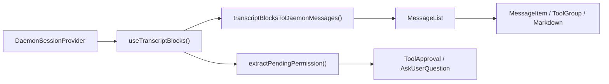
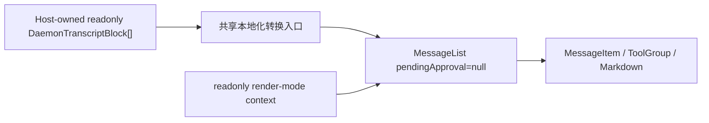

# WebShell 只读 Daemon Transcript 渲染设计

## 文档状态

- 状态：Implemented
- 日期：2026-07-14
- 范围：`packages/web-shell`
- 目标输入：`readonly DaemonTranscriptBlock[]`
- 目标输出：继承 WebShell `MessageList` 展示能力的只读 transcript 视图

## 1. 背景

WebShell 已经具备完整的 daemon transcript 渲染链路，但目前这条链路只能通过
`App` 或 split view 中的 `ChatPane` 间接使用：组件先从
`DaemonSessionProvider` 读取 transcript blocks，再把 blocks 转换为 WebShell
内部消息，最后交给 `MessageList` 渲染。

新的使用场景已经直接持有 `DaemonTranscriptBlock[]`，只需要使用 WebShell 的消息
样式和渲染能力展示历史内容，不需要建立 daemon session 连接，也不允许执行会话写
操作。典型的非目标交互包括工具审批、`AskUserQuestion`、重试、分支、提交 prompt
和打开会修改会话状态的面板。

如果宿主自行复制 `transcriptBlocksToDaemonMessages` 的结果并拼装内部组件，会暴露
WebShell 私有的 `DaemonMessage` 模型、上下文和 CSS 约束，也会在 MessageList 新增
能力时发生渲染漂移。因此需要由 `@qwen-code/web-shell` 提供一个稳定的公开入口。

## 2. 目标

1. 新增一个公开 React 组件，直接接收
   `readonly DaemonTranscriptBlock[]` 并渲染。
2. 复用现有 `transcriptBlocksToDaemonMessages()` 和同一个 `MessageList`，保证用户、
   assistant、thinking、tool、sub-agent、plan、status、Markdown、时间线、长会话虚拟
   滚动等能力随 MessageList 演进自动继承。
3. 组件可在没有 `DaemonWorkspaceProvider`、`DaemonSessionProvider` 和网络连接的情况
   下独立渲染。
4. 只读边界内不调用任何 daemon/session mutation，不显示 pending permission 或
   `AskUserQuestion` 的作答 UI。
5. 以新增导出为主，不改变现有 `WebShell`、`WebShellWithProviders`、`App` 和
   `ChatPane` 的运行路径、默认值及 DOM 行为。
6. 新增完整的组件单测，并通过现有 WebShell 测试集、构建、lint 和 typecheck。

## 3. 非目标

- 不新增 transcript 获取、分页、缓存或 SSE 订阅能力；宿主负责提供 blocks。
- 不把只读模式塞入现有 `WebShellProps`，也不为 `App` 增加条件化的
  `readOnly`/`blocks` 双数据源。
- 不导出内部 `MessageList`、`Message` 或 `DaemonMessage` 类型。
- 不展示或处理尚未解决的工具审批和 `AskUserQuestion`。
- 不提供 composer、queued prompt、streaming status、sidebar、split view、dialog、
  artifact right panel 等 App 外壳能力；MessageList 自带的 session timeline 保留。
- 不从 blocks 推断或加载独立的 session artifacts。文件变更、artifact 和 scheduled
  task 的 App 级 turn-output 卡片不在本期范围内。
- 不禁止复制、折叠/展开工具、展开 completed turn、表格筛选、时间线定位等只改变
  本地展示状态的交互。

## 4. 术语与只读边界

本设计中的“只读”是指 **不读取或修改 daemon/session 运行状态**，而不是给整个 DOM
设置 `pointer-events: none`。

| 类别                | 行为                                                              | 是否保留                     |
| ------------------- | ----------------------------------------------------------------- | ---------------------------- |
| 被动展示            | 文本、Markdown、图片、diff、shell output、tool/sub-agent 状态     | 是                           |
| 本地查看            | 复制、折叠、展开、虚拟滚动、时间线定位、表格排序/筛选             | 是                           |
| 宿主自定义展示      | Markdown/code block renderer、消息内容 renderer                   | 是；副作用由宿主负责         |
| 普通外部链接        | 浏览器安全 URL transform 后的新窗口导航                           | 是                           |
| WebShell 语义导航   | `qwen-session://` 触发的 `qwen:open-session` 全局事件             | 否；只读时显示为不可操作文本 |
| Session mutation    | send prompt、cancel、retry、branch、rewind、切换模型/模式         | 否                           |
| Permission mutation | tool approval、reject、`AskUserQuestion` submit/ignore            | 否                           |
| 外部数据加载        | 组件自身发起的 session attach、transcript/artifact/task/MCP fetch | 否                           |

这一边界既保留 MessageList 的阅读体验，也保证组件本身没有写 daemon 的能力。

## 5. 现状与调用方地图

| 模块                                                         | 当前职责                                                   | 与本设计的关系                         |
| ------------------------------------------------------------ | ---------------------------------------------------------- | -------------------------------------- |
| `packages/sdk-typescript/src/daemon/ui/types.ts`             | 定义 `DaemonTranscriptBlock` union                         | 新组件的公开输入模型                   |
| `packages/web-shell/client/adapters/transcriptToMessages.ts` | 将 blocks 归并为 WebShell `DaemonMessage[]`                | 直接复用，不新建转换器                 |
| `packages/web-shell/client/hooks/useMessages.ts`             | 从 session hook 读取 blocks，并提供本地化转换参数          | 提取可接收外部 blocks 的共享纯转换入口 |
| `packages/web-shell/client/components/MessageList.tsx`       | turn 折叠、tool/sub-agent 分组、时间线、虚拟滚动和逐条渲染 | 新组件与存量路径共用的唯一列表实现     |
| `packages/web-shell/client/components/MessageItem.tsx`       | 按消息 role 分派具体 renderer                              | 无需修改                               |
| `packages/web-shell/client/App.tsx`                          | 完整单会话 WebShell、审批、composer、side panels           | 存量路径保持不变                       |
| `packages/web-shell/client/components/ChatPane.tsx`          | split view 中的完整交互会话                                | 存量路径保持不变                       |
| `packages/web-shell/client/index.tsx` / `index.ts`           | package runtime/source 导出                                | 增加新组件及类型导出                   |

当前主链路如下：



新增只读链路绕开 session provider 和 permission 分支：



主 WebShell editor 中的 `/tasks` 和 `/mcp` 在 `App` 内被拦截，只更新 dialog React
state，不调用 `sendPrompt()`，也不会写入 session JSONL。因此持久化 transcript 不包含
这两个本地 panel 的 sentinel；新入口不增加相应的识别或过滤分支。

## 6. 公共 API

新增组件名为 `WebShellTranscript`，从 `@qwen-code/web-shell` package root 导出。

```ts
export interface WebShellTranscriptProps {
  /** Ordered transcript blocks from one logical session. */
  blocks: readonly DaemonTranscriptBlock[];

  theme?: WebShellTheme;
  language?: 'en' | 'zh-CN' | 'zh' | 'zh-cn';
  className?: string;
  style?: React.CSSProperties;
  chatMaxWidth?: number;
  workspaceCwd?: string;

  compactThinking?: boolean;
  collapseCompletedTurns?: boolean;
  markdownTableMode?: MarkdownTableMode;
  virtualScrollThreshold?: number;
  markdown?: WebShellMarkdownCustomization;

  composerTagIcons?: WebShellComposerTagIconMap;
  renderToolHeaderExtra?: ToolHeaderExtraRenderer;
  parseUserMessageContent?: UserMessageContentParser;
  renderUserMessageContent?: UserMessageContentRenderer;
  renderComposerTag?: ComposerTagRenderer;
  renderComposerTagTooltip?: ComposerTagRenderer;
  renderAssistantTurnFooter?: AssistantTurnFooterRenderer;
}

export function WebShellTranscript(
  props: WebShellTranscriptProps,
): React.ReactElement;
```

说明：

- `blocks` 必填且不复制、不修改；调用方应保持数组内 block 的 session 和顺序一致。
- 视觉相关 prop 沿用 `WebShellProps` 的名称和类型，避免同一能力形成第二套配置语义。
- 不暴露 `onComposerTagClick`、`onRetryClick`、`onBranchSession`、
  `onTurnOutputOpen`、permission callback 或 composer callback。
- `theme` 默认 `dark`；`language` 未传时沿用 WebShell 的 URL/browser language
  解析规则；`chatMaxWidth` 默认 1000px。
- `compactThinking` 默认 `false`，`collapseCompletedTurns` 默认 `true`，与现有
  `WebShell` 一致。
- 组件按静态/已回放 transcript 处理，向 `MessageList` 传入
  `isResponding={false}`。实时流展示不在本期 API 范围内。

使用示例：

```tsx
import { WebShellTranscript } from '@qwen-code/web-shell';
import type { DaemonTranscriptBlock } from '@qwen-code/sdk/daemon';

export function HistoryView({
  blocks,
}: {
  blocks: readonly DaemonTranscriptBlock[];
}) {
  return (
    <WebShellTranscript
      blocks={blocks}
      theme="dark"
      language="zh-CN"
      workspaceCwd="/workspace/project"
      style={{ height: 640 }}
    />
  );
}
```

宿主必须为组件提供可用高度；组件自身维持与 WebShell 相同的 `height: 100%`、内部
滚动和 content width 行为。

## 7. 详细设计

### 7.1 共享本地化转换

保留 `transcriptBlocksToDaemonMessages()` 作为唯一 block-to-message adapter。
在 `useMessages.ts` 中提取一个内部纯函数，例如：

```ts
export function transcriptBlocksToLocalizedMessages(
  blocks: readonly DaemonTranscriptBlock[],
  t: Translator,
): Message[];
```

该函数只作为 package 内部模块导出供新组件复用，不从 package root 公开。

该函数只负责组装目前 `useMessages()` 已使用的本地化 labels，再调用现有 adapter。
现有 `useMessages()` 和新组件都调用它，避免两条路径在 prompt cancelled、branch、
mid-turn inserted 和 interrupted stream 文案上发生漂移。

这是存量渲染路径唯一需要的内部整理；函数输入输出和现有转换结果不变，不修改
adapter 的 block 归并规则。

### 7.2 `WebShellTranscript` 组件结构

新增 `packages/web-shell/client/components/WebShellTranscript.tsx`，内部顺序为：

1. 解析 theme 和 language，创建 translator。
2. 用 `useMemo` 将 `blocks` 转换为 `Message[]`。
3. 创建与现有 App 相同的 message-layer customization value。
4. 挂载 WebShell 的 theme、i18n、customization、compact-mode、只读 render-mode 和
   portal contexts。
5. 创建带 `data-web-shell-root`、`data-web-shell-shadcn` 的独立 root，复用 App 的
   theme class、基础变量、字体、背景和 CSS 隔离规则。
6. 渲染同一个 `MessageList`。

`MessageList` 的关键入参固定如下：

```tsx
<MessageList
  messages={messages}
  pendingApproval={null}
  isResponding={false}
  workspaceCwd={workspaceCwd ?? ''}
  virtualScrollThreshold={virtualScrollThreshold}
/>
```

以下 action prop 一律不传：

- `onShowContextDetail`
- `onRetryClick`
- `onBranchSession`
- `onReviewChanges`
- `onOpenArtifact`
- `onOpenScheduledTask`
- `onTurnOutputOpen`

不传 loading/catch-up/tail/turn-output 数据，避免把 App 的连接状态和外部资源模型引入
只读组件。

### 7.3 交互式 renderer 隔离

仅给 `MessageList` 传 `pendingApproval=null` 还不足以保证只读。goal status、Markdown
和 tool result 中的 session link 不通过 MessageList callback，而是向 `window` 派发
全局语义事件，可能改变同页另一个 WebShell 的 footer 或 active session。

设计在 `client/transcriptRenderMode.ts` 增加一个仅 package 内部使用的 transcript
render-mode context，默认值为 `interactive`。现有 `App` 和 `ChatPane` 不需要新增
provider，因而行为保持原样；`WebShellTranscript` 将其设为 `readonly`。readonly
模式仅做以下限制：

- `qwen-session://` 链接保留文本和样式，但不派发 `qwen:open-session`；
- `GoalStatusMessage` 不派发 `GOAL_STATUS_ACTIVE_EVENT`；
- 不拦截普通 HTTPS 链接以及复制、折叠、排序等本地查看交互。

该 context 只修改 `Markdown`、`ToolGroup` 和 `GoalStatusMessage` 的语义事件出口，且
默认值锁定为 `interactive`，避免给 `MessageList` 增加贯穿所有 renderer 的
`readOnly` prop。新增单测必须同时证明 interactive 默认行为不变和 readonly 行为被
抑制。

### 7.4 Theme、CSS 与 portal

WebShell library build 会把组件 CSS 注入并限定在 `[data-web-shell-root]` 或
`[data-web-shell-portal-root]` 下。新组件必须创建自己的 WebShell root，否则
MessageList 虽然会生成 DOM，但 CSS module 规则不会命中。

时间线 tooltip 和 advanced Markdown table 会使用 portal。为了完整继承这些能力，
新组件使用与 App 等价的 portal host 生命周期：

- mount 时向 `document.body` 添加带 `data-web-shell-portal-root` 和
  `data-web-shell-shadcn` 的节点；
- 同步 root 的 theme class 和 CSS variables；
- 通过 `WebShellPortalRootContext` 提供该节点；
- unmount 时移除节点及 observer/listener。

这段生命周期放在新组件内部，不重构 App 现有 portal 代码，从而把存量回归面限制在
新增入口。SSR 阶段不访问 `document`；客户端 mount 后再启用 portal。

### 7.5 Error isolation

新入口分为外层 public boundary 和内层 content 组件。blocks 转换、provider/portal
初始化和 MessageList 都发生在 boundary 的 child 内，确保这些阶段的异常也能进入
与 WebShell public entry 相同的 `RootErrorFallback`。逐条消息仍由 `MessageItem`
自身的 boundary 隔离，因此单个 Markdown、KaTeX、Mermaid 或 tool renderer 异常不会
使整个 transcript 白屏。

### 7.6 Block 渲染策略

所有策略沿用现有 adapter，不在新组件内增加第二个 switch。

| `DaemonTranscriptBlock.kind` | 只读结果                                                     |
| ---------------------------- | ------------------------------------------------------------ |
| `user`                       | 用户消息、图片和 input annotations                           |
| `assistant`                  | assistant Markdown；连续块归并；sub-agent 内容按 parent 归属 |
| `thought`                    | thinking 消息；连续块归并                                    |
| `tool`                       | tool group、diff/read/shell/fetch/todo/sub-agent 等现有卡片  |
| `shell`                      | 关联最近的执行工具，无法关联时使用现有 raw shell fallback    |
| `user_shell`                 | 用户 shell command/output                                    |
| `status` / `debug`           | plan 或 system/status 消息                                   |
| `error`                      | error system message，不提供 retry action                    |
| `prompt_cancelled`           | 本地化的取消状态                                             |
| unresolved `permission`      | 不转换、不展示、不提供操作入口                               |
| resolved `permission`        | 沿用 adapter 的历史 tool placeholder/结果规则                |
| `AskUserQuestion` permission | 不展示问答表单；仅在后续真实 tool block 存在时展示其历史结果 |

### 7.7 更新与性能

- 仅在 `blocks` identity 或 language 变化时重新执行 O(n) 转换。
- MessageList 保留既有的 memo、turn grouping 和虚拟滚动阈值。
- 不深拷贝 blocks，也不为每个 block 建立新的 React provider。
- 调用方若频繁传入内容相同但 identity 全新的数组，会触发重新转换；这是与当前
  `useTranscriptBlocks()` 更新模型一致的可接受行为。
- 本期不新增增量 adapter。只有实测表明外部大 transcript 更新成为瓶颈时，再单独
  设计增量转换。

## 8. 兼容性与回归控制

### 8.1 存量路径不变

- `WebShellProps` 不新增必填项，也不改变任何默认值。
- `WebShell` 和 `WebShellWithProviders` 仍渲染 `App`。
- `App`、`ChatPane` 仍从各自的 provider/hook 读取 session 状态。
- approval overlay、composer、sidebar、split view、artifact panel 不经过新组件。
- `MessageList` 不新增 `readOnly` prop 分支；只读由新调用方传入
  `pendingApproval=null`、不传 action callbacks，并通过默认 interactive 的内部
  render-mode context 隔离少数全局语义事件。

### 8.2 Package 导出

同时更新 `client/index.tsx` 和 `client/index.ts`，导出：

```ts
export { WebShellTranscript } from './components/WebShellTranscript';
export type { WebShellTranscriptProps } from './components/WebShellTranscript';
```

两个 barrel 都更新是为了避免当前 runtime entry 与 declaration/source entry 的双入口
差异导致“运行时有导出、类型声明无导出”。不新增 package subpath export。

### 8.3 安全

- 新入口不引入 `useActions()`、`useTranscriptStore()`、`useConnection()` 或 fetch。
- pending permission 内容不会进入 interactive renderer。
- 不检查或改写 status message 内容；`/tasks`、`/mcp` 的 dialog state 本身不属于持久化
  transcript。
- readonly render-mode 不派发可能影响同页其他 WebShell 的 session/goal 全局事件。
- Markdown URL 和 HTML 处理继续使用现有 WebShell sanitizer/transform，不新增
  `dangerouslySetInnerHTML` 或其他旁路。
- 自定义 renderer 是宿主代码；如果宿主在其中执行副作用，不属于组件可保证的只读
  边界，README 必须明确这一点。

## 9. 测试设计

### 9.1 新增组件 contract 单测

新增 `WebShellTranscript.test.tsx`，mock `MessageList` 验证边界和 wiring：

1. blocks 经共享本地化 adapter 转为 messages，顺序和内容正确。
2. `pendingApproval` 永远为 `null`。
3. session mutation、permission、retry、branch、turn-output callbacks 均未传入。
4. 默认 `isResponding=false`，并正确转发 workspace 和 virtual-scroll 配置。
5. theme、language、compact/collapse 和 message customization 正确进入 context。
6. blocks 或 language 更新后重新生成消息，不重复旧内容。
7. 空 blocks 渲染为空列表但不抛错。

### 9.2 新增 DOM 集成单测

新增 `WebShellTranscript.dom.test.tsx`，使用真实 `MessageList`：

1. 在没有 daemon providers 的 React tree 中成功渲染。
2. 代表性 user、assistant Markdown、thought、tool、sub-agent、plan、status、error 和
   prompt-cancelled block 都进入对应 WebShell DOM。
3. 本地折叠/展开、复制或时间线定位仍可工作，证明复用的是 MessageList 能力。
4. unresolved 普通 permission 不出现 approval panel。
5. unresolved `AskUserQuestion` 不出现 option、input、submit 或 ignore UI。
6. resolved historical tool/AskUser result 按 adapter 现有规则展示。
7. readonly session link 和 goal status 不派发全局语义事件；相应存量组件测试继续证明
   默认 interactive 行为不变。
8. dark/light class、language、本地化文本、chat max width 和 CSS root 标记正确。
9. portal root mount/unmount 正确，portal 内容处于 scoped root 下。
10. 单条自定义 renderer 抛错时使用内置 renderer fallback，消息其余内容仍存在。

### 9.3 共享转换和导出测试

- 扩充 `useMessages`/adapter 相关测试，证明存量 hook 和外部 blocks 使用完全相同的
  localized options。
- 扩充 `index.test.tsx` 或 build artifact 测试，验证 runtime named export 存在。
- 构建后检查 `dist/types/index.d.ts` 包含 `WebShellTranscript` 和 props 导出，防止
  双入口声明漂移。

### 9.4 存量回归集

实现完成后的最小必过验证顺序：

```bash
cd packages/web-shell
npm run build
npx vitest run --config vitest.config.ts \
  client/components/WebShellTranscript.test.tsx \
  client/components/WebShellTranscript.dom.test.tsx \
  client/hooks/useMessages.test.ts \
  client/adapters/transcriptToMessages.test.ts \
  client/components/MessageList.test.ts \
  client/components/MessageList.dom.test.tsx \
  client/components/messages/Markdown.test.ts \
  client/components/messages/ToolGroup.test.tsx \
  client/components/messages/SystemMessage.test.tsx \
  client/index.test.tsx
npm test
npm run format:check
npm run lint
npm run typecheck

cd ../..
npm run build
npm run typecheck
```

`npm test` 是本次必须通过的已有 WebShell 完整测试集。当前变更没有新增独立页面，也不
改变现有 Playwright smoke 的 App/daemon 协议，因此不新增浏览器 E2E；真实 DOM 行为由
`WebShellTranscript.dom.test.tsx` 覆盖。

## 10. 实施步骤

1. 在 `useMessages.ts` 提取共享的 localized block conversion，并保持现有 hook 输出
   不变。
2. 新增内部 transcript render-mode context，并在 session link/goal event 出口读取；默认
   保持 interactive。
3. 新增 `WebShellTranscript` 及 props，实现 root/provider/portal/MessageList wiring。
4. 在两个 public barrel 增加 runtime 和 type export。
5. 更新 `packages/web-shell/README.md`，补充只读接入示例、宿主高度要求和只读边界。
6. 新增 contract、DOM、interaction isolation、export/type declaration 测试。
7. 执行目标测试、WebShell 完整测试集、build、lint、typecheck。
8. 按仓库规范审阅完整 diff；任何修复都重新执行第 7 步。

## 11. 备选方案

### 11.1 给现有 `WebShell` 增加 `blocks` 和 `readOnly`

不采用。`App` 目前无条件消费多个 daemon hooks，并管理审批、composer、session、
sidebar 和 panels。双数据源会在整个 App 中引入条件分支，既需要 provider 又要防止
mutation，回归面远大于本需求。

### 11.2 公开导出 `MessageList`

不采用。调用方仍需依赖私有 `Message[]`、多个 context、CSS root 和 portal 约定，
而且会把内部模型变成长期公共 API。

### 11.3 为只读场景复制一套 renderer

不采用。复制会立即分叉 Markdown、tool/sub-agent、turn collapse、timeline 和虚拟滚动
行为，无法满足“继承 MessageList 渲染能力”。

### 11.4 在新组件中显示 disabled permission/AskUserQuestion

不采用。disabled 表单仍会形成可交互语义和额外状态分支，也会误导用户以为能在历史
视图中作答。pending permission 本期直接不展示；历史结果由后续 tool block 承载。

## 12. 风险与缓解

| 风险                                   | 缓解                                                                   |
| -------------------------------------- | ---------------------------------------------------------------------- |
| 新入口与 App 的本地化转换漂移          | 两者调用同一个 localized conversion helper                             |
| portal 未被 CSS scope 命中             | 创建独立 `data-web-shell-portal-root` 并同步变量；DOM 测试覆盖         |
| 意外出现 daemon mutation               | 新组件不导入 action hooks、不暴露 mutation callback；contract 测试锁定 |
| 把 App 本地 dialog 状态误当 transcript | 明确 `/tasks`、`/mcp` 不写 JSONL；新入口不复制 App dialog 状态         |
| 全局语义事件污染同页 WebShell          | readonly render-mode 抑制 session/goal event；默认行为回归测试覆盖     |
| 新 block kind 无展示                   | 继续由共享 adapter 统一支持；不在组件内复制 switch                     |
| package runtime/type 导出不一致        | 两个 barrel 同步更新，并检查构建后的 declaration                       |
| 大 transcript 重算开销                 | `useMemo` + 现有虚拟滚动；增量转换留待有数据支持的后续设计             |
| 自定义 renderer 引入副作用             | 文档声明宿主责任；默认 renderer 保持只读                               |

## 13. 验收标准

- 宿主仅提供 blocks 即可在无 daemon provider 的环境中渲染 WebShell transcript。
- 代表性 block 与同一数据在现有 WebShell `MessageList` 中的展示一致。
- pending tool permission 和 `AskUserQuestion` 不产生交互 UI，也不存在提交路径。
- session/goal 全局语义事件不从只读视图发出。
- 新组件保留 MessageList 的本地阅读交互和长列表能力。
- 现有 `WebShell`/`WebShellWithProviders` API、默认值、测试和运行行为不变。
- `@qwen-code/web-shell` runtime 与 `.d.ts` 均导出新组件和 props。
- 新增单测、现有 WebShell 完整测试集、root build/typecheck 全部通过。
