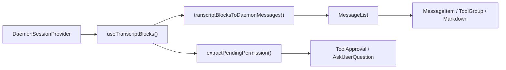
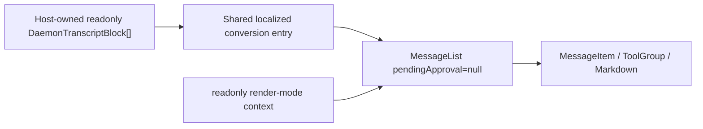

# Design for Read-only Daemon Transcript Rendering in WebShell

## Document Status

- Status: Implemented
- Date: 2026-07-14
- Scope: `packages/web-shell`
- Input: `readonly DaemonTranscriptBlock[]`
- Output: a read-only transcript view that inherits WebShell `MessageList` presentation capabilities

## 1. Background

WebShell already has a complete daemon transcript rendering path, but it can currently be used only indirectly through `App` or `ChatPane` in split view. The component first reads transcript blocks from `DaemonSessionProvider`, converts those blocks to WebShell's internal messages, and finally passes them to `MessageList` for rendering.

The new use case already holds a `DaemonTranscriptBlock[]` directly and needs only WebShell's message styling and rendering capabilities to display historical content. It does not need to establish a daemon session connection and must not perform session mutations. Interactions explicitly outside the target include tool approval, `AskUserQuestion`, retry, branch, prompt submission, and opening panels that modify session state.

If the host directly consumes the result of `transcriptBlocksToDaemonMessages` and assembles internal components, it exposes WebShell's private `DaemonMessage` model, contexts, and CSS constraints. It would also drift from the supported rendering when `MessageList` gains features. `@qwen-code/web-shell` therefore needs to provide a stable public entry point.

## 2. Goals

1. Add a public React component that directly accepts and renders `readonly DaemonTranscriptBlock[]`.
2. Reuse the existing `transcriptBlocksToDaemonMessages()` and the same `MessageList`, so user, assistant, thinking, tool, sub-agent, plan, status, Markdown, timeline, and long-session virtual-scrolling capabilities automatically evolve with `MessageList`.
3. Allow the component to render independently without `DaemonWorkspaceProvider`, `DaemonSessionProvider`, or a network connection.
4. Do not invoke any daemon/session mutation within the read-only boundary or display response UI for pending permissions or `AskUserQuestion`.
5. Primarily add exports without changing the runtime paths, defaults, or DOM behavior of the existing `WebShell`, `WebShellWithProviders`, `App`, or `ChatPane`.
6. Add complete component unit tests and pass the existing WebShell test suite, build, lint, and typecheck.

## 3. Non-goals

- Adding transcript retrieval, pagination, caching, or SSE subscriptions; the host supplies blocks.
- Inserting a read-only mode into the existing `WebShellProps`, or adding conditional `readOnly`/`blocks` dual data sources to `App`.
- Exporting internal `MessageList`, `Message`, or `DaemonMessage` types.
- Displaying or handling unresolved tool approvals or `AskUserQuestion`.
- Providing the App shell's composer, queued prompts, streaming status, sidebar, split view, dialogs, artifact right panel, or similar capabilities. The session timeline built into `MessageList` remains.
- Inferring or loading separate session artifacts from blocks. App-level turn-output cards for file changes, artifacts, and scheduled tasks are out of scope.
- Preventing interactions that modify only local presentation state, such as copy, collapse/expand tool, expand completed turn, table filtering, or timeline navigation.

## 4. Terminology and the Read-only Boundary

In this design, “read-only” means **not reading or modifying daemon/session runtime state**. It does not mean setting `pointer-events: none` on the entire DOM.

| Category                     | Behavior                                                                 | Retained                            |
| ---------------------------- | ------------------------------------------------------------------------ | ----------------------------------- |
| Passive presentation         | Text, Markdown, images, diff, shell output, tool/sub-agent status        | Yes                                 |
| Local viewing                | Copy, collapse, expand, virtual scroll, timeline, table sort/filter      | Yes                                 |
| Host-customized presentation | Markdown/code-block renderer, message-content renderer                   | Yes; the host owns any side effects |
| Ordinary external links      | New-window navigation after browser-safe URL transformation              | Yes                                 |
| WebShell semantic navigation | `qwen-session://` dispatches the global `qwen:open-session` event        | No; render as non-interactive text  |
| Session mutation             | Send prompt, cancel, retry, branch, rewind, switch model/mode            | No                                  |
| Permission mutation          | Approve/reject tool, submit/ignore `AskUserQuestion`                     | No                                  |
| External data loading        | Component-initiated session attach or transcript/artifact/task/MCP fetch | No                                  |

This boundary preserves the `MessageList` reading experience while ensuring that the component itself has no capability to write to the daemon.

## 5. Current State and Caller Map

| Module                                                       | Current responsibility                                                                       | Relationship to this design                                         |
| ------------------------------------------------------------ | -------------------------------------------------------------------------------------------- | ------------------------------------------------------------------- |
| `packages/sdk-typescript/src/daemon/ui/types.ts`             | Defines the `DaemonTranscriptBlock` union                                                    | Public input model for the new component                            |
| `packages/web-shell/client/adapters/transcriptToMessages.ts` | Combines blocks into WebShell `DaemonMessage[]`                                              | Reuse directly; do not create a new converter                       |
| `packages/web-shell/client/hooks/useMessages.ts`             | Reads blocks from a session hook and supplies localized conversion options                   | Extract a shared pure conversion entry that accepts external blocks |
| `packages/web-shell/client/components/MessageList.tsx`       | Turn collapse, tool/sub-agent groups, timeline, virtual scrolling, and per-message rendering | The only list implementation shared by the new and existing paths   |
| `packages/web-shell/client/components/MessageItem.tsx`       | Dispatches concrete renderers by message role                                                | No changes needed                                                   |
| `packages/web-shell/client/App.tsx`                          | Full single-session WebShell, approvals, composer, side panels                               | Existing path remains unchanged                                     |
| `packages/web-shell/client/components/ChatPane.tsx`          | Full interactive session in split view                                                       | Existing path remains unchanged                                     |
| `packages/web-shell/client/index.tsx` / `index.ts`           | Package runtime/source exports                                                               | Export the new component and type                                   |

The current primary path is:



The new read-only path bypasses the session provider and permission branch:



In the main WebShell editor, `/tasks` and `/mcp` are intercepted inside `App`. They update only dialog React state, do not call `sendPrompt()`, and do not write to session JSONL. Persisted transcripts therefore contain no sentinel for these two local panels, and the new entry adds no corresponding recognition or filtering branch.

## 6. Public API

Add a component named `WebShellTranscript`, exported from the `@qwen-code/web-shell` package root.

```ts
export interface WebShellTranscriptProps {
  /** Ordered transcript blocks from one logical session. */
  blocks: readonly DaemonTranscriptBlock[];

  theme?: WebShellTheme;
  language?: 'en' | 'zh-CN' | 'zh' | 'zh-cn';
  className?: string;
  style?: React.CSSProperties;
  chatMaxWidth?: number;
  workspaceCwd?: string;

  compactThinking?: boolean;
  collapseCompletedTurns?: boolean;
  markdownTableMode?: MarkdownTableMode;
  virtualScrollThreshold?: number;
  markdown?: WebShellMarkdownCustomization;

  composerTagIcons?: WebShellComposerTagIconMap;
  renderToolHeaderExtra?: ToolHeaderExtraRenderer;
  parseUserMessageContent?: UserMessageContentParser;
  renderUserMessageContent?: UserMessageContentRenderer;
  renderComposerTag?: ComposerTagRenderer;
  renderComposerTagTooltip?: ComposerTagRenderer;
  renderAssistantTurnFooter?: AssistantTurnFooterRenderer;
}

export function WebShellTranscript(
  props: WebShellTranscriptProps,
): React.ReactElement;
```

Notes:

- `blocks` is required and is neither copied nor modified. Callers should keep block sessions and ordering consistent within the array.
- Visual props reuse the names and types from `WebShellProps`, avoiding a second set of configuration semantics for the same capabilities.
- Do not expose `onComposerTagClick`, `onRetryClick`, `onBranchSession`, `onTurnOutputOpen`, permission callbacks, or composer callbacks.
- `theme` defaults to `dark`. When `language` is omitted, use WebShell's URL/browser-language resolution rules. `chatMaxWidth` defaults to 1000px.
- `compactThinking` defaults to `false` and `collapseCompletedTurns` defaults to `true`, matching the existing `WebShell`.
- The component treats the transcript as static/already replayed and passes `isResponding={false}` to `MessageList`. Live streaming is outside the current API scope.

Example:

```tsx
import { WebShellTranscript } from '@qwen-code/web-shell';
import type { DaemonTranscriptBlock } from '@qwen-code/sdk/daemon';

export function HistoryView({
  blocks,
}: {
  blocks: readonly DaemonTranscriptBlock[];
}) {
  return (
    <WebShellTranscript
      blocks={blocks}
      theme="dark"
      language="zh-CN"
      workspaceCwd="/workspace/project"
      style={{ height: 640 }}
    />
  );
}
```

The host must give the component a usable height. The component itself preserves WebShell's `height: 100%`, internal scrolling, and content-width behavior.

## 7. Detailed Design

### 7.1 Shared Localized Conversion

Keep `transcriptBlocksToDaemonMessages()` as the only block-to-message adapter. Extract an internal pure function in `useMessages.ts`, for example:

```ts
export function transcriptBlocksToLocalizedMessages(
  blocks: readonly DaemonTranscriptBlock[],
  t: Translator,
): Message[];
```

Export this function only from its internal package module for reuse by the new component; do not expose it from the package root.

The function only assembles the localized labels currently used by `useMessages()` and then calls the existing adapter. Both the existing `useMessages()` and the new component call it, preventing drift in copy for prompt cancellation, branch, mid-turn insertion, and interrupted streams.

This is the only internal restructuring needed in the existing rendering path. Function input, output, and existing conversion results stay unchanged, and the adapter's block-combination rules are not modified.

### 7.2 `WebShellTranscript` Component Structure

Add `packages/web-shell/client/components/WebShellTranscript.tsx` with this internal sequence:

1. Resolve theme and language and create a translator.
2. Convert `blocks` to `Message[]` with `useMemo`.
3. Create the same message-layer customization value as the existing App.
4. Mount WebShell's theme, i18n, customization, compact-mode, read-only render-mode, and portal contexts.
5. Create an independent root with `data-web-shell-root` and `data-web-shell-shadcn`, reusing the App's theme class, base variables, fonts, background, and CSS-isolation rules.
6. Render the same `MessageList`.

The important fixed `MessageList` inputs are:

```tsx
<MessageList
  messages={messages}
  pendingApproval={null}
  isResponding={false}
  workspaceCwd={workspaceCwd ?? ''}
  virtualScrollThreshold={virtualScrollThreshold}
/>
```

Never pass these action props:

- `onShowContextDetail`
- `onRetryClick`
- `onBranchSession`
- `onReviewChanges`
- `onOpenArtifact`
- `onOpenScheduledTask`
- `onTurnOutputOpen`

Do not pass loading, catch-up, tail, or turn-output data, avoiding any dependency on the App's connection-state and external-resource models.

### 7.3 Isolation of Interactive Renderers

Passing only `pendingApproval=null` to `MessageList` does not fully guarantee read-only behavior. Session links in goal status, Markdown, and tool results do not use `MessageList` callbacks; they dispatch global semantic events to `window`, potentially changing the footer or active session of another WebShell on the same page.

Add a package-internal transcript render-mode context in `client/transcriptRenderMode.ts` with a default value of `interactive`. Existing `App` and `ChatPane` need no new provider, so their behavior remains unchanged. `WebShellTranscript` sets the value to `readonly`. Read-only mode applies only these restrictions:

- Preserve the text and style of `qwen-session://` links, but do not dispatch `qwen:open-session`.
- `GoalStatusMessage` does not dispatch `GOAL_STATUS_ACTIVE_EVENT`.
- Do not intercept ordinary HTTPS links or local viewing interactions such as copy, collapse, and sorting.

This context changes only semantic-event exits in `Markdown`, `ToolGroup`, and `GoalStatusMessage`, and its default is locked to `interactive`. This avoids adding a `readOnly` prop that must thread through every renderer from `MessageList`. New unit tests must prove both that the default interactive behavior is unchanged and that read-only behavior is suppressed.

### 7.4 Theme, CSS, and Portals

The WebShell library build injects and scopes component CSS under `[data-web-shell-root]` or `[data-web-shell-portal-root]`. The new component must create its own WebShell root; otherwise `MessageList` may produce DOM that CSS module rules do not match.

Timeline tooltips and advanced Markdown tables use portals. To fully inherit those capabilities, the new component uses a portal-host lifecycle equivalent to the App's:

- On mount, append a node with `data-web-shell-portal-root` and `data-web-shell-shadcn` to `document.body`.
- Synchronize the root's theme class and CSS variables.
- Supply the node through `WebShellPortalRootContext`.
- On unmount, remove the node and its observer/listener.

Keep this lifecycle inside the new component rather than refactoring the App's existing portal code, limiting the regression surface of existing behavior to the new entry. Do not access `document` during SSR; enable the portal only after client mount.

### 7.5 Error Isolation

The new entry has an outer public boundary and an inner content component. Block conversion, provider/portal initialization, and `MessageList` all occur in a child of the boundary, ensuring that failures during any of these stages reach the same `RootErrorFallback` as the public WebShell entry. Each message remains isolated by `MessageItem`'s own boundary, so a failure in one Markdown, KaTeX, Mermaid, or tool renderer does not blank the entire transcript.

### 7.6 Block Rendering Strategy

All strategies continue to use the existing adapter; do not add a second switch in the new component.

| `DaemonTranscriptBlock.kind` | Read-only result                                                                        |
| ---------------------------- | --------------------------------------------------------------------------------------- |
| `user`                       | User messages, images, and input annotations                                            |
| `assistant`                  | Assistant Markdown; consecutive blocks merged; sub-agent content assigned by parent     |
| `thought`                    | Thinking messages; consecutive blocks merged                                            |
| `tool`                       | Existing cards for tool groups, diff/read/shell/fetch/todo/sub-agent                    |
| `shell`                      | Associate with the nearest execution tool; existing raw-shell fallback when unavailable |
| `user_shell`                 | User shell command/output                                                               |
| `status` / `debug`           | Plan or system/status message                                                           |
| `error`                      | Error system message with no retry action                                               |
| `prompt_cancelled`           | Localized cancellation status                                                           |
| unresolved `permission`      | Do not convert, display, or provide an action entry                                     |
| resolved `permission`        | Existing historical tool placeholder/result rules from the adapter                      |
| `AskUserQuestion` permission | Do not show the form; show historical results only when a later real tool block exists  |

### 7.7 Updates and Performance

- Run the O(n) conversion again only when `blocks` identity or language changes.
- `MessageList` retains its existing memoization, turn grouping, and virtual-scrolling threshold.
- Do not deep-copy blocks or create a new React provider for every block.
- A caller that frequently supplies identity-new arrays with identical content triggers conversion again. This is acceptable and matches the current `useTranscriptBlocks()` update model.
- Do not add an incremental adapter in this release. Design incremental conversion separately only if measurements show updates to large external transcripts are a bottleneck.

## 8. Compatibility and Regression Control

### 8.1 Existing Paths Remain Unchanged

- `WebShellProps` gains no required fields and changes no defaults.
- `WebShell` and `WebShellWithProviders` continue to render `App`.
- `App` and `ChatPane` continue to read session state from their respective providers/hooks.
- The approval overlay, composer, sidebar, split view, and artifact panel do not pass through the new component.
- `MessageList` gains no `readOnly` prop branch. The new caller establishes read-only behavior by passing `pendingApproval=null`, omitting action callbacks, and using an internal render-mode context whose default remains interactive to isolate the few global semantic events.

### 8.2 Package Exports

Update both `client/index.tsx` and `client/index.ts` to export:

```ts
export { WebShellTranscript } from './components/WebShellTranscript';
export type { WebShellTranscriptProps } from './components/WebShellTranscript';
```

Both barrels must change to avoid the current dual runtime-entry and declaration/source-entry paths producing “exported at runtime but missing from type declarations.” Do not add a package subpath export.

### 8.3 Security

- The new entry does not import `useActions()`, `useTranscriptStore()`, `useConnection()`, or `fetch`.
- Pending permission content does not enter an interactive renderer.
- Do not inspect or rewrite status-message content. Dialog state for `/tasks` and `/mcp` is inherently absent from persisted transcripts.
- Read-only render mode does not dispatch session/goal global events that could affect another WebShell on the same page.
- Markdown URL and HTML handling continue to use the existing WebShell sanitizer/transform; do not add `dangerouslySetInnerHTML` or another bypass.
- Custom renderers are host code. Side effects executed by a host renderer are outside the component's guaranteed read-only boundary, and the README must state this explicitly.

## 9. Test Design

### 9.1 New Component Contract Unit Tests

Add `WebShellTranscript.test.tsx`, mocking `MessageList` to verify the boundary and wiring:

1. The shared localized adapter converts blocks to messages with the correct order and content.
2. `pendingApproval` is always `null`.
3. Session mutation, permission, retry, branch, and turn-output callbacks are all omitted.
4. `isResponding` defaults to `false`, and workspace and virtual-scroll configuration are forwarded correctly.
5. Theme, language, compact/collapse behavior, and message customization enter the correct contexts.
6. Changes to blocks or language regenerate messages without duplicating old content.
7. Empty blocks render an empty list without throwing.

### 9.2 New DOM Integration Unit Tests

Add `WebShellTranscript.dom.test.tsx` using the real `MessageList`:

1. Render successfully in a React tree without daemon providers.
2. Representative user, assistant Markdown, thought, tool, sub-agent, plan, status, error, and prompt-cancelled blocks enter the corresponding WebShell DOM.
3. Local collapse/expand, copy, or timeline navigation still works, proving that `MessageList` capabilities are reused.
4. An unresolved ordinary permission does not produce an approval panel.
5. An unresolved `AskUserQuestion` does not produce option, input, submit, or ignore UI.
6. Resolved historical tool/AskUser results follow the adapter's existing presentation rules.
7. Read-only session links and goal statuses do not dispatch global semantic events; corresponding existing component tests continue to prove the default interactive behavior is unchanged.
8. Dark/light classes, language, localized text, chat maximum width, and CSS root markers are correct.
9. The portal root mounts and unmounts correctly, and portal content is under the scoped root.
10. When an individual custom renderer throws, the built-in renderer fallback is used and the rest of the message remains.

### 9.3 Shared Conversion and Export Tests

- Extend `useMessages`/adapter tests to prove that the existing hook and external blocks use exactly the same localized options.
- Extend `index.test.tsx` or build-artifact tests to verify that the runtime named export exists.
- After building, verify that `dist/types/index.d.ts` contains exports for `WebShellTranscript` and its props, preventing drift between the two entry declarations.

### 9.4 Existing Regression Suite

The minimum required verification sequence after implementation is:

```bash
cd packages/web-shell
npm run build
npx vitest run --config vitest.config.ts \
  client/components/WebShellTranscript.test.tsx \
  client/components/WebShellTranscript.dom.test.tsx \
  client/hooks/useMessages.test.ts \
  client/adapters/transcriptToMessages.test.ts \
  client/components/MessageList.test.ts \
  client/components/MessageList.dom.test.tsx \
  client/components/messages/Markdown.test.ts \
  client/components/messages/ToolGroup.test.tsx \
  client/components/messages/SystemMessage.test.tsx \
  client/index.test.tsx
npm test
npm run format:check
npm run lint
npm run typecheck

cd ../..
npm run build
npm run typecheck
```

`npm test` is the existing full WebShell suite and must pass for this change. The change adds no standalone page and does not alter the existing Playwright smoke test's App/daemon protocol, so no browser E2E test is added. `WebShellTranscript.dom.test.tsx` covers real DOM behavior.

## 10. Implementation Steps

1. Extract the shared localized block conversion in `useMessages.ts`, preserving the current hook output.
2. Add an internal transcript render-mode context and consume it at the session-link/goal-event exits; preserve `interactive` as the default.
3. Add `WebShellTranscript` and its props, implementing root/provider/portal/`MessageList` wiring.
4. Add runtime and type exports to both public barrels.
5. Update `packages/web-shell/README.md` with a read-only integration example, the host-height requirement, and the read-only boundary.
6. Add contract, DOM, interaction-isolation, and export/type-declaration tests.
7. Run targeted tests, the full WebShell test suite, build, lint, and typecheck.
8. Review the complete diff according to repository guidance; rerun step 7 after any fix.

## 11. Alternatives

### 11.1 Add `blocks` and `readOnly` to the Existing `WebShell`

Rejected. `App` currently consumes several daemon hooks unconditionally and manages approvals, the composer, session, sidebar, and panels. Dual data sources would add conditional branches throughout `App`, requiring providers while also guarding against mutation. Its regression surface is much larger than this requirement.

### 11.2 Publicly Export `MessageList`

Rejected. Callers would still depend on private `Message[]`, multiple contexts, CSS-root conventions, and portal conventions, and the internal model would become a long-term public API.

### 11.3 Duplicate the Renderer for Read-only Use

Rejected. Duplication would immediately fork Markdown, tool/sub-agent, turn-collapse, timeline, and virtual-scrolling behavior, failing the requirement to inherit `MessageList` rendering capabilities.

### 11.4 Display Disabled Permission/AskUserQuestion in the New Component

Rejected. Disabled forms still create interactive semantics and additional state branches, and they mislead users into thinking they can answer in a historical view. Pending permissions are hidden in this release; subsequent tool blocks carry historical results.

## 12. Risks and Mitigations

| Risk                                                       | Mitigation                                                                                                |
| ---------------------------------------------------------- | --------------------------------------------------------------------------------------------------------- |
| Localized conversion drifts between the new entry and App  | Both call the same localized conversion helper                                                            |
| Portal misses the CSS scope                                | Create a separate `data-web-shell-portal-root`, synchronize variables, and cover with DOM tests           |
| Accidental daemon mutation                                 | New component imports no action hooks and exposes no mutation callback; contract tests lock this down     |
| App-local dialog state is mistaken for transcript data     | Explicitly document that `/tasks` and `/mcp` do not write JSONL; new entry does not copy App dialog state |
| Global semantic events affect another WebShell on the page | Read-only render mode suppresses session/goal events; regression tests cover default behavior             |
| A new block kind has no presentation                       | Continue supporting it through the shared adapter; do not duplicate a switch in the component             |
| Package runtime and type exports diverge                   | Update both barrels and inspect the built declarations                                                    |
| Large-transcript recomputation cost                        | `useMemo` plus existing virtual scrolling; defer incremental conversion until supported by measurements   |
| Custom renderer introduces side effects                    | Document host responsibility; default renderers remain read-only                                          |

## 13. Acceptance Criteria

- A host can render a WebShell transcript in an environment without daemon providers by supplying only blocks.
- Representative blocks render identically to the same data in the existing WebShell `MessageList`.
- Pending tool permissions and `AskUserQuestion` produce no interactive UI or submission path.
- The read-only view dispatches no global session/goal semantic events.
- The new component retains `MessageList`'s local reading interactions and long-list capabilities.
- Existing `WebShell`/`WebShellWithProviders` APIs, defaults, tests, and runtime behavior remain unchanged.
- Both the runtime and `.d.ts` for `@qwen-code/web-shell` export the new component and props.
- New unit tests, the existing complete WebShell suite, and root build/typecheck all pass.
