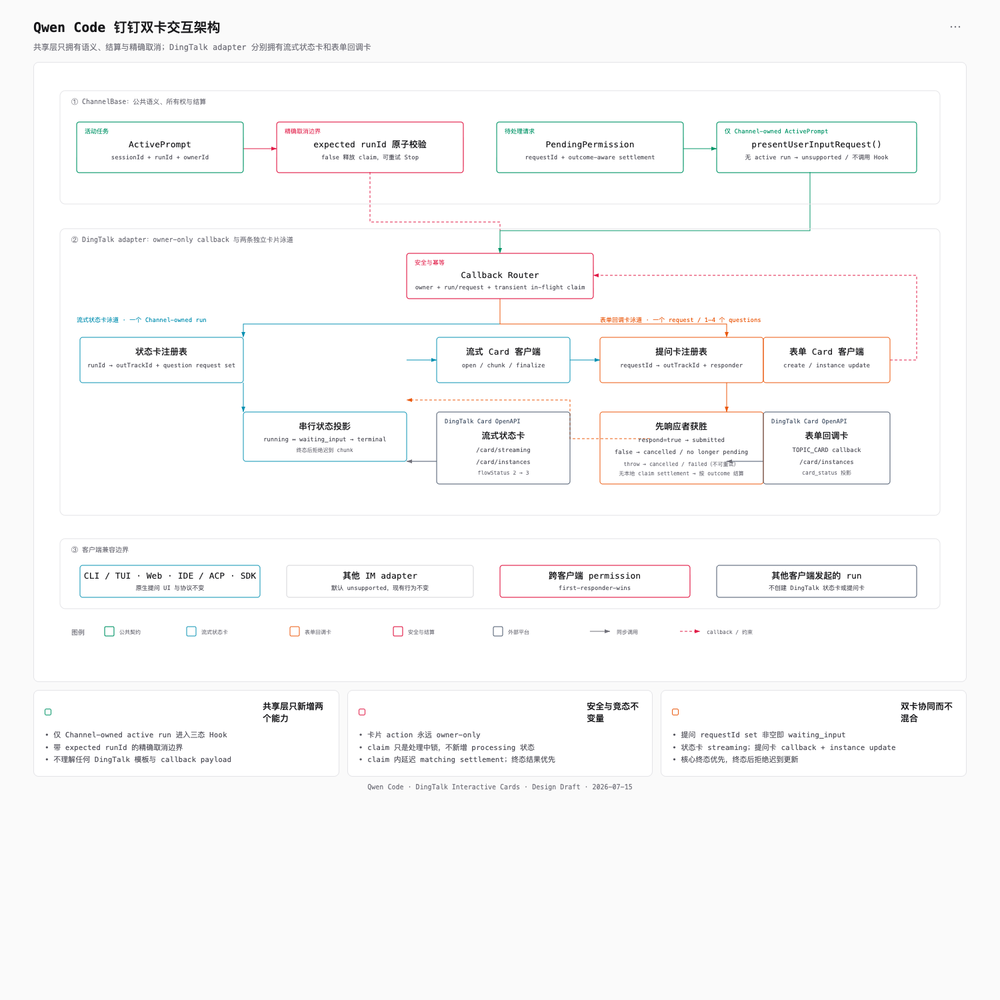
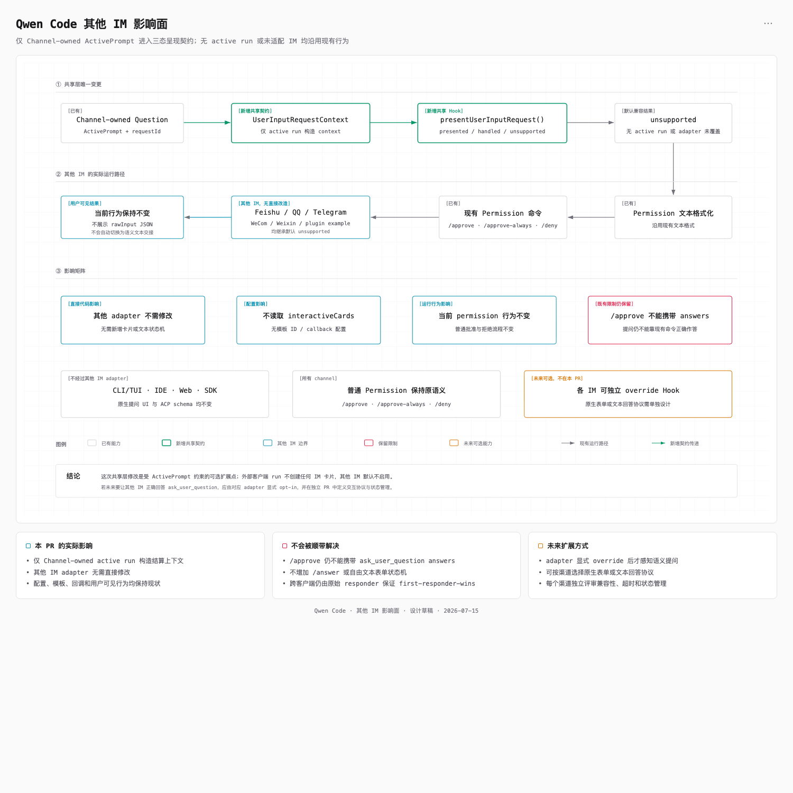
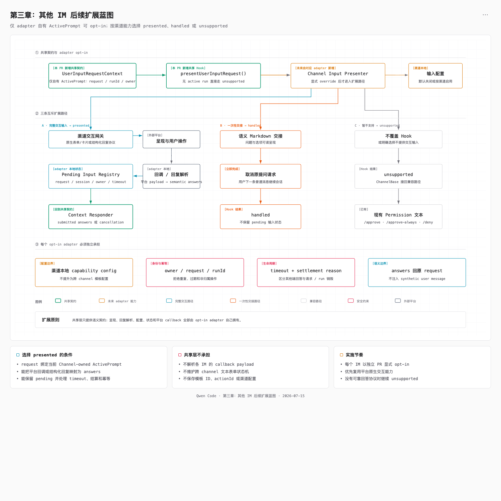

# DingTalk Interactive Cards

## Status

Final design draft for [#6443](https://github.com/QwenLM/qwen-code/issues/6443). This document fixes the implementation boundary, payload contract, state ownership, degradation behavior, and acceptance criteria before implementation begins. This PR remains design-only and does not change runtime behavior.

## Motivation

The DingTalk channel can already deliver Markdown, receive task lifecycle events, relay permission requests, and cancel an active prompt. It does not provide an in-place running-status card, an exact-run Stop action, or a form card that can return structured `ask_user_question` answers to the original request.

The design adds those DingTalk interactions without teaching the model, tools, ACP schema, or other channel adapters about DingTalk templates and callback payloads.

## Chapter 1: Target architecture



The architecture has four ownership layers:

1. Core and ACP continue to own semantic questions and permission resolution.
2. `ChannelBase` owns pending-request registration, settlement, and exact-run cancellation.
3. The DingTalk adapter owns card presentation, callback routing, registries, idempotency, and degradation.
4. DingTalk Card OpenAPI owns delivery, streaming updates, instance updates, and callback transport.

There are two card types, not one generic card lifecycle:

| Card                  | Business object                         | DingTalk protocol                                        | Local lifecycle                                                         |
| --------------------- | --------------------------------------- | -------------------------------------------------------- | ----------------------------------------------------------------------- |
| Streaming status card | One Channel-owned prompt run            | `createAndDeliver`, `/card/streaming`, `/card/instances` | `running`, `waiting_input`, `completed`, `failed`, `cancelled`          |
| Form callback card    | One Channel-owned user-question request | `createAndDeliver`, card callback, `/card/instances`     | `pending`, `submitted`, `cancelled`, `expired`, `resolved_outside_card` |

They share authentication and callback ingress, but they keep independent registries and state machines.

## Existing capabilities reused — no change

- `ask_user_question` already defines questions, options, and multi-select behavior.
- ACP permission metadata identifies a user-question interaction and preserves the questions.
- Pending permissions already have request IDs and a one-shot response path.
- `ChannelBase` already supports multiple pending permission requests for the same chat.
- Task lifecycle events already expose `started`, text chunks, tool calls, `completed`, `failed`, and `cancelled`.
- Active-prompt cancellation already powers `/cancel`.
- DingTalk already has Stream connectivity and a generic downstream callback ingress.
- CLI/TUI, Web, and IDE surfaces already render user questions natively.

## Source constraints verified

The behavioral constraints below were rechecked against `origin/main` at `401170d48889`:

- `packages/channels/base/src/ChannelBase.ts` registers each pending permission, including its request and chat index, before formatting or sending the existing Markdown prompt. The same registry supports multiple requests in one chat and drives `/approve`, `/approve-always`, and `/deny` lookup.
- `packages/channels/base/src/ChannelAgentBridge.ts` includes the permission outcome on `PermissionResolvedEvent`. `packages/channels/base/src/AcpBridge.ts` emits that event synchronously before a successful responder returns, while `packages/channels/base/src/DaemonChannelBridge.ts` retains a responded-request mapping and can emit the event later.
- `packages/core/src/tools/askUserQuestion.ts` permits one to four questions. The live `permission_request` carries the ordered questions but does not guarantee a render-ready `answerKey` on each one. `packages/acp-bridge/src/bridgeClient.ts` adds index-based answer keys only to its pending-interaction status snapshot. The Channel seam must therefore derive the same `String(index)` keys when it normalizes the live request.
- The ACP session consumes a top-level `answers: Record<string, string>` in addition to the permission outcome. Multi-select answers remain comma-and-space joined strings for compatibility with the existing TUI and Web clients.
- The generic permission commands submit an option or cancellation outcome, not structured answers. Approving an `ask_user_question` through the current Channel path therefore resumes it with an empty answer map and produces `No valid answers were provided.` The card-presented path must not reuse `/approve`.
- When more than one request is pending, the existing ambiguity response already lists request IDs and titles, so the design does not add another card field only for command disambiguation.

## Change impact and implementation boundary

The labels in this document are normative:

- **Change required — shared Channel layer** means the implementation changes `ChannelBase` or Channel-owned public types.
- **DingTalk-only change** means no other adapter reads the configuration or participates in the state machine.
- **No change** means the existing contract and runtime behavior remain authoritative.

| Layer or surface                                                                                | Impact                               | Required work                                                                                                                                                                            |
| ----------------------------------------------------------------------------------------------- | ------------------------------------ | ---------------------------------------------------------------------------------------------------------------------------------------------------------------------------------------- |
| `packages/channels/base/src/ChannelBase.ts`                                                     | Change required — shared Channel     | Add run identity, exact-run cancellation, semantic question normalization, presentation settlement, and structured-question command handling.                                            |
| `packages/channels/base/src/types.ts` and exports                                               | Change required — shared Channel     | Add the semantic-input types and an optional public lifecycle `runId`; events emitted by `ChannelBase` always populate it.                                                               |
| `packages/channels/dingtalk`                                                                    | DingTalk-only change                 | Add card configuration, Card OpenAPI access, callback parsing, owner checks, two registries, bounded coalesced projections, degradation, and tests.                                      |
| This design document                                                                            | Change required — documentation only | Record the final payload, ownership, change-impact, lifecycle, degradation, and acceptance contracts.                                                                                    |
| Existing architecture assets                                                                    | No change                            | They already show the shared seam, DingTalk-local paths, and unaffected-client boundary; the written contract supplies the field-level detail.                                           |
| `packages/core`, `ask_user_question`, and `ToolConfirmationPayload`                             | No change                            | Continue producing semantic questions and consuming `answers`.                                                                                                                           |
| ACP agent session, ACP schema, `acp-bridge`, permission mediator, daemon routes, and daemon SDK | No change                            | Continue carrying `toolCall`, permission options, outcomes, and top-level `answers`.                                                                                                     |
| `ChannelAgentBridge`, `AcpBridge`, `DaemonChannelBridge`, daemon worker, and `SessionRouter`    | No change                            | Continue relaying complete permission requests, routing by owning `sessionId`, and returning permission responses. No separate `userQuestionRequest` bridge event is introduced.         |
| CLI/TUI, Web/Desktop, IDE, SDK clients                                                          | No change                            | Continue using their existing native question UIs and permission transports.                                                                                                             |
| Feishu, WeCom, QQ, Telegram, Weixin, and plugin adapters                                        | No direct change                     | Inherit the default `unsupported` presentation result and retain existing permission Markdown and commands. Their known inability to return structured Channel answers remains explicit. |

The optional public lifecycle `runId` avoids forcing third-party adapters or test fixtures that synthesize lifecycle events to change immediately. It is not optional inside `ChannelBase`: every Channel-owned prompt has one, and every lifecycle event emitted for that prompt includes it. DingTalk creates no status card and exposes no card-bound Stop action if that identity is absent.

## Channel-neutral user-input seam — shared Channel change

`ChannelBase` gains one semantic presentation hook with three explicit outcomes:

```ts
type UserInputPresentationResult =
  | { kind: 'presented' }
  | { kind: 'handled' }
  | { kind: 'unsupported' };

type UserInputSettlementReason =
  | 'resolved_outside_card'
  | 'cancelled'
  | 'run_cancelled';

type ChannelUserInputResponse = RequestPermissionResponse & {
  answers?: Record<string, string>;
};

interface ChannelUserQuestion {
  answerKey: string;
  header: string;
  question: string;
  options: Array<{
    label: string;
    description: string;
  }>;
  multiSelect: boolean;
}

interface ChannelUserInputRequestContext {
  requestId: string;
  sessionId: string;
  runId: string;
  target: SessionTarget;
  questions: ChannelUserQuestion[];
  submitOptionId: string;
  settlementSignal: AbortSignal;
  respond(response: ChannelUserInputResponse): Promise<boolean>;
}

protected presentUserInputRequest(
  context: ChannelUserInputRequestContext,
): Promise<UserInputPresentationResult>;
```

`settlementSignal.reason` contains a `UserInputSettlementReason`. `ChannelBase` is the only writer and routes every abort through a private helper whose reason parameter is typed as that union; adapters receive only the read-only signal and do not cast or call `AbortController.abort()` themselves. The context contains no template ID, action ID, DingTalk callback payload, owner-domain type, or mutable bridge object. `submitOptionId` is the original permission option advertised as `allow_once`; for compatibility with current producers, an option whose ID is `proceed_once` and whose `kind` is absent is treated the same way. The adapter never invents an option ID.

### Semantic request recognition

`ChannelBase` owns one normalizer so adapters do not independently reinterpret the ACP payload:

1. The canonical discriminator is `toolCall._meta.qwenInteractionKind === 'user_question'`.
2. Canonical questions come from `toolCall._meta.qwenQuestions`.
3. For older producers, `toolCall.rawInput.questions` is accepted only when the canonical tool name or tool kind also identifies `AskUserQuestion`. A different tool that happens to accept a `questions` argument is not semantic user input.
4. The normalizer validates one to four ordered questions, normalizes an omitted `multiSelect` to `false`, and assigns `answerKey: String(index)`.
5. A malformed canonical request is not partially rendered. It follows the existing unsupported permission path and records a structured diagnostic without logging question answers.

The hook is inserted after the pending permission and its settlement controller are stored, but before the existing permission formatter and sender:

```text
store PendingPermission + settlement controller
active = current attended Channel-owned ActivePrompt for event.sessionId
normalize semantic question + compatible allow_once option
if valid question and active has runId + submitOptionId:
  construct context from active and normalized questions
  result = presentUserInputRequest(context)
  presented   -> mark structured input as presented, keep pending, and return
  handled     -> adapter already called context.respond; do not send generic permission text
  unsupported -> continue
format and send the existing permission message
```

The `respond` closure is the only adapter-visible settlement operation. It binds the request ID, forwards the complete response through the existing bridge, and performs the same pending cleanup on `true`, `false`, and throw paths. `handled` is valid only after the adapter has invoked that closure, normally to cancel a question after presenting a readable fallback. It is not a second way to leave a request pending.

Every path that removes a pending permission settles the controller exactly once. This includes permission commands, the context responder, daemon `permissionResolved`, session cleanup, task cancellation, and bridge replacement. A locally known run cancellation settles with `run_cancelled` before a later collapsed bridge outcome can overwrite it. An independent `permissionResolved` with a cancelled outcome, or with the original reject option, becomes the neutral `cancelled`; another or missing outcome becomes `resolved_outside_card`. The bridge does not preserve enough cause information to infer timeout versus denial versus cleanup, so this classification never labels an unknown cancellation as `expired` and never guesses which client responded. The DingTalk-local question timer owns the distinct `expired` projection before it calls the responder.

The hook is only eligible for the current attended Channel-owned `ActivePrompt`. `loopPrompt === true` is ineligible; that excludes both scheduled loop jobs and webhook producers, whose message IDs and senders are synthetic rather than human DingTalk input. When no eligible active prompt or `runId` exists, `ChannelBase` does not construct the context or invoke the hook; it treats presentation as `unsupported` and continues the existing permission path. The adapter independently requires a real DingTalk inbound-message ownership record for the run. A run started by CLI, Web, IDE, SDK, another client, a loop, or a webhook therefore creates neither card-bound interaction. The initial design does not add cross-client run ownership, public owner lifecycle fields, or identity federation.

The default hook returns `unsupported`. Other IM adapters therefore retain their current permission formatting and commands.

## Exact-run identity and cancellation — shared Channel change

Every prompt invocation creates an opaque unique `runId` and stores it on the corresponding `ActivePrompt`. It is not the daemon lifecycle generation, which changes for session lifecycle operations rather than every prompt.

`ChannelTaskLifecycleBase` exposes `runId?: string` for source compatibility, while `ChannelBase` includes the concrete ID on every `started`, `text_chunk`, `tool_call`, and terminal event it emits for the run. A consumer receiving an event without an ID may continue its existing behavior but cannot create an exact-run card action.

A status-card Stop callback carries that `runId` into a new protected `ChannelBase` exact-run cancellation entry point. The method reads the current active prompt once and atomically checks the expected ID before entering the existing cancellation path. A missing active prompt or a missing, stale, or mismatched ID returns `false`; the card-bound path never falls back to session-only cancellation. Existing `/cancel` behavior remains session-scoped and unchanged.

The accepted Stop sequence is:

1. Validate the callback owner and card identity.
2. Synchronously claim the current live callback before the first asynchronous operation.
3. Ask `ChannelBase` to cancel the exact expected run.
4. If cancellation returns `true`, block new status-card chunks, close streaming, and commit the Stopped presentation.
5. If cancellation returns `false` and the same record is still current and non-terminal, release the claim, keep the card active, and allow a retry.

The claim is an adapter-local in-flight lock, not a lifecycle state. An asynchronous result can update or release only the same still-current, non-terminal record; a timeout, settlement, or terminal lifecycle event that wins during the await cannot be overwritten. This prevents an old card from cancelling a newer prompt, prevents duplicate callbacks from racing, and avoids claiming success before cancellation succeeds without adding a public `processing` state.

## Owner-only card actions — DingTalk-only change

Card-action authorization is stricter than shared-session message authorization. Stop, submit, and cancel are always owner-only regardless of `sessionScope`.

At inbound-message time, DingTalk already prefers `senderStaffId` and falls back to `senderId` for the envelope sender. Before handing a real inbound turn to `ChannelBase`, the adapter records `messageId -> DingTalkOwnerKey`. The map follows the existing inbound-message cap of 1,000 entries. A matching `started` lifecycle event consumes and removes that mapping, creates a DingTalk-local run/status record, and binds the same Channel-generated `runId` to the typed owner. Loop and webhook message IDs never enter the map. Terminal run cleanup removes the run/status record after finalizing its questions. The callback router normalizes the callback's `userId`, `senderStaffId`, or `senderId` into the same typed domain and requires an exact match. If no comparable identity is available, the action fails closed.

A foreign-user callback is acknowledged and logged but cannot mutate a run, permission request, or card.

## DingTalk-local implementation — DingTalk-only change

Only the DingTalk adapter reads `interactiveCards` and registers the card callback topic. It owns:

- A shared authenticated Card OpenAPI client that applies the fixed 10-second request timeout to both card types.
- A bounded real-inbound owner map.
- A run/status registry keyed by `runId`, with an optional status-card `outTrackId`.
- A question-card registry keyed by `requestId` and `outTrackId`.
- An owner-validating callback router.
- Per-card coalesced writers, transient in-flight claims, and bounded terminal tombstones.
- DingTalk-local fallback and structured error reporting.

The run/status record keeps `pendingQuestionRequestIds: Set<string>` independently of whether a status card is enabled or created. The question registry does not supersede an older request merely because a newer request exists in the same session. Every terminal question path goes through one `finalizeQuestion` operation: it removes the live question record, clears its timer and settlement subscription, removes the request ID from the run set, re-derives `waiting_input` when a non-terminal status card exists, and replaces the live record with a compact tombstone. Submit, cancel, responder `false`, responder throw, independent settlement, local timeout, and request/run destruction all use this operation. A terminal status card ignores later set mutations.

## Streaming status-card lifecycle — DingTalk-only change

The status card represents one Channel-owned run. Runs initiated by CLI, Web, IDE, SDK, or another client can still affect shared session state, but they do not create a DingTalk status card.

Creation and streaming follow DingTalk's streaming-card protocol:

1. Call `createAndDeliver` with a unique `outTrackId` and initial `flowStatus=2`.
2. Open streaming with an empty full update using `isFull=true`, `isFinalize=false`, and `isError=false`.
3. Accumulate model output locally and send coalesced full snapshots through `/card/streaming`.
4. Send low-frequency template variables such as status text through `/card/instances` with `updateCardDataByKey=true`.

Raw chunks never become one network request each. Each status record allows at most one Card OpenAPI write in flight and one replaceable pending full snapshot. A fixed 500 ms minimum flush interval coalesces newer chunks into that pending snapshot. Visible content is capped at 20,000 characters; overflow drops the oldest content and inserts a truncation marker rather than growing memory. Every Card OpenAPI call has a 10-second timeout. An intermediate timeout or failure records a structured error, stops further streaming writes for that card, and retains the latest bounded text for the awaited final delivery path.

`running` and `waiting_input` are Qwen Code presentation states; both keep DingTalk `flowStatus=2` and streaming open. The transition rules are:

```text
started -> running
running -> waiting_input                 when the first question becomes pending
waiting_input -> waiting_input           while any question remains pending
waiting_input -> running                 when the final question settles and the run is active
running | waiting_input -> completed
running | waiting_input -> failed
running | waiting_input -> cancelled
```

`waiting_input` deliberately means that at least one DingTalk question card is awaiting structured answers; it is not a general host-blocked state. Ordinary tool permissions continue through the existing Markdown and permission-command path and do not move the status card out of `running`. Covering every permission wait would require a broader shared permission-lifecycle signal and is outside this two-card proposal.

The core lifecycle remains `cancelled`; no `stopped` event is introduced. A cancellation with reason `cancel_command` may be presented as “Stopped” in DingTalk, while other cancellation reasons may be presented as “Cancelled”.

For `blockStreaming !== 'on'`, DingTalk overrides the existing awaited `onResponseComplete()` seam. That method consumes the latest accumulated text, cancels a pending flush timer, waits for the single in-flight write within its timeout, performs the completed final instance update, and falls back to the existing Markdown sender if card creation or finalization did not succeed. `ChannelBase` therefore emits `completed` only after one awaited delivery path finishes. No new shared terminal-delivery hook is added.

When `blockStreaming === 'on'`, DingTalk does not create a status card and does not consume raw lifecycle chunks for card delivery; the existing `BlockStreamer` remains the only response-delivery path. Question cards remain independently eligible. `onTaskLifecycle` records terminal causes and may make best-effort failed/cancelled projections, but it is not treated as an awaited delivery guarantee.

Terminal status-card updates follow one bounded order:

1. Stop accepting new streaming chunks, cancel the flush timer, and fold the single pending snapshot into the final bounded content instead of replaying each original chunk.
2. If streaming was opened, close it with `isFinalize=true`.
3. Commit the final content, copyable content, status text, and `flowStatus=3` with one `/card/instances` update.

Completed, failed, and cancelled all project to DingTalk `flowStatus=3`; the final content and status text distinguish them. Once terminal, the per-`outTrackId` writer rejects late streaming updates.

## Form callback-card lifecycle — DingTalk-only change

The question card represents one permission request containing the complete normalized question array. The tool schema allows one to four questions, and `ChannelBase` derives the same index-based `answerKey` convention used by daemon pending-interaction snapshots. One card therefore renders and submits the full set; there is no per-question registry or card lifecycle. It is created with `card_status=pending` and does not call `/card/streaming`. All presentation changes use `/card/instances` with `updateCardDataByKey=true`.

Each pending record contains:

- `requestId`, `outTrackId`, and `runId`.
- The complete ordered question set and its answer keys.
- The original advertised `submitOptionId`.
- The typed owner identity.
- The original one-shot responder.
- Timeout and settlement subscriptions.
- The local state; terminalization replaces the record with a compact tombstone.

The callback order is authoritative:

1. Locate the record by `outTrackId` and correlate the request and run.
2. Parse the submit or cancel payload without changing the record.
3. Validate the action owner.
4. Synchronously claim the current live record before the first asynchronous operation.
5. Acknowledge the callback immediately. Invalid, duplicate, stale, and foreign-owner callbacks are also acknowledged exactly once after their synchronous checks.
6. Call the original responder.
7. If the same record is still current and non-terminal, finalize and project the card from the responder result.

Submit encodes the form using the existing cross-client contract:

```json
{
  "outcome": {
    "outcome": "selected",
    "optionId": "<advertised allow_once option>"
  },
  "answers": {
    "0": "Beijing staging",
    "1": "Logs, Metrics"
  }
}
```

Single-select values and custom input are strings. Multi-select values are joined with `", "` to match the current TUI and Web behavior. Cancel sends only a cancelled or advertised reject outcome and no answers. The adapter never sends a synthetic prompt or inbound message.

The card never displays submission success before the responder accepts the answer:

| Event                              | Local state             | Card projection                                                         |
| ---------------------------------- | ----------------------- | ----------------------------------------------------------------------- |
| Submit responder returns `true`    | `submitted`             | Submitted and disabled                                                  |
| Cancel responder returns `true`    | `cancelled`             | Cancelled and disabled                                                  |
| `respond(...) === false`           | `cancelled`             | Non-interactive `card_status=cancelled`, “Permission no longer pending” |
| `respond(...)` throws              | `cancelled`             | Non-interactive failure projection, disabled, and not retryable         |
| Independent non-cancel settlement  | `resolved_outside_card` | Non-interactive `card_status=cancelled`, “Resolved outside this card”   |
| Independent collapsed cancellation | `cancelled`             | Non-interactive `card_status=cancelled`, neutral “Cancelled”            |
| Timeout                            | `expired`               | Expired and disabled                                                    |
| Request or run destroyed           | `cancelled`             | Cancelled or Stopped and disabled                                       |
| Duplicate or late callback         | Existing terminal state | Acknowledge and ignore                                                  |
| Settlement on a terminal record    | Existing terminal state | Ignore through the terminal tombstone                                   |

The `resolved_outside_card` local state is entered only from an independent non-cancel settlement event, not inferred from a `false` responder result. `false` means only that the permission response was not accepted: the request mapping may be absent, its session may be gone, or another surface may already have won. It therefore uses the existing cancelled projection with the neutral “Permission no longer pending” message.

The existing daemon bridge consumes the request-to-session mapping when `respondToPermission()` throws, and `ChannelBase` removes the pending request on the same path. A later daemon `permissionResolved` is no longer a reliable cleanup signal because the bridge may reject it as an unknown request. DingTalk therefore logs the failure, removes its pending record, retains the terminal tombstone, and immediately makes a best-effort non-success projection. It does not release the claim or promise callback retry.

`AcpBridge` emits `permissionResolved` synchronously before a successful `respondToPermission()` returns. While the DingTalk responder claim is in flight, the adapter therefore defers the matching settlement projection until the responder result and callback action are known. An accepted submit becomes `submitted`; an accepted cancel becomes `cancelled`; `false` and throws use the terminal rows above. A settlement received without a local responder claim follows the outcome-aware rows above. The daemon bridge emits its successful settlement later, after it has retained a responded-request mapping; if the card is already terminal, the tombstone ignores that event. The DingTalk-local timer first finalizes the live card as `expired` and then calls the responder, so the bridge's collapsed cancellation cannot relabel it. A locally known run cancellation similarly finalizes as `run_cancelled` before bridge cleanup. Unknown collapsed cancellations remain the neutral `cancelled`. This arbitration reuses the transient claim and adds no public processing state, retry queue, or error taxonomy.

An instance update is a UI projection, not the permission transaction. If the responder succeeds but the subsequent card update fails, the permission remains resolved, the local record remains terminal, duplicate callbacks remain rejected, and the adapter logs the failed UI projection.

Unlike the OpenClaw reference implementation, Qwen Code does not inject a synthetic inbound message. It responds directly to the original permission request. It also does not supersede other pending questions in the same run: the status card derives `waiting_input` from the complete request-ID set.

## Configuration and built-in templates — DingTalk-only change

The capability configuration is local to DingTalk. It is parsed by the DingTalk adapter and does not add a cross-channel card concept to `ChannelConfig`:

```json
{
  "interactiveCards": {
    "enabled": true,
    "statusCard": {
      "enabled": true
    },
    "questionCard": {
      "enabled": true,
      "timeoutMs": 300000
    }
  }
}
```

The effective question lifetime is the smaller of the configured timeout and the host permission lifetime.

Template IDs are built-in DingTalk Channel assets, not user configuration. The reference plugin uses these IDs with the installing bot's own DingTalk credentials; they are not treated as resources owned by the reference repository's AppKey:

- Status card: `675cde2f-f526-40cb-b828-f5b2b57b8b77.schema`
- Question card: `c2a6355b-9724-4f7e-9653-d33fcb3311bb.schema`

The design does not add user-supplied template configuration or a startup health check. A first-use OpenAPI rejection is a loud structured error containing the template ID and DingTalk error code, and then enters the documented degradation path.

Evidence for the built-in asset contract and callback flow:

- [soimy/openclaw-channel-dingtalk#583](https://github.com/soimy/openclaw-channel-dingtalk/pull/583) is merged and records real-device card delivery, submit callback, cancel callback, and task-continuation verification.
- [soimy/openclaw-channel-dingtalk#585](https://github.com/soimy/openclaw-channel-dingtalk/pull/585) is merged, ships the final question-card template asset, and was approved by the maintainer.

These PRs provide Card OpenAPI and template evidence. Qwen Code does not copy their synthetic-message reinjection or single-question supersede semantics.

## Degradation behavior — DingTalk-only change

The initial design does not add a background retry queue and does not retain a persistent `presentation_failed` state.

| Situation                                           | Behavior                                                                                                                                                                                          |
| --------------------------------------------------- | ------------------------------------------------------------------------------------------------------------------------------------------------------------------------------------------------- |
| Status card disabled or creation/final update fails | Use the existing awaited Markdown response delivery and record a structured card error. Intermediate update failure stops further streaming writes and preserves bounded text for final delivery. |
| `blockStreaming === 'on'`                           | Skip the status card; retain the existing `BlockStreamer` delivery path. Question cards remain independently eligible.                                                                            |
| Question card created                               | Return `presented`; keep the original permission pending.                                                                                                                                         |
| Question card disabled or creation fails            | Send readable semantic Markdown, state that the question was cancelled and can be retried, cancel the original request, return `handled`, and log the template-aware failure.                     |
| No current Channel-owned active run                 | Treat presentation as `unsupported`; skip both DingTalk cards and preserve the existing permission path.                                                                                          |
| Exact-run cancellation returns `false`              | Release the transient claim only if the same record remains current and non-terminal; keep the status card active so Stop can be retried.                                                         |
| Question responder returns `false`                  | Finish with the existing cancelled projection and a neutral “Permission no longer pending” message.                                                                                               |
| Question responder throws                           | Remove the pending record, finish the claimed record as cancelled, retain a tombstone, project non-success immediately, and do not advertise callback retry.                                      |
| Another path resolves first                         | When no local responder claim is in flight, classify a collapsed cancellation as neutral `cancelled`; use `resolved_outside_card` only for a non-cancel outcome.                                  |
| Request/run is destroyed                            | Settle as request/run cancellation; project the card as cancelled or Stopped.                                                                                                                     |
| Another IM adapter owns the session                 | Return `unsupported` and preserve its existing permission message and commands.                                                                                                                   |
| Ordinary permission                                 | Keep `/approve`, `/approve-always`, and `/deny` unchanged; it does not affect the question-only `waiting_input` presentation state.                                                               |

For a card-presented question, `/approve` and `/approve-always` remain recognized but do not call the responder; they instruct the user to submit through the card because approval cannot supply the required `answers` object. `/deny [requestId]` remains an escape hatch because denial is already complete without answers. `ChannelBase` requires the command sender to match the originating prompt sender, then routes the denial through the same one-shot context responder so card settlement, registry cleanup, and first-responder-wins semantics remain intact. Ambiguous requests retain the existing explicit-request-ID prompt. Other permissions and adapters keep their current command behavior. The initial design does not promise automatic callback retry.

## Client impact — existing clients remain unchanged

| Client or surface                                          | Impact               | Behavior after this proposal                                                          |
| ---------------------------------------------------------- | -------------------- | ------------------------------------------------------------------------------------- |
| DingTalk Channel-owned run                                 | DingTalk-only change | Create and update the streaming status card.                                          |
| DingTalk Channel-owned question request                    | DingTalk-only change | Present the form callback card or DingTalk-local semantic fallback.                   |
| DingTalk-routed request without a Channel-owned active run | No behavior change   | No DingTalk card; preserve the existing permission path.                              |
| CLI/TUI                                                    | No change            | Continue using the native question dialog.                                            |
| Web/Desktop                                                | No change            | Continue using the native question component and existing action transport.           |
| IDE/ACP                                                    | No change            | Continue using the native ACP question UI; no schema change.                          |
| SDK and custom ACP clients                                 | No change            | Continue using the existing permission request and response protocol.                 |
| Other IM adapters                                          | No direct change     | Inherit `unsupported`; retain their current permission behavior and known limitation. |
| Ordinary permissions                                       | No change            | Keep the existing approval UI and commands on every client.                           |

Permission resolution remains first-responder-wins. The transient DingTalk claim only serializes callbacks for one card and arbitrates a matching settlement that arrives during its responder call; it does not replace shared settlement. If an independent settlement arrives without a local claim, DingTalk classifies its outcome without claiming which client responded. If the card responder returns `true`, the callback action selects `submitted` or `cancelled`, and a matching `permissionResolved` is cleanup rather than evidence that another surface won.

## Implementation acceptance criteria

The implementation is complete only when the following behavior is covered. These tests exercise the changed layers; unchanged Core, ACP, daemon, Web, IDE, and other adapter suites are not feature work for this proposal.

### Shared Channel tests — change required

- Every Channel-owned prompt gets a unique `runId`; all lifecycle events for that prompt carry the same ID, and a later prompt in the same session gets a different ID.
- Exact-run cancellation succeeds only for the current ID. Missing, stale, and mismatched IDs return `false` and never fall back to session-only cancellation.
- The semantic normalizer accepts canonical `_meta.qwenInteractionKind` plus `_meta.qwenQuestions`, assigns ordered string answer keys, and normalizes missing `multiSelect` to `false`.
- The compatibility path accepts `rawInput.questions` only for an identified AskUserQuestion tool and does not misclassify another tool with a `questions` argument.
- Submit-option normalization accepts `kind: allow_once` and the current legacy `proceed_once` option with no `kind`, and never invents an option ID.
- `presented`, `handled`, and `unsupported` each follow their declared pending-ownership behavior.
- Loop and webhook prompts are ineligible for semantic-card presentation even though they emit ordinary lifecycle events.
- A card-presented question cannot be approved by `/approve` or `/approve-always`; owner-only `/deny [requestId]` uses the same one-shot responder, while ordinary permissions retain all commands.
- Settlement aborts are written only through the typed `UserInputSettlementReason` helper; locally known run cancellation wins over a later collapsed bridge cancellation.
- Direct response, external `permissionResolved`, timeout, cancellation, session death, bridge replacement, and send failure settle and remove the pending record exactly once.

### DingTalk adapter tests — DingTalk-only change

- A real human DingTalk `started` event binds one eligible run from its inbound message and owner; synthetic, unknown, loop, and webhook message IDs create no eligible run or card.
- With block streaming off, one status card coalesces chunks with at most one write in flight and one bounded pending snapshot; completed delivery awaits finalization and falls back to Markdown. With block streaming on, no status card is created and existing block delivery remains authoritative.
- Stop validates owner and card identity, claims once, cancels only the matching `runId`, rejects duplicates, and remains retryable only after a non-terminal `false` result.
- One permission request creates one question card containing all questions and their ordered answer keys; multiple requests in the same run remain independent.
- Submit selects the original advertised `allow_once` option, encodes single, multi-select, and custom answers as `Record<string, string>`, and directly resolves the original request.
- Callback transport is acknowledged exactly once after synchronous parse, correlation, authorization, and claim, and before any responder or Card OpenAPI await.
- Submit, cancel, timeout, run cancellation, request destruction, external resolution, duplicate callback, responder `false`, responder throw, and card projection failure all use `finalizeQuestion`, clear the run-level pending set, and never reopen a terminal record.
- A foreign or unidentifiable callback user fails closed and cannot mutate either registry.
- Streaming content, Card OpenAPI duration, and terminal tombstones obey their fixed size/time bounds; terminal records contain no responder, answers, questions, timers, subscriptions, or queued content.
- Disabling cards or rejecting a template follows the documented status or question degradation path without exposing raw request JSON.

### End-to-end reviewer verification — changed DingTalk behavior

- On a real DingTalk client, verify status-card creation, ordered streaming, completion, failure, and cancellation projections.
- Verify a Stop action cancels its exact active run and an old card cannot cancel a newer run in the same session.
- Verify one- and multi-question cards, single-select, multi-select, custom input, cancel, timeout, and task continuation with the submitted answers.
- Attach Web or IDE to the same daemon session, resolve the question there first, and verify the DingTalk card becomes non-interactive without claiming that DingTalk submitted it.
- Disable each card type independently and verify the documented Markdown behavior and continued task execution or question cancellation.

## Chapter 2: Current impact on other IM adapters — no direct change



The shared hook is an opt-in seam, not a rollout of DingTalk behavior. Feishu, QQ, Telegram, WeCom, Weixin, and plugin adapters do not read DingTalk configuration, template IDs, callback actions, or card states. Their existing permission formatting and commands remain unchanged.

The existing limitation remains explicit: `/approve` cannot carry `ask_user_question` answers. This proposal does not silently cancel questions or expose raw request JSON on other IM adapters.

## Chapter 3: Future extension blueprint — no change in this proposal



A future IM adapter may explicitly override the semantic hook for a request tied to its own current `ActivePrompt`. An adapter returning `presented` must own its platform presentation, callback or structured-reply parser, pending registry, owner and run checks, timeout, cause-aware settlement, idempotency, and direct response to the original request. It must not inject a synthetic user message merely to resume the run.

Each adapter should opt in through a separate change so its platform-specific capability and state ownership can be reviewed independently.

## Risks and scope boundaries

The first implementation is intentionally daemon-local. Live pending-card registries are tied to the process lifetime; restart-safe recovery and non-sticky multi-instance callback routing require a separate persistence design. A terminal record is compacted to only callback correlation, terminal state, and expiry metadata, retained for 10 minutes for callback redelivery, and stored in insertion-ordered maps capped at 1,000 entries per card type. Expiry and oldest-entry eviction reclaim it; no responder, question payload, answer payload, timer, subscription, or queued content survives terminalization.

This proposal does not add cross-client run ownership or identity mapping, a cross-channel text-answer protocol, free-form reply parsing, synthetic message injection, a general cross-channel card framework, a callback retry system, or a new processing/error state machine. Runtime implementation and end-to-end verification follow only after this design is accepted.
