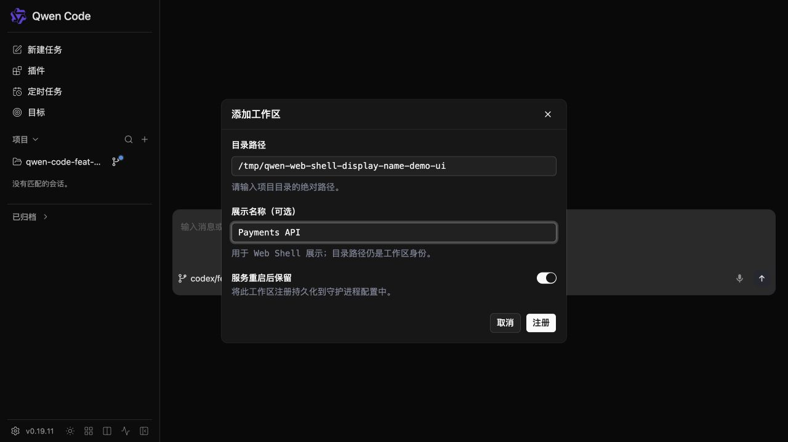
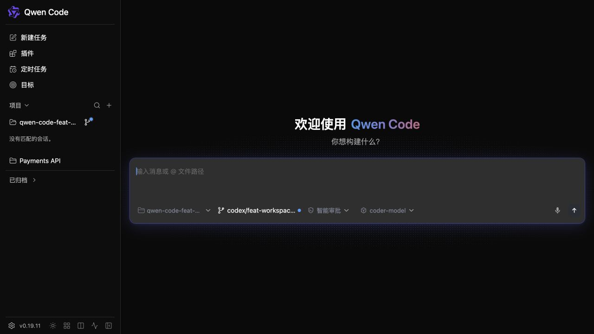
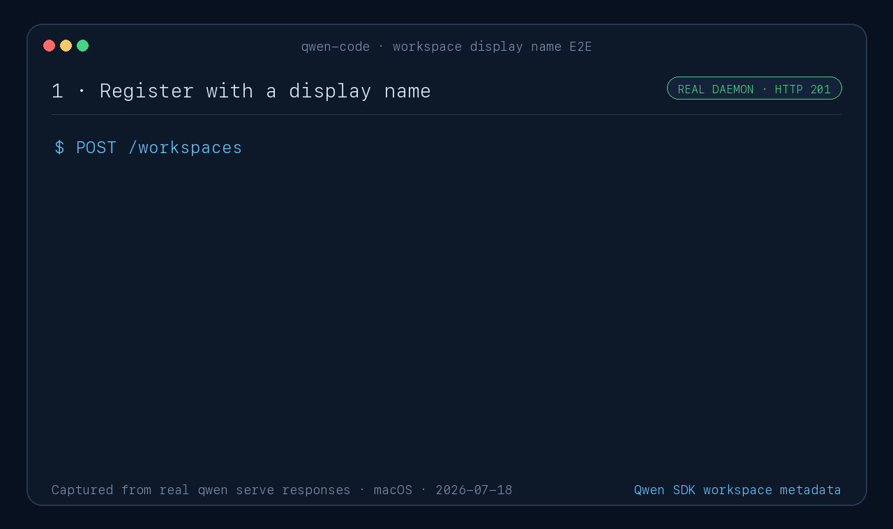

# Daemon workspace display names

## Goal

Let daemon and TypeScript SDK clients attach an optional human-readable display
name to a registered workspace without changing workspace identity or routing.
Let Web Shell users set that name while adding a workspace and see it in the
workspace list.

## Contract

- `workspaces[]` entries add optional `displayName` metadata.
- `POST /workspaces` accepts optional `displayName` when registering or
  persistently promoting a secondary workspace.
- `PATCH /workspaces/:workspace` accepts `{ "displayName": string | null }` to
  set or clear the metadata for any registered runtime.
- Workspace mutation responses and persistent-registration listings return the
  effective display name when one exists.
- `workspace_display_name` advertises the contract. The TypeScript SDK exposes
  the registration option and a workspace-bound setter.
- When the capability is advertised, the Web Shell add-workspace dialog accepts
  an optional display name and uses it for workspace labels.

`id` and `cwd` remain the only workspace selectors. A display name is never
used for lookup and does not need to be unique.

## Runtime and persistence

The runtime keeps the current display name as mutable presentation metadata.
Primary and explicit startup workspaces can be named for the lifetime of the
daemon. Only secondary workspaces with persistent registrations retain their
name across restarts.

The existing schema-v1 registration file keeps its `workspaces: string[]`
shape and adds an optional `displayNames` object keyed by the existing stable
registration id. Older daemons ignore the additive field, and newer daemons
continue to read files that do not contain it. Removing a registration also
removes its display-name entry.

## Validation and failures

Validation matches session display names: at most 256 characters and no C0 or
DEL control characters. An empty string or `null` clears the name on update.
Invalid input returns `400 invalid_display_name` before filesystem or runtime
work begins. Duplicate display names are allowed.

For a persistently registered runtime, the registration-store write completes
before the in-memory value changes. A failed write leaves the advertised name
unchanged. Process-local workspaces do not gain a persistence dependency.

## Compatibility

Every wire change is additive to protocol v1. Older SDKs ignore
`displayName`; newer SDKs type it as optional and continue to work with older
daemons that omit both the field and capability tag.
Web Shell hides the display-name input when the capability tag is absent.

## Verification

- Registration-store tests cover legacy files, set/update/clear, validation,
  restart restoration, and cleanup on removal.
- Workspace-management tests cover create, update, clear, persistence errors,
  and routing by id/cwd rather than display name.
- Capability/status and SDK tests cover the additive field, request shapes,
  and `workspace_display_name` advertisement.
- Web Shell tests cover the optional input, SDK option forwarding, and label
  fallback. Browser screenshots verify the real add-workspace form and its
  resulting sidebar label.
- An end-to-end daemon recording demonstrates register, read, update, clear,
  and restart persistence for the PR.

Filled add-workspace form:

Created workspace shown by display name:

