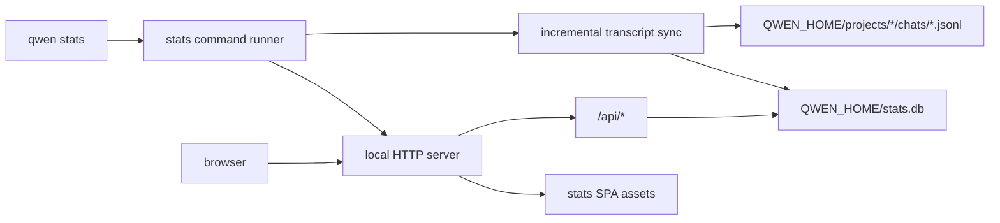
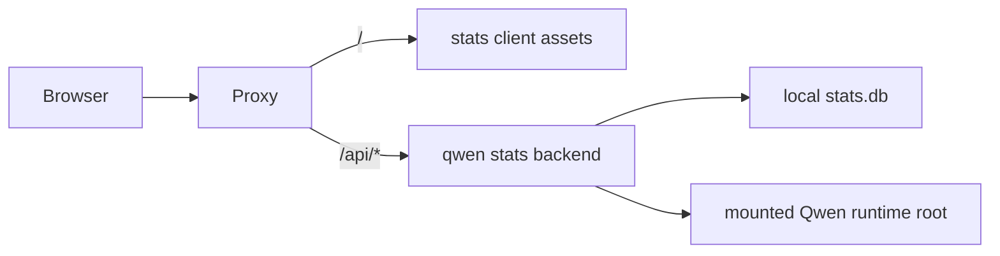

# Standalone Stats Dashboard

## Goal

Add an OMP-style local observability dashboard to Qwen Code as a standalone `qwen stats` process. The process owns one HTTP listener, serves a dedicated SPA, incrementally indexes Qwen session JSONL, and exposes read-only aggregate APIs for requests, errors, models, tools, projects, and costs. A compatibility-only behavior endpoint remains reserved but is not implemented in the initial UI.

This is separate from:

- the interactive `/stats` dialog, which reports the current session;
- the Web Shell Daemon Status usage tab, which reports coarse token aggregates through `qwen serve`;
- `qwen serve`, which owns workspaces and live sessions.

The dashboard is a local diagnostics surface. It must not require a model configuration, authentication, MCP startup, or a running daemon.

## Decision Summary

1. Add a top-level `qwen stats` command with the same operator shape as OMP: dashboard by default, `--port`, `--host`, `--no-open`, `--summary`, and `--json`.
2. Create `packages/stats` as the standalone backend, parser, SQLite index, API contract, and SPA. The package is independently runnable and testable; the CLI command is a thin launcher.
3. Parse Qwen transcripts directly from the configured runtime root. Do not build this dashboard on `usage_record.jsonl`: that file is session-granular and cannot support request, error, TTFT, or tool-call detail.
4. Keep `usage_record.jsonl` as the compatibility source for existing `/stats` and daemon usage surfaces. The new SQLite database is a derived cache only, never an authority.
5. Use Node 22's built-in `node:sqlite`; do not introduce a native SQLite package or a Bun runtime requirement.
6. Serve frontend and backend from one process by default. Also emit static frontend assets and export the server factory, so operators can place the SPA and API behind one reverse proxy without changing the API contract.
7. Bind to `127.0.0.1` by default and omit CORS. A non-loopback `--host` is an explicit operator choice; production exposure belongs behind an authenticated reverse proxy.
8. Do not copy OMP implementation code or styling verbatim. OMP is MIT, but Qwen's implementation should use Qwen's existing transcript schema, semantic tokens, formatters, and product vocabulary.

## User Contract

```bash
# Sync changed transcripts, start the dashboard, and open a browser
qwen stats

# Custom listener
qwen stats --host 127.0.0.1 --port 3847

# Keep the process running without opening a browser
qwen stats --no-open

# Sync and print a human-readable summary, then exit
qwen stats --summary --range 24h

# Sync and print the aggregate payload as JSON, then exit
qwen stats --json --range 30d
```

Default URL: `http://127.0.0.1:3847/#/overview?range=24h`.

Supported ranges: `24h`, `7d`, `30d`, `90d`, and `all`. Range bounds are evaluated as trailing windows ending at request time. The SPA stores its active route and range in the hash so direct links and refreshes remain stable.

If the port is already occupied, the first implementation must fail with a clear error naming the address and `--port`. It must not kill or reuse an unidentified process.

## Architecture



### Package Boundaries

`packages/stats` owns:

- transcript discovery and incremental parsing;
- the derived SQLite schema and migrations;
- aggregate query functions;
- HTTP request handling and static asset serving;
- the standalone React SPA and shared API types;
- a programmatic API: `syncAllSessions`, query functions, `createStatsServer`, and `startStatsServer`.

`packages/cli` owns:

- bootstrap routing for `qwen stats`;
- yargs option parsing and terminal output;
- secure browser launch;
- process signal handling and exit codes.

`packages/core` remains the owner of Qwen's transcript and telemetry contracts. `packages/stats` imports only the minimum public types/constants it needs and does not import the core root barrel. If a needed contract is not publicly importable from a leaf export, add one narrow leaf export rather than widening the root barrel.

### Runtime Root

The stats process resolves storage in this order:

1. `--runtime-dir` when supplied;
2. `QWEN_RUNTIME_DIR`;
3. `QWEN_HOME`;
4. the default `~/.qwen`.

It scans `<runtimeRoot>/projects/*/chats/*.jsonl` recursively enough to include the main transcript files Qwen currently writes. The database lives at `<runtimeRoot>/stats.db` by default. `--db <path>` may override it for diagnostics and tests.

The process reads transcripts and writes only the derived database. It never edits session JSONL or `usage_record.jsonl`.

## Incremental Index

### Why SQLite

The coarse existing usage loader rebuilds recent sessions into one record per session. That is sufficient for total tokens and a heatmap, but it cannot answer request-level questions efficiently. A derived SQLite index provides:

- incremental processing by file byte offset;
- indexed range/model/project/error queries;
- stable request-detail lookup without reparsing every transcript per HTTP request;
- cheap refreshes for a long-running dashboard.

SQLite is a cache. Deleting `stats.db` must be safe; the next sync reconstructs it from transcripts.

### Schema

Initial schema:

```sql
CREATE TABLE files (
  path TEXT PRIMARY KEY,
  project TEXT NOT NULL,
  session_id TEXT,
  offset INTEGER NOT NULL,
  size INTEGER NOT NULL,
  mtime_ms INTEGER NOT NULL,
  file_id TEXT NOT NULL
);

CREATE TABLE requests (
  id INTEGER PRIMARY KEY AUTOINCREMENT,
  file_path TEXT NOT NULL,
  record_uuid TEXT NOT NULL,
  session_id TEXT NOT NULL,
  project TEXT NOT NULL,
  timestamp_ms INTEGER NOT NULL,
  response_id TEXT,
  prompt_id TEXT,
  model TEXT NOT NULL,
  auth_type TEXT,
  status TEXT NOT NULL,
  status_code TEXT,
  duration_ms INTEGER NOT NULL,
  ttft_ms INTEGER,
  input_tokens INTEGER NOT NULL,
  output_tokens INTEGER NOT NULL,
  cached_tokens INTEGER NOT NULL,
  thoughts_tokens INTEGER NOT NULL,
  total_tokens INTEGER NOT NULL,
  error_type TEXT,
  error_message TEXT,
  subagent_name TEXT,
  UNIQUE(file_path, record_uuid)
);

CREATE TABLE tool_calls (
  id INTEGER PRIMARY KEY AUTOINCREMENT,
  file_path TEXT NOT NULL,
  record_uuid TEXT NOT NULL,
  session_id TEXT NOT NULL,
  project TEXT NOT NULL,
  timestamp_ms INTEGER NOT NULL,
  call_id TEXT,
  response_id TEXT,
  prompt_id TEXT,
  tool_name TEXT NOT NULL,
  tool_type TEXT NOT NULL,
  status TEXT NOT NULL,
  success INTEGER NOT NULL,
  duration_ms INTEGER NOT NULL,
  decision TEXT,
  error_type TEXT,
  content_length INTEGER,
  model_added_lines INTEGER NOT NULL DEFAULT 0,
  model_removed_lines INTEGER NOT NULL DEFAULT 0,
  subagent_name TEXT,
  UNIQUE(file_path, record_uuid)
);
```

Create indexes on request and tool timestamps, model, project, status, tool name, and session id. Store schema version in `PRAGMA user_version` and migrate transactionally.

Do not persist prompt text, response text, tool arguments, tool result content, API keys, base URLs, or MCP server names. The dashboard needs operational metrics, not conversation content.

### Parser

A transcript record contributes data only when:

- `type === 'system'`;
- `subtype === 'ui_telemetry'`;
- `systemPayload.uiEvent.event.name` is `qwen-code.api_response`, `qwen-code.api_error`, or `qwen-code.tool_call` (use the public telemetry constants rather than duplicating these literals in parser code).

Normalize records leniently:

- skip malformed JSON lines and unsupported event names;
- use the telemetry event's ISO timestamp, falling back to the record timestamp;
- coerce missing optional counters to zero;
- derive `status = 'success' | 'error'` for requests;
- preserve `record.uuid` as the idempotency key;
- derive project from the record's `cwd`, falling back to the encoded project directory;
- preserve `sessionId` from the envelope; skip a metric row only when no session id can be established.

The parser must never throw away an entire file because one historical line is malformed.

### Offset and Rewrite Rules

For each file, store offset, size, mtime, and a file identity derived from stable stat fields where available.

- unchanged size/mtime: skip;
- grown file with matching identity: read from the previous offset;
- shorter file, changed identity, or offset beyond EOF: delete rows for that file and rebuild it from byte zero;
- incomplete trailing JSON line: do not advance past it; retry after the writer appends the newline;
- deleted transcript: remove its indexed rows and file entry during sync.

Apply each file's deletes/inserts/offset update in one transaction. Concurrent `POST /api/sync` calls coalesce onto one in-flight sync.

### Sync Timing

Startup performs one complete incremental sync before opening the browser or printing the listening URL. The server then runs a low-cost refresh loop every 30 seconds. The SPA can also request an explicit sync.

Query handlers read the database only. They never scan transcripts on the request path.

## Metrics and API

All responses are JSON. Aggregate endpoints accept `range`; list endpoints also accept a bounded `limit`. Invalid ranges return `400` rather than silently changing the requested window.

### Endpoints

| Endpoint | Purpose |
|---|---|
| `GET /api/health` | Server identity, schema version, last sync status |
| `POST /api/sync` | Coalesced incremental sync and processed-file/row counts |
| `GET /api/stats/overview?range=24h` | Headline totals, success/error rates, latency, TTFT, throughput, time series, recent requests |
| `GET /api/stats/models?range=24h` | Per-model requests, errors, tokens, cache rate, latency, TTFT, throughput |
| `GET /api/stats/tools?range=24h` | Per-tool calls, failures, duration, decisions, code-line impact |
| `GET /api/stats/projects?range=24h` | Per-project sessions, requests, tokens, errors, duration |
| `GET /api/stats/errors?range=24h&limit=50` | Recent API errors with content-free diagnostic fields |
| `GET /api/stats/requests?range=24h&limit=50` | Recent request rows |
| `GET /api/requests/:id` | One indexed request plus tool calls linked by response id/session context |
| `GET /api/stats/costs?range=24h` | Cost totals when a trustworthy local price resolves; otherwise explicit unavailable coverage |
| `GET /api/stats/behavior?range=24h` | Reserved compatibility endpoint; returns `501` until a content-free Qwen behavior contract exists |

The behavior route is intentionally not part of the initial SPA navigation. OMP derives behavior scores from user message text. Qwen's existing privacy boundary for durable usage summaries is content-free, so copying that metric would widen collection without a Qwen requirement.

### Calculations

- cache rate: `cached_tokens / input_tokens`, or zero when input is zero;
- error rate: failed requests / all requests;
- average latency: mean `duration_ms` over success and error events;
- average TTFT: mean valid non-negative `ttft_ms` values only;
- output throughput: `sum(output_tokens) / sum(max(duration_ms - ttft_ms, 0)) * 1000` over requests with valid TTFT and positive generation duration;
- request count: one indexed `api_response` or `api_error` event;
- session count: distinct session ids;
- code impact: sum model-added/model-removed lines from tool telemetry.

Each aggregate response includes `generatedAt`, `range`, `rangeStart`, `rangeEnd`, and `lastSyncedAt` so the UI never implies fresher data than the index contains.

### Costs

Qwen telemetry currently records token counts but not billed cost, and runtime model snapshots may not include pricing. The first implementation must not invent cost.

`/api/stats/costs` returns:

```json
{
  "available": false,
  "pricedRequests": 0,
  "totalRequests": 42,
  "totalCostUsd": null,
  "byModel": []
}
```

If a future model catalog exposes verified per-token rates, cost calculation can populate this contract without changing the other endpoints. The SPA shows `Not available` plus pricing coverage, never `$0.00` for unknown cost.

## Frontend

The SPA lives in `packages/stats/src/client` and uses React, Vite, Qwen semantic CSS variables, existing Qwen formatters where practical, and SVG/CSS charts. Avoid adding a second chart library unless SVG becomes materially harder for a named view.

Initial routes:

- Overview
- Requests
- Errors
- Models
- Tools
- Projects
- Costs

Overview includes:

- requests, tokens, error rate, cache rate, average latency, TTFT, and output throughput;
- request/error and token time series;
- model share;
- recent requests.

Request detail never displays prompt/response/tool content because that content is not indexed.

The UI must cover loading, empty, sync-in-progress, stale sync, API failure, unavailable cost, light theme, and dark theme. It polls lightweight aggregate endpoints every 30 seconds and performs a full refresh after `POST /api/sync` succeeds.

## Deployment

### Supported Default: Combined Local Process

`qwen stats` serves `/api/*`, `index.html`, and hashed assets from the same origin. This avoids CORS, version skew, and a second service lifecycle.

### Supported Advanced Shape: One Host, Separate Build Artifacts

`packages/stats` emits:

- backend JS/types;
- `dist/client/index.html` and hashed assets.

An operator may host the static directory separately only when a reverse proxy presents the API at the same origin under `/api`. The client uses relative API URLs. Example topology:



The backend is stateful with respect to local transcripts and SQLite. A remote deployment therefore needs the Qwen runtime directory mounted read-only and a writable location for `stats.db`. This is not a central multi-user telemetry service.

### Security Boundary

- default host is loopback;
- no permissive CORS headers;
- non-loopback bind prints a warning that aggregate project paths and operational errors may be exposed;
- reverse-proxy authentication/TLS is required for remote access;
- the server rejects path traversal when serving assets;
- API request-detail output remains content-free.

## Packaging

The root build adds `packages/stats` before `packages/cli`. The stats Vite build produces client assets. Bundle/package scripts copy those assets to `dist/stats/`, analogous to the existing Web Shell asset copy. Published and standalone packages must include this directory; release packaging fails if the dashboard command is shipped without its UI.

Runtime asset resolution must work in:

- workspace TypeScript development;
- package `dist/index.js`;
- root bundled `dist/cli.js` with split chunks;
- standalone release layout.

Use the existing bundle-directory resolver rather than assuming `import.meta.url` is adjacent to root assets.

## Verification Contract

A complete implementation must prove:

1. a fixture transcript containing success, error, tool, malformed, and incomplete-tail lines indexes exactly once;
2. append-only resync indexes only new complete records;
3. truncation/replacement rebuilds a file without duplicates;
4. deleting a transcript removes its rows;
5. aggregate formulas and range boundaries match fixture expectations;
6. parser/database tests never persist message or tool content;
7. `qwen stats --json` emits parseable aggregate JSON and exits;
8. `qwen stats --summary` emits a content-free summary and exits;
9. `qwen stats --no-open --port 0` starts, serves `/api/health`, the overview API, `/`, and one hashed asset;
10. the built/bundled CLI includes and serves the stats SPA;
11. browser smoke covers route navigation, range changes, manual sync, empty state, error state, light theme, and dark theme;
12. the default listener is loopback and occupied-port failure is explicit.

## Non-goals

- replacing the interactive `/stats` dialog;
- replacing the daemon's usage dashboard;
- uploading metrics to a Qwen service;
- indexing prompt, response, tool argument, or tool result text;
- reproducing OMP's user-language behavior scoring;
- multi-user authentication or tenancy;
- daemon/live-session ownership or workspace routing;
- exact billing without a verified price source.
