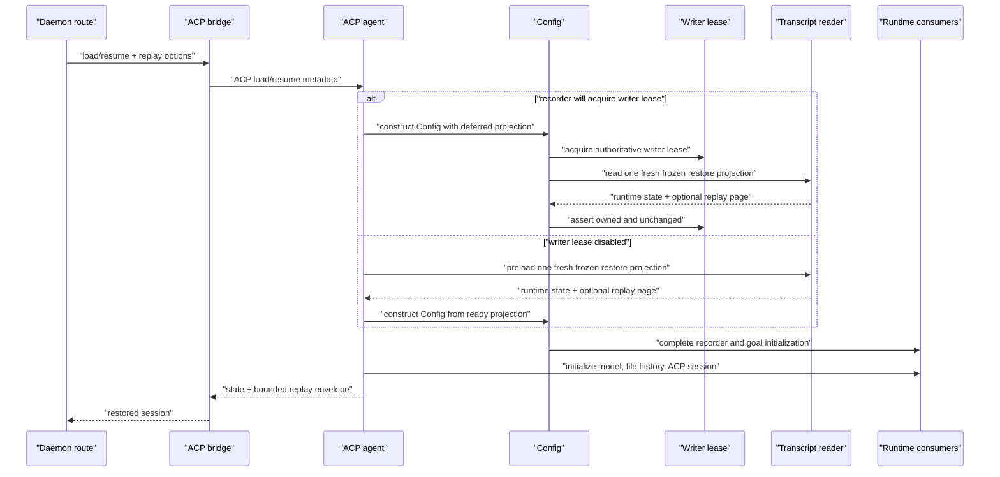

# Selective session restore

- Status: Draft for review
- Tracks: #8678
- Depends on: #8691

## Scope and ordering

Issue #8678 currently describes transactional WebUI session switching as the
next implementation PR after #8691. This draft evaluates a different next
slice: selective cold restore and bounded initial history hydration.

The ordering is intentionally part of the review. If this design is accepted,
the implementation PR should land after #8691 and before the durable checkpoint
work. Transactional WebUI switching remains required because selective restore
reduces the probability and cost of a timeout but does not preserve the old UI
session when a target restore still fails.

This design PR changes no runtime behavior and does not close #8678.

## Context

The daemon restore path currently materializes a persisted transcript before it
can use either the model state or a bounded history page:

1. `loadCliConfig()` calls `SessionService.loadSession()` and reads the complete
   JSONL transcript before constructing `Config`.
2. When chat recording and the experimental session-writer lease are both
   enabled, `Config.initialize()` acquires the lease and calls
   `SessionService.loadSession()` again to obtain an authoritative copy. The
   lease is disabled by default; when the recorder will not acquire it, the
   first full load is consumed directly.
3. `GeminiClient`, `ChatRecordingService`, `GoalRuntime`, the ACP `Session`, file
   history, artifact restoration, and history replay derive their state from the
   resulting full `ResumedSessionData.conversation.messages` array.
4. `historyPageSize` is applied only after that array exists. It bounds the
   replay response count, not cold-load parsing, materialization, or retained
   payloads.

`SessionTranscriptReader` already provides most of the lower-level mechanism we
need. It scans a frozen transcript snapshot once, stores UUID/parent/segment
metadata, reconstructs the active chain, reads selected records by byte offset,
supports backward pages, and enforces the existing 256 MiB index cap, 4 MiB soft
page budget, and 16 MiB bounded expansion ceiling. The missing piece is one cold
restore projection that serves all runtime consumers without first constructing
the full conversation, plus a narrow live-attach projection backed by the same
index machinery.

## Goals

- Replace daemon cold-load/resume full materialization with one frozen
  transcript snapshot scan. When chat recording and the writer-lease protocol
  are both enabled, that scan occurs after lease acquisition and is
  authoritative; otherwise preserve today's unfenced consistency model without
  retaining the full conversation.
- Materialize only records required for runnable model state, recorder state,
  resume-critical services, and the requested initial replay page.
- Bound an explicitly paged initial replay by both record count and source bytes.
- Preserve exact active-branch, rewind, fork, side-task, history-gap, compression,
  file-history, artifact, goal, attribution, usage, and interruption semantics.
- Preserve full visible replay for older clients that omit `historyPageSize`.
- Fail a cold daemon restore over the existing 256 MiB transcript-index limit
  with a structured request-scoped `413 transcript_too_large`; never fall back
  to the old full-materialization loader.
- Treat that 256 MiB daemon restore limit as an intentional compatibility change
  requiring maintainer approval: the old loader attempted larger transcripts,
  while the new path fails them predictably instead of taking the least-bounded
  path.
- Treat the new 32 MiB transformed-replay ceiling for explicitly paged bulk
  loads as a second intentional compatibility change requiring maintainer
  approval. Source paging was already bounded, but a highly expanding page that
  previously reached the client may now fail before transport.
- Reuse the existing REST and SDK pagination surface:
  `historyPageSize`, `historyHasMore`, `historyAnchorRecordId`, and transcript
  cursor paging.
- Extend #8691 restore tracing so operators can distinguish index construction,
  state reduction, selected reads, replay, and post-replay initialization.

## Non-goals

- A durable resume sidecar or checkpoint. Without one, cold restore still scans
  the transcript once and remains O(file bytes).
- Making restore proportional only to the JSONL tail. That is the checkpoint
  follow-up.
- Transactional WebUI session switching or changing detach-before-commit.
- Changing TUI `--resume`, `--continue`, session export, archive reads, fork, or
  branch behavior.
- Changing the standalone legacy `qwen/session/loadUpdates` extension or the
  post-rewind artifact refresh. They are not on the `session/load` or
  `session/resume` incident path and remain follow-up migrations.
- Changing the public `ResumedSessionData` contract used by non-daemon callers.
- Adding new REST or TypeScript SDK response fields.
- Guaranteeing a machine-independent latency threshold for an 80 MiB fixture.

## Compatibility constraints

The implementation must preserve these behaviors even when they require more
data than the recent UI page:

- Model history uses the active-branch `chat_compression` candidate selected by
  the exact current `buildApiHistoryFromConversation()` predicate plus its tail.
  A truthy malformed `compressedHistory` keeps the current restore failure; this
  design does not add fallback to an earlier checkpoint. If no candidate is
  selected, the complete active model-facing history must be read. Selective
  restore cannot safely truncate the model context of an uncompressed legacy
  session.
- Runtime history includes inherited fork/side-task context needed by the model.
  UI replay may hide inherited records. These are different projections of the
  same active chain.
- `/rewind` needs every surviving user-turn parent UUID, even when the
  corresponding record payload is not materialized.
- File-history restoration must reproduce the current last-write-wins behavior
  and the final 100-snapshot cap.
- Artifact reconstruction must include only artifact side records attached to
  the active branch and must exclude abandoned rewind branches.
- Goal recovery must keep the existing precedence exactly: scan newest to oldest
  for the newest valid v2 lifecycle snapshot even when newer v2 records are
  malformed; if no valid v2 exists but any lifecycle record is malformed or
  unsupported, return the existing unsupported recovery and do not fall back to
  legacy goal cards.
- A missing parent remains a visible history gap. The loader must never reconnect
  an earlier physical record and resurrect a rewound-away branch.

## Proposed architecture

### One cold restore projection

Add a daemon-oriented projection API to `SessionTranscriptReader`, wrapped by
`SessionService` so project membership and active/archive ownership checks remain
centralized:

```ts
interface SelectiveSessionRestoreOptions {
  replay:
    | { kind: 'none' }
    | { kind: 'all'; hideInheritedHistory: boolean }
    | {
        kind: 'recent';
        limit: number;
        hideInheritedHistory: boolean;
      };
}

interface SessionRestoreProjection {
  sessionId: string;
  filePath: string;
  startTime: string;
  lastUpdated: string;
  runtime: SessionRuntimeResumeState;
  replay?: SessionRestoreReplayPage;
}
```

Cold restore has two acquisition modes but only one projection and one reducer:

```ts
type SessionRestoreProjectionSource =
  | { kind: 'preloaded'; projection: SessionRestoreProjection }
  | {
      kind: 'after_writer_lease';
      options: SelectiveSessionRestoreOptions;
    };
```

`preloaded` is used when chat recording or the startup-frozen writer-lease
protocol is disabled. `loadCliConfig()` builds one fresh frozen projection
before constructing `Config`, matching the current lease-off consistency
contract. `after_writer_lease` is used only when the recorder will acquire a
lease; `Config.activateChatRecording()` builds the projection after acquisition.
The implementation must not silently fall back to the old loader in either
mode, and must not enable the experimental writer protocol as a side effect of
this feature.

`loadCliConfig()` already has a long positional signature. Carry the projection
source in one final named host-options object for runtime-only embedding inputs,
alongside the existing host policy, rather than adding another positional
parameter. Ordinary CLI callers omit that object or leave the projection field
unset.

These are internal cross-package types, exported from core only because the ACP
implementation consumes them. They are not a public daemon protocol contract.
`ResumedSessionData` stays unchanged for TUI, export, archive, fork, and other
existing callers.

`SessionRuntimeResumeState` contains reduced, consumer-specific state rather
than a partial object pretending to be a full conversation:

```ts
interface SessionRuntimeResumeState {
  apiHistory: Content[];
  resumeTokenCounts?: ResumeTokenCounts;
  uiTelemetryEvents: UiEvent[];
  attributionSnapshot?: AttributionSnapshot;
  historyGaps?: HistoryGap[];
  recording: {
    lastCompletedUuid: string;
    turnParentUuids: Array<string | null>;
    customTitle?: string;
    titleSource?: TitleSource;
    parentSessionId?: string;
    sourceType?: string;
    sourceId?: string;
  };
  fileHistorySnapshots?: FileHistorySnapshot[];
  artifactSnapshot?: RebuiltSessionArtifactSnapshot;
  goalRecords: GoalRecoveryRecord[];
  initialTurn: number;
  backgroundNotificationTaskIds: string[];
}
```

The concrete implementation may group these fields differently, but it must not
reuse `conversation.messages` for a selective subset. A type whose name implies
completeness must remain complete.

`SessionRestoreReplayPage` carries the selected records and existing replay
metadata before ACP updates are generated:

```ts
interface SessionRestoreReplayPage {
  records: ChatRecord[];
  gaps: HistoryGap[];
  hasMore: boolean;
  anchorRecordId?: string;
  replay?: unknown;
}
```

Live attach must not manufacture an unused `SessionRuntimeResumeState`. Add a
narrow sibling result backed by the same reader/index internals:

```ts
interface SessionLiveRestoreProjection {
  sessionId: string;
  startTime: string;
  lastUpdated: string;
  replay?: SessionRestoreReplayPage;
  artifactSnapshot?: RebuiltSessionArtifactSnapshot;
}
```

`SessionService.readLiveRestoreProjection()` selects replay plus artifact state
for live load, or artifact state only for live resume. This is a second
consumer-specific result, not a second scanner or index and not a generic matrix
of optional runtime flags.

### Projection ownership and release

The cold projection is one-shot initialization state, not a new lifetime cache.
`Config` may hold it while recorder, Goal, telemetry, attribution, Gemini, file
history, and ACP state are initialized, but consumers should use one-shot
accessors or an equivalent explicit handoff. `createAndStoreSession()` must force
lazy file-history initialization before the final release.

After successful registration and post-replay setup:

- `Config` retains no `apiHistory`, normalized `goalRecords`, UI telemetry
  array, replay `ChatRecord[]`, or artifact reconstruction input from the
  projection;
- Gemini/recorder/Goal/file-history/Session retain only their normal operational
  state;
- the ACP agent retains only the response envelope until the load response is
  returned; and
- the transcript cache retains index metadata and segments, never selected
  record payloads.

Failure cleanup and `Config.startNewSession()` clear any pending projection as
well. A same-process `/clear`, `/new`, or later session transition must never
reuse the previous session's reduced state. This release discipline is part of
the memory fix, not optional cleanup.

### Index extensions

Extend the existing `TranscriptIndex`; do not build a second index type or a
second scanner.

The index keeps two UUID sequences:

- `runtimeUuids`: the complete active `parentUuid` chain, including inherited
  records required by the model.
- `replayUuids`: the visible active chain. Side-task source boundaries always
  hide inherited parent records; ordinary fork history is filtered only when
  the caller requests `hideInheritedHistory`.

Each indexed record continues to retain only bounded metadata and physical
segments. Add small projection hints required to choose records after the active
chain is known:

- compression candidates and assistant usage candidates;
- UI telemetry and attribution positions;
- user-turn boundaries and prompt-turn hints;
- background notification task ids;
- active parent-session and session-source positions;
- goal-state and legacy goal-status candidates;
- file-history record positions;
- artifact side-record metadata and physical order.

Large message, tool result, snapshot, and artifact payloads remain represented
by byte segments until selected. Tolerant parsing, fragment aggregation, cycle
detection, missing-parent diagnostics, snapshot identity checks, and cache
accounting stay shared with transcript paging.

The scanner must validate that the first record belongs to the resolved
workspace and that selected records belong to the requested session. Mixed
session ids, changed segments, or an unavailable frozen snapshot fail the
request rather than returning a plausible but incorrect projection.

A writer-leased cold restore must not reuse an index whose build began before
lease acquisition. It builds a fresh index inside the lease transaction, uses
that same object for runtime and replay selection, and may publish the completed
index to the existing cache for later transcript pages. A lease-off cold restore
also builds one fresh frozen index, but cannot claim writer authority; this is
the same concurrency guarantee as the existing lease-off loader. Live and
read-only transcript requests may continue to use the normal cache.

The projection captures the file identity, size, and mtime before scanning and
rechecks the same signature after selected reads and the bounded title lookup. A
lease-off concurrent append therefore fails the request and can be retried
instead of registering a mixed snapshot; the remaining instant after that check
retains the unavoidable legacy race of running without writer fencing. The
leased mode additionally uses the lease's final unchanged assertion.

Projection hints that duplicate existing interpretation logic must use shared
helpers rather than reimplement it in the scanner. In particular, prompt-turn
hints must use the exact `record.promptId` plus UI-telemetry `prompt_id`
semantics currently used by `computeInitialTurnFromHistory()`. Hint arrays
should live on the existing per-UUID entries where possible so dead-branch
filtering and cache accounting do not create parallel unbounded indexes.

### Runtime state selection

After constructing the active chain, select and read the union of required
segments once:

1. **Model history.** Choose the active compression record using the exact
   current `buildApiHistoryFromConversation()` selection predicate and all
   active non-system messages after it. If no candidate is selected, choose
   every active model-facing record. Feed the selected payload through the
   existing copy path so a truthy malformed `compressedHistory` fails exactly as
   it does today rather than falling back to an earlier checkpoint. Apply the
   existing mid-turn merge, realtime exclusion, and copy semantics so the result
   remains the exact input to existing interruption recovery.
2. **Telemetry.** Read active UI telemetry records, reduce the latest resume
   token counts, and read only the latest active attribution snapshot. Apply the
   events through the existing session reset/add/set helper so selective input
   does not lose `uiTelemetryService` side effects.
3. **Recorder.** Derive `lastCompletedUuid`, every surviving user-turn parent,
   active lineage/source metadata, and turn numbering from index hints. Resolve
   title and title source with the existing bounded tail-then-head title picker,
   under the lease when enabled, rather than changing legacy title visibility by
   treating the full index as a new title search surface.
4. **Goal.** Select the active goal-state candidates needed by
   `recoverGoalFromRecords()` plus the slash-command records containing legacy
   goal-status cards. The latter preserve iteration count, start time, the last
   terminal-goal cache, and current `restoreGoalFromHistory()` behavior.
   Normalize them into minimal `GoalRecoveryRecord` values in chronological
   order rather than retaining complete slash-command payloads. A valid v2
   record keeps its parsed lifecycle payload; a malformed v2 record keeps only
   the fields needed to reproduce the unsupported result; a legacy result keeps
   only raw `goal_status` candidates, including malformed candidates whose
   position can affect recovery. Discard unrelated slash-command history items.
   Broaden the existing collection helper to accept this structural record type
   so both production reducers consume the same normalized inputs without a new
   Goal precedence implementation. The same records also drive the recent-replay
   goal bootstrap described below.
5. **File history.** Read every active `file_history_snapshot` record in
   chronological order and feed each batch through the existing whole-batch
   deserializer. This preserves today's behavior where one malformed item skips
   the entire record. Apply last-write-wins replacement while preserving each
   prompt id's first insertion position, then retain the final 100 snapshots.
   The reader cannot safely choose only the final 100 records in advance because
   prompt ids and batch validity live inside JSON payloads; active file-history
   payloads are an explicit unavoidable selected-read cost.
6. **Artifacts.** Run the current active-side-artifact selection semantics over
   indexed metadata, then read every artifact snapshot/event record selected by
   that rule and call the existing reducer in physical order. Do not jump
   straight to the latest snapshot: malformed-record warnings, stale-sequence
   handling, and fallback to an earlier valid snapshot are part of the current
   result.
7. **ACP state.** Compute initial turn with the shared prompt-id interpretation
   helper and collect persisted background notification task ids from active
   metadata without materializing unrelated payloads.

Deduplicate the segment union before opening the file, sort physical reads by
offset, and restore each consumer's logical order from index sequence metadata.
One record needed by multiple consumers is read and aggregated once.

The selected-read executor must dispatch each aggregated record to its consumers
without first constructing a catch-all selected `ChatRecord[]`. Retain payloads
only when the final projection actually needs them: model-facing `Content[]`,
normalized minimal `goalRecords`, and the requested replay records. In
particular, never retain unrelated `slash_command.outputHistoryItems` merely
because the same record contains a legacy Goal card. File-history batches are
reduced immediately into the capped snapshot state, and artifact records are fed
through an incremental form of the existing reducer so the projection does not
hold both the complete artifact event list and the rebuilt snapshot. Fragment
assembly may retain the segments for the record currently being aggregated, but
must not become a second transcript-sized payload cache. This streaming dispatch
is required for the peak-memory goal; "one read" alone is insufficient.

### Replay selection

For `replay.kind === 'recent'`, use the same backward selector as the transcript
endpoint:

- caller record limit, currently 100 from Web Shell by default;
- 4 MiB source-byte soft budget;
- bounded turn and tool-pair alignment;
- 16 MiB source-byte hard expansion ceiling;
- `hasMore` plus an anchor for the next backward page.

For `replay.kind === 'all'`, read the full visible chain. This path exists only
for compatibility with clients that omit `historyPageSize`; it intentionally
preserves their current unbounded visible replay semantics while still avoiding
dead-branch payloads and the duplicate full-file read.

For `replay.kind === 'none'`, used by `resumeSession`, do not materialize UI
records.

Map protocol modes explicitly:

| ACP restore request                       | Projection replay kind |
| ----------------------------------------- | ---------------------- |
| bulk/response load with `historyPageSize` | `recent`               |
| bulk/response load without the field      | `all`                  |
| legacy streamed load                      | `all`                  |
| `resumeSession`                           | `none`                 |

The existing `qwen.session.loadReplay` internal ACP envelope may gain an
`anchorRecordId` so the bridge can populate the already-public
`historyAnchorRecordId` even when no emitted update contains a usable record id.
No REST or SDK field is added.

### Recent replay state bootstrap

Recent paging may start after the record that established a still-active goal.
Restoring the Goal runtime or legacy Stop hook without showing that goal in the
client creates a split-brain state: the loop is active but the UI says it is
not. For a recent initial replay, reduce the normalized `goalRecords` with the
existing v2 and legacy goal reducers. If the state-determining active-goal record
is older than the selected page, emit one synthetic current-goal bootstrap update
before the page updates. It may carry source provenance, but it must be
non-paginable and must not replace the explicit oldest-page anchor. If policy
refuses to restore the goal, apply the existing `supersedeUnrestorableGoal`
clearing rule after the bootstrap. Do not emit a bootstrap when the selected page
already contains the state-determining record, and do not synthesize terminal
goals that pagination intentionally omitted.

This is ACP presentation state only. It does not append a transcript record and
does not replace either production goal reducer. When v2 and legacy records
interleave, the bootstrap must match the final goal presentation produced by a
full `HistoryReplayer`; the implementation must not invent a separate precedence
rule.

### Serialized bulk replay limit

The current 32 MiB ceiling is local to the REST transcript-page serializer. ACP
`qwen.session.loadReplay` already rejects more than 10,000 updates, but that
validation happens after the agent has built and transported the envelope and
there is no equivalent byte limit. Extract a shared 32 MiB serialized-replay
policy and enforce both byte and 10,000-update bounds while building an
explicitly recent bulk replay, before the ACP response crosses the child pipe.
The REST transcript route continues to enforce its complete-page serialization
limit independently.

Source-byte selection is not proof that transformed ACP updates fit: escaping,
tool projection, and one source record producing many updates can exceed either
bound. Count the goal bootstrap and every synthetic/finalization update. If the
transformed recent envelope exceeds its byte or update-count cap, fail before
`createAndStoreSession()` with ACP
`errorKind: transcript_page_too_large`, which the daemon REST layer maps to
`413 transcript_page_too_large`. Do not build an unbounded envelope first, do
not register a runtime that the caller was told failed, and do not add a second
turn/tool-alignment algorithm to trim transformed updates.

Use incremental per-update byte accounting to stop at the bound, then perform
one final exact serialization check on the bounded `qwen.session.loadReplay`
value so its object, array, and comma overhead cannot slip past the policy. This
is a replay-envelope limit, not a claim that the complete outer JSON-RPC frame
is exactly 32 MiB.

The limit guard must preserve a typed `SessionTranscriptPageTooLargeError` (or a
dedicated equivalent) through replay conversion. The existing collector catches
ordinary projection/emitter failures and returns `partial`/`replayError`; a
byte- or update-limit exception must bypass that compatibility downgrade and
remain a terminal request error. Implement this with a bounded collector or an
explicit typed rethrow, not by matching an error message after the type has been
discarded.

Tests must cover collective byte/count expansion where every individual record
fits but the envelope does not. Full replay selected because `historyPageSize`
was omitted keeps its existing compatibility semantics, including the existing
10,000-update validation; this PR must not quietly impose the new byte cap on
that legacy mode.

### Oversized transformed replay

An individual record or a collectively expanding recent page that exceeds the
post-transformation cap returns the same request-scoped
ACP `transcript_page_too_large` contract as an oversized transcript page; the
daemon REST mapping is 413. The Config is cleaned up, the session is not
registered, no replay record is appended, and sibling sessions remain usable.
The expected legacy Goal migration described below may already have appended its
single v2 `goal_state` during Config initialization; that existing resume-side
normalization is the only permitted transcript mutation before this failure and
must invalidate the projection cache normally. A caller that does not need UI
hydration may still use `resumeSession`, whose projection kind is `none`.

## Lifecycle integration

### Cold load or resume



ACP `newSessionConfig()` passes an internal projection source, including the
`SelectiveSessionRestoreOptions`, through `loadCliConfig()`'s named host-options
object. It must use the startup-frozen writer-lease value, not a per-request
settings reload. With a lease, `loadCliConfig()` resolves and validates the
session id without calling `SessionService.loadSession()` and leaves the
projection deferred. Without a lease, it creates the preloaded projection before
`Config` construction. Both paths make zero calls to the old full loader.

The route remains workspace-runtime scoped. Cold projection resolution uses the
runtime-pinned cwd, runtime base directory, and per-request settings selected by
the daemon route; live projection uses the owning session's `Config`. Unknown,
untrusted, conflicting, archived, draining, or removed runtime states keep their
current declared errors and must never fall back to the primary runtime or the
agent's latest-settings cache. The session id, resolved file, first-record
project membership, and every selected record must agree before registration.

`Config.activateChatRecording()` remains the owner of lease acquisition. In the
leased mode, after acquiring the lease it requests one
`SessionRestoreProjection`, asserts that the lease and transcript are unchanged,
stores the reduced runtime state, and activates `ChatRecordingService` from the
recorder projection. Goal runtime is then restored from the normalized
`goalRecords`. This mode must skip the constructor's ordinary transcript restore
and initialize or replace the runtime only after recorder activation; it must not
start from an empty or stale transcript and be left that way.

In preloaded mode, `Config`, the legacy active recorder, and Goal runtime are
constructed directly from the already-complete reduced projection. They must
not wait for `activateChatRecording()`, because that method intentionally
returns immediately when the writer protocol is disabled.

Legacy Goal recovery may append one migrated v2 `goal_state` after recorder
activation. That is an expected local post-projection write: it must occur only
after the final snapshot/lease check, advance recorder state normally, and
invalidate the old cache key through the transcript's new size/mtime. Initial
replay still derives its bootstrap from the pre-migration normalized
`goalRecords`, matching the legacy Stop-hook state that the client needs to see.

`GeminiClient.initialize()` consumes `apiHistory`, resume token counts, UI
telemetry events, and attribution directly. It does not rebuild them from replay
records. `Config.getFileHistoryService()` remains the single lazy owner of
restoring `fileHistorySnapshots`; `createAndStoreSession()` may force service
construction but must not restore the same snapshots a second time. Recorder
turn boundaries already come from `runtime.recording`, and ACP turn/background
state comes from its precomputed fields, so neither may be rebuilt from a recent
replay page. The session replays only `SessionRestoreReplayPage.records` plus
the goal bootstrap described above.

For response-mode load, transform the selected records and enforce the
serialized byte/update bounds after Config authentication and tool setup but
before `createAndStoreSession()`. Once the envelope fits, create the Session and
copy the precomputed replay usage/turn state into it. A size/count overflow
therefore cleans up an unregistered Config. The existing replay-conversion
partial result may still register a fully initialized runtime and report bounded
`partial`/`replayError`; it must not be confused with an envelope-limit failure.

### Live session load or resume

Keep `assertCanStartTurn()`, close gating, drain, and the recording write barrier.
Inside that barrier, request only the projection consumers needed for the live
operation:

- load: bounded or full visible replay plus artifact state;
- resume: artifact state only.

Use `SessionLiveRestoreProjection`; do not call the cold restore API and discard
its model, recorder, Goal, telemetry, or file-history state.

Do not reset the live model, recorder, goal runtime, or file history. A bridge
attach to an already-live entry may retain its existing in-memory replay fallback
when a best-effort transcript page cannot be read; that is not a fallback to the
old full-materialization loader.

A live direct-ACP bulk load with an explicit page also enforces the serialized
byte/update limits. Its overflow is a request-scoped ACP
`transcript_page_too_large` error, but the already-live Session remains
registered, attached to its existing clients, and usable after the close gate is
released. The daemon bridge's existing live-attach path instead catches a failed
persisted-page refresh and falls back to its in-memory replay; it must not be
changed to surface a REST 413 by this design. More generally, any live-projection
failure must leave model, recorder, Goal, file history, client accounting, and
cached restore state unchanged. Use the existing best-effort in-memory replay
fallback only where that behavior already exists; otherwise return the ACP error
without replacing or closing the live Session.

### Paths intentionally unchanged

- Interactive TUI `--resume` and `--continue`.
- Non-interactive resume.
- Session export and archived export.
- Fork, branch, and transcript copy/remap operations.
- Session list, title lookup, and preview counts.
- Legacy `qwen/session/loadUpdates`.
- Post-rewind artifact refresh.

These paths continue to use complete `ResumedSessionData` until a separate
design proves that changing them is safe.

## Failure semantics

| Condition                                                | Result                                                                                                                                                                                                                                |
| -------------------------------------------------------- | ------------------------------------------------------------------------------------------------------------------------------------------------------------------------------------------------------------------------------------- |
| Transcript is over 256 MiB on a cold daemon restore      | Existing `SessionTranscriptTooLargeError` becomes ACP `errorKind: transcript_too_large`, then REST `413 transcript_too_large`. The outer daemon and sibling sessions remain healthy.                                                  |
| Transcript changes after the frozen snapshot is selected | `transcript_snapshot_unavailable`/writer-change failure; no partial runtime is registered.                                                                                                                                            |
| Selected segment parses to a different UUID              | Snapshot unavailable; never skip it silently.                                                                                                                                                                                         |
| Parent is physically missing                             | Restore the surviving suffix, report the existing history gap, and disable unsafe automatic continuation as today.                                                                                                                    |
| Parent cycle is detected                                 | Stop at the cycle using the existing chain behavior and emit a diagnostic.                                                                                                                                                            |
| Compression payload is malformed                         | Preserve the current `buildApiHistoryFromConversation()` behavior: falsey/missing `compressedHistory` does not replace an earlier candidate, while a truthy malformed selected payload fails restore through the existing error path. |
| File-history or artifact item is malformed               | Preserve the current warning-and-skip reducer behavior.                                                                                                                                                                               |
| Cold transformed recent replay exceeds byte/update cap   | Fail before registration and release Config/lease. Return ACP `errorKind: transcript_page_too_large`; the daemon REST path maps it to `413 transcript_page_too_large`.                                                                |
| Direct-ACP live transformed replay exceeds the cap       | Return ACP `errorKind: transcript_page_too_large` without mutating or closing the registered Session. The daemon bridge's existing live attach instead keeps its in-memory replay fallback.                                           |
| Live projection or selected read fails                   | Release the close gate and preserve the existing registered Session and client accounting. Use only an already-supported in-memory replay fallback; otherwise return the mapped request error.                                        |
| Client omits `historyPageSize`                           | Full visible replay, no default truncation.                                                                                                                                                                                           |
| Recorder will not acquire the writer lease               | Use one fresh preloaded frozen projection and preserve the current unfenced consistency contract; never use the old loader.                                                                                                           |

There is no selective-to-full-loader fallback on a cold restore. A fallback
would recreate the timeout and peak-memory failure mode precisely when the
selective path rejects the largest input.

## Downstream consumer migration

Every current consumer of full `ResumedSessionData` on the daemon path must have
an explicit replacement:

| Consumer                          | Current dependency                                                       | Replacement                                                            |
| --------------------------------- | ------------------------------------------------------------------------ | ---------------------------------------------------------------------- |
| `loadCliConfig()`                 | First full load                                                          | Preload one projection only when the writer protocol is disabled       |
| `Config.activateChatRecording()`  | Optional second full authoritative load                                  | Resolve the deferred projection under the acquired lease               |
| `ChatRecordingService.activate()` | Last UUID, turn parents, title and lineage from all messages             | `runtime.recording`                                                    |
| `Config.initializeGoalRuntime()`  | Full message list                                                        | normalized `runtime.goalRecords`                                       |
| `GeminiClient.initialize()`       | API history, telemetry, token counts, attribution from full conversation | Pre-reduced runtime fields                                             |
| `Config.getFileHistoryService()`  | Lazy restore from `sessionData.fileHistorySnapshots`                     | Lazy restore once from `runtime.fileHistorySnapshots`                  |
| `createAndStoreSession()`         | File snapshots, turn boundaries, replay records                          | Force lazy services, apply precomputed ACP state, replay optional page |
| `Session.primeTurnFromHistory()`  | Initial turn and background notification ids                             | Precomputed ACP state                                                  |
| daemon goal hook restore          | Slash-command cards from all messages                                    | normalized `runtime.goalRecords` through the existing helpers          |
| load response artifact state      | Rebuilt from all physical records                                        | `runtime.artifactSnapshot`                                             |
| live load/resume                  | Full reload under write barrier                                          | Consumer-limited live projection under the same barrier                |

The implementation is incomplete if any `session/load` or `session/resume`
consumer named above still calls the old loader or silently treats a recent
replay page as a complete conversation. The explicitly unchanged legacy paths
remain outside that assertion.

## Observability

Build on #8691's `qwen-code.daemon.session_restore` span. Add child-stage
durations or nested spans for:

- `transcript_index`;
- `resume_state_select`;
- `selected_record_read`;
- `history_replay`;
- `runtime_initialize`;
- `post_replay_services`.

Record only bounded numeric, enum, and boolean attributes: snapshot bytes,
indexed/active/selected/replay counts and bytes, compression selected, legacy
full-model-history fallback, cache hit, partial replay, projection acquisition
(`preloaded` or `after_writer_lease`), replay mode (`none`, `recent`, or `all`),
and envelope limit reason (`bytes` or `updates`). Do not record transcript
content, prompts, tool arguments, record ids, paths, or cursor values.

The parent daemon span should continue to own action, timeout, public outcome,
late outcome, cleanup, and channel lifecycle from #8691.

## Validation strategy

### Projection equivalence

For deterministic well-formed fixtures, compare the new projection against the
current full loader plus its existing reducers:

- compressed and uncompressed model histories;
- multiple compression records, including dead-branch records;
- rewind branches, forks, inherited history, and side-task source boundaries;
- fragments and glued JSON records;
- partial final lines, missing parents, and cycles;
- UI telemetry, token counts, and attribution snapshots;
- v2 and legacy goals, including malformed terminal records;
- duplicate file-history prompt ids and the 100-snapshot cap;
- artifact snapshots/events on active, side, and abandoned branches;
- custom titles, parent/source metadata, initial turn, and background task ids.

Title parity must use the bounded tail-then-head production picker, including a
legacy title outside both windows that intentionally remains invisible. File
history tests must assert that lazy service construction restores the selected
snapshots once rather than relying on duplicate idempotent calls.

The expected value must come from the existing production reducers, not a
second hand-written expectation that can reproduce the same mistake. Malformed
compression fixtures must assert the current candidate-selection and failure
behavior rather than inventing a new fallback.

### Paging and limits

- Recent replay respects record and source-byte budgets while preserving turn
  and tool-call/result boundaries within the existing bounded extensions.
- Omitted `historyPageSize` returns the full visible replay.
- Runtime history remains complete when UI replay is paged or hides inherited
  records.
- An individually oversized record and collective ACP-update expansion both
  fail with ACP `transcript_page_too_large`; the cold daemon path maps it to REST
  413 before session registration, while a direct-ACP live case preserves the
  existing Session and the daemon bridge live attach preserves its fallback.
- Typed byte/update-limit failures bypass the ordinary replay
  `partial`/`replayError` compatibility path; unrelated replay conversion
  failures retain that existing partial-result behavior.
- A legacy-Goal migration followed by replay overflow leaves only the expected
  migrated v2 record on disk; it does not append replay data, register a Session,
  or reuse the now-stale projection cache entry.
- A still-active v2 or legacy goal older than the recent page is represented by
  one bootstrap update; terminal or in-page goals are not duplicated.
- Mixed v2/legacy goal sequences produce the same final bootstrap state as full
  history replay.
- A newer malformed v2 record still permits recovery of the newest earlier valid
  v2 snapshot, while malformed/unsupported v2 records with no valid v2 block
  legacy fallback exactly as `recoverGoalFromRecords()` does today.
- A malformed file-history batch contributes no snapshots, matching the current
  whole-record skip behavior.
- A sparse transcript over 256 MiB fails before parsing and never invokes the
  old loader.
- Concurrent append/growth, snapshot replacement, truncation, same-size rewrites
  that change mtime, selected-segment UUID mismatches, and selected records with
  a conflicting session id are rejected. A lease-off adversarial rewrite that
  preserves inode, size, mtime, and selected UUIDs remains outside the legacy
  unfenced guarantee.

### ACP and daemon lifecycle

- Cold load and resume build exactly one fresh transcript index in both
  writer-lease modes and make zero calls to `SessionService.loadSession()` on
  the selective path. Live `session/load` and `session/resume` also avoid the
  old loader.
- The projection is created only after writer-lease acquisition and is checked
  again before activation when chat recording and the writer protocol are both
  enabled; otherwise it is preloaded before `Config` construction and never
  waits on the no-op activation method.
- A recorder-disabled fixture with the startup-frozen writer setting enabled
  still uses `preloaded`, performs no lease acquisition, and initializes the
  remaining model/ACP consumers from the projection.
- Load, resume, live restore, coalesced restore, `loadUpdates`, and cleanup keep
  their current ownership and write-barrier semantics.
- ACP `errorKind: transcript_too_large` is request-scoped, REST maps it to
  `413 transcript_too_large`, and a registered sibling remains usable.
- Cold projection and cold envelope-limit failures do not register new runtime
  state. Existing replay-conversion partial results register only after the
  runtime is otherwise fully initialized.
- Live projection and envelope-limit failures release the close gate without
  changing the registered Session, its model/runtime services, or attach/client
  accounting.
- A timed-out selective projection follows #8691's abandoned-restore fence,
  same-id retry, late cleanup, settlement-grace, and condemned-channel drain
  semantics. In particular, an overdue child that cannot answer a close probe
  must still be locally torn down after its clients detach.
- #8691 timeout and late-result fencing tests continue to pass.

### E2E and benchmark

Before implementation, dry-run the scenario with the installed global `qwen`
CLI and retain the baseline result in `.qwen/e2e-tests/`.

Use an opt-in approximately 80 MiB/30,000-record fixture containing an
approximately 2 MiB record and at least one live sibling session. Report:

- cold restore wall time;
- peak and post-registration settled heap/RSS or cgroup memory when available;
- event-loop lag during the scan;
- index bytes, selected record bytes, and replay bytes;
- whether compression or the legacy full-model-history fallback was used;
- sibling prompt continuity during and after restore.

The benchmark is evidence, not a CI latency assertion. Functional CI asserts
the number of scans, selected bytes, bounded replay, failure shape, and sibling
survival.

## Alternatives considered

### Increase the timeout only

#8691 makes the timeout safe and configurable, but a longer deadline does not
remove duplicate reads or full materialization. It is necessary safety work,
not the performance design.

### Page only after `SessionService.loadSession()`

This is the current shape. It reduces response count while retaining the same
parse, allocation, and reconstruction cost, so it does not address the cold-load
hot path.

### Default every client to a recent page

That would be simpler internally but would silently change old ACP client
semantics. The selected compatibility contract is explicit opt-in pagination;
omission still means full visible replay.

### Require or implicitly enable the session-writer lease

The writer protocol is experimental, restart-gated, disabled by default, and
unsafe when concurrent writers mix configurations. Requiring it would leave the
default daemon path unfixed; enabling it inside this PR would silently broaden
scope into writer-protocol rollout. The selected design changes only projection
acquisition: the lease-on path is authoritative, while the lease-off path keeps
today's consistency guarantee and still removes full materialization.

### Change `ResumedSessionData.conversation.messages` to be lazy or partial

Too many consumers assume it is complete. Making completeness implicit would
invite model truncation, broken rewind boundaries, and lost restore state.
A separate projection makes every migration explicit.

### Add the durable checkpoint in the same PR

Checkpoint validation, atomic publication, crash recovery, transcript
replacement, rewind invalidation, and legacy bootstrap are a separate failure
domain. Combining them would make the first performance PR harder to review and
roll back. The streaming selective scan is also the required fallback for a
missing or invalid future checkpoint.

### Fall back to full materialization when indexing rejects a large file

This makes the worst input take the least safe path and defeats the cap. The
selected behavior is ACP `errorKind: transcript_too_large`, mapped by REST to
request-scoped `413 transcript_too_large`.

## Risks and mitigations

- **Semantic drift between runtime and replay chains.** Keep two named UUID
  sequences and parity-test them against current reducers.
- **Two writer-consistency modes diverge.** Share the projection and every
  reducer; vary only whether acquisition occurs before `Config` construction or
  after lease ownership. Test both modes with the startup-frozen setting.
- **Lease-off identity checks cannot prove an adversarial file was unchanged.**
  Recheck inode, size, and mtime and validate selected UUIDs, but state the
  residual same-identity/same-mtime rewrite race explicitly; only the cooperative
  writer protocol closes it.
- **A hidden full-history consumer is missed.** The consumer migration table is
  a completion checklist; repository-wide read-site audits are required for any
  changed field or getter.
- **Index metadata grows too much.** Reuse the existing cache estimator and cap;
  account for every added array, string, and side-record entry.
- **Reduced payloads become a second lifetime session copy.** Treat the
  projection as one-shot state, force lazy consumers before release, and assert
  that success, failure, and `startNewSession()` clear all pending payload
  references.
- **Selected reads are accumulated before reduction.** Use a consumer dispatcher
  with per-record fragment assembly; stream file-history and artifact inputs into
  their existing semantics and retain only unavoidable projection outputs.
- **No-compression sessions still materialize substantial model history.** Emit
  a diagnostic attribute and state the limitation; the checkpoint follow-up is
  the only safe way to make these restores tail-proportional.
- **Replay transformations expand beyond source bytes.** Enforce byte and update
  caps incrementally before transport and session registration; return the
  existing structured page-too-large failure instead of adding a second paging
  reducer over transformed updates. Document the new 32 MiB failure boundary as
  an intentional explicit-page compatibility change and require maintainer
  sign-off.
- **Lease integration introduces a new race.** The lease remains owned by
  `Config`; projection creation and the final unchanged assertion occur within
  the same activation transaction.
- **PR scope becomes a core refactor.** Reuse `SessionTranscriptReader`, existing
  reducers, error classes, and wire fields. Do not generalize TUI or export
  loading in this PR.
- **The 256 MiB limit rejects a transcript the old loader attempted.** Keep the
  error request-scoped and observable, document it in the PR as an intentional
  daemon-only compatibility change, and require maintainer sign-off rather than
  hiding it behind a full-loader fallback.

## Rollout and follow-ups

Land after #8691 so restore timeouts, late-result fencing, and tracing are
already safe. The implementation should be one end-to-end fix PR; do not land an
unused projection API without its daemon consumer.

After selective restore:

1. Make WebUI cross-session switching transactional so the previous session
   remains attached and visible until the target commits.
2. Add the durable checkpoint sidecar so valid restores read the checkpoint and
   only the JSONL tail, using this selective scanner as the legacy/corrupt
   fallback.
3. Migrate standalone `qwen/session/loadUpdates` and post-rewind artifact refresh
   only if their independent compatibility and failure semantics justify it.
4. Consider extending selective loading to TUI resume only after the daemon path
   has equivalence and operational evidence.
