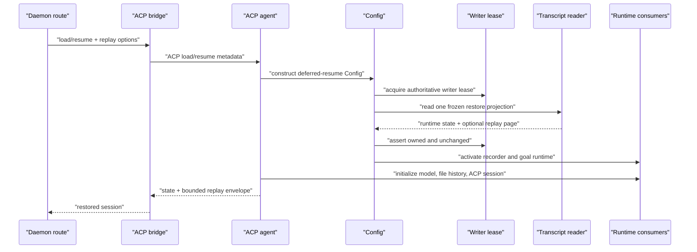

# Selective session restore

- Status: Draft for review
- Tracks: #8678
- Depends on: #8691

## Scope and ordering

Issue #8678 currently describes transactional WebUI session switching as the
next implementation PR after #8691. This draft evaluates a different next
slice: selective cold restore and bounded initial history hydration.

The ordering is intentionally part of the review. If this design is accepted,
the implementation PR should land after #8691 and before the durable checkpoint
work. Transactional WebUI switching remains required because selective restore
reduces the probability and cost of a timeout but does not preserve the old UI
session when a target restore still fails.

This design PR changes no runtime behavior and does not close #8678.

## Context

The daemon restore path currently materializes a persisted transcript before it
can use either the model state or a bounded history page:

1. `loadCliConfig()` calls `SessionService.loadSession()` and reads the complete
   JSONL transcript before constructing `Config`.
2. `Config.initialize()` acquires the session-writer lease and calls
   `SessionService.loadSession()` again to obtain an authoritative copy.
3. `GeminiClient`, `ChatRecordingService`, `GoalRuntime`, the ACP `Session`, file
   history, artifact restoration, and history replay derive their state from the
   resulting full `ResumedSessionData.conversation.messages` array.
4. `historyPageSize` is applied only after that array exists. It bounds the
   replay response count, not cold-load parsing, materialization, or retained
   payloads.

`SessionTranscriptReader` already provides most of the lower-level mechanism we
need. It scans a frozen transcript snapshot once, stores UUID/parent/segment
metadata, reconstructs the active chain, reads selected records by byte offset,
supports backward pages, and enforces the existing 256 MiB index cap, 4 MiB soft
page budget, and 16 MiB bounded expansion ceiling. The missing piece is a single
restore projection that serves all runtime consumers without first constructing
the full conversation.

## Goals

- Replace the two full-materialization reads on daemon cold load/resume with one
  authoritative transcript snapshot scan under the writer lease.
- Materialize only records required for runnable model state, recorder state,
  resume-critical services, and the requested initial replay page.
- Bound an explicitly paged initial replay by both record count and source bytes.
- Preserve exact active-branch, rewind, fork, side-task, history-gap, compression,
  file-history, artifact, goal, attribution, usage, and interruption semantics.
- Preserve full visible replay for older clients that omit `historyPageSize`.
- Fail a cold daemon restore over the existing 256 MiB transcript-index limit
  with a structured request-scoped `413 transcript_too_large`; never fall back
  to the old full-materialization loader.
- Reuse the existing REST and SDK pagination surface:
  `historyPageSize`, `historyHasMore`, `historyAnchorRecordId`, and transcript
  cursor paging.
- Extend #8691 restore tracing so operators can distinguish index construction,
  state reduction, selected reads, replay, and post-replay initialization.

## Non-goals

- A durable resume sidecar or checkpoint. Without one, cold restore still scans
  the transcript once and remains O(file bytes).
- Making restore proportional only to the JSONL tail. That is the checkpoint
  follow-up.
- Transactional WebUI session switching or changing detach-before-commit.
- Changing TUI `--resume`, `--continue`, session export, archive reads, fork, or
  branch behavior.
- Changing the public `ResumedSessionData` contract used by non-daemon callers.
- Adding new REST or TypeScript SDK response fields.
- Guaranteeing a machine-independent latency threshold for an 80 MiB fixture.

## Compatibility constraints

The implementation must preserve these behaviors even when they require more
data than the recent UI page:

- Model history uses the latest valid active-branch `chat_compression` snapshot
  plus its tail. If no valid compression snapshot exists, the complete active
  model-facing history must be read. Selective restore cannot safely truncate
  the model context of an uncompressed legacy session.
- Runtime history includes inherited fork/side-task context needed by the model.
  UI replay may hide inherited records. These are different projections of the
  same active chain.
- `/rewind` needs every surviving user-turn parent UUID, even when the
  corresponding record payload is not materialized.
- File-history restoration must reproduce the current last-write-wins behavior
  and the final 100-snapshot cap.
- Artifact reconstruction must include only artifact side records attached to
  the active branch and must exclude abandoned rewind branches.
- A malformed or unsupported goal lifecycle record must keep the existing safe
  recovery result; it must not silently reactivate an older goal.
- A missing parent remains a visible history gap. The loader must never reconnect
  an earlier physical record and resurrect a rewound-away branch.

## Proposed architecture

### One restore projection

Add a daemon-oriented projection API to `SessionTranscriptReader`, wrapped by
`SessionService` so project membership and active/archive ownership checks remain
centralized:

```ts
interface SelectiveSessionRestoreOptions {
  replay:
    | { kind: 'none' }
    | { kind: 'all'; hideInheritedHistory: boolean }
    | {
        kind: 'recent';
        limit: number;
        maxBytes: number;
        hideInheritedHistory: boolean;
      };
}

interface SessionRestoreProjection {
  sessionId: string;
  filePath: string;
  startTime: string;
  lastUpdated: string;
  runtime: SessionRuntimeResumeState;
  replay?: SessionRestoreReplayPage;
}
```

These are internal cross-package types, exported from core only because the ACP
implementation consumes them. They are not a public daemon protocol contract.
`ResumedSessionData` stays unchanged for TUI, export, archive, fork, and other
existing callers.

`SessionRuntimeResumeState` contains reduced, consumer-specific state rather
than a partial object pretending to be a full conversation:

```ts
interface SessionRuntimeResumeState {
  apiHistory: Content[];
  resumeTokenCounts?: ResumeTokenCounts;
  uiTelemetryEvents: UiEvent[];
  attributionSnapshot?: AttributionSnapshot;
  historyGaps?: HistoryGap[];
  recording: {
    lastCompletedUuid: string;
    turnParentUuids: Array<string | null>;
    customTitle?: string;
    titleSource?: TitleSource;
    parentSessionId?: string;
    sourceType?: string;
    sourceId?: string;
  };
  fileHistorySnapshots?: FileHistorySnapshot[];
  artifactSnapshot?: RebuiltSessionArtifactSnapshot;
  goalRecords: ChatRecord[];
  initialTurn: number;
  backgroundNotificationTaskIds: string[];
}
```

The concrete implementation may group these fields differently, but it must not
reuse `conversation.messages` for a selective subset. A type whose name implies
completeness must remain complete.

`SessionRestoreReplayPage` carries the selected records and existing replay
metadata before ACP updates are generated:

```ts
interface SessionRestoreReplayPage {
  records: ChatRecord[];
  gaps: HistoryGap[];
  hasMore: boolean;
  anchorRecordId?: string;
  replay?: unknown;
  partial?: true;
  replayError?: string;
}
```

### Index extensions

Extend the existing `TranscriptIndex`; do not build a second index type or a
second scanner.

The index keeps two UUID sequences:

- `runtimeUuids`: the complete active `parentUuid` chain, including inherited
  records required by the model.
- `replayUuids`: the visible active chain. Side-task source boundaries always
  hide inherited parent records; ordinary fork history is filtered only when
  the caller requests `hideInheritedHistory`.

Each indexed record continues to retain only bounded metadata and physical
segments. Add small projection hints required to choose records after the active
chain is known:

- compression candidates and assistant usage candidates;
- UI telemetry and attribution positions;
- user-turn boundaries and prompt-turn hints;
- background notification task ids;
- the latest persisted custom title using the existing physical-record
  precedence, plus active parent-session and session-source positions;
- goal-state and legacy goal-status candidates;
- file-history prompt ids, preserving first insertion order and the latest
  record/item location for each prompt;
- artifact side-record metadata and physical order.

Large message, tool result, snapshot, and artifact payloads remain represented
by byte segments until selected. Tolerant parsing, fragment aggregation, cycle
detection, missing-parent diagnostics, snapshot identity checks, and cache
accounting stay shared with transcript paging.

The scanner must validate that the first record belongs to the resolved
workspace and that selected records belong to the requested session. Mixed
session ids, changed segments, or an unavailable frozen snapshot fail the
request rather than returning a plausible but incorrect projection.

An authoritative cold restore must not reuse an index whose build began before
writer-lease acquisition. It builds a fresh index inside the lease transaction,
uses that same object for runtime and replay selection, and may publish the
completed index to the existing cache for later transcript pages. Live and
read-only transcript requests may continue to use the normal cache.

### Runtime state selection

After constructing the active chain, select and read the union of required
segments once:

1. **Model history.** Choose the latest well-formed active compression record
   and all active non-system messages after it. If no usable compression exists,
   choose every active model-facing record. Apply the existing mid-turn merge,
   realtime exclusion, thought stripping option, and copy semantics so the
   result remains the exact input to existing interruption recovery.
2. **Telemetry.** Read active UI telemetry records, reduce the latest resume
   token counts, and read only the latest active attribution snapshot.
3. **Recorder.** Derive `lastCompletedUuid`, every surviving user-turn parent,
   persisted title/lineage/source metadata, and turn numbering from index hints.
4. **Goal.** Select the active goal-state candidates needed by
   `recoverGoalFromRecords()` plus the slash-command records containing legacy
   goal-status cards. The latter preserve iteration count, start time, the last
   terminal-goal cache, and current `restoreGoalFromHistory()` behavior. Store
   these small records in chronological order and let both existing production
   reducers consume them.
5. **File history.** Reduce prompt ids from active metadata, retain the latest
   source item for each prompt while preserving its original insertion order,
   select the final 100 prompts, then deserialize only those selected items.
6. **Artifacts.** Run the current active-side-artifact selection semantics over
   indexed metadata, then read only the selected snapshot/event records and
   call the existing artifact reducer.
7. **ACP state.** Compute initial turn and persisted background notification
   task ids from active metadata without materializing unrelated payloads.

Deduplicate the segment union before opening the file. One record needed by
multiple consumers is read and aggregated once.

### Replay selection

For `replay.kind === 'recent'`, use the same backward selector as the transcript
endpoint:

- caller record limit, currently 100 from Web Shell by default;
- 4 MiB source-byte soft budget;
- bounded turn and tool-pair alignment;
- 16 MiB source-byte hard expansion ceiling;
- `hasMore` plus an anchor for the next backward page.

For `replay.kind === 'all'`, read the full visible chain. This path exists only
for compatibility with clients that omit `historyPageSize`; it intentionally
preserves their current unbounded visible replay semantics while still avoiding
dead-branch payloads and the duplicate full-file read.

For `replay.kind === 'none'`, used by `resumeSession`, do not materialize UI
records.

The existing `qwen.session.loadReplay` internal ACP envelope may gain an
`anchorRecordId` so the bridge can populate the already-public
`historyAnchorRecordId` even when no emitted update contains a usable record id.
No REST or SDK field is added.

### Oversized individual replay records

The runtime and replay outcomes are separated. A record required by the model
may exceed the UI replay response ceiling; that must not make an otherwise valid
runtime unusable.

If the initial recent page cannot serialize even one selected record within the
existing 32 MiB workspace transcript response ceiling:

- finish runtime restore;
- omit that record from the initial replay;
- return `partial: true`, a bounded `replayError`, `historyHasMore: true`, and
  `historyAnchorRecordId` equal to the skipped record id;
- allow the client to continue before that anchor;
- preserve the existing `413 transcript_page_too_large` response if a later
  transcript request explicitly targets the oversized record.

This is a degraded display result, not silent data loss: the response says the
replay is partial, and the persisted transcript is untouched.

## Lifecycle integration

### Cold load or resume



ACP `newSessionConfig()` passes an internal deferred-resume descriptor, including
the `SelectiveSessionRestoreOptions`, to `loadCliConfig()`. In that mode
`loadCliConfig()` resolves and validates the session id but does not call
`SessionService.loadSession()`.

`Config.activateChatRecording()` remains the owner of lease acquisition. After
acquiring the lease, it requests one `SessionRestoreProjection`, asserts that
the lease and transcript are unchanged, stores the reduced runtime state, and
activates `ChatRecordingService` from the recorder projection. Goal runtime is
then restored from `goalRecords`. Deferred mode must skip the constructor's
ordinary transcript restore and initialize or replace the runtime only after
recorder activation; it must not start from an empty or stale transcript and be
left that way.

`GeminiClient.initialize()` consumes `apiHistory`, resume token counts, UI
telemetry events, and attribution directly. It does not rebuild them from replay
records. `createAndStoreSession()` restores file history, primes turn/background
state, and replays only `SessionRestoreReplayPage.records`.

### Live session load or resume

Keep `assertCanStartTurn()`, close gating, drain, and the recording write barrier.
Inside that barrier, request only the projection consumers needed for the live
operation:

- load: bounded or full visible replay plus artifact state;
- resume: artifact state only.

Do not reset the live model, recorder, goal runtime, or file history. A bridge
attach to an already-live entry may retain its existing in-memory replay fallback
when a best-effort transcript page cannot be read; that is not a fallback to the
old full-materialization loader.

### Legacy `qwen/session/loadUpdates`

Use `replay.kind === 'all'` and return the same complete update sequence. This
preserves the legacy ACP extension contract. It still goes through the selective
index and never calls `SessionService.loadSession()`. A transcript over the
shared index cap returns the structured ACP `transcript_too_large` error; it
does not fall back to full materialization.

### Rewind artifact refresh

After ACP rewind, keep the current recorder flush and write barrier, but rebuild
only the artifact projection. Do not reload the complete conversation merely to
return the updated artifact snapshot.

### Paths intentionally unchanged

- Interactive TUI `--resume` and `--continue`.
- Non-interactive resume.
- Session export and archived export.
- Fork, branch, and transcript copy/remap operations.
- Session list, title lookup, and preview counts.

These paths continue to use complete `ResumedSessionData` until a separate
design proves that changing them is safe.

## Failure semantics

| Condition                                                | Result                                                                                                                                                                                                    |
| -------------------------------------------------------- | --------------------------------------------------------------------------------------------------------------------------------------------------------------------------------------------------------- |
| Transcript is over 256 MiB on a cold daemon restore      | Existing `SessionTranscriptTooLargeError` becomes ACP `errorKind: transcript_too_large`, then REST `413 transcript_too_large`. The outer daemon and sibling sessions remain healthy.                      |
| Transcript changes after the frozen snapshot is selected | `transcript_snapshot_unavailable`/writer-change failure; no partial runtime is registered.                                                                                                                |
| Selected segment parses to a different UUID              | Snapshot unavailable; never skip it silently.                                                                                                                                                             |
| Parent is physically missing                             | Restore the surviving suffix, report the existing history gap, and disable unsafe automatic continuation as today.                                                                                        |
| Parent cycle is detected                                 | Stop at the cycle using the existing chain behavior and emit a diagnostic.                                                                                                                                |
| Compression payload is malformed                         | Ignore that candidate and use the preceding well-formed active compression, or the complete active model history if none is usable. This explicitly hardens the current crash-prone malformed-input path. |
| File-history or artifact item is malformed               | Preserve the current warning-and-skip reducer behavior.                                                                                                                                                   |
| Initial replay record alone exceeds the response ceiling | Runtime succeeds with partial replay and an anchor; an explicit request for that record returns `transcript_page_too_large`.                                                                              |
| Client omits `historyPageSize`                           | Full visible replay, no default truncation.                                                                                                                                                               |

There is no selective-to-full-loader fallback on a cold restore. A fallback
would recreate the timeout and peak-memory failure mode precisely when the
selective path rejects the largest input.

## Downstream consumer migration

Every current consumer of full `ResumedSessionData` on the daemon path must have
an explicit replacement:

| Consumer                          | Current dependency                                                       | Replacement                                                           |
| --------------------------------- | ------------------------------------------------------------------------ | --------------------------------------------------------------------- |
| `Config.activateChatRecording()`  | Second full authoritative load                                           | One restore projection under the acquired lease                       |
| `ChatRecordingService.activate()` | Last UUID, turn parents, title and lineage from all messages             | `runtime.recording`                                                   |
| `Config.initializeGoalRuntime()`  | Full message list                                                        | `runtime.goalRecords`                                                 |
| `GeminiClient.initialize()`       | API history, telemetry, token counts, attribution from full conversation | Pre-reduced runtime fields                                            |
| `createAndStoreSession()`         | File snapshots, turn boundaries, replay records                          | Runtime snapshots/boundaries plus optional replay page                |
| `Session.primeTurnFromHistory()`  | Initial turn and background notification ids                             | Precomputed ACP state                                                 |
| daemon goal hook restore          | Slash-command cards from all messages                                    | `runtime.goalRecords` through the existing collection/restore helpers |
| load response artifact state      | Rebuilt from all physical records                                        | `runtime.artifactSnapshot`                                            |
| live load/resume                  | Full reload under write barrier                                          | Consumer-limited live projection under the same barrier               |
| `qwen/session/loadUpdates`        | Full conversation replay                                                 | Full visible replay projection                                        |
| ACP rewind artifact refresh       | Full reload after rewind                                                 | Artifact-only projection under the existing write barrier             |

The implementation is incomplete if any daemon-path consumer still calls the
old loader or silently treats a recent replay page as a complete conversation.

## Observability

Build on #8691's `qwen-code.daemon.session_restore` span. Add child-stage
durations or nested spans for:

- `transcript_index`;
- `resume_state_select`;
- `selected_record_read`;
- `history_replay`;
- `runtime_initialize`;
- `post_replay_services`.

Record bounded numeric attributes only: snapshot bytes, indexed record count,
active record count, selected record count/source bytes, replay record/source
bytes, compression selected, legacy full-model-history fallback, cache hit, and
partial replay. Do not record transcript content, prompts, tool arguments,
record ids, paths, or cursor values.

The parent daemon span should continue to own action, timeout, public outcome,
late outcome, cleanup, and channel lifecycle from #8691.

## Validation strategy

### Projection equivalence

For deterministic well-formed fixtures, compare the new projection against the
current full loader plus its existing reducers:

- compressed and uncompressed model histories;
- multiple compression records, including dead-branch records;
- rewind branches, forks, inherited history, and side-task source boundaries;
- fragments and glued JSON records;
- partial final lines, missing parents, and cycles;
- UI telemetry, token counts, and attribution snapshots;
- v2 and legacy goals, including malformed terminal records;
- duplicate file-history prompt ids and the 100-snapshot cap;
- artifact snapshots/events on active, side, and abandoned branches;
- custom titles, parent/source metadata, initial turn, and background task ids.

The expected value must come from the existing production reducers, not a
second hand-written expectation that can reproduce the same mistake.
Malformed compression receives separate safe-fallback assertions because its
intended behavior is an explicit hardening rather than parity with the current
exception path.

### Paging and limits

- Recent replay respects record and source-byte budgets while preserving turn
  and tool-call/result boundaries within the existing bounded extensions.
- Omitted `historyPageSize` returns the full visible replay.
- Runtime history remains complete when UI replay is paged or hides inherited
  records.
- An oversized newest record produces a successful runtime with partial replay
  and a usable backward anchor.
- A sparse transcript over 256 MiB fails before parsing and never invokes the
  old loader.
- Snapshot replacement, truncation, and same-size rewrite are rejected.

### ACP and daemon lifecycle

- Cold load and resume build exactly one transcript index and make zero calls to
  `SessionService.loadSession()` on the selective path. Live restore,
  `loadUpdates`, and rewind artifact refresh also avoid the old loader.
- The projection is created only after writer-lease acquisition and is checked
  again before activation.
- Load, resume, live restore, coalesced restore, `loadUpdates`, and cleanup keep
  their current ownership and write-barrier semantics.
- `413 transcript_too_large` is request-scoped and leaves a registered sibling
  usable.
- Replay failure does not register half-initialized runtime state.
- #8691 timeout and late-result fencing tests continue to pass.

### E2E and benchmark

Before implementation, dry-run the scenario with the installed global `qwen`
CLI and retain the baseline result in `.qwen/e2e-tests/`.

Use an opt-in approximately 80 MiB/30,000-record fixture containing an
approximately 2 MiB record and at least one live sibling session. Report:

- cold restore wall time;
- peak heap/RSS or cgroup memory when available;
- event-loop lag during the scan;
- index bytes, selected record bytes, and replay bytes;
- whether compression or the legacy full-model-history fallback was used;
- sibling prompt continuity during and after restore.

The benchmark is evidence, not a CI latency assertion. Functional CI asserts
the number of scans, selected bytes, bounded replay, failure shape, and sibling
survival.

## Alternatives considered

### Increase the timeout only

#8691 makes the timeout safe and configurable, but a longer deadline does not
remove duplicate reads or full materialization. It is necessary safety work,
not the performance design.

### Page only after `SessionService.loadSession()`

This is the current shape. It reduces response count while retaining the same
parse, allocation, and reconstruction cost, so it does not address the cold-load
hot path.

### Default every client to a recent page

That would be simpler internally but would silently change old ACP client
semantics. The selected compatibility contract is explicit opt-in pagination;
omission still means full visible replay.

### Change `ResumedSessionData.conversation.messages` to be lazy or partial

Too many consumers assume it is complete. Making completeness implicit would
invite model truncation, broken rewind boundaries, and lost restore state.
A separate projection makes every migration explicit.

### Add the durable checkpoint in the same PR

Checkpoint validation, atomic publication, crash recovery, transcript
replacement, rewind invalidation, and legacy bootstrap are a separate failure
domain. Combining them would make the first performance PR harder to review and
roll back. The streaming selective scan is also the required fallback for a
missing or invalid future checkpoint.

### Fall back to full materialization when indexing rejects a large file

This makes the worst input take the least safe path and defeats the cap. The
selected behavior is a structured request-scoped 413.

## Risks and mitigations

- **Semantic drift between runtime and replay chains.** Keep two named UUID
  sequences and parity-test them against current reducers.
- **A hidden full-history consumer is missed.** The consumer migration table is
  a completion checklist; repository-wide read-site audits are required for any
  changed field or getter.
- **Index metadata grows too much.** Reuse the existing cache estimator and cap;
  account for every added array, string, and side-record entry.
- **No-compression sessions still materialize substantial model history.** Emit
  a diagnostic attribute and state the limitation; the checkpoint follow-up is
  the only safe way to make these restores tail-proportional.
- **Replay transformations expand beyond source bytes.** Keep the existing
  serialized-response ceiling and use explicit partial replay for a single
  oversized record.
- **Lease integration introduces a new race.** The lease remains owned by
  `Config`; projection creation and the final unchanged assertion occur within
  the same activation transaction.
- **PR scope becomes a core refactor.** Reuse `SessionTranscriptReader`, existing
  reducers, error classes, and wire fields. Do not generalize TUI or export
  loading in this PR.

## Rollout and follow-ups

Land after #8691 so restore timeouts, late-result fencing, and tracing are
already safe. The implementation should be one end-to-end fix PR; do not land an
unused projection API without its daemon consumer.

After selective restore:

1. Add the durable checkpoint sidecar so valid restores read the checkpoint and
   only the JSONL tail, using this selective scanner as the legacy/corrupt
   fallback.
2. Make WebUI cross-session switching transactional so the previous session
   remains attached and visible until the target commits.
3. Consider extending selective loading to TUI resume only after the daemon path
   has equivalence and operational evidence.
