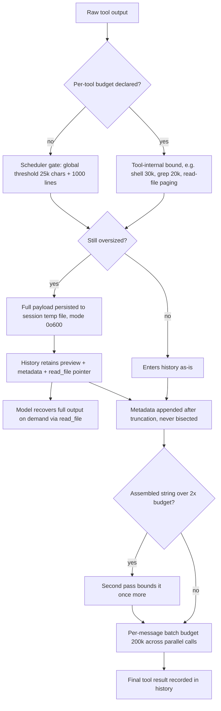

# Tool Output Offload/Preview: State Transitions and Privacy Model

> Design note required by [#4184](https://github.com/QwenLM/qwen-code/issues/4184)
> (acceptance criterion: "A design note documents the offload/preview state
> transition and privacy model"). Mitigation implemented in #4880; retention
> diagnostics added in the accompanying `/doctor memory` change.

## 1. Problem

In long sessions, OOM risk comes from oversized tool outputs being retained in
conversation history and taxing every later turn, and from duplicate copies of
history during compression — not just from traditional leaks. The goal is to
keep structured metadata and a bounded preview in the hot path, persist large
payloads out of it, and make diagnostics show where memory is retained.

## 2. State Transitions

A tool output moves through the following states before it can enter
conversation history:

Key properties:

- **Bounded before history.** Every layer acts before the result is recorded,
  so history never holds an unbounded payload.
- **Recoverable, never dropped.** Oversized output is persisted to a session
  temp file (`~/.qwen/tmp/<session-hash>/run_<tool>_<id>.output`) and the
  retained preview carries a pointer; the model can read the full payload back
  with `read_file`. Truncation keeps head and tail (`keep: 'both'`) because
  shell failure summaries appear at the end.
- **Re-entrancy guard.** A truncated result starts with a sentinel prefix
  (`TOOL_OUTPUT_TRUNCATED_PREFIX`); later passes detect it and skip
  re-truncation, so injected copies of the phrase cannot bypass the budget and
  truncation headers never nest.
- **Metadata integrity.** PostToolUse/skill metadata and system reminders are
  appended only after the raw body is bounded, then the assembled string is
  re-checked against a doubled budget.
- **Batch-level bound.** After all parallel calls in one message complete, the
  aggregate is reduced to `toolOutputBatchBudget` (default 200k chars) by
  offloading the largest results — covering the case where many individually
  legal results explode together.

## 3. Thresholds

| Layer            | Budget                                                                | Configurable                                                             |
| ---------------- | --------------------------------------------------------------------- | ------------------------------------------------------------------------ |
| Per-tool         | shell 30k, grep 20k, mcp 500k, agent 32k/tail, read-file self-managed | No (declared by tool)                                                    |
| Global           | 25k chars + 1000 lines                                                | `settings.tools.truncateToolOutputThreshold` / `truncateToolOutputLines` |
| Combined pass    | 2x of the applicable budget                                           | No                                                                       |
| Per-message      | 200k chars                                                            | `settings.tools.toolOutputBatchBudget`                                   |
| Disk persistence | 50MB per file, 500MB per session                                      | No                                                                       |

Per-tool budgets are char-only: when a tool declares one, the global line cap
is disabled for it so self-managed paging (read-file) and char budgets (grep)
are not silently undercut.

## 4. Privacy Model

Maps directly to the non-goals in #4184:

| Non-goal                                                | Enforcement                                                                                                                                                       |
| ------------------------------------------------------- | ----------------------------------------------------------------------------------------------------------------------------------------------------------------- |
| Do not upload tool results                              | Offload target is a local file under the session temp dir only; no network path exists in the truncation code                                                     |
| Do not include private content in diagnostics           | `/doctor memory` retention section reports sizes and counts only, never content; safe to paste in bug reports (also in `--json`)                                  |
| Do not silently drop data without a retrievable pointer | Oversized payloads are persisted with a preview + `read_file` pointer; if persistence is impossible (see below), the bounded preview still explains what happened |
| Owner-only artifacts                                    | Persisted files are written with mode `0o600`; the shared temp directory itself is not loosened                                                                   |

Disk persistence failure modes (all fail toward bounded memory, never toward
unbounded retention or data exposure):

- Output larger than 50MB: persistence skipped, in-memory truncation still
  bounds the result.
- Session budget (500MB) exhausted: persistence skipped, same in-memory bound.
- Truncation/IO error: the successful tool call is never demoted to an error;
  the original content is kept and a warning is logged.

## 5. Diagnostics (phase 1 signals)

`/doctor memory` now reports, live and by reference (no history clone):

- Tool results in history, total retained chars, largest result.
- Oversized results, counted against a 30k threshold aligned with the widest
  legal per-tool channel (shell). Any retained result above it means a layer
  was bypassed — the counter doubles as a regression alarm.
- Whether oversized outputs are also present in UI history (rendered text
  items) and in compression input (yes by construction, but compression reads
  history by reference via `getHistoryShallow`, so no extra copy is held).

## 6. Alternatives Considered

- **Summarize instead of truncate.** Adds a model round-trip on the hot path
  and complicates the privacy model; the pointer-based recovery achieves the
  same goal deterministically.
- **Lazy-load history from disk.** Changes the conversation contract and
  provider payload shape; the preview + pointer keeps the contract intact.
