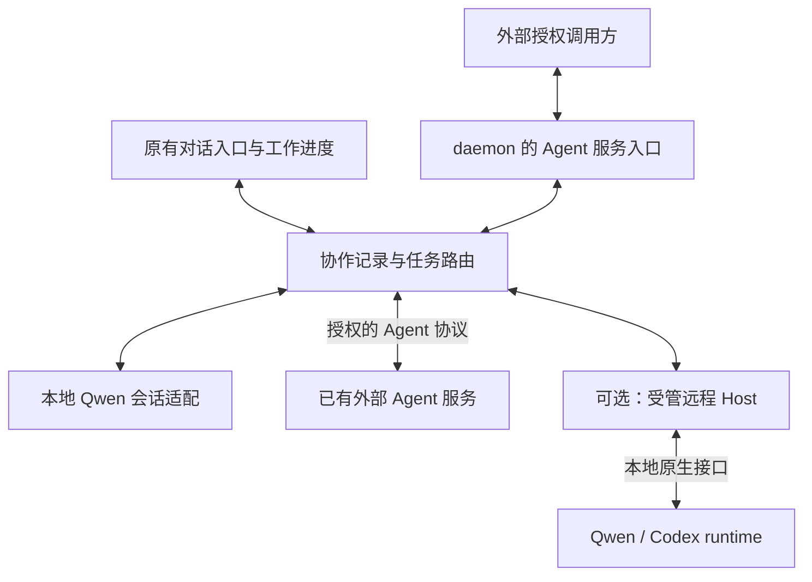

# 实验性 Agent 服务与双向协作

状态：接续设计，尚未实现。2026-09-09。

核心目标：Qwen Code 既能开放本地 Agent 给外部授权调用，也能联系本地或远程的已有 Agent；用户仍从原有对话入口发起工作，在同一工作界面查看分工、插话和验收。独立身份不要求永久运行一个进程，外部 Agent 不要求成为 Qwen subagent 或 Team 成员。

## 1. 范围与证据

本次为 #11206 的文档接续提交，没有修改生产代码、运行模型、执行安装脚本或跑本地 CI。本文件与[接续计划](../plans/2026-09-09-agent-service-collaboration-plan.md)共同描述新方向，不把建议记为实现。

代码核对固定在主 PR #11206 的 `6a69c0b5bbf1232644a297b567bb36350eb58ff4`；文档最初在独立 fork 编写，再以该提交为父提交接回 PR 分支。之前阅读的 `73c5765c10` 不作为新增代码结论的基线。

参考资料：

- [原设计](https://github.com/QwenLM/qwen-code/blob/6a69c0b5bbf1232644a297b567bb36350eb58ff4/docs/plans/2026-09-06-multi-agent-board-collaboration.md)，先读 §0.2；已有身份、任务、会话和投递基础可复用，历史运行证据不自动适用于新协议。
- [当前差距计划](https://github.com/QwenLM/qwen-code/blob/6a69c0b5bbf1232644a297b567bb36350eb58ff4/docs/plans/2026-09-08-workspace-agents-vs-multica-gap-and-plan.md)：顶层 ACP 会话按 `(agent, thread)` 隔离；Host H1 有注册和心跳，H2/H3 不是已实现的远程服务。
- 用户提供的《CoCo bot-start 脚本与 aone-channel 远程 Agent 架构分析 — 会话记录》（`coco-aone-channel-session.md`）：本轮完整阅读，但没有独立复核其私有源码包或重做安装。仅吸收架构观察，不复制内部地址、凭证、安装脚本或供应商专用命令。
- Multica 固定版本 `7a438bd5b8bf39afd54259a7eb0971390e50a8ef`：[runtime 存储](https://github.com/multica-ai/multica/blob/7a438bd5b8bf39afd54259a7eb0971390e50a8ef/server/migrations/004_agent_runtime_loop.up.sql)、[任务结构的 PriorSessionID](https://github.com/multica-ai/multica/blob/7a438bd5b8bf39afd54259a7eb0971390e50a8ef/server/internal/daemon/types.go)、[Qwen 执行适配](https://github.com/multica-ai/multica/blob/7a438bd5b8bf39afd54259a7eb0971390e50a8ef/server/pkg/agent/qwen.go)。持久身份、任务延续和执行进程生命周期应分开。
- [A2A 规范](https://a2a-protocol.org/latest/specification/)与[Codex App Server](https://learn.chatgpt.com/docs/app-server)：官方页面于本轮讨论核对。具体版本、传输绑定和可选能力须在实施前冻结，不把滚动文档当成固定兼容承诺。

### 1.1 从 CoCo 调研吸收什么

值得采用：宿主主动出站领任务；常驻接入服务管理多个身份；CLI 按任务启动或恢复；任务与会话 ID 显式关联；接单、执行、结果回传分开。它说明内网执行端不必开放入站端口，长轮询也可以形成持续协作。

不能直接采用：默认全权限执行、默认禁止所有提问、恢复失败后无提示地新开会话、结果发送失败不重试。任务已确认不能代替结果已持久化，Base64 也不是凭证保护。

调研中的“A2A 必须点对点直连”“一定由模型直接对模型通信”不能作为设计前提。A2A 定义应用层语义，daemon 或网关可以代表 Agent 实现服务；私有 relay 可以承载内部投递。私有 HTTP 接口不因此自动兼容 A2A。CLI 命令样例须按实际安装版本重新确认。

## 2. 产品与所有权

| 概念 | 所有者与生命周期 |
| --- | --- |
| Agent 定义 | 可复用角色模板，不是运行实例；继续复用现有 definition builder |
| 本地持久 Agent | 服务提供方管理身份、模型和执行策略；不随任务结束消失 |
| 外部 Agent 引用 | 调用方保存服务地址、远端身份和凭证引用；不是复制对方的模型配置 |
| Host | 可选的受管执行机器；注册 Host 不代表已获调用任意 Agent 的权利 |
| 协作任务 / thread | 创建该工作的平台负责用户目标、分工和人类验收 |
| 远端任务 | 服务提供方负责接单、容量、执行状态；调用方保存对应关系 |
| 执行会话 | 按任务隔离，可恢复；不要求每个身份永久占用进程 |
| run / 执行尝试 | 一次有起止状态的执行；同一任务会话可以承载多次 run |

外部身份用服务来源与远端 Agent ID 区分，本地 `@` 名字只是别名。服务提供方统一管理来自多个调用方的容量；调用方自己的限流不能代替它。现有调用方侧按线程树的 token 闸门不覆盖远端消耗；远端用量是否随 Task/Message 回报、是否必需，须在 P1 冻结契约时确定，否则本地预算对远端任务没有意义。

不建立新的全局身份目录或一次性设计大而全 schema。第一条外部路径落实时，再增加必要的外部引用和任务关联字段；不把已有 `runtimeId` 同时当作 Host、服务地址、Agent ID 和权限。

### 2.1 三种路径，不强迫走同一种部署

本地执行复用现有 ACP 路径，不为形式统一强制绕一次 HTTP。已有外部服务可以直连，无须安装我们的 Host。只有裸 runtime 才需要在其执行环境部署适配器。受管 Host 可以接受执行配置；外部服务自己拥有配置，我们只提交任务与获准分享的上下文。

创建工作不强制先创建 Team。可以选择负责人，让其委派和汇总，也可以直接指定一个 Agent。Team 是可选的内部协作机制，不是接入外部 Agent 的前提；现有 capability ceiling 尚禁止 Team 工具，不能仅凭本段宣称协作 Agent 已能启动 Team。

## 3. 通信契约与传输

外部互通优先对齐 A2A 的能力发现、消息、任务、交付物与错误语义，不先发明完整私有协议再声称兼容。管理 API 与 Agent 调用 API 分开。首次实施须选择一个明确版本和绑定，用独立客户端证明互通；不以两端都用自家客户端自测为标准兼容证据。

| 连接场景 | 首条实现方向 |
| --- | --- |
| 已有可达 Agent 服务 | 服务端声明的协议与认证；HTTPS 请求，支持时订阅事件，否则查询 |
| 内网受管执行端 | Host 主动向可达协调端发起 HTTPS 长轮询，回传事件；不另加公网监听 |
| runtime 原生接入 | 执行机器上的原生接口；Codex 优先评估 App Server，Qwen 复用 ACP |

出站通道是内部投递，不冒充新的 A2A 标准绑定。第一版不同时实现多套长连接、自动穿透、云中继或自动安装服务。两端都无法互相到达时，需要明确的私网或中继部署，协议不能解决网络不可达。

接单、排队、运行、等待输入、结果就绪、失败、取消分别记录。协议 Task、Codex turn 和本地人类验收不是同一终态：远端完成只说明此次远端任务完成，本地根据依赖与验收状态聚合，不能自动标整项工作 done。

关联须包含调用方、目标、远端 task/context、原生会话与执行标识。不能假设每个标准 Message 都会产生 Task，或一个 context 永远只对应一个 Task。终态后续交流按选定协议决定新任务与上下文延续，不强行复活终态对象。

### 3.1 交付与断线

- 接单先持久化，再报告已接收。幂等键以认证调用方和目标为作用域，同键不同内容明确拒绝。
- 请求超时是结果未知，不是未接收。先查原任务或按明确的幂等契约重试；未知能力的远端不盲目重发有副作用任务。
- 消息接受、模型消费、结果交付分别记录。可选能力缺失就显示未知或不支持，不制造已读回执。
- 结果先持久化，再发送并重试；事件重复去重，游标失效后回读快照。进程恢复可能重复实际副作用，不承诺 exactly-once 执行。
- 中途消息不支持时明确排到下一轮；取消收到回执后仍须确认停止。断线不自动算执行失败。
- 同一原生会话只能有明确执行所有者；不同时让本地终端和适配器无协调地写同一会话。恢复失败需报告连续性缺口，不能静默新开会话冒充恢复。

## 4. 授权不进入模型

区分三类凭证：Agent 调用凭证、Host 接入凭证、某次执行尝试的授权。现有 daemon 管理 token 不下发给外部协作者。

自管双方可采用短期一次性配对，换取可撤销、可轮换、有限期且限定 Agent 的调用凭证。外部服务遵循它声明的认证机制，不强迫使用我们的配对流程。配对是部署管理，不是自行定义一种 A2A 登录协议。

每次提交、读取、追加消息、取消、下载交付物及事件订阅都检查调用方、Agent、任务归属和当前权限。只有显式授权共享的任务才跨调用方可见。权限判断来自服务端，不信任 prompt、名字、远端自称的作者或调用方传来的本地 runId。

密钥由 daemon/适配器持有，不进 prompt、模型工具参数、公开日志或网页可读存储；提供方模型登录状态留在提供方。网络访问验证服务端身份，非 loopback 使用 HTTPS。服务地址由有权的用户配置，不能让模型任意指定 URL 携带凭证访问；重定向、交付物下载与地址变更重复检查目标，不向其他 origin 转发凭证。

外部调用在提供方明确的执行范围内运行，不自动继承提供方用户的全部工具权限。敏感动作需提供方批准，若无法约束则不开放。原 v1 的只读限制继续有效，不能因接入网络就删除；扩展到特定测试环境或工具需要单独的权限验收。

撤销禁止后续请求并关闭订阅；停止已有任务是独立操作。拒绝审批应返回明确状态，不能改成跳过审批。A 调 B、B 调 C 不自动转发 A 的凭证或全部材料，跨 hop 委派需独立授权。

受管 Host 的回传和工具写入，还要在权威任务存储事务内验证当前 run/attempt 和执行所有权。服务型远端只回传其有权报告的远端事实，由调用方映射，不能写本地任意 `thread_*`。不通过网络共享本地 JSON 文件。

当前本地 run 帧的信任边界由三处共同维持：bridge 对所有调用方剥离 `qwen.daemon.agentRun`、只从 daemon 请求上下文重注入、mid-turn 队列仅在没有 originatorClientId 时透传。最后一条是对调用方标识的否定检查，今天成立但此前未在任何契约中声明；一条恰好带上 originatorClientId 的 daemon 内部路径会静默丢帧。外部提交的任务映射到本地 run 帧不得经过 `_meta`，P1 须为此定义独立通道。

## 5. Codex 与其他 runtime

Codex 适配器放在 Codex 执行机器上，负责本地任务映射到 `thread/start`、`thread/resume`、`turn/start`、`turn/steer`、`turn/interrupt` 和事件。按实际安装版本协商支持范围，不能把 App Server 全部管理能力直接暴露给调用方。

第一条异构路径先做到接活、续聊、结果和审批。主动委派是下一档：通过 runtime 支持的受限协作工具接入，不要求它原生理解六个 `thread_*`，也不从正文随意解析 `@` 触发远端动作。适配器不是另一个负责推理的 Qwen Agent。

原生 turn 结束映射为一次执行结束；只有明确任务结果才进入结果就绪。没有证据时显示未明确收尾，不能凭自然语言猜成功。

## 6. 实验开关与关闭契约

**Agent Team 与跨 Agent 协作分别 opt-in，默认关闭，互不隐式开启。** 沿用现有 `experimental.agentTeam` 及其显式环境变量入口；新的协作开关暂称 `experimental.agentCollaboration`，名称尚未落代码。缺失新设置视为 false。resolved off 是完成现有配置优先级计算后的关闭状态，不是忽略显式环境变量。

允许协作也不等于允许外部访问：开放某个 Agent、信任某个连接、注册 Host 仍需操作者显式配置。仓库提供的未受信设置、远端请求或模型不能自行打开外部授权。daemon 限制是上限，各 workspace 和会话只可缩小范围；不能错误回退到 primary workspace。

| Team | 协作 | 允许出现的增量能力 |
| --- | --- | --- |
| 关 | 关 | 原有聊天、subagent、后台消息等基线能力不变；没有新增协作感知 |
| 开 | 关 | Team 工具与实际团队上下文；没有持久协作、Host 或外部接入 |
| 关 | 开 | 持久 Agent 与授权协作；不注入 Team 工具或组员 |
| 开 | 开 | 按会话身份和权限分别暴露，不把全部团队与远端名单注入每次请求 |

关闭必须在功能边界生效，而不是只隐藏导航或等待工具运行后再报错：

1. 不追加协作 system prompt、角色帧、名单或接入工具说明；不因关闭功能改变原有工具 schema 和 prompt cache 输入。
2. 不注册或让工具发现检索到新增协作工具；调用守卫也拒绝陈旧/伪造入口。普通 subagent 不因 `forSubAgent` 就获得 `thread_*`。
3. 不读取或迁移协作存储，不启动 dispatcher、恢复扫描、Host 心跳、claim、结果发送或通知消费；仅旧文件存在不触发自动开启。
4. 不接受协作/Host/A2A 路由操作，不发布开放的 Agent Card；不影响已有普通 daemon API。静态 capability 可以报告 disabled，不初始化服务。
5. 不增加协作导航、接收人补全、自动路由或后台请求；原有 `/agents` 模板管理和 subagent 消息工具不随新开关消失。
6. 不对普通会话套用协作专用只读限制、恢复逻辑或终态契约。共享基础修复可继续复用，但必须检查原有消费者。

开启是允许使用，不是向所有模型广播全局 roster。发起委派的会话只看到授权可寻址对象；执行会话只看到当前任务需要的上下文。`sourceType: agent` 本身不是授权证明；标识可以用于分类，启用状态与服务器绑定才决定特权路径。

第一版开关在启动时解析，变更要求重启，不设计隐蔽的热切换。停用前提示有活跃本地或远端任务，需要显式排空或取消；重启关闭后保留记录但不自动续跑，不谎称远端已经停止。重新启用先核对原任务状态，不能新派一份。凭证撤销与关闭功能不是同一个操作。

“不能新派一份”与现有恢复逻辑直接冲突，需要一个明确的搁浅状态。现状：dispatcher 每次 tick 对每个 `running` 的 run 询问运行时本体是否还在；本体缺席且 `attempts < 2` 就重排队再启动，这是崩溃恢复。开关关闭后 dispatcher 不跑，`running` 的 run 原样留在存储里；重开时 dispatcher 看到它、发现本体已随重启消失，就会按崩溃处理——自动重派。恢复逻辑无法区分“崩溃”与“被开关搁浅”，只靠“状态未知”标签挡不住它。决定：关闭生效时（含停用前排空未完成、daemon 异常退出的情况），把 `running` / `finishing` 的本地 run 置为独立的搁浅终态并记录原因；重开后它们出现在 UI 里等人处置——由人决定作为新 run 重派还是取消，系统不自动做。远端任务同理，但先在 P2 定义。

开关关闭后恢复 `sourceType: agent` 的已有会话，决定：拒绝以协作身份恢复，按失败关闭处理，不降级为普通会话。一个顶着 Agent 名字、却没有 persona 和工具的会话，比明确拒绝更具误导性；而降级还会让“不对普通会话套用协作逻辑”这条契约在边界上变得模糊。

“无影响”指可观察的原有行为与模型输入不增加协作副作用，不保证代码零改动或绝对零性能开销。源码读取不能证明该契约，需要计划中的关闭对照观测。

## 7. 当前明确的实现差距

以下均在 `6a69c0b5bbf1232644a297b567bb36350eb58ff4` 读取，不是实际运行结论：

| 位置与证据 | 下一步处理 |
| --- | --- |
| `config.ts:isAgentTeamEnabled`、`settingsSchema.ts:experimental.agentTeam` 已有默认 false；Team 工具注册有条件 | 保留开关和现有兼容性；不能据此声称整个 mesh 已 opt-in |
| `config.ts:createToolRegistry` 的 `forSubAgent || sessionSourceType === 'agent'` 分支注册六个线程工具，没有独立协作开关 | 缩为已启用且服务器绑定的协作执行上下文；验证普通 subagent 最终工具声明，不只检查调用是否被拒 |
| `server.ts` 直接调用 `registerWorkspaceAgentRoutes`，其中立即 `recover()` 并创建 5 秒定时器 | 功能关闭时不创建扫描器；enabled workspace 的筛选必须在读协作存储前 |
| `server.ts` 直接注册 Host enrollment/heartbeat 路由 | 关闭时不提供该入口；注册自身有认证并不等于满足实验开关 |
| `session-dispatch-port.ts` 对非 local runtime 返回 unavailable | 保留为本地实现；新增明确的服务型接入，不将未知远端退回本地 |
| H2 假设主端提供 persona/tool snapshot | 仅适用受管 Host；已有服务拥有自己配置，不按 H2 重建它 |
| `config.ts` 另一处按 `sessionSourceType === 'agent'` 分支 | 与 `createToolRegistry` 同一开关，不留第二个真值来源 |
| `acpAgent.ts` 在 `sourceType: agent` 会话创建/恢复时应用 persona | 开关关闭时拒绝以协作身份恢复（§6 决定） |
| `Session.ts` + `agent-run-meta.ts` 从 `_meta` 建立 run 帧 | 开关关闭时不建立帧；帧缺席时六个 `thread_*` 本已拒绝，此处是双保险不是唯一防线 |
| `bridge.ts` 剥离/重注入 `agentRun`，mid-turn 队列按 `!originatorClientId` 透传 | 机制保留并写入 §4；P1 为外部任务另定通道 |
| `session-dispatch-port.ts` 向每个派发注入 `agentRun` | 开关关闭时 port 与 host owner 都不创建，而非创建后再拒绝 |
| `acpAgent.ts` 以 Agent 名为会话命名 | 随会话创建被拒一并消失；不单独加开关 |
| web-shell `App.tsx` 的 `'agents'` 面板、命令与导航 | 按 daemon capability 消费；关闭时不渲染入口，不只隐藏按钮 |

以上共约十二处，为 P0 的检查表；此前只列四处不是全部。

## 8. 替代旧计划的边界与暂不做的事

后续开发以本文件和接续计划为新方向；旧设计的存储、规则与安全约束在未被本文明确替代时继续有效。旧运行观测保留为历史证据，不删除失败记录。

| 原文位置 | 修订意图 |
| --- | --- |
| 原设计 §1、§2 决策 5 | 保留持久身份与按任务隔离，不再以是否独立进程判定是否满足目标 |
| §2 决策 1–2、§10 | 只读保留为现有执行策略；双向接入与异构 runtime 不再永久排除，写权限仍未获默认授权 |
| §2 决策 4 | workspace 仍是访问与数据边界；同一外部服务可被多个 workspace 引用，不要求复制其身份 |
| §2 决策 7、§4、§5.2 | 清除混入正文的 background launcher/registry 路径；后台协调归 daemon 服务，不需要模型会话充当调度器 |
| §6 收尾工具 | 保留本地显式收尾；外部协议状态由适配器转换，不强制别的 runtime 使用 Qwen 工具名 |
| §9.1、§9.6 | 已按任务隔离后，跨任务污染与删除应重新分析共享记忆/文件及外发数据，不沿用单一跨线程 transcript 假设 |
| Web Shell 设计 §3–4 | 对话发起、进度辅助；管理入口区分创建与接入，不强迫先填任务表单或建 Team |
| 差距计划 H1–H3 | H1 可复用，H2 只管受管 Host；完整 transcript 代理不是第一条服务调用的前置条件 |

暂不做全局调度、云平台、多协议 SDK 框架、完整任务管理套件、自动穿透、每个 Agent 永久独立进程。Agent Board 的存储合并仍不在本次范围；可借其委派/回答语义，不把未认证 label 当网络身份。

尚需具体实施前确认：A2A 固定版本及必需操作、第一项外部 Agent 的执行权限、实际网络可达方式、审批接收人。原设计中父子回复、blocker 确认范围、通知目标与预算策略不因本文自动获准。
