# Experimental Agent Services and Bidirectional Collaboration

[English](2026-09-09-agent-service-collaboration.md) | [简体中文](2026-09-09-agent-service-collaboration.zh-CN.md)

Status: continuation design, not yet implemented. 2026-09-09.

Core goal: Qwen Code can expose local Agents to authorized external callers and contact existing local or remote Agents. Users still start work from their existing conversation entry and view delegation, intervene, and accept results in the same interface. Independent identity does not require a permanently running process; an external Agent need not become a Qwen subagent or Team member.

## 1. Scope and Evidence

This is a documentation continuation of #11206. This round did not change production code, run models, execute installation scripts, or run local CI. This document and the [continuation plan](../plans/2026-09-09-agent-service-collaboration-plan.md) describe the new direction without presenting proposals as implementation.

Code inspection is pinned to `6a69c0b5bbf1232644a297b567bb36350eb58ff4` of main PR #11206. The document was first written in a separate fork, then attached to the PR branch with that commit as its parent. The previously inspected `73c5765c10` is not the baseline for new code conclusions.

References:

- [Original design](https://github.com/QwenLM/qwen-code/blob/6a69c0b5bbf1232644a297b567bb36350eb58ff4/docs/plans/2026-09-06-multi-agent-board-collaboration.md), starting with §0.2: existing identity, task, session, and delivery foundations are reusable; historical execution evidence does not automatically apply to a new protocol.
- [Current gap plan](https://github.com/QwenLM/qwen-code/blob/6a69c0b5bbf1232644a297b567bb36350eb58ff4/docs/plans/2026-09-08-workspace-agents-vs-multica-gap-and-plan.md): top-level ACP sessions are isolated by `(agent, thread)`; Host H1 has registration and heartbeats, while H2/H3 are not implemented remote services.
- User-provided “CoCo bot-start Script and aone-channel Remote Agent Architecture Analysis — Session Record” (`coco-aone-channel-session.md`): read in full this round, without independently checking its private source package or repeating installation. Only architectural observations are adopted; internal addresses, credentials, installation scripts, and vendor-specific commands are not copied.
- Multica pinned at `7a438bd5b8bf39afd54259a7eb0971390e50a8ef`: [runtime storage](https://github.com/multica-ai/multica/blob/7a438bd5b8bf39afd54259a7eb0971390e50a8ef/server/migrations/004_agent_runtime_loop.up.sql), [PriorSessionID in task structures](https://github.com/multica-ai/multica/blob/7a438bd5b8bf39afd54259a7eb0971390e50a8ef/server/internal/daemon/types.go), [Qwen execution adapter](https://github.com/multica-ai/multica/blob/7a438bd5b8bf39afd54259a7eb0971390e50a8ef/server/pkg/agent/qwen.go). Persistent identity, task continuation, and execution-process lifetime should be separate.
- [A2A specification](https://a2a-protocol.org/latest/specification/) and [Codex App Server](https://learn.chatgpt.com/docs/app-server): official pages checked during this discussion. Freeze the exact version, transport binding, and optional capabilities before implementation; rolling documentation is not a fixed compatibility promise.

### 1.1 What to Adopt from the CoCo Investigation

Worth adopting: hosts initiate outbound task pickup; a persistent ingress service manages multiple identities; CLIs start or resume per task; task and session IDs are explicitly linked; acceptance, execution, and result delivery are separate. This shows that private-network workers need not expose inbound ports and that long polling can support ongoing collaboration.

Do not adopt directly: full execution permissions by default, blanket suppression of questions, silently starting a new session when resumption fails, or failing to retry result delivery. Acknowledging a task is not the same as persisting its result, and Base64 does not protect credentials.

The investigation's claims that A2A requires direct peer-to-peer connections or direct model-to-model communication are not design premises. A2A defines application semantics; a daemon or gateway can implement the service on an Agent's behalf, and a private relay can carry internal delivery. A private HTTP API does not thereby become A2A-compatible. Recheck CLI examples against the installed version.

## 2. Product Model and Ownership

| Concept                     | Owner and lifetime                                                                                                                |
| --------------------------- | --------------------------------------------------------------------------------------------------------------------------------- |
| Agent definition            | Reusable role template, not a runtime instance; continue using the existing definition builder                                    |
| Local persistent Agent      | The provider manages identity, model, and execution policy; it survives task completion                                           |
| External Agent reference    | The caller stores service address, remote identity, and credential reference; it does not copy the provider's model configuration |
| Host                        | Optional managed execution machine; registering a Host does not grant permission to invoke arbitrary Agents                       |
| Collaboration task / thread | The platform creating the work owns the user's goal, delegation, and human acceptance                                             |
| Remote task                 | The provider owns intake, capacity, and execution state; the caller stores the mapping                                            |
| Execution session           | Isolated per task and resumable; an identity need not permanently occupy a process                                                |
| run / execution attempt     | One execution with start and end states; a task session can carry multiple runs                                                   |

External identities are distinguished by service origin and remote Agent ID; the local `@` name is only an alias. The provider manages capacity across callers; caller-side rate limits cannot replace this. The existing caller-side token gate for a thread tree does not cover remote consumption. P1 must freeze whether remote usage accompanies Task/Message and whether it is required; otherwise local budgets have no meaning for remote tasks.

Do not create a new global identity directory or design an exhaustive schema up front. Add the necessary external-reference and task-link fields when implementing the first external path. Do not use `runtimeId` simultaneously as Host, service address, Agent ID, and permission.

### 2.1 Three Paths, Without Requiring One Deployment Model

```mermaid
flowchart TB
    U[Existing conversation entry and work progress] <--> C[Collaboration records and task routing]
    C <--> L[Local Qwen session adapter]
    C <-->|Authorized Agent protocol| E[Existing external Agent service]
    C <--> H[Optional managed remote Host]
    H <-->|Local native interface| R[Qwen / Codex runtime]
    X[Authorized external caller] <--> I[Daemon Agent service entry]
    I <--> C
```

Local execution reuses ACP without forcing an HTTP round trip for uniformity. Existing external services can connect directly without installing our Host. Only bare runtimes need an adapter in their execution environment. A managed Host can accept execution configuration; an external service owns its configuration, and we submit only tasks and authorized shared context.

Creating work does not require creating a Team first. Users may choose an owner to delegate and summarize, or directly assign an Agent. Team is an optional internal collaboration mechanism, not a prerequisite for external Agents. The current capability ceiling still prohibits Team tools, so this paragraph does not establish that collaboration Agents can start Teams.

## 3. Communication Contract and Transport

External interoperability should first align with A2A discovery, messages, tasks, artifacts, and error semantics, rather than inventing a complete private protocol and then claiming compatibility. Separate management APIs from Agent invocation APIs. The first implementation must choose an explicit version and binding and demonstrate interoperability with an independent client. Testing our own client at both ends is not standards-compatibility evidence.

| Connection scenario                 | First implementation direction                                                                                     |
| ----------------------------------- | ------------------------------------------------------------------------------------------------------------------ |
| Existing reachable Agent service    | Service-declared protocol and authentication; HTTPS requests, event subscription when supported, otherwise polling |
| Managed worker in a private network | Host initiates HTTPS long polling to a reachable coordinator and returns events; no additional public listener     |
| Native runtime integration          | Native interface on the execution machine; evaluate App Server first for Codex and reuse ACP for Qwen              |

The outbound channel is internal delivery, not a new standard A2A binding. Do not implement multiple persistent-connection transports, automatic NAT traversal, cloud relays, or service installation in the first version. When neither end can reach the other, an explicit private network or relay deployment is needed; a protocol cannot fix unreachable networks.

Record acceptance, queuing, running, waiting for input, result readiness, failure, and cancellation separately. A protocol Task, a Codex turn, and local human acceptance do not share a terminal state. Remote completion means only that the remote task completed; local aggregation follows dependencies and acceptance state and must not automatically mark the whole work done.

Correlations must include caller, target, remote task/context, native session, and execution identifiers. Do not assume every standard Message creates a Task or that one context always corresponds to one Task. Follow-up communication after a terminal state follows the selected protocol's rules for new tasks and context continuation, rather than forcibly reviving terminal objects.

### 3.1 Delivery and Disconnection

- Persist intake before acknowledging acceptance. Scope idempotency keys to the authenticated caller and target; explicitly reject the same key with different content.
- A request timeout means an unknown outcome, not non-acceptance. Query the original task or retry under an explicit idempotency contract. Do not blindly resend side-effecting tasks to a remote with unknown capabilities.
- Record message acceptance, model consumption, and result delivery separately. Show unknown or unsupported when optional capabilities are absent; do not invent read receipts.
- Persist results before sending and retrying; deduplicate repeated events and reload snapshots when cursors expire. Process recovery may repeat real side effects; do not promise exactly-once execution.
- Queue mid-turn messages for the next turn when unsupported. Cancellation acknowledgement still requires confirmation that execution stopped. Disconnection does not automatically mean execution failure.
- A native session must have one explicit execution owner. Do not let a local terminal and adapter write the same session without coordination. Report a continuity gap when resumption fails; do not silently start a new session and call it a resume.

## 4. Authorization Stays Outside the Model

Distinguish Agent invocation credentials, Host enrollment credentials, and authorization for one execution attempt. Do not distribute the existing daemon management token to external collaborators.

Self-managed peers can exchange a short-lived, single-use pairing token for revocable, rotatable, expiring credentials scoped to specific Agents. External services follow their declared authentication mechanisms rather than being forced through our pairing flow. Pairing is deployment management, not a custom A2A login protocol.

Every submission, read, appended message, cancellation, artifact download, and event subscription checks the caller, Agent, task ownership, and current permissions. Only explicitly shared tasks are visible across callers. Authorization comes from the server; do not trust prompts, names, remote claims of authorship, or caller-supplied local runIds.

The daemon/adapter holds secrets. They do not enter prompts, model tool arguments, public logs, or browser-readable storage; provider model login state stays with the provider. Network access verifies server identity and uses HTTPS outside loopback. Authorized users configure service addresses; models cannot choose arbitrary URLs for credential-bearing requests. Recheck destinations on redirects, artifact downloads, and address changes; do not forward credentials to another origin.

External calls execute within the provider's explicit scope, without inheriting all of its user's tool permissions. Sensitive actions need provider approval; do not expose execution if it cannot be constrained. The original v1 read-only restriction remains in force and must not disappear merely because networking is added. Expansion to particular test environments or tools requires separate permission acceptance.

Revocation blocks subsequent requests and closes subscriptions; stopping existing tasks is a separate operation. Denied approval returns an explicit state rather than bypassing approval. When A calls B and B calls C, A's credentials and full materials are not automatically forwarded; each delegation hop needs separate authorization.

Managed Host reports and tool writes must also validate the current run/attempt and execution ownership within the authoritative task-storage transaction. A service remote reports only facts it is authorized to report; the caller maps them. It cannot write arbitrary local `thread_*` operations. Do not share local JSON files over the network.

Three mechanisms jointly maintain the current local run-frame trust boundary: the bridge strips `qwen.daemon.agentRun` from every caller, reinjects it only from daemon request context, and passes it through the mid-turn queue only when originatorClientId is absent. The last rule is a negative caller-identity check that currently holds but was not previously declared in a contract. An internal daemon path carrying originatorClientId would silently lose its frame. External task mapping to local run frames must not pass through `_meta`; P1 must define a separate channel.

## 5. Codex and Other Runtimes

The Codex adapter lives on the machine executing Codex and maps local tasks to `thread/start`, `thread/resume`, `turn/start`, `turn/steer`, `turn/interrupt`, and events. Negotiate supported capabilities against the installed version rather than exposing all App Server management capabilities to callers.

The first heterogeneous path covers intake, follow-up conversation, results, and approval. Active delegation comes later through restricted collaboration tools supported by the runtime. It does not require native understanding of the six `thread_*` tools or trigger remote actions by arbitrarily parsing `@` from message text. The adapter is not another reasoning Qwen Agent.

Native turn completion maps to execution completion; only an explicit task result becomes result-ready. Without evidence, show an unclosed outcome rather than infer success from natural language. The local path already does this: a run reaching completed without invoking a closing tool is marked `unclosed`, not implicitly successful (`run-lifecycle.ts`). Codex lacks the six `thread_*` tools, so every Codex turn ends this way. Unless an explicit task-result signal is defined, every Codex task will remain unclosed and require manual marking. Proposal, to confirm before P3: map to result-ready only when the turn ends and the adapter receives a structured result item (artifact or explicit completion event); turn completion alone maps to `unclosed`, as on the local path.

## 6. Experimental Flags and the Disabled Contract

**Agent Team and cross-Agent collaboration are separate opt-ins, disabled by default, and neither implicitly enables the other.** Retain `experimental.agentTeam` and its explicit environment-variable entry. The proposed collaboration flag is `experimental.agentCollaboration`; the name is not yet implemented. A missing setting means false. Resolved off means disabled after applying existing configuration precedence, not ignoring an explicit environment variable.

Enabling collaboration does not grant external access. Exposing an Agent, trusting a connection, and registering a Host still require explicit operator configuration. Untrusted repository settings, remote requests, and models cannot enable external authorization themselves. Daemon limits form the ceiling; workspaces and sessions may only narrow them. Never incorrectly fall back to the primary workspace.

| Team | Collaboration | Allowed additional capabilities                                                                                                 |
| ---- | ------------- | ------------------------------------------------------------------------------------------------------------------------------- |
| Off  | Off           | Existing chat, subagent, and background-message behavior stays unchanged; no new collaboration awareness                        |
| On   | Off           | Team tools and actual team context; no persistent collaboration, Host, or external integration                                  |
| Off  | On            | Persistent Agents and authorized collaboration; no Team tools or membership injected                                            |
| On   | On            | Expose capabilities according to session identity and permissions; do not inject all team and remote rosters into every request |

Disabling must take effect at feature boundaries, not merely hide navigation or wait for a tool invocation to fail:

1. Do not append collaboration system prompts, role frames, rosters, or integration-tool descriptions. Disabling the feature must not change existing tool schemas or prompt-cache inputs.
2. Do not register new collaboration tools or expose them through tool discovery. Invocation guards also reject stale or forged entry points. Ordinary subagents do not receive `thread_*` solely because `forSubAgent` is set.
3. Do not read or migrate collaboration storage, start dispatchers or recovery scans, send Host heartbeats, claim work, deliver results, or consume notifications. Existing files alone do not enable the feature.
4. Do not accept collaboration/Host/A2A route operations or publish an exposed Agent Card. Existing ordinary daemon APIs remain unaffected. Static capabilities may report disabled without initializing the service.
5. Do not add collaboration navigation, recipient completion, automatic routing, or background requests. Existing `/agents` template management and subagent messaging tools do not disappear with the new flag.
6. Do not apply collaboration-specific read-only restrictions, recovery logic, or terminal-state contracts to ordinary sessions. Shared infrastructure fixes remain reusable, but existing consumers must be checked.

Enabling allows use; it does not broadcast a global roster to every model. A delegating session sees only authorized addressable targets; an executing session sees only the context its task needs. `sourceType: agent` alone is not authorization. Identifiers can classify, but enabled state and a server binding determine privileged paths. A server binding means the daemon dispatcher actually assigned the session: storage contains a claimed run whose `sessionId` matches that session, rather than a client merely claiming an identity during creation. There is currently no enforcement point: `routes/session.ts` rejects client-supplied `agent-host` but accepts `agent`, while `acpAgent.ts` checks only that the agent is in the roster before applying its persona, not that a dispatch record exists. Consequently any daemon client can currently obtain an Agent's persona and read-only tool surface with `sourceType: agent`. P0 must look up a claimed run by `sessionId` during creation/resumption and reject collaboration identity when none exists.

Resolve the first version's flag at startup and require restart for changes, without hidden hot switching. Startup means daemon startup: route registration and recovery loops resolve it once; session tool registration and persona application read that resolved value rather than independently rereading settings. Otherwise editing settings after daemon startup could leave routes registered but new sessions without tools, or the reverse. The existing `agentTeamEnabled` is read when constructing each session's `Config`; the new flag must not copy that behavior. Before disabling, warn about active local or remote tasks and require explicit draining or cancellation. After restarting with collaboration disabled, retain records without automatically resuming work or claiming remote execution has stopped. On re-enabling, reconcile original task status before dispatching anything again. Credential revocation and disabling the feature are separate operations.

The prohibition on redispatch conflicts with existing recovery and requires an explicit stranded state. Currently, on each tick the dispatcher checks whether each `running` run's execution runtime still exists. If absent and `attempts < 2`, it requeues and restarts the run as crash recovery. While disabled the dispatcher does not run, leaving `running` records unchanged. On re-enabling, the runtime has disappeared during restart, so the dispatcher treats it as a crash and automatically redispatches. Recovery cannot distinguish a crash from flag-induced stranding; an unknown-status label alone cannot prevent this. Decision: when disabling takes effect, including incomplete draining and abnormal daemon exit, put local `running` / `finishing` runs into a separate stranded terminal state with a reason. On re-enabling, show them in the UI for a person to decide whether to redispatch as a new run or cancel; do not act automatically. Remote tasks need the same treatment, first defined in P2.

For resuming an existing `sourceType: agent` session while disabled, reject collaboration identity and fail closed rather than downgrade to an ordinary session. A session bearing an Agent's name without its persona or tools is more misleading than an explicit refusal. Downgrading would also blur the contract that ordinary sessions do not receive collaboration logic.

No impact means no added collaboration side effects in observable existing behavior or model input, not zero code changes or strictly zero performance overhead. Source inspection cannot prove this contract; the plan requires disabled-control observations.

## 7. Explicit Current Implementation Gaps

The first six rows were inspected at `6a69c0b5bbf1232644a297b567bb36350eb58ff4`. Later rows were checked at a subsequent head on the same branch, with only documentation commits between them and no production changes, so the conclusions also apply to `6a69c0b5bb`. All are source observations, not runtime findings:

| Location and evidence                                                                                                                                   | Next action                                                                                                                                  |
| ------------------------------------------------------------------------------------------------------------------------------------------------------- | -------------------------------------------------------------------------------------------------------------------------------------------- |
| `config.ts:isAgentTeamEnabled` and `settingsSchema.ts:experimental.agentTeam` already default to false; Team tool registration is conditional           | Preserve the flag and compatibility; this does not establish that the whole mesh is opt-in                                                   |
| `config.ts:createToolRegistry` registers six thread tools under `forSubAgent \|\| sessionSourceType === 'agent'`, without a separate collaboration flag | Restrict to enabled, server-bound collaboration execution; verify ordinary subagents' final tool declarations, not just invocation rejection |
| `server.ts` calls `registerWorkspaceAgentRoutes` directly, which immediately calls `recover()` and creates a 5-second timer                             | Do not create scanners while disabled; filter enabled workspaces before reading collaboration storage                                        |
| `server.ts` registers Host enrollment/heartbeat routes directly                                                                                         | Do not expose them while disabled; authentication alone does not satisfy the experimental flag                                               |
| `session-dispatch-port.ts` returns unavailable for non-local runtimes                                                                                   | Preserve as the local implementation; add explicit service integration without falling back to local for unknown remotes                     |
| H2 assumes the primary side supplies a persona/tool snapshot                                                                                            | Applies only to managed Hosts; existing services own their configuration and are not reconstructed under H2                                  |
| Another `sessionSourceType === 'agent'` branch in `config.ts`                                                                                           | Use the same flag as `createToolRegistry`, without a second source of truth                                                                  |
| `acpAgent.ts` applies personas on creation/resumption of `sourceType: agent` sessions                                                                   | Reject collaboration resumption while disabled (§6 decision)                                                                                 |
| `Session.ts` + `agent-run-meta.ts` establish run frames from `_meta`                                                                                    | Do not create frames while disabled; the six `thread_*` tools already reject absent frames, but this is defense in depth, not the only guard |
| `bridge.ts` strips/reinjects `agentRun`; the mid-turn queue passes it through on `!originatorClientId`                                                  | Preserve and document in §4; P1 defines a separate external channel                                                                          |
| `session-dispatch-port.ts` injects `agentRun` into every dispatch                                                                                       | Do not create the port or host owner while disabled, rather than creating them and rejecting afterward                                       |
| `acpAgent.ts` names sessions after the Agent                                                                                                            | Disappears when session creation is rejected; no separate flag                                                                               |
| web-shell `App.tsx`'s `'agents'` panel, commands, and navigation                                                                                        | Consume daemon capabilities; do not render entry points while disabled, rather than merely hiding buttons                                    |
| `routes/session.ts` permits client-supplied `sourceType: agent`; `acpAgent.ts` does not check dispatch records                                          | Look up a claimed run on creation/resumption; reject if absent (§6 server binding). This invariant also applies while enabled                |

These fourteen locations form the P0 checklist; the previous list of four was incomplete. The last row is independent of the flag and must also hold while enabled.

## 8. Boundaries Replacing the Old Plan and Deferred Work

This document and the continuation plan set the new direction. Existing storage, rules, and security constraints remain valid unless explicitly replaced here. Retain historical runtime observations, including failures.

| Original location                 | Intended revision                                                                                                                                                                                                                                                                                                                                                                                                                                                                                                                  |
| --------------------------------- | ---------------------------------------------------------------------------------------------------------------------------------------------------------------------------------------------------------------------------------------------------------------------------------------------------------------------------------------------------------------------------------------------------------------------------------------------------------------------------------------------------------------------------------- |
| Original design §1, §2 decision 5 | Preserve persistent identity and per-task isolation; do not judge success by whether a process is independent                                                                                                                                                                                                                                                                                                                                                                                                                      |
| §2 decisions 1–2, §10             | Keep read-only execution as current policy; bidirectional integration and heterogeneous runtimes are no longer permanently excluded, but write permissions remain unauthorized by default                                                                                                                                                                                                                                                                                                                                          |
| §2 decision 4                     | Workspace remains the access/data boundary; multiple workspaces may reference the same external service without copying its identity                                                                                                                                                                                                                                                                                                                                                                                               |
| §2 decision 7, §4, §5.2           | Remove background launcher/registry paths mixed into the text; background coordination belongs to the daemon service and does not need a model session as scheduler                                                                                                                                                                                                                                                                                                                                                                |
| §6 closing tools                  | Preserve explicit local closure; adapters convert external protocol state without requiring other runtimes to use Qwen tool names                                                                                                                                                                                                                                                                                                                                                                                                  |
| §9.1, §9.6                        | Reassess cross-task contamination and deletion around shared memory/files and outbound data after task isolation, rather than assuming one cross-thread transcript. This is not yet done: `deleteThread` removes only thread records, not execution sessions or transcripts. Isolation removes cross-thread contamination by construction, but ownership, cleanup timing, and possible external transmission of a deleted thread's transcript remain undefined. Revisit the old rule retaining transcripts for retired Agents here |
| Web Shell design §3–4             | Start from conversations, with progress as support; distinguish creation from integration in management without requiring a task form or Team first                                                                                                                                                                                                                                                                                                                                                                                |
| Gap plan H1–H3                    | Reuse H1; H2 serves managed Hosts only. Full transcript proxying is not a prerequisite for the first service call                                                                                                                                                                                                                                                                                                                                                                                                                  |

Defer global scheduling, cloud platforms, multi-protocol SDK frameworks, complete task-management suites, automatic NAT traversal, and permanently independent processes for every Agent. Merging Agent Board storage remains out of scope. Its delegation/answer semantics are reusable, but unauthenticated labels are not network identities.

Before implementation, confirm the pinned A2A version and required operations, the first external Agent's execution permissions, actual network connectivity, and approval recipient. The original design's parent/child replies, blocker acknowledgement scope, notification targets, and budget policy are not automatically approved by this document.
