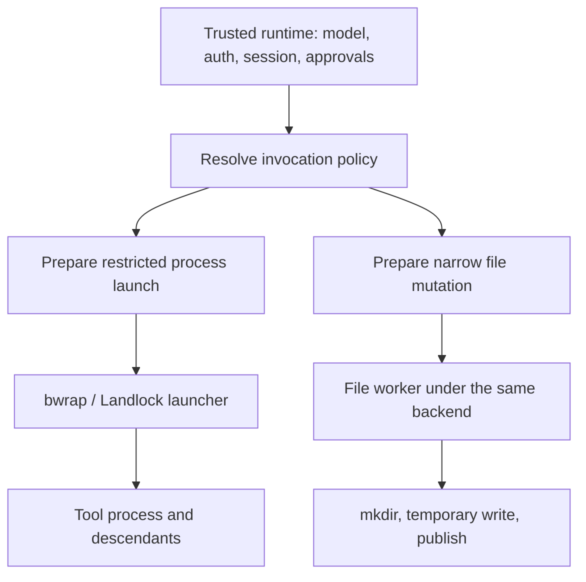

# Tool-execution sandbox: bwrap and Landlock

[English](2026-09-16-tool-execution-sandbox.md) | [简体中文](2026-09-16-tool-execution-sandbox.zh-CN.md)

## Status and decision

Proposed design, 2026-09-16. This architecture is not enabled in the production CLI; the proposed configuration schema and Landlock native helper are not implemented. Call-site inventory was checked at `04721b5dca49e2a100de4d84257a7fa945a698a3`.

The separate [bwrap prototype record](../plans/2026-09-16-bwrap-tool-prototype.md) tracks feasibility experiments using the existing shell service and an isolated file worker. Those developer scripts do not enable this design in the production CLI or satisfy the full release gates below.

The [execution API](2026-09-16-sandbox-execution-api.md) and subsequent [runtime shell integration](2026-09-16-runtime-shell-sandbox.md) track the implemented internal stages. The latter injects trusted policy into a restricted production headless pipeline; it is not a public settings toggle or completion of this release checklist. The [runtime file-tool stage](2026-09-16-runtime-file-sandbox.md) adds Read/Write/Edit under the same policy ceiling.

Move the new Linux sandbox boundary to **untrusted process execution and model-directed file mutations**. Keep authentication, model communication, approvals, and session persistence in the trusted runtime. Implement the boundary with bwrap first; add Landlock as another backend with explicitly different capabilities. Default to automatic backend selection: prefer bwrap, then consider Landlock only when bwrap is unavailable and Landlock meets the required policy. Sharing a policy interface does not mean claiming identical isolation.

This document replaces the implementation direction in the [withdrawn whole-CLI Landlock proposal](2026-09-16-landlock-backend.md) and the [original Linux sandbox design](2026-09-09-linux-kernel-sandbox.md). The target is a direct replacement of whole-CLI bwrap with tool execution, not two supported execution scopes. Remove the old bwrap re-exec path when the replacement passes its release gates; provide neither a compatibility switch nor a fallback to it. The production code still uses the old path until that implementation lands.

## Problem and current behavior

The current CLI resolves `tools.sandbox` / `QWEN_SANDBOX`, then `llm.tsx` calls `start_sandbox` to re-execute the entire CLI. The bwrap backend grants writes needed by both tools and Qwen itself, including runtime state. Network namespace isolation also surrounds model communication. This is useful process-wide containment, but mixes application operation with permissions needed by an individual command.

Simply moving that wrapper to `ShellExecutionService` would leave direct writes and several process launchers unrestricted. It would also give formerly confined hooks and local servers host privileges. The migration therefore needs two final effect boundaries, an explicit inventory, and rejection of unsupported paths before they execute.

The trusted runtime remains a security-sensitive component. This design assumes its installed code and operator configuration are trusted; it does not sandbox arbitrary in-process plugins or defend against an independently malicious same-user host process. Broad filesystem reads remain available. Neither backend provides secret confidentiality, resource quotas, or a guarantee against authority exposed by reachable host services. A local filesystem policy is not a remote-service authorization policy.

## Architecture and ownership



Keep the implementation small: a policy resolver, backend-specific launch preparation, and a one-operation file worker. Reuse existing process supervision and tool permission flow. Do not introduce another agent runtime, daemon, generic plugin framework, or persistent privileged file server.

| Component                     | Responsibility and authority                                                                                                                                            |
| ----------------------------- | ----------------------------------------------------------------------------------------------------------------------------------------------------------------------- |
| Runtime configuration         | Resolve operator policy for the selected runtime/workspace; preserve provenance and policy revision.                                                                    |
| Existing permission flow      | Decide whether the requested tool operation may run; obtain interactive approval when required. Approval is not an automatic sandbox bypass.                            |
| Final effect boundary in core | Require the runtime policy and authorized invocation, validate capability requirements, and produce the exact confined launch or file operation.                        |
| bwrap / Landlock backend      | Enforce its declared kernel capabilities; refuse unsupported policy or failed setup before payload execution.                                                           |
| Existing shell/task lifecycle | Own output, terminal input/resize, cancellation, timeout, background promotion, host process handles, and cleanup.                                                      |
| Trusted state services        | Persist auth, session, history, and narrowly defined application state through fixed-purpose APIs; never accept arbitrary model destination paths as privileged writes. |

Policy belongs to the selected runtime, not a process-global environment variable. Two daemon sessions with different workspaces must not share writable roots or approval receipts. Worktree derivation recomputes admitted roots for that derived runtime; subagent creation and resume retain the parent policy ceiling. A child cannot broaden it through flags, settings, or a restored session snapshot.

## Configuration and migration

Introduce one opt-in, operator-controlled `tools.executionSandbox` setting. Proposed first supported configuration:

```json
{
  "tools": {
    "executionSandbox": {
      "filesystem": "workspace-write",
      "network": "closed"
    }
  }
}
```

Absence of `tools.executionSandbox` disables the new mode. When enabled, `filesystem: read-only | workspace-write` and `network: open | closed` are required; optional `backend` defaults to `auto`. The initial schema accepts `backend: auto | bwrap`, with bwrap as the only implemented candidate. Add `backend: landlock` and the Landlock candidate for `auto` only when its implementation ships; it supports `network: open` in this design. Explicit backend selection pins that backend and never substitutes another. Do not ship a selectable placeholder. These settings describe local tool execution, not all runtime HTTP traffic.

Only system/user settings or a trusted programmatic runtime constructor may establish this policy. System restrictions are a ceiling. Workspace settings, project `.env`, extension configuration, model arguments, and ordinary included-directory discovery cannot weaken it or create writable grants. Apply trust filtering before settings are merged; a post-merge boolean is insufficient. Existing workspace trust and permission checks still apply.

Retire the old native bwrap entry points rather than preserving a second mode. An effective `tools.sandbox: "bwrap"` or `QWEN_SANDBOX=bwrap`, including programmatic or command-line equivalents where accepted, produces a migration error before workspace hooks, discovery, or model-directed execution. Show the explicit `tools.executionSandbox` replacement and explain that authentication/model traffic now remains on the host. Do not silently reinterpret the old setting: its network scope and writable grants are not equivalent. Do not silently ignore it or continue without confinement, even if a new setting is also present.

When tool execution is selected, reject the old `QWEN_SANDBOX_NET` and `QWEN_SANDBOX_PROXY_COMMAND` settings with migration guidance instead of mixing old and new network semantics. `proxied` is deferred: the first new mode neither starts a proxy nor treats proxy environment variables as egress enforcement; `open` may retain ordinary user proxy variables. Reject `proxied` instead of designing a shared proxy lifecycle before it is needed.

Docker/Podman execution environments and macOS Seatbelt require separate adapter/migration work; this Linux native replacement does not remove their implementation or claim that every platform has migrated. They are not compatibility paths for bwrap/Landlock and cannot be automatically combined with or substituted for tool execution. Refuse an active old whole-CLI selection combined with the new setting. An inherited `SANDBOX` marker alone neither establishes confinement nor suppresses the tool policy or migration checks.

Display the requested selector, resolved backend, filesystem policy, command-network scope, and unsupported features from the effective runtime policy. For example, `tools / auto → bwrap / workspace-write / command network: closed`; `tools` describes the boundary, not a choice between two native modes. When automatic selection chooses Landlock, show why bwrap was unavailable and the missing namespace capabilities. Do not set a global `SANDBOX_ENFORCEMENT=full` or let existing “inside sandbox” UI logic infer that the host runtime is confined. Adapt `qwen sandbox` native inspection, verification, and pass-through execution to the tool boundary; preserve argument forwarding, bare-mode behavior, and nonzero failure semantics.

### Linux backend selection

Use one selection policy for command launchers and file workers. Validate the trusted configuration and admitted roots before selecting a backend; an invalid grant or unsupported operation is a rejection, not a reason to try another backend. Under `auto`, probe bwrap first. A missing executable or a confirmed inability to establish its required namespaces makes that candidate unavailable. Then probe Landlock only if its declared capabilities meet the same filesystem and network requirements. Unknown probe failures abort selection rather than being interpreted as permission to continue. If no candidate qualifies, refuse the operation; never disable confinement or restart the whole CLI as a fallback.

| Selection and environment                                      | Result                                                                    |
| -------------------------------------------------------------- | ------------------------------------------------------------------------- |
| `auto`, bwrap available                                        | Use bwrap, whether or not Landlock is available.                          |
| `auto`, bwrap unavailable, Landlock available, `network: open` | Use Landlock with the same admitted roots and filesystem policy.          |
| `auto`, bwrap unavailable, `network: closed`                   | Refuse; the initial Landlock profile cannot meet the network requirement. |
| `auto`, neither backend available                              | Refuse and report the capability failures.                                |
| Explicit `bwrap`, unavailable                                  | Refuse; do not select Landlock.                                           |
| Explicit `landlock`, unavailable or `network: closed`          | Refuse; do not select bwrap or open the network.                          |

Automatic selection preserves the requested policy, not every additional property of bwrap. Landlock does not acquire private PID/proc or mount/device namespaces by being selected automatically. An operator requiring those bwrap-specific properties pins `backend: bwrap`. Never widen writable roots, change `closed` to `open`, lower the Landlock ABI/profile minimum, or bypass protected-root validation to make a candidate usable.

Resolve the backend during trusted runtime initialization or policy revision, before model-directed effects, using fixed trusted probes rather than a user command as a test payload. Bind the result to that runtime and policy revision; command launchers and file workers use it consistently. Each actual launch must still establish confinement. A later setup failure refuses that invocation without switching backends; payload denial, nonzero exit, timeout, or uncertain launch state never triggers reselection or replay. A fresh runtime initialization or policy revision may probe again, but must not resubmit previous operations or alter running/background tasks.

## Invocation policy and approval

The internal immutable execution context records runtime/session/invocation identity, policy revision, execution origin, canonical workspace/cwd, admitted writable roots, protected roots, network requirement, and any narrowly applicable approval. It is host-created data, not a model tool parameter or a claim supplied through environment variables. Prefer an explicit context at final effect APIs; asynchronous context may help propagation but cannot be the sole source of authority.

`CoreToolScheduler` and the separate ACP invocation pipeline use the existing permission flow. Code Mode nested dispatch, internal agents, speculative execution, and public direct invocation helpers must also reach the final boundary. If the runtime requires confinement and a caller lacks a valid context, refuse; do not use missing context to select unrestricted execution. Speculative work never prompts for expanded authority and uses the read-only policy.

Approval order is: determine the final operation, apply permitted hook transformations, evaluate tool permission and sandbox scope, then bind authorization to the final arguments/content, cwd, runtime, policy revision, and requested additional capability. Changing any bound field invalidates authorization. A project hook cannot rewrite an approved command into a different one after this point.

The first bwrap slice supports fixed operator policy only. An ordinary “allow”, `AUTO_EDIT`, or `YOLO` does not grant additional filesystem/network rights. Out-of-policy operations fail with actionable diagnostics. A later slice may offer a separate, explicit approval for one additional directory or changing this invocation's command network from `closed` to `open`, subject to the operator ceiling. Show directory-level authority honestly; atomic file replacement cannot be described as granting only one filename when the backend needs its parent directory. Never grant that file-worker exception to arbitrary shell commands.

No approval is a generic `unsandboxed: true` escape. Unsupported approval clients and headless runs return denial. A syscall failure can occur after partial command effects, so never automatically replay a failed command, even after approval. A newly authorized invocation is an explicit new operation with possible previous effects disclosed.

## Filesystem contract

### Writable roots and protected state

`read-only` denies workspace mutations but permits a private scratch directory and required standard devices. `workspace-write` additionally permits the selected workspace and explicitly admitted roots. Reads and execution remain broad. Do not advertise either profile as preventing secret reads or as making every host filesystem operation immutable.

Preserve canonical `HOME`/ancestor rejection and sanitized, validated Git worktree/common-directory discovery. Source roots from the selected runtime and trusted enrollment, not raw `context.includeDirectories`. Additional Git metadata grants are admitted only for `workspace-write`; read-only commands must use non-locking Git behavior or receive a denial. Git configuration, hooks, filters, and external helpers execute under the same command boundary.

Do not automatically grant the global Qwen directory, runtime state, all of host `/tmp`, package-manager caches, or the installation. Allocate private scratch per execution; explicitly admitted cache directories are optional operator grants and pass the same validation. Set `TMPDIR`, `TMP`, and `TEMP` consistently. Programs hard-coding an unavailable temporary/cache path receive a denial; do not retry with broader roots.

Protect operator configuration, credentials, runtime control files, and launcher/worker installation paths from tool writes. Initially reject any writable grant overlapping these protected trees in either direction; this common rule avoids depending on subtractive policies unavailable to the Landlock profile. This includes custom `QWEN_HOME` beneath a workspace and a development checkout containing the trusted worker installation. Do not make an implicit exception for an apparent state subdirectory. Normal project `.qwen` content is not automatically the operator's global Qwen directory; provenance determines which tree is protected.

Do not hot-reload operator authority, executable hooks, or runtime code from tool-writable content. Workspace settings may still provide data under existing workspace trust rules, but cannot authorize host execution or widen sandbox policy. Kernel restrictions protect operations at use time; canonical path checks alone are not an anti-race guarantee. Pre-existing hard-link aliases and independent host mutation remain limitations requiring explicit tests and honest reporting, not an inode-wide immutability promise.

### Built-in file mutations

Run a small, installed file worker under the selected backend for final `write_file`, `edit`, `notebook_edit`, and binary `image_gen` writes. Parent directory creation, temporary-file creation, final freshness checks, replacement/rename, and any permitted fallback must all occur inside it. The parent may compute edits, previews, encoding, and permissions, but it must not open the destination for writing before confinement or perform a denied fallback afterward.

Use one bounded request/response over pipes per worker invocation. The request contains a fixed operation, destination, content bytes or bounded byte stream, and expected previous state; it is not JavaScript, a shell fragment, an arbitrary callback, or a serialized `Config`. The worker has no ability to call a privileged host write service. Validate the protocol and preserve existing BOM/EOL, encoding, read-before-write, and stale-content behavior. Check expected content inside the worker before publication; retain existing concurrency limitations rather than claim this makes simultaneous edits transactional.

Disable the shell `sed -i` host fast path in the first slice so it executes the actual confined command. It can later use the same file worker if equivalent behavior is demonstrated. Existing `FileSystemService` is also used for trusted runtime state; do not globally replace every write through that service with the tool policy.

History and memory need domain-specific treatment. History records go to runtime-derived backup paths. Private auto-memory writes use a fixed-purpose state API with a separately confined worker. Its host-created state profile admits only the selected memory subtree, including when it is below the protected runtime tree; this is an explicit exception for that state API, not an exception in the ordinary tool-root resolver. The caller cannot choose an arbitrary destination or operation, and shell never inherits this grant. The current `write_file` special allowance for auto-memory must map to a validated memory operation or be rejected. Plan, todo, team, and artifact metadata may use similarly fixed-purpose state APIs. Model-selectable artifact output paths and generated images still use the ordinary file boundary.

## Execution surface inventory

This table is a release checklist, not evidence of completed integration. An unsupported model execution surface is disabled/rejected before registration or execution in the new mode. It must not quietly become a host operation.

| Current surface and source                                                                                                                                              | Required treatment                                                                                                                                                                                                                                                                                                                                                                                         |
| ----------------------------------------------------------------------------------------------------------------------------------------------------------------------- | ---------------------------------------------------------------------------------------------------------------------------------------------------------------------------------------------------------------------------------------------------------------------------------------------------------------------------------------------------------------------------------------------------------- |
| Foreground/background shell and Git diff analysis: `packages/core/src/tools/shell.ts`; launch: `services/shellExecutionService.ts`                                      | Shared confined launch plan for PTY and pipes. Confine direct Git attribution subprocesses too; Git can execute repository-controlled helpers.                                                                                                                                                                                                                                                             |
| `tools/monitor.ts`                                                                                                                                                      | Replace its independent shell spawn with the same launch preparation; preserve task lifetime outside the current turn.                                                                                                                                                                                                                                                                                     |
| Built-in edits: `tools/write-file.ts`, `edit.ts`, `notebook-edit.ts`, `image-gen.ts`; shell sed shortcut                                                                | Confined file worker; include mkdir and binary output. Disable sed shortcut initially.                                                                                                                                                                                                                                                                                                                     |
| Prompt injection shell: `packages/cli/src/services/prompt-processors/shellProcessor.ts`; Ink/OpenTUI `!` shell; `packages/acp-bridge/src/bridge.ts` session shell       | Apply selected runtime policy, including effective cwd changes. User-entered commands do not automatically bypass it.                                                                                                                                                                                                                                                                                      |
| Web terminal: `services/web-terminal-registry.ts`                                                                                                                       | Disable for a runtime using the new mode until its PTY path supports the same contract; do not expose an ambiguously unrestricted terminal.                                                                                                                                                                                                                                                                |
| Discovered tools: `tools/tool-registry.ts` discovery and invocation spawns                                                                                              | Confine both configuration-selected discovery and model-parameterized calls, or disable the feature in that runtime.                                                                                                                                                                                                                                                                                       |
| Command hooks: `hooks/hookRunner.ts`, including background supervisors                                                                                                  | Confine before launch under the owning runtime policy; initially disable unsupported hook variants. No implicit host privilege based merely on user-config provenance. Runtime-only trusted built-ins require an audited, narrow implementation.                                                                                                                                                           |
| Local MCP: `tools/mcp-client.ts`, `mcp-tool.ts`                                                                                                                         | Constrain the server at startup for its whole lifetime. Do not reuse a pre-existing unrestricted server or share one across unequal policies. Until transport startup is integrated, reject local stdio servers in this mode.                                                                                                                                                                              |
| Remote MCP, HTTP/model hooks, and built-in web/model requests                                                                                                           | External authority domain. Preserve their own permission controls and label them external; local command `closed` does not claim to block them. Local filesystem confinement does not constrain their remote side effects.                                                                                                                                                                                 |
| ACP filesystem delegation: `packages/cli/src/acp-integration/service/filesystem.ts`; serve `bridge-file-system-adapter.ts`                                              | Initial new mode rejects delegated file-write adapters unless they implement the concrete confinement contract. Do not silently bypass editor semantics by writing locally, and do not accept `toolWriteOrigin` as sandbox authorization.                                                                                                                                                                  |
| Code Mode: `tools/exec.ts`, `code-mode/host-client.ts`; workflow: `agents/runtime/workflow-sandbox.ts`                                                                  | Nested tool dispatch inherits policy. VM/QuickJS isolation is not the OS boundary. Fixed runtime host startup must not load arbitrary tool-selected host code.                                                                                                                                                                                                                                             |
| Internal agents: `tools/agent/agent.ts`; worktree setup: `services/gitWorktreeService.ts`; external agents: `packages/cli/src/external-agents/acp-subagent-executor.ts` | Internal derived/resumed Config preserves the ceiling. Worktree provisioning/cleanup, Git, and symlink setup are effects before/after agent execution, not trusted session metadata. Initially reject `isolation=worktree` and analogous workflow worktree creation until these paths use the boundary. External executable agents remain disabled until their startup and delegated effects can honor it. |
| `followup/speculation.ts`, `tools/tools.ts` direct execution helpers                                                                                                    | Final effects still require policy; scheduler bypass cannot become sandbox bypass.                                                                                                                                                                                                                                                                                                                         |
| Trusted auth/session/history state; daemon workspace HTTP routes                                                                                                        | Keep existing ownership and authorization boundaries. Reuse selected-runtime routing, but do not treat the HTTP route's path checks as proof of kernel confinement for a tool write.                                                                                                                                                                                                                       |

First usable bwrap delivery covers built-in shell/file tools, monitor, all listed session shell entry points, nested internal dispatch, and trusted state operations. It explicitly disables local MCP, discovered tools, executable hooks, external agents, automatic worktree provisioning, unsupported in-process tool extensions, delegated writes, and web terminals until each is integrated. Operator-prepared worktrees can be enrolled as separate runtimes after root validation. Report those compatibility restrictions at startup. Review all registered tools and effect-producing helpers against this inventory before enabling the mode; unknown adapters default to unsupported, not unrestricted.

## bwrap backend

Extract reusable root validation and argument preparation from CLI `serve/sandbox.ts` into core modules; core must not import CLI. The new path wraps the executable/argv of the actual command or file worker, not another Qwen CLI invocation. In the same delivery, remove the whole-CLI bwrap branch in startup and the launcher, its global-state grants, re-entry handling, and obsolete bwrap-specific UI. Keep code shared by unrelated backends only where those callers still need it. Port useful enforcement tests to the new boundary; delete tests whose only purpose was to require the retired CLI hop or host PID namespace inside tool processes.

Use a read-only root view, writable binds for admitted roots, a minimal `/dev`, private scratch, and **a private PID namespace with a fresh `/proc`** for the new mode. The trusted runtime and its writer lease remain outside. Sharing host procfs would expose paths such as `/proc/<host-pid>/root` to the host outside the mount view, so do not carry forward the legacy PID decision. Refuse grants exposing host procfs aliases; test namespace identity and the concrete access paths. If the required namespaces are unavailable, fail before payload execution.

`network: closed` uses an isolated network namespace for tool processes. It blocks ordinary host/external IP networking, including inherited-network-descriptor bypasses by excluding those descriptors. It does not mean the host model transport is offline, nor promise that readable pathname Unix sockets cannot delegate work to a host service. IPC isolation, comprehensive syscall filtering, and host-service confinement remain separate capabilities; avoid a “no communication” label.

Preserve the existing output/task lifecycle rather than copying `runBwrap` per call: its global stdin handling, signal listeners, and proxy ownership are inappropriate for parallel tools. Record the host-visible wrapper/process-group handle, not the child namespace's PID. Verify signal forwarding, PTY input/resize, exit status, timeout, and descendant cleanup on real Linux before enabling the backend.

PTY fallback may change the transport, never the launch plan. Once confinement preparation fails, no fallback may spawn the original command on the host. Distinguish failure before payload start from an ordinary payload failure; do not rely on exit status alone. Background promotion retains the original sandbox and scratch directory until the task actually terminates. A turn cancellation does not destroy a successfully promoted task's resources. Stronger cleanup guarantees for detached descendants require evidence, not assumptions from a successful group kill.

The [internal execution API stage](2026-09-16-sandbox-execution-api.md) implements structured launch, a Node relay with an independent bwrap status FD, and a bounded stdin file worker. PTY cannot pass an extra FD directly; the relay stores final evidence in a protected regular file. bwrap `child-pid` is not readiness; missing final exec evidence remains unconfirmed, never proof that a command did not run. This stage does not enable the mode or retire the old launcher.

## Landlock backend

Landlock uses the same launch and file-worker contracts without requiring mount/user namespaces. A kernel may support Landlock even when bwrap namespace creation is unavailable. The `auto` selector must establish that capability through probing and policy matching before selecting it; explicit `landlock` uses the same checks. Initial targets are Linux x64 and arm64.

### Capability contract

| Capability                                                                  | New bwrap mode                                                | Proposed Landlock `fs-v1`                              |
| --------------------------------------------------------------------------- | ------------------------------------------------------------- | ------------------------------------------------------ |
| Restrict regular-file write/truncate/create/remove/rename to admitted roots | Yes, using mount policy                                       | Yes, using required filesystem rights                  |
| Read-only mount semantics and protected submounts                           | Available; common policy still rejects protected-root overlap | Not provided; overlapping protected roots are rejected |
| Private PID/proc and minimal device namespace                               | Required                                                      | Not provided                                           |
| Command IP network `closed`                                                 | Network namespace                                             | Unsupported; refuse                                    |
| Network `open`                                                              | Shared host network                                           | Shared host network                                    |
| Device ioctl, all metadata changes, Unix IPC, resource quotas, secret reads | No general combined guarantee                                 | No general combined guarantee                          |

Choose **ABI >= 3** for the initial fixed filesystem profile. Handle the ABI-1 filesystem rights plus `REFER` and `TRUNCATE`; reject ABI 1–2. This revises the withdrawn proposal's ABI-5 minimum: the new promise is filesystem mutation control, not device-ioctl isolation. Do not advertise that omitted capability on newer kernels either. Adding a stronger profile requires its own review and tests. `TRUNCATE` is necessary because write permission alone does not cover all truncation operations. [Filesystem ABI reference](https://man7.org/linux/man-pages/man7/landlock.7.html)

Grant `/` only read/list/execute. Writable directories allow ordinary file/directory changes, symlinks, FIFOs, sockets, and cross-directory operations; never grant block/character device creation. Add only necessary ordinary I/O device exceptions such as `/dev/null` and tested terminal paths. No blanket writable `/dev`. Do not treat global device visibility or an unhandled ioctl as device isolation. Initial network/scoping fields are zero; this profile rejects `closed`, even on kernels exposing newer networking controls.

Within a ruleset, a child read-only rule cannot revoke a writable parent grant. Keep the common protected-root overlap rejection, including symlink aliases, rather than translate bwrap overlays into additive rules. Resolve and type-check rule objects through `O_PATH | O_CLOEXEC` descriptors. Missing required roots and failed rule installation abort the launch. [Rule API](https://man7.org/linux/man-pages/man2/landlock_add_rule.2.html)

### Native helper and packaging

Ship a small reviewed helper and its source, resolved by an absolute installed path, never a workspace/PATH executable named `landlock`. Use a fixed `fs-v1` policy and a bounded launch/probe protocol; do not accept arbitrary syscall masks or unchecked roots from model parameters.

Probe in a separate process: query ABI, install the actual required rights with `no_new_privs`, then report a versioned capability result. Actual launches repeat installation with the invocation's roots before executing the payload. Apply confinement in a fresh single-threaded helper, not one Node thread in the trusted runtime. [Enforcement API](https://man7.org/linux/man-pages/man2/landlock_restrict_self.2.html)

Differentiate helper/setup diagnostics from payload status via a dedicated bounded status channel, closed on successful exec. PTY payload I/O does not carry this control channel. Descriptor plumbing must work in both launch transports; if the PTY adapter cannot support it, initially refuse that combination rather than infer launch success from a magic exit code. Close rule/control descriptors before payload execution; expose only approved stdio/data pipes and terminal descriptors. Files opened before enforcement can retain authority, so never pass a host-opened arbitrary writable file or connected socket as an implementation shortcut. [Kernel descriptor semantics](https://docs.kernel.org/userspace-api/landlock.html#rights-associated-with-file-descriptors)

Build pinned reproducible x64/arm64 assets, record source/toolchain hashes and licenses, and verify executable mode plus inclusion in npm, bundle, and standalone distributions. No runtime download or end-user compilation. Missing/wrong-architecture/noexec assets, disabled Landlock, blocked syscalls, malformed protocol, and grant failures all refuse execution. Probe success is not a replacement for checking each actual launch.

## Environment, lifetime, and diagnostics

Sanitize all subprocess environments after applying configured overrides. Always strip Qwen internal tokens and private parent capabilities. Also exclude runtime loader injection variables from the native/file-worker bootstrap; intentional tool environment variables are applied only to the confined payload. A worker must not load workspace code via `NODE_OPTIONS`, preload paths, cwd-dependent imports, or a mutable executable selection.

The existing `sanitizeChildEnv` deliberately preserves third-party credentials such as `GH_TOKEN`, `AWS_*`, and `NPM_TOKEN`. Retain that compatibility for ordinary commands initially and disclose it alongside broad file reads; keeping model transport on the host does not itself guarantee credential secrecy. A separate credential-minimization/read policy is future work.

Own scratch directories by execution/task identity, outside protected state and inside an operator-created private parent. Do not reuse them across sessions. Terminated tasks release resources; promoted tasks keep them. Before deleting after uncertain cleanup, verify termination or retain/quarantine the directory for later cleanup, without claiming all descendants were killed. Never attach a new policy to a running process and pretend it changed existing authority.

Use distinct results for unsupported policy/backend, launch failure, preflight policy denial, payload failure, cancellation, and file conflict. An `EACCES`/`EROFS` inside an arbitrary program is evidence of an access error, not proof of which security layer denied it. Report effective policy and known denied scope without guessing from every nonzero exit or stderr string. Do not serialize credentials into diagnostics or approval receipts.

## Implementation slices and affected areas

| Slice                                        | Deliverable and completion gate                                                                                                                                                                                                                                                                                                                            |
| -------------------------------------------- | ---------------------------------------------------------------------------------------------------------------------------------------------------------------------------------------------------------------------------------------------------------------------------------------------------------------------------------------------------------- |
| 1. bwrap boundary                            | Core policy/launch preparation, file worker, operator-only opt-in config with `auto` defaulting to the sole bwrap candidate, required built-in call sites, disabled unsupported adapters, runtime UI, and retirement of the old bwrap CLI hop with explicit configuration migration errors. Real Linux evidence for every required surface before release. |
| 2. Landlock feasibility and backend          | Prototype ABI-3 profile and PTY/control protocol first; then reviewed helper/assets, same call sites, capability diagnostics, real minimum-ABI tests, and policy-preserving automatic selection after bwrap is unavailable. Never use TypeScript mocks as kernel evidence.                                                                                 |
| 3. Optional integrations and scoped approval | Integrate local servers/hooks/delegated adapters individually; add exact-operation scope expansion only with supported approval clients and policy-isolated lifetimes. No automatic migration of existing users.                                                                                                                                           |

Expected edits span core configuration/permissions, shell execution and tool implementations; CLI settings, startup, diagnostics, ACP handling, both terminal UIs; ACP bridge session-shell plumbing; and helper packaging/integration tests. Include the bounded `auto` selection defined above, keeping implementation slices reviewable and maintainer-led. Do not combine this with a wholesale scheduler or daemon refactor or changes to Docker/Podman/Seatbelt.

## Verification and acceptance criteria

This is a proposed validation plan, not a test report. Before implementation, turn it into executable E2E cases and establish the baseline against the global CLI. Existing whole-CLI bwrap Linux coverage supplies baseline evidence and reusable safety cases; migrate it to tool execution rather than retain a shipped whole-CLI mode just to keep its old expectations green.

1. **Runtime separation:** a no-credential fake-model turn uses host model transport and persists a session while its command has closed IP networking. Authentication/state services keep functioning without tool-write access to their directories.
2. **All effects:** shell, PTY/pipes, background tasks, monitor, file/edit/notebook/image output, actual sed, both `!` shells, prompt injection, ACP session shell, nested Code Mode, subagents, speculation, and direct helpers obey policy or explicitly reject before any payload marker. Unsupported adapters cannot register or execute an unrestricted operation.
3. **Filesystem evidence:** allowed changes succeed; proven host-writable sibling files retain bytes and directory entries after denied write, truncate, mkdir, unlink, rename, hard-link relocation, and symlink-redirection attempts. Cover absent targets, worker mkdir, atomic-write fallback, encoding/BOM, and stale-content rejection. Include a controlled symlink-swap stress case without calling it a proof of all races.
4. **Protected inputs:** present/absent global configuration, overlapping Qwen/installation roots, forged Git metadata, injected Git environment, worker preload injection, and writable descriptor inheritance cannot widen authority. Test pre-existing hard-link aliases separately and report residual limits instead of asserting inode-wide protection.
5. **Policy ownership:** two daemon sessions with unequal roots, derived worktrees, resumed agents, changed cwd, and changed policy revisions never exchange grants. Missing context, workspace configuration, approval mode, and stale receipts do not disable the boundary.
6. **Process semantics:** actual namespace identities, inaccessible host procfs paths, PTY input/resize, output limits/binary output, exit signals, timeout, Ctrl+C, background promotion, parent death, and cleanup are exercised. Force PTY initialization and confinement setup failures to verify that neither executes an unconfined payload.
7. **Capabilities and selection:** verify every selection-table row, including omitted `backend` behaving as `auto`, explicit backend pins, and bwrap preference when both are available. In a disposable environment where bwrap namespaces are denied but Landlock is usable, `auto` with `open` selects Landlock and preserves the file-policy checks; `closed` refuses without payload effects. Landlock ABI 1–2, disabled LSM, blocked syscalls, failed rule creation, and bad assets cannot qualify it. Invalid roots, unknown probe failures, and actual launch failures must not trigger another backend; a payload that writes a marker then fails must never be replayed. Verify command and file-worker backend consistency and selection diagnostics. Run actual ABI 3 and a newer kernel, plus x64/arm64 packaging.
8. **Approval/integrations, when added:** expansion shows exact directory/network scope, cannot be reused for a different operation, never triggers automatic replay, and fails in clients without approval support. MCP processes cannot cross policy owners; delegated writes cannot use `toolWriteOrigin` as a bypass.
9. **Migration, regression, and negative controls:** old bwrap selectors and obsolete network settings produce the documented migration errors, including when new settings or an inherited marker are present. Neither setup failure nor an unsupported operation invokes the retired CLI hop or an unconfined payload. Preserve relevant Git-root/configuration protections, CLI forwarding, unrelated backends, and disabled-mode coverage; update grants and namespace assertions to the new contract. A no-confinement control must fail the disposable outside-write assertions. Missing Linux prerequisites must fail the dedicated enforcement job, not skip green.

## Remaining feasibility questions and release risks

The architecture decision is settled for this proposal; the following are implementation gates: reliable host PID supervision with the new bwrap PID namespace; a status channel compatible with the PTY adapter; the smallest necessary Landlock device grants; and packaging a worker outside writable development roots. Investigate these before broad integration, and revise both language versions if evidence changes a decision.

Primary compatibility costs are the explicit configuration migration required by retiring whole-CLI bwrap, disabled integrations during migration, private scratch/cache restrictions, protected-root overlap rejection, and changed bwrap process topology. Document this breaking change in release notes. Only ship the replacement after its required surfaces pass, rather than use the old mode as a permanent escape path. ABI 3 broadens potential Landlock deployment relative to the withdrawn ABI-5 proposal, but actual kernel enablement and security policy still determine availability. Do not promise usage coverage without measurements.

The release claim is precise: the listed supported local effects use the selected kernel boundary and unsupported effects fail explicitly. It is not whole-host isolation, secret confinement, universal network denial, or evidence that Landlock and bwrap offer identical protection.
