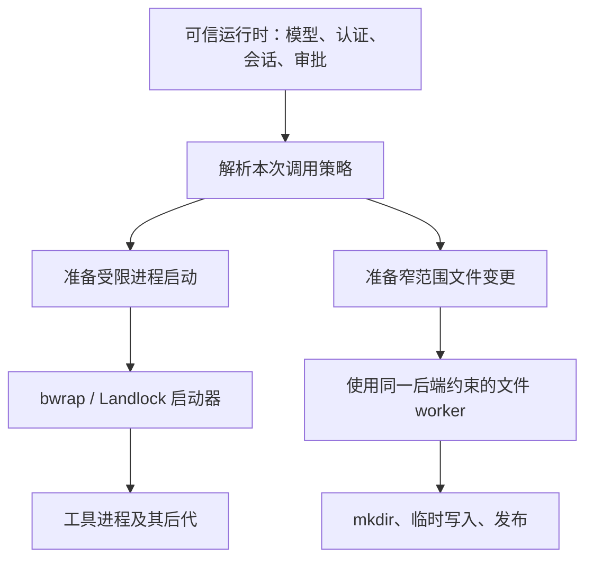

# 工具执行沙箱：bwrap 与 Landlock

[English](2026-09-16-tool-execution-sandbox.md) | [简体中文](2026-09-16-tool-execution-sandbox.zh-CN.md)

## 状态与决策

架构于 2026-09-16 确定；bwrap 已在 2026-09-17 的[公开接入阶段](2026-09-16-bwrap-public-integration.zh-CN.md)实现。该阶段定义已交付范围与验收证据：向普通 headless CLI 和两套终端 UI 暴露 `tools.executionSandbox`，并删除整 CLI bwrap。ACP/serve、不支持的适配器、权限扩展和 Landlock 继续后置。下文 Landlock profile 与扩展验收目标描述后续工作，不代表当前可用行为。最初调用入口清单的核对基线为 `04721b5dca49e2a100de4d84257a7fa945a698a3`。

独立的 [bwrap 原型记录](../plans/2026-09-16-bwrap-tool-prototype.zh-CN.md)跟踪基于现有 shell 服务与受限文件 worker 的可行性实验。这些实验早于公开接入，保留为补充回归测试。

[执行 API](2026-09-16-sandbox-execution-api.zh-CN.md)和后续 [runtime Shell 接入](2026-09-16-runtime-shell-sandbox.zh-CN.md)记录已实现的内部阶段。后者在加入公开配置开关之前，先将可信策略注入受限的生产 headless 链路。[runtime 文件工具阶段](2026-09-16-runtime-file-sandbox.zh-CN.md)在同一策略上限下加入 Read/Write/Edit。

新的 Linux 沙箱边界放在**不可信进程执行和模型驱动的文件变更**处。认证、模型通信、审批和会话持久化留在可信运行时。先用 bwrap 实现边界，再接入能力有明确差异的 Landlock 后端。默认自动选择后端：优先 bwrap，只有 bwrap 不可用且 Landlock 满足所需策略时，才考虑 Landlock。共用策略接口不代表承诺相同的隔离能力。

本文替代[已撤回的整 CLI Landlock 提案](2026-09-16-landlock-backend.zh-CN.md)及[原 Linux 沙箱设计](2026-09-09-linux-kernel-sandbox.zh-CN.md)的实施方向。目标是用工具执行直接替换整 CLI bwrap，不支持两种执行范围并存。新实现通过发布门槛时删除旧 bwrap re-exec 路径，不提供兼容开关，也不回退到它。公开接入现已删除旧路径，并对旧选择方式返回明确的迁移错误。

## 问题与原有行为

本次迁移之前，CLI 解析 `tools.sandbox` / `QWEN_SANDBOX`，然后由 `llm.tsx` 调用 `start_sandbox`，重新执行整个 CLI。bwrap 后端同时授予工具与 Qwen 自身所需的写权限，包括运行时状态。网络 namespace 也包住了模型通信。这种进程整体约束有其价值，但把应用自身运行与单条命令的权限混在了一起。

如果只把这一层包装移到 `ShellExecutionService`，直接文件写入和多个进程启动入口仍不受约束，原先处于沙箱中的 hooks 和本地服务还会获得宿主权限。因此迁移需要两个最终副作用边界、明确的入口清单，以及在执行前拒绝不受支持路径的机制。

可信运行时仍是安全敏感组件。本设计假设其安装代码和操作者配置可信；不隔离任意进程内插件，也不抵御独立的同用户恶意宿主进程。文件系统读取仍然宽泛开放。两个后端都不提供秘密保密性、资源配额，或针对可达宿主服务所暴露权限的完整防护。本地文件系统策略不是远程服务授权策略。

## 架构与归属



实现保持精简：一个策略解析器、各后端的启动准备，以及每次处理一个操作的文件 worker。复用现有进程管理和工具权限流程，不引入另一套 agent runtime、daemon、通用插件框架或常驻特权文件服务。

| 组件                     | 职责与权限                                                                                    |
| ------------------------ | --------------------------------------------------------------------------------------------- |
| 运行时配置               | 为选中的 runtime/workspace 解析操作者策略，保留来源与策略版本。                               |
| 现有权限流程             | 决定工具操作能否运行，必要时取得交互审批；审批不自动绕过沙箱。                                |
| core 中的最终副作用边界  | 要求提供运行时策略与已授权调用，校验能力需求，生成具体受限启动或文件操作。                    |
| bwrap / Landlock 后端    | 执行声明的内核约束；不支持的策略或设置失败必须在 payload 执行前拒绝。                         |
| 现有 shell/task 生命周期 | 管理输出、终端输入/resize、取消、超时、后台晋升、宿主进程句柄与清理。                         |
| 可信状态服务             | 通过固定用途 API 持久化认证、会话、历史和窄范围应用状态；绝不把任意模型目标路径当作特权写入。 |

策略属于选中的运行时，不属于进程全局环境变量。daemon 中两个工作区不同的会话不能共享可写根或审批凭据。派生 worktree 时，为派生 runtime 重新计算准入根；子代理创建和恢复保留父策略上限。子代理不能通过 flags、设置或恢复的会话快照扩大权限。

## 配置与迁移

已实现的首阶段提供显式启用、由操作者控制的 `tools.executionSandbox` 设置：

```json
{
  "tools": {
    "executionSandbox": {
      "filesystem": "workspace-write",
      "network": "closed"
    }
  }
}
```

缺少 `tools.executionSandbox` 表示关闭新模式。启用时，`filesystem: read-only | workspace-write` 和 `network: open | closed` 必填；`backend` 可选，默认为 `auto`。初始 schema 接受 `backend: auto | bwrap`，bwrap 是唯一已实现的候选。只有 Landlock 实现交付时才增加 `backend: landlock` 并将 Landlock 加入 `auto` 的候选；本设计中它支持 `network: open`。显式指定后端时固定使用该后端，不替换成其他后端。不发布可选但未实现的占位后端。这些设置描述本地工具执行，不代表全部运行时 HTTP 流量。

只有 system/user 设置或可信的编程式 runtime 构造入口能够建立策略。系统限制构成上限。工作区设置、项目 `.env`、扩展配置、模型参数和普通附加目录发现都不能放宽策略或生成可写授权。在设置合并前按可信来源过滤，不能只检查合并后的布尔值。已有工作区信任和权限检查继续生效。

退役旧原生 bwrap 入口，不保留第二种模式。有效的 `tools.sandbox: "bwrap"` 或 `QWEN_SANDBOX=bwrap`，以及入口支持的等价编程式/命令行选择，都必须在工作区 hooks、discovery 或模型驱动执行之前返回迁移错误。展示明确的 `tools.executionSandbox` 替代配置，并说明认证/模型流量现在留在宿主。旧设置的网络范围和可写授权与新模式不等价，不能静默重新解释；也不能静默忽略或无约束继续，即使同时存在新设置也如此。

选择工具执行时，对旧 `QWEN_SANDBOX_NET`、`QWEN_SANDBOX_PROXY_COMMAND` 返回带迁移指引的拒绝，不混合新旧网络语义。暂不支持 `proxied`：首版新模式不启动代理，也不把代理环境变量当作出口强制约束；`open` 可以保留普通用户代理变量。对 `proxied` 明确拒绝，不提前设计尚不需要的共享代理生命周期。

Docker/Podman 执行环境和 macOS Seatbelt 需要单独的适配/迁移工作；本次 Linux 原生替换不删除它们的实现，也不声称所有平台已经迁移。它们不是 bwrap/Landlock 的兼容路径，不能自动与工具执行组合或替代它。旧整 CLI 选择与新设置同时有效时拒绝。仅继承的 `SANDBOX` 标记既不能证明约束成立，也不能跳过工具策略或迁移检查。

根据有效运行时策略显示请求的选择方式、最终后端、文件系统策略、命令网络范围和不支持的能力。例如 `tools / auto → bwrap / workspace-write / command network: closed`；其中 `tools` 描述约束边界，不代表可以在两种原生模式间切换。自动选择 Landlock 时，展示 bwrap 不可用的原因及缺少的 namespace 能力。不设置全局 `SANDBOX_ENFORCEMENT=full`，也不让旧的“已处于沙箱内”UI 逻辑推断宿主运行时受限。调整 `qwen sandbox` 的原生检查、验证和透传执行，使其使用工具边界；保留参数转发、bare-mode 行为与失败非零退出语义。

### Linux 后端选择

命令启动器和文件 worker 共用一套选择策略。选择后端前先校验可信配置与准入根；非法授权或不支持的操作应直接拒绝，不能成为尝试另一后端的理由。`auto` 先探测 bwrap。可执行文件缺失或确认无法建立其必需 namespace 时，判定该候选不可用。随后仅在 Landlock 声明的能力能够满足同一文件系统和网络要求时探测它。未知探测错误中止选择，不能解释为继续执行的许可。没有合格候选时拒绝操作；绝不关闭约束或回退到重新启动整个 CLI。

| 选择方式与环境                                       | 结果                                            |
| ---------------------------------------------------- | ----------------------------------------------- |
| `auto`，bwrap 可用                                   | 使用 bwrap，无论 Landlock 是否可用。            |
| `auto`，bwrap 不可用、Landlock 可用、`network: open` | 使用 Landlock，保持相同的准入根和文件系统策略。 |
| `auto`，bwrap 不可用、`network: closed`              | 拒绝；首版 Landlock profile 无法满足网络要求。  |
| `auto`，两个后端都不可用                             | 拒绝并报告能力探测失败原因。                    |
| 显式 `bwrap`，不可用                                 | 拒绝，不选择 Landlock。                         |
| 显式 `landlock`，不可用或 `network: closed`          | 拒绝，不选择 bwrap，也不放开网络。              |

自动选择保留用户要求的策略，不承诺保留 bwrap 的每项额外属性。Landlock 不会因为被自动选中就获得私有 PID/proc 或 mount/device namespace。操作者若要求这些 bwrap 专有属性，应固定 `backend: bwrap`。不能为使候选可用而扩大可写根、把 `closed` 改成 `open`、降低 Landlock ABI/profile 下限，或绕过受保护根校验。

在可信 runtime 初始化或策略版本变更时、任何模型驱动副作用发生前解析后端，使用固定可信探测，不能拿用户命令当测试 payload。结果绑定到该 runtime 和策略版本，命令启动器与文件 worker 一致使用。每次实际启动仍须成功建立约束。后续设置失败时拒绝该调用，不切换后端；payload 拒绝、非零退出、超时或启动状态不确定都不能触发重新选择或重放。新的 runtime 初始化或策略版本变更可以重新探测，但不能重新提交此前操作，也不能改变运行中/后台任务。

## 调用策略与审批

内部不可变执行上下文记录 runtime/session/invocation 身份、策略版本、执行来源、规范化的 workspace/cwd、准入可写根、受保护根、网络要求，以及窄范围适用审批。这些数据由宿主创建，不是模型工具参数或通过环境变量传入的自证声明。最终副作用 API 优先显式接收上下文；异步上下文可辅助传递，但不能成为唯一授权来源。

`CoreToolScheduler` 和独立 ACP 调用流水线使用已有权限流程。Code Mode 嵌套调度、内部 agents、推测执行和公开直接调用 helper 也必须经过最终边界。运行时要求约束而调用者缺少有效上下文时，直接拒绝，不能因为上下文缺失就选择无限制执行。推测执行不请求扩大权限，并使用只读策略。

审批顺序为：确定最终操作，应用允许的 hook 变换，评估工具权限与沙箱范围，然后把授权绑定到最终参数/内容、cwd、runtime、策略版本和请求的额外能力。任何被绑定字段变化都会使授权失效。项目 hook 不能在此之后把已批准命令改写成其他命令。

首个 bwrap 交付阶段只支持固定操作者策略。普通“允许”、`AUTO_EDIT` 或 `YOLO` 不授予额外文件系统/网络权限。越界操作返回可操作的诊断。后续阶段可以在操作者上限内，单独明确审批一个额外目录，或把本次调用的命令网络从 `closed` 改为 `open`。如实展示目录级权限：后端执行原子文件替换需要父目录权限时，不能描述成只授予一个文件名。该文件 worker 例外绝不能授予任意 shell 命令。

任何审批都不是通用 `unsandboxed: true` 逃生开关。不支持审批的客户端和 headless 运行返回拒绝。系统调用失败前可能已经产生部分命令副作用，所以即使取得审批，也不能自动重放失败命令。新授权调用是明确的新操作，需披露之前可能已经产生的影响。

## 文件系统契约

### 可写根与受保护状态

`read-only` 拒绝工作区变更，但允许私有临时目录和必要标准设备。`workspace-write` 额外允许选中的工作区与明确准入根。读取和执行保持宽泛开放。不把任一 profile 宣称为秘密读取保护，也不声称宿主的所有文件系统操作都不可变。

保留规范化 `HOME`/祖先路径拒绝，以及经过环境清理和校验的 Git worktree/common-directory 发现。根目录来自选中的 runtime 和可信准入，而非原始 `context.includeDirectories`。额外 Git 元数据授权仅在 `workspace-write` 下准入；只读命令应使用不加锁的 Git 行为，否则接受拒绝。Git 配置、hooks、filters 和外部 helper 在同一命令边界内执行。

不自动授予全局 Qwen 目录、运行时状态、整个宿主 `/tmp`、包管理器缓存或安装目录写权限。按执行创建私有临时目录；明确准入的缓存目录属于可选操作者授权，经过相同校验。一致设置 `TMPDIR`、`TMP` 和 `TEMP`。硬编码不可用临时/缓存路径的程序接受拒绝，不能通过更宽授权重试。

保护操作者配置、凭据、运行时控制文件及 launcher/worker 安装路径，禁止工具写入。初版拒绝与这些受保护树任一方向重叠的可写授权；这一共同规则避免依赖 Landlock profile 不具备的减法策略。包括位于工作区内的自定义 `QWEN_HOME`，以及包含可信 worker 安装的开发 checkout。不能因为看起来是状态子目录就默认例外。普通项目 `.qwen` 内容不自动等同操作者全局 Qwen 目录；由来源确定哪棵目录树受保护。

不从工具可写内容热加载操作者权限、可执行 hooks 或运行时代码。工作区设置仍可按已有工作区信任规则提供数据，但不能授权宿主执行或扩大沙箱策略。内核约束在使用时保护操作；仅规范化路径检查不是防竞态保证。已有硬链接别名和独立宿主变更仍是限制，需明确测试并如实报告，不能承诺 inode 级整体不可变。

### 内置文件变更

通过所选后端约束的小型已安装文件 worker，完成 `write_file`、`edit`、`notebook_edit` 和二进制 `image_gen` 的最终写入。父目录创建、临时文件创建、最终新鲜度检查、替换/rename，以及允许的 fallback 都必须在其中执行。父进程可以计算编辑、预览、编码和权限，但不能在约束前以写模式打开目标，也不能在之后执行被拒绝操作的 fallback。

每次 worker 调用通过管道接收一个有界请求并返回响应。请求包含固定操作、目标、内容字节或有界字节流，以及预期旧状态；不接受 JavaScript、shell 片段、任意回调或序列化 `Config`。worker 不能回调特权宿主写服务。校验协议并保留 BOM/EOL、编码、写前读取和陈旧内容处理语义。发布前在 worker 中检查预期内容；保留已有并发限制，不声称这使同时编辑变成事务。

首阶段禁用 shell `sed -i` 的宿主快速路径，实际执行受限命令。证明行为等价后可让它使用相同文件 worker。已有 `FileSystemService` 也服务于可信运行时状态；不能把所有经该服务的写入全局替换为工具策略。

历史记录和记忆需要按领域处理。历史记录写入运行时派生的备份路径。私有 auto-memory 写入使用固定用途状态 API 和单独受约束的 worker。其由宿主创建的状态 profile 只准入选中的 memory 子树，包括位于受保护 runtime 树内的情况；这是该状态 API 的显式例外，不是普通工具根解析器的例外。调用者不能选择任意目标或操作，shell 绝不继承该授权。当前 `write_file` 对 auto-memory 的特殊允许必须映射成经校验的 memory 操作，否则拒绝。plan、todo、team 和 artifact 元数据也可使用类似固定用途状态 API。模型可选的 artifact 输出路径和生成图片仍经过普通文件边界。

## 执行入口清单

下表是发布检查清单，不代表已经完成接入。新模式中不支持的模型执行入口必须在注册或执行前禁用/拒绝，不能静默变成宿主操作。

| 当前入口与源码                                                                                                                                                   | 必需处理                                                                                                                                                                                                                                                              |
| ---------------------------------------------------------------------------------------------------------------------------------------------------------------- | --------------------------------------------------------------------------------------------------------------------------------------------------------------------------------------------------------------------------------------------------------------------- |
| 前台/后台 shell 和 Git diff 分析：`packages/core/src/tools/shell.ts`；启动：`services/shellExecutionService.ts`                                                  | PTY 与管道共用受限启动计划。直接 Git attribution 子进程同样受限；Git 能执行仓库控制的 helper。                                                                                                                                                                        |
| `tools/monitor.ts`                                                                                                                                               | 将独立 shell spawn 接入同一启动准备，保留超出当前 turn 的任务生命周期。                                                                                                                                                                                               |
| 内置编辑：`tools/write-file.ts`、`edit.ts`、`notebook-edit.ts`、`image-gen.ts`；shell sed 快捷路径                                                               | 受限文件 worker，包含 mkdir 和二进制输出；初期禁用 sed 快捷路径。                                                                                                                                                                                                     |
| 提示注入 shell：`packages/cli/src/services/prompt-processors/shellProcessor.ts`；Ink/OpenTUI `!` shell；`packages/acp-bridge/src/bridge.ts` 会话 shell           | 使用选中 runtime 的策略，包括有效 cwd 变化。用户手输命令不自动绕过约束。                                                                                                                                                                                              |
| Web terminal：`services/web-terminal-registry.ts`                                                                                                                | 对启用新模式的 runtime 禁用，直到其 PTY 路径支持相同契约；不提供权限状态含糊的无限制终端。                                                                                                                                                                            |
| Discovered tools：`tools/tool-registry.ts` 的 discovery 和 invocation spawn                                                                                      | 配置选择的 discovery 与接受模型参数的调用都受约束，否则在该 runtime 禁用此能力。                                                                                                                                                                                      |
| 命令 hooks：`hooks/hookRunner.ts`，包括后台 supervisor                                                                                                           | 启动前应用所属 runtime 策略；初期禁用不支持的 hook 变体。不能仅因配置来自用户就默认获得宿主权限。纯运行时可信内置逻辑需经过审计且职责狭窄。                                                                                                                           |
| 本地 MCP：`tools/mcp-client.ts`、`mcp-tool.ts`                                                                                                                   | 启动时约束服务器整个生命周期，不复用已有无限制服务器，不跨不同策略共享。transport 启动未接入前，新模式拒绝本地 stdio 服务器。                                                                                                                                         |
| 远程 MCP、HTTP/model hooks、内置 web/model 请求                                                                                                                  | 属于外部授权领域，保留各自权限控制并标为外部；本地命令 `closed` 不宣称阻止这些请求。本地文件系统约束不限制其远端副作用。                                                                                                                                              |
| ACP 文件系统委托：`packages/cli/src/acp-integration/service/filesystem.ts`；serve `bridge-file-system-adapter.ts`                                                | 初版新模式拒绝未实现具体约束契约的委托写适配器。不通过直接本地写静默绕过编辑器语义，也不把 `toolWriteOrigin` 当作沙箱授权。                                                                                                                                           |
| Code Mode：`tools/exec.ts`、`code-mode/host-client.ts`；workflow：`agents/runtime/workflow-sandbox.ts`                                                           | 嵌套工具调度继承策略。VM/QuickJS 隔离不是 OS 边界。固定 runtime host 启动不能加载任意工具选择的宿主代码。                                                                                                                                                             |
| 内部 agents：`tools/agent/agent.ts`；worktree 初始化：`services/gitWorktreeService.ts`；外部 agents：`packages/cli/src/external-agents/acp-subagent-executor.ts` | 内部派生/恢复 Config 保留上限。worktree 创建/清理、Git 和 symlink 初始化都是 agent 执行前后的副作用，不是可信会话元数据。这些路径接入边界前，初期拒绝 `isolation=worktree` 和类似 workflow worktree 创建。外部可执行 agent 在启动及委托副作用均可遵守契约前保持禁用。 |
| `followup/speculation.ts`、`tools/tools.ts` 直接执行 helper                                                                                                      | 最终副作用仍要求策略，绕过 scheduler 不能变成绕过沙箱。                                                                                                                                                                                                               |
| 可信认证/会话/历史状态；daemon workspace HTTP 路由                                                                                                               | 保留现有归属和授权边界。复用选中 runtime 路由，但不能把 HTTP 路由的路径检查当作工具写入具备内核约束的证明。                                                                                                                                                           |

首个可用 bwrap 交付覆盖内置 shell/文件工具、monitor、表中全部会话 shell 入口、内部嵌套调度和可信状态操作。对本地 MCP、discovered tools、可执行 hooks、外部 agents、自动 worktree 创建、不支持的进程内工具扩展、委托写和 web terminals，在逐项接入前明确禁用。操作者提前准备的 worktree 可在根校验后作为独立 runtime 准入。启动时报告这些兼容性限制。启用模式前，按此清单审查全部注册工具和产生副作用的 helper；未知适配器默认不受支持，而非无限制执行。

## bwrap 后端

从 CLI `serve/sandbox.ts` 提取可复用根校验与参数准备到 core 模块，core 不能反向依赖 CLI。新路径包装实际命令或文件 worker 的 executable/argv，不再重新启动 Qwen CLI。在同一交付中删除启动流程和 launcher 中的整 CLI bwrap 分支、全局状态写授权、重入处理及过时的 bwrap 专属 UI。与其他后端共享的代码，只在这些调用方仍需要时保留。将有价值的约束测试迁移到新边界；删除仅用于要求旧 CLI hop 或工具进程保留宿主 PID namespace 的测试。

新模式使用只读根视图、准入根可写绑定、最小 `/dev`、私有临时目录，以及**独立 PID namespace 和重新挂载的 `/proc`**。可信运行时和 writer lease 留在外面。共享宿主 procfs 会通过 `/proc/<host-pid>/root` 等路径暴露挂载视图之外的宿主，所以不沿用旧模式的 PID 决策。拒绝暴露宿主 procfs 别名的授权，并测试 namespace 身份和具体访问路径。必要 namespace 不可用时，在 payload 执行前失败。

`network: closed` 为工具进程使用独立网络 namespace，阻止普通宿主/外部 IP 网络访问，并通过不传入对应描述符避免继承网络描述符绕过。它不代表宿主模型通信离线，也不承诺可读的 pathname Unix socket 无法委托宿主服务执行操作。IPC 隔离、完整 syscall 过滤和宿主服务约束仍是独立能力，不使用“禁止全部通信”的标签。

保留现有输出/任务生命周期，不把 `runBwrap` 整段复制到每次调用：它对全局 stdin、信号监听和代理的管理不适用于并行工具。记录宿主可见的 wrapper/process-group 句柄，而非子 namespace 内的 PID。启用后端前，在真实 Linux 验证信号转发、PTY 输入/resize、退出状态、超时与后代清理。

PTY fallback 只能切换传输方式，不能切换启动计划。约束准备失败后，任何 fallback 都不能在宿主启动原始命令。区分 payload 启动前失败与普通 payload 失败，不能只依赖退出码。后台晋升保留原沙箱和临时目录，直到任务真正终止。取消 turn 不销毁已成功晋升任务的资源。对脱离进程组的后代作出更强清理保证需要证据，不能从一次成功的 group kill 推断。

首个[内部执行 API 阶段](2026-09-16-sandbox-execution-api.zh-CN.md)实现结构化启动、使用独立 bwrap 状态 FD 的 Node relay，以及有大小限制的 stdin 文件 worker。PTY 无法直接传入额外 FD，relay 将最终证据保存在受保护的普通文件中。bwrap 的 `child-pid` 不是就绪信号；缺失最终 exec 证据只能标为未确认，不能证明命令未运行。本阶段尚未启用该模式或退役旧启动器。

## Landlock 后端

Landlock 使用同一启动和文件 worker 契约，不要求 mount/user namespace。某个内核可能在 bwrap namespace 创建不可用时仍支持 Landlock。`auto` 必须通过探测和策略匹配确认这一能力后才选择它；显式 `landlock` 采用相同检查。初始目标为 Linux x64 和 arm64。

### 能力契约

| 能力                                                          | 新 bwrap 模式                    | 拟议 Landlock `fs-v1`        |
| ------------------------------------------------------------- | -------------------------------- | ---------------------------- |
| 将普通文件 write/truncate/create/remove/rename 限制在准入根内 | 使用挂载策略支持                 | 使用必需文件系统权限支持     |
| 只读挂载语义与受保护子挂载                                    | 具备；共同策略仍拒绝受保护根重叠 | 不提供；拒绝与受保护根重叠   |
| 私有 PID/proc 与最小设备 namespace                            | 必需                             | 不提供                       |
| 命令 IP 网络 `closed`                                         | 网络 namespace                   | 不支持，拒绝                 |
| 网络 `open`                                                   | 共享宿主网络                     | 共享宿主网络                 |
| 设备 ioctl、全部元数据变更、Unix IPC、资源配额、秘密读取      | 不提供这些能力的通用整体保证     | 不提供这些能力的通用整体保证 |

初始固定文件系统 profile 选择 **ABI >= 3**。处理 ABI-1 文件系统权限加 `REFER` 和 `TRUNCATE`，拒绝 ABI 1–2。这修订了已撤回提案的 ABI-5 下限：新承诺是文件系统变更控制，不是设备 ioctl 隔离。即使内核更新，也不宣称具备被省略的能力。增加更强 profile 需独立评审和测试。`TRUNCATE` 必不可少，因为仅写权限无法覆盖全部截断操作。[文件系统 ABI 参考](https://man7.org/linux/man-pages/man7/landlock.7.html)

对 `/` 只授予 read/list/execute。可写目录允许普通文件/目录变更、symlink、FIFO、socket 和跨目录操作；绝不授予创建块/字符设备权限。只补充必要的普通 I/O 设备例外，例如 `/dev/null` 和经过测试的终端路径。不整体授予 `/dev` 可写。不能把全局设备可见性或未处理的 ioctl 描述为设备隔离。初始 network/scoping 字段为零；即使内核提供更新网络控制，本 profile 也拒绝 `closed`。

同一 ruleset 内，子目录只读规则不能撤销父目录可写授权。保留包括符号链接别名在内的共同受保护根重叠拒绝规则，不把 bwrap overlay 翻译成加法规则。使用 `O_PATH | O_CLOEXEC` 描述符解析并检查规则对象类型。必需根缺失或规则安装失败均中止启动。[规则 API](https://man7.org/linux/man-pages/man2/landlock_add_rule.2.html)

### 原生 helper 与分发

交付小型、经过审阅的 helper 及源码，通过安装目录绝对路径定位，绝不搜索工作区/PATH 中名为 `landlock` 的可执行文件。使用固定 `fs-v1` 策略和有界启动/探测协议；不接受模型参数中的任意 syscall mask 或未经检查的根。

在独立进程探测：查询 ABI，配合 `no_new_privs` 安装实际必需权限，然后报告带版本的能力结果。实际启动时，使用调用根重新安装规则后才执行 payload。在新建单线程 helper 中施加约束，不在可信运行时的某个 Node 线程中执行。[执行约束 API](https://man7.org/linux/man-pages/man2/landlock_restrict_self.2.html)

通过独立有界状态通道区分 helper/设置诊断与 payload 状态，成功 exec 时关闭通道。PTY payload I/O 不承载此控制通道。两种启动传输都必须支持描述符传递；PTY 适配器不支持时，初期拒绝该组合，不能用魔法退出码推断启动成功。payload 执行前关闭规则/控制描述符，只暴露获准 stdio/数据管道和终端描述符。约束前打开的文件可能保留权限，不能为实现方便传入宿主已打开的任意可写文件或已连接 socket。[内核描述符语义](https://docs.kernel.org/userspace-api/landlock.html#rights-associated-with-file-descriptors)

使用固定工具链构建可复现 x64/arm64 资产，记录源码/工具链 hash 与许可证，验证可执行位以及 npm、bundle、standalone 分发内容。不在运行时下载或要求最终用户编译。资产缺失/架构错误/noexec、Landlock 禁用、syscall 被阻止、协议错误、授权安装失败都拒绝执行。探测成功不能替代对每次实际启动的检查。

## 环境、生命周期与诊断

应用配置覆盖后再清理全部子进程环境。始终移除 Qwen 内部 token 和父进程私有 capability。原生/file-worker bootstrap 还需排除运行时加载注入变量；工具所需的显式环境变量只应用于已受限 payload。worker 不能通过 `NODE_OPTIONS`、preload 路径、依赖 cwd 的 import 或可变 executable 选择加载工作区代码。

现有 `sanitizeChildEnv` 明确保留 `GH_TOKEN`、`AWS_*`、`NPM_TOKEN` 等第三方凭据。初期对普通命令保留该兼容行为，并与宽泛文件读取一起披露；将模型通信放到宿主本身不保证凭据保密。独立的凭据最小化/读取策略留待后续工作。

临时目录按 execution/task 身份归属，位于受保护状态之外、由操作者创建的私有父目录内，不跨会话复用。已终止任务释放资源，晋升后台的任务保留资源。清理结果不确定时，删除前验证终止状态，或保留/隔离目录待后续清理，不能声称所有后代已被杀死。不能给运行中进程附上新策略就假装已有权限发生变化。

区分不支持的策略/后端、启动失败、执行前策略拒绝、payload 失败、取消、文件冲突。任意程序中的 `EACCES`/`EROFS` 只能证明发生访问错误，不能证明由哪个安全层拒绝。报告有效策略和已知被拒绝范围，不从所有非零退出或 stderr 字符串猜测原因。诊断或审批凭据中不序列化秘密。

## 实施阶段与影响范围

| 阶段                     | 交付与完成门槛                                                                                                                                                                                                                 |
| ------------------------ | ------------------------------------------------------------------------------------------------------------------------------------------------------------------------------------------------------------------------------ |
| 1. bwrap 边界            | core 策略/启动准备、文件 worker、仅操作者可启用且 `auto` 默认选择唯一 bwrap 候选的配置、必需内置调用入口、不支持适配器禁用、runtime UI，以及旧 bwrap CLI hop 退役和明确配置迁移错误。发布前，全部必需入口都有真实 Linux 证据。 |
| 2. Landlock 可行性与后端 | 先验证 ABI-3 profile 和 PTY/控制协议原型，再交付审阅后的 helper/资产、相同调用入口、能力诊断、真实最低 ABI 测试，以及 bwrap 不可用后保持策略的自动选择。不能把 TypeScript mock 当作内核证据。                                  |
| 3. 可选接入与范围审批    | 逐项接入本地服务器/hooks/委托适配器；只有审批客户端和按策略隔离的生命周期受支持时，才增加精确操作的权限扩大。不自动迁移已有用户。                                                                                              |

预计涉及 core 配置/权限、shell 执行与工具实现；CLI 设置、启动、诊断、ACP 处理和两套终端 UI；ACP bridge 会话 shell 传递；以及 helper 分发/集成测试。包含上文限定的 `auto` 选择，实施拆成便于评审、由维护者主导的阶段，不顺带整体重构 scheduler 或 daemon，不改变 Docker/Podman/Seatbelt。

## 验证与验收标准

这是拟议验证计划，不是测试报告。实施前将其转为可执行 E2E 用例，并针对全局 CLI 建立基线。已有整 CLI bwrap Linux 覆盖提供基线证据和可复用安全用例，应迁移到工具执行；不能只为维持旧测试预期绿色而保留对外交付的整 CLI 模式。

1. **运行时分离：**无凭据 fake-model turn 使用宿主模型通信并持久化会话，同时命令的 IP 网络关闭。认证/状态服务在工具没有其目录写权限时继续正常工作。
2. **全部副作用：**shell、PTY/管道、后台任务、monitor、文件/edit/notebook/image 输出、实际 sed、两套 `!` shell、提示注入、ACP 会话 shell、嵌套 Code Mode、子代理、推测执行、直接 helper 均遵守策略，或在任何 payload 标记产生前明确拒绝。不支持的适配器不能注册或执行无限制操作。
3. **文件系统证据：**允许的变更成功；对已证明宿主可写的相邻文件，拒绝 write、truncate、mkdir、unlink、rename、硬链接迁移、符号链接重定向后，验证字节和目录项不变。覆盖目标不存在、worker mkdir、原子写 fallback、编码/BOM、陈旧内容拒绝。加入受控符号链接切换压力用例，但不把它称为全部竞态安全的证明。
4. **受保护输入：**存在/不存在的全局配置、Qwen/安装根重叠、伪造 Git 元数据、Git 环境注入、worker preload 注入、可写描述符继承都不能扩大权限。单独测试已有硬链接别名并报告残余限制，不断言 inode 级整体保护。
5. **策略归属：**daemon 两个可写根不同的会话、派生 worktree、恢复 agent、cwd 变化、策略版本变化都不能交换授权。缺失上下文、工作区配置、审批模式和过期凭据不能关闭边界。
6. **进程语义：**验证真实 namespace 身份、宿主 procfs 路径不可达、PTY 输入/resize、输出限制/二进制输出、退出信号、超时、Ctrl+C、后台晋升、父进程死亡和清理。强制 PTY 初始化与约束设置失败，确认都不会执行无约束 payload。
7. **能力与选择：**验证选择表的每一行，包括省略 `backend` 等同 `auto`、显式后端固定，以及两者可用时优先 bwrap。在 bwrap namespace 被拒绝但 Landlock 可用的一次性环境中，`auto` 配合 `open` 选择 Landlock 并保持文件策略检查，`closed` 则拒绝且不产生 payload 副作用。Landlock ABI 1–2、LSM 禁用、syscall 被阻止、规则创建失败、错误资产都不能通过候选检查。非法根、未知探测错误及实际启动失败不能触发另一后端；写入标记后失败的 payload 绝不能被重放。验证命令与文件 worker 的后端一致性和选择诊断。运行真实 ABI 3 和更新内核，以及 x64/arm64 分发验证。
8. **后续审批/接入：**权限扩大显示精确目录/网络范围，不能复用于不同操作，不自动重放，在不支持审批的客户端失败。MCP 进程不能跨策略归属共享，委托写不能以 `toolWriteOrigin` 绕过。
9. **迁移、回归与负对照：**旧 bwrap 选择和过时网络设置返回规定的迁移错误，包括同时存在新设置或继承标记的情况。设置失败和不支持操作都不能启动已退役 CLI hop 或无约束 payload。保留相关 Git 根/配置保护、CLI 转发、其他后端与禁用模式覆盖；授权与 namespace 断言更新为新契约。无约束对照必须使一次性目录的越界写断言失败。专用内核约束 job 缺 Linux 前提时必须失败，不能通过 skip 显示绿色。

## 待验证问题与发布风险

公开 bwrap 阶段已在真实 Linux 验证宿主 PID 管理、PTY 状态传输与打包的文件 worker。Landlock 设备授权与 helper 分发、更多前端适配器和权限扩展仍是后续实施门槛。以公开接入文档区分已实现范围与这些后续目标；证据改变决策时同步修订中英文版本。

主要兼容性成本是整 CLI bwrap 退役所要求的显式配置迁移、迁移期间禁用部分集成、私有临时/缓存限制、受保护根重叠拒绝，以及 bwrap 进程拓扑变化。在 release notes 说明这项 breaking change。新实现全部必需入口通过后再发布，不把旧模式作为永久退路。ABI 3 相较撤回提案的 ABI-5 下限扩大了 Landlock 潜在部署范围，但实际内核启用状态和安全策略仍决定可用性。没有测量不能承诺用户覆盖率。

发布承诺需准确：列出的受支持本地副作用经过所选内核边界，不支持的副作用明确拒绝。这不是整个宿主隔离、秘密约束或普遍禁网，也不能证明 Landlock 与 bwrap 提供同等保护。
