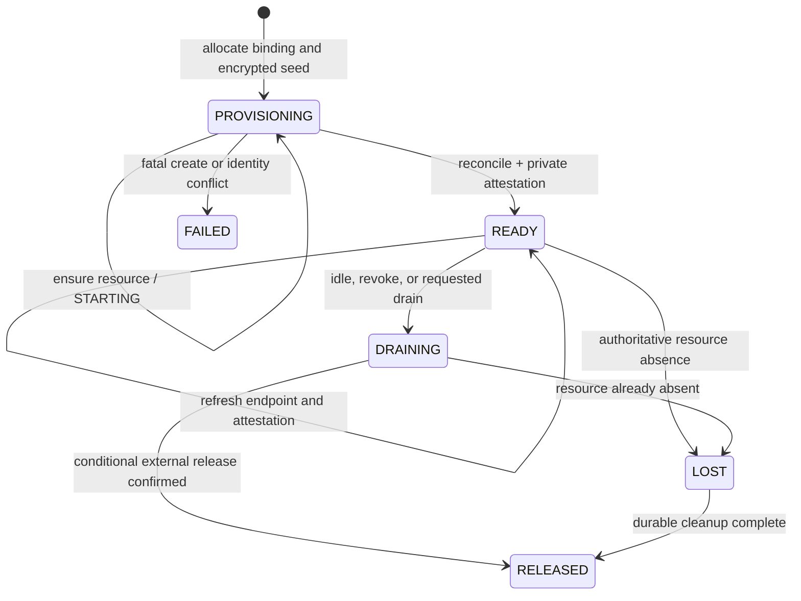

# Managed Runtime Endpoint Persistence and Recovery

[English](2026-09-21-managed-runtime-endpoint-recovery.md) | [简体中文](2026-09-21-managed-runtime-endpoint-recovery.zh-CN.md)

Status: Proposed

Reviewed baseline: `feature/managed-agents-p0-p8` at `2695220a3a`

## 1. Problem

The Java control plane calls a Tool-only Runtime over HTTP. Reusing a Runtime
after a Java restart therefore requires the control plane to remember where the
Runtime was listening. Persisting only the URL is unsafe:

- a local port or Pod IP can be reused by another process;
- a Kubernetes Pod can be replaced under the same name with a different UID;
- an endpoint can remain routable while the Runtime belongs to an obsolete
  lease or workspace generation;
- a scheduler timeout does not prove that the resource does not exist; and
- two Java replicas can otherwise provision duplicate Runtimes after a lost
  response.

The durable unit must be a Runtime binding generation. Its endpoint is one
observed attribute of a scheduler-owned resource, not the resource identity.

## 2. Current implementation evidence

The baseline already contains part of the required foundation:

- `qwen_runtime_binding` has `runtime_endpoint`, `runtime_instance_id`,
  `runtime_token`, `runtime_lease_id`, `runtime_epoch`, and health timestamps.
- `JdbcRuntimeBindingRepository` reconstructs a `RuntimeLease` from those
  columns.
- `RuntimeBindingRecord` has an optional `RuntimeProvisionSeed` and
  `RuntimeBrokerService` can pass it to a seeded provision overload.
- operation ownership and generations already fence provisioning and release,
  while the Tool execution ledger fences dispatch and preserves the original
  `executionCallId`.

The current path is not restart-safe yet:

- `EmbeddedRuntimeBroker` uses the three-argument `RuntimeBrokerService`
  constructor, which selects in-memory repositories; the JDBC repositories are
  not wired into Spring.
- neither repository creates or persists `RuntimeProvisionSeed`, so the field
  is always null in normal allocation.
- `LocalProcessRuntimeProvisioner` does not implement the seeded overload and
  generates its Runtime identity, token, lease, epoch, and process handle only
  in memory.
- the JDBC schema has no scheduler kind, placement domain, resource handle, or
  Runtime template digest.
- a restored `READY` record completes the local ready future immediately and
  refreshes `lastHealthNanos` before a real health check. The first restored
  Session can consequently accept a stale endpoint for the health freshness
  window.
- `LocalProcessRuntimeProvisioner` sends lease headers to `/health`, but the
  current owned-worker health route authenticates only the bearer token and
  returns only `{ "status": "ok" }`; it does not attest Runtime identity,
  lease ID, or epoch.
- the current plaintext `runtime_token` column is not an acceptable production
  secret-storage contract.

This design closes those gaps without putting Kubernetes-specific columns into
the Broker core.

## 3. Goals

- Persist enough information to find, authenticate, verify, and release the
  exact physical Runtime generation after a Java restart.
- Let multiple Java replicas converge on one external resource and one active
  binding generation through MySQL fencing.
- Keep Java as the HTTP client. Runtime does not need to call back into Java.
- Support local processes, Kubernetes, a statically managed Runtime, and future
  schedulers through one bounded provisioner contract.
- Preserve fast TTFT: model inference and client streaming do not wait for
  Runtime recovery until a tool boundary is reached.
- Fail closed for uncertain resources and uncertain tool side effects.

## 4. Non-goals

- Migrating old Broker rows. These tables are still pre-production and the
  target Flyway migration creates the final schema directly.
- Moving model inference or conversation authority into Tool Runtime.
- Adding Runtime-to-Java callbacks, WebSockets, or a second event system.
- Automatically replaying an execution whose outcome is unknown.
- Building the Kubernetes adapter in the JDBC activation change. The contract
  and schema must support it, but Kubernetes delivery is a later slice.
- Sharing one session-isolated Runtime between unrelated Sessions.

## 5. Decisions

### 5.1 Endpoint is an observation, not identity

The Broker persists `runtime_endpoint` to avoid rediscovery on every request,
but a restored endpoint is unusable until reconciliation succeeds. Physical
identity is the tuple:

```text
bindingId
+ runtimeGeneration
+ provisionerKind
+ placementDomain
+ provisionRequestId
+ resourceHandle
+ runtimeInstanceId
+ leaseId
+ epoch
```

The endpoint and token are never exposed through public Agent, Session, or
WebShell APIs.

### 5.2 MySQL remains the control-plane source of truth

The scheduler owns the physical resource; MySQL owns binding intent,
generation, operation fencing, current observation, and tool idempotency. A
Kubernetes object is not a replacement for the Tool execution ledger, and a
database row is not proof that a Pod or process is alive.

There is no global Broker leader. A Java replica claims the existing per-binding
operation lease before create, reconcile, drain, or release. Other replicas
poll the durable record. Every asynchronous result is committed only when the
same operation owner and operation generation are still current.

### 5.3 Reconciliation precedes use

Loading a persisted `READY` row must not complete the in-process ready gate.
The first user of that binding after a JVM load forces scheduler reconciliation
and a private authenticated attestation call. Only then may
`HttpRuntimeTransport` send `prepare`, `execute`, `status`, `cancel`, or
`release`.

Add `POST /internal/managed-runtime/v2/attest`. It requires the bearer token,
lease ID, and epoch headers, accepts the immutable Runtime scope, and returns
the Runtime instance ID, Runtime incarnation, lease ID, epoch, and scope. The
existing `/health` route remains a liveness signal and is not sufficient for
recovery identity.

`lastHealthNanos` is strictly an in-process cache populated after a successful
check. It is never initialized merely because a database row says `READY`.

### 5.4 Unknown is not not-found

Scheduler timeout, permission failure, network partition, malformed state, or
an expired Java operation lease returns `UNKNOWN` or `CONFLICT`. The Broker
keeps the binding unavailable and does not provision a replacement. Only an
authoritative `NOT_FOUND` result permits a new physical generation, subject to
the Session and execution rules in Section 11.

## 6. Durable model

### 6.1 Placement identity

Add the following immutable fields to `RuntimeProvisionRequest` and include
them in `request_key` hashing:

| Field                   | Meaning                                                                                          |
| ----------------------- | ------------------------------------------------------------------------------------------------ |
| `provisionerKind`       | Stable adapter identifier such as `local-process`, `kubernetes`, or `static`.                    |
| `placementDomain`       | Reachability and ownership domain. Examples: a stable host ID or `cluster-uid/namespace`.        |
| `runtimeTemplateDigest` | Digest of the worker image, entrypoint, protocol, capability configuration, and relevant mounts. |

A loopback endpoint is valid only in the same local-process placement domain.
This prevents another Java host from reading `http://127.0.0.1:<port>` from
MySQL and accidentally calling its own local process.

### 6.2 Binding columns

The target `qwen_runtime_binding` schema keeps the existing scope, state,
generation, CAS, ownership, activity, endpoint, and lease columns and adds:

| Column                      | Contract                                                                                                                   |
| --------------------------- | -------------------------------------------------------------------------------------------------------------------------- |
| `provisioner_kind`          | Adapter that owns the resource-handle schema.                                                                              |
| `placement_domain`          | Domain in which the endpoint is reachable and adoptable.                                                                   |
| `runtime_template_digest`   | Prevents reuse across incompatible worker revisions.                                                                       |
| `provision_request_id`      | Globally unique, stable idempotency identity for this binding generation.                                                  |
| `provision_seed_ciphertext` | Authenticated encrypted seed containing the provisional Runtime identity, Runtime incarnation, lease ID, epoch, and token. |
| `credential_key_id`         | Key reference needed to decrypt the seed; never the key itself.                                                            |
| `resource_handle_version`   | Version of the opaque provider handle schema.                                                                              |
| `resource_handle_json`      | Bounded provider-private identity; never contains credentials.                                                             |
| `attestation_generation`    | Monotonic counter advanced only after scheduler reconciliation plus private authenticated attestation succeeds.            |
| `last_reconciled_at`        | Database-time audit timestamp of the last successful attestation.                                                          |

`resource_handle_json` is limited to 64 KiB and is decoded only by the named
provisioner. Core code treats it as an immutable JSON object. The current
plaintext `runtime_token` storage is replaced by the encrypted seed/credential
payload. A test codec is allowed in repository tests; production startup must
fail if no approved secret protector is configured.

The seed is generated and stored in the same transaction that allocates the
binding ID and generation, before any scheduler call. The Repository returns
the same seed to every contender. A stable `provision_request_id` lets an
adapter find a resource created just before a Java crash, even when its handle
was not yet committed.

### 6.3 Resource handle examples

Local process:

```json
{
  "schemaVersion": 1,
  "kind": "local-process",
  "generationDirectory": "<owned absolute path>",
  "pid": 12345,
  "processStartedAt": "2026-09-21T08:00:00Z"
}
```

Kubernetes:

```json
{
  "schemaVersion": 1,
  "kind": "kubernetes",
  "clusterUid": "cluster-a",
  "namespace": "qwen-runtimes",
  "podName": "qwen-runtime-abc123-g4",
  "podUid": "5ce4...",
  "secretName": "qwen-runtime-abc123-g4",
  "secretUid": "94b1..."
}
```

If a per-Runtime Service is required, its name and UID are appended to the
Kubernetes handle. Pod or Service names alone are insufficient because a
deleted object can be recreated under the same name with a different UID.

## 7. Provisioner contract

Replace the current ready-lease-only abstraction with two explicit phases:

```java
interface RuntimeProvisioner {
    String kind();
    String placementDomain();

    CompletionStage<RuntimeResourceHandle> ensureResource(
        RuntimeProvisionRequest request,
        RuntimeProvisionSeed seed,
        RuntimeResourceHandle knownHandle);

    CompletionStage<RuntimeObservation> reconcile(
        RuntimeProvisionRequest request,
        RuntimeProvisionSeed seed,
        RuntimeResourceHandle handle,
        RuntimeLease lastLease);

    CompletionStage<Void> drain(RuntimeResourceContext resource);
    CompletionStage<Void> release(RuntimeResourceContext resource);
}
```

This is a semantic sketch; Java 11 implementations use ordinary final classes,
not records or sealed types.

`ensureResource` must be idempotent by `provisionRequestId`. It returns as soon
as the external resource identity exists so that the Broker can persist the
handle before waiting for startup. With no known handle, it first discovers an
existing resource by the provision request identity, then creates only when it
can authoritatively prove absence.

`reconcile` is observational and returns one of:

| Outcome     | Meaning                                                                   | Broker action                                                                                        |
| ----------- | ------------------------------------------------------------------------- | ---------------------------------------------------------------------------------------------------- |
| `READY`     | Exact resource and seed identity match; a routable endpoint is available. | Call the private attestation route, persist lease/endpoint, advance attestation, then open the gate. |
| `STARTING`  | Exact resource exists but is not ready.                                   | Renew operation lease and poll with bounded backoff.                                                 |
| `NOT_FOUND` | Scheduler authoritatively proves the resource is absent or terminal.      | During initial provisioning, call `ensureResource`; for a formerly ready binding, mark it `LOST`.    |
| `CONFLICT`  | Name, UID, scope, template, or seed identity conflicts.                   | Fail closed, retain evidence, alert; never adopt or replace automatically.                           |
| `UNKNOWN`   | Scheduler state cannot currently be established.                          | Return retryable unavailability and keep the existing generation blocked.                            |

`RuntimeObservation` may refresh the endpoint and non-secret resource handle,
but its returned Runtime instance ID, lease ID, and epoch must match the
persisted seed. It never returns secret material; the Broker constructs the
credential from the decrypted seed. An identity mismatch is `CONFLICT`.

`release` is idempotent and conditionally deletes only the resource identified
by the handle. An adapter must never delete a same-name replacement.

## 8. Broker lifecycle



Reconciliation itself is an operation gate, not a new durable binding state.
This keeps the state machine small. A locally reconstructed `RuntimeBinding`
captures the stored `attestation_generation` and remains closed until it either
performs a successful attestation itself or observes a later successful
generation committed by another Java replica.

Provisioning and recovery follow this sequence:

1. Allocate `bindingId`, `runtimeGeneration`, and encrypted seed atomically.
2. Claim the per-binding operation lease using database time.
3. Call `ensureResource` with the durable seed and any known handle.
4. Persist the handle while the same claim generation is still owned.
5. Poll `reconcile` until `READY`, a terminal result, or the operation deadline.
6. Build the `RuntimeLease`, call the private attestation route, and verify the
   lease headers, Runtime identity, and immutable scope.
7. CAS the endpoint, handle, `READY` state, health time, and incremented
   attestation generation in one update.
8. Complete the local ready gate. Tool Session `prepare` may now run.

If a Java process loses its operation lease at any point, its late result is
discarded. The external resource remains discoverable through
`provisionRequestId`, allowing the new owner to converge without duplication.

## 9. Endpoint use and refresh

- `runtime_endpoint` must be an HTTP(S) origin without user info, query, or
  fragment.
- The provisioner validates that the address belongs to its placement domain.
- Every Runtime request carries bearer authentication, lease ID, and epoch.
- An endpoint change is persisted before use and advances the binding record
  version and successful attestation generation.
- Health caching starts only after reconciliation in the current JVM.
- A transport failure after tool dispatch does not trigger replay. The Broker
  queries the original execution reference through `status`; if the resource
  cannot be reconciled, the durable execution becomes `UNKNOWN`.
- No-tool model turns remain independent of Runtime readiness. Warm-up can run
  concurrently, but only an actual tool boundary waits for this gate.

## 10. Provisioner-specific behavior

### 10.1 Local process

`local-process` is a same-host development and single-node adapter, not a
multi-host placement mechanism.

It must implement the seeded path and use the durable seed rather than generate
new credentials in memory. Its resource handle records an owned generation
directory plus a PID and process-start fingerprint. Recovery validates:

- placement domain equals the current stable host identity;
- all paths are owner-controlled, bounded beneath the configured state root,
  and have the required permissions;
- PID and start fingerprint identify the same process, preventing PID reuse;
- the ready record exactly matches the seed and Runtime scope;
- the endpoint is a loopback origin; and
- private attestation accepts the stored lease and epoch and returns the exact
  Runtime identity and scope.

If the process is definitely absent, reconciliation returns `NOT_FOUND`. If a
PID, path, or ready record is ambiguous, it returns `CONFLICT` or `UNKNOWN` and
does not spawn a second process. Clean shutdown must durably terminalize a
binding before killing its child. Crash recovery may adopt a matching child or
conditionally reap it; it may not treat a missing Java `Process` object as
proof that the child stopped.

### 10.2 Kubernetes

The first Kubernetes adapter should create one bare Pod per Runtime generation,
with `restartPolicy: Never`, rather than a Deployment that can silently replace
the physical Runtime. A later operator may own a Runtime CRD, but it implements
the same Broker contract.

The Pod and Secret use deterministic names and labels derived from the
`provisionRequestId`, binding ID, and generation. Raw tenant IDs, working
directories, and credentials are not labels or annotations. Creation is
GET-or-create and rejects an existing object whose immutable identity labels or
template digest differ.

For an in-cluster Java control plane, the initial adapter uses the ready Pod IP
and port as the endpoint. Pod IP is an observation; Pod UID remains the
identity. A per-Runtime ClusterIP Service is added only when the network
topology requires it, and it must select exactly one binding generation. The
adapter verifies the Service UID and the EndpointSlice `ready`/`serving` and
`terminating` conditions before returning `READY`.

The Pod uses startup and readiness probes, but Kubernetes readiness does not
replace the Broker's private attestation. Probe type is adapter-specific and
does not need to expose the control credential. NetworkPolicy allows Runtime
ingress only from the Java control-plane workload and permits only required
Runtime egress. Secrets are delivered through a per-Runtime Secret or an
approved external secret provider.

Release uses Kubernetes delete preconditions with the persisted UID (and
resourceVersion when appropriate). A same-name object with a different UID is
a conflict and is never deleted.

Kubernetes controllers are reconciliation loops, Kubernetes object UIDs
distinguish recreated objects, EndpointSlices expose ready/serving/terminating
conditions, and delete preconditions accept UID and resourceVersion. These
properties are the basis of this adapter rather than Pod names or cached IPs:

- [Kubernetes controllers](https://kubernetes.io/docs/concepts/architecture/controller/)
- [Object names and UIDs](https://kubernetes.io/docs/concepts/overview/working-with-objects/names/)
- [Pod lifecycle and replacement identity](https://kubernetes.io/docs/concepts/workloads/pods/pod-lifecycle/)
- [EndpointSlices](https://kubernetes.io/docs/concepts/services-networking/endpoint-slices/)
- [API delete preconditions](https://kubernetes.io/docs/reference/kubernetes-api/definitions/preconditions-v1-meta/)
- [Startup, readiness, and liveness probes](https://kubernetes.io/docs/concepts/workloads/pods/probes/)

### 10.3 Other schedulers

VM, batch, container-service, or static adapters store their provider identity
in the same versioned handle. They must provide the same five reconciliation
outcomes, stable idempotent provision identity, conditional release, placement
domain validation, and endpoint attestation. No scheduler-specific field is
added to Broker APIs or public Session APIs.

The static adapter remains development-only in durable mode until it can return
a stable resource handle and credential reference. A fixed URL alone does not
satisfy recovery identity.

## 11. Session and execution recovery

Recovering the same physical Runtime keeps the existing Runtime Session record
and calls `prepare` idempotently with the original Session identity.

When a formerly ready Runtime is authoritatively `NOT_FOUND`:

1. mark the binding `LOST` and stop sending requests to its endpoint;
2. inspect every Tool execution pinned to that binding generation;
3. if any execution is non-terminal or already `UNKNOWN`, keep the Session in
   `recovery_blocked` and never create a replacement automatically;
4. if no ambiguous execution exists, a later slice may CAS-rebind the same
   public/Harness Session identity to a new internal Runtime binding generation,
   rerun Tool Session preparation and history binding, and continue; and
5. all old execution records remain pinned to the old binding ID and generation
   so late results cannot enter the replacement Runtime Session.

The first JDBC activation slice does not need transparent dead-Runtime rebind.
It must safely recover the same Runtime or expose `recovery_blocked`. Automatic
safe rebind is the next bounded milestone after crash/reconciliation tests pass.

## 12. Spring integration

The Runtime Broker remains an embedded component of
`managed-agent-server`; this design does not require a separate Java service.

The activation change adds `V3__runtime_broker.sql`, creates the three JDBC
Repository beans from the existing Spring `DataSource`, injects them into the
full `RuntimeBrokerService` constructor, and assigns every Java process a
unique `brokerOwnerId`. When the Runtime Broker feature is enabled, database or
secret-protector failure fails startup. There is no silent fallback to the
in-memory repositories.

`JdbcRuntimeBrokerSchema.initialize` remains a standalone/test helper. Flyway
owns production schema lifecycle. The bundled test schema and Flyway schema
must be checked for semantic parity.

Recovery stays on demand: startup does not scan every historical binding.
`warm`, Session acquire, execution status/cancel, or an explicit bounded
janitor loads and reconciles the relevant binding. A future orphan janitor may
scan aged active bindings in pages, but it uses the same operation claim and
provisioner contract.

## 13. Failure matrix

| Failure point                                            | Required recovery                                                                              |
| -------------------------------------------------------- | ---------------------------------------------------------------------------------------------- |
| Before binding transaction commits                       | No scheduler call occurred. A retry allocates normally.                                        |
| After seed commit, before external create                | New owner gets the same seed; authoritative absence allows idempotent create.                  |
| After external create, before handle commit              | `ensureResource` discovers by `provisionRequestId` and returns the existing resource.          |
| After handle commit, before endpoint/READY commit        | Reconcile the exact handle and publish the endpoint only after private attestation.            |
| Java restart with persisted `READY`                      | Keep local gate closed; force reconcile and private attestation.                               |
| Scheduler API timeout                                    | `UNKNOWN`; retain generation and do not create or delete anything.                             |
| Endpoint points at another process/Pod                   | Lease or resource identity mismatch gives `CONFLICT`; never send a tool request.               |
| Runtime dies before tool dispatch                        | Fail the pending tool boundary; replacement follows binding policy.                            |
| Runtime dies after dispatch or response is lost          | Query original `executionCallId`; if the resource cannot answer, mark `UNKNOWN`, never replay. |
| Operation lease changes while an adapter call is running | Ignore the late result; the new owner reconciles using the durable request ID.                 |
| MySQL unavailable                                        | Fail closed; do not fall back to process memory or provision outside the ledger.               |

## 14. Delivery plan

### P3a-1: Durable identity

- Extend request identity and binding records with provisioner, placement, and
  template digest.
- Generate and persist one encrypted seed per binding generation.
- Persist versioned resource handles and attestation generation.
- Remove production plaintext Runtime-token persistence.
- Extend H2 and real-MySQL Repository contract tests.

### P3a-2: Reconcile gate

- Introduce `ensureResource` and `reconcile` results.
- Add the owned-worker private `v2/attest` route and strict identity response.
- Prevent restored `READY` from completing before reconciliation.
- Make local-process use the durable seed and implement same-host adoption or
  fail-closed cleanup.
- Add fault tests at every failure point in Section 13.

### P3a-3: Spring activation and proof

- Add Flyway V3 and Spring JDBC/secret-protector wiring.
- Run two independent Java service instances against one real MySQL database.
- Prove one physical provision, one binding generation, one execution dispatch,
  restart recovery, and stale-owner rejection.
- Measure no-tool TTFT and tool-boundary waiting separately.

### P3b: Kubernetes adapter

- Implement the bare-Pod/Secret adapter behind the same contract.
- Validate with a real test cluster: Java restart, API timeout, Pod deletion,
  same-name/different-UID conflict, delayed readiness, endpoint change,
  conditional cleanup, and an in-flight tool crash.
- Add safe idle Session rebind only after the ambiguity gates are proven.

## 15. Validation and acceptance criteria

The design is accepted only when all of the following are demonstrated:

- Spring uses JDBC repositories whenever the Runtime Broker is enabled and
  never silently falls back to memory.
- A binding seed is committed before the first scheduler side effect and is
  identical across two Java contenders.
- A resource created before a simulated crash is discovered rather than
  duplicated after restart.
- A restored `READY` row cannot cause any Runtime operation before scheduler
  reconciliation and private authenticated attestation.
- A recycled local port, same-name/different-UID Pod, stale lease, stale epoch,
  or incompatible template is rejected.
- `UNKNOWN` never triggers automatic provision or delete.
- Two Java processes plus real MySQL converge on one binding and one physical
  execution under concurrent requests and ownership takeover.
- Loss after tool dispatch queries the original `executionCallId` and never
  causes a second physical execution.
- No-tool turns can produce their first token while Runtime is still starting;
  only a real tool boundary waits.
- Secrets are encrypted or referenced, redacted from logs, and absent from
  public APIs and resource handles.
- Local-process and Kubernetes adapters pass the same scheduler-neutral
  contract suite, with adapter-specific fault tests layered on top.

## 16. Observability

Emit structured metrics and logs keyed by non-secret `bindingId`, generation,
provisioner kind, placement-domain hash, and operation generation:

- provision and reconcile duration/outcome;
- operation-claim contention and takeover;
- binding state counts and age since successful attestation;
- endpoint refreshes and private attestation failures;
- resource-handle conflicts and orphan discoveries;
- blocked Session recovery and unknown executions; and
- physical provision/delete counts compared with logical binding counts.

Do not log Runtime tokens, decrypted seeds, raw working directories, or tenant
identifiers. Endpoint logging is disabled by default or reduced to a redacted
host-class and port.
