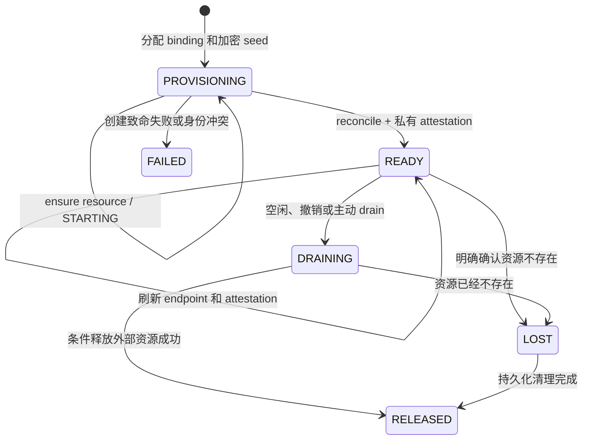

# Managed Runtime Endpoint 持久化与恢复

[English](2026-09-21-managed-runtime-endpoint-recovery.md) | [简体中文](2026-09-21-managed-runtime-endpoint-recovery.zh-CN.md)

状态：方案设计

调研基线：`feature/managed-agents-p0-p8` 的 `2695220a3a`

## 1. 问题

Java 管控面通过 HTTP 调用 Tool-only Runtime。因此，在 Java 重启后复用
Runtime，需要管控面记住 Runtime 的监听地址。但仅持久化 URL 并不安全：

- 本地端口或 Pod IP 可能被另一个进程复用；
- Kubernetes Pod 可以用相同名称重建，但 UID 已经不同；
- endpoint 仍可连通，不代表 Runtime 仍属于当前 lease 或 workspace generation；
- 调度器请求超时不能证明资源不存在；
- 丢失创建响应后，两个 Java 副本可能重复创建 Runtime。

因此，持久化单元必须是一个 Runtime binding generation。endpoint 只是调度器
资源的一个观测属性，不是资源身份。

## 2. 当前实现证据

当前基线已经包含部分必要基础：

- `qwen_runtime_binding` 已有 `runtime_endpoint`、`runtime_instance_id`、
  `runtime_token`、`runtime_lease_id`、`runtime_epoch` 和健康时间字段。
- `JdbcRuntimeBindingRepository` 可以从这些列恢复 `RuntimeLease`。
- `RuntimeBindingRecord` 有可选的 `RuntimeProvisionSeed`，
  `RuntimeBrokerService` 也可以将 seed 传给带 seed 的 provision 重载。
- operation owner/generation 已经为 provision 和 release 提供 fencing；Tool
  execution ledger 也已为 dispatch 提供 fencing，并保存原始
  `executionCallId`。

但当前链路仍不具备重启安全性：

- `EmbeddedRuntimeBroker` 使用三参数 `RuntimeBrokerService` 构造器，实际选择
  内存 Repository；JDBC Repository 尚未接入 Spring。
- 两种 Repository 都不会创建或持久化 `RuntimeProvisionSeed`，因此正常分配
  出来的该字段始终为 null。
- `LocalProcessRuntimeProvisioner` 没有实现带 seed 的重载，Runtime identity、
  token、lease、epoch 和进程句柄都只在内存中生成。
- JDBC schema 没有调度器类型、placement domain、resource handle 或 Runtime
  template digest。
- 恢复一个 `READY` 记录时，代码会立即完成本地 ready future，并在真实健康
  检查前刷新 `lastHealthNanos`；因此恢复后的第一个 Session 可能在 health
  freshness 窗口内误用旧 endpoint。
- `LocalProcessRuntimeProvisioner` 会把 lease headers 发给 `/health`，但当前
  owned-worker health route 只校验 bearer token，并且只返回
  `{ "status": "ok" }`；它不会证明 Runtime identity、lease ID 或 epoch。
- 当前明文 `runtime_token` 列不能作为生产级密钥存储契约。

本设计补齐这些缺口，同时避免把 Kubernetes 专属列加入 Broker 核心模型。

## 3. 目标

- 持久化足够的信息，使 Java 重启后能够找到、鉴权、校验并释放准确的物理
  Runtime generation。
- 让多个 Java 副本通过 MySQL fencing 收敛到同一个外部资源和唯一活跃 binding
  generation。
- 保持 Java 主动发起 HTTP 请求；Runtime 不需要反向连接 Java。
- 通过一个有边界的 provisioner 契约支持本地进程、Kubernetes、静态 Runtime
  和未来其他调度器。
- 保持低 TTFT：只有到达真实工具边界时才等待 Runtime 恢复，模型推理和客户端
  流式输出不等待。
- 对不确定资源和不确定工具副作用失败关闭。

## 4. 非目标

- 迁移旧 Broker 数据。这些表尚未进入生产，目标 Flyway migration 直接创建
  最终 schema。
- 把模型推理或对话权威状态下沉到 Tool Runtime。
- 增加 Runtime 到 Java 的回调、WebSocket 或第二套事件系统。
- 自动重放结果未知的 execution。
- 在 JDBC 激活变更中同时实现 Kubernetes adapter。契约和 schema 必须支持
  Kubernetes，但实际交付属于后续切片。
- 让相互无关的 Session 共享 session-isolated Runtime。

## 5. 设计决策

### 5.1 Endpoint 是观测值，不是身份

Broker 持久化 `runtime_endpoint`，避免每次请求都重新发现地址；但恢复出的
endpoint 在 reconcile 成功前不可使用。物理身份由以下组合构成：

```text
bindingId
+ runtimeGeneration
+ provisionerKind
+ placementDomain
+ provisionRequestId
+ resourceHandle
+ runtimeInstanceId
+ leaseId
+ epoch
```

endpoint 和 token 永远不通过公共 Agent、Session 或 WebShell API 暴露。

### 5.2 MySQL 继续作为管控面事实来源

调度器拥有物理资源；MySQL 拥有 binding 意图、generation、operation fencing、
当前观测值和工具幂等账本。Kubernetes 对象不能替代 Tool execution ledger，
数据库中的记录也不能证明 Pod 或进程仍然存活。

不设置全局 Broker leader。Java 副本在 create、reconcile、drain 或 release 前，
获取已有的 per-binding operation lease；其他副本轮询持久化记录。任何异步结果
只有在同一个 operation owner 和 operation generation 仍有效时才允许提交。

### 5.3 使用前必须 reconcile

读取持久化 `READY` 记录时，不得直接完成进程内 ready gate。JVM 第一次使用该
binding 时，必须执行调度器 reconcile 和私有的带鉴权 attestation 调用。完成后
`HttpRuntimeTransport` 才能发送 `prepare`、`execute`、`status`、`cancel` 或
`release`。

新增 `POST /internal/managed-runtime/v2/attest`。它要求 bearer token、lease ID
和 epoch headers，接收不可变 Runtime scope，并返回 Runtime instance ID、Runtime
incarnation、lease ID、epoch 和 scope。现有 `/health` 继续作为 liveness 信号，
不能单独作为恢复身份的证据。

`lastHealthNanos` 只是在当前进程内、真实健康检查成功后生成的缓存。不能因为
数据库中的状态是 `READY` 就对它赋值。

### 5.4 Unknown 不等于 not-found

调度器超时、权限失败、网络分区、状态格式错误或 Java operation lease 失效，
都返回 `UNKNOWN` 或 `CONFLICT`。Broker 保持 binding 不可用，也不创建替代
Runtime。只有调度器明确返回 `NOT_FOUND`，才允许根据第 11 节的 Session 和
execution 规则进入新物理 generation。

## 6. 持久化模型

### 6.1 Placement 身份

为 `RuntimeProvisionRequest` 增加以下不可变字段，并将它们加入 `request_key`
摘要：

| 字段                    | 含义                                                                         |
| ----------------------- | ---------------------------------------------------------------------------- |
| `provisionerKind`       | 稳定的 adapter 标识，例如 `local-process`、`kubernetes` 或 `static`。        |
| `placementDomain`       | endpoint 可达并可被接管的范围，例如稳定 host ID 或 `cluster-uid/namespace`。 |
| `runtimeTemplateDigest` | worker 镜像、入口、协议、能力配置和相关挂载的摘要。                          |

loopback endpoint 只允许在同一个 local-process placement domain 内使用。这样可
防止另一台 Java 主机从 MySQL 读到 `http://127.0.0.1:<port>` 后，误连自己机器
上的进程。

### 6.2 Binding 列

目标 `qwen_runtime_binding` schema 保留现有 scope、state、generation、CAS、
owner、activity、endpoint 和 lease 字段，并增加：

| 列                          | 契约                                                                                                        |
| --------------------------- | ----------------------------------------------------------------------------------------------------------- |
| `provisioner_kind`          | 拥有 resource-handle schema 的 adapter。                                                                    |
| `placement_domain`          | endpoint 可达且允许接管的范围。                                                                             |
| `runtime_template_digest`   | 防止复用不兼容的 worker revision。                                                                          |
| `provision_request_id`      | 当前 binding generation 全局唯一且稳定的 provision 幂等标识。                                               |
| `provision_seed_ciphertext` | 带完整性保护的加密 seed，包含 provisional Runtime identity、Runtime incarnation、lease ID、epoch 和 token。 |
| `credential_key_id`         | 解密 seed 所需的密钥引用，不包含密钥本身。                                                                  |
| `resource_handle_version`   | provider 私有 handle schema 版本。                                                                          |
| `resource_handle_json`      | 有大小上限的 provider 私有身份，不得包含凭证。                                                              |
| `attestation_generation`    | 只有调度器 reconcile 和私有带鉴权 attestation 都成功后才递增的计数器。                                      |
| `last_reconciled_at`        | 最近一次成功 attestation 的数据库时间审计字段。                                                             |

`resource_handle_json` 最大 64 KiB，只允许由对应 provisioner 解码。Core 只把它
当作不可变 JSON 对象。当前明文 `runtime_token` 改为加密的 seed/credential
payload。Repository 测试可以使用 test codec；生产启动时如果没有配置允许的
secret protector，必须失败。

seed 必须与 binding ID 和 generation 在同一个事务中生成并保存，且发生在任何
调度器调用之前。Repository 将同一份 seed 返回给所有竞争者。稳定的
`provision_request_id` 使 adapter 可以发现 Java 崩溃前已经创建、但尚未提交
handle 的资源。

### 6.3 Resource handle 示例

本地进程：

```json
{
  "schemaVersion": 1,
  "kind": "local-process",
  "generationDirectory": "<owned absolute path>",
  "pid": 12345,
  "processStartedAt": "2026-09-21T08:00:00Z"
}
```

Kubernetes：

```json
{
  "schemaVersion": 1,
  "kind": "kubernetes",
  "clusterUid": "cluster-a",
  "namespace": "qwen-runtimes",
  "podName": "qwen-runtime-abc123-g4",
  "podUid": "5ce4...",
  "secretName": "qwen-runtime-abc123-g4",
  "secretUid": "94b1..."
}
```

如果必须使用 per-Runtime Service，则把 Service 名称和 UID 加入 Kubernetes
handle。只保存 Pod 或 Service 名称是不够的，因为对象删除后可用相同名称、不同
UID 重建。

## 7. Provisioner 契约

将当前仅返回 ready lease 的抽象拆成两个明确阶段：

```java
interface RuntimeProvisioner {
    String kind();
    String placementDomain();

    CompletionStage<RuntimeResourceHandle> ensureResource(
        RuntimeProvisionRequest request,
        RuntimeProvisionSeed seed,
        RuntimeResourceHandle knownHandle);

    CompletionStage<RuntimeObservation> reconcile(
        RuntimeProvisionRequest request,
        RuntimeProvisionSeed seed,
        RuntimeResourceHandle handle,
        RuntimeLease lastLease);

    CompletionStage<Void> drain(RuntimeResourceContext resource);
    CompletionStage<Void> release(RuntimeResourceContext resource);
}
```

以上是语义草图；Java 11 实现使用普通 final class，不使用 record 或 sealed type。

`ensureResource` 必须按 `provisionRequestId` 幂等。它在外部资源身份生成后立即
返回，使 Broker 可以先持久化 handle，再等待资源启动。当 known handle 为空
时，adapter 先按 provision request identity 发现已有资源；只有在明确证明资源
不存在时才创建。

`reconcile` 是观测操作，返回以下结果之一：

| 结果        | 含义                                                   | Broker 行为                                                                          |
| ----------- | ------------------------------------------------------ | ------------------------------------------------------------------------------------ |
| `READY`     | 精确资源和 seed identity 一致，且已有可路由 endpoint。 | 调用私有 attestation route，持久化 lease/endpoint，推进 attestation，然后打开 gate。 |
| `STARTING`  | 精确资源存在，但尚未 ready。                           | 续租 operation lease，并按有界退避轮询。                                             |
| `NOT_FOUND` | 调度器明确证明资源不存在或已终止。                     | 初次 provision 时调用 `ensureResource`；原先 ready 的 binding 标记为 `LOST`。        |
| `CONFLICT`  | 名称、UID、scope、template 或 seed identity 冲突。     | 失败关闭，保留证据并告警；不能自动接管或替换。                                       |
| `UNKNOWN`   | 当前无法确定调度器状态。                               | 返回可重试的 unavailable，并继续阻塞现有 generation。                                |

`RuntimeObservation` 可以刷新 endpoint 和非敏感 resource handle，但返回的
Runtime instance ID、lease ID 和 epoch 必须与持久 seed 匹配。它不能返回敏感
信息；Broker 使用解密后的 seed 构造 credential。身份不一致时结果为
`CONFLICT`。

`release` 必须幂等，并且只允许条件删除 handle 精确标识的资源。adapter 绝不能
删除同名 replacement。

## 8. Broker 生命周期



reconcile 本身是 operation gate，不新增持久 binding 状态，以保持状态机精简。
进程内重新构造的 `RuntimeBinding` 会记录当前 `attestation_generation`，并保持
gate 关闭；只有它自己完成成功 attestation，或者看到另一个 Java 副本提交了更
大的成功 generation，才允许打开。

provision 和 recovery 按以下顺序执行：

1. 原子分配 `bindingId`、`runtimeGeneration` 和加密 seed。
2. 使用数据库时间获取 per-binding operation lease。
3. 使用持久 seed 和已有 handle 调用 `ensureResource`。
4. 只有仍持有相同 claim generation 时才持久化 handle。
5. 轮询 `reconcile`，直到 `READY`、终态结果或 operation deadline。
6. 构造 `RuntimeLease`，调用私有 attestation route，并校验 lease headers、
   Runtime identity 和不可变 scope。
7. 用一次 CAS 更新 endpoint、handle、`READY` 状态、health 时间，并递增
   attestation generation。
8. 完成本地 ready gate；此后才允许执行 Tool Session `prepare`。

Java 进程在任何阶段失去 operation lease，都必须丢弃迟到结果。外部资源仍可
通过 `provisionRequestId` 发现，新 owner 可以无重复地继续收敛。

## 9. Endpoint 使用与刷新

- `runtime_endpoint` 必须是无 user info、query 和 fragment 的 HTTP(S) origin。
- provisioner 必须校验地址属于它的 placement domain。
- 每个 Runtime 请求都携带 bearer authentication、lease ID 和 epoch。
- endpoint 变化必须先持久化再使用，并推进 binding record version 和成功的
  attestation generation。
- health 缓存只能在当前 JVM 完成 reconcile 后开始生效。
- 工具已经 dispatch 后出现 transport 失败不能触发重放。Broker 通过 `status`
  查询原 execution reference；如果无法 reconcile 资源，则持久 execution 进入
  `UNKNOWN`。
- 无工具模型轮次不依赖 Runtime ready。warm-up 可以并行执行，只有实际工具边界
  才等待 gate。

## 10. 各 Provisioner 的行为

### 10.1 本地进程

`local-process` 是同主机开发和单节点 adapter，不是多主机 placement 机制。

它必须实现带 seed 的路径，并使用持久 seed，而不是在内存中重新生成凭证。
resource handle 保存受控 generation 目录、PID 和进程启动指纹。恢复时校验：

- placement domain 与当前稳定 host identity 一致；
- 所有路径都由当前 owner 控制，位于配置的 state root 下且权限正确；
- PID 和启动指纹仍指向同一个进程，防止 PID 复用；
- ready record 与 seed 和 Runtime scope 完全一致；
- endpoint 是 loopback origin；
- 私有 attestation 接受持久 lease 和 epoch，并返回准确的 Runtime identity 和
  scope。

如果明确确认进程不存在，reconcile 返回 `NOT_FOUND`；如果 PID、路径或 ready
record 有歧义，则返回 `CONFLICT` 或 `UNKNOWN`，不能启动第二个进程。正常关闭
必须先把 binding 持久化为终态，再停止子进程。崩溃恢复可以接管匹配的子进程，
或按身份条件回收它；不能把 Java `Process` 对象丢失当作子进程已经结束的证据。

### 10.2 Kubernetes

第一个 Kubernetes adapter 应当为每个 Runtime generation 创建一个 bare Pod，
并使用 `restartPolicy: Never`；不使用可能静默替换物理 Runtime 的 Deployment。
后续 operator 可以拥有 Runtime CRD，但仍实现同一套 Broker 契约。

Pod 和 Secret 使用由 `provisionRequestId`、binding ID 和 generation 推导出的确定
名称与标签。原始 tenant ID、工作目录和凭证不能进入 label 或 annotation。创建
采用 GET-or-create；若同名对象的不可变身份标签或 template digest 不一致，则
拒绝接管。

Java 管控面位于集群内时，初始 adapter 使用 ready Pod IP 和端口作为 endpoint。
Pod IP 只是观测值，Pod UID 才是身份。只有网络拓扑确实需要时，才增加
per-Runtime ClusterIP Service，而且它必须只选择一个 binding generation。
adapter 在返回 `READY` 前校验 Service UID，以及 EndpointSlice 的 `ready`、
`serving` 和 `terminating` 条件。

Pod 配置 startup probe 和 readiness probe，但 Kubernetes readiness 不能替代
Broker 的私有 attestation。probe 类型由 adapter 决定，不需要暴露管控凭证。
NetworkPolicy 只允许 Java 管控面 workload 访问 Runtime，并只开放 Runtime 所需
的出站流量。凭证通过 per-Runtime Secret 或经过批准的外部 secret provider
下发。

release 使用持久 UID（必要时同时使用 resourceVersion）作为 Kubernetes delete
precondition。同名但 UID 不同的对象属于冲突，绝不能删除。

Kubernetes controller 是 reconcile loop；对象 UID 用来区分重建对象；
EndpointSlice 暴露 ready/serving/terminating 条件；delete precondition 支持 UID
和 resourceVersion。本 adapter 以这些能力为基础，而不是依赖 Pod 名称或缓存 IP：

- [Kubernetes controllers](https://kubernetes.io/docs/concepts/architecture/controller/)
- [Object names and UIDs](https://kubernetes.io/docs/concepts/overview/working-with-objects/names/)
- [Pod lifecycle and replacement identity](https://kubernetes.io/docs/concepts/workloads/pods/pod-lifecycle/)
- [EndpointSlices](https://kubernetes.io/docs/concepts/services-networking/endpoint-slices/)
- [API delete preconditions](https://kubernetes.io/docs/reference/kubernetes-api/definitions/preconditions-v1-meta/)
- [Startup, readiness, and liveness probes](https://kubernetes.io/docs/concepts/workloads/pods/probes/)

### 10.3 其他调度器

VM、batch、container-service 或 static adapter 使用相同的带版本 handle 保存
provider identity。它们必须提供相同的五种 reconcile 结果、稳定的幂等 provision
identity、条件 release、placement domain 校验和 endpoint attestation。Broker
API 和公共 Session API 都不增加调度器专属字段。

在 static adapter 能返回稳定 resource handle 和 credential reference 前，它在
durable mode 中仍仅用于开发。固定 URL 本身不满足恢复身份要求。

## 11. Session 与 Execution 恢复

恢复同一个物理 Runtime 时，保留当前 Runtime Session 记录，并使用原始 Session
identity 幂等调用 `prepare`。

原先 ready 的 Runtime 被明确确认 `NOT_FOUND` 时：

1. 将 binding 标记为 `LOST`，停止向旧 endpoint 发送请求；
2. 检查所有固定到该 binding generation 的 Tool execution；
3. 如果任一 execution 未终结或已经是 `UNKNOWN`，则 Session 保持
   `recovery_blocked`，不能自动创建 replacement；
4. 如果没有模糊 execution，后续切片可以通过 CAS，把同一个 public/Harness
   Session identity 重新绑定到新的内部 Runtime binding generation，重新完成
   Tool Session prepare 和 history binding 后继续；
5. 所有旧 execution 记录继续绑定旧 binding ID 和 generation，迟到结果不能进入
   replacement Runtime Session。

第一个 JDBC 激活切片不需要实现透明 dead-Runtime rebind。它必须能够安全恢复
同一个 Runtime，或者明确暴露 `recovery_blocked`。自动安全 rebind 是 crash/
reconcile 测试通过后的下一个有界里程碑。

## 12. Spring 集成

Runtime Broker 继续作为 `managed-agent-server` 的嵌入组件；本设计不要求增加单独
Java 服务。

激活变更新增 `V3__runtime_broker.sql`，基于现有 Spring `DataSource` 创建三个
JDBC Repository bean，将它们注入 `RuntimeBrokerService` 完整构造器，并为每个
Java 进程分配唯一 `brokerOwnerId`。Runtime Broker 功能启用时，数据库或 secret
protector 初始化失败必须导致启动失败，不能静默退回内存 Repository。

`JdbcRuntimeBrokerSchema.initialize` 继续作为 standalone/test helper；生产
schema 生命周期由 Flyway 管理。必须检查测试内置 schema 与 Flyway schema 的
语义一致性。

恢复按需发生：启动时不扫描所有历史 binding。`warm`、Session acquire、
execution status/cancel 或显式的有界 janitor，只加载并 reconcile 相关 binding。
未来 orphan janitor 可以分页扫描老化的活跃 binding，但必须复用同一 operation
claim 和 provisioner 契约。

## 13. 故障矩阵

| 故障点                                  | 必须具备的恢复行为                                                     |
| --------------------------------------- | ---------------------------------------------------------------------- |
| binding 事务提交前                      | 尚未调用调度器，重试正常分配。                                         |
| seed 提交后、外部 create 前             | 新 owner 获得同一 seed；明确不存在时执行幂等 create。                  |
| 外部 create 后、handle 提交前           | `ensureResource` 通过 `provisionRequestId` 发现并返回现有资源。        |
| handle 提交后、endpoint/READY 提交前    | reconcile 精确 handle，私有 attestation 成功后才发布 endpoint。        |
| Java 带持久化 `READY` 重启              | 保持本地 gate 关闭，强制 reconcile 和私有 attestation。                |
| 调度器 API 超时                         | `UNKNOWN`；保留 generation，不创建或删除任何资源。                     |
| endpoint 指向其他进程/Pod               | lease 或 resource identity 不一致，返回 `CONFLICT`；不能发送工具请求。 |
| Runtime 在工具 dispatch 前死亡          | 当前工具边界失败；是否 replacement 按 binding policy 处理。            |
| Runtime 在 dispatch 后死亡或响应丢失    | 查询原 `executionCallId`；资源无法回答时标记 `UNKNOWN`，绝不重放。     |
| adapter 调用过程中 operation lease 变化 | 忽略迟到结果；新 owner 使用持久 request ID 继续 reconcile。            |
| MySQL 不可用                            | 失败关闭；不能退回内存，也不能在 ledger 外 provision。                 |

## 14. 交付计划

### P3a-1：持久身份

- 为 request identity 和 binding record 增加 provisioner、placement 和 template
  digest。
- 每个 binding generation 只生成并持久化一个加密 seed。
- 持久化带版本 resource handle 和 attestation generation。
- 移除生产路径中的明文 Runtime token 持久化。
- 扩展 H2 和真实 MySQL Repository contract tests。

### P3a-2：Reconcile gate

- 引入 `ensureResource` 和 `reconcile` 结果。
- 增加 owned-worker 私有 `v2/attest` route 和严格的身份响应。
- 阻止恢复的 `READY` 在 reconcile 前完成。
- 让 local-process 使用 durable seed，并实现同主机接管或失败关闭清理。
- 为第 13 节每个故障点增加测试。

### P3a-3：Spring 激活与证明

- 新增 Flyway V3 和 Spring JDBC/secret-protector 接线。
- 使用同一个真实 MySQL 运行两个相互独立的 Java 服务实例。
- 证明只有一次物理 provision、一个 binding generation、一次 execution dispatch，
  并证明重启恢复和过期 owner 拒绝。
- 分别测量无工具 TTFT 与工具边界等待时间。

### P3b：Kubernetes adapter

- 在同一契约后实现 bare-Pod/Secret adapter。
- 在真实测试集群验证：Java 重启、API 超时、Pod 删除、同名不同 UID 冲突、延迟
  readiness、endpoint 变化、条件清理和工具执行中崩溃。
- 只有模糊状态 gate 被证明可靠后，才增加安全的 idle Session rebind。

## 15. 验证与验收标准

只有以下内容全部得到证明，本设计才算完成：

- Runtime Broker 启用时 Spring 一定使用 JDBC Repository，绝不静默退回内存。
- 第一次调度器副作用前已经提交 binding seed，两个 Java 竞争者读取到完全相同的
  seed。
- 模拟崩溃前创建的资源能在重启后被发现，而不是重复创建。
- 恢复的 `READY` 记录在调度器 reconcile 和私有带鉴权 attestation 前，不能
  触发任何 Runtime 操作。
- 被复用的本地端口、同名不同 UID Pod、旧 lease、旧 epoch 或不兼容 template
  都会被拒绝。
- `UNKNOWN` 永远不会触发自动 provision 或 delete。
- 两个 Java 进程和真实 MySQL 在并发请求与 owner takeover 下，收敛到一个
  binding 和一次物理 execution。
- 工具 dispatch 后丢失响应时，查询原 `executionCallId`，不会产生第二次物理
  execution。
- Runtime 仍在启动时，无工具轮次可以产生首 token；只有真实工具边界等待。
- secret 被加密或引用，不出现在日志、公共 API 和 resource handle 中。
- local-process 和 Kubernetes adapter 通过同一套调度器无关 contract suite，
  并各自通过专属故障测试。

## 16. 可观测性

以非敏感 `bindingId`、generation、provisioner kind、placement-domain hash 和
operation generation 为键输出结构化指标和日志：

- provision/reconcile 时延和结果；
- operation claim 竞争和 takeover；
- binding 状态数量和距上次成功 attestation 的时长；
- endpoint 刷新和私有 attestation 失败；
- resource-handle 冲突与 orphan 发现；
- 被阻塞的 Session recovery 与 unknown execution；
- 物理 provision/delete 数量与逻辑 binding 数量的对比。

不能记录 Runtime token、解密 seed、原始工作目录或 tenant identifier。endpoint
默认不记录，或者只记录脱敏后的 host 类型和端口。
