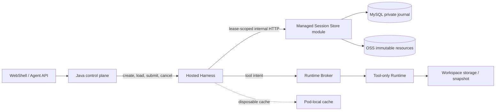

# Managed Session Durable Authority Store

[English](2026-09-21-managed-session-durable-store.md) | [简体中文](2026-09-21-managed-session-durable-store.zh-CN.md)

Status: D0 storage seam implemented; D1-D3 proposed. Date: 2026-09-21. This design refines the durable-recovery work in [Managed Agent Storage, Events, and Session Recovery](2026-09-20-managed-agent-storage-event-architecture.md). It covers new Hosted Managed Sessions only; importing existing local Sessions is out of scope for the first release.

## 1. Decision

For Hosted Managed Sessions, replace Runtime-local JSONL as the production authority with a hybrid durable store:

- MySQL stores the private journal head, writer generation and lease, idempotent transaction receipts, exact committed record bytes, resource references, recovery status, and immutable resource bodies up to 64 KiB.
- OSS stores immutable resource bodies larger than 64 KiB, such as large messages, checkpoints, tool outcomes, file-history data, and recovery artifacts.
- The TypeScript Harness remains the semantic Session authority: it validates and creates Managed records. The Java storage module is the physical commit and fencing service; it does not run the Agent loop or synthesize private records.
- A local JSONL, if materialized for compatibility or diagnostics, is a disposable cache/export. It is never a second authority and losing the Harness Pod disk does not lose the Session.
- Standalone CLI and development deployments retain the existing local-file backend. A Session selects one backend when it is created and never dual-writes two authorities.

Do not use a shared PVC or one appendable OSS object as the production authority. A PVC is an acceptable development or transitional backend. OSS is appropriate for immutable bodies, but the relational commit point supplies ordering, idempotency, compare-and-set, and stale-writer rejection.

## 2. Verified Current Baseline

The current persistence backend is entirely local, but D0 now isolates it behind storage contracts:

- `LocalManagedSessionAuthority` reads and appends through a `ManagedSessionJournalHandle`; it no longer owns a transcript path or calls `SessionWriterLease` for normal writes.
- `LocalJsonlManagedSessionJournalStore` wraps `SessionWriterLease`, scans the normal Session transcript, and preserves the existing JSONL bytes and torn-tail behavior.
- `LocalManagedSessionResourceStore` implements `ManagedSessionResourceStore` and publishes resources under `<runtimeBaseDir>/resources/<sessionId>/`.
- `openManagedSession` accepts injected journal/resource stores and defaults to those local adapters.
- The Spring service persists public Session, Turn, Command, Event, Item, Snapshot, and Runtime Broker state, but it has no private Managed journal or Managed resource catalog.
- The existing JSONL contains `session_execution_engine`, `managed_session_header_v1`, `managed_session_event_v1`, and `managed_session_commit_v1` records. The sibling `<sessionId>.ledger.jsonl` is the prompt terminal ledger, not the private Managed journal.

Consequently, a Runtime or Hosted Harness Pod without durable mounted storage loses the transcript and every resource referenced by it. Uploading only the JSONL is also insufficient because checkpoints and message/tool bodies are stored as separate resources.

Hosted remote mode does not upload the sibling prompt ledger as another file. Its durable facts are represented by the private `turn.settled` transaction and the public Java Turn state. Standalone mode keeps the existing sidecar for compatibility.

## 3. Options Considered

| Option                                  | Advantages                                                                                                                                | Problems                                                                                                                                                                                                                                | Decision                                        |
| --------------------------------------- | ----------------------------------------------------------------------------------------------------------------------------------------- | --------------------------------------------------------------------------------------------------------------------------------------------------------------------------------------------------------------------------------------- | ----------------------------------------------- |
| Per-Session PVC                         | Smallest code change; preserves file APIs                                                                                                 | Couples scheduling to storage; slow attach/failover; non-Kubernetes deployments need another solution; volume access modes are not application fencing; referenced resources and database state still need coordinated recovery         | Development or transitional use only            |
| Shared RWX filesystem                   | Existing readers can see the same path                                                                                                    | Lock and inode semantics depend on the filesystem; shared contention and noisy-neighbor risk; a filesystem path does not provide tenant-scoped CAS or idempotent commit receipts                                                        | Reject as production authority                  |
| One appendable OSS JSONL                | Durable and visually similar to the local file                                                                                            | Append is sequential; a single appendable object is limited to 5 GiB; appendable versions, WORM, encryption, and download behavior have restrictions; no atomic transaction spans the object, resource manifests, and writer generation | Reject                                          |
| MySQL only                              | Strong transaction, ordering, and fencing model                                                                                           | Large checkpoints, messages, and tool results inflate database storage and backup traffic                                                                                                                                               | Use for journal data and resources up to 64 KiB |
| Tiered MySQL journal/resources plus OSS | Strong commit semantics while keeping large bytes out of SQL; scheduler-independent; works with local process and Kubernetes provisioners | Requires an internal storage API, resource manifest, and safe garbage collection                                                                                                                                                        | Selected                                        |

Kubernetes documents that ordinary volume access modes primarily describe mounting capabilities and do not themselves enforce write protection after mount. `ReadWriteOncePod` is stricter but still binds recovery to a volume and CSI behavior. [Kubernetes Persistent Volumes](https://kubernetes.io/docs/concepts/storage/persistent-volumes/)

OSS object operations are atomic and strongly consistent after a successful write, which is suitable for immutable resources. OSS AppendObject, however, has a 5 GiB limit, appends only to the current appendable version, does not create a historical version for every append, cannot be combined with WORM, and has other storage/encryption constraints. [OSS consistency](https://help.aliyun.com/en/oss/user-guide/what-is-oss), [OSS AppendObject](https://help.aliyun.com/en/oss/developer-reference/appendobject)

## 4. Target Topology and Ownership



The Managed Session Store is initially a module in the existing Spring control-plane service, exposed only through an internal HTTP API. It does not require another deployment. The contract is transport-independent so the module can be separated later without changing Core semantics.

Java continues to initiate public Harness and Runtime operations. The storage callback is a narrow internal persistence channel: Java grants a Session-scoped writer capability to the selected Harness, and the Harness uses it only to read or commit that Session. TypeScript does not receive database credentials or OSS long-lived credentials.

The same `(tenantId, workspaceId, sessionId)` identifies the Java public Session, private Harness journal, and Runtime binding. There is no second public or Harness Session ID.

## 5. Core Storage Contracts

Extract behavior from the current concrete local classes without duplicating the Managed state machine:

```ts
interface ManagedSessionJournalStore {
  open(request: OpenJournalRequest): Promise<ManagedSessionJournalHandle>;
}

interface ManagedSessionJournalHandle {
  readonly sessionKey: ManagedSessionKey;
  read(options?: { maxBytes?: number }): Promise<ManagedSessionJournalScan>;
  appendTransaction(records: readonly unknown[]): Promise<void>;
  seal(): Promise<void>;
  abort(): Promise<void>;
}

interface ManagedSessionResourceStore {
  publish(kind: string, bytes: Buffer): Promise<ManagedSessionDurableRef>;
  read(ref: ManagedSessionDurableRef): Promise<Buffer>;
}
```

This is the implemented D0 Core seam. `appendTransaction` always receives one complete semantic transaction. The local adapter keeps the historical per-line sync and recoverable torn-tail behavior; the D1 HTTP handle will serialize that batch once, acquire or renew its scoped writer grant internally, submit the outer CAS and idempotency metadata derived from the validated header, events, and marker, and return only after Java confirms the exact bytes are committed. The paired HTTP resource adapter will retain staged inline bytes until that commit. Those D1 adapters and server-side semantics are not implemented yet.

`ManagedSessionAuthority` owns record validation, event sequence rules, command content digests, checkpoint rules, and domain semantics. Store implementations own physical atomicity, writer fencing, exact-byte durability, pagination, and resource verification.

Implementations:

- `LocalJsonlManagedSessionJournalStore` wraps `SessionWriterLease` and preserves current standalone behavior, including explicit torn-tail recovery.
- `LocalManagedSessionResourceStore` remains the local resource adapter.
- `HttpManagedSessionJournalStore` and `HttpManagedSessionResourceStore` use the internal Java API for hosted mode.

The remote resource adapter keeps resources up to and including 64 KiB staged in the Harness until their owning journal transaction commits them atomically into MySQL. Larger resources are published to OSS before that transaction. Both paths return the same `DurableRef`; readers do not infer placement from the ref. The fixed v1 threshold avoids a per-deployment behavior matrix and can change only with a storage-versioned compatibility decision.

The remote commit operation accepts one complete Managed transaction: normally one to three event records followed by its commit marker, plus any staged inline resources. Java stores the exact UTF-8 JSONL bytes and their SHA-256 digest; it does not parse or reserialize private event bodies. It validates the outer scope, size, record count, sequence range, reference list, lease, and digest chain.

## 6. Relational Data Model

Use separate private tables rather than extending `managed_agent_event`, which is a filtered public projection.

### 6.1 `qwen_managed_session_journal_head`

One row per Session:

| Field                                                                      | Purpose                                                                  |
| -------------------------------------------------------------------------- | ------------------------------------------------------------------------ |
| `tenant_id`, `workspace_id`, `session_id`                                  | Trusted scope and primary identity                                       |
| `storage_version`, `state`                                                 | Format and lifecycle (`ACTIVE`, `SEALED`, `DELETING`, `DELETED`)         |
| `writer_generation`, `writer_id`, `writer_lease_until`, `lease_token_hash` | Monotonic writer fencing, using database time                            |
| `journal_revision`, `committed_sequence`, `last_commit_digest`             | Authoritative head CAS                                                   |
| `activation_epoch`                                                         | Connect private writes to the active Harness grant                       |
| `latest_checkpoint_resource_id`                                            | Fast restore entry point; null only for a valid initial basis            |
| `compacted_through_revision`                                               | Future immutable-pack watermark; zero initially                          |
| `recovery_status`, `recovery_detail_code`                                  | `READY`, `BLOCKED_RESOURCE`, `BLOCKED_WORKSPACE`, or `BLOCKED_EXECUTION` |
| `created_at`, `updated_at`                                                 | Database timestamps                                                      |

The primary key is `(tenant_id, session_id)`. Every mutating transaction locks this exact row through its unique key. InnoDB locking reads provide the row serialization needed for the head CAS. [MySQL InnoDB locking](https://dev.mysql.com/doc/refman/8.0/en/innodb-best-practices.html)

### 6.2 `qwen_managed_session_journal_tx`

One row per committed Managed transaction:

| Field                                                             | Purpose                                                                              |
| ----------------------------------------------------------------- | ------------------------------------------------------------------------------------ |
| Scope plus `journal_revision`                                     | Ordered primary key                                                                  |
| `operation`, `command_id`, `content_digest`                       | Idempotency; unique within the Session and operation                                 |
| `first_sequence`, `last_sequence`, `event_count`                  | Event range                                                                          |
| `events_digest`, `previous_commit_digest`, `commit_digest`        | Existing hash-chain proof                                                            |
| `writer_generation`, `activation_epoch`                           | Audit and stale-writer proof                                                         |
| `record_encoding`, `record_bytes`, `byte_length`, `record_digest` | Exact bounded JSONL transaction bytes; initially `identity` encoding in `MEDIUMBLOB` |
| `created_at`                                                      | Commit time                                                                          |

The first row is a genesis transaction for `session.create`: it contains the exact `session_execution_engine` and Managed header lines, uses sequence zero, and references the definition and root snapshot resources. Later rows contain event records plus their commit marker. This groups the physical creation atomically without changing the exported JSONL record format or the event sequence. The existing 8 MiB transaction limit remains. Private record bytes are never returned by public Agent APIs or copied into `managed_agent_event`.

### 6.3 `qwen_managed_session_resource`

Catalogs immutable resources stored in MySQL or OSS:

| Field                                                  | Purpose                                                                 |
| ------------------------------------------------------ | ----------------------------------------------------------------------- |
| Scope plus `resource_id`                               | Opaque identity and ownership                                           |
| `kind`, `schema_version`, `byte_length`, `sha256`      | Existing `DurableRef` contract                                          |
| `storage_kind`, `inline_bytes`                         | `MYSQL_INLINE` plus bytes for resources up to 64 KiB                    |
| `object_key`, `object_version_id`, `encryption_key_id` | `OSS_OBJECT` location and encryption identity for larger resources      |
| `publish_command_id`, `state`                          | Idempotent `ALLOCATED`, `PUBLISHED`, `REFERENCED`, `DELETING` lifecycle |
| `created_at`, `last_verified_at`, `retention_until`    | Operations and retention metadata                                       |

Exactly one placement is valid for each resource. `MYSQL_INLINE` requires `inline_bytes` and null OSS location fields; `OSS_OBJECT` requires the OSS location fields and null `inline_bytes`. The 64 KiB boundary is measured from the raw resource bytes before transport encoding. Every read verifies `byte_length` and `sha256` regardless of placement.

### 6.4 `qwen_managed_session_resource_ref`

Records the resource closure committed by each journal revision. Its key is `(tenant_id, session_id, journal_revision, resource_id)`. The first release retains all Session-owned referenced resources until the Session is explicitly deleted. Cross-Session pins and automatic garbage collection remain disabled until their hold protocol is implemented and tested.

## 7. Internal HTTP Protocol

The first implementation adds private routes such as:

```text
POST /internal/managed-session-store/v1/sessions/{sessionId}/writers:acquire
POST /internal/managed-session-store/v1/sessions/{sessionId}/writers:renew
POST /internal/managed-session-store/v1/sessions/{sessionId}/transactions:commit
GET  /internal/managed-session-store/v1/sessions/{sessionId}/restore
GET  /internal/managed-session-store/v1/sessions/{sessionId}/transactions
POST /internal/managed-session-store/v1/sessions/{sessionId}/resources:allocate
POST /internal/managed-session-store/v1/sessions/{sessionId}/resources/{resourceId}:finalize
GET  /internal/managed-session-store/v1/sessions/{sessionId}/resources/{resourceId}
POST /internal/managed-session-store/v1/sessions/{sessionId}/writers:seal
```

The control plane passes a short-lived opaque writer grant when creating or loading the Hosted Harness Session. The grant binds tenant, workspace, Session, writer generation, activation epoch, worker identity, and expiry. The database stores only its hash. Production deployments require mTLS or an equivalent service identity in addition to the scoped grant; `tenantId` is scope, not authentication.

`transactions:commit` carries staged inline resources and inserts them in the same MySQL transaction as their first journal references. Larger resources use a short-lived signed PUT/GET flow. The object key is server-generated, uploads forbid overwrite, server-side encryption is required, and `finalize` verifies length and SHA-256 before the resource becomes referenceable. Local development may proxy bytes through Java or use the local adapter.

## 8. Commit Protocol

Session creation first stages or publishes the definition and root snapshot according to the same placement rule, then creates the journal head, genesis transaction, inline resource bodies, and initial resource references in one MySQL transaction. For every later semantic transaction:

1. Core validates the command, actor, expected sequence, records, and resource closure. Resources up to 64 KiB remain staged in the scoped Harness handle; larger resources are uploaded as immutable OSS objects and finalized. Neither is yet visible from the Session journal.
2. Harness calls `transactions:commit` with exact record bytes, resource refs, expected journal revision, expected committed sequence, previous commit digest, writer generation, activation epoch, operation, command ID, and content digest.
3. In one MySQL transaction, the store locks the head row, validates the unexpired generation and activation, resolves an existing idempotency receipt, verifies expected head and every resource, inserts staged inline resource bytes, the journal transaction, and resource references, then advances the head.
4. Only after commit does Harness acknowledge the private event or report a successful terminal Turn. A lost response is retried with the same command ID and content digest and returns the original receipt.
5. Updating a local cache and publishing public/SSE projections happen after the private commit. Their failure does not roll back or duplicate the private transaction.

An OSS upload followed by a failed database commit leaves an unreferenced immutable object. It is not visible to recovery and can be collected later after the publisher is fenced and a safety window passes. Failed inline commits leave no resource row. A committed journal head can never reference an unfinalized object.

## 9. Open and Recovery Protocol

1. Java grants a new writer generation only after fencing the previous generation. Expiry alone authorizes a higher database generation, but does not prove an old tool side effect stopped; Runtime dispatch uses its own generation checks.
2. Harness reads the journal head and a restore bundle containing the latest verified checkpoint, the committed tail after that checkpoint, pending commands, and resource manifest.
3. Harness verifies the commit digest chain, record bytes, checkpoint digest, and all required resources. Immutable resources may be cached by digest on the Harness Pod.
4. The Runtime Broker reconciles every unsettled `executionCallId`. Unknown outcomes produce `BLOCKED_EXECUTION`; they are never executed again merely because the former Pod disappeared.
5. Workspace identity and snapshot/mount are verified. A missing workspace produces `BLOCKED_WORKSPACE`; transcript readability is not proof that execution can continue.
6. Only a `READY` restore installs a new activation and enables model/tool progression. Missing or corrupt resources produce `BLOCKED_RESOURCE`, while read-only history remains available where safe.

The first remote implementation can page the complete committed journal. Compaction is a later measured optimization: a background job may pack a contiguous prefix into an immutable compressed OSS object, verify it, atomically publish its manifest and watermark in MySQL, and only then delete covered SQL blobs after a grace period. Restore merges verified packs with the SQL hot tail. OSS object listing is never the authority for order or completeness.

## 10. Latency and Availability

The durable path must not reintroduce Runtime cold-start latency into first token:

- Session creation should stage or publish its definition and root snapshot before the first Prompt where possible.
- Prompt input is committed before model inference. A normal prompt up to 64 KiB and its journal records use one bounded internal store transaction, not an OSS PUT or Pod startup wait; larger input uses the OSS path explicitly.
- Model inference and Runtime preparation remain concurrent. The Harness waits for Runtime only at the first tool boundary.
- Text deltas are not individually written to the private journal. Commit at semantic boundaries: input admission, model attempt/result, tool intent before dispatch, tool receipt before consumption, checkpoint, and Turn settlement.
- A terminal success is not emitted until the final message and checkpoint transaction is durable.
- Local caches can reduce restore reads but never relax commit acknowledgement.

Measure added first-token latency, commit p50/p95/p99, restore latency, MySQL bytes per Turn, OSS requests and bytes per Turn, and cache hit rate. Validate the 64 KiB placement boundary against those measurements before production; changing it later requires a storage-versioned compatibility decision. No fixed latency claim is made by this design.

If MySQL is unavailable, stop accepting new private commits and apply bounded backpressure. Continuing a model or tool side effect without durable admission would violate the recovery contract. An OSS outage blocks operations that require a new resource but does not make already committed history unreadable if its resources remain available through normal redundancy/cache behavior.

## 11. Retention, Deletion, and Security

- Public SSE replay retention and private Session retention are separate. Expiring public deltas must not delete private model context or checkpoints.
- The first release performs no automatic deletion of referenced private resources. A safe leak is preferable to an unsafe recovery gap.
- Session deletion first closes admission, reconciles executions, writes a tombstone/cleanup plan, and removes database references. Object deletion is idempotent and occurs after the configured grace or legal-retention window.
- Enable OSS versioning and server-side encryption. Use an overwrite-prevention request header for immutable writes. Versioning protects against accidental replacement but does not replace the database commit point. [OSS overwrite protection and limits](https://help.aliyun.com/en/oss/user-guide/limits), [OSS versioning](https://help.aliyun.com/en/oss/user-guide/manage-objects-in-a-versioning-enabled-bucket)
- Private journal/resource tables use a separate database role from public readers. All reads require trusted tenant and Session scope. Raw records, signed URLs, credentials, tool arguments, and model context are excluded from public events and ordinary application logs.
- Backups and disaster recovery must cover MySQL and OSS consistently enough to restore a journal head and every referenced object. A database point newer than the available object replica is not a valid recovery point.

## 12. Rollout and Reviewable Changes

### D0: Storage seam, no behavior change

Status: implemented on the current feature branch.

- Introduce `ManagedSessionJournalStore` and `ManagedSessionResourceStore` contracts.
- Move current JSONL scanning/appending and resource files behind local adapters.
- Run existing authority, projection, restore, writer-conflict, and corruption tests unchanged against the local adapter.

Exit condition: standalone behavior and bytes are unchanged; no Java or OSS dependency enters Core.

### D1: Durable Java store and contract client

- Add the four private tables in the next available Flyway migration.
- Add the Spring internal API, lease/CAS/idempotency logic, and a TypeScript HTTP adapter.
- Add shared golden contract fixtures for exact record bytes, digests, error codes, and limits.
- Implement the transactional `MYSQL_INLINE` resource path and keep OSS disabled initially.

Exit condition: two Java instances sharing MySQL reject stale writers and return the same receipt after a lost response.

### D2: OSS resources and new-Session hosted routing

- Implement the `OSS_OBJECT` path for resources larger than 64 KiB: allocate/upload/finalize/read, scoped signed URLs, digest verification, encryption, and orphan inventory.
- Select the remote backend for newly created Hosted Managed Sessions. Existing local Sessions remain local; no migration and no dual write.
- Remove dependence on Pod-local transcript/resource files from the hosted restore path. A local cache is optional and disposable.

Exit condition: delete the original Harness Pod and its filesystem, then restore the same Session and checkpoint on another Harness without losing history.

### D3: Recovery gates and production evidence

- Tie journal writer generation to Harness activation and Runtime dispatch fencing.
- Reconcile unsettled tool executions and Workspace recovery before enabling continuation.
- Add retention/tombstone workflow, metrics, alerts, backup/restore exercise, and fault injection.

Exit condition: the failure matrix below passes on the deployed MySQL and OSS products. Only then can hosted mode advertise automatic cross-Pod recovery.

## 13. Acceptance Matrix

| Scenario                                     | Required result                                                                                               |
| -------------------------------------------- | ------------------------------------------------------------------------------------------------------------- |
| Two Harness workers acquire the same Session | One generation can commit; the stale worker receives a conflict before any bytes become visible               |
| Commit succeeds but HTTP response is lost    | Same command ID and digest returns the original receipt; no duplicate sequence or content                     |
| Same idempotency key with different content  | Conflict and alert; neither payload overwrites the other                                                      |
| Crash after object upload, before SQL commit | Session cannot see the object; it remains a safely collectible orphan                                         |
| Resource is 64 KiB or 64 KiB plus one byte   | The first uses `MYSQL_INLINE`, the second uses `OSS_OBJECT`; both use the same `DurableRef` and digest checks |
| Crash after SQL commit, before cache/SSE     | Recovery reads the committed transaction; cache and public projection catch up without rewriting it           |
| Harness Pod and local disk are deleted       | New Harness restores journal, checkpoint, and all referenced resources                                        |
| Resource missing or digest mismatch          | `BLOCKED_RESOURCE`; never continue from an empty or older unproven state                                      |
| Tool result outcome is unknown               | `BLOCKED_EXECUTION`; never automatically repeat the tool call                                                 |
| Workspace snapshot/mount is absent           | History remains readable, execution is `BLOCKED_WORKSPACE`                                                    |
| Tenant or Session scope is forged            | Request is rejected before object URL or private bytes are returned                                           |
| MySQL or OSS is unavailable                  | Bounded backpressure and explicit failure; no false durable acknowledgement                                   |
| Local cache is corrupt or absent             | Rebuild or ignore it; durable head and resource digests determine truth                                       |
| Session is deleted during active work        | Admission closes, executions settle or block, tombstone commits, then resources are reclaimed safely          |

## 14. Open Deployment Parameters

Before production enablement, choose and measure:

- private Session retention and legal-hold requirements;
- active Session and Turn rates, average/maximum journal bytes and resource bytes per Turn;
- writer lease duration and renewal interval;
- MySQL durability/replication settings and acceptable recovery point/time;
- OSS region, redundancy, versioning, encryption key policy, lifecycle classes, and cross-region recovery;
- maximum restore tail, checkpoint frequency, and whether SQL-to-OSS journal packing is necessary;
- Workspace persistence or snapshot provider, which is a separate prerequisite for executable recovery.

These parameters do not change the selected ownership or commit protocol. They determine capacity and operational policy, not whether a local Pod disk is authoritative.
