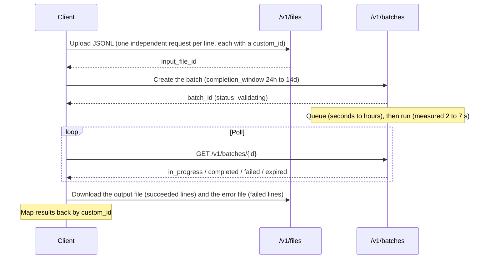
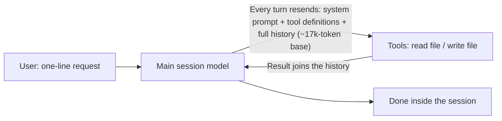
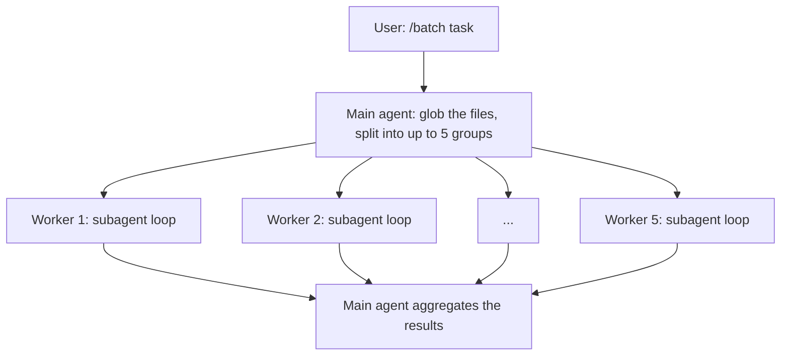
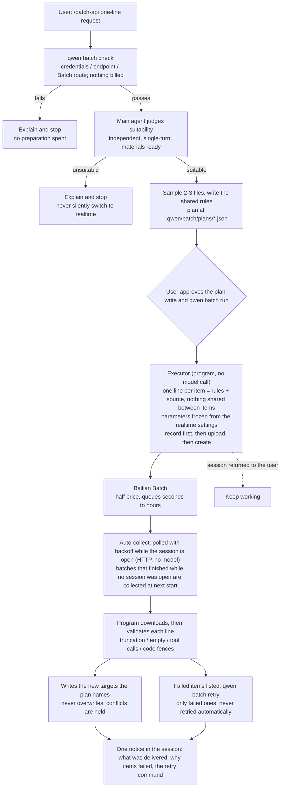

# Batch API and `/batch-api`: Overview

[中文版](./2026-09-23-batch-api-overview.zh-CN.md)

Status: explainer for the team, updated with PR #12492. The design contract is
[`2026-09-23-agent-prepared-batch-api.md`](./2026-09-23-agent-prepared-batch-api.md);
measured data and conclusions are in
[`docs/verification/batch-api/results-2026-09-23.md`](../verification/batch-api/results-2026-09-23.md).

> In one line: **the Bailian Batch API is a half-price, asynchronous,
> cache-less channel for bulk inference.** qwen-code's `/batch-api` lets a user
> hand it "many independent single-turn tasks" (for example, translating a set
> of documents) in one sentence. Waiting does not occupy the agent; when the
> batch finishes, the session collects it and the program validates the results
> and writes them back as files.

## 1. What the Bailian Batch API is

The interface is compatible with OpenAI Batch:



| Aspect                  | Batch API                                                                                                                                                                                  | Realtime API                                         |
| ----------------------- | ------------------------------------------------------------------------------------------------------------------------------------------------------------------------------------------ | ---------------------------------------------------- |
| Price                   | **50%** of list price                                                                                                                                                                      | List price                                           |
| Billing                 | **Successful requests only** (failed requests measured at 0)                                                                                                                               | Every call                                           |
| Context cache           | **None** (`cached_tokens` measured at 0)                                                                                                                                                   | Implicit cache hits billed at 20% of the input price |
| Latency                 | Asynchronous; promised within 24h                                                                                                                                                          | Seconds                                              |
| Multi-turn / tool loops | No: every line is a one-shot request                                                                                                                                                       | Yes                                                  |
| Per-file limits         | ≤ 50,000 lines, ≤ 500 MB, ≤ 6 MB per line (the provider's guide says 1 MB; the two documents disagree, and the `/batch-api` workflow keeps 1 MB); one model and one thinking mode per file | —                                                    |

**Measured latency** (2026-09):

- It varies widely: in the 09-23 tests a run took only **2–7 s** and nearly all
  the wait was queueing; in the 09-14 probes `in_progress` to `completed` took
  10 minutes to an hour.
- Queues are per model: qwen-plus usually passes within seconds; a qwen3.7-plus
  batch was measured queueing for **53 minutes**.
- Scale: 3 lines about 10 minutes, 24 lines about 29 minutes, 1000 lines about
  62 minutes.
- Conclusion: **do not count on it being fast, only on it being cheap.**

## 2. When it actually saves money

```text
Let I = input cost, O = output cost (at list price), h = realtime cache-hit rate
Realtime ≈ I × (1 − 0.8h) + O
Batch    ≈ 0.5 × (I + O)
With negligible output, realtime is cheaper once h > 62.5%
```

| Task shape                                                                                      | Cheaper      | Why                                                             |
| ----------------------------------------------------------------------------------------------- | ------------ | --------------------------------------------------------------- |
| Many **independent** items, short shared prefix (per-document translation, per-file extraction) | **Batch**    | Realtime rarely hits the cache here, so the 50% is a net saving |
| A very long shared rulebook (≥ 2k tokens) submitted back to back                                | **Realtime** | Measured 96% cache hits from the second call on                 |
| Routing the agent's own turns through Batch                                                     | **Realtime** | Measured at 1.03× realtime and hours slower (rejected)          |
| Only a handful of items                                                                         | **Realtime** | The saving does not cover preparation and waiting               |

**Thinking mode is the first price variable**: for the same task, generation
with thinking on measured about 160× the cost of thinking off. Batch's 50% is
the second variable.

## 3. Architecture of the three execution paths

### 3.1 Plain agent loop

The user just says "translate these documents" in a session.



- Upside: general and immediate; handles tasks that need feedback.
- Cost: N documents take at least N round trips, and **every turn repays the
  whole session base**. The cache discounts it to 20%, but the total still grows
  faster than N.

### 3.2 `/batch` (existing skill: realtime parallel workers)



- Upside: faster than serial; each worker carries only its own group's
  context; it can call tools and **edit files in place**, with results in
  minutes.
- Cost: still **realtime full price**, and each worker pays its own base.

### 3.3 `/batch-api` (new: agent prepares, Batch executes, program delivers)



Key points:

- **Only the user can start it**: the model cannot invoke `/batch-api`, so it
  cannot move a task to the asynchronous path on its own. `/batch`'s
  description lets the model _suggest_ that the user type `/batch-api`.
- **Waiting costs no model turns**: the session is returned right after
  submission and collection happens automatically. Checking, retrying,
  cancelling and cleaning up by hand are plain commands; with the `!` prefix in
  a session they spend no model turn.
- **Money safety**: record before upload; a lost create answer is reconciled
  against the provider's list and never resubmitted; one command per task at a
  time; collecting again is idempotent.

### 3.4 The three compared

|                       | agent loop                        | `/batch` parallel workers         | `/batch-api`                                                   |
| --------------------- | --------------------------------- | --------------------------------- | -------------------------------------------------------------- |
| Who runs it           | Main session model, many turns    | Several subagents, many turns     | Preparation: a few agent turns; generation: Batch, single turn |
| Price                 | Full (with cache)                 | Full (with cache)                 | Preparation full, generation **half**                          |
| Wait                  | Seconds to minutes                | Minutes                           | Seconds to hours (queueing)                                    |
| Tools, in-place edits | Yes                               | Yes                               | No: writes new files only                                      |
| Suited to             | Tasks needing feedback, few items | Moderate volumes that cannot wait | Many independent single-turn transforms that can wait          |

## 4. Using it today

```sh
# Submit: one sentence (needs API-key auth; Qwen OAuth has no Batch route)
/batch-api translate the English docs under src into Chinese, same file names under out/

# Collect: nothing to do. A batch that finishes while the session is open is collected
# and announced; one that finishes while it is closed is collected at the next start.
# To check or collect by hand (the ! prefix spends no model turn):
!qwen batch collect <task-id>

!qwen batch list                 # every recorded task
!qwen batch retry <task-id>      # resubmit only the failed items
!qwen batch clean <task-id>      # delete the local record (cancels nothing)
```

## 5. Automatic collection (implemented)

Collection is mechanical, so qwen-code does it and only reports the outcome.
The earlier line of "no resident process, no model polling" exists to stop a
background loop from spending model money; a program that polls over HTTP and
writes files spends none, so the two do not conflict.

| Option                                | How                                                                                                                                                                                 | Upside                                       | Downside                                                                                                               |
| ------------------------------------- | ----------------------------------------------------------------------------------------------------------------------------------------------------------------------------------- | -------------------------------------------- | ---------------------------------------------------------------------------------------------------------------------- |
| **① In-session collection** (chosen)  | While a session is open, poll this project's open tasks with backoff (from ~1 to 5 minutes), HTTP only, no model call; on completion download, validate, write, and post one notice | Nothing for the user to do; no model cost    | Stops when the session closes                                                                                          |
| **② Catch-up at next start** (with ①) | Starting `qwen` collects and reports this project's finished tasks                                                                                                                  | Covers "submitted, then closed the terminal" | Results wait for the next start                                                                                        |
| ③ Detached process after submit       | `run` starts a separate process that waits until completion                                                                                                                         | Works with the terminal closed               | Orphan processes, sleep interruptions, credentials in the process; against the no-resident-process line; not a default |
| ④ Agent waits in the background       | The skill keeps a background shell waiting                                                                                                                                          | Simple                                       | Costs a model turn on completion and dies with the session; unnecessary with ①                                         |

**① + ② were chosen.** Implementation:

- Started from `startPostRenderPrefetches`
  (`packages/cli/src/startup/startup-prefetch.ts`) after the interactive UI's
  first render, where the update check also runs: one pass at startup, then
  with backoff.
- Notices reuse the update check's channel (`updateEventEmitter` +
  `setUpdateHandler`): shown immediately when idle, queued while a response
  streams. Both the Ink and the OpenTUI front ends are wired to it.
- Setting `general.batchAutoCollect`: `deliver` (default: collect and write),
  `notify` (only say it is ready; write nothing), `off`.
- Collection is the existing `collectTask` (lock, idempotency, no-overwrite
  delivery, held conflicts), limited to tasks of **this project** submitted
  with **this endpoint**; tasks pinned to another account or region are
  skipped until the session switches back.
- Not covered: headless (`qwen -p`), `qwen serve`, ACP and web-shell have no
  model-free notice channel; there, use `qwen batch collect`.

**Decided (2026-09-24):**

1. On by default and delivering; delivery never overwrites and holds
   conflicts; `notify` or `off` when wanted.
2. Failed items are **not** retried automatically (a retry bills again); the
   notice gives the reasons and the retry command.
3. What cannot be collected is said once: no usable Batch credentials in the
   session, or a submission that cannot be matched to a provider batch (it may
   be billing). A task pinned to another endpoint or key resumes after
   switching back.

Also, `run` (and `retry`) wait out the provider's few-second validation window:
a batch rejected as a whole (for example, a model without Batch support) is
reported at once with the provider's reason, instead of a bare "no result line"
at collection time.
