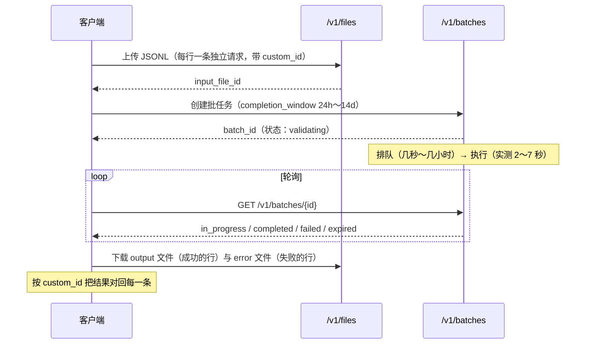
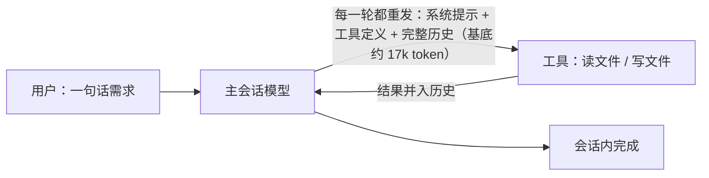
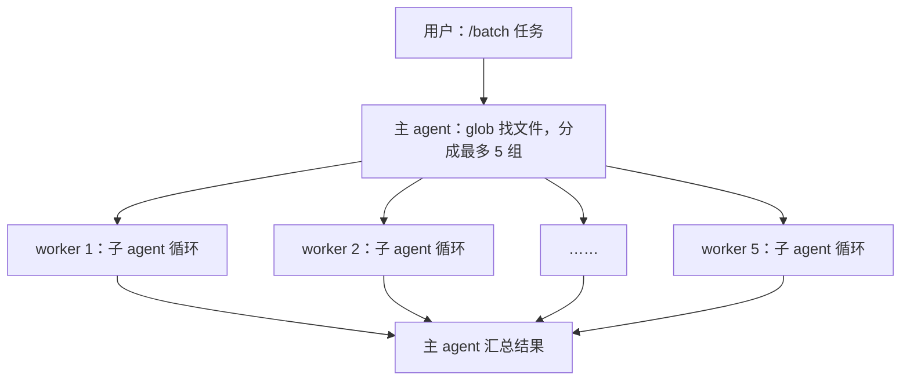
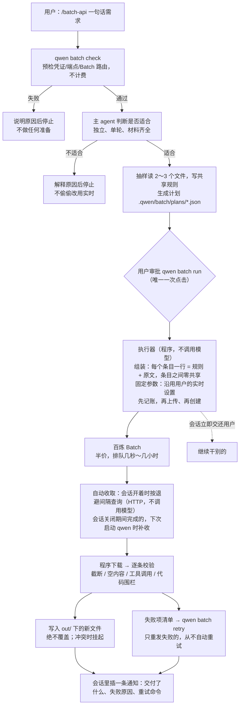

# Batch API 与 `/batch-api` 概览

状态：说明文档，面向团队扫盲；随 PR #12492 更新。设计约定见
[`2026-09-23-agent-prepared-batch-api.zh-CN.md`](./2026-09-23-agent-prepared-batch-api.zh-CN.md)，
实测数据与结论见
[`docs/verification/batch-api/results-2026-09-23.md`](../verification/batch-api/results-2026-09-23.md)。

> 一句话：**百炼 Batch API 是"半价、异步、无缓存"的批量推理通道。** qwen-code 的
> `/batch-api` 让用户用一句话把"大量彼此独立的单轮任务"（比如批量翻译文档）提交给它，
> 等待期间不占用 agent；批次完成后会话会自动收取，由程序校验后把结果写回文件。

## 1. 百炼 Batch API 是什么

接口与 OpenAI Batch 兼容：



| 维度            | Batch API                                                                                                                             | 实时 API                          |
| --------------- | ------------------------------------------------------------------------------------------------------------------------------------- | --------------------------------- |
| 价格            | 刊例价的 **50%**                                                                                                                      | 刊例价                            |
| 计费            | **只对成功请求计费**（实测失败请求费用为 0）                                                                                          | 每次调用都计费                    |
| 上下文缓存      | **不享受**（实测 `cached_tokens` 恒为 0）                                                                                             | 隐式缓存命中部分按输入价的 20% 计 |
| 延迟            | 异步，承诺 24h 内完成                                                                                                                 | 秒级                              |
| 多轮 / 工具循环 | 不行：每行都是一次性请求                                                                                                              | 可以                              |
| 单个文件的限制  | ≤ 50,000 行、≤ 500 MB、单行 ≤ 6 MB（官方指南写 1 MB，两处文档冲突，qwen-code 按 1 MB 保守处理）；一个文件只能用一个模型、一种思考模式 | —                                 |

**延迟实测**（2026-09）：

- 真正执行只要 **2–7 秒**，**等待时间基本全是排队**。
- 队列按模型分通道：qwen-plus 通常几秒就过；qwen3.7-plus 实测排过 **53 分钟**。
- 规模对照：3 行约 10 分钟，24 行约 29 分钟，1000 行约 62 分钟。
- 结论：**不能指望它快，只能指望它便宜。**

## 2. 它什么时候真的省钱

```text
设 I = 输入费用、O = 输出费用（按刊例价），h = 实时路径的缓存命中率
实时  ≈ I × (1 − 0.8h) + O
Batch ≈ 0.5 × (I + O)
输出可以忽略时，h > 62.5% 实时反而更便宜
```

| 任务形状                                             | 更划算的一方 | 原因                                             |
| ---------------------------------------------------- | ------------ | ------------------------------------------------ |
| 大量**独立**条目、共享前缀短（逐篇翻译、逐文件提取） | **Batch**    | 实时路径本来就很难命中缓存，五折是净赚           |
| 超长共享规则手册（≥ 2k token）+ 连续提交             | **实时**     | 实测第二次起缓存命中 96%                         |
| 把 agent 自己的每一轮对话交给 Batch                  | **实时**     | 实测费用是实时的 1.03 倍，还慢几个小时（已否决） |
| 只有几条                                             | **实时**     | 省下的钱覆盖不了准备成本和等待                   |

**思考模式是第一价格变量**：实测同一任务，开思考的生成费用约为不开的 160 倍；Batch 的
五折只是第二变量。

## 3. 三种执行方式的架构

### 3.1 普通 agent loop

用户直接在会话里说"把这些文档翻译一下"。



- 优点：通用、即时，能处理需要反馈的任务。
- 代价：N 篇文档至少要 N 轮来回，**每一轮都要重付整个会话的基底**。缓存能打八折，但
  总价随 N 超线性增长。

### 3.2 `/batch`（原有 skill：实时并行 worker）



- 优点：比串行快；每个 worker 只带自己那一组的上下文；能调用工具、**就地修改文件**，
  几分钟内出结果。
- 代价：仍然是**实时全价**，每个 worker 也有自己的基底开销。

### 3.3 `/batch-api`（新增：agent 准备 + Batch 执行 + 程序交付）



要点：

- **只能由用户显式触发**：模型调用不了 `/batch-api`，不会偷偷把任务换成异步。
- **等待不消耗模型**：提交后会话就交还用户；收取由会话自动完成，手动查看、重试、取消、
  清理都是普通命令，会话里加 `!` 执行，不花模型轮次。
- **钱的安全**：先落账再上传；创建请求的应答丢失时去服务商那边对账，绝不重复提交；同一
  任务同一时间只有一个命令在跑；重复收取是幂等的。

### 3.4 三者对比

|                          | agent loop               | `/batch` 并行 worker | `/batch-api`                          |
| ------------------------ | ------------------------ | -------------------- | ------------------------------------- |
| 执行者                   | 主会话模型，多轮         | 多个子 agent，多轮   | 准备：主 agent 几轮；生成：Batch 单轮 |
| 价格                     | 全价（有缓存）           | 全价（有缓存）       | 准备全价，生成**半价**                |
| 等多久                   | 秒到分钟                 | 分钟                 | 几秒到几小时（排队）                  |
| 能否调用工具、就地改文件 | 能                       | 能                   | 不能：只生成新文件                    |
| 适合                     | 需要反馈的任务、少量条目 | 等不了、量中等的改动 | 大量独立的单轮转换，能等              |

## 4. 目前怎么用

```sh
# 提交：一句话就行（需要 API key 认证，Qwen OAuth 不行）
/batch-api 把 src 下的英文文档译成中文，写到 out/ 下同名文件

# 收取：不用管。会话开着时完成就自动收取并通知；关着时完成的，下次打开 qwen 时补收
# 想手动看进度或收取（加 ! 不消耗模型）：
!qwen batch collect <task-id>

!qwen batch list                 # 找回所有任务
!qwen batch retry <task-id>      # 只重发失败的条目
!qwen batch clean <task-id>      # 删除本地记录（不会取消任何东西）
```

## 5. 自动收取（已实现）

收取是纯机械的事，由 qwen-code 包掉，只把结果告诉用户。设计约定 §3.3 原本不做常驻
进程、不让模型轮询；那条约束防的是"后台持续花模型的钱"，由程序查询和写文件不花模型的钱，
两者不冲突。

| 方案                           | 做法                                                                                                                                            | 优点                         | 缺点                                                                     |
| ------------------------------ | ----------------------------------------------------------------------------------------------------------------------------------------------- | ---------------------------- | ------------------------------------------------------------------------ |
| **① 会话内自动收取**（推荐）   | 会话开着时按退避间隔（约 1 分钟起、最长 5 分钟）查询本项目未完成的任务，只发 HTTP、不调用模型；完成后自动下载、校验、写入，并在对话里插一条通知 | 用户什么都不用做；不花模型钱 | 会话关掉就停                                                             |
| **② 下次启动时补收**（配合 ①） | 打开 `qwen` 时自动收取本项目已完成的任务并汇报                                                                                                  | 覆盖"提交完就关了终端"       | 要等下次打开才知道                                                       |
| ③ 提交后派生后台进程           | `run` 之后在后台起一个独立进程等到完成                                                                                                          | 终端关了也能收               | 孤儿进程、休眠中断、进程要带凭证；违背不做常驻进程的原则；不建议作为默认 |
| ④ 让 agent 在后台等            | skill 用后台 shell 挂着等待                                                                                                                     | 实现简单                     | 完成时要花一轮模型调用，会话关了也断；有 ① 就用不着                      |

**采用 ① + ②。** 实现：

- 挂在交互界面首次渲染后执行的 `startPostRenderPrefetches`
  （`packages/cli/src/startup/startup-prefetch.ts`）里，"检查更新"就在这里跑。启动时查
  一次，之后按退避间隔继续查。
- 通知复用"检查更新"的链路（`updateEventEmitter` + `setUpdateHandler`）：用户空闲时直接
  在对话里插一条信息，模型正在输出时先排队，等这一轮结束再显示。Ink 和 OpenTUI 两种界面
  都已接好这条链路。
- 设置项 `general.batchAutoCollect`：`deliver`（默认，收取并写入）、`notify`（只提示可收取，
  不写文件）、`off`。
- 收取本身直接调用现有的 `collectTask`（锁、幂等、不覆盖、冲突挂起都已具备），只收**当前
  项目**、**当前端点**的任务；换了账号或地域的任务跳过、不报错。
- 覆盖不到：非交互模式（`qwen -p`）、`qwen serve`、ACP / web-shell 没有不经模型的通知
  通道，第一版仍用 `qwen batch collect`。

**已定的三点（2026-09-24）：**

1. 默认自动写入；写入规则本来就不覆盖已有文件、冲突就挂起；需要时切到 `notify`。
2. 失败项**不**自动重试（重试会再花钱），通知里只给出失败原因和重试命令。
3. 默认开启。

另外，`run`（和 `retry`）提交后会等过服务端几秒的校验窗口：整批被拒（例如模型不支持
Batch）当场报出服务端原因，不再等到收取时才看到笼统的"no result line"。
