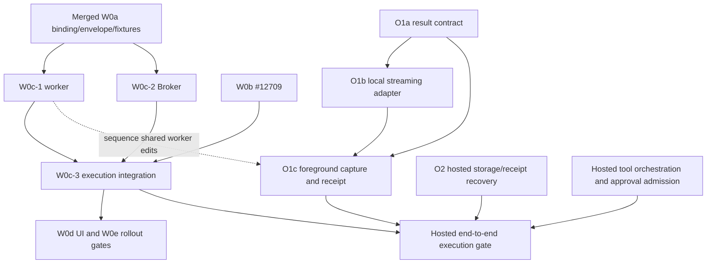

# Managed Workspace Execution and Tool Output: Next Slices

[English](2026-09-26-managed-workspace-output-next-slices.md) | [简体中文](2026-09-26-managed-workspace-output-next-slices.zh-CN.md)

Status: draft for design review, not an implementation or a capability approval.
Research baseline: `main` at [16496a71ec5a990a4f41110a9afa66d46bfbad6c](https://github.com/QwenLM/qwen-code/tree/16496a71ec5a990a4f41110a9afa66d46bfbad6c),
2026-09-26. This proposal answers the implementation questions in
[W0c #12724](https://github.com/QwenLM/qwen-code/issues/12724) and
[O1 #12723](https://github.com/QwenLM/qwen-code/issues/12723), under
[proposal #12380](https://github.com/QwenLM/qwen-code/issues/12380).
Decisions below are recommendations awaiting design-owner review. Existing
versioned contracts remain authoritative until an implementation PR explicitly
amends them with matching cross-language fixtures.

## 1. Scope and research

Prepare three independently reviewable implementation PRs: W0c-1 (worker),
W0c-2 (Broker), and O1a (output contract). Describe their integration gates so
that merging foundations cannot accidentally enable incomplete execution.
This document changes no runtime behavior, schema, route, or database.

The baseline was checked against source, the issue discussions, and the
following designs. Review comments are research leads, not proof of behavior.

- In-repository [Workspace binding](2026-09-25-managed-workspace-binding-contract.md),
  [context envelope](2026-09-25-managed-context-envelope.md), and
  [tool v2](2026-09-24-managed-runtime-tool-contract.md).
- Reference [Workspace design](https://github.com/doudouOUC/code_agent/blob/689121646cc25ca08a34508a5f5555ae15308833/qwen-code/feature/managed-agents/managed-agent-workspace-context.en.md),
  [output design](https://github.com/doudouOUC/code_agent/blob/689121646cc25ca08a34508a5f5555ae15308833/qwen-code/feature/managed-agents/managed-agent-tool-result-artifacts.md),
  and [contract closure](https://github.com/doudouOUC/code_agent/blob/689121646cc25ca08a34508a5f5555ae15308833/qwen-code/feature/managed-agents/managed-agent-contract-closure.en.md),
  pinned at `6891216`. The execution and local-output decisions needed here
  are reproduced below; hosted storage and public artifacts remain later work.

| Verified source on main                                                                                                              | Consequence for the design                                                                                                                  |
| ------------------------------------------------------------------------------------------------------------------------------------ | ------------------------------------------------------------------------------------------------------------------------------------------- |
| `packages/cli/src/serve/managed-runtime-attestation-worker.ts` accepts boot v1 and creates one executor from `workspaceCwd`          | Boot v2 needs a separate admission path and Session-owned execution contexts.                                                               |
| `managed-context-envelope.ts` validates v2/v3 records but its installation map commits without a filesystem check                    | Wiring it directly would acknowledge an unverified directory. Verification must precede the map mutation.                                   |
| `managed-workspace-binding.ts` and Java `WorkspaceRelativePath` reject all Cc controls                                               | Retain this implemented rule; the reference design's NUL-only wording is not the current code.                                              |
| Java `LocalProcessRuntimeProvisioner`, `HttpRuntimeTransport`, and `EmbeddedRuntimeBroker` use v1/v2 and a startup-global directory  | Boot, confirm, reconciliation, transport, and Session resolution all need the W0 context; changing only boot serialization is insufficient. |
| `ManagedSessionResourceStore` exposes `publish(Buffer)` and whole-file `read`; its HTTP adapter rejects more than 64 KiB             | Add a separate streaming capability. Do not impose a large-output implementation on the existing HTTP adapter in O1.                        |
| `truncation.ts` skips persistence above 50 MiB/file or 500 MiB/Session; `shell.ts` truncates before its result reaches the finalizer | The 100 MiB test needs capture independent of the legacy persistence path.                                                                  |
| `shellExecutionService.ts` bounds buffered bytes and has a non-PTY `streamRawOutput`/`raw_data` path                                 | Reuse the raw producer seam, with bounded backpressure; a final string or display callback cannot establish complete capture.               |
| Tool v2 closes its result shape and limits the body to 1 MiB; `HarnessEventProjector` drops output                                   | A new result contract is required for negotiated semantics; public projection remains O3.                                                   |

Related PRs are a snapshot, not assumed dependencies already on main:

| PR at the inspected head                                             | Status and role                                                                                                                                                                               |
| -------------------------------------------------------------------- | --------------------------------------------------------------------------------------------------------------------------------------------------------------------------------------------- |
| [#12709](https://github.com/QwenLM/qwen-code/pull/12709), `1fadbc6c` | Open W0b admission. Persists bindings and frozen config/policy references, deliberately blocks bound execution. Its design at this head also defers Agent/Bundle compatibility checks to W0c. |
| [#12713](https://github.com/QwenLM/qwen-code/pull/12713), `5aa0b705` | Open Hosted no-tool Harness. It explicitly excludes Runtime tools and worker lifecycle; it does not block W0c-1 or O1a.                                                                       |
| [#12698](https://github.com/QwenLM/qwen-code/pull/12698), `f98a8e2b` | Open dual-engine routing; integration context, not an early contract prerequisite.                                                                                                            |
| [#12358](https://github.com/QwenLM/qwen-code/pull/12358), `9d311cd0` | Open integration preview. Use as a reference, not as the base of these PRs or evidence that rollout gates passed.                                                                             |

## 2. Recommended decisions

| Question                              | Recommendation and reason                                                                                                                                                                                                                                                                                                          |
| ------------------------------------- | ---------------------------------------------------------------------------------------------------------------------------------------------------------------------------------------------------------------------------------------------------------------------------------------------------------------------------------- |
| W0c Q1: boot refusal record and retry | Keep one ready record and no new refusal format in this slice. Permit at most one automatic boot-v2 process launch per durable provision attempt; an ambiguous pre-ready exit blocks that attempt. Reconcile and prove cleanup before an explicit retry. Never downgrade to v1. A v1 peer cannot emit a new refusal record anyway. |
| W0c Q2: configuration in installation | Keep the closed context request unchanged. It binds `contextConfigRef` but does not transport configuration. W0c-3 must resolve the frozen config/policy pair, verify Agent/Bundle compatibility, and obtain separate configuration-installation evidence before activation. Missing evidence keeps execution closed.              |
| W0c Q3: control characters            | Preserve rejection of C0, DEL, and C1 in both languages. Do not expand this change to all Unicode format characters or alter the existing digest encoding.                                                                                                                                                                         |
| W0c Q4: installation retention        | Keep successful operations and immutable Session contexts for the Runtime incarnation. Bound capacity; reject new entries when full, without evicting replay evidence. Replays still work at capacity. Drain and replace only through the existing lifecycle after unresolved executions settle.                                   |
| W0c Q5: interim default and ordering  | W0c-3 waits for reviewed W0b persistence from #12709. Do not add a temporary global-default path for bound Sessions. Legacy unbound resolution stays separate. Sequence shared worker edits in W0c-1 before O1c; #12713 is not a worker-edit dependency.                                                                           |
| O1 Q1: opt-in                         | Define a new versioned result protocol and read-only capability admission, with O1a specifying it and O1c wiring it. Leave boot/ready and tool v2 closed. An arbitrary `responseParts` item cannot prove an old peer understands capture and receipt requirements.                                                                 |
| O1 Q2: storage ownership              | Add a capability-specific local streaming adapter beside the existing resource store. Reuse `DurableRef` and the controlled Session resource root; preserve existing Buffer APIs and the HTTP adapter's honest size refusal.                                                                                                       |
| O1 Q3: completeness                   | First admit foreground non-PTY Shell with required complete capture. Resource shortage before launch refuses execution. Capture failure after launch records the physical outcome separately and blocks result acceptance/model continuation; it never reruns the command.                                                         |
| O1 Q4: ordering                       | O1a is independent of W0c-1/2. O1b follows O1a. O1c follows O1a/O1b and the W0c-1 worker integration; hosted end-to-end enablement additionally needs the full W0c integration and O2.                                                                                                                                             |

The one-launch policy trades automatic startup recovery for an explicit,
bounded failure mode. It must be enforced through the existing durable Broker
binding/provision state, not a counter reset by every warm request or restart.
An explicit retry is a reconciled lifecycle action, not a new Session, Prompt,
or execution identity. Use the existing `RECOVERY_BLOCKED` binding state for
boot-v2 incompatibility or ambiguous pre-ready failure, not `FAILED`, which
allows later callers to allocate another generation. The existing persisted
resource handle precedes process launch: after a crash, a binding with that
handle but no attested lease must reconcile or block, never launch again.
Even a crash between persisting the handle and spawning trades availability
for safety. W0c-2 must test this boundary and prevent repeated warm requests
or a restarted Broker from automatically minting a new attempt. Repair requires
proof that the prior process cannot execute and an explicit authorized
lifecycle transition; this proposal adds no public retry endpoint.

## 3. W0c-1: worker installation and execution

### Protocol and route ownership

Dispatch boot by its declared version, then validate the exact corresponding
key set. Under boot v2, serve ready v2, attestation v3 and context installation;
attestation v2 returns 404. Under boot v1, retain existing behavior. Update the
raw route allowlist together with registration and the fake worker used by Java.

| Surface                                | Ownership and checks                                                                                                                          |
| -------------------------------------- | --------------------------------------------------------------------------------------------------------------------------------------------- |
| stdin boot / stdout ready              | Process-global bootstrap; bounded input/output, exact key sets, no model credentials or prompt.                                               |
| `/internal/managed-runtime/v3/attest`  | Selected-runtime identity; compare against immutable boot after syntax validation, with bearer and lease checks.                              |
| `/internal/managed-runtime/v3/context` | Selected-runtime installation for a Session; match the boot Workspace and the Session's immutable binding.                                    |
| Tool v2 execute                        | Live-session-owner dispatch inside the selected Runtime; resolve and pin that Session's verified context before tool entry.                   |
| Tool v2 status/cancel                  | Original-execution owner; query/cancel the pinned executor even if its directory is now unavailable. Never redirect to a replacement Runtime. |

Use the existing 32 KiB boot and 16 KiB context-body bounds and error table.
Preserve validation order: shape and binding rules, digest, Workspace identity,
operation replay/conflict, Session conflict, physical validation, then commit.
Malformed bytes, headers, encoded route aliases, and methods must exercise the
real HTTP gate rather than only the pure contract helper.

### Verify before installing

For a new installation, validate the native-platform absolute root and resolve
`mountRoot + cwdRelative` without creating directories. Verify directory type,
access, canonical containment, symlink resolution, and the root identity
anchored by the trusted storage resolver. Prefix-string comparisons are
insufficient; a sibling such as `/work/project-other` is outside `/work/project`.
The portable boot grammar accepting a Windows path does not make it usable on
a POSIX worker.

Pin the resolved root/directory identity with the installation. Revalidate at
the execution boundary. A missing or replaced directory, escaping symlink, or
unverifiable mount returns 409 `managed_context_unavailable`, records no new
installation, and executes no tool. Root device/inode observations help detect
replacement but do not prove an opaque `storageId`; that association comes from
the trusted resolver/provider. Arbitrary Shell isolation additionally requires
restricted mounts or an equivalent execution boundary. `realpath` alone is not
a sandbox or a proof against an adversarial check/use race.

Refactor the in-memory installation helper minimally so validation and physical
verification happen before atomic recording. Concurrent installations must
recheck operation/Session conflicts at commit after asynchronous filesystem
work. Do not acknowledge and later attempt to roll back the current map.
An exact replay returns its original receipt even after a directory disappears;
the execution gate still revalidates and refuses tool entry.

### Context, journal, and capacity

Construct per-Session tool configuration from the verified effective cwd. Never
switch shared `process.chdir()` or mutate another Session's Config. Pin the
Session/context digest, Runtime incarnation/lease and original tool reference
as an internal invocation binding. All subsequent execute/status/cancel paths
must use that original binding, with conflict detection across Session IDs.
Do not add cwd or context fields to tool v2 in place.

Keep tool starting cwd distinct from the Workspace storage root used by file
history and write coordination. Installation is evidence of a directory
binding, not authorization, configuration readiness, or the Workspace turn
lease. Those gates are assembled by W0c-3 before product execution is enabled.

Bound both installed Sessions and operation receipts. The deployment chooses
finite limits; implementation tests use small explicit limits to exercise full
capacity, same-key replay, and same-Session/new-operation accounting. Reject
capacity exhaustion before mutation using `managed_context_unavailable`.
Do not TTL-delete or LRU-evict identity evidence while an incarnation can
receive retries. Worker capacity retirement cannot kill an unresolved tool.

## 4. W0c-2 and W0c-3: Broker and integration

W0c-2 introduces explicit internal provision context for boot v2, supplied by
a trusted resolver. It carries Workspace storage/mount identity separately from
the Session binding. Do not derive a Hosted Workspace ID from a path. Keep
`cwdRelative`, `contextRevision`, and per-Session configuration out of shared
Runtime placement identity; use the verified Workspace root for placement.
Persist enough versioned provision evidence for confirm/reconcile to reproduce
the same v3 attestation, never current defaults or an inferred v1 fallback.

The implementation must trace every consumer: provision request/seed, provider
resource handle, durable binding reconstruction, boot writer, ready reader,
attest/confirm/reconcile, install client, tool dispatch and lifecycle cleanup.
The reviewed envelope did not change `RuntimeScope` or its SQL keys; any newly
required persisted field or handle version needs an explicit migration and
mixed-reader test in W0c-2, not an incidental key change.

Validate identifiers, safe numeric epoch bounds, canonical decimal strings,
well-formed Session IDs and non-ASCII-preserving JSON before starting a process
or sending a request. Verify ready's exact key set and loopback URL, then v3
attestation, then every installation receipt field against the original
request and receiving incarnation. Unsupported ready or v3 route responses
fail capability admission. Fake-worker success is not real-worker evidence;
land with both fixture tests and a real Java-to-TypeScript process test.

W0c-3 joins W0b persistence and these two components. It must:

1. Read the original Session binding, frozen config/policy pair, and current
   execution authorization; check Registry state, generation and storage.
2. Resolve storage identity through administrator-controlled configuration or
   a provider, never request paths. Bind physical mount evidence to the
   selected Runtime.
3. Validate the frozen configuration against Agent/Bundle and install it using
   the existing configuration authority. Never reread current Registry config
   or Harness-host cwd as a substitute. If the existing installation protocol
   cannot supply the evidence, keep the bound execution gate closed and track
   that integration explicitly.
4. Verify context/config receipts and activation identity, then hold the
   ordinary-tool Workspace turn lease from initial snapshot through tool
   settlement and history commit. Separate Runtime processes do not serialize
   writes to shared files.
5. Open bound execution only after these checks. Preserve authorized history
   and original-execution reconciliation when new execution is blocked.

W0c-1/2 can land before W0b because they are foundations with explicit test
callers. They do not remove #12709's product execution guards or advertise
`workspace_context`. W0e still owns restart/reclamation rollout evidence.

## 5. O1a: a contract with named consumers

Define `ToolResultManifestV1` as immutable resource content referenced by the
original execution outcome. Reuse the existing
`DurableRef { resourceId, kind, schemaVersion, byteLength, digest }` unchanged,
including its digest encoding. Raw captured bytes, the exact post-Hook/model
message, and a sanitized public preview remain distinct representations.

| Proposed data                                                                                                      | Producer and reader                                                                                                                                                                                                                                                                                                                |
| ------------------------------------------------------------------------------------------------------------------ | ---------------------------------------------------------------------------------------------------------------------------------------------------------------------------------------------------------------------------------------------------------------------------------------------------------------------------------- |
| Manifest version/revision; Session and original execution identity, invocation digest, original binding generation | The admitted invocation supplies identity; O1c receipt acceptance and recovery compare it. Define an explicit mapping from Runtime `sessionId/promptId/callId/argsDigest` and Broker execution identity rather than assuming `callId` is globally unique. Tenant scope comes from trusted admission, never a caller's storage key. |
| `executionStatus`, including an explicit unknown outcome                                                           | Original executor/reconciliation supplies the fact; O1c must preserve it when storage fails. Do not copy unknown into tool v2's narrower enum.                                                                                                                                                                                     |
| `captureStatus` (`pending/complete/partial/unavailable`), reason and `missingRanges` when known                    | O1b sealing/verification supplies coverage; O1c required-capture acceptance reads it. Unknown tail length is explicit, never fabricated as an exact range.                                                                                                                                                                         |
| `captureScope`, `sourceVersion`, `upstreamTruncated`, capture-policy version                                       | Producer declares what was observed; O1c checks whether it satisfies the admitted scope. PTY transcript and separate pipes have different semantics.                                                                                                                                                                               |
| Ordered stream/content descriptors: ID, MIME, byte length, SHA-256, resource or paged segment-manifest reference   | O1b publishes and verifies; O1c receipt/reference validation and range readers consume them. Bound root/page sizes and validate reference closure.                                                                                                                                                                                 |
| Segment identity, ordinal, byte offsets, EOF/final digest, verified prefix                                         | O1b idempotent publication and fixed-revision reads consume them. No offset/ordinal gaps may masquerade as complete capture.                                                                                                                                                                                                       |

O1a must pin field names, encodings, closed unions, error outcomes, size bounds
and positive/negative fixtures in one shared schema. Use TypeScript and Java
fixture consumers with independent expected digests. Pure schema validation
does not prove idempotent publication, capability refusal, or bounded memory;
those need stateful contract cases and later O1b/O1c implementation tests.

Keep `deliveryStatus` as a view of the existing receipt/reconciliation state,
not a mutable flag inside an immutable manifest claiming its own acceptance.
Define `previewTruncated` with the bounded preview representation; do not force
a public preview into O1a before O3 has a producer/reader. These are explicit
refinements to #12723's broad field list, not deletion of the orthogonal-state
requirement. Every field shipped by O1a needs a named O1b/O1c consumer; defer
public Artifact, projection and retention-only fields to their owning slice.

`ToolArtifact` remains optional presentation metadata. A local path, external
URL, or `managedId` does not establish capture durability. A future O3 projector
may create an authorized Artifact from an accepted manifest descriptor; it must
not authorize downloads merely because a tool emitted `artifacts` or
`resultFilePaths`. The manifest neither replaces `llmContent` nor reconstructs
the model's exact consumed message from a UI preview.

### Protocol admission

Propose `managed-tool-result/1` with new tool v3 execute/status/cancel envelopes
and a read-only capability probe under the same authenticated Runtime route
family. O1a must specify the exact paths and shapes together; this document
does not reserve a public API. The capability response binds to the attested
Runtime incarnation and lease and states the supported capture scope/policy.
Probe and compare before execute, not by trying an execution against an old
peer. Missing capability, incompatible policy or a 404 refuses admission.
Never fall back to tool v2 after selecting required capture.

Do not append fields to closed boot/ready, `managed-context/1`, or tool v2.
Do not hide the reference inside unconstrained `responseParts`: an old peer
could accept execution and ignore the receipt requirement. O1a can land as a
contract with the production capability disabled; O1c owns route wiring and
proof that old peers are rejected before a side effect.

## 6. O1b/O1c constraints required by the contract

O1b implements a local streaming capability alongside Buffer publish/read.
Scope segment identity by the admitted Session/capture/stream/ordinal, compute
digests at the receiver, and persist immutable segments plus a replay index.
Identical re-publication returns the original reference across process restart;
different bytes conflict and are quarantined. A temporary file plus rename
alone does not provide this idempotency. Seal only after EOF, contiguous
coverage, verified total length and final digest. Fixed-revision range reads
verify the containing segments with bounded buffers; they never return another
revision or materialize the entire resource.

O1c initially captures foreground non-PTY stdout/stderr at the raw producer
boundary, before the service's buffered-byte cap and Shell display truncation.
Reuse `streamRawOutput` where suitable, but its synchronous callback is not an
asynchronous backpressure guarantee. The implementation must pause/resume
supported pipes or cancel and drain on a bounded-queue overflow; it cannot
enqueue unbounded writes. Preserve order within each pipe without claiming a
total ordering between stdout and stderr. PTY/background/Monitor capture stays
unadvertised until its own byte and lifecycle tests pass.

Use a controlled spool independent of the legacy 50 MiB/500 MiB limits; do not
raise those global limits. Reuse a producer file only after proving its declared
scope is complete, sealed, and digest-verifiable. A result string, empty
`persistedOutputFiles`, or textual filename marker is insufficient. Reserve
finite spool/concurrency capacity before launch; exhausting it after launch
retains the verified prefix and original physical outcome, then blocks delivery.

Publish the manifest and reference closure before committing the original tool
receipt through the existing Session authority. Match execution identity and
manifest digest on the ACK. Lost ACK queries the original receipt; it does not
execute again. Discard a disposable spool only when a verified retained copy
and matching receipt exist. In O1, retained local resources have no automatic
GC; shared/object storage and publication holds remain O2. Local tests prove
replacement on retained storage, not cross-host survival.

The reference design's 4 MiB segments, two in-flight segments and 100 MiB output
are useful test inputs, not shipped defaults. Bound aggregate queues and spool
across concurrent captures as well as each individual stream. Report memory,
disk, integrity and replay observations separately from code/test line counts.

## 7. PR dependencies and landing order

Solid edges are prerequisites for the stated completion gate; the dotted edge
is the proposed development/landing order. W0c-1 and W0c-2 can develop in
parallel against the merged fixtures, but their integration test needs both.
O1a can proceed alongside them. O1b can begin once its O1a interface is stable.
O1c local validation does not require W0b or a Java product deployment.
W0d UI development can use reviewed admission contracts earlier; public rollout
still waits for complete execution and recovery gates.
The graph covers this W0/O intersection, not the entire A-H roadmap. Hosted
tool orchestration and approval admission remain separate prerequisites;
#12713's no-tool Harness alone does not satisfy them. The integration preview
cannot be used to bypass their review and fault tests.

| PR         | Scope limit                                                              | Completion evidence                                                                                                          |
| ---------- | ------------------------------------------------------------------------ | ---------------------------------------------------------------------------------------------------------------------------- |
| This draft | Bilingual research and recommended decisions                             | Source/link/structure review; no runtime claim.                                                                              |
| W0c-1      | Worker protocol, verification, Session dispatch, bounded installations   | Real HTTP fixtures, two cwd contexts, refusal without tool entry, original status/cancel, concurrent installation conflicts. |
| W0c-2      | Provision/attest/install clients, durable retry bound, identity encoding | Cross-language conformance, old-worker refusal, exact receipts, real worker process integration after W0c-1.                 |
| O1a        | Shared result schema, semantics, TS/Java consumers                       | Closed-shape and semantic fixture matrix; no spool or product enablement.                                                    |
| W0c-3      | W0b-backed resolver, frozen config, activation/write lease               | Authorized two-Workspace Read/Write/Shell and shared-write serialization; no global fallback.                                |
| O1b/O1c    | Separate adapter and capture integration PRs                             | Verified 100 MiB local retention, bounded queues, original-receipt recovery, no duplicate command.                           |

## 8. Acceptance and review gates

| Area               | Required negative/concurrency evidence                                                                                                                                                                                               |
| ------------------ | ------------------------------------------------------------------------------------------------------------------------------------------------------------------------------------------------------------------------------------ |
| Mixed versions     | Boot v2 against a v1 worker; extra ready keys; v2 attestation on a v2 boot; unsupported result capability. Each fails before tool entry, without downgrade or an unbounded launch loop.                                              |
| Installation       | Wrong digest/Workspace, same operation with different content, conflicting Session, concurrent different installs, failed filesystem check, capacity exhaustion and replay at capacity. No failed attempt leaves an installed entry. |
| Physical ownership | Missing directory, escaping/replaced symlink, same pathname with different storage, changed generation and revoked access. Include replacement between validation and execution; unsupported isolation keeps enablement closed.      |
| Execution          | Two Workspaces and two child directories, separate Config instances, shared-Workspace writes, stale activation receipts, status/cancel after directory removal. No cross-Session dispatch or primary/global fallback.                |
| Output             | Zero and 100 MiB outputs, non-UTF-8 bytes, split UTF-8, independent pipes, gaps, missing EOF, corrupt digest and conflicting segment replay. Completeness reflects captured scope, not tool success.                                 |
| Failure boundaries | Crash before seal, after publication, after authority commit and before ACK; disk full; slow receiver; cancellation with descendant-held pipes. Preserve original identity and never re-execute a side effect.                       |
| Persistence        | Restart Java for the launch bound and Session binding; restart the local adapter for segment replay; replace Runtime/Harness with retained resources. Do not label local checks cross-host recovery.                                 |

Implementation PRs run repository build/typecheck and focused package tests,
plus the integration/fault tests relevant to their slice. The design PR only
validates documentation formatting, links, bilingual parity and source claims;
it does not claim these acceptance scenarios have been executed.

Before implementation review completes, the design owner must accept or amend:
the bounded boot-failure policy, configuration evidence boundary, incarnation
retention/capacity policy, new result-protocol admission, required-capture
policy, and deferred projection fields. W0c-2 must verify the durable
`RECOVERY_BLOCKED` transition; W0c-3 must name the actual configuration and physical-isolation
evidence; O1a must fix exact protocol shapes and finite bounds. These are
concrete review items for the follow-up PRs, not claims that this draft ships
multi-Workspace execution or durable hosted output.
