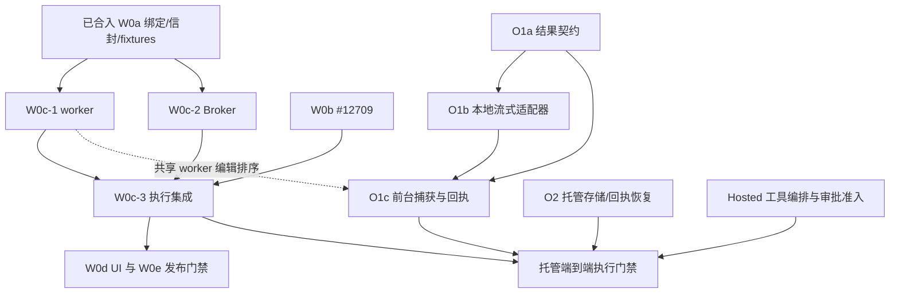

# Managed Workspace 执行与工具输出：后续切片

[English](2026-09-26-managed-workspace-output-next-slices.md) | [简体中文](2026-09-26-managed-workspace-output-next-slices.zh-CN.md)

状态：供设计评审的草案，不代表已实现或已批准开放能力。调研基线：2026-09-26 的
`main`，提交 [16496a71ec5a990a4f41110a9afa66d46bfbad6c](https://github.com/QwenLM/qwen-code/tree/16496a71ec5a990a4f41110a9afa66d46bfbad6c)。
本文回答 [提案 #12380](https://github.com/QwenLM/qwen-code/issues/12380) 下
[W0c #12724](https://github.com/QwenLM/qwen-code/issues/12724) 与
[O1 #12723](https://github.com/QwenLM/qwen-code/issues/12723) 的实现问题。
以下决策均为等待设计负责人评审的建议。在实现 PR 通过配套的跨语言 fixture
明确修订之前，现有带版本契约仍为准。

## 1. 范围与调研

准备三个可独立评审的实现 PR：W0c-1（worker）、W0c-2（Broker）和
O1a（输出契约）。说明它们的集成门禁，避免基础组件合入后意外启用尚未完整的执行链路。
本文不修改运行时行为、schema、路由或数据库。

基线核查覆盖源码、issue 讨论和以下设计。评审评论仅作为调研线索，不作为行为证据。

- 仓库内的 [Workspace 绑定](2026-09-25-managed-workspace-binding-contract.zh-CN.md)、
  [上下文信封](2026-09-25-managed-context-envelope.zh-CN.md) 和
  [tool v2](2026-09-24-managed-runtime-tool-contract.zh-CN.md)。
- 固定在 `6891216` 的参考
  [Workspace 设计](https://github.com/doudouOUC/code_agent/blob/689121646cc25ca08a34508a5f5555ae15308833/qwen-code/feature/managed-agents/managed-agent-workspace-context.en.md)、
  [输出设计](https://github.com/doudouOUC/code_agent/blob/689121646cc25ca08a34508a5f5555ae15308833/qwen-code/feature/managed-agents/managed-agent-tool-result-artifacts.md) 和
  [契约闭合](https://github.com/doudouOUC/code_agent/blob/689121646cc25ca08a34508a5f5555ae15308833/qwen-code/feature/managed-agents/managed-agent-contract-closure.en.md)。
  本文重述本阶段所需的执行与本地输出决策；托管存储与公共产物仍属于后续工作。

| 已核实的 main 源码                                                                                                   | 对设计的影响                                                                                |
| -------------------------------------------------------------------------------------------------------------------- | ------------------------------------------------------------------------------------------- |
| `packages/cli/src/serve/managed-runtime-attestation-worker.ts` 接受 boot v1，并基于 `workspaceCwd` 创建唯一执行器    | boot v2 需要独立准入分支和归属各 Session 的执行上下文。                                     |
| `managed-context-envelope.ts` 校验 v2/v3 记录，但 installation map 未检查文件系统便提交                              | 直接接入会确认未验证的目录；必须先验证再修改 map。                                          |
| `managed-workspace-binding.ts` 和 Java `WorkspaceRelativePath` 拒绝所有 Cc 控制字符                                  | 沿用已实现的规则；参考设计中仅拒绝 NUL 的描述不是当前代码。                                 |
| Java `LocalProcessRuntimeProvisioner`、`HttpRuntimeTransport`、`EmbeddedRuntimeBroker` 使用 v1/v2 和启动时的全局目录 | boot、confirm、reconcile、transport 与 Session 解析都需要 W0 上下文；只改 boot 序列化不够。 |
| `ManagedSessionResourceStore` 提供 `publish(Buffer)` 和整文件 `read`；HTTP 适配器拒绝超过 64 KiB 的资源              | 新增独立流式能力，不在 O1 强迫现有 HTTP 适配器实现大输出。                                  |
| `truncation.ts` 超过单文件 50 MiB 或 Session 500 MiB 时跳过持久化；`shell.ts` 在结果抵达 finalizer 前截断            | 100 MiB 验收需要独立于旧持久化路径的捕获。                                                  |
| `shellExecutionService.ts` 限制缓冲字节数，并有非 PTY 的 `streamRawOutput`/`raw_data` 路径                           | 复用原始生产者接缝，并实现有界背压；最终字符串或显示回调不能证明完整捕获。                  |
| tool v2 的结果形状封闭且响应体上限为 1 MiB；`HarnessEventProjector` 丢弃输出                                         | 协商捕获语义需要新的结果契约；公共投影仍属于 O3。                                           |

相关 PR 是调研时的快照，不能当作已经在 main 上的依赖：

| PR 与检查的 head                                                     | 状态与作用                                                                                                                               |
| -------------------------------------------------------------------- | ---------------------------------------------------------------------------------------------------------------------------------------- |
| [#12709](https://github.com/QwenLM/qwen-code/pull/12709)，`1fadbc6c` | 开放中的 W0b 准入。持久化绑定和冻结的 config/policy 引用，并刻意阻止绑定会话执行。该 head 的设计还把 Agent/Bundle 兼容性校验延后到 W0c。 |
| [#12713](https://github.com/QwenLM/qwen-code/pull/12713)，`5aa0b705` | 开放中的 Hosted 无工具 Harness。明确排除 Runtime 工具与 worker 生命周期，不阻塞 W0c-1 或 O1a。                                           |
| [#12698](https://github.com/QwenLM/qwen-code/pull/12698)，`f98a8e2b` | 开放中的双引擎路由；是集成背景，不是早期契约的前置条件。                                                                                 |
| [#12358](https://github.com/QwenLM/qwen-code/pull/12358)，`9d311cd0` | 开放中的集成预览。作为参考，不作为这些 PR 的基线，也不能证明发布门禁已经通过。                                                           |

## 2. 建议决策

| 问题                          | 建议及理由                                                                                                                                                                                                                        |
| ----------------------------- | --------------------------------------------------------------------------------------------------------------------------------------------------------------------------------------------------------------------------------- |
| W0c Q1：boot 拒绝记录与重试   | 本切片保留唯一 ready 记录，不新增拒绝格式。每个持久化 provision 尝试最多自动启动一次 boot-v2 进程；ready 前的模糊退出阻塞该尝试。显式重试前先 reconcile 并证明清理完成，绝不降级到 v1。只支持 v1 的对端本来也无法输出新拒绝记录。 |
| W0c Q2：installation 携带配置 | 保持封闭的 context 请求不变。它绑定 `contextConfigRef`，不传输配置。W0c-3 必须解析冻结的 config/policy 对、验证 Agent/Bundle 兼容性，并在激活前取得独立的配置安装证据。证据缺失时保持执行门禁关闭。                               |
| W0c Q3：控制字符              | 两种语言都继续拒绝 C0、DEL 和 C1。不扩大到所有 Unicode 格式字符，也不修改现有摘要编码。                                                                                                                                           |
| W0c Q4：installation 保留     | 在整个 Runtime incarnation 内保留成功操作和不可变 Session 上下文。容量有界；满额时拒绝新条目，不驱逐重放证据。满额后重放仍可成功。只有未决执行已结算，才能通过现有生命周期排空并替换。                                            |
| W0c Q5：临时默认与顺序        | W0c-3 等待 #12709 中经评审的 W0b 持久化。不为绑定会话添加临时全局默认路径。旧的未绑定解析独立保留。共享 worker 改动按 W0c-1 先、O1c 后落地；#12713 不构成 worker 编辑依赖。                                                       |
| O1 Q1：启用方式               | 定义新的带版本结果协议与只读能力准入，由 O1a 定义、O1c 接线。boot/ready 和 tool v2 保持封闭。任意 `responseParts` 条目不能证明旧对端理解捕获和回执要求。                                                                          |
| O1 Q2：存储归属               | 在现有资源存储旁增加按能力提供的本地流式适配器。复用 `DurableRef` 与受控 Session 资源根目录，保留 Buffer API 和 HTTP 适配器真实的尺寸拒绝。                                                                                       |
| O1 Q3：完整性                 | 首先准入要求完整捕获的前台非 PTY Shell。启动前资源不足则拒绝执行；启动后捕获失败则独立记录物理结果，阻止结果接受与模型继续，绝不重跑命令。                                                                                        |
| O1 Q4：顺序                   | O1a 独立于 W0c-1/2。O1b 依赖 O1a。O1c 在 O1a/O1b 和 W0c-1 worker 集成之后；托管端到端启用还需要完整 W0c 集成与 O2。                                                                                                               |

单次启动策略以显式、有界的失败模式换取较少的自动启动恢复。约束必须通过现有持久化
Broker binding/provision 状态实现，不能使用每次 warm 请求或重启便重置的计数器。
显式重试是经 reconcile 的生命周期动作，不是新建 Session、Prompt 或 execution 标识。
boot-v2 不兼容或 ready 前模糊失败使用现有 `RECOVERY_BLOCKED` binding 状态，
不使用允许后续调用方分配新 generation 的 `FAILED`。现有 resource handle 在进程启动前持久化：
崩溃后若绑定有该 handle 却无已 attested 的 lease，就必须 reconcile 或阻塞，不能再次启动。
即使崩溃发生在 handle 持久化和启动进程之间，也选择牺牲可用性以保持安全。
W0c-2 必须测试这个边界，并阻止重复 warm 请求或 Broker 重启自动创建新尝试。
修复需要证明旧进程无法执行，并通过显式授权的生命周期转换；本提案不增加公共重试接口。

## 3. W0c-1：worker 安装与执行

### 协议与路由归属

先按声明的版本分派 boot，再验证对应的完整键集合。boot v2 下提供 ready v2、
attestation v3 和 context installation；attestation v2 返回 404。boot v1 保持现有行为。
同时更新原始路由允许列表、路由注册和 Java 测试使用的假 worker。

| 接口                                   | 归属与校验                                                                                |
| -------------------------------------- | ----------------------------------------------------------------------------------------- |
| stdin boot / stdout ready              | 进程全局启动；输入输出有界、完整键集合，不携带模型凭据或 Prompt。                         |
| `/internal/managed-runtime/v3/attest`  | 所选 Runtime 身份；语法验证后对照不可变 boot，并校验 bearer 与 lease。                    |
| `/internal/managed-runtime/v3/context` | 所选 Runtime 中的 Session 安装；匹配 boot Workspace 与 Session 的不可变绑定。             |
| tool v2 execute                        | 所选 Runtime 内的当前 Session owner 分派；工具入口前解析并固定该 Session 已验证的上下文。 |
| tool v2 status/cancel                  | 原始执行 owner；即使目录不可用也查询/取消固定的执行器，绝不重定向到替代 Runtime。         |

沿用现有 32 KiB boot、16 KiB context 请求/响应体上限及错误表。保留校验顺序：形状与绑定规则、
摘要、Workspace 身份、操作重放/冲突、Session 冲突、物理验证、提交。
畸形字节、请求头、编码后的路由别名与请求方法必须通过真实 HTTP 门禁测试，不能只测纯契约函数。

### 先验证再安装

新 installation 先验证本机平台的绝对根路径，在不创建目录的前提下解析
`mountRoot + cwdRelative`。检查目录类型、访问权限、规范化后的包含关系、符号链接解析，
以及由可信存储解析器锚定的根身份。字符串前缀比较不够，例如 `/work/project-other`
不属于 `/work/project`。可移植 boot 语法允许 Windows 路径，不代表 POSIX worker 能使用它。

installation 固定解析后的根/目录身份，并在执行边界再次验证。目录缺失或被替换、符号链接越界、
挂载无法验证时返回 409 `managed_context_unavailable`，不记录新 installation，也不执行工具。
根的 device/inode 观测有助于发现替换，但不能证明不透明的 `storageId`；这个关联来自可信
resolver/provider。任意 Shell 的隔离还需要受限挂载或等价执行边界。单靠 `realpath`
不是沙箱，也不能证明抵抗恶意的检查与使用时序竞争。

最小调整内存 installation helper，让验证与物理检查发生在原子记录之前。异步文件系统检查后，
并发安装在提交时必须重新检查 operation/Session 冲突。不能先确认、再尝试回滚当前 map。
精确重放即使在目录消失后也返回原回执；执行门禁仍会重新验证并拒绝工具入口。

### 上下文、执行日志与容量

根据已验证的有效 cwd 创建每个 Session 的工具配置。绝不切换共享 `process.chdir()`，
也不修改另一个 Session 的 Config。把 Session/context digest、Runtime incarnation/lease
和原始工具引用固定为内部 invocation binding。后续 execute/status/cancel 都使用该原始绑定，
并检测跨 Session ID 的冲突。不在 tool v2 中原地增加 cwd 或 context 字段。

区分工具起始 cwd 与文件历史、写入协调使用的 Workspace 存储根。
installation 只证明目录绑定，不证明授权、配置就绪或 Workspace turn lease。
W0c-3 在产品执行启用前组装这些门禁。

同时限制已安装 Session 和操作回执的数量。部署选择有限上限；实现测试用显式的小上限覆盖满额、
同 key 重放以及同 Session/新 operation 的计数。容量耗尽在修改状态前以
`managed_context_unavailable` 拒绝。incarnation 仍能接收重试时，不通过 TTL 或 LRU
删除身份依据。worker 因容量退役不能杀死未决工具。

## 4. W0c-2 与 W0c-3：Broker 和集成

W0c-2 引入由可信 resolver 提供的显式内部 boot-v2 provision 上下文。
Workspace 存储/挂载身份与 Session 绑定分开传递，不从路径派生 Hosted Workspace ID。
`cwdRelative`、`contextRevision` 与每 Session 配置不进入共享 Runtime 放置身份；
放置使用已验证的 Workspace 根。持久化足够的带版本 provision 证据，让 confirm/reconcile
重建相同的 v3 attestation，绝不使用当前默认值或推断 v1 回退。

实现必须追踪全部消费方：provision request/seed、provider resource handle、持久化绑定重建、
boot writer、ready reader、attest/confirm/reconcile、install client、工具分派与生命周期清理。
已评审的信封未改 `RuntimeScope` 或其 SQL key；任何新增的持久化字段或 handle 版本都需要在
W0c-2 显式说明迁移和混合 reader 测试，不能顺手更改 key。

启动进程或发送请求之前，验证标识符、安全数值 epoch 范围、规范十进制字符串、完整 Unicode
Session ID，以及保留非 ASCII 字符的 JSON 编码。验证 ready 的完整键集合和 loopback URL，
再验证 v3 attestation，最后对照原请求和接收 incarnation 验证 installation receipt 的每个字段。
不支持的 ready 或 v3 路由响应导致能力准入失败。假 worker 成功不等于真实 worker 证据；
提交时需要 fixture 测试，以及真实 Java 到 TypeScript 进程集成测试。

W0c-3 连接 W0b 持久化与上述两个组件，必须完成：

1. 读取原 Session 绑定、冻结的 config/policy 对及当前执行授权，检查 Registry 状态、generation
   和 storage。
2. 通过管理员控制的配置或 provider 解析存储身份，不使用请求路径。将物理挂载证据绑定到所选 Runtime。
3. 验证冻结配置与 Agent/Bundle 的兼容性，通过现有配置权威安装。不能用当前 Registry 配置或
   Harness 主机 cwd 替代。若现有安装协议不能提供所需证据，保持绑定执行门禁关闭，并显式跟踪该集成。
4. 验证 context/config 回执与 activation 身份，再从初始快照起持有普通工具的 Workspace turn lease，
   直至工具结算及历史提交。不同 Runtime 进程不会自动串行化共享文件写入。
5. 完成上述校验后才开放绑定执行。新执行被阻止时，保留已授权历史读取和原始执行 reconcile。

W0c-1/2 是有显式测试调用方的基础组件，可以先于 W0b 合入。它们不移除 #12709 的产品执行保护，
也不广播 `workspace_context`。重启/回收的发布证据仍归 W0e。

## 5. O1a：具有明确消费方的契约

`ToolResultManifestV1` 是由原始执行结果引用的不可变资源内容。原样复用现有
`DurableRef { resourceId, kind, schemaVersion, byteLength, digest }`，包括摘要编码。
原始捕获字节、经过 Hook 后实际提供给模型的消息，以及脱敏公共预览保持为不同表示。

| 建议数据                                                                                  | 生产方与读取方                                                                                                                                                                                                        |
| ----------------------------------------------------------------------------------------- | --------------------------------------------------------------------------------------------------------------------------------------------------------------------------------------------------------------------- |
| manifest version/revision；Session 与原执行身份、invocation digest、原 binding generation | 已准入 invocation 提供身份；O1c 回执接受与恢复进行比较。明确 Runtime `sessionId/promptId/callId/argsDigest` 与 Broker execution 身份的映射，不假设 `callId` 全局唯一。tenant scope 来自可信准入，而非调用方存储 key。 |
| `executionStatus`，包含显式 unknown 结果                                                  | 原始执行器/reconcile 提供事实；O1c 在存储失败时保留它。不把 unknown 塞进 tool v2 更窄的枚举。                                                                                                                         |
| `captureStatus`（`pending/complete/partial/unavailable`）、原因、已知时的 `missingRanges` | O1b 封存/验证提供覆盖情况；O1c 的完整捕获接受策略读取它。未知尾部长度必须显式表达，不伪造精确区间。                                                                                                                   |
| `captureScope`、`sourceVersion`、`upstreamTruncated`、capture-policy version              | 生产者声明观测范围；O1c 检查是否满足准入范围。PTY transcript 与分离管道具有不同语义。                                                                                                                                 |
| 有序流/内容描述：ID、MIME、字节数、SHA-256、资源或分页 segment-manifest 引用              | O1b 发布并验证；O1c 回执/引用校验和区间 reader 消费。限制 root/page 尺寸并验证引用闭包。                                                                                                                              |
| segment identity、ordinal、字节偏移、EOF/最终摘要、已验证前缀                             | O1b 幂等发布与固定 revision 读取消费。偏移/序号缺口不得伪装成完整捕获。                                                                                                                                               |

O1a 必须在共享 schema 中固定字段名、编码、封闭联合类型、错误结果、尺寸上限和正反例 fixture。
TypeScript 与 Java fixture consumer 使用独立的期望摘要。纯 schema 校验不能证明幂等发布、
能力拒绝或内存有界；这些需要有状态契约用例，以及后续 O1b/O1c 实现测试。

`deliveryStatus` 保持为现有回执/reconcile 状态的视图，不在不可变 manifest 中放一个可变标志来
自行宣称已被接受。`previewTruncated` 随有界预览表示定义，不在 O3 尚无生产/读取方时强行塞入 O1a。
这是对 #12723 宽泛字段列表的显式细化，没有删除状态正交的要求。O1a 发布的每个字段都必须有明确的
O1b/O1c 消费方；仅用于公共 Artifact、投影或保留策略的字段推迟到所属切片。

`ToolArtifact` 仍为可选展示元数据。本地路径、外部 URL 或 `managedId` 不证明捕获持久性。
未来 O3 projector 可从已接受的 manifest descriptor 创建授权 Artifact；不能因为工具输出了
`artifacts` 或 `resultFilePaths` 就授予下载权限。manifest 不替代 `llmContent`，也不能从 UI
预览重建模型实际消费的精确消息。

### 协议准入

建议使用 `managed-tool-result/1`，在同一鉴权 Runtime 路由族中定义新的 tool v3
execute/status/cancel 信封与只读能力探测。O1a 必须一起固定精确路径和形状；本文不预留公共 API。
能力响应绑定到已 attested 的 Runtime incarnation 和 lease，并声明支持的 capture scope/policy。
执行前先探测并比较，不能通过尝试执行来检测旧对端。能力缺失、策略不兼容或 404 都拒绝准入。
一旦选择完整捕获要求，绝不回退 tool v2。

不向封闭的 boot/ready、`managed-context/1` 或 tool v2 追加字段。
不把引用藏在无约束的 `responseParts` 中：旧对端可能接受执行，却忽略回执要求。
O1a 可作为生产能力关闭的契约先合入；O1c 负责路由接线，并证明旧对端在副作用前被拒绝。

## 6. 契约要求的 O1b/O1c 约束

O1b 在 Buffer publish/read 旁实现本地流式能力。segment identity 归属已准入的
Session/capture/stream/ordinal，由接收方计算摘要，持久化不可变 segment 和重放索引。
相同内容重发在进程重启后仍返回原引用；不同字节冲突并隔离。仅有临时文件加 rename 不能提供这种幂等性。
只有 EOF、连续覆盖、总长度与最终摘要均验证通过才能封存。固定 revision 的区间读取使用有界缓冲验证
所涉及 segment，绝不返回其他 revision，也不把整个资源载入内存。

O1c 首先在原始生产者边界捕获前台非 PTY stdout/stderr，位于服务缓冲字节上限和 Shell 展示截断之前。
适当复用 `streamRawOutput`，但它的同步回调不等于异步背压保证。实现必须暂停/恢复支持的管道，
或在有界队列溢出时取消并排空；不能无限排队写入。保持各管道内部顺序，不声称 stdout 与 stderr
之间存在全序。PTY、后台、Monitor 捕获在各自字节与生命周期测试通过之前不广播能力。

使用独立于旧 50 MiB/500 MiB 限制的受控 spool，不提高旧全局限制。只有证明声明范围完整、已封存且
可验证摘要，才能复用生产者文件。结果字符串、空 `persistedOutputFiles` 或文本文件名标记都不够。
启动前预留有限 spool/并发容量；启动后耗尽则保留已验证前缀和原物理结果，并阻止交付。

先发布 manifest 及引用闭包，再通过现有 Session authority 提交原工具回执。
ACK 必须匹配 execution identity 和 manifest digest。ACK 丢失时查询原回执，不再执行。
只有存在已验证的保留副本和匹配回执，才能丢弃临时 spool。O1 的本地保留资源不自动 GC；
共享/对象存储与 publication hold 属于 O2。本地测试证明保留存储上的进程替换，不证明跨主机存活。

参考设计中的 4 MiB segment、两个 in-flight segment 与 100 MiB 输出是有用的测试输入，不是发布默认值。
除单流上限外，还要限制并发捕获的总队列和 spool。内存、磁盘、完整性与重放观测应独立于代码/测试行数报告。

## 7. PR 依赖与合入顺序

实线是对应完成门禁的前置条件；虚线是建议的开发/合入顺序。W0c-1 和 W0c-2 可基于已合入 fixture
并行开发，但集成测试需要两者。O1a 可与它们同时推进，O1b 在 O1a 接口稳定后开始。
O1c 本地验证不要求 W0b 或 Java 产品部署。W0d UI 开发可更早使用已评审的准入契约，
公共发布仍需完整执行与恢复门禁。
此图覆盖 W0/O 的交集，不是完整的 A-H 路线图。Hosted 工具编排和审批准入仍是独立前置条件；
仅有 #12713 的无工具 Harness 不能满足它们。不能通过集成预览绕过这些工作的评审和故障测试。

| PR      | 范围边界                                                  | 完成证据                                                                                |
| ------- | --------------------------------------------------------- | --------------------------------------------------------------------------------------- |
| 本草案  | 双语调研与建议决策                                        | 源码/链接/结构审查；不宣称运行时能力。                                                  |
| W0c-1   | worker 协议、验证、Session 分派、有界 installation        | 真实 HTTP fixtures、两个 cwd 上下文、拒绝时无工具入口、原 status/cancel、并发安装冲突。 |
| W0c-2   | provision/attest/install 客户端、持久化重试上限、身份编码 | 跨语言一致性、旧 worker 拒绝、精确回执，以及 W0c-1 后的真实 worker 进程集成。           |
| O1a     | 共享结果 schema、语义、TS/Java consumer                   | 封闭形状与语义 fixture 矩阵；不包含 spool 或产品启用。                                  |
| W0c-3   | 基于 W0b 的 resolver、冻结配置、activation/write lease    | 经授权的双 Workspace Read/Write/Shell 和共享写入串行化；无全局回退。                    |
| O1b/O1c | 独立的适配器与捕获集成 PR                                 | 已验证的 100 MiB 本地保留、有界队列、原回执恢复、无重复命令。                           |

## 8. 验收与评审门禁

| 领域     | 必需的反例/并发证据                                                                                                                                           |
| -------- | ------------------------------------------------------------------------------------------------------------------------------------------------------------- |
| 混合版本 | boot v2 对 v1 worker、ready 多余键、v2 boot 下请求 v2 attestation、不支持的结果能力。均在工具入口前失败，不降级，也不无限启动进程。                           |
| 安装     | 错误摘要/Workspace、同 operation 不同内容、Session 冲突、并发不同安装、文件系统检查失败、容量耗尽及满额重放。失败尝试不留下已安装条目。                       |
| 物理归属 | 目录缺失、越界/被替换的符号链接、相同路径不同存储、generation 改变、授权撤销。覆盖验证和执行之间的替换；隔离能力不足时保持启用门禁关闭。                      |
| 执行     | 两个 Workspace 与两个子目录、独立 Config、共享 Workspace 写入、过期 activation receipt、目录移除后的 status/cancel。无跨 Session 分派或 primary/global 回退。 |
| 输出     | 零字节与 100 MiB、非 UTF-8 字节、拆开的 UTF-8、独立管道、缺口、缺 EOF、错误摘要及冲突 segment 重放。完整性描述捕获范围，不取决于工具成功。                    |
| 故障边界 | seal 前、发布后、authority commit 后/ACK 前崩溃；磁盘满；接收方慢；子进程仍持管道时取消。保留原身份，绝不重跑副作用。                                         |
| 持久化   | Java 重启验证启动上限与 Session 绑定；本地适配器重启验证 segment 重放；保留资源上替换 Runtime/Harness。不把本地检查称为跨主机恢复。                           |

实现 PR 运行仓库 build/typecheck、相关 package 定向测试，以及对应切片的集成/故障测试。
设计 PR 仅验证文档格式、链接、双语一致性与源码事实，不宣称已执行这些验收场景。

实现评审完成前，设计负责人需要接受或修订：有界 boot 失败策略、配置证据边界、incarnation
保留/容量策略、新结果协议准入、完整捕获策略，以及延后的投影字段。
W0c-2 必须验证持久化 `RECOVERY_BLOCKED` 转换；W0c-3 必须明确实际配置与物理隔离证据；O1a 必须固定精确
协议形状和有限上限。这些是后续 PR 的明确评审项，不代表本草案已经交付多 Workspace 执行或托管输出持久化。
