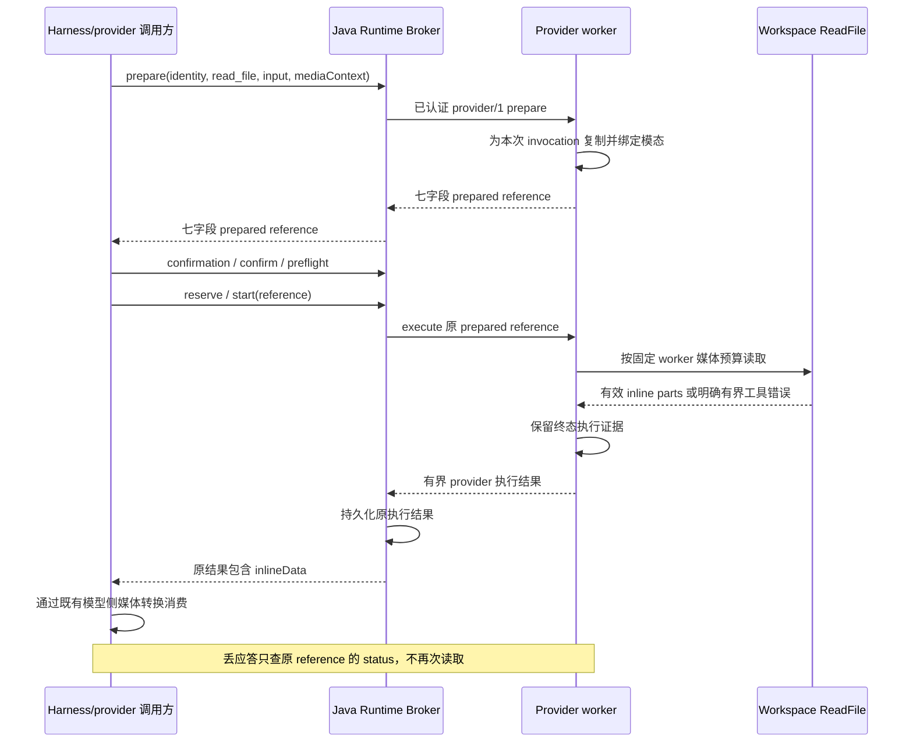

# Managed Runtime Provider 媒体交付

[English](2026-10-07-managed-runtime-provider-media.md) | [简体中文](2026-10-07-managed-runtime-provider-media.zh-CN.md)

状态：provider/1 已实现；生产部署验收独立推进。
日期：2026-10-07
Issue：[#13039](https://github.com/QwenLM/qwen-code/issues/13039)，包含[根因评论](https://github.com/QwenLM/qwen-code/issues/13039#issuecomment-5895577269)。
代码基线：上游与本地均为 `a764fb9698e6e1152e0a8bc5808c30a765744152`。

## 1. 决策与范围

让 `read_file` 通过现有 `managed-runtime-provider/1` worker、Java Runtime
Broker 与 `BrokerManagedRuntimeProvider` 客户端交付真实图片和 PDF 内容。
保留七字段 prepared reference、审批、preflight、原执行观察与释放协议。
Runtime 只接收模态布尔值，不接收模型配置、Prompt、凭证或模型接口访问能力。

工具描述与实际文件读取统一使用 `Config.getEffectiveInputModalities()`。
在现有 ReadFile 处理路径增加由 worker 持有的内联媒体上限。响应 fitting 保留
有效媒体；超限读取返回明确且已结算的工具错误。

本 issue 实现 provider 路径，不迁移所有 Hosted 工具 profile。公开 Hosted 文件
循环目前使用 raw Tool v2 和独立的 64 KiB 内联 Session 资源。替换该循环、开放
公开媒体、新 artifact API、音视频交付、Runtime 内 Vision Bridge 推理与对象
存储媒体传输均属于独立改动。provider 成功交付不能证明这些能力已经成立。

## 2. 当前契约与缺陷

| 范围                                                                    | 基线已核实行为                                                                                                                                           |
| ----------------------------------------------------------------------- | -------------------------------------------------------------------------------------------------------------------------------------------------------- |
| `managed-runtime-provider-worker.ts:createRuntime`                      | 创建无 content generator 的执行 Config。媒体绑定 ReadFile 仅覆盖 `getEffectiveInputModalities`。                                                         |
| `fileUtils.ts:processSingleFileContent`                                 | 读取 `getContentGeneratorConfig()?.modalities`，因此图片仍不支持，原生 PDF 与 PDF 转图片回退也不可用；PDF 文本提取已存在。                               |
| `managed-tool-runtime.ts:prepare`                                       | 复制 `mediaContext` 并纳入准备摘要；同一存活调用改变媒体上下文会冲突。                                                                                   |
| `managed-runtime-provider-protocol.ts` / Java `ProviderRuntimeProtocol` | 闭合 `mediaContext: { inputModalities }`，允许布尔键 `image`、`pdf`、`audio`、`video`。普通响应包括 execute/status/cancel 均为 1 MiB，历史操作为 8 MiB。 |
| `fitManagedRuntimeProviderResult`                                       | 淘汰进度并裁剪文本，最后把不可裁剪的内联媒体替换为通用 stub；处理的是 HTTP 副本，不是 Runtime 保留的执行结果。                                           |
| Java `HttpRuntimeTransport`                                             | 七字段引用选择 provider execute/status/cancel；四字段 raw Tool v2 使用不同路由和结果形态。                                                               |
| `managed-tool-media.ts`                                                 | 较大的验证媒体例外属于 ACP/raw Tool v2，不属于 provider/1，不会扩大其 1 MiB 上限。                                                                       |
| `hosted-workspace-tool-turn.ts`                                         | 公开 Hosted 文件选择 raw v2；持久 outcome/message 上限可独立拒绝媒体，不由传输成功决定。                                                                 |

Issue 评论建议覆盖 content-generator 配置。本方案优先使用既有有效模态 getter：
生产 Config 默认从同一已解析配置返回模态，避免为执行 worker 伪造模型和鉴权
配置。仅为未实现有效 getter 的既有局部 Config 测试替身，保留
`getContentGeneratorConfig()?.modalities ?? {}` 回退。有效 getter 返回空对象
就是权威结果，不能用回退重新启用已经关闭的模态。

## 3. 架构与时序

路由继续遵循当前归属：worker control 属于 live-session-owner；Broker
start/status/cancel 使用持久执行所有权和原 Runtime generation。
`mediaContext` 表达模型能力，不授予文件权限。既有 Workspace 授权、Session
绑定、审批与 file-service 检查继续位于读取链路中。模型改变只影响新的准备。

## 4. 模态绑定与读取语义

1. 在 prepare 解析并复制现有媒体上下文。省略上下文保持 worker 现有的纯文本
   媒体行为，包括 PDF 文本提取。
2. 为 invocation 创建独立 derived Config。本 provider profile 仅在复制的
   对应布尔值为 true 时启用 image/PDF；即使模型支持，audio/video 也保持关闭。
   描述与执行使用同一有效视图。不修改 Session 或进程全局 Config，不初始化
   generator，不根据模型名称推断能力。
3. 保留 file service、target directory、权限规则、禁用的 read cache 和
   file-history service。非 ReadFile 工具继续拒绝 `mediaContext`。不注册
   `zoom_image`，也不广告此四工具 worker 并不存在的 zoom 能力。
   在 worker 的 derived Config 上把 `isOmniEnabled` 固定为 false，避免继承
   的环境开关加载媒体上传流程。本地普通 CLI Config 保留既有 Omni 行为。
4. 把 `processSingleFileContent` 的模态读取改为有效 getter。本地 CLI/Legacy
   继续使用既有解析模态。本地 Managed factory 已覆盖此 getter，必须做回归，
   因为它会从只影响描述变成也影响真实读取。

| 输入与能力                     | 要求结果                                                                                           |
| ------------------------------ | -------------------------------------------------------------------------------------------------- |
| 支持的图片，`image: true`      | 复用原生 overview 与安全格式处理，在预算内交付有效 image inlineData；保留既有损坏/不安全格式提示。 |
| 图片且 image 关闭或缺省        | 原 unsupported-image 提示，无内联字节。                                                            |
| 无 `pages` 的 PDF，`pdf: true` | 可容纳时交付原生 `application/pdf` inlineData，否则明确 FILE_TOO_LARGE 并提示使用 `pages`。        |
| 带 `pages`，或不支持原生 PDF   | 既有文本优先提取与 token/页数检查，纯文本模型仍可读文本 PDF。                                      |
| 扫描/高密度 PDF，`image: true` | 既有页面渲染，受更小的 provider 聚合预算约束。                                                     |
| 音视频                         | 既有 unsupported 提示，不内联字节，不远程上传。                                                    |
| SVG/notebook/text              | 保持既有非媒体行为与权限规则。                                                                     |

通用 manifest 不承诺交付每种媒体。带媒体的 preparation 和真实输出才是验收
证据。Harness 调用方通过既有 `ManagedToolV2Client.prepare` 第五参数传入
已解析能力快照；已发布的 Hosted raw 循环目前不是此参数的生产调用方。
不能仅凭客户端会转发就宣称默认产品能力已开放。

## 5. 字节策略与终态可观察性

provider/1 保持 1 MiB。首版策略固定在 worker 代码内，不增加公开配置或调用方预算：

| 预算                                     | 单位与值                                                                                                          |
| ---------------------------------------- | ----------------------------------------------------------------------------------------------------------------- |
| `MAX_PROVIDER_INLINE_MEDIA_BASE64_BYTES` | 全部 inlineData base64 字符串之和为 768 KiB，最多对应 576 KiB 解码字节；膨胀公式为 `4 * ceil(decodedBytes / 3)`。 |
| `MAX_PROVIDER_MEDIA_RESULT_BYTES`        | 完整 ReadFile ToolResult 的 JSON UTF-8 编码为 896 KiB，含文本、MIME/display 元数据和 returnDisplay。              |
| 既有 provider 响应上限                   | 1 MiB，含协议、完整 Session 身份、execution/status 包装与保留进度。                                               |

这些是传输上限，不证明特定模型还有足够上下文。Harness 继续执行自身模型和
持久存储校验。
896 KiB 检查只约束包含拟内联交付媒体的结果。text、SVG、notebook 和文本
提取 PDF 继续使用既有文本 fitting，包括大于 896 KiB 的合法文本结果。

为 `ReadFileTool` 增加可选的可信构造期读取策略，经
`ProcessSingleFileContentOptions` 转交。仅 provider worker 设置，本地调用
省略并保持现有上限。这不是工具参数，不能通过 `mediaContext` 或用户设置扩大。
在处理内部、返回 inline part 前执行：

- 原生 PDF 与 raw-image 读取约束实际读取字节，不能仅信任 `stat.size`；增长
  或替换的流最多读解码上限加一字节就拒绝。成功、失败和 abort 都关闭 handle。
  新 helper 必须保留现有 file-service 与权限语义。
- 图片 overview 在分配 base64 之前测量真实渲染 Buffer。保留既有源文件/解码
  上限；本 feature 不引入任意重压缩、降低分辨率或新增格式。
- 给现有 PDF renderer 增加可选聚合 base64 上限。更小策略也约束第一页，不能
  沿用当前“第一页总是保留”的例外。在读取/编码无法容纳的页面前停止。有明确
  page range 时拒绝不完整渲染；无 range 时只允许带明确省略后续页面提示的
  整页前缀；一页都容纳不下则 FILE_TOO_LARGE，建议更窄范围或缩小文档。
- 同时检查完整含媒体 ReadFile ToolResult 的编码大小和媒体字节。不裁剪 base64，
  不切分 PDF 字节，不把成功图片替换为通用 success stub，不静默丢页。

把 invocation AbortSignal 传入本次调用拥有的 `pdfinfo`、`pdftotext` 与
`pdftoppm` 操作。`extractPDFText` 已接受 signal，但 fileUtils 必须真正传入；
renderer 和页数 helper 增加同样的可选 signal。复用 `execCommand`/`execFile`
取消，在返回取消前等待所属子进程退出和 renderer `finally` 清理；abort 必须
重新抛出，不能解释为提取失败再启动另一条回退。当前 helper 可以把 abort 返回成
失败值，必须在 await 后显式检查 signal，包括进入任意回退之前。
不能把单 invocation 的 signal 绑到共享 availability probe Promise，
它们仍是有界共享探测。测试在每种子进程
已经启动之后取消，不能仅覆盖 ReadFile 执行前取消。

读取预算错误使用正常 `ToolResult.error` 与 `ToolErrorType.FILE_TOO_LARGE`，
Runtime 记录 `executionStatus: error`。通过 HTTP 200 返回已结算的 provider
观察，让 Broker 保存结果并释放所有权，不变成传输 413 或 UNKNOWN。
畸形/超限协议输入继续使用既有拒绝规则；传输失败不证明读取已结算。

响应 fitter 可以淘汰 progress 并裁剪辅助字段，但 execute 与已结算
status/cancel 必须逐字节保留完整已接受的含媒体 ToolResult。错误分类位于
ReadFile 内部，在 `ManagedToolRuntime.run` 保留终态之前确定，不能在 HTTP
副本中临时制造不同的终态交付错误。896 KiB ToolResult 为包装和有界辅助数据
留出 128 KiB；先去掉 progress，再复用既有辅助 fitting。用完整合法身份和真实
execution/status 包装做边界测试，证明已准入媒体结果不能进入通用 media-stub
分支。若异常结果违反此不变量，按协议故障拒绝，不改写或 ACK 已保留的终态证据；
这是实现错误，不是普通大小拒绝。不增加第二套媒体投影 cache 或结算状态。
同一 reference 必须暴露同一已接受模型内容；观察不能重新读取文件。
尽可能复用既有 MIME/规范 base64 校验，只识别 llmContent 中已知
inlineData 叶子，不能给任意元数据媒体豁免。Java 与 TypeScript 包装上限保持一致。

## 6. 存储、兼容与失败边界

Java 把有界 provider 结果保存在既有工具执行 ledger，不需要 schema 变更或
媒体表。媒体属于私有工具证据，不把 base64 复制到公开 token 事件、preview、
日志或错误诊断。文件内容是非可信数据，不能提供执行指令。

保持 providerProtocol `/1` 和请求/响应形态，因为只是在既有上限内兑现已有
mediaContext 能力。旧 worker 的 unsupported 占位可在验收中识别，不能静默
经 Legacy 或 raw v2 重试。Harness 的 raw-v2 媒体上限更大，不允许 provider
因此发送更大的响应。

当调用方 Session 契约要求持久化时，必须先提交精确接受的结果再继续模型。
公开 Hosted raw 文件路径的 64 KiB outcome/history 上限不能接纳 768 KiB
provider 负载。本设计不扩大或绕过它。未来公开 Hosted 媒体 profile 需要独立的
raw-tool 模态绑定和持久媒体资源/message 表达，不能仅用 Workspace 路径或
公开 artifact preview 作为模型恢复证据。

status/cancel 使用原 prepared reference。execute 应答丢失后，即使文件改变，
status 也必须恢复同一媒体。Broker 重启读取已保存终态 receipt；结算前 worker
丢失继续 unknown，不允许重新派发。release/新 Turn 淘汰保留既有生命周期。
媒体每 invocation 有界，但现有调用数量保留仍可消耗大量内存；验收包含该成本，
不宣称新增全局 quota。

## 7. 实施切片

| 切片                  | 文件与具体改动                                                                                    | 退出检查                                                                                   |
| --------------------- | ------------------------------------------------------------------------------------------------- | ------------------------------------------------------------------------------------------ |
| M1：单一能力来源      | `packages/core/src/utils/fileUtils.ts`、provider worker 媒体绑定、本地 factory 回归               | image/PDF true/false/缺省时描述与真实读取一致，不依赖 generator/凭证。                     |
| M2：有界读取策略      | `packages/core/src/tools/read-file.ts`、`utils/fileUtils.ts`、`utils/pdf.ts`，worker 可信构造策略 | 真实图片、原生 PDF、渲染页可交付，明确大小错误可结算，本地默认行为保持。                   |
| M3：保留媒体观察      | `packages/cli/src/serve/managed-runtime-provider-protocol.ts`、worker 路由，必要时共享 validator  | execute/status/cancel 保留媒体，progress 不造成 stub，畸形负载不能豁免。                   |
| M4：Broker 与消费证明 | `broker-managed-runtime-provider.test.ts`、Java `ProviderRuntimeTransportTest`、真实进程 driver   | 真实 provider worker 与 Java Broker 把字节交给假多模态 provider，原引用恢复经受 ACK 丢失。 |

M1-M4 不修改公开 OpenAPI、SQL migration 或 Hosted profile 选择。实现后同步
修改 provider-control 的中英文设计；其中当前占位描述属于历史基线，不是成功
交付证据。

M1 还在 `config.ts` 的 `DerivedConfigOverrides` 中增加 `isOmniEnabled`，
由 worker 设置覆盖、文件处理读取，不增加公开设置或改变普通 CLI Config 默认值。

## 8. 验证与验收

使用小型真实 PNG/JPEG/WebP/GIF 与 PDF fixture，验证解码字节或渲染 MIME/
尺寸，不能只看 success、描述或“不含占位”。fixture 在 worker Workspace，
Harness 诱饵路径不能被读取。PDF 覆盖原生字节、明确文本页、图片回退与 Poppler
缺失。指定 CI lane 的渲染测试必须实际运行 Poppler；skip 不能作为正向证据。

必须覆盖：

1. Core：有效 getter 优先级、局部 mock 回退、本地 CLI/Managed 回归、模态开启/
   关闭、text/SVG/notebook 行为。
2. Worker：同 Session 与跨 Session 同时准备不同模态；改上下文重试冲突；省略
   上下文不能继承先前能力；不初始化模型/auth/Vision Bridge/upload；权限与
   Workspace 身份保持。
3. 预算：精确边界与多一字节、base64 膨胀/padding、多字节/转义元数据、含首
   页的多页聚合、增长 raw 文件、损坏图片/PDF、显式页拒绝/隐式前缀提示、取消
   和 renderer 清理。
4. Wire：真实 provider HTTP 包装、最大合法 Session 身份、chunked 响应、带
   大 progress 的 execute 与 settled status/cancel；规范 base64/MIME 拒绝及
   超限非媒体字段。绝不切 inlineData，绝不把大小拒绝报告为成功交付。
5. 集成：真实打包 worker、Java Broker 和 MySQL ledger。用
   `BrokerManagedRuntimeProvider.getToolV2Client` 驱动 provider controls，不
   直接走 raw v2。断言七字段引用、provider/1 worker 路由与嵌套
   `result.llmContent`，不能使用 raw `responseParts`。完成
   prepare/approve/preflight/reserve/start。令
   `execution = await client.execute(reference)`，确认成功且包含结果，再将
   `execution.result.llmContent` 传入 `coreToolScheduler.ts` 的
   `convertToFunctionResponse`，再经既有 Harness 模型转换把返回媒体
   送到确定性多模态 fixture，检查真实出站请求。原生 PDF 验收使用既有
   Chat Completions converter（`application/pdf` 转为 file part），其图片转换
   也必须通过。Responses converter 当前支持图片结果，但会把 PDF 变成
   unsupported 占位；单独验证此既有限制，不宣称该路由支持原生 PDF。
   不需要真实模型凭证。丢 start/execute 应答、修改文件、查同一引用、重启
   Broker，核对原字节和工具 invocation 只执行一次。首次 sniff/渲染可以需要
   多次文件读取；恢复观察不得新增读取或处理。错误/取消后 release 仍可回答。

实现阶段执行仓库 build/typecheck/bundle、按包 Core/CLI 测试、Java Broker
测试/Checkstyle、真实 MySQL 进程门禁。区分这些结果与真实模型 smoke。
移除有效 getter、字节 gate 或让 fitter 丢 inlineData 时，媒体交付断言必须失败。

验收要求图片和原生 PDF 字节经 provider Broker 路径到达模型 fixture，PDF
回退成立、拒绝有界且分类诚实、能力快照隔离、原引用恢复一致。仅库测试或
传输 mock 通过不构成 #13039 完成。

## 9. 风险与后续决策

- 768 KiB 聚合上限有意支持本地 CLI 媒体大小的有界子集。扩大需要版本化的
  端到端传输、存储和容量设计，不能只改一个接收方。
- PDF 渲染和图片解码的内存/磁盘消耗大于交付负载。部署开启前验证既有源文件/
  页数/时间限制与累积 invocation 保留，不把单次响应有界等同全局内存有界。
- Poppler 是文本提取和扫描页渲染的部署依赖，缺失时返回诚实工具错误。
- 公开 Hosted 媒体、音视频、对象媒体、zoom、自定义上限需要各自的消费者和
  契约，不是 provider/1 图片/PDF 交付的隐含前置。
