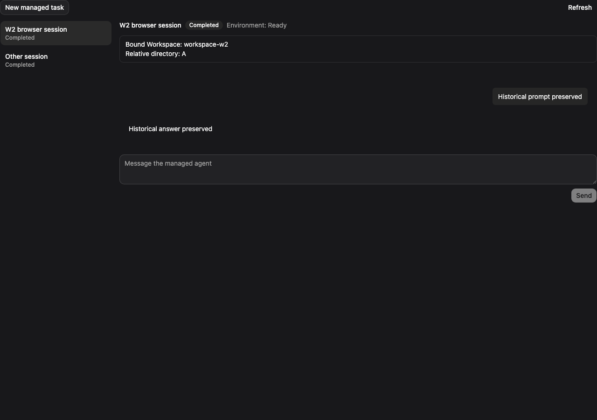
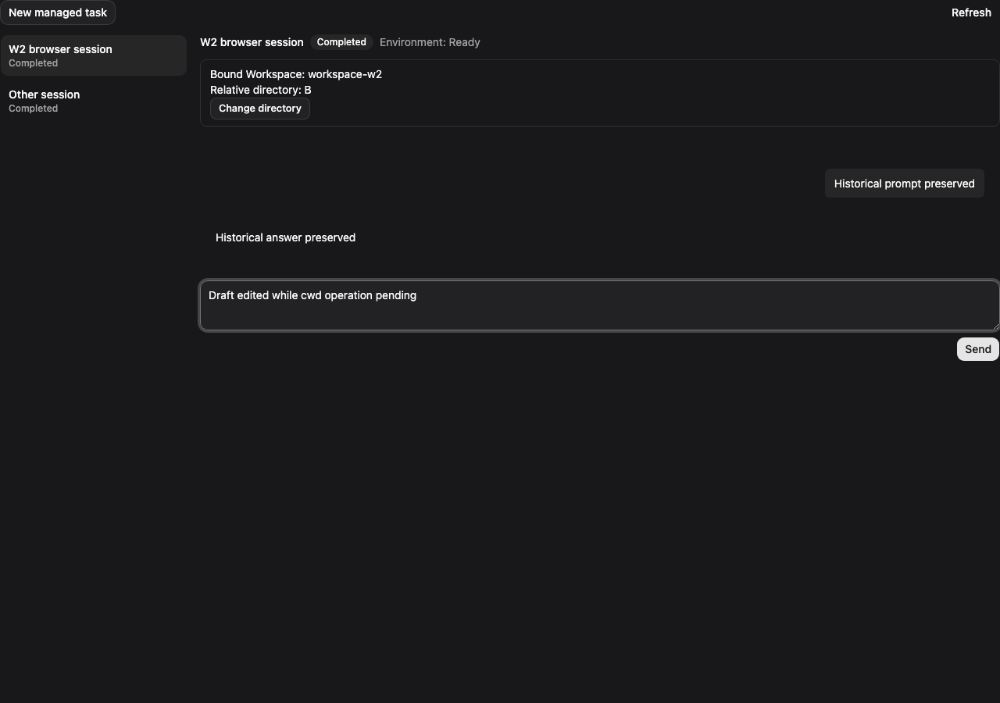

# W2 WebShell：会话内切换工作目录

[English](2026-10-09-managed-workspace-w2-webshell.md) | [简体中文](2026-10-09-managed-workspace-w2-webshell.zh-CN.md)

## 问题与基线

W2 控制面（#13247）已有同一 Workspace 内持久化、幂等的 cwd 变更和 `session.context.changed` 事件。WebShell 能显示绑定目录，但没有切换入口。Session summary 的 TypeScript 合同缺少 context revision，事件投影也忽略上下文变更。基线为 main `15c11bb8982`；#13545（角色权限）和 #13564（Hosted 规则缓存失效）仍 open。

## 交互

在 Workspace 卡片的当前目录旁放置“切换目录”。使用共享 Dialog 和 Input，默认填写当前目录。路径相对于 Workspace 根目录，`.` 表示根目录。本地拒绝空值和与当前值完全相同的输入，保留空格、大小写和 Unicode。规范化、目录存在性和越界检查由服务端完成。范围不含目录浏览、创建或跨 Workspace 移动。

有活跃任务、待审批、未确认 prompt 或 cwd 操作时，禁用新切换。cwd 切换期间草稿可编辑，但不能发送。关闭弹窗不取消操作，Workspace 卡片继续展示状态。保留历史、分页和当前 Session。使用共享的作用域 portal、双语文案、键盘提交和焦点恢复。

## 合同与权限

复用 BFF `/sessions/cwd/change`、`/operations/query` 和 `/sessions/get`。可选 provider `cwdChange` 操作组提供 submit/query，返回已有 cwd operation。summary 补可选 contextRevision/state 和 cwdChange capability。Java 仅在显式提供含租户、账号身份的 productScope 时暴露操作组。Daemon 和旧服务端保持不支持。

独立 BFF 切片实现已预留的可选 `cwdChange`，依据部署执行开关、活跃 Session、绑定/Registry 事实和与 cwd admission 相同的调用者授权判定。页面采用批量查询，不能复用有额外执行 profile 限制的 workspaceTurns。权限由服务端裁决并随 #13545 演进。能力不保证 Session 当前空闲。不增加 endpoint、数据库表、operation 历史、公共能力字段或 context state 推导。

## 浏览器持久化意图

提交前在 sessionStorage 保存 sessionId、workspaceId、精确目标、expectedContextRevision 和 idempotencyKey，按 provider 身份及 Session 隔离。首次保存失败则不发送。接收成功后保存 operationId；此更新失败时仍保留原请求以便重放。每个 Session 本地最多一个意图。

打开弹窗时捕获 revision。提交前若已变化，展示新目录并要求明确确认后再采用新 revision。202 只表示受理，当前目录继续使用服务端已提交值。按 1、2、3 秒退避，其后每 3 秒查询。30 秒未结束或传输失败显示“结果待确认”和“继续确认”。未知结果不能当成失败，也不能生成替代 key。

刷新后已知 operation 自动查询；只有请求意图时，点击“继续确认”才用原 key 和原 payload 重放。能力变为 false 时仍允许结果恢复。不提供会让用户误以为已取消的本地丢弃。首次提交的明确拒绝或 operation 终态失败释放意图，保留目标并说明原因。revision 冲突刷新 summary，需要重新主动提交。

completed 后刷新 summary，revision 达到 resultContextRevision 才清除意图。若已发生后续变更，可能目录不同，应展示最新目录而不是回写 operation 目标。仅路径相同不能证明完成。Session/账号切换时中止本地请求并忽略迟到响应。

## 事件与隔离

上下文变化投影为 Session 事件，仅刷新 summary，不重载 transcript 或生成聊天消息。保留现有三秒轮询。同一 Workspace 的乱序响应保留较高 revision 的绑定信息，同时接纳其他字段的新值。其他标签页通过事件/轮询获知已提交变更，本切片不能发现其进行中的进度。竞争由服务端 admission 和 CAS 串行化。

## 交付与验收

拆为两个独立可评审 PR：前端 adapter/控件/恢复/事件；BFF capability/OpenAPI/生成类型/测试。前端对缺能力的服务端不显示入口。BFF 在 #13564 的 cwd 缓存失效修复通过联合验收前不能合入或部署并返回 true：同一 Hosted attachment 中 A→B 后，下一轮的文件写入与 QWEN.md/AGENTS.md 规则必须同步变化。本切片不修 rewind 或规则编辑。

Provider、hook、组件、事件以及 Java capability/查询预算测试覆盖丢 ACK、刷新、失败、权限、旧 revision、竞争、账号隔离、存储拒绝和旧服务端。浏览器验证 portal、焦点、草稿/历史保留。真实 Java/Hosted 验证根目录、空格/中文、非法/越界路径、忙时拒绝和切换后写入。完成 build/typecheck/bundle、聚焦测试和两次干净 self-audit。如联合门槛不可验证，明确记录，不提前启用。

## 行为测试计划与证据

纳入版本管理的[行为 E2E 计划](../plans/2026-10-09-managed-workspace-w2-webshell-e2e.zh-CN.md)区分浏览器模拟、真实进程写入与待完成的规则门槛。截图使用包含身份范围的 Java provider fixture 并拦截 BFF 响应，展示 UI 行为，不作为服务端完成证据。

变更前，未声明能力的服务端没有切换入口：

变更后，确认 operation 并读回权威 summary 后显示 B，同一草稿与历史保留：

