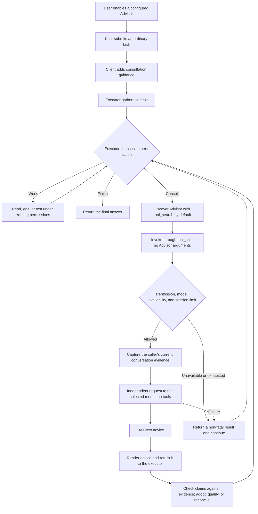

# Advisor behavior alignment

[English](advisor-alignment.md) | [简体中文](advisor-alignment.zh-CN.md)

## Goal and reference

Complete the executor/advisor behavior introduced by #9636 and the acceptance contract in #9036. The product goal is autonomous consultation during ordinary work after the user enables an Advisor, without requiring the user to request consultation in each prompt. The executor remains responsible for actions and the final answer.

Reference: Claude Code **2.1.282**, verified against its released binary on 2026-09-25. The older local source is a structural reference, not current implementation evidence. No upstream implementation is copied. The binary confirms consultation guidance and model-pairing gates. The [Claude Code documentation](https://code.claude.com/docs/en/advisor) describes model-driven timing, ordinary subagent inheritance, additional usage, and no CLI call-count setting. The [API documentation](https://platform.claude.com/docs/en/agents-and-tools/tool-use/advisor-tool) separately describes the server tool, returned advice, and optional limits.

Matching the control pattern does not establish identical model behavior or server internals. The cached reference executable was terminated with signal 9 even for `--version`; a paired live Claude/Qwen task comparison has not been completed.

## Entry points and ownership

| Entry                            | Trigger                                                                                                | Destination of advice                                                                      |
| -------------------------------- | ------------------------------------------------------------------------------------------------------ | ------------------------------------------------------------------------------------------ |
| Native Advisor                   | The executor chooses a tool call after Advisor is enabled through `/advisor`, `--advisor`, or settings | A tool result in the calling executor's conversation, also displayed to the user           |
| Legacy `/advisor review [focus]` | The user explicitly requests a review                                                                  | A structured review displayed to the user; it is not the native executor continuation loop |

Enabling Advisor selects a capability. It does not start a background observer or require a call on every user turn. The client supplies consultation guidance automatically on user/cron tasks and at eligible subagent task entry. The model chooses when to follow it. Advisor inference itself has no execution tools and cannot recursively consult another Advisor.

## Automatic consultation flow

The decision diamond is a model decision, not a hard-coded checkpoint. Guidance asks the executor to consult after orientation but before substantive work, when stuck or changing approach, and before completing longer tasks. If advice contradicts observed evidence, the executor should state the conflict and consult again. Routine reactive steps do not require repeated calls. Before final consultation, save already-authorized deliverables; advice never grants commit, publish, or other permission.

`advisor` is deferred by default and has a short description and an empty-object schema. `tool_search` returns its declaration; `tool_call` executes it without expanding the executor's declared tool list. Explicit visibility and the existing no-bridge fallback still apply. Ordinary subagents retain the shared runtime's tool-loading rules, including eager inclusion of ordinary deferred tools where that runtime already uses it. They are not forced through a new Advisor-specific discovery mechanism.

## Evidence, runtime, and failure boundaries

- Capture the calling agent's **current active conversation**, including its task, tool calls/results, system instruction, and declarations, up to the consultation call. Existing compaction may already have summarized older turns; this is not an archive export.
- Use the asynchronous agent context to bind ordinary subagent consultations to their own chat, including approval continuations. A subagent with no bound chat fails closed rather than using its parent's transcript. Existing tool allowlists, disabled tools, safe/bare modes, and permissions remain effective.
- Serialize evidence for an independent cross-provider request. Filter private reasoning/signatures and replace binary content with metadata/placeholders. This does not provide pixel- or audio-level evidence to the Advisor and is not claimed equivalent to Anthropic server-side context transport.
- Native advice is text or Markdown, with no mandatory JSON fields and no execution tools. Preserve the legacy manual-review format and historical cards. Do not silently fall back to a different model or endpoint when consultation fails.
- Advisor instructions ask for evidence-grounded findings, causal steps, and explicit assumptions. Executor instructions require checking a claim's causal path before adopting it and distinguishing present behavior from proposed-change risks. These are model instructions, not a correctness oracle.
- `advisorMaxUses` is a non-negative user/system setting: `0` is unlimited. The main executor and derived subagents share an in-memory counter per runtime session. An attempted inference reserves a slot before awaiting the request; failures count. Off/model switches do not reset it; a new runtime session does. Workspace settings cannot raise or override this boundary.
- Provider errors and exhaustion return a non-fatal result so the executor can continue without retry loops. Cancellation propagates through the existing abort path. Render native advice in Ink/OpenTUI and retain structured-history compatibility; attribute model usage to Advisor separately.

## Alignment and deliberate differences

“Aligned” below means the observable control contract is the same. It does not mean identical prompts, server internals, timing, or output quality.

| Area                      | Claude reference                                                               | Qwen decision                                                            | Reason and tradeoff                                                                                                            |
| ------------------------- | ------------------------------------------------------------------------------ | ------------------------------------------------------------------------ | ------------------------------------------------------------------------------------------------------------------------------ |
| Trigger ownership         | Executor model decides when to consult                                         | Aligned: automatically supplied guidance, model-chosen calls             | Preserves autonomy; no guarantee that every model follows each checkpoint                                                      |
| Consultation lifecycle    | Advice returns to the executor, which continues                                | Aligned: tool-result reinjection and continued execution                 | The executor owns verification and actions; Advisor is not an approval authority                                               |
| Ordinary subagents        | Advisor inheritance subject to model eligibility                               | Same capability; caller-local evidence and existing Qwen tool policies   | Prevents parent-history substitution and recursive internal side queries                                                       |
| Tool discovery            | Native Advisor capability; Qwen's bridge is not part of the reference contract | Default `tool_search` → `tool_call`, with existing visibility overrides  | Fits Qwen's schema-loading design and limits resident schemas; adds a discovery step. Not claimed to improve reasoning quality |
| Request execution         | Anthropic-managed server tool                                                  | Client-managed independent request, including cross-provider pairs       | Needed for Qwen's provider portability; does not reproduce provider-side latency/cache/billing behavior                        |
| Model pairing             | Catalog eligibility/ranking gates                                              | User-selected configured models, without invented cross-provider ranking | No reliable common capability scale; users can choose a weaker Advisor, and equal model names do not guarantee equal quality   |
| Context transport         | Server tool operates on the available conversation context                     | Filtered serialization of the current caller evidence                    | Portable and respects reasoning/binary boundaries; modality evidence and cache reuse differ                                    |
| Limits                    | Optional API limit; not a Claude CLI setting                                   | Optional shared session attempt cap                                      | Satisfies #9036 and bounds attempts, not monetary cost or payload size                                                         |
| Durable work and approval | Reference guidance asks for durable work before final consultation             | Save authorized deliverables; no implicit commit/publish permission      | Required by Qwen's permission model and the user's authority; not a claim of better model behavior                             |
| Legacy manual review      | Not the reference for the native loop                                          | Keep `/advisor review` as a separate compatibility path                  | Avoids changing a user-triggered workflow while completing autonomous consultation                                             |

These differences are portability constraints, compatibility decisions, or explicit Qwen extensions. They are not collectively described as “better than Claude.” Replacing model choice with mandatory consultations would be a separate product/architecture decision and is outside this alignment.

## Acceptance contract

| Contract                         | Required evidence                                                                                                                                                                         |
| -------------------------------- | ----------------------------------------------------------------------------------------------------------------------------------------------------------------------------------------- |
| Discover without resident schema | Initial request excludes Advisor; discovery and bridge call succeed; declarations remain stable                                                                                           |
| Consult and continue             | Selected model/endpoint receives caller evidence with no tools; readable advice returns to the executor, which continues                                                                  |
| Caller and authority isolation   | Ordinary child uses its own transcript; unavailable child chat cannot fall back; permissions and no-recursion constraints remain effective                                                |
| Failure and budget               | Provider failure, cancellation, exhaustion, off, and attempted-call accounting follow their declared paths; exhausted/off cases issue no further Advisor request                          |
| Terminal behavior                | Actual Ink and strict OpenTUI tmux captures show readable Advisor identity/results, executor model identity, continuation, and separate usage                                             |
| Autonomous timing                | A real simple task avoids consultation; a real multi-step implementation consults before substantive work and before final completion, without the user requesting Advisor                |
| Evidence reconciliation          | A real executor checks a controlled incorrect suggestion against executable primary evidence, does not propagate the false finding, and presents the conflict in a follow-up consultation |
| Actual deliverable               | Implementation artifacts exist and the requested regression command succeeds; model self-report or process exit alone is insufficient                                                     |

Unit/integration tests protect deterministic boundaries. Real-model cases evaluate the instructions and task behavior. Record prompts, configuration provenance, tool/consultation order, elapsed time, usage, and failures; do not repeat unchanged cases until one passes. A finite acceptance sample does not guarantee all future advice is correct.

For live diagnosis, isolate the test home from its workspace, preserve configured model generation parameters, explicitly permit the intended scratch writes/commands in headless mode, and verify those rules before inference. Record upstream response headers timing, byte counts, SSE reasoning/text/tool-call counts, stream end/abort, and CLI events without recording credentials. A proxy deadline must not be shorter than the case budget. Distinguish provider silence, streamed reasoning, buffered tool arguments, client processing, and harness failure.

## Current evidence and open work

Deterministic native/deferred tests and six bundled CLI scenarios passed. Real tmux sessions in Ink and strict OpenTUI exercised discovery, consultation, readable results, continuation, exhaustion, off, and usage attribution. The bridge-card identity and transient Ink executor-model label defects were fixed and retested.

Real Max/Max and Flash/Max review samples completed with autonomous consultation and continuation; the simple control made no consultation. One Max sample propagated an unsupported Advisor concurrency claim, while Flash and another Max sample corrected a similar claim. Evidence instructions now require causal checks and explicit assumptions. A real Flash executor with controlled incorrect Advisor feedback actually executed primary evidence, rejected the false race diagnosis, and consulted again to reconcile the conflict, both before and after this guidance change. This is non-regression evidence, not proof of improved reliability. Both runs fixed before testing; only an independent test-engineer reproduced the original failure. The after run still made an unsupported generalization about async mutexes, so explanation correctness remains a model-quality limitation.

The first implementation lifecycle attempts exposed two harness defects: a proxy deadline shorter than the case budget, and missing headless write permissions. A subsequent valid 300-second run produced no implementation or consultation after orientation. Earlier logs had no response-byte telemetry, so its cause cannot be inferred retroactively. New instrumented runs observed fast HTTP responses followed by long streams of reasoning, rather than transport silence. Max consulted twice before writing, including evidence reconciliation, then saved the implementation and passed 10/10 actual checks before its 600-second budget expired. Flash saved an implementation and passed 6/6 checks, but made no consultation and exhausted its 16-tool budget on additional mutation checks. Independent reruns confirmed both artifacts. Neither case demonstrates the complete two-stage consultation lifecycle. The new bundle demonstrably sends the consultation reminder and discovery route; that capture cannot retroactively establish the old Flash request content.

Runtime evidence and all failed attempts are recorded in the [PR acceptance discussion](https://github.com/QwenLM/qwen-code/pull/12688#issuecomment-5831380864). The PR remains draft until the bounded acceptance work above is completed or a concrete external blocker is documented. Neither a passing mock nor one successful model response establishes full Claude equivalence.
