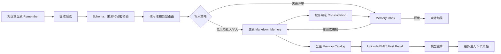
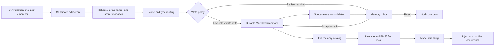

# Reliable Auto Memory Roadmap

Status: Proposed

Last updated: 2026-07-16

<details>
<summary><strong>中文评审参考（点击展开）</strong></summary>

> 本节是英文设计正文的中文评审版本，便于中文评审和方案讨论。英文正文是规范版本；如果两者出现表述差异，以英文正文及最终实现代码为准。

## 中文版：可靠 Auto Memory 演进方案

### 1. 目标与范围

本方案将当前 Auto Memory 从“后台 Agent 直接写正式记忆”演进为“候选生成、校验、审批、应用、检索、整理”的完整生命周期，同时保留 Markdown 作为最终持久化格式。

整体分为三个阶段、十个可独立合并的 PR：

| 阶段    | 目标                 | PR 数 | 交付结果                                            |
| ------- | -------------------- | ----: | --------------------------------------------------- |
| Phase 1 | 可靠性、安全、可观测 |     4 | 首轮可靠召回、CJK fallback、秘密扫描、安全 Forget   |
| Phase 2 | 可信写入和人工治理   |     3 | Schema v2、来源证据、候选箱、延迟提取               |
| Phase 3 | 检索质量和生命周期   |     3 | BM25 + 模型重排、多作用域整理、冲突、过期和预算控制 |

目标数据流：



### 2. 全局设计约束

所有阶段必须遵守：

1. 正式记忆继续使用人类可读的 Markdown。
2. `MEMORY.md` 只能由框架生成，Agent 不再手工维护索引。
3. Memory 后台任务失败不能阻断用户主请求。
4. 一个逻辑轮次最多注入 5 个 Memory 文档。
5. 迟到的 Recall 结果不能直接复用到另一个 Query。
6. 秘密值不能进入错误、日志、Telemetry 和候选元数据。
7. Team Memory 的生成和整理必须可评审。
8. 不对历史 Memory 做破坏性批量迁移。
9. 自动覆盖和删除前必须检查并发冲突。
10. Recall、Extraction、Apply 和 Consolidation 都必须可衡量。

---

## Phase 1：可靠性、安全、可观测

### PR 1.1：Recall 投递 Telemetry

建议提交：

```text
chore(memory): add recall delivery telemetry
```

#### 设计

现有 Recall Telemetry 只能表示“选择了多少文档”，无法证明文档真正进入主模型上下文。新增 `qwen-code.memory.recall_delivery`：

```ts
type RecallPhase = 'fast' | 'refined';
type RecallDeliveryPoint = 'initial' | 'tool_result' | 'discarded';
type RecallDiscardReason =
  | 'turn_completed_without_tool'
  | 'replaced_by_new_query'
  | 'user_abort'
  | 'reset_chat'
  | 'loop_detected'
  | 'session_limit'
  | 'shutdown'
  | 'error';
```

只记录 phase、delivery point、discard reason、strategy、文档数量和耗时。禁止记录 Query、Memory 正文、文件路径、模型 reasoning 和 Session ID。

#### 涉及文件

| 文件                                                 | 变化                                       |
| ---------------------------------------------------- | ------------------------------------------ |
| `packages/core/src/telemetry/constants.ts`           | 新增 Event 和 Metric 常量。                |
| `packages/core/src/telemetry/types.ts`               | 新增 Delivery Event；Recall 增加 phase。   |
| `packages/core/src/telemetry/loggers.ts`             | 新增 `logMemoryRecallDelivery`。           |
| `packages/core/src/telemetry/metrics.ts`             | 增加低基数 Counter 和耗时 Histogram。      |
| `packages/core/src/telemetry/index.ts`               | 导出新增 API。                             |
| `packages/core/src/core/client.ts`                   | 所有 Recall 取消点传递明确原因。           |
| `packages/core/src/memory/extractionAgentPlanner.ts` | 返回真实写入和触达文件数量。               |
| `packages/core/src/memory/extract.ts`                | 透传真实数量。                             |
| `packages/core/src/memory/manager.ts`                | 不再把 touched topic 数量当作 patch 数量。 |

旧 `patches_count` 和 `deduped_entries` 暂时保留以兼容 Dashboard，同时增加 `files_written_count`、`files_touched_count`、`touched_topics_count` 和 `deduped_entries_known`。

#### 验证

- 每个取消路径都有固定枚举的 discard reason。
- Telemetry 中没有 Query、正文、路径和秘密值。
- 真实文件数量与 Agent Result 一致。
- 每次完成的 Recall 选择最终都有 delivery 或 discard 结果。

### PR 1.2：Fast Recall 和 CJK 检索

建议提交：

```text
fix(memory): guarantee fast recall on the initial turn
```

#### 设计

Recall 拆成两个阶段：

1. 项目和用户 Memory 只扫描一次。
2. 本地 Fast Recall 确定性选择最多 2 个文档。
3. 首轮主模型请求前注入 Fast 结果。
4. 模型 Refined Recall 异步运行。
5. 第一次 ToolResult 最多补充 3 个文档。
6. 没有 ToolResult 时丢弃 Refined，并记录 Telemetry。
7. 新 Query 到达时取消旧 Query 的 Refined 结果。

新增：

```ts
interface AutoMemoryRecallPlan {
  initial: Promise<RelevantAutoMemoryPromptResult>;
  refined: Promise<RelevantAutoMemoryPromptResult>;
}
```

CJK Tokenizer 使用 NFKC、ASCII token 和中日韩二元组：

```ts
const ASCII_TOKEN = /[a-z0-9]{3,}/gu;
const CJK_RUN =
  /[\p{Script=Han}\p{Script=Hiragana}\p{Script=Katakana}\p{Script=Hangul}]+/gu;
```

单个 CJK 字符不参与宽泛 fallback。必须按 Unicode code point 切分。

同时修正当前“非空正文无条件加分”的问题：没有 lexical match 时得分必须为 0，type/scope 只能在已有匹配上加权。

#### 涉及文件

| 文件                                                           | 变化                                                 |
| -------------------------------------------------------------- | ---------------------------------------------------- |
| `packages/core/src/memory/recall.ts`                           | Recall Plan、共享扫描、Unicode Tokenizer、评分修复。 |
| `packages/core/src/memory/relevanceSelector.ts`                | 接收剩余额度和已排除路径。                           |
| `packages/core/src/memory/manager.ts`                          | 暴露 `createRecallPlan`。                            |
| `packages/core/src/core/client.ts`                             | 首轮 await Fast，只保留 Refined Prefetch。           |
| `packages/core/src/memory/recall.test.ts`                      | CJK、混合语言和评分测试。                            |
| `packages/core/src/memory/relevanceSelector.test.ts`           | 去重和剩余额度测试。                                 |
| `packages/core/src/core/client.test.ts`                        | 投递和取消生命周期。                                 |
| `packages/core/src/memory/memoryLifecycle.integration.test.ts` | 两阶段完整链路。                                     |

#### 验证

- Model Recall 永不结束时，中文 Memory 仍进入首轮 Prompt。
- 无工具调用时 Fast 生效，Refined 被正确丢弃。
- Fast 最多 2 条，合计最多 5 条。
- 同一路径不重复注入。
- 中文、日文、韩文、英文和混合 Query 均有确定性行为。
- Fast Recall P95 小于 100ms，首轮附加 P95 小于 150ms。

### PR 1.3：所有 Managed Memory 的秘密扫描

建议提交：

```text
fix(memory): block secrets in all managed memory scopes
```

#### 设计

将 `team-memory-secret-guard.ts` 泛化并重命名为 `managed-memory-secret-guard.ts`，覆盖 `project`、`user`、`team` 三种作用域。

新增 realpath-aware 的 `getManagedMemoryScope()`，必须处理新文件、父目录符号链接、`..` 路径逃逸和路径前缀碰撞。

`write_file` 和 `edit` 的 validation/execute 都必须调用统一 Guard；`edit` 扫描最终完整文件，而不是只扫描 `new_string`。

#### 涉及文件

| 文件                                                   | 变化                             |
| ------------------------------------------------------ | -------------------------------- |
| `packages/core/src/memory/paths.ts`                    | 安全的作用域识别。               |
| `packages/core/src/memory/team-memory-secret-guard.ts` | 重命名并覆盖全部作用域。         |
| `packages/core/src/tools/write-file.ts`                | validation 和 execute 统一扫描。 |
| `packages/core/src/tools/edit.ts`                      | 扫描最终完整内容。               |
| `docs/users/features/memory.md`                        | 更新安全能力和边界。             |

新增 `managed-memory-secret-guard.test.ts` 和 `managed-memory-paths.test.ts`，扩展 `write-file.test.ts`、`edit.test.ts`。

#### 验证

- 三种作用域写凭证都被拒绝。
- 多次编辑拼接成 Token 时被拒绝。
- 已有秘密未清除时不能执行无关编辑。
- 错误和 Telemetry 不包含秘密原文。
- 普通代码文件不受 Memory Guard 影响。
- 符号链接和路径逃逸不能绕过。

Phase 1 不自动清理历史秘密；历史审计应单独设计。

### PR 1.4：安全的 `/forget`

建议提交：

```text
fix(memory): confirm and undo forget operations
```

#### 设计

第一次 `/forget <query>` 只选择并展示候选，返回现有 `confirm_action`，不修改文件。确认时必须使用用户第一次看到的候选，不能重新调用模型选择。

待确认候选缓存：最多 20 条、TTL 5 分钟、按 project root 和原始命令隔离。缓存过期或项目变化时重新展示，禁止直接删除。

提供进程内 `/forget --undo [operation-id]`：最多保留 10 条记录、TTL 30 分钟，不把已删除正文持久化到磁盘。Undo 前检查当前文件 hash；任一文件冲突时整体拒绝恢复。

#### 涉及文件

| 文件                                                       | 变化                            |
| ---------------------------------------------------------- | ------------------------------- |
| `packages/core/src/memory/forget.ts`                       | 快照、hash、恢复和冲突预检。    |
| `packages/core/src/memory/manager.ts`                      | Undo Registry 和 `undoForget`。 |
| `packages/cli/src/ui/commands/forgetCommand.ts`            | 预览、确认缓存和 `--undo`。     |
| `packages/core/src/memory/forget.test.ts`                  | 删除、恢复和冲突。              |
| `packages/core/src/memory/manager.test.ts`                 | TTL、上限和项目隔离。           |
| `packages/cli/src/ui/commands/forgetCommand.test.ts`       | 确认前零修改和候选一致性。      |
| `packages/cli/src/ui/hooks/slashCommandProcessor.test.ts`  | 确认命令重放。                  |
| `packages/cli/src/acp-integration/session/Session.test.ts` | ACP 不能绕过确认。              |

第一阶段不提供 `--yes` 绕过。

---

## Phase 2：可信写入和人工治理

### PR 2.1：Memory Schema v2 和来源证据

建议提交：

```text
feat(memory): add provenance-aware memory schema v2
```

#### 设计

正式 Memory 继续一条一个 Markdown 文件，在 Frontmatter 中增加：

```yaml
version: 2
id: mem_01J...
type: project
scope: project
confidence: asserted
status: active
created_at: 2026-07-16T10:00:00.000Z
updated_at: 2026-07-16T10:00:00.000Z
last_verified_at: 2026-07-16T10:00:00.000Z
expires_at:
source_kind: user_message
source_session_id: session-id
source_message_ids: []
external_context: false
supersedes: []
```

`confidence` 为 `explicit | asserted | inferred`；`status` 为 `active | superseded | expired`。Team Memory 接受时清除私人 session/message ID，改为 `source_kind: team_review`。

兼容策略：无 `version` 视为 v1；读取 v1 不写回；v1 被更新时才写成 v2；不做启动时批量迁移。

#### 涉及文件

新增：

```text
packages/core/src/memory/memory-document.ts
packages/core/src/memory/memory-document.test.ts
```

修改：

| 文件                                                 | 变化                          |
| ---------------------------------------------------- | ----------------------------- |
| `packages/core/src/memory/types.ts`                  | v2 类型和版本。               |
| `packages/core/src/memory/entries.ts`                | 只负责正文，不解析 metadata。 |
| `packages/core/src/memory/scan.ts`                   | 使用统一 Document Parser。    |
| `packages/core/src/memory/indexer.ts`                | 只索引 active 文档。          |
| `packages/core/src/memory/prompt.ts`                 | Schema 和 confidence 规则。   |
| `packages/core/src/memory/extractionAgentPlanner.ts` | 提供来源上下文。              |
| `packages/core/src/memory/remember.ts`               | `/remember` 写 explicit。     |
| `packages/core/src/memory/forget.ts`                 | 优先使用稳定 Memory ID。      |
| `packages/core/src/memory/dreamAgentPlanner.ts`      | 维护验证和 supersedes。       |
| `packages/core/src/memory/store.ts`                  | 更新 Scaffold。               |

#### 验证

- v1/v2 均可解析和渲染。
- 只读 v1 时文件字节不变化。
- v1 更新后成为合法 v2。
- 单个坏文档不会导致全量扫描失败。
- Team 序列化会清除私人来源。
- CRLF、Unicode、YAML 引号、数组和空字段均可 round-trip。

### PR 2.2：Candidate Pipeline 和 Memory Inbox

建议提交：

```text
feat(memory): stage auto-memory candidates for review
```

#### 设计

Extraction 和 Consolidation Agent 不再直接编辑正式 Memory：

1. 框架快照用户/项目 Memory。
2. 将快照复制到任务 staging 目录。
3. Agent 只能修改 staging 副本。
4. 框架比较 original/proposed，生成 Create/Update/Delete Candidate。
5. 校验路径、Schema、来源和秘密。
6. 根据策略自动应用私人 Candidate 或进入 Inbox。
7. 只有 Apply 后才重建正式索引。

Staging 位于：

```text
~/.qwen/projects/<project>/memory-candidates/<task-id>/
  manifest.json
  original/
  proposed/
```

Candidate 保存 `action`、`scope`、目标相对路径、`baseDigest`、建议内容、来源、状态和校验错误。Apply 时当前目标 digest 必须等于 `baseDigest`，否则标记 conflicted，不能覆盖。

写入策略只有：

```ts
type MemoryWritePolicy = 'off' | 'review' | 'auto-private';
```

Team Candidate 永远进入 Inbox，不提供未评审 Team 自动写入。

#### Core 文件

新增：

```text
packages/core/src/memory/candidates.ts
packages/core/src/memory/candidates.test.ts
packages/core/src/memory/candidate-store.ts
packages/core/src/memory/candidate-store.test.ts
packages/core/src/memory/memory-snapshot.ts
packages/core/src/memory/memory-snapshot.test.ts
```

修改 `paths.ts`、`memory-scoped-agent-config.ts`、`extractionAgentPlanner.ts`、`extract.ts`、`manager.ts`、`indexer.ts`、`prompt.ts`、`config.ts` 和 Core 导出入口。

#### CLI 文件

新增：

```text
packages/cli/src/ui/components/MemoryInboxDialog.tsx
packages/cli/src/ui/components/MemoryInboxDialog.test.tsx
```

修改 `MemoryDialog.tsx`、`DialogManager.tsx`、`AppContainer.tsx`、`UIStateContext.tsx`、`UIActionsContext.tsx`、`memoryCommand.ts` 和 `settingsSchema.ts`。

Inbox 展示作用域、类型、来源、置信度、时间和 Before/After Diff，支持 Accept、Reject、Edit、Accept All Private 和 Conflict 展示。

#### 验证

- Agent 运行期间正式 Memory 字节不变。
- Agent 无法写出 staging。
- Create/Update/Delete 都能正确生成 Candidate。
- 并发修改导致 conflict，不会覆盖。
- Reject 不修改正式目录。
- Apply 后才更新正式文件和索引。
- Team 永远需要确认。
- staging finalization 和 apply 都做秘密扫描。
- 重启后 Pending Candidate 仍然存在。

### PR 2.3：延迟提取和任务级控制

建议提交：

```text
feat(memory): gate auto extraction by session eligibility
```

#### 设计

自动提取资格：至少 3 条非空用户消息、空闲至少 5 分钟或会话正常结束、不是 Subagent/Side Query、不在 safe/bare/incognito、外部上下文策略允许、没有处理过同一消息边界。

`/remember` 继续立即执行。退出时不强制启动 Agent；下一次启动扫描符合条件但未处理的会话。

外部上下文策略：

```ts
type ExternalContextContributionPolicy = 'never' | 'review' | 'allow';
```

默认 `never`。Web、MCP、Tool Search、浏览器和外部文档任务默认不贡献。工具输出最高只能是 inferred，不能冒充用户确认。

任务级命令：

```text
/memory session use on|off
/memory session contribute on|off
/memory session incognito on|off
```

#### 涉及文件

新增 `extraction-eligibility.ts`、`extraction-state.ts` 及对应测试。修改 `client.ts`、`manager.ts`、`extract.ts`、Core/CLI Config、Settings Schema、VSCode Schema、Desktop Settings 类型、`memoryCommand.ts`、`MemoryDialog.tsx` 和用户文档。

#### 验证

- 短会话和活跃会话不提取。
- 空闲会话只生成一次 Candidate。
- 中断会话下次启动可恢复处理。
- 外部上下文默认不贡献。
- `/remember` 不受自动资格限制，但仍受秘密扫描。
- Incognito 不读不写。

---

## Phase 3：检索质量和生命周期

### PR 3.1：全量 Catalog、BM25 和模型重排

建议提交：

```text
feat(memory): add hybrid lexical and model retrieval
```

#### 设计

构建全量 Catalog，使用 Phase 1 Unicode Tokenizer 和字段加权 BM25，过滤 expired/superseded，应用 confidence/scope/轻量 freshness 加权。本地注入 Top 2，再将 BM25 Top 20 交给模型重排，最终总计不超过 5 条。

建议权重：Title 4.0、Description 3.0、Summary 2.0、Why/How 1.0、Type/Scope 0.5。

Topic 扫描上限从“Recall 前截断 200”改为“Catalog 最多 5000”；`MEMORY.md` 仍保持 200 行、25KB。超过 Catalog 上限必须告警，不能静默遗漏。

Recall 次数和时间存储在独立 Usage Store，避免每次召回修改 Markdown mtime 或产生 Team Git churn。

#### 涉及文件

新增：

```text
packages/core/src/memory/bm25.ts
packages/core/src/memory/bm25.test.ts
packages/core/src/memory/retrieval-index.ts
packages/core/src/memory/retrieval-index.test.ts
packages/core/src/memory/memory-usage-store.ts
packages/core/src/memory/memory-usage-store.test.ts
```

修改 `scan.ts`、`indexer.ts`、`recall.ts`、`relevanceSelector.ts`、`manager.ts`、`candidates.ts`、`remember.ts`、`forget.ts` 和 `dream.ts`。

支持 `legacy | shadow | hybrid` 三种 Retrieval Mode。Shadow 运行新算法但注入旧结果，只记录数量、Top-K overlap 和耗时，不记录文档身份。

#### 验证

- 建立中英文、冲突、过期、同名跨作用域、工单号、URL 和 200/1000/5000 文档 Fixture。
- Recall@5 大于 90%。
- 明显无关结果低于 5%。
- CJK 与英文差距低于 10%。
- 1000 文档 Fast Query P95 小于 50ms。
- Catalog Build P95 小于 500ms。

### PR 3.2：多作用域 Consolidation、过期和冲突

建议提交：

```text
feat(memory): consolidate user project and team scopes
```

#### 设计

Project 默认 24 小时/5 个新会话；User 默认 7 天/20 个新会话；Team 不自动应用，只生成 Candidate。

Dream 使用与 Extraction 相同的 snapshot → isolated clone → diff → candidate 流程，不再直接删除或覆盖正式 Memory。

`expires_at < now` 时标记 expired，普通 Recall 不再选中，但不立即删除。冲突优先级为：当前观测 > QWEN/AGENTS > Project explicit/asserted > User explicit/asserted > Project inferred > User inferred > expired/superseded。

发现矛盾时生成带 `supersedes` 的 Candidate，旧 Memory 保留并标记 superseded，不静默覆盖。

#### 涉及文件

新增：

```text
packages/core/src/memory/consolidation-policy.ts
packages/core/src/memory/consolidation-policy.test.ts
packages/core/src/memory/memory-conflicts.ts
packages/core/src/memory/memory-conflicts.test.ts
```

修改 `dream.ts`、`dreamAgentPlanner.ts`、`manager.ts`、`types.ts`、`paths.ts`、`candidates.ts`、`recall.ts`、`indexer.ts`、`dreamCommand.ts` 和 `MemoryInboxDialog.tsx`。

#### 验证

- 三种作用域严格隔离。
- Team Consolidation 永远不直接应用。
- expired/superseded 保留存储但退出普通 Recall。
- 指令和 Memory 冲突时指令优先。
- Digest 冲突时 Candidate 不应用。
- 多进程 Lock 和取消清理正常。

### PR 3.3：模型、预算、路由和项目身份

建议提交：

```text
feat(memory): add routing budgets and project identity controls
```

#### 设计

支持独立配置 extraction、recall、consolidation 模型和每日 Side Query Token Budget。预算耗尽后，本地 BM25 继续工作，自动 Extraction 延迟，自动 Dream 跳过，显式 `/remember` 保留。

持久知识路由为：

```ts
type DurableKnowledgeTarget = 'instruction' | 'memory' | 'skill' | 'ignore';
```

团队长期规则进入 Instruction Candidate；用户偏好和项目背景进入 Memory Candidate；可复用流程进入 Skill Candidate；临时任务状态忽略。任何路由都不能让 Extraction 直接写 QWEN/AGENTS 或 Skill Library。

项目身份支持 `worktree | repository`，默认继续 worktree。Repository 模式跨 linked worktree 共享私人 Project Memory，但 Team Memory 仍留在当前 worktree 以便 Git Diff。切换身份不自动移动或删除旧目录。

#### 涉及文件

新增 `memory-routing.ts` 和测试。修改 `paths.ts`、Core Config、CLI Settings Schema、`MemoryDialog.tsx`、VSCode Schema、Desktop Settings 类型、Extraction/Skill Planner 和相关 Review Dialog。

#### 验证

- Side Query 使用独立模型但不改变主 Session 模型。
- 预算耗尽后本地 Recall 和显式 Remember 仍可用。
- 四类路由对 Fixture 有确定结果。
- 不发生直接 Instruction/Skill 写入。
- Worktree 默认行为不变。
- Repository 模式正确共享私人 Project Memory。
- 切换身份不删除旧数据。

---

## 完整验证和发布策略

### 测试层级

1. 每个新增生产文件都有同目录 Vitest。
2. `memoryLifecycle.integration.test.ts` 覆盖 conversation → eligibility → staging → candidate → apply → recall → consolidation。
3. Phase 级 E2E 覆盖多语言召回、模型挂起、Forget、秘密扫描、Review、外部 Context、Incognito、v1 兼容、大规模检索和作用域隔离。
4. 故障注入覆盖 Agent timeout、无工具调用、坏 manifest、并发修改、ENOSPC、EACCES、符号链接、Git 分叉、Recall 模型挂起、Shutdown 和内存压力。
5. 基准覆盖 10、100、1000、5000 文档的冷/热启动和多语言 Query。

每个 PR 执行目标测试及：

```bash
npm run build
npm run typecheck
npm run lint
```

每个阶段完成后执行：

```bash
npm run preflight
```

### 发布顺序

1. 先发布 Phase 1，不涉及格式迁移。
2. 先发布 Schema v2 Reader，再启用 v2 Writer。
3. Candidate 先 Shadow 生成，再默认展示 Inbox。
4. 现有开启 Auto Memory 的安装保持 `auto-private` 兼容行为。
5. Hybrid Retrieval 先 Shadow 对比，再切正式注入。
6. Project 和 User Consolidation 分别开启。
7. Team Consolidation 始终只生成 Candidate。

### 回滚

- 两阶段 Recall 可回退 Legacy，不影响存储。
- v2 的 type/name/description/body 仍可被旧 Reader 使用。
- Candidate Pipeline 可停止生成，Pending 目录不会进入 Recall。
- Hybrid 可切 `retrievalMode=legacy`。
- User/Team Consolidation 可分别关闭。
- Project Identity 可切回 worktree；旧目录不删除。
- 任何阶段都不自动删除旧目录或批量重写所有 Memory。

### 最终指标

| 指标                    |      目标 |
| ----------------------- | --------: |
| Recall 未消费率         |    `< 1%` |
| Recall@5                |   `> 90%` |
| CJK 与英文 Recall 差距  |   `< 10%` |
| 明显无关 Recall 比例    |    `< 5%` |
| 首轮附加 P95            | `< 200ms` |
| Candidate Schema 失败率 |    `< 1%` |
| Auto-private 冲突率     |    `< 1%` |
| 确认后候选漂移          |       `0` |
| 新秘密进入正式 Memory   |       `0` |
| Team 未评审写入         |       `0` |
| v1 兼容读取             |    `100%` |
| 自动操作可观测率        |    `100%` |

</details>

## 1. Summary

This document defines a three-phase evolution of Qwen Code's managed auto
memory system. The roadmap keeps Markdown as the durable storage format while
improving recall reliability, write safety, provenance, reviewability,
retrieval quality, and lifecycle management.

The work is intentionally split into small, independently reviewable changes:

| Phase   | Goal                                    | PRs | Result                                                                 |
| ------- | --------------------------------------- | --: | ---------------------------------------------------------------------- |
| Phase 1 | Reliability, safety, and observability  |   4 | Reliable first-turn recall, CJK fallback, secret scanning, safe forget |
| Phase 2 | Trustworthy writes and human governance |   3 | Schema v2, provenance, candidates, inbox, deferred extraction          |
| Phase 3 | Retrieval quality and lifecycle         |   3 | BM25 and reranking, scoped consolidation, conflicts, expiry, budgets   |

The target pipeline is:



## 2. Design invariants

Every phase must preserve these invariants:

1. Durable memory remains human-readable Markdown.
2. `MEMORY.md` is framework-generated; agents do not maintain it manually.
3. Background memory failures never block the user's main request.
4. A logical turn injects at most five memory documents.
5. A late recall result is never reused directly for a different query.
6. Secret values never enter errors, logs, telemetry, or review metadata.
7. Team memory creation and consolidation remain reviewable.
8. Existing memory files are not destructively migrated in bulk.
9. Automatic overwrite and delete operations perform conflict checks.
10. Recall, extraction, application, and consolidation are measurable.

## 3. Current architecture and constraints

The current implementation provides:

- User, project, and optional Git-shared team scopes.
- Four memory types: `user`, `feedback`, `project`, and `reference`.
- Background extraction after user turns.
- Model-driven recall with a heuristic error fallback.
- Project-only Dream consolidation.
- Explicit `/remember`, `/forget`, and `/dream` commands.
- Per-project task coordination, cursors, locks, memory-pressure gates, and
  cancellation.

Important existing boundaries:

- Recall scans project and user topic documents; team topic documents are
  reached through the always-loaded team index rather than query-time recall.
- The model selector sees headers and descriptions, not full bodies.
- The heuristic tokenizer currently only recognizes ASCII alphanumeric tokens.
- Extraction and Dream agents write directly into live memory directories.
- The team scope has secret scanning; private scopes do not.
- `/forget` applies model-selected deletions without a confirmation step.
- Topic scanning is capped at 200 files before retrieval.

The design below changes these boundaries incrementally rather than replacing
the entire subsystem.

---

# Phase 1: Reliability, safety, and observability

## 4. PR 1.1: Recall delivery telemetry

Suggested commit:

```text
chore(memory): add recall delivery telemetry
```

### 4.1 Objective

Distinguish memory selection from actual prompt delivery. The system must show
whether selected memory was injected on the initial request, injected on a tool
continuation, or discarded.

### 4.2 Event model

Add a `qwen-code.memory.recall_delivery` event:

```ts
type RecallPhase = 'fast' | 'refined';

type RecallDeliveryPoint = 'initial' | 'tool_result' | 'discarded';

type RecallDiscardReason =
  | 'turn_completed_without_tool'
  | 'replaced_by_new_query'
  | 'user_abort'
  | 'reset_chat'
  | 'loop_detected'
  | 'session_limit'
  | 'shutdown'
  | 'error';

interface MemoryRecallDeliveryEvent {
  phase: RecallPhase;
  delivery_point: RecallDeliveryPoint;
  discard_reason?: RecallDiscardReason;
  strategy: 'none' | 'heuristic' | 'model';
  docs_selected: number;
  age_ms: number;
}
```

Do not record query text, memory content, file paths, model reasoning, or session
identifiers.

### 4.3 File changes

| File                                                 | Change                                                              |
| ---------------------------------------------------- | ------------------------------------------------------------------- |
| `packages/core/src/telemetry/constants.ts`           | Add event and metric constants.                                     |
| `packages/core/src/telemetry/types.ts`               | Add `MemoryRecallDeliveryEvent`; add recall phase.                  |
| `packages/core/src/telemetry/loggers.ts`             | Add `logMemoryRecallDelivery`.                                      |
| `packages/core/src/telemetry/metrics.ts`             | Add low-cardinality delivery counters and latency histogram.        |
| `packages/core/src/telemetry/index.ts`               | Export the new event and logger.                                    |
| `packages/core/src/core/client.ts`                   | Give every recall cancellation an explicit reason and log delivery. |
| `packages/core/src/memory/extractionAgentPlanner.ts` | Return written/touched file counts.                                 |
| `packages/core/src/memory/extract.ts`                | Propagate real file counts.                                         |
| `packages/core/src/memory/manager.ts`                | Stop treating touched topic count as patch count.                   |

Keep the old `patches_count` and `deduped_entries` fields temporarily for
dashboard compatibility. Add:

```ts
files_written_count: number;
files_touched_count: number;
touched_topics_count: number;
deduped_entries_known: boolean;
```

### 4.4 Verification

Run:

```bash
cd packages/core
npx vitest run src/telemetry/loggers.test.ts
npx vitest run src/telemetry/metrics.test.ts
npx vitest run src/memory/extractionAgentPlanner.test.ts
npx vitest run src/memory/extract.test.ts
npx vitest run src/memory/manager.test.ts
npx vitest run src/core/client.test.ts
```

Acceptance criteria:

- Every recall cancellation path reports a bounded discard reason.
- Telemetry never contains queries, content, paths, or secret values.
- File count fields match the agent's actual file lists.
- Every completed selection has a corresponding delivery or discard outcome.

## 5. PR 1.2: Fast recall and CJK retrieval

Suggested commit:

```text
fix(memory): guarantee fast recall on the initial turn
```

### 5.1 Two-phase recall

Introduce:

```ts
interface AutoMemoryRecallPlan {
  initial: Promise<RelevantAutoMemoryPromptResult>;
  refined: Promise<RelevantAutoMemoryPromptResult>;
}
```

The lifecycle becomes:

1. Scan project and user memory once.
2. Run deterministic local fast recall.
3. Inject at most two fast documents before the initial main-model request.
4. Run model refinement asynchronously over the remaining documents.
5. Inject at most three additional documents on the first tool-result turn.
6. If no tool continuation occurs, discard refinement with telemetry.
7. Never carry a refinement result into a different user query.

### 5.2 Tokenization

Normalize with Unicode NFKC, lowercase Latin text, preserve ASCII tokens of at
least three characters, and generate overlapping two-character grams for Han,
Hiragana, Katakana, and Hangul runs.

```ts
const ASCII_TOKEN = /[a-z0-9]{3,}/gu;
const CJK_RUN =
  /[\p{Script=Han}\p{Script=Hiragana}\p{Script=Katakana}\p{Script=Hangul}]+/gu;
```

Single CJK characters do not participate in broad fallback recall. Iterate by
Unicode code point rather than UTF-16 index.

### 5.3 Scoring correction

Non-empty bodies must not receive an unconditional relevance point. Require a
lexical match before applying type or scope boosts:

```ts
if (lexicalScore === 0) return 0;
return lexicalScore + typeBoost;
```

### 5.4 File changes

| File                                                           | Change                                                                  |
| -------------------------------------------------------------- | ----------------------------------------------------------------------- |
| `packages/core/src/memory/recall.ts`                           | Add recall plan, shared scan, Unicode tokenizer, and corrected scoring. |
| `packages/core/src/memory/relevanceSelector.ts`                | Accept remaining result budget and excluded paths.                      |
| `packages/core/src/memory/manager.ts`                          | Expose `createRecallPlan`.                                              |
| `packages/core/src/core/client.ts`                             | Await fast recall, retain only refined prefetch, and record delivery.   |
| `packages/core/src/memory/recall.test.ts`                      | Add CJK, mixed-language, and scoring cases.                             |
| `packages/core/src/memory/relevanceSelector.test.ts`           | Test result budget and exclusion.                                       |
| `packages/core/src/core/client.test.ts`                        | Test initial/refined lifecycle and cancellation.                        |
| `packages/core/src/memory/memoryLifecycle.integration.test.ts` | Exercise the complete two-phase lifecycle.                              |

### 5.5 Failure behavior

- Project scan failure yields empty recall but does not block the main request.
- User scan failure preserves project recall.
- Fast failure does not prevent model refinement.
- Model failure does not affect already-injected fast memory.
- A model-selected empty set is valid; the fast stage already provided the
  heuristic fallback.

### 5.6 Verification

Required cases:

- Model recall never settles, but relevant Chinese memory reaches the initial
  prompt.
- A no-tool response uses fast memory and discards refined memory.
- Fast selects at most two and refined fills the total to at most five.
- The same path is not injected twice.
- Chinese, Japanese, Korean, English, and mixed queries behave deterministically.
- Single-character CJK queries do not recall broad unrelated sets.
- A new query cancels the old refined result.
- Disabling managed memory prevents both phases.

Performance gates:

| Metric                     |                Target |
| -------------------------- | --------------------: |
| Fast recall P95            |            `< 100 ms` |
| Initial-turn added P95     |            `< 150 ms` |
| Total injected documents   |                `<= 5` |
| Injected body per document | `<= 1,200 characters` |

## 6. PR 1.3: Secret scanning for all managed scopes

Suggested commit:

```text
fix(memory): block secrets in all managed memory scopes
```

### 6.1 Scope-aware guard

Rename `team-memory-secret-guard.ts` to
`managed-memory-secret-guard.ts` and expose:

```ts
type ManagedMemoryScope = 'project' | 'user' | 'team';

interface ManagedMemorySecretViolation {
  scope: ManagedMemoryScope;
  ruleIds: string[];
  message: string;
}
```

Add a realpath-aware `getManagedMemoryScope` helper. Scope detection must handle
new files, symlinked parents, path traversal, and path-prefix collisions.

### 6.2 File changes

| File                                                   | Change                                                        |
| ------------------------------------------------------ | ------------------------------------------------------------- |
| `packages/core/src/memory/paths.ts`                    | Add safe scope detection.                                     |
| `packages/core/src/memory/team-memory-secret-guard.ts` | Rename and generalize to all scopes.                          |
| `packages/core/src/tools/write-file.ts`                | Scan managed-memory writes in validation and execution.       |
| `packages/core/src/tools/edit.ts`                      | Scan the complete resulting file in validation and execution. |
| `docs/users/features/memory.md`                        | Document the expanded guard and its limitations.              |

Add:

```text
packages/core/src/memory/managed-memory-secret-guard.test.ts
packages/core/src/memory/managed-memory-paths.test.ts
```

Extend `write-file.test.ts` and `edit.test.ts`.

### 6.3 Scope boundary

The guarantee applies to framework-managed `write_file` and `edit` operations,
including extraction, remember, and Dream agents. It does not claim to intercept
an external process or a user-authored shell redirection.

Existing stored secrets are not automatically removed. Historical auditing is
a separate operation because deletion may be destructive and may not remediate
the original source or Git history.

### 6.4 Verification

- Project, user, and team writes containing credentials are rejected.
- Multiple individually safe edit fragments that form a credential are rejected
  after composition.
- A pre-existing secret must be removed before an unrelated edit can succeed.
- Errors and telemetry contain rule labels, never matched values.
- Ordinary source files are unaffected by the memory-specific guard.
- Symlink and path traversal cases cannot bypass detection.

## 7. PR 1.4: Confirmed and undoable forget

Suggested commit:

```text
fix(memory): confirm and undo forget operations
```

### 7.1 Confirmation

The first `/forget <query>` invocation selects and displays candidate entries
but performs no mutation. It returns the existing `confirm_action` result. The
confirmed invocation must use the exact selection the user saw rather than run
model selection again.

Maintain a bounded pending-selection map keyed by project root and raw command:

- Maximum 20 entries.
- Five-minute TTL.
- Project root must still match at confirmation.
- Missing or expired state requires a new preview.
- Successful deletion removes the pending selection.

### 7.2 Process-local undo

Keep at most ten undo records for 30 minutes in `MemoryManager`. Do not write
deleted content to a persistent trash directory.

```ts
interface AutoMemoryForgetUndoRecord {
  id: string;
  projectRoot: string;
  createdAt: number;
  snapshots: Array<{
    scope: 'user' | 'project';
    filePath: string;
    beforeContent: string | null;
    expectedAfterHash: string | null;
  }>;
}
```

`/forget --undo [operation-id]` performs a full conflict preflight. If any
current file differs from its expected post-delete state, restore nothing.

### 7.3 File changes

| File                                                       | Change                                                     |
| ---------------------------------------------------------- | ---------------------------------------------------------- |
| `packages/core/src/memory/forget.ts`                       | Snapshot, hash, restore, and conflict preflight.           |
| `packages/core/src/memory/manager.ts`                      | Bounded undo registry and `undoForget`.                    |
| `packages/cli/src/ui/commands/forgetCommand.ts`            | Preview, confirmation cache, and `--undo`.                 |
| `packages/core/src/memory/forget.test.ts`                  | Delete, restore, conflict, and cross-scope cases.          |
| `packages/core/src/memory/manager.test.ts`                 | Registry TTL, limit, and project isolation.                |
| `packages/cli/src/ui/commands/forgetCommand.test.ts`       | No mutation before confirmation and exact candidate reuse. |
| `packages/cli/src/ui/hooks/slashCommandProcessor.test.ts`  | Confirmed command replay.                                  |
| `packages/cli/src/acp-integration/session/Session.test.ts` | ACP cannot bypass confirmation.                            |

Do not add a `--yes` bypass in this phase.

---

# Phase 2: Trustworthy writes and human governance

## 8. PR 2.1: Provenance-aware memory schema v2

Suggested commit:

```text
feat(memory): add provenance-aware memory schema v2
```

### 8.1 Document format

Continue storing one durable memory per Markdown file:

```yaml
---
version: 2
id: mem_01J...
type: project
scope: project
name: Release merge freeze
description: Non-critical merges are frozen during the mobile release.
confidence: asserted
status: active
created_at: 2026-07-16T10:00:00.000Z
updated_at: 2026-07-16T10:00:00.000Z
last_verified_at: 2026-07-16T10:00:00.000Z
expires_at:
source_kind: user_message
source_session_id: session-id
source_message_ids:
  - message-id
external_context: false
supersedes: []
---

Non-critical merges are frozen after 2026-07-18.

Why: The mobile team is cutting a release branch.

How to apply: Flag non-critical merge work scheduled after the freeze.
```

Enums:

```ts
type MemoryConfidence = 'explicit' | 'asserted' | 'inferred';
type MemoryStatus = 'active' | 'superseded' | 'expired';
type MemorySourceKind =
  | 'explicit_remember'
  | 'user_message'
  | 'assistant_inference'
  | 'external_context'
  | 'migration'
  | 'team_review';
```

Team documents remove private session and message identifiers when accepted.
They use `source_kind: team_review` and may later record Git attribution.

### 8.2 Compatibility

- Missing version means v1.
- A v1 document maps in memory to inferred, active, migration-sourced metadata.
- Reading v1 does not rewrite it.
- Updating a v1 document writes a valid v2 document.
- Unknown v2 fields do not break older type/name/description/body readers.
- No startup-wide migration is performed.

### 8.3 File changes

Add:

```text
packages/core/src/memory/memory-document.ts
packages/core/src/memory/memory-document.test.ts
```

Modify:

| File                                                 | Change                                                           |
| ---------------------------------------------------- | ---------------------------------------------------------------- |
| `packages/core/src/memory/types.ts`                  | Add v2 types and version constants.                              |
| `packages/core/src/memory/entries.ts`                | Keep body parsing separate from metadata.                        |
| `packages/core/src/memory/scan.ts`                   | Use the centralized document parser.                             |
| `packages/core/src/memory/indexer.ts`                | Index active documents and carry confidence/status hooks.        |
| `packages/core/src/memory/prompt.ts`                 | Explain v2 metadata and confidence rules.                        |
| `packages/core/src/memory/extractionAgentPlanner.ts` | Supply source context without allowing fake explicit confidence. |
| `packages/core/src/memory/remember.ts`               | Write explicit confidence.                                       |
| `packages/core/src/memory/forget.ts`                 | Prefer stable memory IDs.                                        |
| `packages/core/src/memory/dreamAgentPlanner.ts`      | Maintain verification and supersession fields.                   |
| `packages/core/src/memory/store.ts`                  | Update scaffolding.                                              |

### 8.4 Verification

- Parse and render v1 and v2 fixtures.
- Reading v1 does not change bytes.
- Updating v1 creates valid v2.
- Invalid enum values isolate one document rather than fail the full scan.
- Team serialization strips private provenance.
- CRLF, Unicode, YAML quoting, arrays, and empty optional values round-trip.

## 9. PR 2.2: Candidate pipeline and Memory Inbox

Suggested commit:

```text
feat(memory): stage auto-memory candidates for review
```

### 9.1 Isolated extraction

Extraction and consolidation agents no longer edit live memory:

1. Snapshot user and project memory.
2. Copy the snapshot into a task staging directory.
3. Restrict the agent to the staging copy.
4. Diff the proposed tree against the snapshot.
5. Convert each file change into a candidate.
6. Validate path, schema, provenance, and secrets.
7. Auto-apply safe private candidates or leave them in the inbox.
8. Rebuild live indexes only after application.

Staging layout:

```text
~/.qwen/projects/<project>/memory-candidates/
  <task-id>/
    manifest.json
    original/
    proposed/
```

### 9.2 Candidate model

```ts
interface MemoryCandidate {
  id: string;
  taskId: string;
  action: 'create' | 'update' | 'delete';
  scope: 'user' | 'project' | 'team';
  targetRelativePath: string;
  baseDigest: string | null;
  proposedContent: string | null;
  sourceSessionId?: string;
  createdAt: string;
  status: 'pending' | 'accepted' | 'rejected' | 'conflicted' | 'invalid';
  validationErrors: string[];
}
```

Application requires the current target digest to match `baseDigest`. A mismatch
marks the candidate conflicted and never overwrites the live file.

### 9.3 Write policy

```ts
type MemoryWritePolicy = 'off' | 'review' | 'auto-private';
```

| Policy         | User/project                | Team                    |
| -------------- | --------------------------- | ----------------------- |
| `off`          | No candidate generation     | No candidate generation |
| `review`       | Inbox                       | Inbox                   |
| `auto-private` | Auto-apply after validation | Inbox                   |

Do not provide an unreviewed team-write mode. Existing
`enableManagedAutoMemory=false` maps to `off`; existing `true` with no new
setting maps to `auto-private`.

### 9.4 Core file changes

Add:

```text
packages/core/src/memory/candidates.ts
packages/core/src/memory/candidates.test.ts
packages/core/src/memory/candidate-store.ts
packages/core/src/memory/candidate-store.test.ts
packages/core/src/memory/memory-snapshot.ts
packages/core/src/memory/memory-snapshot.test.ts
```

Modify:

| File                                                     | Change                                        |
| -------------------------------------------------------- | --------------------------------------------- |
| `packages/core/src/memory/paths.ts`                      | Candidate and staging paths.                  |
| `packages/core/src/memory/memory-scoped-agent-config.ts` | Permit writes only inside staging.            |
| `packages/core/src/memory/extractionAgentPlanner.ts`     | Point the agent at the staged copy.           |
| `packages/core/src/memory/extract.ts`                    | Return candidate results.                     |
| `packages/core/src/memory/manager.ts`                    | List, accept, reject, and apply candidates.   |
| `packages/core/src/memory/indexer.ts`                    | Rebuild only after framework application.     |
| `packages/core/src/memory/prompt.ts`                     | Remove instructions for manual index editing. |
| `packages/core/src/config/config.ts`                     | Resolve write policy.                         |
| `packages/core/src/index.ts`                             | Export candidate APIs.                        |

### 9.5 CLI file changes

Add:

```text
packages/cli/src/ui/components/MemoryInboxDialog.tsx
packages/cli/src/ui/components/MemoryInboxDialog.test.tsx
```

The dialog shows scope, type, source, confidence, age, and before/after diff. It
supports accept, reject, edit, accept-all-private, and conflict display. Team
candidates require individual confirmation.

Modify:

| File                                                | Change                             |
| --------------------------------------------------- | ---------------------------------- |
| `packages/cli/src/ui/components/MemoryDialog.tsx`   | Show write policy and inbox count. |
| `packages/cli/src/ui/components/DialogManager.tsx`  | Register the inbox dialog.         |
| `packages/cli/src/ui/AppContainer.tsx`              | Subscribe to candidate state.      |
| `packages/cli/src/ui/contexts/UIStateContext.tsx`   | Add inbox state.                   |
| `packages/cli/src/ui/contexts/UIActionsContext.tsx` | Add candidate actions.             |
| `packages/cli/src/ui/commands/memoryCommand.ts`     | Add `/memory inbox`.               |
| `packages/cli/src/config/settingsSchema.ts`         | Add `memory.writePolicy`.          |

### 9.6 Verification

- Live memory is byte-identical while the agent runs.
- The scoped agent cannot write outside staging.
- Create, update, and delete diffs produce valid candidates.
- Concurrent live edits create conflicts instead of overwrites.
- Reject does not change live memory.
- Accept atomically updates one file and rebuilds the correct index.
- Team candidates always require review.
- Secrets are checked at staging finalization and application.
- Pending candidates survive restart.
- One damaged manifest does not hide other candidates.

## 10. PR 2.3: Deferred extraction and task-level controls

Suggested commit:

```text
feat(memory): gate auto extraction by session eligibility
```

### 10.1 Eligibility

Automatic extraction requires:

- At least three non-empty user messages.
- Five minutes of idle time or a normally completed session.
- A user session rather than subagent or internal side-query context.
- No safe, bare, or incognito mode.
- Permission under the external-context policy.
- No prior processing of the same session/message boundary.

Explicit `/remember` remains immediate and writes explicit confidence. Shutdown
does not force a new agent; the next startup scans eligible unprocessed sessions.

### 10.2 External context policy

```ts
type ExternalContextContributionPolicy = 'never' | 'review' | 'allow';
```

The default is `never`. Tasks using web, MCP, tool search, browser, or external
document connectors do not contribute automatically unless configured. Under
`review`, all resulting candidates go to the inbox. Tool output can never be
marked as explicit or user-asserted evidence.

### 10.3 Session controls

```text
/memory session use on|off
/memory session contribute on|off
/memory session incognito on|off
```

Incognito disables both recall and contribution for the current session without
changing persistent settings.

### 10.4 File changes

Add:

```text
packages/core/src/memory/extraction-eligibility.ts
packages/core/src/memory/extraction-eligibility.test.ts
packages/core/src/memory/extraction-state.ts
packages/core/src/memory/extraction-state.test.ts
```

Modify:

| File                                                           | Change                                                   |
| -------------------------------------------------------------- | -------------------------------------------------------- |
| `packages/core/src/core/client.ts`                             | Replace per-turn extraction with eligibility scheduling. |
| `packages/core/src/memory/manager.ts`                          | Deferred timer and startup recovery scan.                |
| `packages/core/src/memory/extract.ts`                          | Consume an eligible session snapshot.                    |
| `packages/core/src/config/config.ts`                           | Settings and session overrides.                          |
| `packages/cli/src/config/settingsSchema.ts`                    | Policies, minimum messages, and idle duration.           |
| `packages/cli/src/config/config.ts`                            | Pass settings to core.                                   |
| `packages/vscode-ide-companion/schemas/settings.schema.json`   | Regenerate schema.                                       |
| `packages/desktop/packages/shared/src/config/qwen-settings.ts` | Update desktop types.                                    |
| `packages/cli/src/ui/commands/memoryCommand.ts`                | Add session commands.                                    |
| `packages/cli/src/ui/components/MemoryDialog.tsx`              | Display session memory state.                            |
| `docs/users/features/memory.md`                                | Document new behavior.                                   |
| `docs/users/configuration/settings.md`                         | Document settings.                                       |

### 10.5 Verification

- Short and active sessions do not extract.
- Eligible idle sessions produce candidates once.
- An interrupted session is picked up on the next startup.
- External-context tasks do not contribute by default.
- Explicit remember bypasses automatic eligibility but not secret validation.
- Incognito neither reads nor writes memory.
- Team candidates strip private provenance.

---

# Phase 3: Retrieval quality and lifecycle

## 11. PR 3.1: Full catalog, BM25, and model reranking

Suggested commit:

```text
feat(memory): add hybrid lexical and model retrieval
```

### 11.1 Retrieval pipeline

1. Build a full catalog of active memory documents.
2. Tokenize with the Phase 1 Unicode tokenizer.
3. Rank locally with weighted BM25.
4. Remove expired and superseded entries.
5. Apply confidence, scope, and small freshness tie-breakers.
6. Inject local fast top two.
7. Send BM25 top 20 to model reranking.
8. Fill the total result set to at most five.

Suggested field weights:

| Field            | Weight |
| ---------------- | -----: |
| Title/name       |    4.0 |
| Description      |    3.0 |
| Summary          |    2.0 |
| Why/how to apply |    1.0 |
| Type/scope       |    0.5 |

Project scope wins a tie over user scope. Explicit and asserted confidence win
over inference. Freshness cannot override a clearly stronger lexical match.

### 11.2 Catalog size

Change topic scanning so recall can see up to 5,000 documents. `MEMORY.md`
remains capped at 200 lines and 25 KB. Emit a warning and telemetry beyond the
catalog safety limit rather than silently selecting only the newest 200.

### 11.3 Usage state

Store recall counts and timestamps outside Markdown to avoid mtime changes and
team Git churn. Writes are debounced and atomic.

### 11.4 File changes

Add:

```text
packages/core/src/memory/bm25.ts
packages/core/src/memory/bm25.test.ts
packages/core/src/memory/retrieval-index.ts
packages/core/src/memory/retrieval-index.test.ts
packages/core/src/memory/memory-usage-store.ts
packages/core/src/memory/memory-usage-store.test.ts
```

Modify:

| File                                            | Change                                             |
| ----------------------------------------------- | -------------------------------------------------- |
| `packages/core/src/memory/scan.ts`              | Full catalog scan with a separate safety cap.      |
| `packages/core/src/memory/indexer.ts`           | Keep prompt-index truncation independent.          |
| `packages/core/src/memory/recall.ts`            | Use the retrieval index and BM25 ranking.          |
| `packages/core/src/memory/relevanceSelector.ts` | Rerank top 20 and receive short evidence snippets. |
| `packages/core/src/memory/manager.ts`           | Cache and invalidate the catalog.                  |
| `packages/core/src/memory/candidates.ts`        | Invalidate after application.                      |
| `packages/core/src/memory/remember.ts`          | Invalidate after explicit writes.                  |
| `packages/core/src/memory/forget.ts`            | Invalidate after delete or undo.                   |
| `packages/core/src/memory/dream.ts`             | Invalidate after consolidation application.        |

### 11.5 Shadow rollout

```ts
type MemoryRetrievalMode = 'legacy' | 'shadow' | 'hybrid';
```

Shadow mode runs the new local ranker but injects legacy results. Record result
count, top-k overlap, and latency without recording document identity.

### 11.6 Verification

Create retrieval fixtures covering multilingual preferences, deadlines,
conflicting project facts, expired entries, same-name cross-scope entries,
ticket IDs, URLs, and 200/1,000/5,000 document corpora.

| Metric                         |     Target |
| ------------------------------ | ---------: |
| Recall@5                       |    `> 90%` |
| Clearly irrelevant result rate |     `< 5%` |
| CJK versus English gap         |    `< 10%` |
| 1,000-document fast query P95  |  `< 50 ms` |
| Catalog build P95              | `< 500 ms` |
| Initial-turn added P95         | `< 200 ms` |

## 12. PR 3.2: Scoped consolidation, expiry, and conflicts

Suggested commit:

```text
feat(memory): consolidate user project and team scopes
```

### 12.1 Scope policy

| Scope   |   Default interval | New sessions | Application           |
| ------- | -----------------: | -----------: | --------------------- |
| Project |           24 hours |            5 | Private policy        |
| User    |             7 days |           20 | Private policy        |
| Team    | No automatic apply |          N/A | Candidate review only |

Dream uses the same snapshot, isolated-clone, diff, and candidate pipeline as
extraction. It no longer deletes or overwrites live memory directly.

### 12.2 Expiry

- `expires_at < now` marks a document expired.
- Expired documents do not participate in ordinary recall.
- Expiry does not immediately delete content.
- The inbox can offer archive, refresh, or delete candidates.
- Explicit historical queries may opt into expired recall.

Do not assign a mandatory TTL based only on memory type. Time-bound project
facts may receive suggested expiry during extraction or review.

### 12.3 Conflict precedence

```text
Current observed source
> QWEN.md or AGENTS.md instruction
> project explicit/asserted
> user explicit/asserted
> project inferred
> user inferred
> expired or superseded
```

Contradictions create a candidate with `supersedes`; they do not silently
replace an active record. The old record remains stored with superseded status.

### 12.4 File changes

Add:

```text
packages/core/src/memory/consolidation-policy.ts
packages/core/src/memory/consolidation-policy.test.ts
packages/core/src/memory/memory-conflicts.ts
packages/core/src/memory/memory-conflicts.test.ts
```

Modify:

| File                                                   | Change                                         |
| ------------------------------------------------------ | ---------------------------------------------- | ---- | ---- | ----- |
| `packages/core/src/memory/dream.ts`                    | Produce candidates rather than live mutations. |
| `packages/core/src/memory/dreamAgentPlanner.ts`        | Accept scope and staging paths.                |
| `packages/core/src/memory/manager.ts`                  | Per-scope scheduling and locks.                |
| `packages/core/src/memory/types.ts`                    | Per-scope consolidation metadata.              |
| `packages/core/src/memory/paths.ts`                    | Per-scope state and lock paths.                |
| `packages/core/src/memory/candidates.ts`               | Consolidation candidate types.                 |
| `packages/core/src/memory/recall.ts`                   | Filter expired and superseded entries.         |
| `packages/core/src/memory/indexer.ts`                  | Index active entries only.                     |
| `packages/cli/src/ui/commands/dreamCommand.ts`         | Add `--scope project                           | user | team | all`. |
| `packages/cli/src/ui/components/MemoryInboxDialog.tsx` | Render merge, supersede, and expiry actions.   |

### 12.5 Verification

- Each consolidation scope reads and proposes changes only for that scope.
- Team consolidation never applies directly.
- Expired and superseded entries stay stored but leave ordinary recall.
- Instructions beat memory conflicts.
- Candidate digest conflicts prevent application.
- Per-scope locks work across processes.
- Cancellation removes incomplete staging without touching live memory.

## 13. PR 3.3: Routing, budgets, models, and project identity

Suggested commit:

```text
feat(memory): add routing budgets and project identity controls
```

### 13.1 Model and cost controls

```json
{
  "memory": {
    "extractionModel": "fast-model-id",
    "recallModel": "fast-model-id",
    "consolidationModel": "main-model-id",
    "dailySideQueryTokenBudget": 100000,
    "retrievalMode": "hybrid"
  }
}
```

After the daily budget is exhausted:

- Local BM25 recall remains available.
- Automatic extraction is deferred.
- Automatic consolidation is skipped.
- Explicit remember remains available and reports budget state.

### 13.2 Durable knowledge routing

```ts
type DurableKnowledgeTarget = 'instruction' | 'memory' | 'skill' | 'ignore';
```

| Content                            | Route                 |
| ---------------------------------- | --------------------- |
| Always-follow team rule            | Instruction candidate |
| User preference or project context | Memory candidate      |
| Repeatable procedure               | Skill candidate       |
| Temporary task state               | Ignore                |

Instruction and skill routes are candidates only. They never allow extraction
to directly edit QWEN/AGENTS or the skill library.

Add:

```text
packages/core/src/memory/memory-routing.ts
packages/core/src/memory/memory-routing.test.ts
```

Modify `extractionAgentPlanner.ts`, `prompt.ts`, `skillReviewAgentPlanner.ts`,
`pending-skills.ts`, `MemoryInboxDialog.tsx`, and `SkillReviewDialog.tsx`.

### 13.3 Project identity

```ts
type MemoryProjectIdentity = 'worktree' | 'repository';
```

Keep `worktree` as the default. Repository mode shares private project memory
across linked worktrees using canonical repository identity. Team memory stays
in the active worktree so changes remain visible in its Git diff.

Switching identity never automatically moves or deletes memory. The Memory
dialog shows the active location and offers migration preview separately.

### 13.4 File changes

| File                                                           | Change                                                     |
| -------------------------------------------------------------- | ---------------------------------------------------------- |
| `packages/core/src/memory/paths.ts`                            | Project identity resolution.                               |
| `packages/core/src/config/config.ts`                           | Models, budgets, retrieval mode, and identity settings.    |
| `packages/cli/src/config/settingsSchema.ts`                    | New settings schema.                                       |
| `packages/cli/src/ui/components/MemoryDialog.tsx`              | Show models, policy, budget state, and actual memory path. |
| `packages/vscode-ide-companion/schemas/settings.schema.json`   | Regenerate schema.                                         |
| `packages/desktop/packages/shared/src/config/qwen-settings.ts` | Update desktop types.                                      |

### 13.5 Verification

- Side queries use their configured models without changing the main session
  model.
- Budget exhaustion preserves local recall and explicit remember.
- Instruction, memory, skill, and ignore routing is deterministic for fixtures.
- No route directly writes instructions or skills.
- Worktree remains the default identity.
- Repository identity shares private project memory across linked worktrees.
- Switching identity leaves old data intact and discoverable.

---

# 14. Complete file impact

## 14.1 Primary existing core files

```text
packages/core/src/core/client.ts
packages/core/src/config/config.ts
packages/core/src/memory/types.ts
packages/core/src/memory/paths.ts
packages/core/src/memory/entries.ts
packages/core/src/memory/scan.ts
packages/core/src/memory/indexer.ts
packages/core/src/memory/prompt.ts
packages/core/src/memory/store.ts
packages/core/src/memory/manager.ts
packages/core/src/memory/extract.ts
packages/core/src/memory/extractionAgentPlanner.ts
packages/core/src/memory/recall.ts
packages/core/src/memory/relevanceSelector.ts
packages/core/src/memory/remember.ts
packages/core/src/memory/forget.ts
packages/core/src/memory/dream.ts
packages/core/src/memory/dreamAgentPlanner.ts
packages/core/src/memory/memory-scoped-agent-config.ts
packages/core/src/memory/secret-scanner.ts
packages/core/src/memory/team-memory-sync.ts
packages/core/src/tools/write-file.ts
packages/core/src/tools/edit.ts
packages/core/src/telemetry/constants.ts
packages/core/src/telemetry/types.ts
packages/core/src/telemetry/loggers.ts
packages/core/src/telemetry/metrics.ts
packages/core/src/telemetry/index.ts
```

## 14.2 Proposed core files

```text
packages/core/src/memory/managed-memory-secret-guard.ts
packages/core/src/memory/memory-document.ts
packages/core/src/memory/memory-snapshot.ts
packages/core/src/memory/candidates.ts
packages/core/src/memory/candidate-store.ts
packages/core/src/memory/extraction-eligibility.ts
packages/core/src/memory/extraction-state.ts
packages/core/src/memory/bm25.ts
packages/core/src/memory/retrieval-index.ts
packages/core/src/memory/memory-usage-store.ts
packages/core/src/memory/consolidation-policy.ts
packages/core/src/memory/memory-conflicts.ts
packages/core/src/memory/memory-routing.ts
```

Each new production file must have a collocated Vitest file.

## 14.3 CLI and configuration files

```text
packages/cli/src/config/settingsSchema.ts
packages/cli/src/config/config.ts
packages/cli/src/ui/AppContainer.tsx
packages/cli/src/ui/components/DialogManager.tsx
packages/cli/src/ui/components/MemoryDialog.tsx
packages/cli/src/ui/components/MemoryInboxDialog.tsx
packages/cli/src/ui/contexts/UIStateContext.tsx
packages/cli/src/ui/contexts/UIActionsContext.tsx
packages/cli/src/ui/commands/memoryCommand.ts
packages/cli/src/ui/commands/rememberCommand.ts
packages/cli/src/ui/commands/forgetCommand.ts
packages/cli/src/ui/commands/dreamCommand.ts
packages/vscode-ide-companion/schemas/settings.schema.json
packages/desktop/packages/shared/src/config/qwen-settings.ts
docs/users/features/memory.md
docs/users/configuration/settings.md
```

# 15. Verification strategy

## 15.1 Focused unit tests

Run tests from their package directories:

```bash
cd packages/core
npx vitest run src/memory/recall.test.ts
npx vitest run src/memory/relevanceSelector.test.ts
npx vitest run src/memory/memory-document.test.ts
npx vitest run src/memory/candidates.test.ts
npx vitest run src/memory/candidate-store.test.ts
npx vitest run src/memory/memory-snapshot.test.ts
npx vitest run src/memory/extraction-eligibility.test.ts
npx vitest run src/memory/extraction-state.test.ts
npx vitest run src/memory/bm25.test.ts
npx vitest run src/memory/retrieval-index.test.ts
npx vitest run src/memory/memory-usage-store.test.ts
npx vitest run src/memory/consolidation-policy.test.ts
npx vitest run src/memory/memory-conflicts.test.ts
npx vitest run src/memory/memory-routing.test.ts
npx vitest run src/memory/forget.test.ts
npx vitest run src/memory/manager.test.ts
npx vitest run src/memory/memoryLifecycle.integration.test.ts
npx vitest run src/core/client.test.ts
npx vitest run src/telemetry/loggers.test.ts
npx vitest run src/telemetry/metrics.test.ts
```

```bash
cd packages/cli
npx vitest run src/ui/components/MemoryDialog.test.tsx
npx vitest run src/ui/components/MemoryInboxDialog.test.tsx
npx vitest run src/ui/commands/memoryCommand.test.ts
npx vitest run src/ui/commands/forgetCommand.test.ts
npx vitest run src/ui/hooks/slashCommandProcessor.test.ts
npx vitest run src/acp-integration/session/Session.test.ts
```

## 15.2 Integration and fault injection

Exercise the full chain:

```text
conversation
→ eligibility
→ staged extraction
→ candidate
→ review or auto-apply
→ index rebuild
→ catalog invalidation
→ next-session recall
→ consolidation candidate
```

Inject failures for agent timeout, no tool calls, corrupt manifests, concurrent
target edits, ENOSPC, EACCES, symlinked team roots, diverged Git branches,
unsettled recall models, shutdown, and hard/critical memory pressure.

## 15.3 E2E plans

Create ignored working plans:

```text
.qwen/e2e-tests/auto-memory-phase-1.md
.qwen/e2e-tests/auto-memory-phase-2.md
.qwen/e2e-tests/auto-memory-phase-3.md
```

Minimum scenarios:

1. Multilingual preference recall across sessions.
2. Fast recall while model recall hangs.
3. Forget cancel, confirm, undo, and conflict.
4. Secret blocking in all scopes.
5. Review policy leaves live memory unchanged.
6. Auto-private policy applies a valid private candidate.
7. Team candidates always require review.
8. External-context tasks do not contribute by default.
9. Incognito neither reads nor writes.
10. v1 memory remains readable after upgrade.
11. Retrieval remains within latency targets at 1,000 and 5,000 documents.
12. Consolidation remains scope-isolated.
13. Worktree and repository identity modes behave as documented.

## 15.4 Performance benchmark

Create an ignored benchmark helper:

```text
.qwen/scripts/benchmark-memory-recall.mjs
```

Measure cold and warm catalog build, BM25 query time, fast recall, initial-turn
latency, prompt characters, and heap growth at 10, 100, 1,000, and 5,000
documents across English, Chinese, Japanese, and mixed queries.

## 15.5 Final checks

Every PR runs focused tests plus:

```bash
npm run build
npm run typecheck
npm run lint
```

Each completed phase runs:

```bash
npm run preflight
```

# 16. Rollout and rollback

## 16.1 Rollout

1. Release Phase 1 without format migration.
2. Release the v2 reader before enabling v2 writers.
3. Run candidate creation in shadow mode before showing the inbox by default.
4. Preserve `auto-private` semantics for existing enabled installations.
5. Run hybrid retrieval in shadow mode and compare overlap before injection.
6. Enable project and user consolidation separately.
7. Keep team consolidation review-only.

## 16.2 Rollback

| Change             | Rollback                                                 |
| ------------------ | -------------------------------------------------------- |
| Two-phase recall   | Revert to legacy recall; memory files are unchanged.     |
| Schema v2          | Old readers still see type, name, description, and body. |
| Candidate pipeline | Disable generation; pending directories remain isolated. |
| Inbox UI           | Pending candidates remain available for a later version. |
| Hybrid retrieval   | Set `retrievalMode=legacy`.                              |
| User consolidation | Disable the user-scope scheduler.                        |
| Team consolidation | Stop candidate generation; no live rollback is required. |
| Project identity   | Return to `worktree`; old directories remain intact.     |

No phase automatically deletes old memory directories or rewrites every stored
document.

# 17. Completion metrics

| Metric                                    |     Target |
| ----------------------------------------- | ---------: |
| Unconsumed recall rate                    |     `< 1%` |
| Recall@5                                  |    `> 90%` |
| CJK versus English recall gap             |    `< 10%` |
| Clearly irrelevant recall rate            |     `< 5%` |
| Initial-turn added P95                    | `< 200 ms` |
| Candidate schema failure rate             |     `< 1%` |
| Auto-private application conflict rate    |     `< 1%` |
| Candidate drift after confirmation        |        `0` |
| New secrets entering managed memory       |        `0` |
| Unreviewed team writes                    |        `0` |
| Expired memory affecting ordinary answers |     `< 1%` |
| v1 compatibility                          |     `100%` |
| Observable automatic operations           |     `100%` |

# 18. Suggested reviewers

| Area                            | Suggested reviewers based on recent ownership   |
| ------------------------------- | ----------------------------------------------- |
| Recall and CJK                  | `LaZzyMan` (顾盼), Yufeng He, John London, 易良 |
| Forget                          | callmeYe, `LaZzyMan`                            |
| Secret scanning and team memory | qqqys, 易良                                     |
| Schema and extraction           | `LaZzyMan`, lcheng                              |
| Inbox and CLI                   | callmeYe                                        |
| Dream and background tasks      | Shaojin Wen, Zqc                                |
| Paths and worktrees             | Nothing Chan, qqqys                             |

The implementation order is deliberate: make recall and deletion reliable,
make writes trustworthy and reviewable, then improve retrieval and lifecycle
management. Each phase delivers independent value and can be rolled back
without replacing the existing Markdown memory store.
