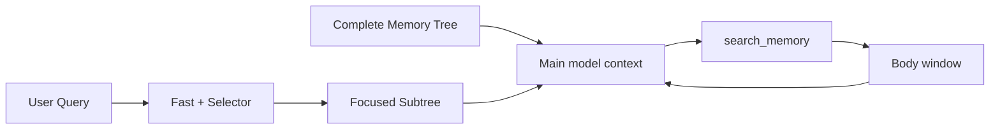
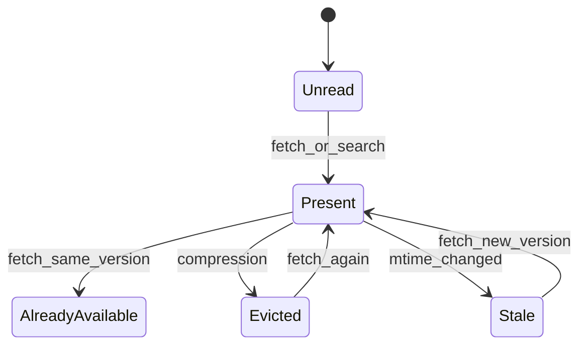

# Structured Auto Memory Recall

## Goals

The legacy Auto Memory path adds a flat `MEMORY.md` index to the main model
context, then uses a selector or heuristic to inject selected memory bodies.
As the corpus grows, the default context grows with it and the model receives
little help understanding relationships between topics.

Structured recall changes that context shape to:

```text
Complete Memory Tree + Focused Subtree + on-demand body
```

The complete tree is a global map, the focused subtree narrows that map for the
current request, and `search_memory` reads body text only when metadata is not
enough. Existing memories without complete metadata stay on the legacy path
while background migration enriches them. The protocol switches only after all
visible memory is ready.

The design aims to:

- preserve existing memory files and bodies without manual migration;
- replace the flat index in the main model context with a hierarchical map;
- reduce default-context and duplicate-body token cost;
- retain both deterministic fast recall and model-based semantic selection;
- keep body reads, compression eviction, and file updates consistent.

## Storage And Scopes

Structured recall does not change how memory paths are resolved across
Windows, Linux, and macOS. The logical layout is the same, while the base
directory follows the platform and runtime configuration.

| Scope   | Default location                               | Meaning                                              |
| ------- | ---------------------------------------------- | ---------------------------------------------------- |
| Project | `<memory-base>/projects/<project-key>/memory/` | Private memory for the current Git root or workspace |
| User    | `<memory-base>/memories/`                      | Cross-project user preferences and background        |
| Team    | `<git-root>/.qwen/team-memory/`                | Git-tracked memory shared by a team                  |

`QWEN_CODE_MEMORY_BASE_DIR` overrides the base directory. Only Project Memory
honors `QWEN_CODE_MEMORY_LOCAL=1`, which moves it to
`<project>/.qwen/memory/`. User Memory remains under the global memory base; a
`user/*.md` file under a Project root is still Project Memory. Scope comes from
the scanned root, not the first relative-path segment.

The private Project root under the global memory base remains available in an
untrusted workspace. Repo-local compatibility memory is visible only when the
workspace is trusted. With `QWEN_CODE_MEMORY_LOCAL=1`, the Project root itself
is repo-local, so Project Memory is unavailable until the workspace is trusted.

Each topic file uses YAML frontmatter followed by a Markdown body:

```yaml
---
name: model-pull-memory-design
description: Qwen Code Auto Memory uses structured metadata and on-demand body retrieval.
type: project
category: tool_experience
keywords:
  - structured memory recall
  - focused subtree
  - search_memory
usage_scenarios:
  - Designing Auto Memory recall behavior
  - Evaluating recall quality and token cost
---
```

`name`, `description`, `category`, `keywords`, and `usage_scenarios` describe
the complete body and are refreshed when its meaning changes. Keywords may be
ordinary terms, phrases, APIs, tool names, issue ids, or project-specific
identifiers.

## Recall Protocols

### Legacy

If any currently visible scope contains a memory with missing or invalid
structured metadata, the session starts in the legacy protocol:

```text
MEMORY.md -> selector / heuristic -> selected body snippets
```

Legacy retains surfaced-path deduplication and active-tool noise filtering.
Background migration does not interrupt this path, so old memories remain
recallable while they are enriched.

### Structured

After every visible memory passes metadata validation, the system prepares new
indexes and a structured system prompt. It confirms that the corpus revision
has not changed, then atomically commits the `legacy -> structured` transition.
Preparation or confirmation failure leaves the legacy protocol active.



The current implementation only transitions `legacy -> structured` within a
session. A structured session does not immediately fall back because of an
external file change. Normal Extraction, Remember, Dream, and Migration writes
must produce valid metadata, and a new session evaluates corpus readiness
again during initialization. Changing the working directory resets the recall
mode, corpus revision, pending delivery, and body-residency state before the
new project memory is loaded.

## Complete Memory Tree

The Complete Memory Tree is the current snapshot's global metadata map. It
contains category, lossless `ref`, and title, but no bodies or flat
`MEMORY.md` content:

```text
## Complete memory tree

tool_experience
├── [project:reference/cua-driver-rs.md] cua-driver-rs-reference
└── [project:project/model-pull-memory.md] model-pull-memory-design

project_context
└── [team:reference/release-process.md] release-process
```

The tree enters context on the first structured delivery. Later deliveries
occur only when the corpus revision changes and explicitly replace the older
tree; an unchanged complete tree is not injected on every user query. Both the
main client and ACP commit the delivered revision only after the request is
actually sent. Failure or cancellation does not advance delivery state.

A `ref` is protocol identity, not display text. It uses scope plus lossless
relative-path encoding. Display sanitization cannot change it, and scanning
detects identity collisions so every file remains uniquely fetchable.

## Focused Subtree

The Focused Subtree contains query-relevant paths from the Complete Memory
Tree. It is not a replacement global tree:

```text
## Memory focus for this turn

The paths below are the query-relevant subtree for this turn. They add focus
to the existing memory tree; they do not replace it.
└── tool_experience
    关键词：structured memory recall, selector latency, search_memory
    ├── [project:project/model-pull-memory.md] model-pull-memory-design
    │   摘要：...
    │   适用：...
    └── [内容已在当前上下文] [project:reference/cua-driver-rs.md] cua-driver-rs-reference
```

Keywords shared by leaves in one category are aggregated on the parent to
avoid repetition. A leaf keeps its ref, title, description, and usage
scenarios. The focused prompt has a fixed character budget; if necessary it
drops lower-ranked leaves and reports the omitted count.

The in-memory `bodyPresentVersions` state controls whether a leaf is rendered
as already present:

- unread bodies expose metadata so the model can search or fetch;
- a body still in history with the same mtime uses a resident placeholder;
- compression eviction clears residency and makes the metadata readable again;
- an mtime change makes the old body stale and permits a new read.

The placeholder replaces body guidance for one leaf. It does not remove the
category's aggregated keywords, the ref, or the title.

## Fast Recall And Selector

The fast scorer and selector read the same snapshot but have different roles:

1. The deterministic fast scorer selects at most two candidates and favors
   exact titles, identifiers, complete keyword phrases, and multiple metadata
   term matches.
2. The selector receives a bounded metadata manifest and performs semantic
   selection and reranking.
3. A fast result may form a Focused Subtree at the first available delivery
   point.
4. A refined selector result is delivered at a later safe injection point and
   merged with fast results by ref. It never narrows the Complete Tree snapshot.

Short Latin keywords require token boundaries, so `ai` does not match
`explain`. Han, Hiragana, Katakana, and Hangul use a shared CJK tokenizer. Body
text is a low-weight fallback and cannot override clear metadata matches.

The selector is an asynchronous side query and does not remove the
deterministic fast entry point. An aborted, timed-out, or invalid selector
result falls back without stopping the main request. The selector manifest is
currently capped at 25,000 bytes; this is a context budget and does not promise
that every candidate in a large corpus reaches the selector.

Recall still enumerates trusted roots and stats every visible file on each
scan. A cache owned by the session's `MemoryManager` reuses a parsed document
only when its resolved path, scope, mtime, ctime, size, and inode are unchanged.
File creation, deletion, in-place modification, and atomic replacement
therefore invalidate naturally without a process-global snapshot or watcher.
Session reset and working-directory changes clear the cache.

## `search_memory`

In structured mode, the protocol directs the main model to retrieve
managed-memory bodies through `search_memory`:

- `search` accepts one to five keywords when the exact ref is unknown, with
  optional scopes, categories, and result limit;
- `fetch` reads a known ref copied exactly from the tree or a search result;
- `explore` lists bounded category branches as metadata only, with no body
  content and a cursor for each truncated branch;
- `cursor` continues an adjacent body window and is not a field for a new
  search request.

Keyword validation supports Unicode letters and numbers plus Han, Hiragana,
Katakana, and Hangul. Scopes are stably deduplicated before scanning. Ranking
combines metadata coverage, phrase and identifier matches, corpus rarity, and
coverage of previously unmatched keywords.

Search and fetch enforce result, window, and aggregate body budgets. The tool
owns those budgets, so the generic scheduler does not truncate its JSON again.
A window clipped by the readable file range does not exhaust a whole ref; a
ref becomes exhausted only after its cumulative per-turn body budget is
actually consumed.

Every new UserQuery resets turn-local duplicate claims and exhausted refs. A
ToolResult continuation does not. If a file disappears after the snapshot,
fetch returns it in `missingRefs` with a warning rather than silently omitting
it.

## Body Residency And Compression

The system distinguishes a body that was read sometime in the session from a
body still present in model history:



When a `search_memory` result enters history, the manager records its ref and
mtime. Fetching the same version while it remains present returns
`alreadyAvailable` without duplicating the body. When microcompaction or
memory-pressure compaction clears a tool result, it reports the evicted refs
to the manager before the next Focused Subtree is rendered. The prompt cannot
claim that an evicted body is still available. If compression occurs after a
delivery was prepared but before its state is committed, both the main loop and
ACP clear the state again after commit so the deferred commit cannot restore a
revision or residency marker that compression removed.

On ToolResult turns, size-only microcompaction runs before recall consumes the
snapshot. The ordering is shared by the normal model loop and ACP sessions.

## Managed-memory Tool Routing

Structured recall does not turn general Core file tools into a Memory
filesystem sandbox. `read_file`, Glob, Grep, directory listing, write tools,
and Shell retain Qwen Code's existing permission and sandbox semantics. The
structured prompt tells the main model to use `search_memory` for body reads
and `manage_memory` for writes, and not to access managed-memory paths through
general tools. This is a model routing contract, not a security boundary.

Memory maintenance agents continue to use their scoped permission managers
and trusted-root checks for the operations they own. Generic subagents and
external memory systems receive no new implicit Memory integration, but this
design does not add capability switches to generic file tools or attempt to
parse every possible Shell command.

## Metadata Writers And Background Tasks

Four writing paths maintain structured metadata:

- Extraction derives durable information from new conversation history.
- Remember handles explicit user memory requests.
- Dream and User Dream consolidate, deduplicate, and split existing memory.
- Migration only enriches legacy files; it does not replace routine Dream work.

One migration batch attempts at most 10 files and reads at most 40,000 body
characters. Each completed UserQuery can schedule at most one Project and one
User batch in both the normal model loop and ACP. A process-wide single-flight
claim is taken before candidate scanning, so sessions in the same process do
not start the same scope/root concurrently. Scheduling returns `running`; it
does not queue an automatic continuation. Separate processes do not share a
migration lock; per-file no-follow and source-hash/CAS checks prevent stale
writes if they overlap. A one-shot headless process does not implicitly
self-drain additional batches before exit, preserving its latency and
background model cost. Existing task surfaces show and cancel migration tasks.

Project Dream and User Dream use PID/mtime locks per root, so multiple sessions
cannot consolidate the same corpus concurrently. A session that cannot acquire
the lock returns `locked` and is not automatically queued. Dream retains its
existing mutation, time, and document-count triggers; it is not responsible for
migrating every old file.

`pinned/` is a protected user area. Scoped maintenance tools cannot modify
pinned files, and the Dream manifest executor rejects delete, dedupe, and split
operations addressing pinned paths. After taking the lock and before starting
the planner, each Dream run removes a stale manifest so a previous abnormal
exit cannot schedule operations in a later run.

## Migration Safety And Consistency

Migration follows these constraints:

- preserve body content and update only frontmatter;
- reject symlinked memory roots and root-boundary escapes before body reads;
- commit leaves with no-follow and source-hash/CAS checks;
- skip a file that disappears concurrently while retaining committed progress;
- report permission and root-safety errors as scope failures, never as ready;
- treat a missing compatibility root as a no-op without creating it;
- expose each committed canonical phrase to subsequent metadata generation.

Readiness becomes true only when every requested scope validates. Index
rebuild, revision revalidation, and prompt construction must all succeed before
the structured protocol is committed.

## Observability

Telemetry records:

- recall scan, fast, selector, and delivery timing;
- Complete Tree delivery and discard reason;
- search/fetch/explore result counts, body characters, and source status;
- migration scan, legacy, commit, conflict, failure, token, and timing data;
- recall-mode transitions.

Logs do not include query text, memory bodies, or physical memory paths.
Selector hit rate and delivery timing can be claimed in an evaluation only when
the corresponding timeline telemetry is present.

## Quality And Cost

Structured mode should reduce main-context tokens by removing the flat
`MEMORY.md`, avoiding duplicate bodies, and reading bounded windows on demand.
The complete topic map, metadata fast recall, and semantic selector should make
recall more stable. These are design hypotheses, not evidence by themselves.

An evaluation must compare Legacy and Structured with the same model,
repository revision, memory corpus, independent fresh contexts, and fixed
cases. It should report:

- task and recall quality;
- recall contribution, misses, and tool failures;
- main-path and background-task tokens;
- P50/P95 latency and runtime failures;
- selector timing, tree/subtree delivery, and body-read behavior.

The current large-sample evaluation has confidence intervals crossing zero for
quality deltas, so it does not establish a significant quality improvement. It
does show lower-token and median-latency signals. The same cases must be rerun
after the latest correctness fixes before treating those measurements as final.

## Non-goals

This design does not currently include:

- automatically running every migration batch before one headless invocation
  exits;
- increasing the selector manifest budget without evaluation evidence;
- making Dream responsible for full legacy-corpus migration;
- automatically injecting structured Memory context or dedicated Memory
  workflows into generic subagents or external memory systems;
- committing per-case evaluation data, raw API logs, or full transcripts as
  part of the design.

## Summary

Structured recall turns Auto Memory from a flat body collection into a
navigable, searchable, on-demand memory map. The Complete Tree supplies global
understanding, the Focused Subtree supplies task focus, fast recall and the
selector choose paths, and `search_memory` manages body windows and residency.
Legacy fallback and incremental migration protect existing memory, while
atomic protocol delivery, trusted-root checks, and compression feedback keep
the system consistent in long-running and multi-session use.
