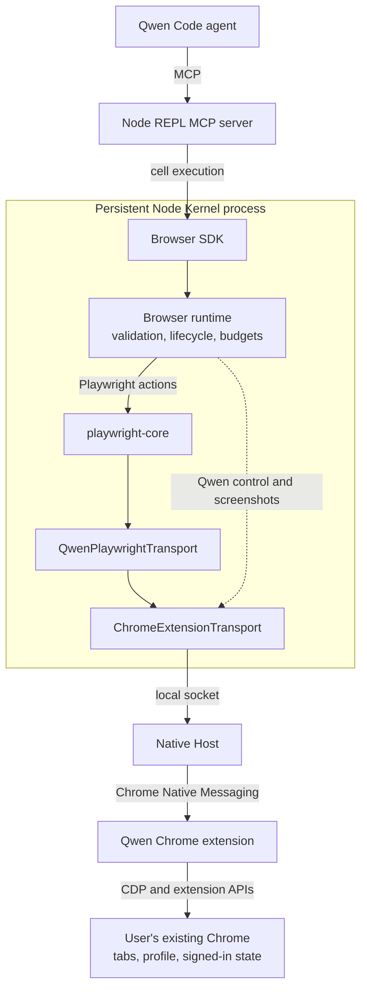

# Browser Use with Playwright Core

## Goal

Browser Use gives models a structured API for controlling the user's existing
Chrome from Qwen Code.

- The Browser SDK runs as a library inside the persistent Node Kernel exposed
  by the Node REPL MCP server.
- `playwright-core` provides standard browser automation semantics.
- The Qwen Chrome extension and `chrome.debugger` connect the runtime to Chrome.
- The first release supports one active Browser Use session.

## Architecture

Standard browser actions pass through Playwright. Browser control operations
and screenshot acquisition share the same Native Messaging path but bypass
Playwright's browser-level CDP adapter.

`playwright-core@1.62.1` accepts a public custom CDP transport through
`chromium.connectOverCDP(transport)`. Qwen therefore keeps Native Messaging and
does not add a local WebSocket server.

Browser Use ships with Qwen Code as a bundled skill and its runtime resources.
No separate Qwen extension installation is required. The skill's `runtime/`
directory contains the Browser SDK, Native Host, and pinned Playwright
dependency. The skill registers `runtime/node_modules` with the existing Node
REPL and imports `runtime/index.js`; the CLI does not execute browser logic.
Source development, transpiled builds, and the published CLI use this same
layout. The generic Node REPL MCP server must be configured, and the Qwen
Chrome extension must be installed in the browser. Bundling does not connect
to Chrome at CLI startup; the SDK connects when first used.

Native Host registration is native-side product setup, not a Chrome-extension
operation. On macOS and Linux, the first Browser runtime initialization
idempotently installs the launcher and manifests for existing Google Chrome,
Chrome for Testing, and Chromium profile roots. It refuses to overwrite
foreign files: a conflicting launcher aborts initialization, while a
conflicting browser manifest is skipped. Running
`node <skill-base>/runtime/scripts/native-host-setup.js uninstall` removes
files owned by Browser Use. The Chrome extension only opens the registered host
through `connectNative()`.

## Responsibilities

| Component                  | Responsibility                                                                                                  |
| -------------------------- | --------------------------------------------------------------------------------------------------------------- |
| Node REPL                  | Generic process isolation, persistent bindings, cancellation, and output budgets. It contains no browser logic. |
| Browser SDK                | Model-facing task API. Its private adapter enforces the JSON boundary without exposing transport details.       |
| Browser runtime            | Command validation, Qwen tab lifecycle, screenshot acquisition, output budgets, and diagnostics.                |
| `playwright-core`          | Locators, AI accessibility snapshots and refs, frames, navigation waits, actions, and events.                   |
| `QwenPlaywrightTransport`  | Adapts Playwright's browser-level CDP connection to Qwen tab and child-session identifiers.                     |
| `ChromeExtensionTransport` | Owns the local socket and directly exchanges requests and events with the Native Host.                          |
| Native Host                | Minimal framed relay between the local socket and Chrome Native Messaging.                                      |
| Chrome extension           | Chrome permissions, `chrome.debugger` attachment, and CDP forwarding.                                           |

## Browser SDK

The Browser SDK is the model-facing object API. `BrowserAgent` selects a
browser backend, `Browser` provides user-tab discovery and tab management, and
each `Tab` exposes navigation, screenshots, dialogs, and three interaction
styles. The current backend controls the user's Chrome through the Qwen
extension.

The SDK and browser runtime share one internal command contract. SDK objects
translate model calls into validated commands, and the runtime executes those
commands against a Playwright `Page` or the screenshot/control adapters.
Playwright objects, CDP sessions, and transport details are not exposed through
the SDK.

Every SDK object is bound to the runtime session that created it. Closing that
runtime marks its Agent, Browser, Tab, and Locator objects stale; initializing a
new runtime never redirects older objects to the new backend.

The model-facing API structure follows the Codex Browser Use SDK. Its three
tab interaction APIs are kept separate because they represent different ways
for the model to identify a target: semantic page structure, DOM snapshot
nodes, and visual coordinates. This is a grounding distinction rather than an
implementation distinction or an API compatibility layer.

Playwright is the common automation engine behind all three interaction
styles:

| API              | Grounding               | Playwright implementation                                      |
| ---------------- | ----------------------- | -------------------------------------------------------------- |
| `tab.playwright` | Semantic page structure | `Page`, `Locator`, and `FrameLocator`                          |
| `tab.dom_cua`    | Snapshot `node_id`      | AI accessibility snapshot and `aria-ref` locator               |
| `tab.cua`        | Viewport coordinates    | Mouse and keyboard input, with CDP for auxiliary mouse buttons |

`tab.playwright` is used when an element can be described semantically.
`tab.dom_cua` is used when the model identifies an element in a DOM snapshot.
`tab.cua` is used when the target is identified visually in a screenshot.
The extension renders a transient pointer overlay for coordinate mouse input,
but that decoration is best-effort and never delays the input command itself.
Its DOM node is created on mouse input and removed when the pointer expires;
read-only inspection does not create an overlay node.

Browser operations run in the background. New tabs do not replace the user's
active tab, and input actions do not bring Chrome to the foreground. Page focus
emulation keeps background rendering and input active without changing desktop
focus.

Input actions and navigation waits have separate deadlines. Locator clicks,
locator key presses, and DOM CUA clicks disable Playwright's implicit
post-action navigation wait. The action deadline covers performing input;
`expectNavigation()` registers its listener before the action and waits for
the requested navigation state with its own deadline. Successful input does
not imply that the destination has loaded. A short, bounded renderer drain
allows queued input handlers to run without waiting for a new page context.

`tab.playwright.domSnapshot()` returns Playwright's general AI accessibility
snapshot. `tab.dom_cua.get_visible_dom()` filters that snapshot to interactive
elements while preserving its `aria-ref` values as `node_id`. DOM CUA actions
resolve those ids through Playwright's `aria-ref` locator. The adapter and its
tests are pinned to the same Playwright version because the snapshot text
format is version-sensitive.

Playwright's public CDP session API supplies coordinate CUA buttons 4 (back)
and 5 (forward), which the higher-level Playwright mouse API does not expose.
Snapshot truncation, screenshot encoding and budgets, stale-session detection,
and the JSON transport envelope remain runtime implementation details rather
than model-facing options.

Viewport screenshots return an image object accepted by `nodeRepl.emitImage()`.
Its metadata carries the original JPEG dimensions, viewport, device pixel ratio,
and CSS-pixel coordinate space so visual coordinates remain usable when a model
client resizes the preview. Viewport screenshots are limited by their encoded
byte size rather than rejected from viewport dimensions alone. Explicit clips
and full-page captures retain a pixel budget because their dimensions are
caller-controlled or potentially unbounded.

Screenshot acquisition follows the Codex Browser Use strategy independently of
Playwright's screenshot preparation. A short, bounded rendering synchronization
lets pending paint catch up before capture. Normal viewport capture requests a
fresh CDP screencast frame with a two-second frame deadline, then falls back to
`Page.captureScreenshot` with a five-second command timeout. Clips and full-page
captures use the latter directly. Frames predating the request are discarded;
captures on each tab are serialized and their event listeners and screencasts
are cleaned up. The runtime owns these events so Playwright does not acknowledge
the same frames. Images use JPEG quality 80, retain CSS-pixel coordinates, and
never require activating the tab or bringing Chrome to the foreground. An
individual screenshot timeout does not detach the browser session.

Locator `downloadMedia()` triggers a media or file-link download, while
`waitForEvent("download")` provides synchronization for downloads triggered
by other page actions. The returned download object is opaque and does not
expose the host filesystem path.

`downloadMedia()` is a Qwen adapter because Playwright has no equivalent
locator method. Qwen resolves the element through a Playwright locator, briefly
creates a page-local download link for the resolved media URL, clicks it, and
removes it immediately. Callers synchronize through Playwright's `download`
event.

JavaScript dialogs use type-specific actions: alerts and before-unload dialogs
can be dismissed, confirms can be accepted or dismissed, and prompts require
text when accepted. The SDK also exposes the dialog message and prompt default
value.

## Transport

`QwenPlaywrightTransport` implements Playwright's `ConnectOverCDPTransport` and
handles only the browser-level adaptation Playwright requires:

- browser discovery and version responses;
- registering Qwen-controlled tabs as attached Playwright targets and binding
  each Playwright `Page` by its exact CDP target id;
- Playwright session IDs mapped to Chrome tabs and child CDP sessions,
  including the explicit target sessions created by Playwright's public
  `newCDPSession(page)` API;
- popup, worker, iframe, and out-of-process iframe lifecycle.

Unknown browser-level commands fail as individual CDP requests; they do not
close the transport or get forwarded to an arbitrary tab.
Malformed target attachment data is a transport protocol violation: it closes
the Playwright connection and makes all objects from that session stale.

Page-level `Page`, `Runtime`, `DOM`, `Accessibility`, `Input`, `Network`,
`Fetch`, `Storage`, and `Emulation` commands and events pass through without
Qwen reimplementing them. Browser diagnostics retain a bounded in-memory view
of Playwright console events. HAR export is not included until a
product caller requires it.

Chrome reports downloads from an extension debugger target as `Page` events,
while Playwright consumes the corresponding browser-level events. The
transport translates only those event names and preserves their payloads; it
does not maintain a separate download state machine.

The Qwen control plane retains operations that are not CDP, including
`openTabs`, `claimTab`, `session.name`, and `history.query`.

Native Host messages sent to Chrome are limited to 1 MiB. Larger
backend-to-extension messages are split into bounded protocol chunks and
reassembled by the extension before dispatch.

## Session model

The Node Kernel directly owns the local Chrome extension transport:

- one Browser Use session may be active for the current OS user;
- one session may control multiple tabs;
- a second session fails with `BROWSER_USE_BUSY`;
- closing the session closes still-controlled agent-created tabs, including
  handoffs, releases claimed tabs, and then releases the local socket;
- a transport disconnect invalidates the current Playwright connection;
- tab-scoped objects from the disconnected connection fail with
  `STALE_BROWSER_SESSION` and are never silently rebound.
- closing and reinitializing Browser Use creates a new SDK object generation;
  handles retained from the closed generation remain stale.

Browser Use does not add a polling heartbeat to the extension service worker.
The active `runtime.connectNative()` port keeps the worker alive on Chrome 105
and later, and an active `chrome.debugger` session provides an additional
keepalive on Chrome 118 and later. This differs from the separate `/cdp`
WebSocket bridge and follows Chrome's documented extension service-worker
lifecycle. A real-Chrome session must remain usable after more than 60 seconds
without Browser Use traffic.

When the backend socket disappears after connecting, the Native Host exits and
Chrome closes its Native Messaging port. The extension handles that port
disconnect by detaching the session's controlled tabs, removing Browser Use
overlays, clearing ownership and derived-tab state, ungrouping managed tabs
without closing them, and reconnecting the Native Host for a future backend.

At the end of a browser turn, `tabs.finalize()` treats `keep` as the complete
set for that call: it closes unlisted agent-created tabs and releases unlisted
claimed tabs. Deliverable tabs remain open but are released; handoff tabs
remain open and controlled until the next finalization or runtime close. A
handoff that is still needed must be included again in the next turn. An
agent-created popup keeps that ownership if its opener closes before
finalization. The extension is the source of browser-side ownership, while the
runtime keeps the corresponding session projection; agent-created ownership
takes precedence if a derived tab is observed through both paths.

`tabs.finalize()` validates the complete `keep` set before closing anything. An
unknown, stale, or duplicate entry aborts finalization so a malformed keep list
cannot accidentally close a page the model intended to preserve.

The first release adds no separate Browser Use authorization or process
authentication layer.

The `qwen serve` `/cdp` bridge is not part of Browser Use. It is a serve-mode
tunnel for an external automation adapter and the active Chrome tab. Browser
Use instead operates in a normal Qwen Code session and provides multi-tab
discovery and Qwen-specific control operations that are not CDP.

The two paths are independent debugger clients and are mutually exclusive per
tab. Browser Use fails clearly when `/cdp`, DevTools, or another debugger
already owns a tab.

## Playwright code reuse

The implementation adapts the following Apache-2.0 Playwright sources from
revision
`350d24a344b07543fdc4014339a7871fd1c1b227`:

| Upstream file     | Qwen use                                                                                    |
| ----------------- | ------------------------------------------------------------------------------------------- |
| `browserModel.ts` | Copy and adapt target discovery and browser-level CDP behavior.                             |
| `cdpRelayV2.ts`   | Fold its dispatch/event logic into `QwenPlaywrightTransport`; omit its WebSocket handshake. |

The Native Messaging protocol and extension relay also carry Qwen-only
operations such as tab discovery and History.

The adapted code uses only public Playwright APIs, conforms to Qwen's strict
TypeScript rules, and fails closed on attachment errors. Copyright headers, the
Playwright source revision, and NOTICE are preserved in the Browser Use
package.

The Browser Use package pins `playwright-core@1.62.1` independently because the
custom CDP transport API and the pairing between
`ariaSnapshot({ mode: "ai" })` output and `aria-ref` locators are
version-sensitive. Every Playwright upgrade must pass a real Chrome smoke test
that takes an AI snapshot and acts on one of its returned refs. Existing
workspace consumers remain on their current Playwright versions; this feature
does not require a repository-wide upgrade.

## Product decisions

For the first release:

- installing the Qwen Chrome extension authorizes Browser Use;
- first use on macOS or Linux automatically registers the Native Host without
  a separate prompt;
- Browser Use may enumerate and claim top-level HTTP(S) tabs by default;
- History is declared with the other required extension permissions; there is
  no Browser Use permission-management UI;
- there is no Browser Use-specific origin allowlist, upload-root allowlist, or
  snapshot redaction in this release;
- the existing Qwen toolbar action and side panel remain;
- there is no separate Browser Use enable/disable switch yet.

## Current boundaries and future work

- **Sessions:** One Browser Use session may be active per OS user, and that
  session may control multiple tabs. Future support for concurrent sessions
  must isolate tab ownership, event routing, cleanup, and reconnect behavior.
- **Turn cleanup:** Finalization is an explicit final browser action. Closing
  the runtime provides a fallback, but interrupting a model turn does not close
  the persistent runtime; still-controlled tabs remain managed until a later
  finalization or runtime close. A transport disconnect releases them without
  closing their pages. A future Qwen turn-lifecycle hook should invoke
  finalization independently of model behavior.
- **Browser backends:** The Qwen extension currently connects the SDK to
  Chrome. Other browser families or an in-app browser should be added together
  with capability discovery when products need them.
- **Product control:** Add Qwen-owned opt-in and authenticate the local
  connection.
- **History:** Make Chrome History optional through a Qwen-owned grant and
  revoke flow outside the side panel.
- **Platform and optional APIs:** Native Host installation currently supports
  macOS and Linux. Windows support and optional APIs such as clipboard, page
  assets, HAR, and read-only evaluate should be introduced independently when
  a product workflow requires them.
