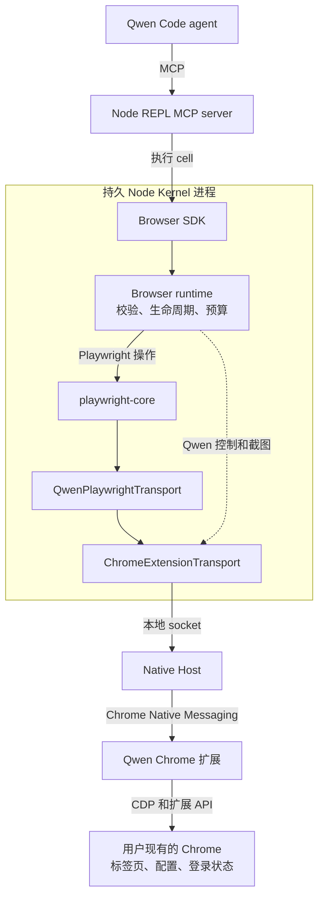

# 基于 Playwright Core 的 Browser Use

[English](browser-use.md) | [简体中文](browser-use.zh-CN.md)

## 目标

Browser Use 为模型提供结构化 API，使其能够从 Qwen Code 控制用户现有的 Chrome。

- Browser SDK 作为库运行在 Node REPL MCP server 暴露的持久 Node Kernel 内。
- `playwright-core` 提供标准浏览器自动化语义。
- Qwen 扩展和 `chrome.debugger` 将运行时连接到 Chrome。
- 首个版本支持一个活跃的 Browser Use 会话。

## 架构

标准浏览器操作经过 Playwright。浏览器控制操作和截图获取共用同一条 Native Messaging 路径，但绕过 Playwright 的浏览器级 CDP 适配器。

`playwright-core@1.62.1` 通过 `chromium.connectOverCDP(transport)` 接受公共自定义 CDP transport。因此 Qwen 保留 Native Messaging，不添加本地 WebSocket server。

## 职责

| 组件                       | 职责                                                                  |
| -------------------------- | --------------------------------------------------------------------- |
| Node REPL                  | 通用进程隔离、持久绑定、取消和输出预算，不包含浏览器逻辑。            |
| Browser SDK                | 面向模型的任务 API；私有适配器执行 JSON 边界约束，不暴露传输细节。    |
| Browser runtime            | 命令校验、Qwen 标签页生命周期、截图获取、输出预算和诊断。             |
| `playwright-core`          | Locator、AI 无障碍快照和 ref、frame、导航等待、操作和事件。           |
| `QwenPlaywrightTransport`  | 将 Playwright 浏览器级 CDP 连接适配到 Qwen 标签页和子会话标识。       |
| `ChromeExtensionTransport` | 拥有本地 socket，直接与 Native Host 交换请求和事件。                  |
| Native Host                | 在本地 socket 和 Chrome Native Messaging 之间转发带帧消息的最小中继。 |
| Chrome 扩展                | Chrome 权限、`chrome.debugger` 附加和 CDP 转发。                      |

## Browser SDK

Browser SDK 是面向模型的对象 API。`BrowserAgent` 选择浏览器后端，`Browser` 提供用户标签页发现和管理，每个 `Tab` 暴露导航、截图、对话框以及三种交互方式。当前后端通过 Qwen 扩展控制用户的 Chrome。

SDK 与浏览器运行时共用内部命令契约。SDK 对象将模型调用转换为经过校验的命令，运行时通过 Playwright `Page` 或截图／控制适配器执行这些命令。SDK 不暴露 Playwright 对象、CDP 会话或传输细节。

每个 SDK 对象绑定到创建它的运行时会话。关闭运行时会使其 Agent、Browser、Tab 和 Locator 对象失效；初始化新运行时不会把旧对象重新指向新后端。

面向模型的 API 结构参考 Codex Browser Use SDK。三种标签页交互 API 分别对应模型识别目标的三种依据：语义页面结构、DOM 快照节点和视觉坐标。这种划分基于目标定位依据，而非实现方式，也不是 API 兼容层。

三种交互方式共用 Playwright 自动化引擎：

| API              | 定位依据       | Playwright 实现                      |
| ---------------- | -------------- | ------------------------------------ |
| `tab.playwright` | 语义页面结构   | `Page`、`Locator` 和 `FrameLocator`  |
| `tab.dom_cua`    | 快照 `node_id` | AI 无障碍快照和 `aria-ref` locator   |
| `tab.cua`        | 视口坐标       | 鼠标和键盘输入，辅助鼠标按钮使用 CDP |

可以用语义描述元素时使用 `tab.playwright`；模型从 DOM 快照识别目标时使用 `tab.dom_cua`；从截图视觉定位目标时使用 `tab.cua`。

页面和 locator 的 evaluation 接受函数或字符串。函数按文档规定的参数调用；字符串返回 JavaScript `eval` 的完成值，支持尾部分号、注释和语句。字符串求值保留 SDK 的词法绑定 `arg`、`element` 和 `elements`。值为函数的字符串不会被调用。需要 `await` 时使用异步函数参数，在字符串中使用对象字面量时加括号。Evaluation 的超时覆盖整个调用，包括元素查找，并返回 `OPERATION_TIMEOUT`。显式操作超时必须为 1 到 120,000 ms 的整数；零值以 `INVALID_ARGUMENT` 拒绝。省略超时时保留各操作的默认值。仅用于延时的 `waitForTimeout` 接受 0 到 120,000 ms，其中零表示不等待。超时结束调用方的等待，不会终止已在页面运行的 JavaScript。

Evaluation 接受 JSON 数据：有限数、字符串、布尔值、null、数组和普通记录，包括 TypeScript readonly 数据。公开的 `JsonSerializable` 类型约束参数和结果。非 JSON 参数在 dispatch 前拒绝；结果在页面内、Playwright 序列化之前校验。运行时传输编码后的 JSON 文本，使 `__proto__` 等对象键保留数据含义。嵌套 undefined、非有限数、Date、RegExp、函数和循环引用会被拒绝，不会静默转换。省略的顶层参数保持 undefined；顶层 undefined 结果转换为 null，返回类型也反映这一行为。类型为 void 的回调可能只是丢弃了实际返回值，因此其返回类型使用更宽的 JsonSerializable，不承诺一定为 null。

Locator plan 的每个数组最多包含 32 步，最多嵌套 32 层，顶层数组计为第一层。深度上限同样适用于 `and`、`or`、`filter.has` 和 `filter.hasNot`。超过深度的 plan 在浏览器启动前以 `INVALID_ARGUMENT` 校验失败；正常 locator 组合仍受支持。

输入操作与导航等待使用独立超时。Locator 点击、按键和 DOM CUA 点击关闭 Playwright 隐式的操作后导航等待。操作超时覆盖输入执行；`expectNavigation()` 在操作前注册监听器，并使用自己的超时等待请求的导航状态。输入成功不代表目标页面已加载。短暂且有上限的 renderer drain 允许排队的输入处理器运行，而不等待新的页面上下文。

`tab.playwright.domSnapshot()` 返回 Playwright 通用 AI 无障碍快照。`tab.dom_cua.get_visible_dom()` 将快照过滤为可交互元素，并把 `aria-ref` 值保留为 `node_id`。DOM CUA 操作通过 Playwright 的 `aria-ref` locator 解析这些 id。由于快照文本格式与版本有关，适配器及其测试固定使用同一 Playwright 版本。

Playwright 公共 CDP session API 提供坐标 CUA 的按钮 4（后退）和 5（前进）；较高层的 Playwright mouse API 不暴露它们。快照截断、截图编码和预算、会话失效检测及 JSON 传输封装属于运行时实现细节，不作为面向模型的选项。

视口截图返回 `nodeRepl.emitImage()` 可接受的图像对象。元数据包含原始 JPEG 尺寸、视口、设备像素比和 CSS 像素坐标空间，使模型客户端缩放预览后视觉坐标仍可用。视口截图根据编码字节数限制，不会仅因视口尺寸而拒绝。显式 clip 和整页截图保留像素预算，因为其尺寸由调用方控制或可能无界。

截图获取采用 Codex Browser Use 策略，独立于 Playwright 的截图准备。短暂且有上限的渲染同步让待处理绘制在截图前完成。普通视口截图请求新的 CDP screencast 帧，帧期限为两秒，然后回退到命令超时为五秒的 `Page.captureScreenshot`。Clip 和整页截图直接使用后者。请求之前的旧帧会被丢弃；每个标签页的截图串行执行，事件监听器和 screencast 均会清理。运行时拥有这些事件，Playwright 不会重复确认同一帧。图像采用 JPEG quality 80，保留 CSS 像素坐标，不需要激活标签页或将 Chrome 置于前台。单次截图超时不会断开浏览器会话。

Locator `downloadMedia()` 触发媒体或文件链接下载；`waitForEvent("download")` 用于同步其他页面操作触发的下载。返回的下载对象不透明，不暴露宿主文件系统路径。

`downloadMedia()` 是 Qwen 适配功能，因为 Playwright 没有等价 locator 方法。Qwen 通过 Playwright locator 解析元素，为媒体 URL 临时创建页面内下载链接，点击后立即删除。调用方通过 Playwright `download` 事件同步。

JavaScript 对话框使用类型相关操作：alert 和 before-unload 可以 dismiss，confirm 可以 accept 或 dismiss，prompt 在 accept 时需要文本。SDK 同时暴露对话框消息和 prompt 默认值。

## 传输

`QwenPlaywrightTransport` 实现 Playwright 的 `ConnectOverCDPTransport`，仅处理 Playwright 所需的浏览器级适配：

- 浏览器发现和版本响应；
- 将 Qwen 控制的标签页注册为已附加的 Playwright target，并通过精确 CDP target id 绑定每个 Playwright `Page`；
- 将 Playwright session ID 映射到 Chrome 标签页和子 CDP 会话，包括公共 `newCDPSession(page)` API 创建的显式 target session；
- Popup、worker、iframe 和跨进程 iframe 的生命周期。

未知的浏览器级命令作为单个 CDP 请求失败，不会关闭 transport，也不会转发给任意标签页。格式错误的 target attachment 数据属于传输协议违规：会关闭 Playwright 连接并使该会话的所有对象失效。

页面级 `Page`、`Runtime`、`DOM`、`Accessibility`、`Input`、`Network`、`Fetch`、`Storage` 和 `Emulation` 命令及事件直接转发，Qwen 不重新实现它们。浏览器诊断保留有上限的 Playwright console 事件内存视图。在产品调用方提出需求前，不包含 HAR 导出。

Chrome 将扩展 debugger target 的下载报告为 `Page` 事件，而 Playwright 消费对应的浏览器级事件。Transport 仅翻译这些事件名并保留载荷，不维护单独的下载状态机。

Qwen 控制面保留非 CDP 操作，包括 `openTabs`、`claimTab`、`session.name` 和 `history.query`。

## 会话模型

Node Kernel 直接拥有本地 Chrome 扩展 transport：

- 每个操作系统用户最多有一个活跃的 Browser Use 会话；
- 一个会话可以控制多个标签页；
- 第二个会话以 `BROWSER_USE_BUSY` 失败；
- 关闭会话会 detach 其标签页并释放本地 socket；
- Transport 断开会使当前 Playwright 连接失效；
- 断开连接的标签页对象以 `STALE_BROWSER_SESSION` 失败，绝不静默重绑；
- 关闭并重新初始化 Browser Use 会创建新一代 SDK 对象，旧一代保留的句柄继续失效。

后端会话消失时，即使 Chrome Native Messaging port 为重试仍保持连接，也会向扩展报告 Native Host socket 丢失。扩展 detach 该会话控制的标签页，移除 Browser Use overlays，清除 ownership 和派生标签页状态，并取消托管标签页分组而不关闭它们。

首个版本不添加独立的 Browser Use 授权或进程认证层。

`qwen serve` 的 `/cdp` bridge 不属于 Browser Use。它是 serve 模式下供外部自动化适配器与活跃 Chrome 标签页使用的隧道。Browser Use 在普通 Qwen Code 会话运行，提供多标签页发现和 Qwen 特有的非 CDP 控制操作。

两条路径是独立 debugger 客户端，在单个标签页上互斥。当 `/cdp`、DevTools 或其他 debugger 已拥有标签页时，Browser Use 会明确失败。

## Playwright 代码复用

实现适配以下 Apache-2.0 Playwright 源码，来源 revision 为 `350d24a344b07543fdc4014339a7871fd1c1b227`：

| 上游文件          | Qwen 用途                                                                      |
| ----------------- | ------------------------------------------------------------------------------ |
| `browserModel.ts` | 复制并适配 target 发现和浏览器级 CDP 行为。                                    |
| `cdpRelayV2.ts`   | 将其 dispatch／事件逻辑整合到 `QwenPlaywrightTransport`，省略 WebSocket 握手。 |

Native Messaging 协议和扩展 relay 还承载 Qwen 特有的标签页发现、History 等操作。

适配代码仅使用公共 Playwright API，遵循 Qwen 严格 TypeScript 规则，attachment 出错时关闭而不继续使用。Browser Use 包保留版权头、Playwright source revision 和 NOTICE。

Browser Use 包独立固定 `playwright-core@1.62.1`，因为自定义 CDP transport API，以及 `ariaSnapshot({ mode: "ai" })` 输出与 `aria-ref` locator 的配对均与版本有关。每次升级 Playwright 都必须通过真实 Chrome 冒烟测试：生成 AI 快照，并通过其中返回的 ref 执行操作。现有 workspace 消费方保留当前 Playwright 版本；该功能不需要全仓升级。

## 产品决策

首个版本：

- 安装 Qwen Chrome 扩展即授权 Browser Use；
- Browser Use 默认可以枚举和认领顶层 HTTP(S) 标签页；
- History 与其他必需扩展权限一起声明，不提供 Browser Use 权限管理 UI；
- 不提供 Browser Use 专用 origin allowlist、上传根目录 allowlist 或快照脱敏；
- 保留现有 Qwen 工具栏操作和侧边栏；
- 暂不提供独立的 Browser Use 启用／禁用开关。

## 当前边界与后续工作

- **会话：** 每个操作系统用户最多一个活跃 Browser Use 会话，该会话可控制多个标签页。未来支持并发会话时，必须隔离标签页 ownership、事件路由、清理和重连行为。
- **浏览器后端：** 当前 Qwen 扩展把 SDK 连接到 Chrome。当产品需要其他浏览器家族或内置浏览器时，应同时添加能力发现。
- **产品控制：** 添加由 Qwen 管理的用户主动启用机制，并认证本地连接。
- **History：** 在侧边栏之外，通过 Qwen 管理的授予和撤销流程将 Chrome History 改为可选权限。
- **平台与可选 API：** Native Host 安装目前支持 macOS 和 Linux。Windows 支持，以及剪贴板、页面资源、HAR、只读 evaluate 等可选 API，应在产品工作流需要时独立引入。

## 对话框与导航生命周期

对话框句柄标识 `getJsDialog` 返回的具体对话框实例。Accept 或 dismiss 已过期句柄以 `NOT_FOUND` 失败，不能作用于替代对话框。Dialog id 属于 SDK 内部协议；公共句柄只保留其支持的操作。Before-unload 对话框支持接受导航和取消导航。

Chrome 的 dialog-close 事件清理运行时缓存，包括 SDK 之外的用户操作。事件交付必须保留 Playwright 相对于后续对话框打开事件的异步顺序。`expectNavigation` waiter 在 action 或等待失败时释放，包括在等待实现运行前被 dialog gate 拒绝的情况。

## 输入完成

Locator fill 委托给 Playwright，包括其原生 input／change 事件行为。运行时不会在 fill 成功后额外发送第二次 change 事件。因此文本类输入框在失焦时提交 change；日期类输入使用 Playwright 现有的 change 事件发送行为。

输入诊断通过页面内 handle 保留原始 DOM 元素及其值。只有可编辑元素仍连接、仍聚焦且值未变时才报告 `INPUT_BLOCKED`。导航、元素替换或不可编辑键盘目标不会把成功输入改报为该错误。输入成功或失败后均释放 handle。

Modifier 清理会按相反顺序尝试释放所有尝试按下的键，即使 keydown 或 keyup 失败，且清理失败会被丢弃。清理永远不会把已完成的操作改写为失败；只有操作自身的错误会向外传播。

## 附加与会话关闭

BrowserModel 拥有 Chrome debugger attachment，包括仍在进行中的附加。每个 provider tab 的附加和释放串行化；关闭时拒绝新的附加，并等待已接纳的工作完成后释放拥有的标签页。显式 CDP session detach 发送以父会话为作用域的 target-detached 事件，Playwright 据此释放 session 监听器。

停止运行时会取消 session 监听、排空标签页注册，并在停止 bridge 前等待 transport 清理。页面关闭和崩溃通过注册该页面的 transport 释放。重连等待前一个 transport 清理完成，防止旧的释放操作 detach 新认领的标签页。请求不能隐式重启已停止的 bridge。

当 CDP 省略可选 browserContextId 时，适配器提供稳定的默认 context id；保留已有 id，并在 Playwright 接收 target 前拒绝格式错误的值。直接消息回调失败会关闭 transport 并释放其 attachment。

## 契约验证

回归检查必须拒绝零操作超时，同时保留零延时、省略时的默认值和 120,000 ms 上限。Locator 检查覆盖四种递归边、深度边界、32 步平铺 plan，以及 Chrome 中的普通组合。Evaluation 检查覆盖参数拒绝、三个 API 在页面内的结果拒绝、实际 TypeScript 消费方、有效 JSON 对照、重复引用和顶层 undefined 归一化。移除相应保护后，回归检查必须失败。
