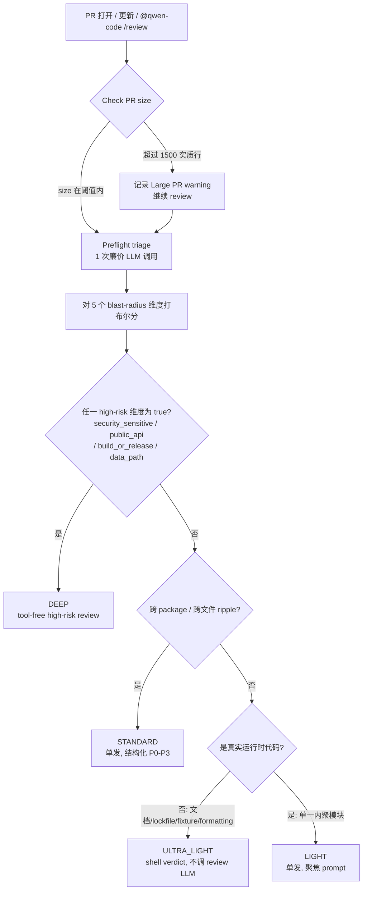

# Preflight Triage（评审前预筛）

> 本文档定义 PR review 的 preflight tier 路由机制。LIGHT / STANDARD 由可信
> workflow shell 收集 PR 数据后发起 tool-free 单发 qwen review；DEEP 则抽取
> bundled `/review` skill 的评审 rubric，并拆成 4 个 CI-safe、tool-free
> focus pass（correctness/security、test coverage、maintainability/performance、
> undirected audit）。`code-review-design.md` 只保留早期 Phase 1-3 历史背景，本文档与
> `.github/workflows/qwen-code-pr-review.yml` 是当前实现来源。

## 与 PR 合规门禁的关系（重要）

本设计专注于 **AI review 内部的 tier 路由**。**合并阻断（merge gating）由独立的 `pr-gate.yml` workflow 负责**，与本文档正交。两者分工：

| 关注点                                | 由谁负责                                     | 是否阻塞合并              | 速度     |
| ------------------------------------- | -------------------------------------------- | ------------------------- | -------- |
| PR title 格式                         | 本地 commit-msg hook + maintainer spot-check | 不在 CI 重复校验          | 本地     |
| PR body 必填段 (Summary / Validation) | `pr-gate.yml`                                | ✅ required               | 秒级     |
| PR size reviewability signal          | `pr-gate.yml`                                | ⚠️ warning-only           | 秒级     |
| Lint / Test / CodeQL                  | `ci.yml`                                     | ✅ required               | 分钟级   |
| **AI 代码 review (本设计)**           | `qwen-code-pr-review.yml`                    | ❌ **informational only** | 1–20 min |

**核心定位**：**AI review 永远不应作为 merge gate**。模型抽风、API 限流、偶发 garbage 输出都不该阻断合并。AI review 提供建议，maintainer 看完后用人工判断决定合不合。

合规门禁的完整 plan 见 [`pr-gate-plan.md`](../pr-gate-plan.md)（不在 `code-review/` 目录下，位于 `docs/design/`）。本文档只覆盖 AI review 自身的 tier 路由设计。

> 实施层面：`pr-gate.yml` 的 `PR Size` job 和 `qwen-code-pr-review.yml` 的
> `Check PR size` step 都是 warning-only。size 超限会在日志、step summary
> 和 review 评论中提示"建议拆分 / review 信号可能下降"，但不会阻断合并，也不会跳过 AI review。
> 需要硬性阻断的大型 PR 政策应由后续 branch protection / ruleset 决策单独引入。

## 问题陈述

实测数据（PR #4320 dispatch 验证）：

| 场景                  | 实测耗时                     | 旧 workflow 对照 |
| --------------------- | ---------------------------- | ---------------- |
| 6 行 yaml PR（#4327） | 9–16 min，方差 7+ min        | ~45s             |
| 407 行 PR（#4110）    | **50 min step timeout 失败** | 估计 2–5 min     |

结论：bundled `/review` 9-agent 流程对绝大多数 PR 都是 over-engineered，且长尾不可预测。`size-gate: 1500 行可配` 的设计在实测下不可达 —— 真实可工作上限远低于此。

> 必须在进入 deep review **之前**判定"该不该深审、要多深"。

## 设计目标

- **G1 — tier 路由前置**：把 tier 决策作为评审流程的**第一步**，不让 deep review 无差别地跑
- **G2 — 分档耗时上限**：ULTRA_LIGHT ≤ 1 min、LIGHT ≤ 2 min、STANDARD ≤ 6 min、DEEP ≤ 20 min（hard cap，非平均值）
- **G3 — Always-emit 契约（核心）**：**每次 CI run 必须在 PR 上落地一条有用的评论**，无论 deep review 跑多久、是否撞 timeout。当前 workflow 的痛点是：bundled `/review` 跑满 50 min step timeout 后 step failure → 只发一条 `"review did not complete successfully, see logs"` —— 等于花了 50 min token + 1 小时 wall time 换来 0 review 内容。本设计要从机制上根除这个 case。
- **G4 — 可预测性**：相同 PR 重跑应给出相近 tier 与相近耗时；preflight verdict 是显式 `::notice::` 输出，maintainer 能 audit

> G3 是用户体验最大的痛点；G2 / G4 是实现它的必要条件。Tier 分档不是为了"分档"本身，是为了把"可能跑 50 min"压回到"最多 X min 必有结果"的硬合约。

## 设计原则

继承早期 `code-review-design.md` 的 P1 / P5，但按当前 tool-free 实现调整：

- **P1**：review 工具无状态，状态在外部控制流。preflight 也无状态，输入即所有 context；review step 不 checkout PR head，不把 GitHub token 交给模型进程。
- **P5**：复用现有 design 文档与历史决策，不写新的"团队红线"清单。

本设计新增：

- **P6（成本不对称）**：preflight 必须比 deep review 廉价 **10×+**，否则不值得做。目标 wall time ≤ 90s。
- **P7（保守偏差）**：preflight 可错，但错的方向必须保守 —— 宁可升级（多花时间）也绝不降级（漏 finding）。模糊 case 一律向上升档。

## Tier 模型

按 PR 的实际**影响面（blast radius）**分四档。每档对应**不同的执行路径**，不是"同一流程跑不同参数"。

> **关键设计原则：tier 不由 size 决定**。1000 行的文档 PR 和 5 行改 `auth/oauth.ts` 是两种完全不同的"小改动" / "大改动"。size 只是 preflight LLM 拿来做 blast-radius 判断时的一个**辅助信号**，不是 primary criterion。

### 路由决策流程图



> **判断逻辑读法**：决策树的每个分叉都是**影响面**问题，不是**体量**问题。① size 是 reviewability signal，超 1500 实质行只记录 warning 并继续 review；② 进入 preflight 后，先看 4 个 high-risk 维度有没有 true，有就 DEEP；③ 否则看广度(跨 package / 跨文件)，有 ripple 就 STANDARD；④ 再否则看是不是真实运行时代码，是就 LIGHT、纯文档/lockfile 就 ULTRA_LIGHT。注意 `user_facing` 单独为 true **不**直接进 DEEP —— 它只是 LLM 综合判断的输入之一。任何一个分叉**模糊**时一律向上升档(P7 保守偏差)。

### 决策的真正维度（blast radius）

preflight LLM 看 PR diff，对以下维度打布尔分：

| 维度                 | 描述                                                 |
| -------------------- | ---------------------------------------------------- |
| `user_facing`        | 改动是否会被终端用户感知（CLI 输出、API 行为、文案） |
| `security_sensitive` | 是否触及 auth / secrets / 权限 / 加密 / 输入校验     |
| `public_api`         | 是否改 npm 包导出 / SDK 公开 API / CLI flag 签名     |
| `build_or_release`   | 是否改构建 / 发布 / CI / 部署管道                    |
| `data_path`          | 是否改持久化层 / schema / migration / 数据格式       |

加上影响面**广度**信号（跨多少 module / package、是否触及 hot code path），preflight LLM 综合判 tier。

### Tier 概览表

| Tier            | 典型 blast radius 画像                                                                | 是否调 LLM                   | 是否调 bundled skill           | 目标耗时   |
| --------------- | ------------------------------------------------------------------------------------- | ---------------------------- | ------------------------------ | ---------- |
| **ULTRA_LIGHT** | 几乎为 0：纯文档 / lockfile / 单测 fixture / formatting-only / 不影响运行时的资源文件 | 否（preflight 本身那次不算） | 否                             | ~30s–1 min |
| **LIGHT**       | 低且本地：单模块、不导出、无 security/release/API 信号、无跨文件影响                  | 1 次单发                     | 否                             | ~1–2 min   |
| **STANDARD**    | 中等：跨多文件 / 同 package 内多模块 / 改了内部 API、但不触及上面 5 个 high-risk 维度 | 1 次单发（带结构化清单）     | 否（除非 maintainer override） | ~3–6 min   |
| **DEEP**        | 任一 high-risk 维度 = true OR 大幅跨 package 影响 OR `@qwen-code /review --tier=deep` | 4 个 focused qwen pass       | 复用 bundled `/review` rubric  | ~10–20 min |

> Size 在这个表里**不出现**。它只是 preflight LLM 拿到的输入信号之一。判定逻辑完全在 LLM 自身，**不再有 path-glob / keyword 安全网**（早期草稿设计过 `.qwen/review-tier-rules.yml`，后来意识到这与"用内容判 blast radius"的初衷相悖 —— path 也是机械启发式）。LLM 判错由 maintainer 用 `@qwen-code /review --tier=...` 显式纠正。
>
> `size > 1500` 不改变 tier，也不拒评；它只在 PR Gate、review workflow summary
> 和最终 review 评论中作为显式 warning 出现。

> Tier 名称是稳定 contract，对外（CI summary、`@qwen-code /review --tier=...`）都用这些字符串。

### 执行路径要点

- **ULTRA_LIGHT / LIGHT / STANDARD / DEEP** 都不直接执行 bundled skill 的工具流程。除 ULTRA_LIGHT 外，其余档位都由 CI shell 收集可信 PR context 后调用 qwen；DEEP 额外抽取 bundled `/review` rubric，并拆成多个 focused pass。
- 单发调用的 prompt 复杂度按 tier 递增：LIGHT 简洁 markdown、STANDARD 带 P0–P3 结构化清单 + cross-file 提示
- DEEP 保留高风险审查强度，通过更大的 diff window、项目规则、preflight hints、专用 prompt 和 bundled `/review` rubric 实现，而不是通过可调用工具、worktree checkout、autofix 或 GitHub review submission 实现。

## Tier 实现机制

每个 tier 有**明确的执行路径、硬耗时上限、always-emit 兜底**。ULTRA_LIGHT 由 shell 直接 compose 评论；LIGHT / STANDARD 走 tool-free 单发 qwen 调用；DEEP 走 4 个 tool-free focused qwen pass，并通过流式累加器在 timeout / error 时保留 partial review。

### ULTRA_LIGHT

- **执行路径**：workflow shell only，不调任何 LLM
- **输入**：preflight 的 verdict（`tier`、`rationale`、`blast_radius`）
- **动作**：shell 直接 compose 一条评论 markdown，模板示例：

  ```
  ## Qwen Code Review — Skipped

  This PR is **{rationale}**; no deep review needed.

  - blast_radius: docs / lockfile only
  - changed_files: …
  - changed_lines: …

  Reply `@qwen-code /review --tier=light|standard|deep` to force a review.
  ```

- **耗时硬上限**：preflight `timeout 3m` + step `timeout-minutes: 5`；若命中 ULTRA_LIGHT，后续只做 shell 组装和 comment
- **超时兜底**：preflight 失败或超时会保守降级到 DEEP；若最终 comment 发布失败则走 fallback comment 路径

### LIGHT

- **执行路径**：workflow → 单次 qwen 调用（不走 bundled skill）
- **Prompt 文件**：`.qwen/preflight-light-review-prompt.md`（独立可审阅文件）
- **输入注入**：PR 标题/正文、PR 作者评论、changed file list、首 50KB unified diff、`focus_areas`（来自 preflight）
- **要求模型输出**：简洁 markdown review，**最多 3 项 findings**，不要求 P0-P3 结构
- **耗时硬上限**：3 min（`timeout 3m qwen ...`） + 5 min step `timeout-minutes`
- **超时兜底**：3 min timeout 触发 → 走流式累加器，把已生成的部分作为 partial review 发出；不做自动升档重试。

### STANDARD

- **执行路径**：workflow → 单次 qwen 调用（不走 bundled skill）
- **Prompt 文件**：`.qwen/preflight-standard-review-prompt.md`
- **输入注入**：与 LIGHT 同，但 unified diff 截断点 200KB，附 `.qwen/review-rules.md`、`focus_areas`、`agents_to_run` 列表
- **要求模型输出**：结构化 P0–P3 markdown，含 cross-file 提示（"if XX changed, also check YY"），含 Validation Evidence verdict（沿用 review-rules.md 既有要求）
- **耗时硬上限**：8 min（`timeout 8m qwen ...`） + 10 min step `timeout-minutes`
- **超时兜底**：8 min timeout 触发 → 走流式累加器（同 DEEP），把已生成的部分作为 partial review 发出；不再升级到 DEEP（STANDARD 失败大概率说明 LLM 服务故障）

### DEEP

- **执行路径**：workflow → 抽取 `packages/core/src/skills/bundled/review/SKILL.md` 的 review rubric → 4 个 focused qwen pass（不执行 bundled skill 的工具/worktree/autofix/GitHub submission 步骤，不给模型 GitHub token）
- **Prompt 文件**：`.qwen/deep-review-correctness-security-prompt.md`、`.qwen/deep-review-test-coverage-prompt.md`、`.qwen/deep-review-maintainability-performance-prompt.md`、`.qwen/deep-review-undirected-audit-prompt.md`
- **输入注入**：PR 标题/正文、PR 作者评论、changed file list、首 500KB unified diff、`.qwen/review-rules.md`、`focus_areas`、`agents_to_run`、bundled `/review` rubric excerpt
- **耗时硬上限**：每个 focused pass `timeout 4m qwen ...`，整体 step `timeout-minutes: 20`
- **流式累加器**：每个 focused pass 写入独立 `qwen-review-summary-<focus>.md`，最终合并到 `qwen-review-summary.md`
- **超时兜底（always-emit）**：单个 focused pass timeout 或非零 exit 时保留该 pass 的 partial review，并在头部加明确的 `⚠️` 提示；若某个 pass 输出低于 near-empty guard，则只省略该 section，其他 pass 继续保留。

### 跨 tier 共享

- 所有 tier 的输出都走同一个 `Post review summary comment` step（既有）—— 不为每个 tier 写一个 comment poster
- 所有 tier 都走同一个 fallback comment 路径，但 fallback 触发概率应该从"经常"降到"几乎从不"（partial output 取代 fallback 成为兜底）
- `gh pr comment` 调用次数：每次 review 恒定 1 次（评论体由前面 step 准备好）

### 耗时硬上限汇总

| Tier        | qwen 命令 timeout   | step timeout-minutes | 累计 wall time 上限               |
| ----------- | ------------------- | -------------------- | --------------------------------- |
| ULTRA_LIGHT | n/a                 | 1                    | ≤ 60s                             |
| LIGHT       | 3m                  | 5                    | ≤ 2 min（典型）/ 5 min（硬上限）  |
| STANDARD    | 8m                  | 10                   | ≤ 6 min（典型）/ 10 min（硬上限） |
| DEEP        | 4m × 4 focused pass | 20                   | ≤ 20 min（超时发 partial review） |

**对比旧 workflow（Phase 1-3）**：旧的单一路径配 `timeout 50m` + `timeout-minutes: 60`，且 timeout 时**没有 always-emit 机制**，整个 50 min token 浪费。本设计把"任意 PR 最大 wall time"从 60 min 砍到 20 min，并保证 timeout / error 时也发 partial 或 fallback comment。

## 架构

```
GitHub event
     │
     ▼
┌──────────────────┐
│ Resolve PR ctx   │  ← 既有 step
│ Check PR size    │  ← 既有 step (size gate)
└────────┬─────────┘
         ▼
┌──────────────────────────────────┐
│ Preflight triage（NEW）          │
│  • 1 次便宜模型调用，timeout 3m   │
│  • 输入：PR 元信息 + diff 摘要 +  │
│    review-rules.md               │
│  • 输出：JSON {tier, ...}        │
│  • shell 仅做 schema 校验 + 兜底 │
└────────┬─────────────────────────┘
         ▼
   ┌─────┴─────┬───────────┬───────────┐
   │           │           │           │
ULTRA_LIGHT  LIGHT      STANDARD     DEEP
   │           │           │           │
   ▼           ▼           ▼           ▼
shell-only   单发 qwen   单发 qwen   4 个 focused qwen pass
不调 LLM     timeout 3m  timeout 8m  timeout 4m/pass
≤ 60s       ≤ 2m        ≤ 6m         ≤ 20m
                                     + partial flush
                                     ───────────────
                                       always-emit
```

## Preflight 实现

### Inputs

- PR title, body, top-level PR comments from the author, draft state, author, base branch
- Changed file list + 每文件行数
- `git diff --stat`
- 首 50KB unified diff（大小上限是预算保护）
- `.qwen/review-rules.md` 内容（让模型懂项目规则）
- 触发事件类型（opened / synchronize / `@qwen-code /review` / dispatch）

### Model

- 默认：`vars.QWEN_PR_PREFLIGHT_MODEL`
- fallback：未设时 → `vars.QWEN_PR_REVIEW_MODEL`（同 deep review）
- timeout：3 min 硬上限（远低于 deep review）

> 推荐 `QWEN_PR_PREFLIGHT_MODEL` 指向便宜快模型（如 qwen-plus / qwen-turbo），而非 qwen-max。

### Output（强 JSON schema）

```json
{
  "tier": "ULTRA_LIGHT | LIGHT | STANDARD | DEEP",
  "rationale": "<one line, ≤ 200 chars>",
  "blast_radius": {
    "user_facing": true,
    "security_sensitive": false,
    "public_api": false,
    "build_or_release": false,
    "data_path": false
  },
  "focus_areas": ["<concrete file:line + concern>, …"],
  "agents_to_run": ["correctness", "security", "code_quality"]
}
```

- shell 层用 `jq` 验证 schema：缺字段 / tier 非法 / blast_radius 不完整 → 视作 preflight 失败，走兜底（见 Failure modes）
- `focus_areas`、`agents_to_run` 仅 STANDARD/DEEP 使用

> tier 决策**完全由 preflight LLM 看 diff 内容判定**，没有 path-glob 或 keyword 启发式安全网。LLM 判错由 maintainer 用 `@qwen-code /review --tier=deep` 显式纠正。`size > 1500` 只产生 warning，不改变 tier，也不跳过 review。

## Failure modes

兜底分两层：**preflight 阶段** 和 **review 执行阶段**。后者承担 G3 "always-emit" 的具体实现。

### Preflight 阶段

| 故障                                               | 兜底动作                           | 严重度 |
| -------------------------------------------------- | ---------------------------------- | ------ |
| preflight 模型超时（> 3 min）                      | tier = DEEP，留 warning（P7 保守） | 兜底   |
| preflight 返回非 JSON                              | tier = DEEP，留 warning            | 兜底   |
| preflight 返回 JSON 但 schema 不完整（缺 tier 等） | tier = DEEP                        | 兜底   |
| preflight 模型判 DEEP 且 changed_lines > 1500      | 记录 Large PR warning，继续 DEEP   | 既有   |

### Review 执行阶段（G3 always-emit 落地）

> **设计 vs 实现说明**：早期设计草稿写过"LIGHT timeout → 升 STANDARD 重试 1 次"。
> 实现阶段（commit `f2d3e240f`）取消了 LIGHT-to-STANDARD 自动升档：
> 一来重试本身违反"每次 review 是无状态"的 P1 原则；二来上下游成本（preflight 已经花掉一次 LLM 调用，LIGHT 再花一次，再升 STANDARD 又花一次）超过了"对小 PR 也要发详细评论"的边际收益。
> 现在所有 tier 的失败路径都是统一的"partial flush via accumulator → 加 ⚠️ 警告头 → 发出"。下表反映**实现**。

| 故障                                                               | 兜底动作                                                                  | 落地评论                    |
| ------------------------------------------------------------------ | ------------------------------------------------------------------------- | --------------------------- |
| **ULTRA_LIGHT**：shell compose 失败                                | 走 fallback comment 路径                                                  | 既有 fallback（"see logs"） |
| **LIGHT**：`timeout 3m` 触发                                       | accumulator partial flush → 头部加 `⚠️ time-capped` 警告 → 发出           | **partial review markdown** |
| **LIGHT**：非 timeout 非零 exit（crash / OOM 137 / SIGINT 130 等） | 同上，status_label=error，警告头改 "exited with error"                    | partial review markdown     |
| **LIGHT**：accumulator 输出 < 200 字节（占位符 only）              | 删 summary 文件 → 触发 fallback comment                                   | 既有 fallback               |
| **STANDARD**：`timeout 8m` 触发                                    | accumulator partial flush → 头部加 `⚠️ time-capped` 警告 → 发出           | partial review markdown     |
| **STANDARD**：非 timeout 非零 exit                                 | 同 LIGHT 同样处理                                                         | partial review markdown     |
| **STANDARD**：accumulator 输出 < 200 字节                          | 删 summary → fallback                                                     | 既有 fallback               |
| **DEEP focused pass**：`timeout 4m` 触发                           | accumulator partial flush → 头部加 `⚠️ time-capped` 警告 → 合并到最终评论 | partial review markdown     |
| **DEEP**：非 timeout 非零 exit                                     | 同上，status_label=error，警告头改 "exited with error"                    | partial review markdown     |
| **DEEP focused pass**：accumulator 输出 near-empty 占位符          | 省略该 section；其他 focused pass 继续保留                                | 其他 sections / fallback    |
| **DEEP**：正常完成                                                 | 合并 4 个 focused pass 的 review → 发出                                   | 完整 review markdown        |

> **DEEP 与 STANDARD/LIGHT 的关键差异**：
> STANDARD/LIGHT 是单发 tool-free qwen 调用；DEEP 是 4 个 focused tool-free qwen pass。每个 pass 的模型输出仍在顶层 assistant text 流里，所以 timeout 时 accumulator flush 出来的 partial **就是**该 focus 维度下写到一半的真 review。DEEP 的差异在于输入窗口更大、prompt 更严格、审查维度拆分，并复用了 bundled `/review` rubric；它仍不执行 bundled skill 的工具、worktree、autofix 或 GitHub review-submission 步骤。

**Always-emit 不变量**：每次 review 执行阶段的退出路径只有三种 —— "正常 review 评论"、"partial warning 评论"、"fallback 评论"，前两者覆盖 ≥ 95% 的失败 case，fallback 只在累加器都空或评论发布失败时触发。

### 流式累加器实现要点

旧的 stream-json 解析器只保留**最后一段** assistant text。本设计改为：

- 收集**所有** `type === "assistant" || type === "message"` 事件的 text 内容
- 每收到一段就 append 到 `qwen-review-stream.jsonl`（增量落盘，进程被 kill 也不丢）
- 头部插入元信息：`<!-- tier=…; status=…; segments=N; emitted=M -->`
- 解析失败时落空文件 → 触发 fallback comment（既有兜底，保留）

> **tier-specific 输出**：LIGHT/STANDARD 的所有 assistant segment 都是 review 内容，`buildOutput` 直接按 stream 顺序 `join`。DEEP 每个 focused pass 也遵循同一解析规则，只是输出文件按 focus 分片后再合并。DEEP 不 checkout PR head，也不会切换 worktree；workflow 只把可信 shell 收集到的 PR metadata / diff / rules / bundled rubric 渲染进 prompt。

> 这个改动同时让"调试期看进度"（stream 落盘）与"timeout 时有结果"（本设计目标）都得到满足。写入 Actions 日志的模型流和解析后的 DEEP summary 都用随机 `::stop-commands::` fence 包住，避免 PR 内容诱导模型输出 GitHub Actions workflow command。

## Maintainer override

两层 override（path-glob 兜底层已砍掉）：

| 层级                    | 表达式                                                              | 效果                            |
| ----------------------- | ------------------------------------------------------------------- | ------------------------------- |
| 触发评论                | `@qwen-code /review --tier=ultra_light\|light\|standard\|deep`      | 跳过 preflight，直接用指定 tier |
| workflow_dispatch input | 新增 `tier_override` (auto / ultra_light / light / standard / deep) | 跳过 preflight                  |

shell 端最终 tier = override 值（若有）else preflight LLM verdict。

## 校准 loop

每次 run 在 `$GITHUB_STEP_SUMMARY` 打：

```
Preflight verdict: STANDARD (rationale: ...)
Override applied: none
Final tier: STANDARD
Deep review verdict: APPROVE
```

每周/每月维护者人工对照：

- preflight 判 LIGHT 但实际 deep review 找出 P0/P1 的比例（漏档）
- preflight 判 DEEP 但实际仅 P3 finding 的比例（过度保守）
- 调 preflight prompt（calibration 示例、conservative bias 措辞）

> 校准数据存放位置见 §关键决策 D5：dedicated tracking issue 结构化评论。

## Workflow step 结构（伪 YAML）

四条独立的 tier 路径，共用一套 `Post review summary comment` + fallback。

> **注**：以下伪 YAML 是设计期的草图，**实现以 `.github/workflows/qwen-code-pr-review.yml` 为准**。已知与实现的差异：① 实现把 "Honor tier override" 与 preflight fan-in 合并成单个 `Compute effective tier` step；② LIGHT 的 `needs_upgrade` 自动升 STANDARD 已在实现阶段取消（见 §Failure modes 的设计 vs 实现说明），LIGHT timeout 走 partial flush 而非升档；③ DEEP 不再是单个 15m prompt，而是抽取 bundled `/review` rubric 后运行 4 个 4m focused pass。

```yaml
# ─── Stage 0: preflight ──────────────────────────────────────

- name: 'Preflight triage'
  id: 'triage'
  if: |-
    steps.size.outputs.should_review == 'true' &&
    steps.pr.outputs.tier_override == ''
  env:
    PR_NUMBER: '${{ steps.pr.outputs.number }}'
    OPENAI_API_KEY: '${{ secrets.REVIEW_OPENAI_API_KEY }}'
    OPENAI_BASE_URL: '${{ secrets.REVIEW_OPENAI_BASE_URL }}'
    OPENAI_MODEL: '${{ vars.QWEN_PR_PREFLIGHT_MODEL || vars.QWEN_PR_REVIEW_MODEL }}'
  timeout-minutes: 5 # job-level cap
  run: |-
    set -euo pipefail
    # 1. 加载 .qwen/preflight-prompt.md，注入 PR 上下文变量
    # 2. timeout 3m qwen --prompt "<filled prompt>" --output-format json
    # 3. jq 验证 schema: tier ∈ {ULTRA_LIGHT, LIGHT, STANDARD, DEEP}, blast_radius 完整
    # 4. final_tier = tier_override (if set) else preflight tier
    # 5. 任何一步失败 → final_tier = DEEP（P7 保守）
    # 8. 写入 outputs: tier, focus_areas, agents_to_run, rationale
    # 9. ::notice:: 输出 verdict 供校准
    echo "::notice::Preflight tier=$final_tier (model=$model_tier, hard_rule=$hard_rule_tier, floor=$floor_tier)"

# Tier override 短路：maintainer 显式指定 tier
- name: 'Honor tier override'
  id: 'override'
  if: steps.pr.outputs.tier_override != ''
  run: |-
    echo "tier=${{ steps.pr.outputs.tier_override }}" >> "$GITHUB_OUTPUT"
    echo "::notice::Tier override applied: $tier_override"

# 统一变量：tier = triage.outputs.tier OR override.outputs.tier
# 后续 step if 用 effective_tier（job-level env 或 step-level fan-in）

# ─── Stage 1: tier-specific execution ─────────────────────────

- name: 'Compose ULTRA_LIGHT comment'
  id: 'ultra_light'
  if: env.EFFECTIVE_TIER == 'ULTRA_LIGHT'
  run: |-
    set -euo pipefail
    # shell-only: 用 triage.outputs.rationale + blast_radius 拼 markdown
    # 不调 LLM
    cat > qwen-review-summary.md <<EOF
    ## Qwen Code Review — Skipped
    This PR is $RATIONALE; no deep review needed.
    ...
    EOF

- name: 'Run LIGHT review'
  id: 'light'
  if: env.EFFECTIVE_TIER == 'LIGHT'
  env:
    OPENAI_MODEL: '${{ vars.QWEN_PR_REVIEW_MODEL }}'
  timeout-minutes: 5
  run: |-
    set -euo pipefail
    prompt="$(cat .qwen/preflight-light-review-prompt.md)"
    # 注入 PR diff + focus_areas
    set +e
    stop_token="qwen-light-stream-$(date +%s%N)"
    echo "::stop-commands::${stop_token}"
    timeout --kill-after=15s 3m env -u GITHUB_TOKEN -u GH_TOKEN qwen \
      --approval-mode default \
      --core-tools "$QWEN_REVIEW_CORE_TOOLS" \
      --exclude-tools "$QWEN_REVIEW_DENY_TOOLS" \
      --allowed-mcp-server-names __qwen_review_no_mcp__ \
      --output-format stream-json --include-partial-messages \
      --prompt "$prompt" 2>&1 | tee qwen-review-stream.jsonl
    status=${PIPESTATUS[0]}
    echo "::${stop_token}::"
    set -e
    # 累加式解析（见 §Failure modes 流式累加器实现要点）
    # timeout / 非零 exit 都走 partial flush，不再升 STANDARD

- name: 'Run STANDARD review'
  id: 'standard'
  if: env.EFFECTIVE_TIER == 'STANDARD'
  env:
    OPENAI_MODEL: '${{ vars.QWEN_PR_REVIEW_MODEL }}'
  timeout-minutes: 10
  run: |-
    set -euo pipefail
    prompt="$(cat .qwen/preflight-standard-review-prompt.md)"
    # 注入 PR diff + focus_areas + agents_to_run + review-rules.md
    out=qwen-review-stream.jsonl
    set +e
    stop_token="qwen-standard-stream-$(date +%s%N)"
    echo "::stop-commands::${stop_token}"
    timeout --kill-after=30s 8m env -u GITHUB_TOKEN -u GH_TOKEN qwen \
      --approval-mode default \
      --core-tools "$QWEN_REVIEW_CORE_TOOLS" \
      --exclude-tools "$QWEN_REVIEW_DENY_TOOLS" \
      --allowed-mcp-server-names __qwen_review_no_mcp__ \
      --output-format stream-json --include-partial-messages \
      --prompt "$prompt" 2>&1 | tee "$out"
    status=${PIPESTATUS[0]}
    echo "::${stop_token}::"
    set -e
    # 累加式解析（即使 timeout，已落盘的 stream 也能解出 partial）
    node scripts/parse-review-stream.cjs "$out" qwen-review-summary.md
    if [ "$status" -eq 124 ]; then
      # prepend partial-output warning
      printf '## ⚠️ Review was time-capped at 8 min — partial output below\n\n%s' \
        "$(cat qwen-review-summary.md)" > qwen-review-summary.md
      echo "::warning::STANDARD review timed out; posting partial output"
    fi

- name: 'Run DEEP review'
  id: 'deep'
  if: env.EFFECTIVE_TIER == 'DEEP'
  env:
    OPENAI_MODEL: '${{ vars.QWEN_PR_REVIEW_MODEL }}'
  timeout-minutes: 20
  run: |-
    set -euo pipefail
    # 1. 抽取 packages/core/src/skills/bundled/review/SKILL.md 的 rubric
    # 2. 注入 PR diff + author comments + focus_areas + agents_to_run + review-rules.md
    # 3. 逐个运行 4 个 focused prompt，每个 pass 4m timeout + partial flush
    for focus in correctness-security test-coverage maintainability-performance undirected-audit; do
      run_deep_focus "$focus"
    done
    # 4. 合并可用 section；全部为空则触发 fallback comment
    set -e
    node scripts/parse-review-stream.cjs qwen-review-stream.jsonl qwen-review-summary.md
    if [ "$status" -ne 0 ]; then
      # prepend partial-output warning; near-empty guard can still fall back
      echo "::warning::DEEP review exited status $status; posting partial output"
    fi

# ─── Stage 2: 统一发评论 ──────────────────────────────────────

- name: 'Post review summary comment'
  id: 'post-summary'
  if: |-
    steps.pr.outputs.should_comment == 'true' &&
    hashFiles('qwen-review-summary.md') != ''
  run: |-
    # 沿用 Phase 1-3 的 gh pr comment 路径，body-file = qwen-review-summary.md
    gh pr comment "$PR_NUMBER" --repo "$GITHUB_REPOSITORY" \
      --body-file qwen-review-summary.md

- name: 'Post fallback comment'
  if: |-
    failure() &&
    steps.pr.outputs.should_comment == 'true' &&
    hashFiles('qwen-review-summary.md') == ''
  # 仅当累加器都为空才触发，预期 < 5% case
  run: |-
    # 沿用 Phase 1-3 fallback ("see logs")
```

> 上面是骨架与依赖关系；完整 YAML 见 `.github/workflows/qwen-code-pr-review.yml`。`scripts/parse-review-stream.cjs` 是配套新增的累加式解析工具。

## 分阶段实施

| Phase | 范围                                                                        | 必须性                |
| ----- | --------------------------------------------------------------------------- | --------------------- |
| **A** | preflight wiring + 4-tier 路由 + JSON schema 验证 + 保守 failure mode       | **必须**（本 PR MVP） |
| **B** | maintainer override（`--tier=` slash flag、`tier_override` dispatch input） | 可并入或独立          |
| **C** | 校准 loop（::notice:: 输出 + 数据沉淀）                                     | 独立 follow-up        |

## 不做的事（避免范围漂移）

- **不修改** bundled `/review` skill 内部；当前 workflow 不依赖它
- **不引入**历史 PR 感知（属于后续阶段）
- **不做** GitHub App 切换（属于后续阶段）
- **不做**方向 / scope / anchor cite 类判定（属于原 Phase 4 Design Gate，与本设计正交）
- **不引入新工具调用**到 preflight 模型（preflight 只读不写，不调 gh / git）

## 关键决策

> 本节是设计阶段已敲定的实现选项。可在实现期 push back，但需要充分理由。

### D1 — Preflight 模型 SKU 不在 design doc 里硬编码

`vars.QWEN_PR_PREFLIGHT_MODEL` 由仓库维护者按现有 endpoint 配置；fallback 到 `vars.QWEN_PR_REVIEW_MODEL`。

- 维护者**应该**指向便宜快模型（约束：200 行 PR 的 preflight 响应 ≤ 60s）；具体 SKU 不在 doc 沉淀 —— SKU 名字 6 个月内就会变，写进设计文档迟早过时
- 若未设此 var，fallback 到 deep review 模型 —— 行为正确但成本翻倍，会在 workflow 启动 step 打 `::warning::` 提示维护者配置

### D2 — Preflight prompt 放独立文件

新建 `.qwen/preflight-prompt.md`，workflow 用 `$(cat ...)` 注入。

- **理由**：preflight prompt 预计 50–200 行（包含 JSON schema 描述、tier 决策规则、blast_radius 维度定义）；内联进 workflow yaml 会让 yaml 难读
- **理由**：与 `.qwen/review-rules.md` 的约定一致 —— 项目级 review 行为配置都在 `.qwen/` 下
- **理由**：maintainer 调 prompt 不需要改 workflow yaml，PR review 关注点更聚焦

### D3 — LIGHT / STANDARD 各有独立的 review prompt 文件

新建 `.qwen/preflight-light-review-prompt.md` 与 `.qwen/preflight-standard-review-prompt.md`。

- **不复用** `review-rules.md` 的 functional review 段 —— 那是**评审标准**，不是**输出模板**。LIGHT/STANDARD prompt 需要同时含：评审标准 + 输出格式 + focus_areas 注入约定
- LIGHT prompt：要求最多 3 项 findings、简洁 markdown、不强制 P0–P3 结构
- STANDARD prompt：要求 P0–P3 结构、Validation Evidence verdict（沿用 review-rules.md 既有约定）、cross-file 提示

### D4 — 不引入 path-glob hard rule 文件（取消）

早期草稿提议新建 `.qwen/review-tier-rules.yml` 做 path → min_tier 升档兜底。**最终决定不做**。

- **理由**：path 也是机械启发式 —— 跟"size 决定 tier"是同一类毛病；blast radius 应该从 diff 内容判断，path 只是个弱信号
- **理由**：path 列表会随项目演进腐败，维护成本随时间增长
- **理由**：preflight LLM 看到 diff 内容比看到 path 更准，重复防御不增加准确率
- **理由**：LLM 判错由 maintainer 用 `@qwen-code /review --tier=deep` 显式纠正即可，成本可控
- 后果：少 1 个文件、少 1 个 yq 依赖、shell 简化

### D5 — 校准数据沉淀位置：tracking issue 结构化评论

每次 run 在 `$GITHUB_STEP_SUMMARY` 打 verdict（既有）；**另**在一个 dedicated issue（建议标题 `tracking: Qwen PR review calibration data`，labeled `qwen-review-calibration`）以结构化评论形式追加一行：

```
| run_id | pr | preflight_tier | override | final_tier | review_verdict | wall_time_s | model |
```

- **理由**：CI artifacts 跨 90 天就过期，metrics file commit 到 repo 会污染 history
- **理由**：tracking issue 的评论自带时间戳 + 永久存储，maintainer 用 `gh issue view <n> --comments` 直接看
- **理由**：可以用 `jq` 切片做月度统计
- 实现：workflow 末尾加一个 step，`gh issue comment <calibration_issue_id> --body "..."`，issue ID 来自 `vars.QWEN_REVIEW_CALIBRATION_ISSUE`，未设则跳过本步骤
- 数据**敏感性**：只记 metadata（tier、PR 号、耗时），不记 PR 内容，公开仓库无隐私风险

### D6 — Preflight 用双层 timeout（command + step）

- **command-level**：`timeout 3m qwen ...` —— 保证 qwen 进程 3 min 后被 kill
- **step-level**：`timeout-minutes: 5` —— 保证整个 step（含 shell 处理）5 min 后被 kill
- **理由**：单靠 `timeout 3m`，若 qwen 之后的 jq / shell 处理卡住（极少见但可能 —— 比如解析超大 JSON），step 会无限挂；双层叠加最稳
- **理由**：5 - 3 = 2 min 余量给 schema 验证、`gh` 调用等
- 同样模式应用到 LIGHT (`timeout 3m` cmd + `timeout-minutes: 5` step)、STANDARD (`timeout 8m` cmd + `timeout-minutes: 10` step)、DEEP（每个 focused pass `timeout 4m`，整步 `timeout-minutes: 20`）

## 需要新增的仓库内文件清单

| 文件                                                      | 用途                                                                                                 | 来源决策                  |
| --------------------------------------------------------- | ---------------------------------------------------------------------------------------------------- | ------------------------- |
| `.qwen/preflight-prompt.md`                               | preflight 模型的提示词                                                                               | D2                        |
| `.qwen/preflight-light-review-prompt.md`                  | LIGHT tier 的单发 review prompt                                                                      | D3                        |
| `.qwen/preflight-standard-review-prompt.md`               | STANDARD tier 的单发 review prompt                                                                   | D3                        |
| `.qwen/preflight-deep-review-prompt.md`                   | 旧版 all-in-one DEEP prompt，保留作 fallback/reference                                               | D3                        |
| `.qwen/deep-review-correctness-security-prompt.md`        | DEEP correctness/security focused pass                                                               | D3                        |
| `.qwen/deep-review-test-coverage-prompt.md`               | DEEP test coverage focused pass                                                                      | D3                        |
| `.qwen/deep-review-maintainability-performance-prompt.md` | DEEP maintainability/performance focused pass                                                        | D3                        |
| `.qwen/deep-review-undirected-audit-prompt.md`            | DEEP undirected audit focused pass                                                                   | D3                        |
| `scripts/compute-pr-size.cjs`                             | 与 PR Size gate 对齐的 meaningful changed-line 计算                                                  | §Workflow step 结构       |
| `scripts/parse-review-stream.cjs`                         | 累加式 stream-json 解析器（替换 workflow inline node 脚本）                                          | §Failure modes 流式累加器 |
| `scripts/render-review-prompt.cjs`                        | 将 PR context / review rules 渲染进 prompt 模板，避免 YAML inline 脚本重复                           | §Workflow step 结构       |
| (修改) `.github/workflows/qwen-code-pr-review.yml`        | 加 preflight + 4 tier 执行 + 累加式解析                                                              | §Workflow step 结构       |
| (修改) `.gitignore`                                       | 已对 `.qwen/*` 例外 `review-rules.md`、`commands/`、`skills/`、`agents/`；需追加例外上述 prompt 文件 | 配套                      |

## 需要新增的仓库 vars / secrets

| Name                                                                               | Kind           | 必填 | 默认/兜底                              | 用途                                                                                                                                                                                                                                                                                                        |
| ---------------------------------------------------------------------------------- | -------------- | ---- | -------------------------------------- | ----------------------------------------------------------------------------------------------------------------------------------------------------------------------------------------------------------------------------------------------------------------------------------------------------------- |
| `QWEN_PR_PREFLIGHT_MODEL`                                                          | vars           | 否   | fallback `QWEN_PR_REVIEW_MODEL`        | preflight 用模型                                                                                                                                                                                                                                                                                            |
| `QWEN_REVIEW_CALIBRATION_ISSUE`                                                    | vars           | 否   | 不设则跳过校准记录                     | 校准数据存放 issue ID                                                                                                                                                                                                                                                                                       |
| `QWEN_CODE_BOT_TOKEN`                                                              | secrets        | 否   | fallback `CI_BOT_PAT` → `GITHUB_TOKEN` | 评论发布身份。token 链与 `qwen-issue-followup-bot.yml` 一致。实际上 `QWEN_CODE_BOT_TOKEN` 未单独创建，链会走到 `CI_BOT_PAT` —— 该 secret 持有 `qwen-code-ci-bot` 账号的 PAT，所以 review 评论已经以 `qwen-code-ci-bot` 身份发出。`QWEN_CODE_BOT_TOKEN` 只是一个可选的覆盖位，留作与 followup-bot 工作流对齐 |
| 现有的 `REVIEW_OPENAI_API_KEY` / `REVIEW_OPENAI_BASE_URL` / `QWEN_PR_REVIEW_MODEL` | secrets / vars | 是   | 沿用 Phase 1-3                         | 不变                                                                                                                                                                                                                                                                                                        |

## 验收标准（Phase A MVP）

- **AC1**：docs-only PR（如 #4327 同类 6 行 yaml）→ 路由到 ULTRA_LIGHT，wall time < 2 min
- **AC2**：mid-size feature PR（200–500 行单模块）→ 路由到 STANDARD，wall time < 12 min
- **AC3**：含 `**/auth/**` 改动的小 PR → preflight LLM 应该自行判 DEEP（要在 calibration 示例里强化此类 case）；若漏档，maintainer 可用 `@qwen-code /review --tier=deep` 补救
- **AC4**：preflight 故意返回 garbage（mock 测试）→ 兜底走 DEEP，留 warning，不导致 job fail
- **AC5**：existing fallback comment 路径在 STANDARD/DEEP 失败时仍能发出

## 实测验证记录

详细验证证据（GitHub Actions run、PR 评论链接、当前 #4359 gate 状态、size 计算结果）见
[`preflight-validation.md`](./preflight-validation.md)。

下表是 `codex/preflight-triage` 分支经 `workflow_dispatch` 在真实 CI 上跑出的端到端结果。pre-merge 阶段新版链路只能靠 `workflow_dispatch` 验证 —— `pull_request_target` / `@qwen-code /review` 自动触发按 GHA 安全机制用 **base 分支(main)** 的 workflow,合并后才生效。

**四档 tier —— 每档一条真实 review 评论:**

| Tier        | 实测 PR              | 真实评论                                                                                                   |
| ----------- | -------------------- | ---------------------------------------------------------------------------------------------------------- |
| ULTRA_LIGHT | #4356(纯文档)        | [pull/4356#issuecomment-4506096640](https://github.com/QwenLM/qwen-code/pull/4356#issuecomment-4506096640) |
| LIGHT       | #4371(denylist 小改) | [pull/4371#issuecomment-4505842660](https://github.com/QwenLM/qwen-code/pull/4371#issuecomment-4505842660) |
| STANDARD    | #4383(CI/构建修复)   | [pull/4383#issuecomment-4505964471](https://github.com/QwenLM/qwen-code/pull/4383#issuecomment-4505964471) |
| DEEP        | #4373(core 改动)     | [pull/4373#issuecomment-4506321384](https://github.com/QwenLM/qwen-code/pull/4373#issuecomment-4506321384) |

**Gate 链路:**

- pr-gate `PR Size` warning —— 超过 1500 meaningful lines 时只发 warning，记录是否存在 `oversized-ok` acknowledgement；不调用 `core.setFailed`，不阻断合并。
- review workflow size warning —— 超限 PR 继续进入 AI review，并在 workflow summary / PR review 评论中附带 Large PR warning。
- pr-gate `PR Template` —— 检查逻辑(缺必填段 / Validation 空模板 → `core.setFailed`)经静态核验成立。
- 模型 —— 由 `QWEN_PR_REVIEW_MODEL` / `QWEN_PR_PREFLIGHT_MODEL` 仓库变量控制；当前计划使用 `qwen3.7-max` 作为 review 模型。

## Open questions / 风险

- **R1**：preflight 模型本身的可靠性 —— 便宜模型可能 JSON 结构不稳。需要在实现期 sample 试若干 PR 观察输出质量；不稳就回退到 deep review 模型 SKU。
- **R2**：preflight 漏档 —— 模型可能把高风险 PR 误判为 LIGHT。**缓解**：calibration 示例里强化 high-blast-radius case；校准 loop 数据驱动 prompt 迭代；maintainer 可用 `@qwen-code /review --tier=deep` 显式补救。
- **R3**：tier 升档的"棘轮效应" —— 用户感知 preflight 永远只升档不降档，长期可能不再信任。**缓解**：校准 loop 数据驱动 ablation，定期 review 是否过度保守。
- **R4（安全 — 残留风险）**：review step 会把**不可信的 PR diff / title / body**放进 prompt。当前实现不使用 `--yolo`，并在执行 qwen 时移除 `GITHUB_TOKEN` / `GH_TOKEN`、限制 core tools、禁用 MCP server；评论发布使用独立后置 step。**现有缓解**：① 自动触发与 `@qwen-code /review` 评论触发都限定 OWNER/MEMBER/COLLABORATOR；② workflow 全程 checkout 可信的 `main`，从不 checkout PR head 代码；③ 所有不可信数据由可信 shell/`gh`/`jq` 收集后渲染进 prompt，杜绝 shell 层注入；④ 第三方 action 全部 SHA pin；⑤ qwen 进程拿不到评论用 token。**未消除的部分**：LLM 语义层注入无法靠上述手段根除，模型仍可能输出误导性 review；因此 AI review 保持 advisory-only，不作为 merge gate。

## Rollback / Emergency Disable

合入后如果 preflight 在生产中出问题（模型频繁判错 / API 限流 / SKU 失效 / cost 暴涨），maintainer 有三级降级路径，按"代价由小到大"排：

### L1 — 跳过 preflight，全部走 deep review（最快、单点操作）

适用：preflight 模型本身坏了（譬如 endpoint down、JSON 结构突然不稳），但 deep review 模型 SKU 还能用。

操作：repo Settings → Secrets and variables → Actions → Variables，把 `QWEN_PR_PREFLIGHT_MODEL` **设为空字符串**（不是 "auto"，是空）。

效果：`Preflight triage` step 仍会跑，但因为没有 `vars.QWEN_PR_PREFLIGHT_MODEL`，fallback 到 `vars.QWEN_PR_REVIEW_MODEL`（deep review 模型），等价于"用 deep model 跑 preflight"。Workflow step 会打 `::warning::` 提示这个 fallback。

代价：preflight 阶段成本翻倍（用贵模型代替便宜模型），但行为正确。**对 PR 流影响为零**。

### L2 — 跳过 preflight 决策本身，全部强制 DEEP（中等代价）

适用：preflight 输出格式系统性偏差（譬如所有 PR 都被判 LIGHT，明显漏档），且 L1 没用（preflight 模型本身不是问题，是 prompt / 决策逻辑出问题）。

操作（任选其一）：

- **临时**：在 `.github/workflows/qwen-code-pr-review.yml` 里，把 `Compute effective tier` step 加一行 `tier="DEEP"` 强制写死
- **手动**：每个 PR 由 maintainer 评论 `@qwen-code /review --tier=deep` 覆盖（对外部贡献者 PR 体验差）
- **dispatch**：用 `workflow_dispatch` + `tier_override=deep` 触发（仅 maintainer，不影响自动 PR）

代价：所有 PR 都走 tool-free DEEP 深审，成本高于按 tier 路由，但仍受 15m/20m 双层 timeout 和 always-emit 保护。

### L3 — 彻底关掉 AI review（最重的杀招）

适用：deep review 模型也挂了 / token 配额耗尽 / 临时止血。

操作：repo Settings → Actions → 把 `qwen-code-pr-review.yml` 这个 workflow **disable**。GitHub UI 上每个 workflow 有 `...` 菜单可以单独 disable，不需要改代码。

效果：`qwen-code-pr-review.yml` 不再运行，PR 上 **不再有任何 AI review 评论**。**`pr-gate.yml` 不受影响**，依然把 PR Template + PR Size 合规门禁挡住——即合规层完全不降级。

代价：失去 AI advisory review；reviewer 全靠人工。但**合并门禁仍然有效**。

### 不变量

无论降到哪一级：

- `pr-gate.yml` 的 PR Template + PR Size 门禁**始终生效**，PR 合规性不降级
- `ci.yml` 的 lint / test / build / CodeQL **始终生效**
- 合并 gate 完整性不依赖 AI review 任何一档

### 选择决策树

```
preflight LLM 失败？
  └─ 是 → 是不是只是 preflight 模型坏？
            ├─ 是 → L1 (清空 PREFLIGHT_MODEL var)
            └─ 否 → 是不是 prompt / 决策逻辑系统性出错？
                      ├─ 是 → L2 (临时强制 tier=DEEP)
                      └─ 否 (deep review 也挂) → L3 (disable workflow)
```

### 监控信号 → 降级触发条件

- preflight step 连续 N=5 次 exit 非 0 → 触发 L1
- maintainer 在 calibration 数据上看到 > 30% 的 PR 被 preflight 错判 → 评估 L2
- API quota / cost dashboard 报警 → L3 直到调查清楚

> 这套降级路径**不依赖任何即将到来的设计**（calibration、改 prompt、改 workflow）。所有 L1/L2/L3 都是**已实施代码的运行时配置**，maintainer 在 GitHub UI 操作即可，无需提 PR。

---

> 本文档由实测数据 + 讨论沉淀，设计已在本 PR 实现并验证。
