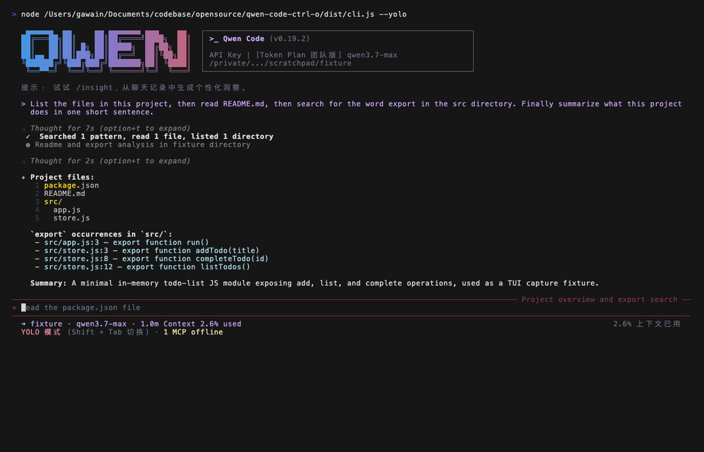
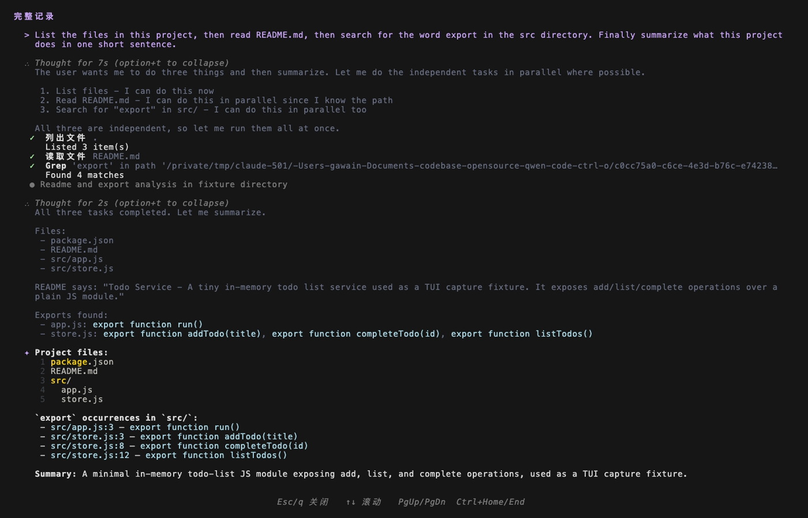

# 设计方案：Ctrl+O 行为重构 —— 对齐 Claude Code 的 Transcript 模型

- 分支：`feat/ctrl-o-detail-expand`
- worktree：`<worktree-path>`
- 状态：**实现进行中——本文档为当前 PR 实现的验收基线**（非 docs-only；当前 PR 已含实现文件改动）
- 目标读者：qwen-code TUI 维护者

> **实现状态对照（当前 PR）**：
>
> | 部分                                                                                                                     | 状态                                                                                                                                                                                                   |
> | ------------------------------------------------------------------------------------------------------------------------ | ------------------------------------------------------------------------------------------------------------------------------------------------------------------------------------------------------ |
> | 删除全局 compactMode（context/settings/toggle/i18n key、`mergeCompactToolGroups`）                                       | ✅ 已实现                                                                                                                                                                                              |
> | `fullDetail` 管线（`HistoryItemDisplay`/`ToolGroupMessage`，并入 `forceExpandAll`/`forceShowResult`/思考块 expanded）    | ✅ 已实现                                                                                                                                                                                              |
> | `fullDetail` 不被 `ToolGroupMessage` 两个 early return 绕过（纯并行/ memory-only 守 `!fullDetail`）                      | ✅ 已实现 + 回归测试                                                                                                                                                                                   |
> | `TranscriptView` + alt-screen 接入（Ctrl+O 开关、Esc/q/Ctrl+C 关闭、双段冻结、退出重绘、后台确认自动关闭、消息队列守卫） | ✅ 已实现                                                                                                                                                                                              |
> | 基于 #5661 type-based partition 的 rebase（已合入 main）                                                                 | ✅ 已实现                                                                                                                                                                                              |
> | `AlternateScreen` 的 `process.stdout.isTTY` guard（§4.2）                                                                | ✅ 已实现 + 测试                                                                                                                                                                                       |
> | i18n 旧 compact 文案清理（9 语言）+ KeyboardShortcuts `ctrl+o → view transcript` 文案（§5）                              | ✅ 已实现                                                                                                                                                                                              |
> | **read/search/list 完整明细透传到 transcript（§4.9：`detailedDisplay` 提取 helper + 渲染拆分 + live/resume/replay）**    | ✅ **已实现 + 测试**（方案 Y：core `getToolResponseDisplayText` + live/resume 派生 + `ToolMessage` 数据源切换；ACP 经 `transformPartsToToolCallContent` 已带全文，无需新增协议字段；截图 §3.4 待重录） |
> | **鼠标点击工具 block 就地展开（§4.8，follow-up）**                                                                       | ⏭️ **follow-up（独立 PR，不在本 PR）**——理由见 §4.8：type-based 下无 per-tool 点击目标、~250–400 行、SGR 选区风险                                                                                      |

---

## 1. 背景与问题

qwen-code 当前把 **Ctrl+O 绑定为 `TOGGLE_COMPACT_MODE`**：一个**全局二态开关**（`compactMode`，持久化到 `settings.ui.compactMode`）。开启后：

- 隐藏已完成（Success）工具的结果输出；
- 把思考块折叠成单行 `Thought for …`；
- 一次按键会**回溯式重渲染整个历史**（`refreshStatic()` 重挂 `<Static>`）。

这造成了"**精简模式 vs 详细模式**"的全局割裂：同一段历史会因为一个全局开关在两种完全不同的形态间整体跳变，心智负担大、视觉抖动明显，且与上游 gemini-cli、与 Claude Code 的设计哲学都背离。

> **本方案叠加在 [#5661](https://github.com/QwenLM/qwen-code/pull/5661) 的 partition 基线之上（已合入 main）。** #5661 重构了工具组的默认渲染：把 `CompactToolGroupDisplay` 扩展为**按类别分区的摘要渲染器**（`ToolCategory` / `TOOL_NAME_TO_CATEGORY` / `CATEGORY_ORDER` / `getToolCategory` / `buildToolSummary`），并把 `ToolGroupMessage` 的折叠决策改为 **type-based partition**：用 `forceExpandAll` 逆向门控，把工具**按类型**拆成 `collapsibleTools`（read/search/list，经 `isCollapsibleTool(name)`）→ 折叠成 `CompactToolGroupDisplay` 分区摘要，与 `nonCollapsibleTools`（edit/write/command/agent 及 Canceled）→ **始终逐个** `ToolMessage`。**注意：#5661 与 `compactMode` 无关**——`compactMode` 不再影响工具渲染，分区折叠纯由工具类型 + `forceExpandAll` 决定。本 PR **不重建工具渲染基线**——它在 #5661 的 partition 基线 + #5751 的鼠标基础设施之上，叠加 (1) 删除残留的全局 `compactMode`、(2) Ctrl+O transcript 全详情屏、(3) 鼠标点击就地展开工具块。详见 §3.1（partition 基线）、§4.1 / §5（删除清单）、§9（栈式 commit 拆分）。
>
> **修订说明（rebase 到 #5661 合入态）**：本文档早期版本基于 #5661 的早期 state-based 快照（`showCompact = (compactMode || allComplete)`、整组完成即整组折叠）撰写。#5661 在 review 中演进为上述 **type-based partition** 并已合入 main。§3.1 / §4.1 / §4.5 / 附录已据真实合入实现改写：核心符号是 `isCollapsibleTool` / `forceExpandAll`（**它们确实存在**），transcript 的 `fullDetail` 直接置 `forceExpandAll=true`（而非改一个已不存在的 `showCompact`）。

### 目标

**彻底取消"精简/详细"全局模式区别**，对齐 Claude Code：

1. 主对话视图**只有一种稳定的、偏简洁的默认渲染**，不再随全局开关整体变形。
2. **Ctrl+O 只负责"看某些块的完整细节"**——打开一个**独立的 Transcript 全详情滚动屏**；主视图永远保持干净。
3. 行内 `(ctrl+o to expand)` 提示作为"这里还有更多内容、按 Ctrl+O 去 transcript 看全貌"的指引。
4. **（follow-up，不在本 PR）鼠标点击 block 就地展开明细**：作为后续 PR 的 VP-only MVP——点击折叠的分区摘要行就地展开整组明细。**本 PR 不交付**(理由见 §4.8：type-based partition 下折叠工具已聚合成单行、无 per-tool 点击目标，需重定点击粒度；叠加 SGR 鼠标/原生选区风险；工程量 ~250–400 行)。点击折叠思考块打开 ThinkingViewer 已由 main/#5751 提供，本 PR 不动。

> 用户明确指示：**直接对齐 Claude Code 即可**。本方案以"忠实还原 Claude Code 的 ctrl+o = toggleTranscript 模型"为准绳。鼠标点击展开是在此基础上叠加的第二交互入口（键盘 + 鼠标双通道）。

---

## 2. 三家行为对比（调研结论）

| 维度        | qwen-code（现状/#5661 底座）                                 | Claude Code（真实）                          | gemini-cli（上游）                      |
| ----------- | ------------------------------------------------------------ | -------------------------------------------- | --------------------------------------- |
| Ctrl+O 绑定 | `TOGGLE_COMPACT_MODE`                                        | `app:toggleTranscript`                       | `SHOW_MORE_LINES` + `EXPAND_PASTE`      |
| 核心模型    | **全局精简/详细二态**（持久化）+ #5661 的 partition 自动折叠 | **全局 transcript 屏** + 块级 per-block 展开 | 全局 `constrainHeight` + per-tool 展开  |
| 主视图影响  | 一键回溯重渲染全历史                                         | 主视图恒定；transcript 是独立屏              | 切换高度约束、展开"最后一轮"            |
| 块级状态    | ❌ 无                                                        | ✅ `expandedKeys`（按 tool_use_id/uuid）     | ✅ `ToolActionsContext.toggleExpansion` |
| 退出方式    | 再按 Ctrl+O 切回                                             | 再按 Ctrl+O / Esc 回 prompt                  | 再按 Ctrl+O 收起                        |

**qwen 的"新现状底座"= #5661 的 type-based partition 模型（本方案的起点，不是要推翻的旧基线）：** #5661 把工具组默认渲染从"靠 `compactMode` 全显/全隐"演进为 **按工具类型分区折叠**——`forceExpandAll` 为假时，`collapsibleTools`（read/search/list，经 `isCollapsibleTool(name)`，非 Canceled）折叠成 `CompactToolGroupDisplay` 分区摘要行（按 `CATEGORY_ORDER`：search/read/list/command/edit/write/agent/other 聚合，如 `Read 3 files, edited 2 files`），`nonCollapsibleTools`（edit/write/command/agent + Canceled）**始终逐个** `ToolMessage`；force 条件（确认/错误/聚焦 shell/用户发起/终端子代理）令 `forceExpandAll=true` → 全部逐个展开。**该模型与 `compactMode` 无关**——`compactMode` 在 #5661 中已不影响工具渲染（仅残留影响思考块）。本方案在此底座上**保留整个 type-based partition 机制不动**，只删除残留的全局 `compactMode` 开关，并叠加 transcript 的 `fullDetail`（置 `forceExpandAll=true`）。

**Claude Code 的实际机制（来自 `claude-code` 打包源码取证）：**

- `defaultBindings.ts`：`'ctrl+o': 'app:toggleTranscript'`。
- `useGlobalKeybindings.tsx`：`setScreen(s => (s === 'transcript' ? 'prompt' : 'transcript'))`，并打点 `tengu_toggle_transcript`。
- `REPL.tsx`：`screen === 'transcript'` 时用**虚拟滚动**渲染**全部**历史，且 `verbose={true}`（强制完整展开）；`prompt` 模式则有显示条数上限。
- `CtrlOToExpand.tsx`：被截断的块尾部渲染 `(ctrl+o to expand)`，点/按则进入 transcript 看全貌。
- 另有独立的 `expandedKeys`（per-message），但**主交互入口就是 transcript 屏**。

**gemini-cli 的 per-block 模型（取证补充）**：gemini-cli 走 per-tool 展开——`ToolActionsContext` 的 `expandedTools` / `toggleExpansion` 按单个工具维护展开态。这与 **qwen main 已有的 Alt+T per-block 思考展开（`ThoughtExpandedContext`）属同一思路**：都解决"就地展开单个块"。而本方案的 transcript 解决的是**不同维度**——"全会话的完整回顾"（alt-screen 冻结快照、全部块 fullDetail、可滚动），两者正交互补（详见 §4.7）。

**关键利好**：qwen-code 本来就具备实现 transcript 屏所需的全部底座（`ScrollableList`/`VirtualizedList` + 已落地的 `AlternateScreen.tsx`），见 §4.4。

---

## 3. 目标行为定义

### 3.1 默认基线（主视图）= #5661 的 partition 模型

主视图对**所有历史项**采用单一、稳定的渲染规则，**不存在任何全局开关切换它**。该基线**不是本方案自建**，而是 [#5661](https://github.com/QwenLM/qwen-code/pull/5661) 已落地的 **type-based partition（按工具类型分区折叠）模型**——本方案保留它不动，仅删除与之无关的全局 `compactMode` 开关：

| 块类型                                                          | 默认基线渲染（#5661 type-based partition 模型）                                                                                                                                                                 | 是否在 transcript 才看全         |
| --------------------------------------------------------------- | --------------------------------------------------------------------------------------------------------------------------------------------------------------------------------------------------------------- | -------------------------------- |
| 思考（gemini_thought / \_content）                              | 单行摘要 `✻ Thought for 3s (ctrl+o to expand)`；streaming 中实时显示，落定后收成摘要                                                                                                                            | 是                               |
| **collapsible 工具**（read/search/list，非 force）              | 经 `isCollapsibleTool(name)` 归入 `collapsibleTools`，**折叠**成 `CompactToolGroupDisplay` **分区摘要行**（按 `CATEGORY_ORDER` 聚合，如 `Read 3 files, edited 2 files, ran 1 command`）                         | 逐个工具的明细在 transcript 看全 |
| **non-collapsible 工具**（edit/write/command/agent / Canceled） | 归入 `nonCollapsibleTools`，**始终逐个** `ToolMessage` 完整渲染（其输出本身就是答案）——即使整组已完成也不折叠成摘要                                                                                             | ——                               |
| 混合组（collapsible + non-collapsible 并存）                    | **摘要行 + 逐个工具并存**：collapsible 部分 → 一行 `CompactToolGroupDisplay` 摘要；non-collapsible 部分 → 逐个 `ToolMessage`。**不是整组折叠**                                                                  | 部分                             |
| 已完成 collapsible 工具的 string/ansi 结果                      | 默认折叠（`shouldCollapseResult = !forceShowResult && Success && isCollapsibleTool(name) && (string\|ansi)` → 结果区不渲染）；**Shell/Edit 等 non-collapsible 结果始终显示**；diff/plan/todo/task 各自 renderer | 在 transcript 看全               |
| 出错 / 待确认 / 用户发起 / 聚焦 shell / 终端子代理              | 令 `forceExpandAll=true` → 全组逐个 `ToolMessage`；对应触发工具收到 `forceShowResult=true` 解除结果折叠                                                                                                         | ——                               |
| 普通文本消息                                                    | 完整显示                                                                                                                                                                                                        | ——                               |

要点：

- **分区折叠由 #5661 的 `forceExpandAll` + `isCollapsibleTool` 驱动**——`ToolGroupMessage` 中 `forceExpandAll = hasConfirmingTool || hasSubagentPendingConfirmation || hasErrorTool || isEmbeddedShellFocused || isUserInitiated || hasTerminalSubagent`（**不含 `compactMode`/`allComplete`**）。`forceExpandAll` 为假时按 `isCollapsibleTool(name)`（read/search/list，非 Canceled）拆出 `collapsibleTools` → `CompactToolGroupDisplay` 摘要，其余进 `nonCollapsibleTools` → 逐个 `ToolMessage`；为真时所有工具进 `nonCollapsibleTools`。
- **已完成结果的折叠由 #5661 的 `shouldCollapseResult` gate 驱动**——`ToolMessage` 中 `shouldCollapseResult = !forceShowResult && status === Success && isCollapsibleTool(name) && (renderer.type === 'string' || 'ansi')`。**注意额外的 `isCollapsibleTool(name)` 守卫**：只有 read/search/list 的 string/ansi 结果会折叠，Shell/Edit/Agent 等 non-collapsible 工具的结果**始终可见**。`ToolGroupMessage` 在 force 场景给触发工具**逐个**传 `forceShowResult=true`（`isUserInitiated || Confirming || Error || pending-agent || 终端子代理`）。
- **force 条件即"必须看见"的安全语义**——出错堆栈、确认提示、聚焦 shell、用户发起的工具都通过 `forceExpandAll` 不被分区折叠、且 non-collapsible 工具的结果天然不折叠（外加触发工具的 `forceShowResult`）。**核心符号 `forceExpandAll` / `isCollapsibleTool` 确实存在**（#5661 合入实现）；**不需要**独立的 `shouldForceFullDetail.ts` / `COLLAPSIBLE_CATEGORIES`——force 语义内联在 `forceExpandAll`，结果折叠门控内联在 `shouldCollapseResult`（见 §4.5）。
- **`fullDetail` 必须先于 `ToolGroupMessage` 的两个 early return 生效（实现要点，勿回归）**——`ToolGroupMessage` 在算 `forceExpandAll` **之前**有两个提前返回会绕开分区逻辑：(1) **纯并行 agent 组** → `InlineParallelAgentsDisplay` 密集面板；(2) **已完成 memory-only 组** → `Recalled/Wrote N memories` 徽章。这两条都会让 transcript fullDetail 下**仍不是完整展示**。因此两个 early return 均以 **`!fullDetail`** 守卫：fullDetail 为真时跳过它们，让每个工具/agent 落到逐个 `ToolMessage`（`forceExpandAll=true` + `forceShowResult=true` + 不截断）。已有回归测试覆盖（memory-only 组在 fullDetail 下逐个渲染而非徽章）。

### 3.2 Ctrl+O = 打开/关闭 Transcript 全详情屏（独立 freeze 快照屏）

忠实还原 Claude Code 的 transcript（已从 claude-code 源码取证）：

- 任意时刻按 **Ctrl+O**：进入 **alternate screen buffer**（DEC `1049`，`\x1b[?1049h`）接管整屏，渲染一个**冻结快照**：定格进入那一刻的历史，**解除 UI 层高度/行数截断**（思考全文、工具输出尽量完整），支持上下/翻页/Home/End 滚动。⚠️ "完整"只指 UI 层——**core 层 `truncateToolOutput` 已截断的内容无法从 UI history 恢复**（见 §4.4），不是字面"全文"。
- **冻结快照语义（含 pending；存长度而非克隆 history）**：qwen-code 的历史是**两段**——已落定的 `history: HistoryItem[]`（`UIStateContext.tsx:45`）与流式进行中的 `pendingHistoryItems`（`:123`，渲染时以负 id 拼接，`MainContent.tsx:456-461`）。Claude Code 的 freeze 实际只存两个数字 `{ messagesLength, streamingToolUsesLength }`、render 时 slice，而非 entry-time 克隆。**qwen-code 据此同时冻结两段，但用最省的形式**：已落定 history **只存长度** `historyLength`（render 时 `history.slice(0, historyLength)`，不克隆整个 history），流式 `pendingItems: [...pendingHistoryItems]` **存浅副本**（pending 是临时区、会被后续重写或清空，必须副本才能定格那一刻形态）。transcript 渲染 `history.slice(0, historyLength)` 拼接**进入那一刻定格的** pending 快照。后台后续新增的 history / pending **均不进入** transcript，保证定格不抖动。
- **不影响主屏**：后台对话/流式继续运行（只是不渲染输入框/spinner）；退出时 `AlternateScreen` 卸载写 `EXIT_ALT_SCREEN` 还原 normal buffer，再经一次 `refreshStatic()` 把当前完整 history 重绘到主屏（见 §4.4——**不是字面"原样不动"**，而是退出时统一重绘一次，保证无重复/无缺失/scrollback 不破坏）。
- **退出键**：`Esc` / `q`（less 风格）/ `Ctrl+C` 关闭；再按 **Ctrl+O** 亦 toggle 关闭。退出后回到主屏，可看到 transcript 打开期间后台新增的流式内容（主屏 Static 一直在追加，只是被 alt-screen 暂时遮住）。
- 行内 `(ctrl+o to expand)` 提示语义**统一为"按 Ctrl+O 进入 transcript 查看完整上下文"，而非"此处被截断"**。注意思考块摘要恒带该提示（无论原文长短），工具输出仅在被高度约束截断时带 `+N lines`——两者提示触发条件不同，属预期（见 §7 #7）。

> 取证：claude-code `ink/components/AlternateScreen.tsx`、`termio/dec.ts:16`（`ALT_SCREEN_CLEAR: 1049`）、`screens/REPL.tsx:1325/4184/4381`（frozenTranscriptState + slice）、`keybindings/defaultBindings.ts:160-169`（`escape/q/ctrl+c → transcript:exit`）。

### 3.3 与 Ctrl+S（`SHOW_MORE_LINES` / `constrainHeight`）的关系

- `SHOW_MORE_LINES`（当前 Ctrl+S）维持不变：它解除**当前 pending 区**的高度约束，属于"流式输出时临时看更多行"，与 transcript 是正交的两件事。
- 本方案**不动 Ctrl+S 绑定**，避免一次改动面过大。（备选：未来可评估是否把 `SHOW_MORE_LINES` 也并入 transcript，但本期不做。）

### 3.4 实现效果截图（VHS 自动化捕获）

下列两张为本分支构建（`node dist/cli.js --yolo`）在固定虚拟终端（1400×900 / FontSize 14）下、对同一会话先后捕获的 before/after，经 `qwen-code-mac-autotest` skill 录制（`session.tape` 可复现）。会话提示为：列文件 → 读 `README.md` → grep `export` → 一句话总结，触发 list/read/grep 三个**可折叠**工具。

**主视图（默认基线，§3.1）**——三个 read/search/list 工具折叠为单行分区摘要 `✔ Searched 1 pattern, read 1 file, listed 1 directory`，思考块折叠为 `Thought for Ns (option+t to expand)`：



**Ctrl+O Transcript 屏（§3.2 + §4.5 `fullDetail`）**——alt-screen 全屏，header「完整记录」、footer「Esc/q 关闭 ↑↓ 滚动 PgUp/PgDn Ctrl+Home/End」；同一会话下三个工具从主视图的**单行合并摘要**拆为**各自独立的行**，思考块解除折叠（`option+t to collapse`）并显示全文：



> ⚠️ **该截图为 §4.9 实现前的状态**：此处 read/search/list 工具仍只显示**摘要级**结果（`Listed 3 item(s)` / `Found 4 matches` / `读取文件 README.md`），**尚未显示完整明细**（目录条目、grep 命中行、文件全文）。即 §4.5 的 `fullDetail` 只解除了"分区折叠 / 结果折叠 gate / 高度约束"，但 collapsible 工具的 `returnDisplay` 本身只是摘要——完整明细的数据层透传是 §4.9（**merge blocker**），落地后将**重新录制**该截图以反映真正的"全详情"。
>
> 对比要点：`fullDetail` 经 `forceExpandAll` 一处并入即同时解除分区折叠、逐工具结果折叠 gate 与高度约束（§4.5），无需触碰已不存在的 `showCompact`。i18n 中文键（`完整记录` / `关闭` / `滚动` / `列出文件` / `读取文件`）均正确渲染。

---

## 4. 架构设计

### 4.1 移除残留的全局 compactMode（在 #5661 partition 基线之上净删除）

> **范围澄清**：#5661 已经把工具渲染基线切到 type-based partition 模型，**且 `compactMode` 在 #5661 中已不影响工具渲染**（`forceExpandAll` 不引用 `compactMode`；`compactToggleHasVisualEffect` 已被 #5661 改为只探测 `gemini_thought`，不再探测 `tool_group`）。因此本 PR 的删除范围比早期设想**更小**：只删 #5661 之后**仍然残留的全局二态开关**（context/settings/binding/i18n），**不触碰** `ToolGroupMessage` 的分区决策（无 `showCompact`、无 `compactMode ||` 项可删），并**保留 `CompactToolGroupDisplay` 与整个 type-based partition 机制**。

删除以下概念及其全部引用（清单见 §5）：

- `CompactModeContext` / `CompactModeProvider` / `useCompactMode`
- `compactMode` / `compactInline` / `setCompactMode` 状态与 settings 项（`settingsSchema.ts`；**保留 web shell 侧 `ui.compactMode` 透传**——它是独立 surface）
- `Command.TOGGLE_COMPACT_MODE` 命令与 Ctrl+O 旧绑定
- `compactToggleHasVisualEffect` 及其所在的 `mergeCompactToolGroups.ts`（移除全局 compact 后无人引用 → 整文件删除）
- compact 相关 i18n 文案（9 语言）
- `compactMode` 对**思考块展开**的残留影响（`HistoryItemDisplay` 把 `expanded` 从依赖 `compactMode` 改为依赖 `fullDetail`/`thoughtExpanded`，§4.5/§4.7）

**保留（属 #5661 type-based partition 基线，本 PR 不动）**：

- `CompactToolGroupDisplay` 及其 `ToolCategory` / `TOOL_NAME_TO_CATEGORY` / `CATEGORY_ORDER` / `getToolCategory` / `buildToolSummary` / `isCollapsibleTool` 等分区符号；
- `ToolGroupMessage` 的 `forceExpandAll` + `collapsibleTools`/`nonCollapsibleTools` 分区决策（**不删、不改**，仅在其上叠加 `fullDetail → forceExpandAll=true`）；
- `ToolMessage` 的 `forceShowResult` prop 与 `shouldCollapseResult`（含 `isCollapsibleTool(name)` 守卫）折叠 gate。

> 注意：#5661 的 `forceExpandAll = hasConfirmingTool || hasSubagentPendingConfirmation || hasErrorTool || isEmbeddedShellFocused || isUserInitiated || hasTerminalSubagent` 已经承载了"出错/待确认/用户发起/聚焦 shell/终端子代理 必须完整展示"的安全语义——本 PR **保留不动**，无需再迁移到任何新文件。

### 4.2 新增 Transcript 屏状态机 + alt-screen 能力

**alt-screen 能力已有现成组件可复用**：qwen-code 用的是上游官方 **`ink ^7.0.3`**（注意：与 gemini-cli **不同包不同大版本**——gemini-cli 用 fork `npm:@jrichman/ink@6.6.9`(v6)；**不要**再把两者当同版本看待）。更关键的是，**main 已落地可直接复用的 `packages/cli/src/ui/components/AlternateScreen.tsx`（PR #5627）**，无需新建、无需移植 hook、无需引入 ink fork：

- **复用现成组件**：`AlternateScreen.tsx` 在 `useEffect` 中 `writeRaw(ENTER_ALT_SCREEN + CLEAR + HIDE_CURSOR)`，卸载/`process.on('exit')` 时 `writeRaw(SHOW_CURSOR + EXIT_ALT_SCREEN)`；内部用 `useTerminalOutput()`/`useTerminalSize()`。transcript 只需用 `<AlternateScreen>` 包裹 `TranscriptView` 即可获得"进入时进 alt-screen、卸载时回 normal buffer"的完整生命周期。
- ❌ **不用** ink `render()` 的 `alternateScreen: true` 整应用选项——那会让**整个 app 常驻 alt-screen**，丢掉 qwen-code 默认主视图赖以为生的**终端原生 scrollback**，不符合"主屏保持干净、仅 transcript 接管整屏"的需求。
- ⚠️ **VP 模式（`useTerminalBuffer`）已常驻 alt-screen，必须用 `disabled` prop 避免 double-enter**：当 `settings.merged.ui?.useTerminalBuffer` 开启时，ink root 自身已通过 `render()` 占有 alt-screen（`gemini.tsx:367` `const useVP = settings.merged.ui?.useTerminalBuffer ?? false;`，`:379` `alternateScreen: useVP`）。此时 transcript 若再写一次 `?1049h` 就会 double-enter，破坏 buffer 状态。`AlternateScreen.tsx` 正为此带了 `disabled?: boolean` prop（其注释："Skip escape writes when the root Ink renderer already owns the alt screen (VP mode)"）。因此 transcript 一律以 **`<AlternateScreen disabled={useVP}>`** 包裹：
  - 非 VP 模式（`useVP=false`）：组件正常写 `ENTER_ALT_SCREEN`/`EXIT_ALT_SCREEN`，进出 alt-screen；
  - VP 模式（`useVP=true`）：传 `disabled` 跳过转义写入，因为 ink root 已在 alt-screen，transcript 直接在该 buffer 内以替换主内容树的方式渲染。
- **降级 / 可用性判定收敛**：不再需要模糊的 `isAltScreenSupported()` 启发式判定。判定收敛为两条明确依据——(1) **是否已在 alt-screen 由 `useVP` 决定**（决定是否传 `disabled`）；(2) **非 TTY 防护**。⚠️ **现状澄清（取证）**：`AlternateScreen.tsx` 当前**并没有** `process.stdout.isTTY` 防护（`useEffect` 内无条件 `writeRaw(ENTER_ALT_SCREEN…)`）。但 TUI 本身只有 `interactive` 为真才渲染，无 prompt 时 `interactive = process.stdin.isTTY ?? false`（`config.ts:1532`）——**非 TTY 默认根本不进交互渲染**，TranscriptView/AlternateScreen 不挂载；唯一边角是显式 `-i`（强制 interactive 而 stdout 可能非 TTY）。**待实现**：给 `AlternateScreen` 补一个 `process.stdout.isTTY` guard（写转义前判定，非 TTY 不接管整屏、退化为普通 buffer 内渲染），对齐仓库既有约定（`startInteractiveUI.tsx:77/81`、`notificationService.ts:53` 等均在写终端转义前判 `isTTY`）。改动极小、属"对齐约定的兜底"，并补对应单测。

状态（**single source of truth：`AppContainer` 的 `useState`，本地持有、顶层消费——不 surface 到 broad `UIStateContext`**）：

> **设计取舍（取证：与 ThinkingViewer 一致 + claude-code REPL-local + gemini-cli 先例）**：transcript 是"由全局键 Ctrl+O 开、在顶层 layout 消费"的单一 UI 态，**没有深层消费者**。本仓库最近的同类 overlay `ThinkingViewer` 即把 canonical 放在 `AppContainer` 本地 `useState`（`thinkingViewerData`），只把最小 `open` action 经**专用** `ThinkingViewerContext` 下传，**不**塞进 broad `UIStateContext`；claude-code 的 transcript 屏状态也留在 `REPL` 顶层本地。故 transcript 同样**留 `AppContainer` 本地**，在 `AppContainer` 顶层 JSX 里像渲染 `<ThinkingViewer>` 一样条件渲染 `<TranscriptView>`，**不**经 `UIStateContext`/`UIActionsContext` 投影。（注：**实现代码已如此**——`transcriptFreeze` 是 `AppContainer` 本地 useState，`UIStateContext` 内无任何 transcript 字段；早期文档写"surface 到 UIStateContext"有误，此处纠正。）

- **canonical（本地）**：`AppContainer` 用 `useState` 承载 `transcriptFreeze: { historyLength: number; pendingItems: HistoryItemWithoutId[] } | null`（`HistoryItemWithoutId` 即 `pendingHistoryItems` 的元素类型），`isTranscriptOpen = transcriptFreeze != null` 直接派生。
- **action（本地闭包）**：`openTranscript()`（拍双段快照：`setTranscriptFreeze({ historyLength: history.length, pendingItems: [...pendingHistoryItems] })`）/ `closeTranscript()`（置 null）/ `toggleTranscript()`——均为 `AppContainer` 本地回调，由全局键处理（§4.3）直接调用，无需经 `UIActionsContext`。
- **快照时机与语义**：每次 `openTranscript()` 都**重新拍**当前快照；`closeTranscript()` 清空。即 transcript 定格在"本次打开那一刻"，关闭再开会刷新到最新——不是永久定格在首次。注意快照对**已落定 history 只存长度**（`historyLength`，render 时 `history.slice(0, historyLength)`，对齐 Claude Code 存 `messagesLength` 而非克隆），对**流式 pending 区存浅副本**（`[...pendingHistoryItems]`，因 pending 是临时区会被后续重写/清空，必须存副本才能定格那一刻的形态）。**不是克隆整个 history**。
- **`isTranscriptOpen` 不并入 `dialogsVisible` 聚合**（见 §4.3 的 Esc/键位分析——并入会误伤"Responding 且无 dialog 才能 Esc 取消请求"等逻辑）；composer 的屏蔽由 transcript 走 alt-screen 接管整屏天然达成，无需依赖 `dialogsVisible`。

### 4.3 Ctrl+O 键处理改写

`AppContainer.handleGlobalKeypress` 中：

```ts
// 删除：TOGGLE_COMPACT_MODE 分支
// 新增：
} else if (keyMatchers[Command.TOGGLE_TRANSCRIPT](key)) {
  toggleTranscript();           // open <-> close
}
```

- 新增 `Command.TOGGLE_TRANSCRIPT = 'toggleTranscript'`，默认绑定 `[{ key: 'o', ctrl: true }]`。

**键位归属（避免双重处理竞态）**：`KeypressContext` 是**广播、无 consumed flag**（`KeypressContext.tsx:655`，所有 `useKeypress` 订阅者都会收到同一按键）。因此必须**单一 owner**，规则如下：

- **Ctrl+O 只由全局 `handleGlobalKeypress` 处理**（toggle 语义对开/关都成立）。**TranscriptView 自身的 `useKeypress` 绝不处理 Ctrl+O**，否则一次按键被两处响应 → 关了又开的竞态。
- **Esc / q / Ctrl+C 关闭 transcript：由全局 `handleGlobalKeypress` 处理，且必须是 `handleGlobalKeypress` 的【最最前面、第一个】分支**——⚠️ 注意现有第一个分支就是 `Command.QUIT`（Ctrl+C，`AppContainer.tsx:3104`），第二个是 `Command.EXIT`（Ctrl+D，`:3121`），第三个才是 `ESCAPE`（`:3132`），而 `ESCAPE` 分支顶部还有 vim 守卫 `if (vimEnabled && vimMode==='INSERT') return;`。因此 transcript 关闭分支必须**早于全部这些**——早于 QUIT/Ctrl+C、早于 EXIT、早于 ESCAPE 分支及其 vim INSERT 守卫——短路：
  ```ts
  const handleGlobalKeypress = (key) => {
    // 必须是整个 handleGlobalKeypress 的第一个分支：
    // 早于 QUIT(Ctrl+C) / EXIT(Ctrl+D) / ESCAPE 分支（及其 vim INSERT 守卫）
    if (isTranscriptOpenRef.current &&
        (key.name === 'escape' || key.name === 'q' || (key.ctrl && key.name === 'c'))) {
      closeTranscript(); return;
    }
    if (keyMatchers[Command.QUIT](key)) { ... }   // 现有 :3104
    ...
  ```
  否则：transcript 打开时按 Ctrl+C 会先触发退出/`ctrlCPressedOnce`；按 Esc 会被 vim INSERT 守卫吞掉而关不掉 transcript。因为本分支由 `isTranscriptOpenRef` 守卫，仅在 transcript 打开时生效，对 vim 正常编辑无影响。**测试**：`Ctrl+C closes transcript and does NOT set quit/ctrlCPressedOnce`；`Esc closes transcript even when vim INSERT mode is active`。
  - **`q`（普通字母键）为何安全**：该分支被 `isTranscriptOpenRef` 守卫，仅在 transcript 打开（此时 composer 被 alt-screen 接管、无文本输入焦点）时匹配；transcript 关闭时 `q` 直接落到正常输入流，不受影响。无需新增 `Command` 绑定，inline 匹配即可。
- 因为 `isTranscriptOpen` **不并入 `dialogsVisible`**，所以**不走** `useDialogClose`；transcript 的 Esc 在上面的全局前置分支里独立处理（`useDialogClose` 保持原样不动）。
- 为避免闭包过期，新增 `isTranscriptOpenRef`（仿现有 `dialogsVisibleRef` 模式，`AppContainer.tsx:2425`）。

### 4.4 Transcript 屏组件（复用底座）

新增 `components/TranscriptView.tsx`，外层包**复用现有**的 `<AlternateScreen disabled={useVP}>`（§4.2：VP 模式下 ink root 已占 alt-screen，传 `disabled` 跳过转义写入；非 VP 模式正常进出 alt-screen；非 TTY 由**待补的** `process.stdout.isTTY` guard 退化为普通 buffer 内渲染，见 §4.2）：

- **数据（双段冻结快照）**：`[...history.slice(0, freeze.historyLength), ...freeze.pendingItems]` —— history 前缀 + 进入那一刻定格的 pending 副本（见 §3.2）。后台后续新增项不进入，避免滚动抖动。
- **渲染容器（注意 gating）**：`ScrollableList`/`VirtualizedList` **已存在于 main**（标准 Ink 7 组件，非 Ink fork；`ScrollableList.tsx` 具备 `scrollBy/scrollTo/scrollToEnd/scrollToIndex` 与 PageUp/Down/Home/End/滚轮），但**当前仅在 `useTerminalBuffer`（VP/virtual-viewport 模式）下被 `MainContent` 使用**——默认主视图走 `<Static>` + pending，不用它们。transcript **无条件复用**这两个组件（与 `useTerminalBuffer` 解耦，自管滚动容器），因此不受默认 Static 路径限制。⚠️ 这些组件相对较新，长会话下的滚动性能、键盘滚动、resize 重排须纳入测试（§8），不能假设"零成本复用"。
- **`estimatedItemHeight`（虚拟滚动估高，必须调大/自适应）**：`MainContent` 当前对 `VirtualizedList` 用恒定 `estimatedItemHeight=3`。transcript 以 `fullDetail` 渲染（思考全文、工具全输出），**每项远高于 3 行**，若沿用 3 会导致滚动条/定位失真、PageUp/Down 跳幅错乱。transcript 必须用**更大或自适应的 `estimatedItemHeight`**（按内容类型估算，或交由 `VirtualizedList` 的实测高度回填机制修正）。该估高纳入测试（§8）。
- **完整展开（`fullDetail` prop）**：为渲染路径引入显式 `fullDetail` 替代原先靠 `!compactMode` 推导。`fullDetail=true` 时：思考块 `expanded={true}`；工具输出**同时**满足两点才算真正不截断——(a) `availableTerminalHeight={undefined}`（验证 `ToolGroupMessage.tsx:357-365` 据此使 `availableTerminalHeightPerToolMessage` 为 undefined）；(b) 关闭 `MaxSizedBox` 的高度约束、`sliceTextForMaxHeight`、shell 的 `shellStringCapHeight/shellOutputMaxLines`（`ToolMessage.tsx:67-74,750-756`）。⚠️ **保留按字符数的性能上限**（qwen-code 侧为工具输出截断阈值 `DEFAULT_TRUNCATE_TOOL_OUTPUT_THRESHOLD` ~25000，**非** gemini-cli 的 `SlicingMaxSizedBox`）——区分"行高截断（为显示，transcript 解除）"与"字符上限（为性能，始终保留）"，避免单条超大输出拖垮虚拟滚动。
- **两层截断的边界（重要，避免过度承诺）**：截断发生在**两层**——(1) **core 层** `truncateToolOutput`（`packages/core/src/utils/truncation.ts`，被 `shell.ts`/`mcp-tool.ts` 调用）在工具产出时就按 `truncateToolOutputThreshold/Lines` 截断，写进 history 的 `resultDisplay` 已是截断后的，原文可能仅以临时 output 文件存在；(2) **UI 层** `MaxSizedBox`/`sliceTextForMaxHeight` 等按终端高度截断。**transcript 只能解除 UI 层**——core 层已丢弃的内容 UI 拿不回来。规则：transcript 对 core-截断项**保留其 truncation marker**（如"… output truncated, N lines omitted"），明示不可恢复；"读取 core 保存的 output 文件并展示"列为**后续可选增强**，不在本期范围。i18n/文案不得宣称"查看完整工具输出"，改为"查看完整上下文（不含已被 core 截断的部分）"。
- **键盘分工**：TranscriptView 自身 `useKeypress`（`isActive: isTranscriptOpen`）**只处理滚动键**（上下/翻页/Home/End）。**关闭键（Esc/q/Ctrl+C/Ctrl+O）一律由全局 `handleGlobalKeypress` 处理**（§4.3），TranscriptView 不碰，杜绝广播双响应。
- **渲染模型（明确单一策略，消除歧义）**：单 ink root 只能线性渲染一个树。transcript 打开时，顶层 layout **以 `<AlternateScreen disabled={useVP}>` 包裹的 `TranscriptView` 替代主内容树**（`MainContent` 从渲染中卸载，**不再绘制**）；后台对话/流式只更新**数据层**（`history`/`pendingHistoryItems` 继续增长），但**不被绘制**。退出时：`AlternateScreen` 卸载写 `EXIT_ALT_SCREEN`（VP 模式由 `disabled` 跳过）回到 normal buffer（其中仍是进入前那帧 `<Static>` 旧内容）→ **必须再调用一次 `refreshStatic()`**（清屏 + 重挂 Static key）把当前完整 history **一次性重绘**，从而保证退出后主屏**无重复回放、无缺失、无错位**。这是 alt-screen + Static append-only 模型下的正确收尾，**不是**"原样不动"。
- **transcript 打开期间抑制/守卫 `refreshStatic`（避免污染主屏 scrollback）**：`useResizeSettleRepaint` 等内部路径（如 resize）可能在 transcript 打开期间触发 `refreshStatic`——若放任，它会向 **normal-buffer 的 scrollback** 写入/重排主内容，而此刻屏幕正被 alt-screen 占据，导致退出后主屏错位或 scrollback 被污染。规则：**用 `isTranscriptOpenRef` 守卫 `refreshStatic`，transcript 打开期间一律跳过**；退出 transcript 时再统一做一次 `refreshStatic()` 重绘主屏（即上一条）。如此可澄清"主屏 normal-buffer scrollback 不被 alt-screen 期间的写入污染"。**测试**：打开 transcript 期间后台完成一轮工具调用 / 触发 resize，退出后主屏该轮内容恰好出现一次、scrollback 不被破坏。
- **页眉/页脚**：标题（如 `Transcript — ↑↓ scroll · Ctrl+O/Esc/q to close`），初始 `initialScrollIndex` 滚到底部（对齐 Claude Code 打开即在最新处）。

### 4.5 在 #5661 基线上引入 `fullDetail` 联动（transcript 路径置 `forceExpandAll=true`）

#5661 的 type-based partition 基线已经把"哪些工具折叠成分区摘要"（`forceExpandAll` + `isCollapsibleTool` 分区）与"是否折叠已完成结果"（`shouldCollapseResult` gate）这两层决策做好了。本 PR **不重写这两层**，只新增一个显式的 `fullDetail` 信号，让 transcript 路径能**整体解除** partition 折叠 + 结果折叠 + 高度约束。**关键利好**：type-based 基线下，transcript 只需把 `fullDetail` 并入 `forceExpandAll`（`forceExpandAll = fullDetail || hasConfirmingTool || ...`）——一处即同时禁用分区（所有工具进 `nonCollapsibleTools` 逐个渲染）并使逐工具 `forceShowResult` 联动解除结果折叠，**不需要去改一个已不存在的 `showCompact`**。

- **#5661 已就位的两层决策（保留）**：
  - `ToolGroupMessage` 的 `forceExpandAll`（`fullDetail || hasConfirmingTool || hasSubagentPendingConfirmation || hasErrorTool || isEmbeddedShellFocused || isUserInitiated || hasTerminalSubagent`）为真 → 跳过 type-based partition，所有工具逐个 `ToolMessage`；为假 → 按 `isCollapsibleTool` 拆分 collapsible（摘要）/ non-collapsible（逐个）。
  - `ToolMessage` 的 `forceShowResult` prop 经 `shouldCollapseResult = !forceShowResult && status === Success && isCollapsibleTool(name) && (string|ansi)` 决定已完成 collapsible 工具的 string/ansi 结果是否折叠。`ToolGroupMessage` 在 force/fullDetail 场景对工具传 `forceShowResult={fullDetail || isUserInitiated || Confirming || Error || pending-agent || 终端子代理}`。
  - **以上 force 条件即承接了"出错/待确认/用户发起/聚焦 shell/子代理 必须完整可见"的安全语义**——本 PR 原样保留，**不新增** `shouldForceFullDetail.ts`，**不迁移**任何判定。
- **思考块**：`HistoryItemDisplay` 把思考块 `expanded` 从依赖 `compactMode` 改为 `resolvedThoughtExpanded = fullDetail || (thoughtExpanded ?? contextThoughtExpanded)`（§4.7）——transcript 路径 fullDetail、main 的 Alt+T per-block 开关任一为真即展开；主视图常态 `fullDetail=false`。

**`fullDetail` 的联动（transcript 路径 = true 时同时生效）**：

`fullDetail=true`（transcript）时同时做到以下几点，才算真正"逐个工具、完整不截断"：

1. **置 `forceExpandAll=true`**（把 `fullDetail` 并入 `forceExpandAll`）——解除 #5661 的 type-based partition，所有工具进 `nonCollapsibleTools` 逐个渲染 `ToolMessage`（而非把 collapsible 部分聚合成分区摘要行）；
2. **逐工具传 `forceShowResult=true`**（把 `fullDetail` 并入 `forceShowResult`）——`shouldCollapseResult` 的 `!forceShowResult` 不再命中，已完成 collapsible 工具的 string/ansi 结果也展开（non-collapsible 结果本就显示）；
3. **解除 `MaxSizedBox` 高度约束**——`ToolGroupMessage` 在 fullDetail 时给每个 `ToolMessage` 传 `availableTerminalHeight={undefined}`；`ToolMessage` 内 `availableHeight` 随之为 undefined，`MaxSizedBox maxHeight` 无界、shell 的 `isCappingShell`（含 `!forceShowResult`）解除。⚠️ **保留按字符数的性能上限**（core 层 `truncateToolOutput`）——区分"行高截断（为显示，transcript 解除）"与"字符上限（为性能/core 层，始终保留）"；
4. **思考块 `expanded`**——transcript 路径 `resolvedThoughtExpanded` 的 `fullDetail` 分量为 true（见上）。

**`fullDetail` 数据流（谁算、谁传、默认值）**：

- `fullDetail` 是 `HistoryItemDisplay` / `ToolGroupMessage` 的显式 prop，**由父级按渲染上下文计算并传入**，不从 context 读（避免再造一个隐式全局态）。
- **主视图**（`MainContent`）：不传 `fullDetail`（默认 `false`）。"哪些工具组必须完整展示"完全由 #5661 已内联在 `ToolGroupMessage` 的 `forceExpandAll`/`forceShowResult` 条件决定（`embeddedShellFocused`/`activeShellPtyId` 等输入 `HistoryItemDisplay` 本就持有并下传），**无需在 `MainContent` 另算 force 布尔**。
- **transcript**（`TranscriptView`）：对所有 item 恒传 `fullDetail={true}`，触发上面联动。

> 这样"主视图 vs transcript"的差异收敛为一个干净的布尔 `fullDetail`：主视图沿用 #5661 的 type-based partition + force 安全语义，transcript 用 `fullDetail`（并入 `forceExpandAll` + `forceShowResult`）把这两层连同高度约束一并解除。**不引入新文件、不迁移判定、不改 #5661 的分区逻辑**。

---

### 4.6 Transcript 打开期间的后台交互（确认弹窗 / resize）

transcript 走 alt-screen 接管整屏，但后台对话仍在跑——这带来几个必须明确的交互规则：

1. **阻塞确认/对话框（防死锁，必须处理，覆盖全部种类）**：阻塞确认**不止 `WaitingForConfirmation` 一种**——`DialogManager.tsx` 还渲染 `shellConfirmationRequest`(ShellConfirmationDialog)、`loopDetectionConfirmationRequest`(LoopDetectionConfirmation)、`confirmationRequest`(ConsentPrompt)、`confirmUpdateExtensionRequests`(ConsentPrompt)、`providerUpdateRequest`(ProviderUpdatePrompt) 等。任一种被 alt-screen 遮住都会让用户看不到、无法响应 → **死锁**。规则：**当任一阻塞确认/对话框需要用户输入时自动 `closeTranscript()`**（在 `AppContainer` 加 `useEffect` 监听这些请求状态 + `streamingState===WaitingForConfirmation` 的并集，任一为真即退出 alt-screen），让用户看到并响应。这比"在 alt-screen 内重渲染各种确认框"简单且无歧义。**测试需逐一覆盖上述每种阻塞确认触发自动关闭**（§8）。
2. **窗口 resize**：transcript 打开时改终端尺寸，`VirtualizedList` 需按新宽度重排、重算行高。复用其既有 resize 响应即可；退出 transcript 时 §4.4 的 `refreshStatic()` 也会让主屏重排。测试需覆盖"transcript 内 resize 后滚动位置不崩"。
3. **消息队列自动提交（守卫，避免静默发送）**：`AppContainer.tsx` 的消息队列排空（drain）逻辑有 `if (dialogsVisible) return;` 守卫，避免 dialog 打开时静默自动提交排队消息。由于 `isTranscriptOpen` **不并入 `dialogsVisible`**（§4.2/§4.3），该守卫不会覆盖 transcript 打开态。规则：**在该 drain 逻辑补 `|| isTranscriptOpenRef.current`（或等价条件）**，确保 transcript 打开期间队列消息**不被自动发送**，待退出 transcript 后再正常排空。**测试**：transcript 打开期间排队消息不被自动提交，退出后恢复排空。

### 4.7 与 main 既有 per-block 思考机制的关系（互补共存，非冲突）

合并上游 main 后，仓库已存在一套**块级（per-block）思考展开机制**，与本方案的全会话 transcript **互补共存**、各解决不同诉求：

- **main 已提供的 per-block 能力**：
  - `ThoughtExpandedContext` —— `Alt+T`（`Command.TOGGLE_THINKING_EXPANDED`）就地切换**单个思考块**的展开/折叠；
  - `ThinkingViewer` / `ThinkingViewerContext` —— 查看单个思考块的**全文**；
  - 相关数据流：思考块的 `thoughtExpanded` / `thinkingFullText` props、`buildThinkingFullTextMap`、`ClickableThinkMessage`。
- **合并后思考块 expanded 的判定**：思考块在渲染时 `expanded = isPending || fullDetail || resolvedThoughtExpanded`——三个来源任一为真即展开：
  - `isPending`：流式中实时全文（§4.5）；
  - `fullDetail`：transcript 路径恒为 true（§4.5）；
  - `resolvedThoughtExpanded`：main 的 Alt+T per-block 开关。
    本方案的 `fullDetail` 改造**只接管前两者**，不触碰 `resolvedThoughtExpanded`——per-block 机制原样保留。
- **为何不冲突（正面回应 reviewer "用户原始需求是 per-block" 的关切）**：reviewer 关切的"就地展开单个思考块"诉求，**已由 main 的 Alt+T / ThinkingViewer 满足**；本方案的 transcript 解决的是**另一维度**——"对整段会话做完整回顾"（alt-screen 冻结快照、全部块以 fullDetail 渲染、可滚动）。两者目标不同、入口不同（Alt+T vs Ctrl+O）、作用范围不同（单块 vs 全会话），**正交且互补**，不存在二选一。

### 4.8 鼠标点击就地展开 block（第二交互入口）

> **📌 范围已定：本功能为 follow-up，不在当前 PR 交付。** 当前 PR 只交付 **Ctrl+O transcript**。鼠标点击展开移到后续独立 PR(VP-only MVP)。理由(评估自真实代码)：
>
> 1. **没有 per-tool 点击目标**：#5661 type-based partition 把折叠的 read/search 工具**聚合成单行摘要**——折叠态下不存在"单个工具块"可点。点击粒度须从"per-tool"重定为"**点摘要行→展开整组**"(`forceExpandAll`),这是设计变更不是直接照搬。
> 2. **工程量 ~250–400 行 / 4–5 文件**：`ToolExpandedContext` + AppContainer 接线 + `ClickableToolMessage`(不能在 `.map()` 里调 `useMouseEvents`,须抽组件,模板 `ClickableThinkMessage` 即 59 行) + ToolGroupMessage 接线 + 鼠标命中测试(需 mock `measureElementPosition`)。
> 3. **已知风险**：SGR 鼠标追踪与终端原生文本选择冲突([[project_vp_text_selection]]),transcript/主视图内是否启用点击需单独权衡。
>
> 下文保留**设计草案**供后续 PR 用；当前 PR 的 §1 目标#4、状态表与 §9 末注已把鼠标点击展开标注为 follow-up（§4.9 / commit 4 现为完整明细透传，非鼠标）。

除键盘（Ctrl+O→transcript、Alt+T→思考块）外,（后续 PR）提供**鼠标点击**作为就地展开的第二通道。以下为该 follow-up 的设计草案。

**与 [#5751](https://github.com/QwenLM/qwen-code/pull/5751) 的分工（依赖关系，不重复造轮子）**：

- **#5751（已合入 main，2026-06-23）提供"鼠标基础设施"**：把终端鼠标追踪从 per-component 启停改为**全局引用计数**（修复"折叠块卸载时误关鼠标，导致 VP 下鼠标失效"）、为 `ScrollableList`/`VirtualizedList` 增加滚轮滚动与**滚动条点击拖拽**。涉及 `useMouseEvents.ts`、`ScrollableList.tsx`、`VirtualizedList.tsx`。本设计基于其已合入的基础设施。
- **本 PR 不改这些鼠标底座文件**，避免与 #5751 冲突/重复；待 #5751 合入 main 后 rebase，在其稳定的鼠标基础上叠加下述"点击工具块展开"。若 #5751 迟迟未合并，再评估 cherry-pick（默认走依赖路径）。
- **思考块点击已由 main 的 `ClickableThinkMessage` + #5751 提供**（点击折叠思考行→打开 ThinkingViewer），本 PR **不重做**，仅确保与新基线/transcript 共存。

**（follow-up 设计草案）点击工具调用 block 就地展开/折叠明细**

复用 main 已有的成熟范式（`ClickableThinkMessage` + `measureElementPosition` + `useMouseEvents`），把它从"思考块"推广到"工具块"。**对齐点：per-tool 点击展开 = 就地把该工具/组切到 `forceExpandAll=true`（不被 partition 折叠）+ `forceShowResult=true`**（用一个 per-id 展开态，命中后 toggle），**复用 #5661 已有的 `forceExpandAll` / `forceShowResult` 机制**，不另造渲染分支：

1. **per-tool 展开态（新增）**：当前工具块**没有**用户可切换的单块展开态（#5661 的分区/结果折叠是按 force 规则自动算的）。新增一个轻量 context（仿 gemini-cli `ToolActionsContext` / main `ThoughtExpandedContext` 的形态）：
   - 状态：`expandedToolGroupIds: ReadonlySet<string>`（按 tool_group id 或 callId）。canonical 落在 `AppContainer` useState。
   - **下传走专用小 context**（仿 gemini-cli `ToolActionsContext` / 本仓库 `ThinkingViewerContext`/`ThoughtExpandedContext` 的形态），暴露 `toggleToolExpanded(id)` / `isToolExpanded(id)`——**不**塞进 broad `UIStateContext`/`UIActionsContext`。与 transcript（§4.2，纯本地、顶层消费、无深层消费者）不同：per-tool 展开**确有**跨层生产者（深层工具块点击 set）+消费者（`ToolGroupMessage` 读 `isToolExpanded` 并入 `forceExpandAll`），故下传是正当的，但用专用 context 而非污染全局 UI 态聚合。
2. **接入 #5661 的两层机制（不新增第三条路径）**：命中点击展开的工具/组，在渲染时表现为——
   - `ToolGroupMessage`：把 `isToolExpanded(id)` 并入 `forceExpandAll` 的"为真"分量（`forceExpandAll = fullDetail || isToolExpanded(id) || hasConfirmingTool || ...`）→ 解除 type-based partition，逐个 `ToolMessage`；
   - `ToolMessage`：对该工具传 `forceShowResult=true`（`shouldCollapseResult` 的 `!forceShowResult` 不再命中），并配合解除高度约束。
   - 即点击展开**复用** transcript fullDetail 联动里"`forceExpandAll=true` + `forceShowResult=true`"的同一对开关（§4.5 #1/#2），只是作用域是单个被点工具/组、而非全会话。与思考块 `expanded` 的多源合成（§4.7）对称。
3. **ToolMessage / ToolGroupMessage 的点击命中**：给工具**标题行**与**输出区**各挂一个可点击 Box（`ref` + `measureElementPosition` 命中测试，照搬 `ClickableThinkMessage` 的 `left-press` + 坐标包含判定）。命中 → `toggleToolExpanded(id)`。
   - 命中区即"标题行"或"输出区"两块，点任一处都 toggle 该工具明细。
   - `isActive` 守卫：仅在该工具**已完成且其结果被 `shouldCollapse` 折叠或输出被高度截断**（即存在"更多可看"）时才挂点击监听，避免给无可展开内容的块挂无效监听；transcript 内不需要（已全展开）。
4. **VP/坐标对齐**：VP 模式下 yogaNode 坐标即视口坐标，`measureElementPosition` 直接可用（与 `ClickableThinkMessage` 同一前提）；Static 模式因 append-only 不参与点击展开（点击展开主要服务 VP/可视区，Static 仍可用 Ctrl+O 走 transcript）。
5. **不重做思考块点击**：折叠思考行的点击展开已由 main 的 `ClickableThinkMessage` + #5751 提供，本 PR 不重做，仅确保与新基线/transcript 共存。
6. **与 transcript 的关系**：点击工具块是"就地展开单个工具明细"（留在主视图，作用域单工具/组），Ctrl+O 是"全会话回顾"（全部 item fullDetail）——同思考块的 Alt+T vs Ctrl+O 一样，正交互补。

> 依赖说明：本功能的可用性前置 = #5751 的鼠标引用计数修复（否则 VP 下鼠标可能被某个折叠块的卸载误关）。设计与实现以"#5751 已在 main"为前提；commit 顺序见 §9。

### 4.9 Transcript 全详情的数据层补全（消除"第二层折叠"中间态）

**背景**：本 PR 把 Ctrl+O 定义为"transcript 全详情屏"（§3.2）——主视图保持 #5661 的精简分区摘要，Ctrl+O 随时调出"完整记录"，所有 item 以 `fullDetail` 渲染。设计**承诺** transcript 内工具输出**完整展开、不折叠、不按高度截断**；实现上由单一 `fullDetail` 信号并入 `forceExpandAll` + 逐工具 `forceShowResult` + `availableTerminalHeight=undefined` 达成（§4.5）。

**问题（验收实测，§3.4）**：用户的"三层折叠"模型卡在第二层——第一层（主视图）`✔ read 1 file, listed 1 dir` 分区摘要应保持；第二层（Ctrl+O 当前）每个工具一行 + **简短摘要**（`列出文件 Listed 3 items` / `Grep Found 4 matches` / `读取文件 README.md`）；而**最详细层缺失**（实际目录条目、grep 命中行、文件全文）。`read_file` / `ls` / `grep` / `glob` 这类**可折叠只读工具**在 transcript 下只到摘要级，违背 "全详情" 语义。

**根因（数据层，非折叠开关）**：经取证，§4.5 的 `fullDetail → forceExpandAll / forceShowResult / availableTerminalHeight=undefined` 链路**全部正确生效**；问题在于前端根本拿不到完整明细：

- `ToolResult` 有两路内容（`packages/core/src/tools/tools.ts:443+`）：`llmContent`（"factual outcome"，完整）与 `returnDisplay`（注释明确为 "user-friendly **summary**"）。
- `ls` / `grep` / `ripGrep` / `read_file` 的 `returnDisplay` 只装摘要（`Listed N` / `Found N` / `''`），完整内容只进 `llmContent`（取证：`ls.ts` / `grep.ts` / `ripGrep.ts` / `read-file.ts` 的返回）。
- 前端工具显示结构 `IndividualToolCallDisplay`（`packages/cli/src/ui/types.ts:65`）**只有 `resultDisplay`**，无完整内容字段；转换点 `useReactToolScheduler.ts:330` 只取 `response.resultDisplay`（摘要）。
- 完整内容虽以 `ToolCallResponseInfo.responseParts`（`turn.ts:116`）到达前端，但那是 `functionResponse` 包装，`partToString` / `getResponseTextFromParts` 都只取 `part.text`、**读不到 `functionResponse.response.output`**（`partUtils.ts:61-69`、`generateContentResponseUtilities.ts:14`）——前端拿到的 parts 里有完整内容，但**没有现成 helper 把它取出来**。

**关键发现：完整明细其实已天然持久化（决定方案走向）**

- `convertToFunctionResponse(...)`（`coreToolScheduler.ts:679-714`）把**完整 `llmContent`** 写进 `functionResponse.response.output`（string 直接放；array 提取**全部** `text` 拼接，media 进 `parts`）——即工具结果 parts 内**已含完整明细**。
- 持久化的 `ChatRecord.message` 存的就是 `response.responseParts`（取证：`recordToolResult(...)` 调用点 `coreToolScheduler.ts:4009`、`Session.ts:3334/4404` 等均传 `responseParts`），是**完整 functionResponse**，非摘要。
- 因此完整明细在三条路径都已就位、同源：**live**（`trackedCall.response.responseParts`）/ **resume**（`record.message.parts`，`resumeHistoryUtils` tool_result case）/ **ACP replay**（`HistoryReplayer.replayToolResult` 已把 `message: record.message.parts` 传给 `emitResult`）。"持久化"在数据层**天然满足**，无需新增持久化字段（该前提以 §8 的"方案 Y 前提保护"测试守卫——断言 `message.parts` 的完整 `output` 经 recording / loadSession / resume / replay 四段不丢失、不误走 API `compressedHistory`；**若失败则回退方案 X**）。

**方案 Y（单一完整数据源 + 显示层提取，对齐 claude code）**

claude code 的机制是"**存储层保留完整、显示层按 `verbose` 截断**"，不拆 `llmContent`/`returnDisplay`，resume 后 transcript 仍全详情（取证：`claude-code/src/screens/REPL.tsx:4185-4194,4381-4382,4402` frozen transcript = 内存 messages 快照 + `verbose=true`；`src/utils/toolResultStorage.ts`、`sessionStorage.ts` 持久化完整内容/文件引用）。qwen 的完整内容既已在 parts 持久化，采用同构思路——**不新增持久化字段，从已存在的 functionResponse 集中提取完整文本来显示**。

- **不选 X（新增 `contentForDisplay` 字段贯穿 core→序列化→回放→前端，8 处）**：与已持久化的 `responseParts` **内容冗余**（同一完整内容存两份）、扩大持久化 schema 与迁移面。
- **不选 B（逐工具改 `returnDisplay` 携带完整）**：违背 `returnDisplay`="summary" 语义、改多个工具。
- **不选"前端散撕协议"**：根因所述脆弱——但方案 Y 用**一个集中的 core helper** 提取，不在多处散撕。

**改动点（方案 Y）**：

1. **core 新增提取 helper** `getToolResponseDisplayText(parts: Part[]): string | undefined`（与 `getResponseTextFromParts` 并列）。**可实现的优先级规则**——媒体挂在 **nested `functionResponse.parts`**（非顶层，取证：`coreToolScheduler.ts:661-744`、`postCompactAttachments.ts:149-161`、`compactionInputSlimming.ts:205-213`）：遍历顶层 parts → 对每个 `functionResponse` 读非空 `response.output` 文本拼接；再遍历其 **nested `functionResponse.parts`**，对 `inlineData`/`fileData` 输出占位（如 `<image: mimeType>`）、对 nested `{text}` 占位也保留（compaction slimmer 会产生该形态）；**若无 output 但有 nested media → 返回占位**；**output 与 media 都无 → 返回 `undefined` 让 UI 降级摘要**（避免 media-only `read_file` 显示空白或误用 "Tool execution succeeded"）。**单一提取入口，live/resume/replay 共用**。
2. **cli `IndividualToolCallDisplay`（`types.ts:65`）新增** `detailedDisplay?: string`——**派生值、不持久化**（每次从已持久化的 parts 提取）。
3. **live 提取**：`useReactToolScheduler` success 分支：`detailedDisplay = getToolResponseDisplayText(trackedCall.response.responseParts)`（**不二次截断**，见下"内存与上限"）。
4. **resume 提取**：`resumeHistoryUtils` 的 `tool_result` case（:411-431，已持有 `record.message.parts`）用同一 helper 提取。
5. **ACP replay 提取**：`HistoryReplayer.replayToolResult`（:259）已把 `message: record.message.parts` 传给 `emitResult`；在 ACP→display 映射处（`resumeHistoryUtils` / `ToolCallEmitter`）用同一 helper 派生。**无需新增 ACP 协议字段**。
6. **渲染拆分（修正 `forceShowResult` 泄漏）**：给 `ToolMessage` **显式传 `fullDetail`**（由 `ToolGroupMessage` 下传）。仅当 **`fullDetail && isCollapsibleTool(name) && detailedDisplay`** 时，用 `detailedDisplay` 取代摘要 `resultDisplay`。
   - **关键**：把"解除折叠/高度"（`forceShowResult`/`forceExpandAll`，可由 `isUserInitiated` / `Confirming` / `Error` / pending-agent / terminal-subagent 触发，见 `ToolGroupMessage.tsx:469-475`）与"切换到完整数据源"（**仅** `fullDetail`）**分离**。否则主视图里 user-initiated/error 等 force 场景会误显完整明细，违反"主视图不变"。

**内存与上限（不二次截断，符合"全详情"语义）**：`detailedDisplay` **不**走 `compactStringForHistory` 的 32k 截断——那会把 Ctrl+O 变成"32k bounded preview"而非"全详情"，与 §3.2/§3.4 承诺冲突（尤其 `read_file`：`maxOutputChars=Infinity`、自管理分页、免于 scheduler char 截断，见 `read-file.ts:385-390`，合法大读取会超 32k；此时 `functionResponse.response.output` 内仍有 >32k 完整内容，不应被 UI 再裁）。`detailedDisplay` 直接 = `getToolResponseDisplayText(parts)` 的完整文本，其边界即 **core 已施加的** `truncateToolOutput`/工具自带分页（UI 拿不回 core 已丢弃内容，§4.5）——**UI 层不再叠加字符上限**。`detailedDisplay` 是派生值、不入库；内容已存在于 `responseParts`，仅多一份字符串引用。极大输出由 transcript `ScrollableList` 虚拟滚动按视口渲染（有界），与 claude code "存储留完整、显示层 `verbose` 决定" 同构。

**范围（按类别判定，不硬编码名单）**：

- 以 **`isCollapsibleTool(name)`** 为准——类别级 `read/search/list`，**含 `glob`/`FindFiles`**（`getToolCategory` 把 GLOB 归 search，见 `CompactToolGroupDisplay.tsx:74-95`；`glob.ts:267-280` 的 `returnDisplay` 同样只是 `Found N matching file(s)`）。**不**写死 `read_file/ls/grep`。
- 主视图（非 `fullDetail`）、`run_shell_command`（`returnDisplay = result.output`，完整）/ `edit` / `write`（完整 diff）**不变**。

**测试点（并入 §8）**：

- core helper：`functionResponse.response.output` 提取、media 占位、空/缺失降级；
- **live + resume 两路都产出 `detailedDisplay`**，尤其 **resume/回放后 transcript 仍全详情**；ACP 路经 `transformPartsToToolCallContent` 已带全文（非 TUI transcript，无需 `detailedDisplay`）；
- `ToolMessage`：`fullDetail && collapsible && detailedDisplay` 用完整；**`forceShowResult 但非 fullDetail`（主视图 user-initiated/error）仍用摘要**（回归主视图不变）；
- 覆盖 `glob`（或 legacy search displayName），不只 read/grep/list；
- 旧 saved history：`detailedDisplay` 提取自 parts，旧记录的 parts 同样在 → 自然全详情；极旧无 parts 记录降级摘要。

## 5. 改动清单（按文件）

> 完整符号清单来自代码取证，下列为需改动文件与动作；行号以当前 main 为准，实现时以实际为准。
>
> **依赖基线（#5661，本 PR 不重做）**：#5661 已把工具渲染切到 type-based partition 模型。**`MainContent` 维持 `mergedHistory = visibleHistory`（无 cross-group 合并、无 `absorbedCallIds`/summary 吸收机制）**；`tool_use_summary` 在 `HistoryItemDisplay` 中渲染为独立的 `● <summary>` 行（不吸收进表头）。`CompactToolGroupDisplay` 已被扩展为分区摘要渲染器并**保留**。本 PR 只在此之上删除残留的全局 `compactMode`（context/settings/i18n），并删除随之失去引用的 `mergeCompactToolGroups.ts`（含 `compactToggleHasVisualEffect`）。
> **已由合并 main 处理、本设计无需再单列的项**：旧 compact 渲染里的 `isDim` 暗淡样式已在实现侧随相关重构移除（合并 main 后不再存在），无需在改动清单中单独追踪。

### A. 删除 / 净移除

| 文件                                                  | 动作                                                   |
| ----------------------------------------------------- | ------------------------------------------------------ |
| `packages/cli/src/ui/contexts/CompactModeContext.tsx` | 删除整个文件（`CompactModeProvider`/`useCompactMode`） |

> **不删 `CompactToolGroupDisplay`**：它是 #5661 partition 基线的核心摘要渲染器（`ToolCategory`/`CATEGORY_ORDER`/`buildToolSummary`），本 PR 保留。
> **删 `mergeCompactToolGroups.ts`**：移除全局 compactMode 后，`compactToggleHasVisualEffect`（其唯一 import 点是已被删除的 compact toggle 机制）与整文件不再被引用 → 整文件删除（含其测试）。#5661 的 type-based partition 不依赖此文件。
> **不新增 `shouldForceFullDetail.ts`**：force 安全语义已内联在 #5661 的 `forceExpandAll`/`forceShowResult`，无需抽出新文件（见 §4.5）。该文件从未实际存在。

### B. 修改

| 文件                                                                             | 动作                                                                                                                                                                                                                                                                                                                                                                                                                                                                                                                                                                                                                                                                                                               |
| -------------------------------------------------------------------------------- | ------------------------------------------------------------------------------------------------------------------------------------------------------------------------------------------------------------------------------------------------------------------------------------------------------------------------------------------------------------------------------------------------------------------------------------------------------------------------------------------------------------------------------------------------------------------------------------------------------------------------------------------------------------------------------------------------------------------ |
| `packages/cli/src/config/keyBindings.ts`                                         | 删 `TOGGLE_COMPACT_MODE`；加 `TOGGLE_TRANSCRIPT='toggleTranscript'`，默认绑 Ctrl+O；保留 `SHOW_MORE_LINES`(Ctrl+S) 不动。启动迁移检测**当前不适用**——代码库无用户可配置 keybinding 覆盖（`keyMatchers` 恒用硬编码默认值），无残留绑定可扫描（见 §6）                                                                                                                                                                                                                                                                                                                                                                                                                                                               |
| `packages/cli/src/ui/keyMatchers.ts`                                             | 同步增删 matcher                                                                                                                                                                                                                                                                                                                                                                                                                                                                                                                                                                                                                                                                                                   |
| `packages/cli/src/ui/AppContainer.tsx`                                           | 删 `compactMode/compactInline/setCompactMode` 状态、`CompactModeProvider`、Ctrl+O 旧分支、`compactToggleHasVisualEffect` 调用；加 `isTranscriptOpen`（canonical useState，§4.2）+ `isTranscriptOpenRef` + `transcriptFreeze` + `toggleTranscript/openTranscript/closeTranscript`；全局 Ctrl+O→`toggleTranscript`；Esc/q/Ctrl+C **handleGlobalKeypress 第一分支**关闭（早于 QUIT/EXIT/ESCAPE 及 vim INSERT 守卫，§4.3）；`useEffect` 监听**全部阻塞确认/对话框**自动关闭（§4.6 #1）；消息队列 drain 守卫加 `\|\| isTranscriptOpenRef.current`（§4.6 #3）；`refreshStatic`用`isTranscriptOpenRef`守卫、退出时重绘一次（§4.4）。**不并入 `dialogsVisible`，不改 `useDialogClose`**                                    |
| `packages/cli/src/ui/contexts/UIStateContext.tsx`                                | **不改**：transcript 态留 `AppContainer` 本地、顶层消费，**不 surface**（取证：ThinkingViewer / claude-code REPL-local 先例，§4.2）。实现代码已如此                                                                                                                                                                                                                                                                                                                                                                                                                                                                                                                                                                |
| `packages/cli/src/ui/contexts/UIActionsContext.tsx`                              | **不改**：`toggleTranscript/closeTranscript` 为 `AppContainer` 本地回调，由全局键处理直接调用，不经此 context（§4.2）                                                                                                                                                                                                                                                                                                                                                                                                                                                                                                                                                                                              |
| `packages/cli/src/ui/hooks/useDialogClose.ts`                                    | **不改动**（transcript 不走此路径，Esc 在全局前置分支处理，见 §4.3）                                                                                                                                                                                                                                                                                                                                                                                                                                                                                                                                                                                                                                               |
| `packages/cli/src/ui/layouts/DefaultAppLayout.tsx`（及 `ScreenReaderAppLayout`） | 加顶层条件：`isTranscriptOpen` 时渲染 `<TranscriptView/>`（`<AlternateScreen disabled={useVP}>` 接管）替代主内容。**无独立 overlay 路径**——非 TTY 由 `AlternateScreen` 的 `isTTY` guard 退化为普通 buffer 内渲染（§4.2），VP 由 `disabled` 复用 ink root 的 alt-screen                                                                                                                                                                                                                                                                                                                                                                                                                                             |
| `packages/cli/src/ui/components/MainContent.tsx`                                 | #5661 维持 `mergedHistory = visibleHistory`（无 cross-group 合并、无 `getCompactLabel`/`absorbedCallIds`/`isSummaryAbsorbed`）。本 PR **不改动**：主视图不传 `fullDetail`（默认 false），force 语义全由 `ToolGroupMessage` 内联（§4.5）                                                                                                                                                                                                                                                                                                                                                                                                                                                                            |
| `packages/cli/src/ui/components/HistoryItemDisplay.tsx`                          | 引入 `fullDetail` prop（父级传入，默认 false）：折入 `resolvedThoughtExpanded = fullDetail \|\| (thoughtExpanded ?? contextThoughtExpanded)`（§4.7，两个思考块分支自动生效）；下传 `fullDetail` 给 `ToolGroupMessage`。`tool_use_summary` 维持渲染为独立 `● <summary>` 行（跟齐 main，无吸收机制）                                                                                                                                                                                                                                                                                                                                                                                                                 |
| `packages/cli/src/ui/components/messages/ConversationMessages.tsx`               | **不改**：`ThinkMessage/Content` 的 `expanded` 由 `HistoryItemDisplay` 传入的 `resolvedThoughtExpanded`（已含 `fullDetail` 分量）决定，无需在此处引用 compactMode/fullDetail                                                                                                                                                                                                                                                                                                                                                                                                                                                                                                                                       |
| `packages/cli/src/ui/components/messages/ToolMessage.tsx`                        | **保留不动** #5661 的 `forceShowResult` prop + `shouldCollapseResult`（含 `isCollapsibleTool(name)` 守卫）折叠 gate。fullDetail/点击展开经 `ToolGroupMessage` 传入的 `forceShowResult=true` + `availableTerminalHeight=undefined` 即自动解除结果折叠与 `MaxSizedBox`/shell 高度约束（§4.5 #2/#3）。**§4.9 改**：新增显式 `fullDetail` prop（由 `ToolGroupMessage` 下传），仅当 `fullDetail && isCollapsibleTool(name) && detailedDisplay` 时以 `detailedDisplay` **取代摘要数据源 `resultDisplay`**；把"解折叠/高度"（`forceShowResult`，可由 user-initiated/error 触发）与"切换完整数据源"（仅 `fullDetail`）**分离**，避免主视图 force 场景误显完整明细（修审计 #2）；点击命中由 `ToolGroupMessage` 包裹（§4.8） |
| `packages/cli/src/ui/components/messages/ToolGroupMessage.tsx`                   | **保留** `forceExpandAll` + `collapsibleTools`/`nonCollapsibleTools` type-based 分区。本 PR：加 `fullDetail` prop → 并入 `forceExpandAll = fullDetail \|\| ...`（解除分区）+ 逐工具 `forceShowResult = fullDetail \|\| ...` + fullDetail 时 `availableTerminalHeight=undefined`（§4.5 #1/#2/#3）；加点击命中 `isToolExpanded(id)` 同样并入 `forceExpandAll`（§4.8）。**无 `showCompact`/`compactMode` 可删**；**§4.9：把 `fullDetail` 显式下传给 `ToolMessage` 作数据源开关**                                                                                                                                                                                                                                      |
| `packages/cli/src/ui/components/SettingsDialog.tsx`                              | 删 `ui.compactMode` 的特殊 `setCompactMode` 同步逻辑                                                                                                                                                                                                                                                                                                                                                                                                                                                                                                                                                                                                                                                               |
| `packages/cli/src/config/settingsSchema.ts`                                      | 移除 `ui.compactMode`/`ui.compactInline`（见 §6 迁移策略）                                                                                                                                                                                                                                                                                                                                                                                                                                                                                                                                                                                                                                                         |
| `packages/cli/src/serve/routes/workspace-settings.ts`                            | **保留** `WEB_SHELL_SETTINGS` 中的 `ui.compactMode`——web-shell 有独立的 `CompactModeContext`（`packages/web-shell/client/App.tsx` 读 `'ui.compactMode'`），即使 CLI `settingsSchema` 不再定义该键，serve 层仍需透传给 web-shell，否则破坏其 compact。web-shell 自身 compact 去留**另案评估、不在本 PR 范围**（§6/§7 #5）                                                                                                                                                                                                                                                                                                                                                                                           |
| `packages/cli/src/ui/components/KeyboardShortcuts.tsx`                           | Ctrl+O 文案改为 `to view transcript`                                                                                                                                                                                                                                                                                                                                                                                                                                                                                                                                                                                                                                                                               |
| `packages/cli/src/services/tips/tipRegistry.ts`                                  | 删/改 `id: 'compact-mode'` 的启动提示（`:183-185` "Press Ctrl+O to toggle compact mode …"）——否则实现后仍向用户提示旧行为；改为 transcript 提示或移除                                                                                                                                                                                                                                                                                                                                                                                                                                                                                                                                                              |
| `packages/cli/src/i18n/locales/{en,zh,zh-TW,ca,de,fr,ja,pt,ru}.js`               | **全部 9 个语言文件**都要改/删 compact 文案、加 transcript 文案（PR #3100 先例就改了 de/ja/ru/pt）。只改 en/zh 会导致多语言用户看到残留的 "toggle compact mode" 旧文案                                                                                                                                                                                                                                                                                                                                                                                                                                                                                                                                             |
| `packages/web-shell/client/i18n.tsx`                                             | 同步 compact→transcript 文案（web-shell 行为另议，见 §7）                                                                                                                                                                                                                                                                                                                                                                                                                                                                                                                                                                                                                                                          |

> **§4.9（方案 Y，merge blocker）的跨文件改动**（详见 §4.9 改动点 1–6，上表 `ToolMessage`/`ToolGroupMessage` 行已含渲染拆分）：
>
> - **新增** core helper `packages/core/src/utils/generateContentResponseUtilities.ts` 的 `getToolResponseDisplayText(parts)`（读 `functionResponse.response.output` + 遍历 nested `functionResponse.parts` 媒体占位、空/缺失返回 `undefined`；**不二次截断**；规则见 §4.9 改动点 1）；
> - **改** `packages/cli/src/ui/types.ts`：`IndividualToolCallDisplay` 加 `detailedDisplay?: string`（派生、不持久化）；
> - **改** `packages/cli/src/ui/hooks/useReactToolScheduler.ts`（live 提取，`success` 分支派生 `detailedDisplay`）、`packages/cli/src/ui/utils/resumeHistoryUtils.ts`（resume 提取，`tool_result` 分支从 `responseParts ?? message.parts` 派生）、`packages/cli/src/ui/components/messages/ToolMessage.tsx` + `ToolGroupMessage.tsx`（渲染拆分：`ToolGroupMessage` 下传 `fullDetail`，`ToolMessage` 仅 `fullDetail && isCollapsibleTool && detailedDisplay` 切数据源）；
> - **不改** `packages/cli/src/acp-integration/session/HistoryReplayer.ts` / `emitters/ToolCallEmitter.ts`——ACP `content[]` 已含完整 `output`（见上表），TUI transcript 不经此路，无需改动；
> - **不改** 持久化 schema（`serializeToolResponse` / `chatRecordingService` / ACP 协议字段）——完整明细已天然存于 `responseParts`，新字段为派生值。

### C. 新增

| 文件                                                                              | 内容                                                                                                                                                                                                                                                  |
| --------------------------------------------------------------------------------- | ----------------------------------------------------------------------------------------------------------------------------------------------------------------------------------------------------------------------------------------------------- |
| `packages/cli/src/ui/components/TranscriptView.tsx`                               | Transcript 全详情滚动屏（用 `<AlternateScreen disabled={useVP}>` 包裹 + 双段冻结快照 + ScrollableList/VirtualizedList（调大/自适应 `estimatedItemHeight`）+ `fullDetail={true}` 渲染）                                                                |
| `packages/cli/src/ui/components/TranscriptView.test.tsx`                          | 渲染/滚动/关闭/快照定格测试                                                                                                                                                                                                                           |
| `packages/cli/src/ui/contexts/ToolExpandedContext.tsx`（follow-up，鼠标点击展开） | **专用小 context**（仿 gemini-cli `ToolActionsContext`/本仓库 `ThinkingViewerContext`）：暴露 `toggleToolExpanded(id)`/`isToolExpanded(id)`；canonical `expandedToolGroupIds` 仍在 `AppContainer` useState（§4.8）。**不**塞进 broad `UIStateContext` |

> **复用现有组件，不再新增 AlternateScreen**：`packages/cli/src/ui/components/AlternateScreen.tsx`（PR #5627）已实现 DEC 1049 进出 + `disabled` prop，**直接复用**（§4.2）。原"新增 AlternateScreen/useAlternateBuffer"提法已删除。

### D. 测试同步（移除 compact mock）

`MainContent.test.tsx`、`HistoryItemDisplay.test.tsx`、`ToolGroupMessage.test.tsx`、`ToolMessage.test.tsx`、`SettingsDialog.test.tsx` 中所有 `CompactModeProvider` 包装与 `compactMode` 用例需删除或改写为基线/transcript 用例。

---

## 6. 迁移与兼容

- **settings.ui.compactMode / compactInline**：用户配置里可能已存在。策略：从 CLI **schema 移除**（`settingsSchema.ts`），但 **`WEB_SHELL_SETTINGS`（`workspace-settings.ts:36`）保留 `ui.compactMode`**——web-shell 有独立的 `CompactModeContext`（`packages/web-shell/client/App.tsx` 读 `'ui.compactMode'`），serve 层须继续透传，否则破坏 web-shell（见 #12 / §7 #5）。已验证设置系统对未知键**宽容**——`getSettingsFileKeyWarnings`（`settings.ts:250-309`，未知键处理在 `:290-306`，`debugLogger.warn` 在 `:303-305`）仅 `debug` 记录、不报错不阻断。因此用户旧的 CLI 配置可安全读取（被 CLI 忽略），新 CLI 设置 UI/API 不再列出该项。**CLI 侧不保留向后语义**——模式概念整体删除，保留也无处生效；web-shell 侧的 compact 去留**另案评估**。
- **快捷键自定义（迁移提示）**：当前代码库**没有**用户可配置的 keybinding 覆盖机制——`keyMatchers`（`keyMatchers.ts`）始终由硬编码的 `defaultKeyBindings` 构建，`settingsSchema` 也无 keybinding 项（仅 `vimMode`）。因此**不存在**用户持久化的 `toggleCompactMode` 绑定会被静默丢弃，启动时迁移检测**无可扫描对象、当前不适用**。一旦将来引入用户可配置 keybinding，再补"检测残留 `toggleCompactMode` 绑定并一次性提示改绑 `toggleTranscript`"。**当前 PR 仅需** release note 提示 Ctrl+O 语义已变更为 transcript（`docs/users/reference/keyboard-shortcuts.md` 已更新）。
- **打点**：可对齐 Claude Code 新增 `toggle_transcript` 事件（可选）。

---

## 7. 边界、风险与未决项

1. **大历史性能**：transcript 渲染全部历史。虚拟滚动（`VirtualizedList`）按视口有界；区分两类上限——**只解除"行高"截断**（为显示，transcript 解除），但**保留"字符数"上限**（为性能，始终保留）。注意 qwen-code **不存在** `SlicingMaxSizedBox`（那是 gemini-cli 的）；qwen 侧的字符级保护是工具输出截断阈值 `DEFAULT_TRUNCATE_TOOL_OUTPUT_THRESHOLD`（~25000）。实现时验证万行级历史滚动流畅度。
2. **alt-screen 协调（复用现有组件已大幅降险）**：本方案**复用 main 已落地的 `AlternateScreen.tsx`（PR #5627）**进出 alt-screen，而非自行手写 `?1049h/l` 时序，风险显著低于初版设计。剩余需处理的两点：(a) **VP 模式 double-enter**——`useTerminalBuffer` 开启时 ink root 已占 alt-screen，必须传 `disabled={useVP}` 跳过转义（§4.2）；(b) **退出收尾重绘**——退出时主屏经 `refreshStatic()` 清屏重绘一次（§4.4），且 transcript 期间 `refreshStatic` 被 `isTranscriptOpenRef` 守卫跳过，避免污染 normal-buffer scrollback。注意旧 compact 是**每次 toggle** 都 refreshStatic，本方案只在 transcript **关闭时一次**，频率低得多。仍需在 tmux / iTerm2 / VSCode / Apple Terminal 验证。
3. **force 安全语义（保留 #5661 内联条件，勿误删）**：本 PR 在 `forceExpandAll` 前缀加 `fullDetail || isToolExpanded(id) ||` 时，务必**保留**其余 `hasConfirmingTool || hasSubagentPendingConfirmation || hasErrorTool || isEmbeddedShellFocused || isUserInitiated || hasTerminalSubagent`，以及 `ToolMessage` 的 `shouldCollapseResult`（含 `isCollapsibleTool` 守卫）gate——这些是 #5661 已就位的"出错/待确认/用户发起/聚焦 shell/子代理 必须完整展示"安全语义（§4.5），误删会导致"出错的工具被折叠看不全"的回归。**不需要**迁移到任何新文件。
4. **mouse / SGR 协调**：注意与 [[project_vp_text_selection]] 记录的"SGR mouse tracking 破坏原生文本选择"问题的潜在叠加——transcript 内是否启用鼠标滚轮需权衡（启用滚轮 vs 保留终端原生选择）。mouse 的进出处理随 `AlternateScreen` 与 VP root 既有机制走，无需额外手写。
5. **web-shell（独立 surface，不在本 PR 删除范围）**：web-shell 有**独立的** `CompactModeContext`（`packages/web-shell/client/App.tsx` 读 `'ui.compactMode'`），与 CLI 的 compact 是两套实现。为不破坏它，本 PR **在 `WEB_SHELL_SETTINGS` 中保留 `ui.compactMode`**（即使 CLI schema 不再定义该键，serve 层仍透传，见 #12 / §6）。本期 CLI 仅做自身文案与设置项清理；**web-shell 自身 compact 的去留另案评估**，不在本设计实现范围。
6. **Ctrl+S/`SHOW_MORE_LINES` 是否并入**：本期保留独立，避免改动面失控；列为后续可选优化。
7. **`(ctrl+o to expand)` 提示语义（已定）**：思考块摘要**恒带**该提示（指引"进 transcript 看完整上下文"，非"此处被截断"）；工具输出仅在被高度约束截断时带 `+N lines`。两者触发条件不同是**预期行为**，i18n 文案需体现"查看完整上下文"而非"展开被截断内容"，避免误导。

---

## 8. 测试计划

- **单测**：
  - `AlternateScreen`（复用现有组件 + **新补 isTTY guard** 后的接入测试）：非 VP 模式 enter/exit 写 `ENTER_ALT_SCREEN`/`EXIT_ALT_SCREEN`；**VP 模式（`disabled=true`）路径跳过转义写入、不 double-enter**；**非 TTY（`process.stdout.isTTY` 假）跳过转义写入**（待补 guard，§4.2）。
  - `TranscriptView`：打开渲染全历史 + **进入时刻 pending 快照**、思考/工具全展开不截断、滚动 API、双段冻结（后台新增 history/pending 不进入视图）、**`estimatedItemHeight` 调大/自适应后滚动定位不失真**（§4.4）。
  - `ToolGroupMessage`/`ToolMessage`（type-based partition 基线 + fullDetail 联动）：无 force 时 collapsible（read/search/list）折叠成 `CompactToolGroupDisplay` 摘要、non-collapsible（edit/write/command/agent）逐个 `ToolMessage`、混合组摘要行 + 逐个并存；force 组（出错/确认/聚焦 shell/用户发起/终端子代理）`forceExpandAll=true` → 全部逐个、触发工具 `forceShowResult=true`；`fullDetail=true`（transcript/点击展开）时 `forceExpandAll=true` + `forceShowResult=true` + `availableTerminalHeight=undefined` 解除高度约束；non-collapsible 工具结果在非 force 下也始终可见（`shouldCollapseResult` 的 `isCollapsibleTool` 守卫）；思考摘要含 `(ctrl+o to expand)`；思考块 `resolvedThoughtExpanded = fullDetail || (thoughtExpanded ?? contextThoughtExpanded)`（与 main 的 Alt+T per-block 开关共存，§4.7）。
  - 键位：Ctrl+O 切 transcript（开/关单次响应、无双重处理）；transcript 打开时 **Ctrl+C 关闭 transcript 且不触发 quit/`ctrlCPressedOnce`**（验证短路早于 QUIT 分支，§4.3）；**Esc 关 transcript 即使处于 vim INSERT 模式**（验证早于 ESCAPE 分支的 vim 守卫，§4.3）；Esc/q 关 transcript 且**不取消后台请求**；Ctrl+S 仍切 constrainHeight、互不干扰。
  - 交互（防死锁，逐一覆盖全部阻塞确认）：transcript 打开期间后台触发 `WaitingForConfirmation`、`shellConfirmationRequest`、`loopDetectionConfirmationRequest`、`confirmationRequest`、`confirmUpdateExtensionRequests`、`providerUpdateRequest` **任一** → 自动 `closeTranscript()`（§4.6 #1）。
  - 消息队列：transcript 打开期间排队消息**不被自动提交**，退出后恢复排空（§4.6 #3）。
  - 渲染模型 + `refreshStatic` 守卫：打开 transcript 期间后台完成一轮工具调用 / 触发 resize，**transcript 期间 `refreshStatic` 被 `isTranscriptOpenRef` 守卫跳过**、退出后重绘一次——该轮内容**恰好出现一次**（无重复回放/无缺失/scrollback 不破坏，§4.4）。
  - core 截断边界：core 层已截断的工具输出在 transcript 中仍显示 truncation marker、不臆造"全文"（§4.4 两层截断）。
  - **§4.9 完整明细透传（已实现 + 测试）**：core helper 从 `functionResponse.response.output` 提取 + media 占位 + 空/缺失降级；`detailedDisplay`（TUI 专属、`IndividualToolCallDisplay` 派生字段）在 **live（`useReactToolScheduler`）+ resume（`resumeHistoryUtils`）两路**都产出，尤其 **resume / 回放后 Ctrl+O transcript 仍是全详情**（不回退摘要）；**ACP 路无需 `detailedDisplay`**——`ToolCallEmitter.transformPartsToToolCallContent` 早已把同一 `functionResponse.response.output` 完整文本写进 ACP `content[]`（其 SSE 客户端自行渲染，非 TUI transcript），故复用 `message: record.message.parts`、不新增协议字段即满足 §4.9；`ToolMessage` 仅 `fullDetail && isCollapsibleTool && detailedDisplay` 用完整明细，而 **`forceShowResult 但非 fullDetail`（主视图 user-initiated/error 等）仍用摘要 `resultDisplay`**（回归"主视图不变"）；覆盖 `glob`（或 legacy search displayName），不只 read/grep/list；**不二次截断**（`read_file` 超 32k 的完整 `output` 在 Ctrl+O 仍完整、不被 UI 再裁，仅受 core 已施加的 `truncateToolOutput`/分页边界）；极旧无-`parts` 记录降级摘要。
  - **方案 Y 前提保护（持久化/回放不丢完整明细）**：构造 `functionResponse.response.output` 长度 > `MAX_RETAINED_TOOL_RESULT_DISPLAY_CHARS` 的 tool_result + 旁置 `toolCallResult.resultDisplay` 摘要 + 后续 `chat_compression` record；断言 `record.message.parts[0].functionResponse.response.output` 在 **recording / loadSession / `resumeHistoryUtils` / `HistoryReplayer` 四段都保留完整 string**，且 `detailedDisplay` 从 `message.parts` 派生（**非** `resultDisplay`、**非** API `compressedHistory`）。**此用例失败即触发回退方案 X**（新增持久化 display 字段）。源码上前提成立：`serializeToolResponse`/`summarizeBatchResponsePart` 仅用于 post-tool-batch hook payload（`coreToolScheduler.ts:819-870`）、不碰 chat recording；`ChatRecordingService.recordToolResult` 以 `createUserContent(message)` 原样写 `record.message`、只 sanitize `resultDisplay`（`chatRecordingService.ts:1077-1109`）；TUI resume / ACP replay 走 `conversation.messages`、非 API `compressedHistory`（`AppContainer.tsx:642-652`、`acpAgent.ts:6355-6357`）。
- **回归**：确认删除全局 compactMode 后无 CLI 残留引用（`grep -rE 'TOGGLE_COMPACT_MODE|useCompactMode|CompactModeContext|compactInline|compactToggleHasVisualEffect'` 在 `packages/cli/src` 非测试源应为空；`compactMode` 仅保留 web-shell 透传 `WEB_SHELL_SETTINGS` 与 `ToolConfirmationMessage` 的本地 layout prop）；**注意 `CompactToolGroupDisplay` 与 partition 符号（`getToolCategory`/`CATEGORY_ORDER`/`isCollapsibleTool` 等）应仍存在**（属 #5661 基线，不在删除范围）；`mergeCompactToolGroups.ts` 应已删除；typecheck/lint/test 全绿。
- **TUI 快照（基线随 #5661 已变，本 PR 进一步微调，需重录）**：type-based partition 基线由 #5661 引入；本 PR 删全局 compactMode 后，工具组折叠不再受 `compactMode` 影响（始终走 type-based partition）。需重录 `qwen-code-mac-autotest`：默认 partition 基线（collapsible→摘要、non-collapsible→逐个、混合组并存）、含出错工具（force 逐个展示）、含长 shell 输出（non-collapsible 结果可见）、点击工具块就地展开、打开 transcript、transcript 内滚动到顶/底、transcript 内 resize、退出后主屏恢复。
- **终端兼容**：复用 `AlternateScreen` 的进出（含 VP `disabled` 路径与非 VP 写转义路径）在 tmux / iTerm2 / VSCode 集成终端 / Apple Terminal 下逐一验证（重绘、退出 `refreshStatic` 收尾、resize）。

---

## 9. 落地拆分（单 PR + 内部分 commit）

本 PR 实现按 commit 拆分以便 review/回滚（下表为**实际/计划状态**，非纯 design-first 的"先文档后实现"）。**依赖基线 [#5661](https://github.com/QwenLM/qwen-code/pull/5661)（partition 基线）+ [#5751](https://github.com/QwenLM/qwen-code/pull/5751)（鼠标基础设施）均已合入 main**，本分支已 rebase 其上。**每个 commit 必须自身可编译可测**：

1. `commit 1` — **删残留全局 compactMode（保留 type-based partition 基线）**：删 `CompactModeContext`/`useCompactMode`/`compactMode` settings(schema)/i18n，删失去引用的 `mergeCompactToolGroups.ts`（含 `compactToggleHasVisualEffect`）。**不动** `ToolGroupMessage` 的 `forceExpandAll`/分区决策（无 `showCompact`/`compactMode ||` 可删）。同步引入 `fullDetail` prop（默认 false）穿过 `HistoryItemDisplay`/`ToolGroupMessage`，并把 `fullDetail` 并入 `forceExpandAll`/`forceShowResult`、思考块折入 `resolvedThoughtExpanded`；主视图不传（沿用 #5661 的 type-based partition）。完成后主视图即为"#5661 type-based partition 基线、无全局开关"，Ctrl+O 暂为 no-op。
2. `commit 2` — 接入 alt-screen 能力：**复用现有 `AlternateScreen.tsx`（PR #5627）**，验证 `disabled={useVP}` 跳过 double-enter、退出 `refreshStatic()` 重绘 + `isTranscriptOpenRef` 守卫期间 refreshStatic、非 TTY 退化。仅加能力、不接线。
3. `commit 3` — 新增 `TranscriptView`（`<AlternateScreen disabled={useVP}>` + 双段冻结快照 + 虚拟滚动 + 调大/自适应 `estimatedItemHeight` + `fullDetail={true}`），**`fullDetail` 联动落地**：transcript 路径 `forceExpandAll=true` + `forceShowResult=true` + `availableTerminalHeight=undefined` 解除高度约束 + 思考块 expanded（§4.5）；`TOGGLE_TRANSCRIPT` 绑定、全局键位接线（Ctrl+O toggle / Esc·Ctrl+C·q 第一分支关闭，早于 QUIT/vim 守卫）、**全部阻塞确认**自动关闭、消息队列 drain 守卫、顶层 layout 条件渲染。
4. `commit 4`（§4.9，**本 PR merge blocker**）— **read/search/list 完整明细透传（方案 Y）**：core 新增 `getToolResponseDisplayText`（读 `functionResponse.response.output`）；`IndividualToolCallDisplay.detailedDisplay`（派生、不持久化）；live(`useReactToolScheduler`)/resume(`resumeHistoryUtils`)/ACP replay(`HistoryReplayer`+`ToolCallEmitter`) 三路用同一 helper 派生；`ToolMessage` 显式收 `fullDetail`、仅 `fullDetail && isCollapsibleTool && detailedDisplay` 切换数据源（与 `forceShowResult` 解折叠分离，修审计 #2）。**完成后 Ctrl+O 才是真正"全详情"，并重录 §3.4 截图**。
5. `commit 5` — i18n 文案（9 语言 compact→transcript）、settings 清理、KeyboardShortcuts/Help、测试与 TUI 快照重录。

> **鼠标点击就地展开 = follow-up（独立 PR，VP-only MVP）**：新增 `ToolExpandedContext`（`toggleToolExpanded`/`isToolExpanded`）+ `ClickableToolMessage` 命中区，点击折叠摘要行 → 该组 `forceExpandAll=true`（§4.8）。**不在本 PR commit 序列**；理由与点击粒度重定见 §4.8 顶部 banner。

> commit 1 删残留 compact、保留 type-based partition、引入 fullDetail 管线（默认 false）；commit 2 仅加 alt-screen 能力；commit 3 接线点亮 Ctrl+O transcript + fullDetail 联动（此时 collapsible 工具仍只到摘要级）；**commit 4 补全 read/search/list 完整明细透传（§4.9，merge blocker）——Ctrl+O 此后才是真正"全详情"**；commit 5 收尾文案/设置与测试、重录截图。每步可编译。**鼠标点击就地展开 = follow-up（独立 PR），见 §4.8，不在本 commit 序列。**

---

## 10. 与既有设计文档 #3100 的互鉴

前序工作 [PR #3100](https://github.com/QwenLM/qwen-code/pull/3100) 已产出 `docs/design/compact-mode/compact-mode-design.md`（284 行竞品分析）。本方案与之的关系：

1. **我们采纳了它分析过、但当时没走的那条路**。#3100 §4.4 已对比 "screen-level transcript（Claude Code）" vs "component-level toggle（qwen 当时选择）"，并指出前者"更简单、一致性有保证"。本方案正是转向 screen-level transcript。
2. **修正一处事实错误**：#3100 表格断言 Claude Code "Frozen snapshot: None (no concept)"。经 claude-code 最新源码取证，**确有冻结快照**（`frozenTranscriptState` + `messages.slice(0, len)`）。本方案据真实实现采用冻结快照，并在 §3.2 标注来源。
3. **直接复用其结论**：#3100 §4.3/§5.4 主张"确认对话框用独立 overlay 层、结构性保证永不被隐藏"。transcript 为独立屏后，主屏的确认/错误本就不受其影响，天然满足该诉求。而"出错/待确认/聚焦 shell 必须可见"在主视图侧由 #5661 的 `forceExpandAll` 条件 + `forceShowResult` 保证（本 PR 保留不动，§4.5），无需另设机制。
4. **消解持久化之争**：#3100 §4.2/§5.3 反复权衡 compact 该不该持久化（settings vs session-scoped）。本方案**删除模式本身**，不再有需要持久化的状态，该争论自动消失；亦无需 §5.3 的"session override"复杂度。
5. **文档处置**：实现 PR 中将 `docs/design/compact-mode/` 标记为"superseded by ctrl-o-detail-expand"（保留历史，加一行指引），避免两份相互矛盾的设计并存。

> 一句话：#3100 是"如何把 compact 模式做好"的设计；本方案是"为什么不要 compact 模式、改用 transcript"的设计，二者是同一问题上的迭代决策。

## 附录：关键代码取证索引

> **PR 依赖关系**：本 PR 叠加在 **#5661（partition 基线）+ #5751（鼠标基础设施）** 之上，**二者均已合入 main**，本分支已 rebase 其上（§9）。

### #5661 type-based partition 基线取证（本 PR 保留并叠加，符号名以**已合入 main** 的真实代码为准）

- **`ToolGroupMessage.tsx`（`forceExpandAll` + 分区决策）**：`forceExpandAll = hasConfirmingTool || hasSubagentPendingConfirmation || hasErrorTool || isEmbeddedShellFocused || isUserInitiated || hasTerminalSubagent`（**不含 `compactMode`/`allComplete`**）。`collapsibleTools = forceExpandAll ? [] : inlineToolCalls.filter(t => isCollapsibleTool(t.name) && t.status !== Canceled)`；`nonCollapsibleTools = forceExpandAll ? inlineToolCalls : 其余`。全 collapsible 组 → `<CompactToolGroupDisplay>`；混合组 → 摘要行 + 逐个 `<ToolMessage>`；对 ToolMessage 逐个传 `forceShowResult={isUserInitiated || Confirming || Error || isAgentWithPendingConfirmation || isTerminalSubagentTool}`。**本 PR 叠加**：`forceExpandAll = fullDetail || ...`、`forceShowResult = fullDetail || ...`、fullDetail 时 `availableTerminalHeight=undefined`。
- **`CompactToolGroupDisplay.tsx`（分区摘要渲染器 + `isCollapsibleTool`）**：**导出**（`export`）`getOverallStatus`、`isCollapsibleTool(name)`（判定 read/search/list）、`buildToolSummary`、`CompactToolGroupDisplay`；**内部符号**（非导出，仅文件内使用）`ToolCategory`、`TOOL_NAME_TO_CATEGORY`、`CATEGORY_ORDER`（实际顺序 `search/read/list/command/edit/write/agent/other`）、`getToolCategory`。本 PR **保留**。
- **`ToolMessage.tsx`（`shouldCollapseResult` gate）**：`shouldCollapseResult = !forceShowResult && status === ToolCallStatus.Success && isCollapsibleTool(name) && (effectiveDisplayRenderer.type === 'string' || 'ansi')`（**注意 `isCollapsibleTool(name)` 守卫**：仅 read/search/list 的 string/ansi 结果折叠，Shell/Edit/Agent 结果始终显示；diff/plan/todo/task 走各自 renderer）；高度约束符号：`MaxSizedBox`、`sliceTextForMaxHeight`、`shellOutputMaxLines`/`shellStringCapHeight`、`isCappingShell`（被 `!forceShowResult` 解除）。本 PR **保留** gate，叠加 fullDetail/点击展开联动（`forceShowResult=true` + `availableTerminalHeight=undefined`，无需改 `ToolMessage` 本体）。
- **更正（早期文档基于 state-based 快照的错误断言）**：早期版本曾断言"**没有** `forceExpandAll` / `isCollapsibleTool`"——**事实相反，这两个符号是 #5661 合入实现的核心,确实存在**。`shouldForceFullDetail.ts` / `COLLAPSIBLE_CATEGORIES` 不存在（force 语义内联在 `forceExpandAll`，分区类别内联在 `TOOL_NAME_TO_CATEGORY`/`isCollapsibleTool`），以真实代码为准。

### 本 PR 待删/待改取证（行号以当前 main 为准）

- Ctrl+O 现绑定：`packages/cli/src/config/keyBindings.ts:225`（`TOGGLE_COMPACT_MODE`→Ctrl+O）、`:223`（`SHOW_MORE_LINES`→Ctrl+S）
- Ctrl+O 现处理：`packages/cli/src/ui/AppContainer.tsx:3257-3269`
- compact context：`packages/cli/src/ui/contexts/CompactModeContext.tsx`（`CompactModeProvider`/`useCompactMode`）
- 思考块 expanded：`HistoryItemDisplay.tsx:203,215`（`expanded={!compactMode}`）；渲染 `ConversationMessages.tsx:373-454`
- settings：`settingsSchema.ts:940-958`（`compactMode/compactInline`）；`serve/routes/workspace-settings.ts:36`
- 可复用滚动屏底座：`components/shared/ScrollableList.tsx`、`VirtualizedList.tsx`（`MainContent` 默认对其用恒定 `estimatedItemHeight=3`，transcript 须调大/自适应）；覆盖层 `DialogManager.tsx`、`layouts/DefaultAppLayout.tsx`；Esc 统一关闭 `hooks/useDialogClose.ts`
- **可复用 alt-screen 组件（qwen 自身）**：`packages/cli/src/ui/components/AlternateScreen.tsx`（PR #5627）——`useEffect` 写 `ENTER_ALT_SCREEN+CLEAR+HIDE_CURSOR`、卸载/`process.on('exit')` 写 `SHOW_CURSOR+EXIT_ALT_SCREEN`，用 `useTerminalOutput()`/`useTerminalSize()`，带 `disabled?: boolean`（注释："Skip escape writes when the root Ink renderer already owns the alt screen (VP mode)"）
- **VP 模式 alt-screen 常驻**：`gemini.tsx:367`（`const useVP = settings.merged.ui?.useTerminalBuffer ?? false;`）、`:379`（`alternateScreen: useVP`）
- **ink 版本（澄清）**：qwen-code 用上游官方 `ink ^7.0.3`；gemini-cli 用 fork `npm:@jrichman/ink@6.6.9`（v6）——**不同包不同大版本**，alt-screen 能力基于 qwen 自己的 ink v7 + 复用上述组件
- **main per-block 思考机制（与本方案共存）**：`ThoughtExpandedContext`（Alt+T `TOGGLE_THINKING_EXPANDED`）、`ThinkingViewer`/`ThinkingViewerContext`、`thoughtExpanded`/`thinkingFullText` props、`buildThinkingFullTextMap`、`ClickableThinkMessage`（详见 §4.7）
- **阻塞确认/对话框（全部需自动关闭 transcript）**：`DialogManager.tsx` 渲染 `shellConfirmationRequest`(ShellConfirmationDialog)、`loopDetectionConfirmationRequest`(LoopDetectionConfirmation)、`confirmationRequest`(ConsentPrompt)、`confirmUpdateExtensionRequests`(ConsentPrompt)、`providerUpdateRequest`(ProviderUpdatePrompt) 等（§4.6 #1）
- **web-shell 独立 compact**：`packages/web-shell/client/App.tsx`（读 `'ui.compactMode'`、独立 `CompactModeContext`）——`WEB_SHELL_SETTINGS` 须保留该键透传（§6 / §7 #5）
- Claude Code 取证：`defaultBindings.ts`（`ctrl+o: app:toggleTranscript`；`escape/q/ctrl+c → transcript:exit`，行 160-169）、`useGlobalKeybindings.tsx`（setScreen 切换 + `tengu_toggle_transcript`）、`REPL.tsx`（transcript = 虚拟滚动 + verbose；`frozenTranscriptState` 冻结 `{ messagesLength, streamingToolUsesLength }` 两个长度、render 时 slice 而非克隆，行 1325/4184/4381）、`ink/components/AlternateScreen.tsx` + `termio/dec.ts:16`（`ALT_SCREEN_CLEAR: 1049` → `\x1b[?1049h/l`）、`CtrlOToExpand.tsx`（`(ctrl+o to expand)`）
- gemini-cli per-tool 展开取证：`ToolActionsContext`（`expandedTools` / `toggleExpansion`，per-block 维度，与 main 的 Alt+T 同思路，详见 §2 / §4.7）
- 既有设计：`docs/design/compact-mode/compact-mode-design.md`（PR #3100 竞品分析，本方案 §10 互鉴并修正）
