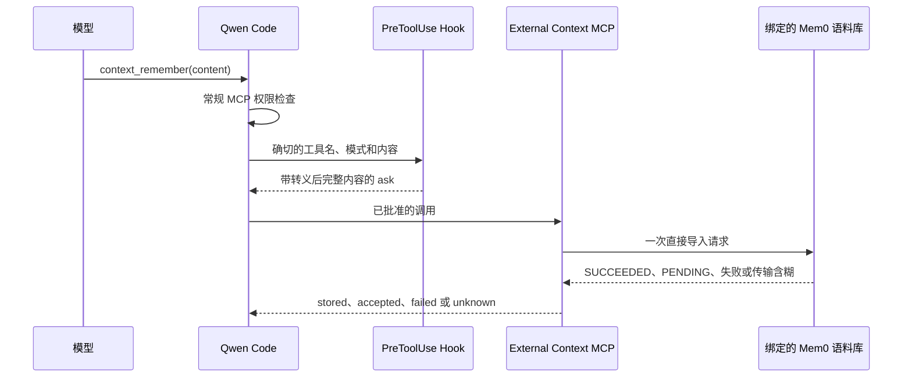

# Direct External Context Mem0 写入

[English](direct-external-context-mem0-write.md) | [简体中文](direct-external-context-mem0-write.zh-CN.md)

**状态：** 已实现

**日期：** 2026-08-03

**相关提案：** #7585

**Core 重放前置：** #8387

**受管控配置文件：** #7449

## 决策

为私有 Direct External Context 集成增加一个可选的写入工具：
`context_remember({ content })`。它仅由包含严格 `write: { enabled: true }`
配置块的版本 1 Mem0 配置注册。默认扩展清单、既有版本 1 配置、
Generic HTTP 以及版本 2 自动召回保持无写入能力。

该工具将校验后的文本原样通过选定的、已验证的 Mem0 直接导入预设发送，
并带 `infer: false`。旧的 `mem0-platform-v3` 配置继续受支持。新的
`mem0` 配置选择
[Direct External Context Mem0 预设](./direct-external-context-mem0-presets.zh-CN.md)
中定义的不可变内置预设。该工具不做预搜索、摘要、规范化、重试、轮询、
缓存或去重。单独安装的 `PreToolUse` 命令 Hook 展示完整文本的可逆转义
表示，并请用户确认。此确认是直连配置文件的用户体验防护，而不是服务端
授权边界。

## 范围

### 目标

- 让可信协作者把确切的仓库共享文本保存到一个由管理员绑定的 Mem0
  语料库。
- 让凭据、端点、预设和固定作用域处于模型可控输入之外。
- 在 MCP 调用执行前让完整文本可见。
- 每次经批准的工具调用最多发起一次 Provider 请求。
- 如实表示异步和含糊的 Provider 结果，不声称已持久化，也不诱导自动
  重试。
- 保持所有既有搜索和自动召回契约不变。

### 非目标

- 通用知识库摄取或 provider 中立的写入协议。
- 个人记忆、可信用户身份、按用户或按文档的 ACL。
- 更新、删除、全部删除、get-all、实体、事件或 Project 管理。
- 客户端去重或 exactly-once 投递。
- DLP、留存、法律保全、防篡改审计或强制批准。
- 保护 Mem0 凭据免受可信同 UID 仓库代码的读取。
- 自动召回写入、headless 批准、ACP、`serve` 或多工作区使用。

## 架构



MCP 进程与确认 Hook 是独立的进程。它们只共享纯内容校验与展示渲染
代码。随附的 Hook 代码不读取 Provider 配置，也不包含 Provider 写入
路径。不过 Qwen 命令 Hook 会从父环境继承普通的第三方凭据，因此 Hook
进程仍可能在其环境中收到配置路径和 Mem0 密钥。这不是凭据隔离。MCP
从不解释 Hook 的决定；Hook 的执行与确认由 Qwen 负责。

可选的写入器保持为私有工作区接口：

```ts
interface ExternalMemoryWriter {
  remember(input: {
    content: string;
    signal: AbortSignal;
  }): Promise<RememberResult>;
}

type RememberResult =
  | { status: 'stored'; providerOperationId?: string }
  | { status: 'accepted'; providerOperationId: string }
  | { status: 'failed' }
  | { status: 'unknown' };
```

它不含租户、用户、仓库、命名空间、`app_id`、元数据、过滤器或操作
选择器。显式工厂只为 Mem0 创建写入器。

## 配置与工具注册

写入块被刻意设计为不是带宽松 false 分支的布尔开关。只有下面这种确切
的版本 1 形态才启用该工具：

```json
{
  "version": 1,
  "timeoutMs": 5000,
  "write": { "enabled": true },
  "provider": {
    "type": "mem0-platform-v3",
    "apiKeyEnv": "MEM0_API_KEY",
    "appId": "repository-memory"
  }
}
```

缺少 `write` 保持既有的仅搜索服务器。`enabled: false`、未知写入字段、
Generic HTTP 写入和版本 2 写入都会使严格配置校验失败。默认扩展清单仍
只包含 `context_search`，因此写入能力不会通过普通的扩展链接出现。管理
员必须使用专门的固定 MCP 配置，其 `includeTools` 恰好包含 search 与
remember。

新的兼容 Mem0 的部署可以用严格的 `type: "mem0"` 块替换旧的 provider
块，其中包含一个内置预设、端点、凭据引用和预设校验的固定作用域。只有当该预设定义了经过审查的直接导入映射时才
接受写入。自定义端点不意味着自定义写入协议。

remember 工具的注解为 `readOnlyHint: false`、`destructiveHint: false`、
`idempotentHint: false`、`openWorldHint: false`。它们为客户端描述行为；
不是权限或授权。`idempotentHint: false` 注解还防止 #8387 引入的保守
MCP 重放策略在连接失败后透明地重复该调用。

## 内容契约

该工具接受一个名为 `content` 的字符串。它拒绝：

- 超过 4000 个 Unicode 码位。
- 空文本或仅由 Unicode 空白、控制字符或格式字符组成的文本。
- 未配对的 UTF-16 代理项。

有效内容不做修剪或规范化。前导和尾随空白、换行、星平面字符以及嵌在
其他可见内容中的普通控制字符都按所给内容原样发送。模型无法向
Provider 请求添加选择器或元数据。

确认 Hook 校验同一内容契约，并且最多从 stdin 读取 1 MiB。它要求确切
的 `PreToolUse` 事件和完全限定的 MCP 工具名。其他事件和工具名直接
放行，因此意外过宽的匹配器不会拒绝无关工具。`default`、`auto`、
`auto_edit`、`auto-edit` 和 `yolo` 返回 `ask`；匹配到 `plan`、未知模式
或无效输入的请求返回 `deny`。Hook 同时接受两种 Auto Edit 拼写，因为
Hook 契约使用 `auto_edit`，而交互式调度器当前转发的是 `auto-edit`
批准模式值。多余的工具参数会被 Hook 和 MCP schema 一并忽略，永远不会
到达 Provider。

reason 包含作为 JSON 字符串的完整文本。JSON 转义使引号、反斜杠、
换行和 C0 控制字符可逆；渲染器还会转义 DEL/C1 控制字符以及 bidi 和
零宽控制字符等 Unicode 格式字符。Qwen 把合成 Hook 确认标记为字面文本
渲染，因此 Markdown、行内代码、类 HTML 下划线标签和链接目标保持可见，
而不会被确认 UI 解释。Provider 仍然收到原始字符串。

字面渲染由交互式 TUI 实现。ACP、headless 和 `serve` 界面不消费这个
展示标记；受管启动器必须继续拒绝这些模式，而不是依赖确认文本在那些
界面上被安全渲染。

当完整 reason 放不进受限终端视图时，确认框显示开头部分并附带明确的
隐藏行数提示。随后全局 `Ctrl-S` 展开会在用户决定之前揭示剩余的
reason。该展示行为不改变发送给 Mem0 的内容。

## Mem0 请求与结果语义

旧的 Platform V3 适配器只发送一个请求：

```http
POST /v3/memories/add/
Authorization: Token <repository-project credential>
Accept: application/json
Content-Type: application/json
```

```json
{
  "messages": [{ "role": "user", "content": "<exact content>" }],
  "app_id": "<administrator-configured value>",
  "infer": false
}
```

`infer: false` 选择直接导入。它跳过 Mem0 推理和重复检测，因此批准同
一段文本两次可能创建两条记忆。本集成刻意不添加隐藏的搜索或内容散列，
因为对异步远端操作来说两者都无法提供幂等性。

带版本的 `mem0` 适配器同样只发送一个请求，仅使用所选预设的固定路径、
认证方式和作用域位置。Platform V3 使用其异步 add 响应。最初的 OSS
REST 和 PolarDB 预设只对有效的 `results[].id` 声称 `stored`；裸的
`event_id`、其他根对象或根数组一律是 `unknown`。客户端从不把请求被
接受当作已持久化的证明。

结果映射是保守的：

| Provider 结果                                                                         | 工具结果                    |
| ------------------------------------------------------------------------------------- | --------------------------- |
| 有效的 `SUCCEEDED`                                                                    | `stored`                    |
| 带 UUID `event_id` 的有效异步 `PENDING`                                               | `accepted`，附操作 ID       |
| 预设定义了同步直接导入结果时，有效的同步 `results[].id`                               | `stored`，附记忆 ID         |
| 异步状态响应中明确的 `FAILED`，或 HTTP 400、401、403、404                             | `failed`，附稳定的 MCP 错误 |
| 超时、取消、重定向、其他 HTTP 状态、损坏或超大的响应、无效 JSON、未知状态或无效标识符 | `unknown`，附 MCP 错误      |

Mem0 Platform Add 通常返回 `PENDING`，因此 `accepted` 是预期的成功结果，
含义是已排队，而非已持久化。`stored` 仅保留给有效的同步 `SUCCEEDED`
响应或预设定义的同步直接导入结果。`failed` 是明确的拒绝，告诉模型不要
在不更改内容或配置的情况下重试。`unknown` 表示 Provider 可能已经接受
了写入，告诉模型不要自动重试。本集成从不轮询事件，也从不重试。用户
取消同样不能证明记录未被创建。

错误和工具结果从不包含内容、凭据、Provider URL、原始响应或原始上游
错误。本集成不输出本地的按请求日志。Provider 访问日志不在其控制
范围内。

## 确认与信任边界

受管设置把 search 放进 `permissions.allow`，把 remember 放进
`permissions.ask`。在交互式会话中，Hook 的 ask 就是确认：它以字面文本
展示完整内容，取代普通的服务器/工具提示，在 Hook 会询问的每一种模式下
都是如此（default、auto、auto-edit 和 YOLO；plan 模式下 Hook 改为拒
绝）。正文先标明目标服务器和工具，再给出内容，因此无论内容以什么开
头，可信目标都停留在有界的头部窗口内。Hook 每次调用只运行一次，因此
批准不会造成循环。

Qwen 命令 Hook 的传输失败保留 Qwen 既有的 fail-open 语义。能够禁用
Hook、改动启动器或取得写入凭据的用户可以绕过此流程。启动器通过固定
Qwen、Node、MCP、Hook、配置、设置、`QWEN_HOME`、工作目录和环境允许
列表，拒绝用户参数、headless、ACP、`serve`、resume/continue 和启动即
YOLO，并禁用原生记忆、推测、聊天记录、遥测和使用统计，来减少意外绕
过。这些措施不构成进程隔离。在 Windows 上，允许列表中的 `PATH` 必须
把 `powershell` 解析到系统可执行文件，且 PowerShell 配置文件必须不存
在或由管理员控制，因为 Core 按名称调用配置的 shell。

每个仓库安全域都需要独立的 Mem0 Project 和该 Project 专用的凭据。
`app_id` 是 Project 内部的分类，不是授权。具备直接导入能力的密钥也可
能允许此 MCP 界面之外的其他 Project 操作。当凭据、身份、策略、批准或
审计必须在 CLI 用户进程之外强制执行时，使用 #7449 中的受管控配置
文件。

即使模型提议把搜索结果写回同一语料库，搜索结果仍是不可信的参考数据。
批准不会提升其信任级别。审查者必须检查完整内容，因为存储检索到的或
被注入的文本会把它传播给后续的用户和模型轮次。

## 验证与推出

单元测试覆盖严格配置、内容边界、确切的请求映射、全部结果类别、传输
含糊、条件工具注册、有界且稳定的 MCP 输出，以及确认转义和模式。交互
式 E2E 使用假模型、真实 TTY Qwen 进程、固定的 MCP 进程、真实命令
Hook 和假 Mem0 端点，验证拒绝不产生请求、批准产生一次请求、default、
auto-edit 和 YOLO 模式显示内容确认，以及 `PENDING` 只被报告为
accepted。

先通过假服务推出，然后是隔离的临时 Mem0 Project、一个可信仓库，再
到一个小的可信团队。回滚方式是移除启用写入的 MCP 配置、Hook 和凭据，
恢复只读的版本 1 配置，并重启 Qwen。既有 Mem0 记录不会被回滚删除或
迁移，必须由管理员在 Provider 侧处理。

## 参考资料

- [Mem0 Direct Import](https://docs.mem0.ai/platform/features/direct-import)
- [Mem0 Add Memories](https://docs.mem0.ai/api-reference/memory/add-memories)
- [Mem0 Organizations and Projects](https://docs.mem0.ai/api-reference/organizations-projects)
- [MCP Tool Annotations](https://modelcontextprotocol.io/specification/2025-11-25/schema)
