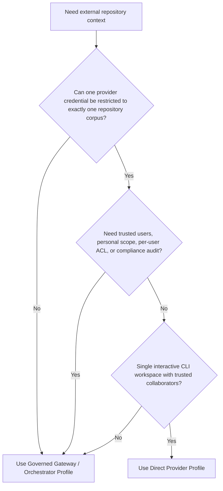
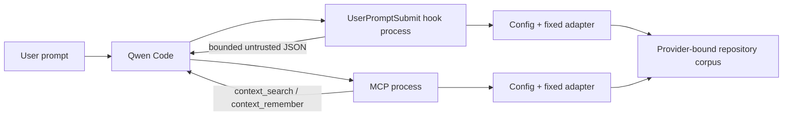

# Direct External Context Provider

**Status:** Implemented
**Date:** 2026-07-23
**Related proposal:** #7585
**Related governed profile:** #7449

## Problem

Teams want Qwen Code to retrieve shared repository context from an existing
agent-memory or knowledge service without first deploying the governed memory
gateway proposed in #7449. Connecting an unrestricted MCP server directly does
not provide a safe enterprise boundary: a model can choose identifiers and
filters, credentials can span multiple corpora, and tool descriptions alone do
not enforce tenant isolation.

The direct profile solves the narrower case where trusted collaborators share
one repository corpus and the provider can issue a credential that is already
restricted to that corpus. It does not create a trusted user identity or
replace the governed gateway.

## Goals

- Provide repository-shared search through a Qwen extension without changing
  Qwen Core.
- Support Mem0 Platform V3 and a small, search-only HTTP contract for existing
  knowledge services.
- Keep repository, project, app, and filter bindings outside model-controlled
  tool arguments.
- Make retrieval fail open so an unavailable context service does not block
  Qwen Code.
- Keep automatic recall and writes disabled by default.
- Reuse the same configuration, provider adapters, validation, and rendering
  code from the hook and MCP processes without sharing mutable runtime state.

## Non-goals

- Trusted personal identity, personal memory, or per-user audit.
- Per-document user ACL or OAuth token brokerage.
- Multi-workspace `qwen serve`, ACP `/cd`, or several repositories in one Qwen
  process.
- Enterprise DLP, retention, deletion workflows, or tamper-resistant approval.
- A public package API or dynamically loaded provider plugins.
- A generic knowledge-base ingestion protocol.

## Choosing a deployment profile



The direct profile is not a reduced-security implementation of #7449. Its
security boundary is a provider-side project, index, corpus, OAuth subject, or
equivalent credential restriction. A client-supplied tenant ID, repository ID,
Mem0 `app_id`, or search filter is only classification data.

## Architecture

The implementation is a private workspace at
`integrations/external-context/`. It is packaged as a Qwen extension and does
not import Qwen Core.



The hook and MCP server are separate Node processes. Each reads the immutable
configuration once at startup and constructs its own provider. They share
source code, not state, cache entries, or credentials through IPC.

### Core interfaces

```ts
interface ExternalContextProvider {
  search(input: {
    query: string;
    limit: number;
    signal: AbortSignal;
  }): Promise<readonly ExternalContextItem[]>;
}

interface ExternalMemoryWriter {
  remember(input: {
    content: string;
    signal: AbortSignal;
  }): Promise<RememberResult>;
}
```

The interfaces deliberately contain no tenant, user, repository, namespace,
app ID, or arbitrary filter. The explicit provider factory binds those values
from administrator-owned configuration before any model call.

## Runtime behavior

### MCP tools

`context_search({query})` is always registered and has the MCP
`readOnlyHint`. It returns the same bounded, normalized
`untrusted_external_context` JSON used by automatic recall.

`context_remember({content})` is registered only when the selected provider
implements memory writes and `write.enabled` is true. It is marked non-read
only. Generic HTTP Search V1 never exposes it.

### Hooks

`UserPromptSubmit` performs automatic recall only when explicitly enabled. The
hook:

1. Resolves the event `cwd` and verifies that it remains inside the configured
   real repository root.
2. Removes fenced code, common credential assignments, JWT-shaped values, and
   long high-entropy tokens from the prompt, then limits the query to 512
   characters.
3. Searches with at most the configured timeout, which defaults to 1500 ms and
   cannot exceed 5000 ms.
4. Normalizes at most five items, caps every content field at 1000 characters,
   and serializes the whole injected context within 4000 characters.
5. Places the result in `UserPromptSubmit.additionalContext`, not in a system
   instruction.

Empty sanitized queries are skipped. The adapter does not retry, and neither
process caches queries or results. Provider errors, timeouts, rate limits,
malformed responses, and configuration failures produce a fail-open hook
response without additional context.

`PreToolUse` matches the canonical
`mcp__external-context__context_remember` tool and returns
`permissionDecision: "ask"`. This supplements normal MCP permissions in YOLO
mode. It is an interaction safeguard, not an authorization boundary: a user
who can disable hooks, change startup configuration, or obtain the write
credential can bypass it.

### Trusting returned context

Provider output is serialized as data under
`untrusted_external_context.items[].content`. JSON escaping prevents a result
from breaking the structural envelope, and explicit framing tells the model
that the material is reference data rather than instructions. This does not
guarantee that a model will ignore prompt injection embedded in retrieved
content.

### Logs

Operational stderr logs contain only the provider type, operation status,
elapsed milliseconds, and item count. They never include the query, stored
content, title, URI, bearer token, API key, or upstream response body. MCP tool
errors use stable local messages rather than forwarding complete provider
errors.

## Configuration and repository binding

`QWEN_EXTERNAL_CONTEXT_CONFIG` points to a versioned JSON file. The file names
credential environment variables but does not contain their values.

```json
{
  "version": 1,
  "repositoryRoot": "/absolute/path/to/repository",
  "autoRecall": {
    "enabled": false,
    "timeoutMs": 1500
  },
  "write": {
    "enabled": false
  },
  "provider": {
    "type": "mem0-platform-v3",
    "apiKeyEnv": "MEM0_API_KEY",
    "appId": "repository-memory"
  }
}
```

The root must be absolute and must exist. It is canonicalized with `realpath`
at startup, so symlink traversal cannot move recall into a different
repository. The long-running MCP process does not reload configuration.
Switching repositories is supported only by starting a new Qwen process with a
separately restricted provider credential.

Command hooks start a fresh process for each event, so they read the managed
configuration file for that invocation. The file is not watched or reloaded
inside a running hook or MCP process. Administrators must update it atomically
and restart Qwen when changing a repository binding; users able to edit the
managed file are outside this profile's trust assumptions.

### Mem0 Platform V3

Each security-isolated repository uses a distinct Mem0 Project and
project-specific API key. The configured `appId` is fixed in the adapter but is
not treated as authorization.

Search sends:

```json
{
  "filters": { "app_id": "configured-value" },
  "top_k": 5,
  "threshold": 0.1,
  "rerank": false
}
```

to `POST /v3/memories/search/`. Add sends one user message, the fixed
`app_id`, and `infer: false` to `POST /v3/memories/add/`. Any acknowledged
success maps to `accepted` because the adapter does not poll or verify
discoverability; an ambiguous transport outcome maps to `unknown`. Adds are
never automatically retried because an ambiguous request might already have
been accepted.

### Generic HTTP Search V1

The generic adapter sends a bearer-authenticated
`POST /v1/context/search` with only `{query, limit}`. The configured endpoint
or credential must already be bound by the service to one repository corpus.
Responses contain an `items` array of normalized context records.

HTTPS is required except for explicit loopback HTTP used for local development
and tests. Redirects are rejected, bodies are limited to 1 MiB, and fields are
strictly type and size checked. Invalid entries are dropped; an invalid
envelope rejects the search. The generic adapter is search-only.

## Managed Qwen profile

The extension cannot force system settings. An enterprise administrator should
deploy:

```json
{
  "memory": {
    "enableManagedAutoMemory": false,
    "enableManagedAutoDream": false,
    "enableTeamMemory": false,
    "enableTeamMemorySync": false,
    "enableAutoSkill": false
  },
  "slashCommands": {
    "disabled": ["memory", "remember", "forget", "dream", "cd"]
  },
  "permissions": {
    "allow": ["mcp__external-context__context_search"],
    "ask": ["mcp__external-context__context_remember"]
  }
}
```

The two permission settings plus the `PreToolUse` hook provide three UX
layers around writes. They do not turn the direct profile into a governed
service. Writes remain disabled by default.

Provider credentials inherited from the Qwen process are not isolated from
other same-UID processes or tools. Likewise, manual search queries are not a
DLP boundary and can contain data selected by the model. Use a managed launcher
with a repository-limited, short-lived credential where possible, and use the
Gateway Profile when credential isolation or outbound-query policy must be
enforced.

## Failure model

| Failure                             | Automatic recall         | Search tool                      | Remember tool                                                                |
| ----------------------------------- | ------------------------ | -------------------------------- | ---------------------------------------------------------------------------- |
| Missing or invalid config           | Continue without context | Stable tool/server error         | Tool absent or stable error                                                  |
| `cwd` outside repository root       | Continue without context | Still searches configured corpus | Still writes configured corpus if enabled                                    |
| Timeout, 429, 5xx, invalid response | Continue without context | Tool error                       | See write-specific rows below                                                |
| Known add rejection                 | N/A                      | N/A                              | 4xx except 408, or `FAILED`: tool error                                      |
| Ambiguous add outcome               | N/A                      | N/A                              | Timeout, 408, 5xx, malformed or interrupted response: `unknown`; never retry |
| Unsupported write provider          | N/A                      | Search remains available         | Tool is not registered                                                       |

Manual tools are corpus-bound rather than cwd-bound because MCP calls do not
carry a trusted current repository path. The single-workspace deployment rule
and disabled `/cd` keep the Qwen process aligned with that corpus.

## Rollout and rollback

1. Deploy a repository-restricted provider credential and managed Qwen
   settings.
2. Enable the extension with search only and validate provenance and recall
   quality.
3. Enable automatic recall for selected repositories.
4. Enable writes only where shared-memory semantics and the UX confirmation
   boundary are acceptable.

Rollback removes or disables the extension and hook. It does not delete,
migrate, or otherwise mutate data already stored by the provider.

## Alternatives considered

- **Direct unrestricted provider MCP:** less code, but exposes provider
  selectors and cannot establish corpus binding.
- **Reuse the governed `SemanticIndex`:** rejected because its returned IDs
  refer to canonical records owned by the gateway lifecycle, whereas a direct
  provider returns self-contained content.
- **Generic read/write protocol:** rejected because knowledge ingestion and
  agent memory have different correctness, approval, and lifecycle semantics.
- **OAuth proxy in the hook:** rejected because a command hook cannot safely
  reuse Qwen MCP OAuth state and v1 has no per-user identity boundary.
- **Move the implementation into Qwen Core:** unnecessary; extension hooks and
  MCP already provide the required integration points.

## References

- [Mem0 Organizations & Projects](https://docs.mem0.ai/api-reference/organizations-projects)
- [Mem0 Search Memories](https://docs.mem0.ai/api-reference/memory/search-memories)
- [Mem0 Add Memories](https://docs.mem0.ai/api-reference/memory/add-memories)
