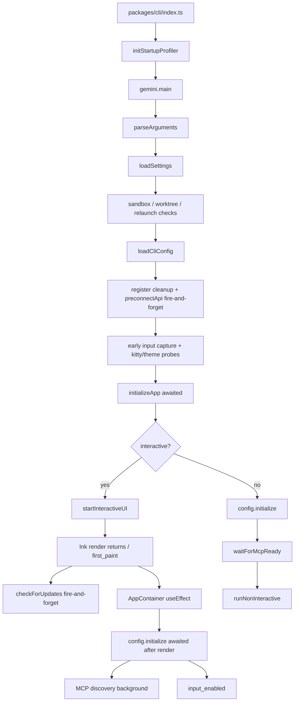
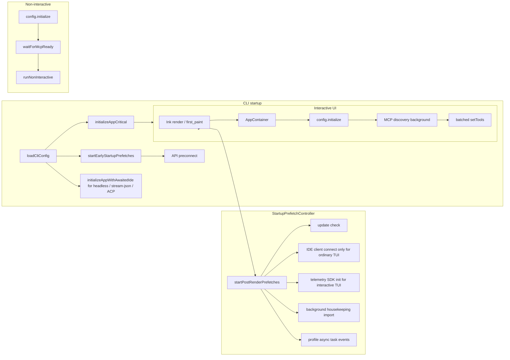
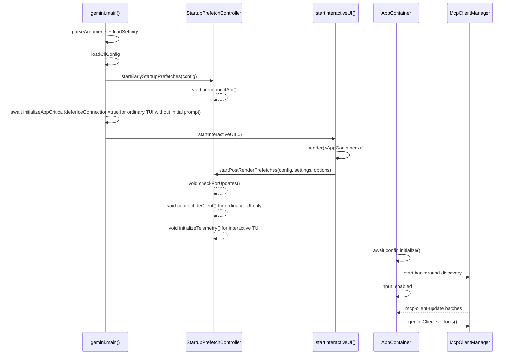

# Fire-and-Forget Startup Prefetch 启动优化设计

## 背景与目标

父 issue #3011 将 qwen-code 启动优化拆成多项子任务。当前仓库已经落地了部分基础能力：

- #3219：启动性能 profiler 已接入，支持 `QWEN_CODE_PROFILE_STARTUP=1` 输出启动阶段 JSON。
- #3221：工具注册已改为 lazy factory，`Config.initialize()` 不再静态实例化所有工具。
- #3223：API preconnect 已存在，当前在 `loadCliConfig()` 后以 fire-and-forget 方式触发。
- early input capture、MCP 渐进发现、AppContainer 渲染后 `config.initialize()` 也已部分实现。

#3222 的目标不是重做这些能力，而是把仍散落在启动路径中的非关键启动操作统一收敛成 fire-and-forget prefetch：首屏前只等待确实影响正确性的操作，首屏后启动不影响首次交互正确性的后台任务，同时保持非交互模式的兼容语义。

## 现有启动流程

当前交互式启动路径的关键流程如下：



现状判断：

- `initializeApp()` 仍在首屏前串行执行 i18n、auth、theme validation、IDE client connection。
- auth 和 i18n 必须留在首屏前；IDE connection 对无初始 prompt 的普通 TUI 首屏不是硬依赖，可以在普通 TUI 路径延后；但对 `qwen -i "prompt"`、`qwen -p`、stream-json、ACP/Zed 这类没有安全 post-render 空窗或首个请求需要 IDE context/status 的路径，必须继续在首个请求前 await。
- `checkForUpdates()` 已在 `startInteractiveUI()` 的 render 后 fire-and-forget，但逻辑散落在 UI 启动函数里。
- `preconnectApi()` 已是 fire-and-forget，应该保留尽早触发，但纳入统一调度。
- telemetry SDK init 以前在 `Config` 构造期同步发生；普通 interactive TUI 可以延后到 render 后，非交互路径仍保留首个请求前初始化语义。
- interactive 路径中，`config.initialize()` 已在 React mount 后执行；MCP discovery 已在 core 内部后台运行，并由 AppContainer 批量刷新工具列表。
- non-interactive 路径仍需要等待 `config.waitForMcpReady()`，否则第一个 prompt 可能看不到 MCP 工具，造成脚本行为回退。

## 目标架构

新增一个很小的启动预取调度层，统一管理“启动但不等待”的任务，按触发时机分为 early 和 post-render 两类。



新方案的交互式启动时序：



## 设计改动

### 1. 新增统一启动预取调度器

新增 `packages/cli/src/startup/startup-prefetch.ts`，提供两个入口：

```ts
startEarlyStartupPrefetches(config: Config): void;
startPostRenderPrefetches(
  config: Config,
  settings: LoadedSettings,
  options?: { connectIde?: boolean; initializeTelemetry?: boolean },
): void;
```

调度器只做三件事：

- 按名称启动预取任务。
- 用 `void task().catch(...)` 明确不等待、不抛出。
- 记录 debug 日志和 profiler async event，便于验证任务是否在 render 前后启动。

调度器需要保证每个阶段幂等，避免 React StrictMode、测试重复调用或异常重入导致同一任务启动多次。

### 2. early prefetch：保留最大提前量

`startEarlyStartupPrefetches(config)` 在 `loadCliConfig()` 成功后立即调用。

第一阶段只纳入 API preconnect：

- 从 `config.getModelsConfig()` 读取当前 auth type 和 resolved base URL。
- 从 `config.getProxy()` 读取 proxy。
- 调用现有 `preconnectApi(authType, { resolvedBaseUrl, proxy })`。
- 保留现有环境门控：`QWEN_CODE_DISABLE_PRECONNECT`、sandbox、custom CA、非 Node runtime、无 proxy 等。

这部分不新增设置项。preconnect 失败只写 debug 日志，不影响启动。

### 3. post-render prefetch：首屏后启动

`startPostRenderPrefetches(config, settings)` 在 `startInteractiveUI()` 中 Ink `render()` 返回并记录 `first_paint` 后调用。

首批纳入：

- update check：迁移现有 `checkForUpdates().then(handleAutoUpdate)` 逻辑，保留 `settings.merged.general?.enableAutoUpdate !== false` 的门控。
- IDE client connection：只在无初始 prompt 的普通 interactive TUI 路径中移到 post-render prefetch。调用方必须显式传入 `connectIde: true`，并且调度器内部仍需检查 `config.getIdeMode()`。`qwen -i "prompt"`、非交互、stream-json、ACP/Zed 不通过这个入口延后 IDE 连接。
- telemetry SDK init：只在 interactive TUI 路径中移到 post-render prefetch。`Config` 仍保留 telemetry settings，但通过 `deferTelemetryInitialization` 跳过构造期 SDK side effect；post-render prefetch 通过 `initializeTelemetry(config)` 启动 SDK。非交互、stream-json、ACP/Zed 不延后。
- background housekeeping：可从 `gemini.tsx` 迁移到 post-render prefetch，使所有后台启动任务有统一入口；仍限定 interactive，仍保持 dynamic import 和错误吞噬。

这些任务都不能影响 `startInteractiveUI()` 的返回值，也不能向 TUI stderr 写用户可见错误。失败只进入 debug log。

### 4. 拆分 `initializeApp()` 的关键路径，并保留非 TUI awaited IDE 连接

新增一个共享 helper，避免 TUI deferred 路径和非 TUI awaited 路径复制 IDE 连接逻辑：

```ts
export async function connectIdeForStartup(config: Config): Promise<void> {
  if (!config.getIdeMode()) return;

  const ideClient = await IdeClient.getInstance();
  await ideClient.connect();
  logIdeConnection(config, new IdeConnectionEvent(IdeConnectionType.START));
}
```

`initializeApp()` 保留为首屏前关键初始化，但增加一个显式选项：

```ts
interface InitializeAppOptions {
  deferIdeConnection?: boolean;
}
```

默认值必须保持兼容：`deferIdeConnection` 默认为 `false`。也就是说，不传选项时仍会在 `initializeApp()` 内 await IDE 连接。

`initializeApp()` 的 awaited 内容变为：

- `initializeI18n(...)`
- `performInitialAuth(...)`
- `validateTheme(settings)`
- 当 `deferIdeConnection !== true` 时，`await connectIdeForStartup(config)`
- 计算 `shouldOpenAuthDialog`
- 读取 `config.getGeminiMdFileCount()`

`gemini.tsx` 调用处负责按运行模式选择：

```ts
const deferIdeConnection =
  config.isInteractive() && !config.getExperimentalZedIntegration() && !input;

const initializationResult = await initializeApp(config, settings, {
  deferIdeConnection,
});
```

随后只有当 `deferIdeConnection === true` 时，`startInteractiveUI()` 才通过 `startPostRenderPrefetches(..., { connectIde: true })` fire-and-forget 启动 IDE 连接；prompt-interactive 因为会自动提交首个问题，继续在 render 前 await IDE，并传入 `connectIde: false` 避免 post-render 重复连接。

这个分流修正 review 指出的兼容性风险：

- 普通 interactive TUI：IDE socket/IPC 连接不再阻塞首屏。
- `qwen -i "prompt"`：继续在首个自动提交请求前 await IDE 连接，且 post-render 不重复连接。
- `qwen -p` / piped stdin：继续在首个模型请求前 await IDE 连接。
- stream-json：继续在 session/control 请求处理前完成 IDE 连接。
- ACP/Zed：继续保留 awaited IDE startup，避免首个请求缺 IDE context/status。

### 5. MCP 与非交互语义保持不变

本方案不改 core MCP 状态机。

interactive：

- 继续由 `AppContainer` 在 mount effect 中调用 `config.initialize()`。
- `Config.initialize()` 继续启动 background MCP discovery。
- AppContainer 继续监听 `mcp-client-update` 并以约 16ms 批量调用 `geminiClient.setTools()`。
- 首屏和输入可用不等待 MCP 全部 settle。

non-interactive / stream-json / ACP：

- 继续在首个模型请求前 await IDE 连接。
- 继续在首个模型请求前等待 `config.waitForMcpReady()`。
- 保持旧同步路径的工具可见性语义。
- 保持 MCP 失败时 stderr warning 的现有行为。

## 性能收益预估

收益分为两类。

第一类是首屏前关键路径缩短：

- 普通 interactive TUI 的 IDE client connection 不再阻塞首屏；收益取决于 IDE socket/IPC 连接耗时，预期为几十毫秒到数百毫秒。
- 普通 interactive TUI 的 telemetry SDK init 不再阻塞首屏；收益取决于 OTel SDK/exporter 构造成本，通常是小到中等的同步启动开销。
- update check、housekeeping、preconnect 等任务有统一 fire-and-forget 入口，不会被未来维护误放回 awaited path。

第二类是首个 API 请求收益：

- 继续保留 #3223 的 API preconnect 设计。
- 当 proxy/shared dispatcher 可复用时，首个 API 请求可减少 TCP+TLS 握手成本，预期 100-200ms。

需要注意：#3219 的历史 baseline 显示模块加载曾占启动总耗时约 94%，#3221 lazy tool registration 已经针对最大瓶颈做过优化。#3222 的核心收益更偏 perceived TTI 和首屏响应，而不是消除全部模块加载成本。

## 风险与影响范围

### 风险

- 普通 TUI 的 IDE 能力可能从“首屏前已连接”变为“首屏后很快连接”。缓解方式：只在普通 interactive TUI 路径延后；非交互、stream-json、ACP/Zed 保持首个请求前 awaited 连接。
- render 前 telemetry event 可能在 SDK 未初始化时被 no-op 丢弃。缓解方式：只延后 interactive TUI；非交互首个请求相关 telemetry 仍保持原语义，不新增缓冲队列。
- deferred task 失败可能不明显。缓解方式：统一 wrapper 记录 debug log 和 profiler async event。
- 迁移 update/preconnect 时可能改变原有门控。缓解方式：逐字保留现有 settings/env 条件。
- 过度 defer 可能导致首个用户输入依赖的能力未就绪。缓解方式：auth、config construction、permissions、hooks、memory、tool registry、non-interactive MCP ready 全部保持 awaited。

### 影响范围

预计只涉及 CLI 启动层：

- `packages/cli/src/startup/startup-prefetch.ts`
- `packages/cli/src/core/initializer.ts`
- `packages/cli/src/gemini.tsx`
- `packages/cli/src/ui/startInteractiveUI.tsx`
- 对应单元测试

不改动：

- CLI 参数与配置 schema
- core tool registry 协议
- MCP discovery 状态机
- 模型请求协议
- 用户可见命令行为

## 单元测试计划

### `packages/cli/src/startup/startup-prefetch.test.ts`

覆盖：

- `startEarlyStartupPrefetches()` 会调用 `preconnectApi()`，并传入 auth type、resolved base URL、proxy。
- early prefetch 不 await 任务完成。
- repeated call 幂等，不重复启动同一 early task。
- `startPostRenderPrefetches()` 在 `enableAutoUpdate !== false` 时启动 update check。
- `enableAutoUpdate === false` 时不启动 update check。
- `options.connectIde === true` 且 `config.getIdeMode() === true` 时启动 IDE connect 并调用 `logIdeConnection()`。
- `options.connectIde !== true` 时不触发 IDE connect。
- `config.getIdeMode() === false` 时即使 `options.connectIde === true` 也不触发 IDE connect。
- `options.initializeTelemetry === true` 时启动 telemetry SDK init。
- `options.initializeTelemetry !== true` 时不触发 telemetry SDK init。
- deferred task reject 不会让 public API throw，只写 debug log。

### `packages/cli/src/core/initializer.test.ts`

调整并新增：

- `initializeApp()` 默认会 await `connectIdeForStartup()`，保持非 TUI 路径兼容。
- `initializeApp(..., { deferIdeConnection: true })` 不调用 `IdeClient.getInstance()` 或 `connect()`。
- `initializeApp(..., { deferIdeConnection: false })` 在 `config.getIdeMode() === true` 时调用并 await IDE connect。
- 仍会 await `initializeI18n()`。
- 仍会 await `performInitialAuth()`。
- auth 失败时保留 `authError` 和 `shouldOpenAuthDialog === true`。
- theme 校验失败时保留 `themeError`。
- auth type 显式提供且 auth 成功时 `shouldOpenAuthDialog === false`。

### `packages/cli/src/ui/startInteractiveUI.test.tsx`

覆盖：

- Ink `render()` 返回并记录 `first_paint` 后，调用 `startPostRenderPrefetches(config, settings)`。
- 普通 TUI 路径传入 `{ connectIde: true, initializeTelemetry: true }`。
- 当 prompt-interactive 已在 render 前 await IDE 时，传入 `{ connectIde: false, initializeTelemetry: true }`，避免重复 IDE connect。
- 非 TUI 路径不通过 `startInteractiveUI()` 触发 IDE/telemetry post-render prefetch。
- post-render prefetch reject 不会导致 `startInteractiveUI()` reject。
- update check 从 `startInteractiveUI()` 内联逻辑移走后，不再被直接调用。

### `packages/cli/src/gemini.test.tsx`

调整并新增：

- 普通 interactive TUI 调用 `initializeApp(config, settings, { deferIdeConnection: true })`，并在 post-render prefetch 中连接 IDE。
- prompt-interactive 调用 `initializeApp(config, settings, { deferIdeConnection: false })`，并且 post-render prefetch 不再连接 IDE。
- `qwen -p` / piped stdin / stream-json 调用 `initializeApp(config, settings, { deferIdeConnection: false })` 或使用默认值，确保首个请求前 IDE 已连接。
- ACP/Zed 路径不启用 IDE deferred prefetch，继续走 awaited IDE startup。

### `packages/core/src/config/config.test.ts`

覆盖：

- telemetry enabled 且未传 `deferTelemetryInitialization` 时，`Config` 构造期仍调用 `initializeTelemetry(config)`。
- telemetry enabled 且 `deferTelemetryInitialization === true` 时，`Config` 构造期不调用 `initializeTelemetry(config)`，但 `config.getTelemetryEnabled()` 仍为 true。

### 回归测试

建议执行：

```bash
cd packages/cli && npx vitest run src/core/initializer.test.ts src/startup/startup-prefetch.test.ts
cd packages/cli && npx vitest run src/gemini.test.tsx
cd packages/core && npx vitest run src/config/config.test.ts -t "telemetry"
```

## 验收标准

- interactive REPL 首屏不等待 IDE connection、telemetry init、update check、housekeeping。
- non-interactive、stream-json、ACP/Zed 在首个请求前仍 await IDE connection。
- non-interactive、stream-json、ACP/Zed 不延后 telemetry SDK init。
- API preconnect 仍在 `loadCliConfig()` 后尽早 fire-and-forget。
- auth、config、permissions、hooks、memory 等关键正确性初始化仍在需要的位置 await。
- non-interactive 首个 prompt 仍等待 MCP ready。
- 所有 deferred task 失败都不影响 REPL 渲染。
- profiler 能看出 deferred task 在 first_paint 前后按预期启动。
- 单元测试覆盖关键路径、幂等、错误吞噬和非交互兼容约束。

## 默认假设

- #3221 在 GitHub 上实际是 issue，不是 PR；当前仓库已经包含 lazy tool registry 实现。
- 本方案不新增配置项，避免把启动优化变成用户可配置复杂度。
- “REPL renders before deferred operations complete” 指 Ink 首屏返回和输入可用，不要求所有后台能力在用户看到 UI 前完成。
- 非交互模式优先兼容性，不追求和 interactive 一样激进的首屏优化。
