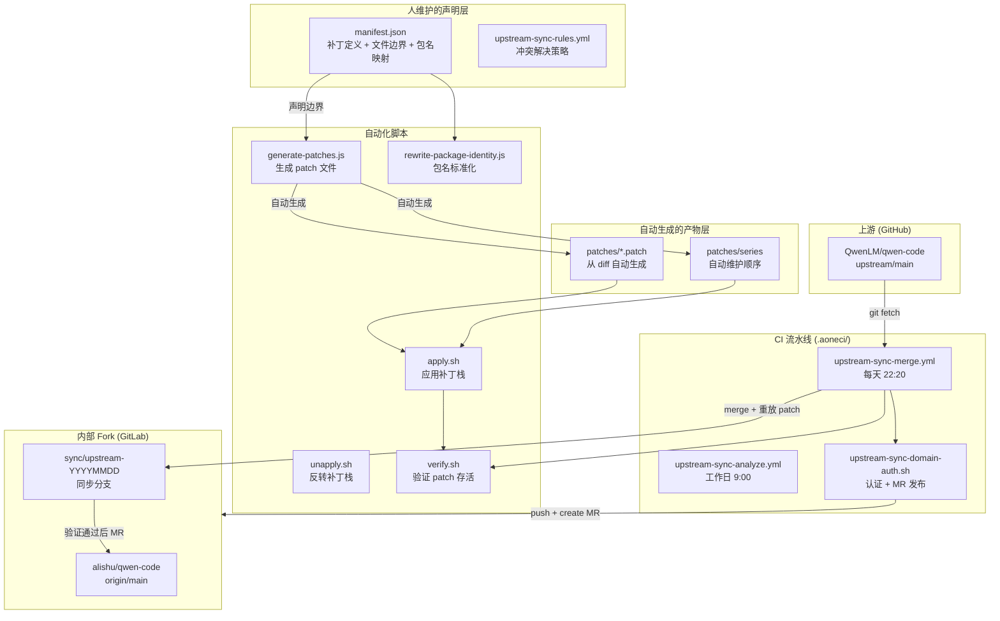
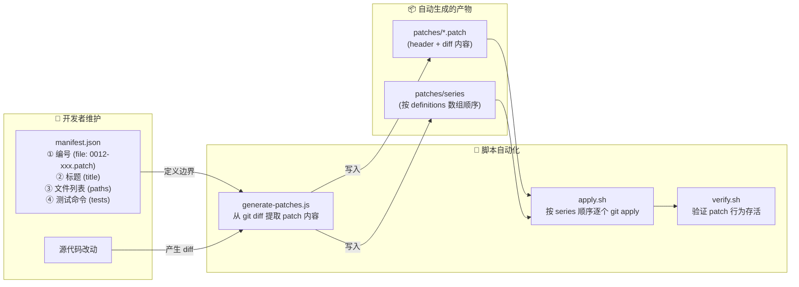
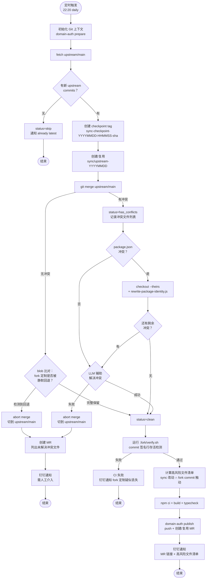
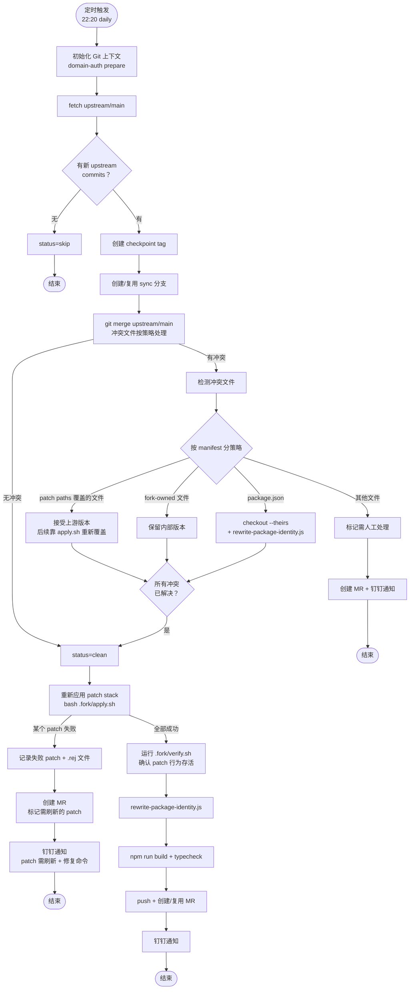
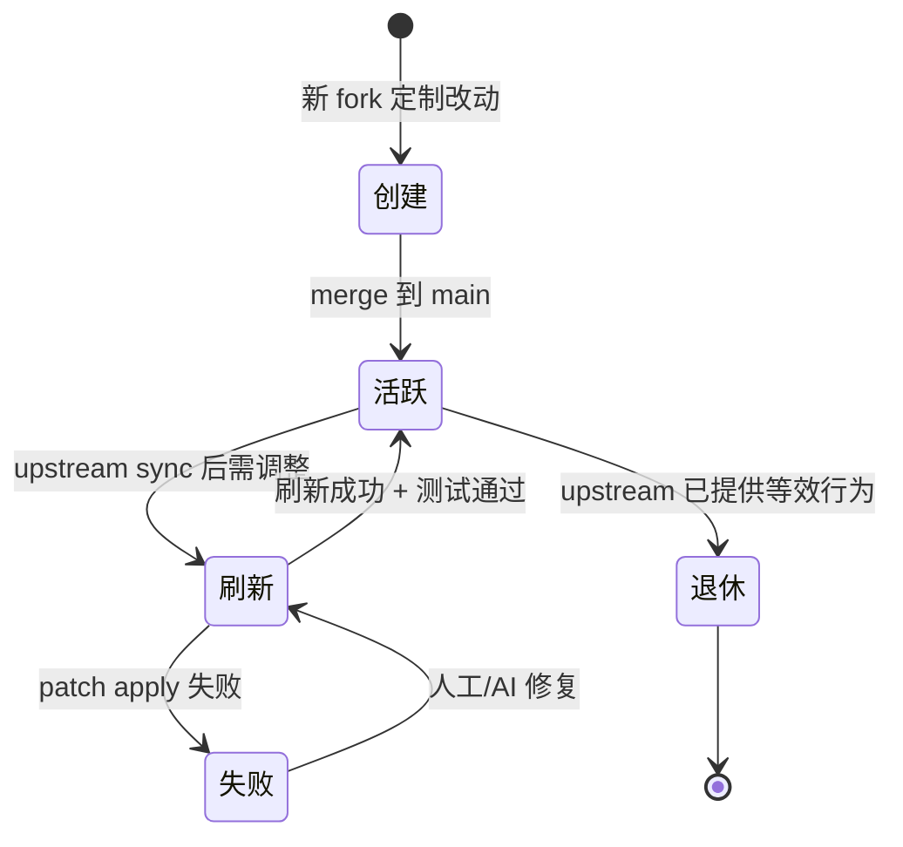
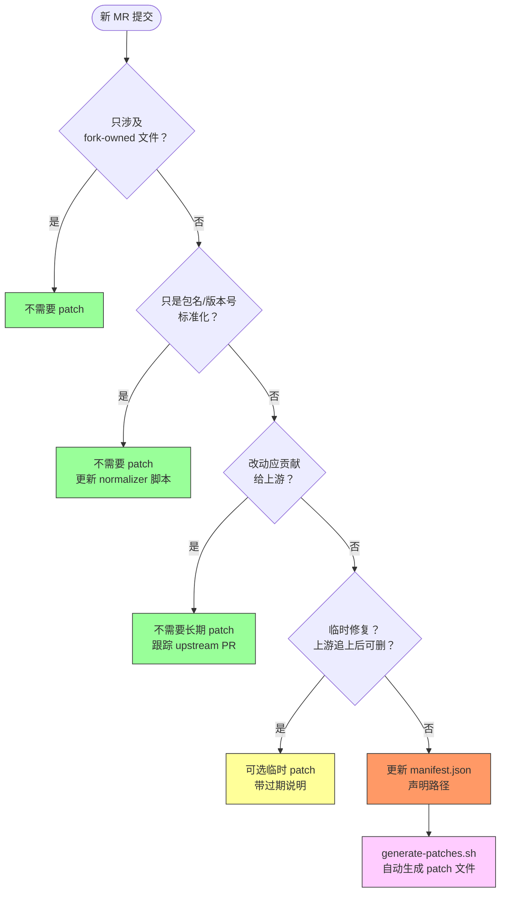
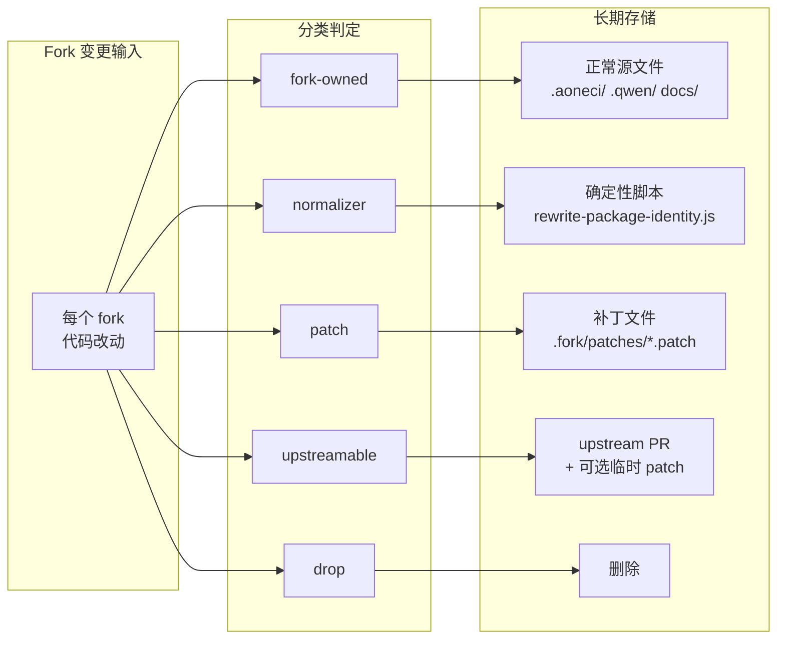

# Fork Patch Stack 架构设计

> 目标：让长期存在的 fork 定制改动 **显式化、可重放、可审查**，在 upstream sync 过程中不依赖 AI 或 Git 自动合并作为最终正确性来源。

## TL;DR

**问题**：upstream sync 时 Git/AI 自动合并可能静默丢失 fork 定制（编译通过但功能丢了）。

**方案**：参考 code-server，将必须长期保留的 fork 定制拆分为有序补丁（`.fork/patches/`），每次 sync 后自动验证补丁是否存活。

**核心机制**：

| 层                 | 做什么                                          | 谁负责                                    | 触发方式                                 |
| ------------------ | ----------------------------------------------- | ----------------------------------------- | ---------------------------------------- |
| Patch 声明         | 11 个补丁的文件边界和元数据                     | `.fork/manifest.json`（人维护）           | MR 中修改                                |
| Patch 生成         | 从 code diff + manifest 自动生成 `.patch` 文件  | `generate-patches.js`（脚本自动）         | `bash .fork/generate-patches.sh`         |
| Package Normalizer | 包名 `@alife/dataworks-*` + registry 改写       | `rewrite-package-identity.js`（脚本自动） | `node .fork/rewrite-package-identity.js` |
| Guarded Merge CI   | 每天自动 fetch → merge → 重放 patch → 验证 → MR | `.aoneci/upstream-sync-merge.yml`         | 定时 22:20                               |
| 验证门禁           | patch 存活检查 + build + typecheck              | `.fork/verify.sh`                         | `bash .fork/verify.sh`                   |

**关键设计：patch 文件是脚本自动生成的产物，不需要人手写 diff。** 开发者只需维护 `manifest.json` 中的声明（编号、路径、顺序），脚本负责从 git diff 提取内容、生成 patch 文件、应用和验证。

**开发者需要知道的**：

- 如果你的 MR 修改了上游文件中的内部行为 → 在 `manifest.json` 中声明路径，运行 `generate-patches.sh` 自动生成 patch
- 如果只改 `.aoneci/`、`docs/`、lockfile → 不需要 patch
- 包名改写不要手动改 package.json → 运行 `rewrite-package-identity.js` 自动改写
- patch 文件是 **自动生成的产物**，不需要手动执行 `generate-patches.js`

**当前状态**：Phase 2 已完成（11 个种子补丁），Phase 3 部分完成（CI 已集成 verify.sh 签名行检测 + blob 回退检测；apply.sh 重放验证待集成）。

---

## 整体架构图



### 声明 vs 生成 的职责边界



**职责分工：**

| 环节              | 谁负责    | 具体内容                                                           |
| ----------------- | --------- | ------------------------------------------------------------------ |
| 编号命名          | 👤 开发者 | 在 manifest.json `file` 字段手写，如 `"0012-xxx.patch"`            |
| 归类（路径边界）  | 👤 开发者 | 在 manifest.json `paths` 数组声明哪些文件属于该 patch              |
| 顺序              | 👤 开发者 | manifest.json `definitions` 数组的顺序即 series 顺序               |
| diff 内容提取     | 🤖 脚本   | `generate-patches.js` 从 `git diff merge-base..fork` 按 paths 过滤 |
| series 文件生成   | 🤖 脚本   | 自动从 definitions 顺序生成                                        |
| patch header 生成 | 🤖 脚本   | 自动从 manifest 元数据 + git ref 组装                              |
| 应用补丁          | 🤖 脚本   | `apply.sh` 按 series 逐个 `git apply`                              |
| 验证              | 🤖 脚本   | `verify.sh` 检查 patch 行为是否存活                                |

**原则：编号、归类、顺序由开发者在 manifest.json 中声明；patch 文件内容、series 文件由脚本自动生成。开发者不需要手写 diff。**

> **已知限制**：`apply.sh` 当前使用 `git apply`（不含 `--3way`）。如果 upstream sync 后代码上下文偏移较大，apply 可能失败。后续可升级为 `git apply --3way` 或 `git am` 以提高容错。

## CI 同步流程图

### 当前已实现（Phase 2/3）



**当前保护机制**：

- **merge 后 blob 比对**：检测 fork 改过的文件是否在合并后等于 upstream 版本（静默回退）
- **verify.sh**：遍历 fork commit 历史，提取每个 commit 的加入行（签名行），检查是否仍存在于当前代码
- **高风险文件清单**：sync 改动文件 ∩ fork commit 触动过的文件，写入 MR body 供 reviewer 重点检查

### 目标架构（Phase 3 完整版，待实现）



**目标思路**：patch 覆盖的文件在 merge 时不靠 AI 猜——直接接受上游版本，然后用 `.fork/apply.sh` 重新应用补丁栈。如果 patch 无法应用，说明需要人工或 AI 辅助刷新该 patch（在独立 MR 中完成）。

> **Phase 3 待实现项**：
>
> 1. CI merge 冲突时，对 manifest.json `paths` 中声明的文件走 `checkout --theirs` 策略
> 2. merge 成功后调用 `bash .fork/apply.sh --check` 验证 patch 可应用性
> 3. 调用 `node .fork/generate-patches.js --check` 确保 patch 文件与当前代码一致

## 补丁生命周期



## 新 MR 补丁决策流程



## 变更分类全景图



---

## 1. 背景

本仓库是 `QwenLM/qwen-code` 的内部 fork，包含 DataWorks 品牌定制、内部发布链路、包命名空间、channel 集成、OAuth 行为和 CI 自动化等改动。

现有的 guarded merge 流程可以覆盖大部分场景，但仍有一个薄弱点：当上游改动与 fork 定制重叠时，自动合并或 AI 辅助合并可能生成能编译通过但静默丢失内部行为的代码。

本文档定义了一套 code-server 风格的 patch stack，用于保护那些必须在未来 upstream sync 中存活的 fork 改动子集。

## 2. 参考模型

`code-server` 将 VS Code 作为上游源码，以有序的 `patches/*.diff` 文件（由 `quilt` 管理）维护其定制。核心经验不是"每个 PR 都变成一个 patch"，而是：

- 每个长期存在的定制用一个命名的、有序的 patch 表示
- patch 可以被应用、刷新、审查和测试
- VS Code 升级时可以一次性刷新多个 patch
- 一个 patch 可以被后续多个 PR 更新
- 如果某个 patch 无法应用，更新流程停止并修复该 patch
- 只为新的长期定制创建新 patch 文件，不是每个 PR 都创建

本仓库遵循同样的 patch-stack 原则，但使用适配 Aone CI 环境的脚本。

## 3. 不适用范围

Patch stack 不是所有 fork 改动的替代方案。

**不应放入 patch 文件的内容：**

- `.aoneci/` 下的内部 CI 文件
- 不与上游代码重叠的内部发布脚本
- 生成文件（如 `package-lock.json`）
- 机械式的包命名空间和版本号改写
- 上游追上后应删除的临时修复
- 应提交回上游的通用改动

Patch stack 也不是所有 fork 差异的单一归档。一个大 diff 和大规模手动合并有同样的失败模式：难以审查、难以刷新、难以退休。

## 4. 变更分类

每个 fork 变更在合并前都应先分类。

| 类别           | 含义                                           | 长期存储方式                |
| -------------- | ---------------------------------------------- | --------------------------- |
| `fork-owned`   | 仅 fork 拥有的文件（如 Aone CI、内部发布文档） | 正常源文件                  |
| `normalizer`   | 机械式改写（如包名、版本号、lockfile）         | 确定性脚本                  |
| `patch`        | 上游所有文件中的长期 fork 定制                 | `.fork/patches/*.patch`     |
| `upstreamable` | 应提交给 `QwenLM/qwen-code` 的通用修复或功能   | upstream PR，可选临时 patch |
| `drop`         | 已过时或上游已覆盖的 fork 代码                 | 从 fork 中删除              |

只有 `patch` 类别的改动属于 patch stack。

## 5. 补丁粒度

补丁按 **持久的产品意图** 分组，而非按 MR、commit 或文件。

推荐粒度：

- 一个用户可感知的 fork 行为
- 一个与上游代码的集成点
- 一个必须在 upstream sync 中存活的内部兼容层
- 一小组必须一起刷新的文件

避免两个极端：

- 一个 MR = 一个 patch
- 所有 fork 改动 = 一个 patch

示例：

```text
.fork/patches/
  series
  0001-branding-header.patch
  0002-branding-tips.patch
  0003-i18n-dataworks.patch
  0004-dsw-oauth-redirect.patch
  0005-osc8-internal.patch
  0006-dingtalk-channel-enhancements.patch
  0007-feishu-channel.patch
```

后续 MR 可以更新 `0002-branding-tips.patch` 及其测试。另一个 MR 可以新增 `0012-...patch`。一次 upstream sync MR 可以一次性刷新多个 patch。

## 6. 目录结构

已实现的布局：

```text
.fork/
  manifest.json             # 补丁定义、包名映射、registry 配置（source of truth）
  patches/
    series                  # 补丁应用顺序（权威来源）
    0001-branding-header.patch
    0002-branding-tips.patch
    ...
  apply.sh                  # 按 series 顺序应用补丁栈
  unapply.sh                # 反转所有已应用补丁
  verify.sh                 # 验证补丁是否在当前代码中存活
  create-patch.sh           # 创建新补丁
  refresh-patch.sh          # 刷新已有补丁
  generate-patches.js       # 从 fork diff 生成补丁文件
  generate-patches.sh       # shell 包装
  rewrite-package-identity.js  # 包名/registry 正向和反向改写
  sync-upstream.sh          # 本地 upstream sync 辅助
  patches.md                # 自动生成的补丁清单
```

补丁文件包含一个简短的元数据头：

```text
Subject: DataWorks startup tips
Reason: Keep DataWorks-specific startup guidance and avoid upstream generic tips.
Owner: DataWorks Qwen Code maintainers
Patch-Base: cc800d01322c3bf642b919425576da09f182c3d5
Fork-Ref: origin/main (...)
Upstream-Ref: upstream/main
Tests: cd packages/cli && npx vitest run src/ui/components/Tips.test.ts

diff --git a/packages/cli/src/services/tips/tipRegistry.ts b/...
...
```

头部是审查元数据。diff 正文是可执行的契约。`Patch-Base` 是关键字段：必须是提取补丁时的 fork/upstream merge-base，而非最新的 upstream head。

## 7. 新 MR 决策规则

开发者提交新 MR 时，应回答这个问题：

> 这个改动是否修改了上游所有文件中的代码，且必须在未来 upstream sync 中存活？

如果是，在 `manifest.json` 中声明路径（新增或更新），patch 文件由脚本自动生成。

决策流程：

```text
新 MR
  |
  |-- 只涉及 fork-owned 文件？
  |     → 不需要 patch
  |
  |-- 只是包名/版本号/lockfile 标准化？
  |     → 不需要 patch；如需要则更新 normalizer
  |
  |-- 改动应贡献给上游？
  |     → 不需要长期 patch；跟踪 upstream PR
  |
  |-- 改动是临时的，上游追上后可删除？
  |     → 可选临时 patch（带过期说明）
  |
  |-- 改动是上游所有文件中的内部行为？
        → 更新已有 patch 或创建新 patch
```

## 8. 补丁维护方式

### 8.1 开发者日常流程（简化版）

开发者不需要手动生成 patch 文件。日常流程：

1. 修改源代码（正常开发）
2. 如果改动涉及上游文件且需要长期保留：
   - 在 `manifest.json` 的 `patches.definitions` 中声明/更新文件路径
   - 提交代码 + manifest 改动
3. 运行 `bash .fork/generate-patches.sh`（或等脚本自动执行）自动重新生成 patch 文件
4. 运行 `bash .fork/verify.sh` 确认 patch 逻辑正确

```text
开发者操作            脚本自动化
─────────────        ────────────────
修改源代码     ──→   generate-patches.js 从 diff 推导 patch
更新 manifest  ──→   自动生成 patches/*.patch + series
提交 MR        ──→   verify.sh 验证 patch 存活
```

### 8.2 更新已有补丁

如果 MR 修改了已有的 fork 行为：

1. 正常修改源代码
2. 确保 `manifest.json` 中对应 patch 的 `paths` 列表包含新增/修改的文件
3. 运行 `bash .fork/generate-patches.sh` → patch 文件自动更新
4. 运行对应 patch 声明的测试

MR 应包含：

- 源代码改动
- `manifest.json` 路径更新（如有）
- 自动重新生成的 `.fork/patches/*.patch`
- 测试或更新的测试期望

### 8.3 创建新补丁

当改动是上游所有文件中的新的长期 fork 定制时：

1. 在 `manifest.json` 的 `patches.definitions` 数组中添加新条目
2. 填写 `file`（编号命名）、`title`、`reason`、`paths`、`tests`
3. 运行 `bash .fork/generate-patches.sh` → 自动生成新 patch 文件和 series

命名规则：按行为命名，使用下一个有序编号。

```text
0012-dataworks-session-export.patch
```

不要用 MR ID 或日期命名 patch。MR ID 是评审历史；patch 名称是维护契约。

### 8.3 无需补丁的情况

当 MR 仅限于以下范围时不需要 patch：

- `.aoneci/**`
- `.qwen/**` 内部流程文件
- `docs/design/**` 内部文档
- 脚本覆盖的包版本/命名空间标准化
- lockfile 重新生成
- 仅验证已有 fork 行为的测试
- 应该提交给上游的兼容修复

CI 分类步骤仍应报告为何不需要 patch。

## 9. 初始提取策略

当前 fork 已有大量历史改动。不要通过直接比较 fork main 和最新 upstream head 来生成一个大 patch。

初始提取分三步进行。

### Pass 1: 盘点

从当前 fork diff 生成审计报告：

```bash
MERGE_BASE=$(git merge-base origin/main upstream/main)
git diff --name-status "$MERGE_BASE..origin/main"
git log --oneline --no-merges "$MERGE_BASE..origin/main"
```

报告仅用于分类，不应作为最终 patch 提交。

### Pass 2: 分类

将历史改动分组为：

- fork-owned 文件
- package normalizer 规则
- patch 候选
- 已过时或已提交上游的改动

从两侧都有改动的文件开始，因为它们风险最高。

### Pass 3: 提取小补丁

对每个 patch 候选：

1. 在相关 upstream base 创建干净 worktree
2. 只应用选定行为的 hunks
3. 运行其专项测试
4. 将结果 diff 保存为命名的 `.patch` 文件
5. 添加到 `series`
6. 从 upstream + 完整 series 重建以验证顺序

本仓库使用 `.fork/manifest.json` 作为补丁边界定义源，`.fork/generate-patches.js` 生成 diff 文件：

```bash
git fetch origin main
git fetch upstream main --tags
node .fork/generate-patches.js --write
node .fork/generate-patches.js --check
```

默认使用的引用：

```text
PATCH_BASE_REF = git merge-base "$FORK_REF" "$UPSTREAM_REF"
FORK_REF       = origin/main        （内部 fork 主分支）
UPSTREAM_REF   = upstream/main       （上游 QwenLM/qwen-code 主分支）
```

仅在刻意重现旧版提取时才手动指定 `PATCH_BASE_REF`。这样补丁文件锚定在最后一次 upstream sync 点，避免将无关的未来上游改动引入 fork patch。

## 10. Upstream Sync 流程

目标同步流程：

```text
定时同步
  → fetch upstream/main
  → 创建或复用 sync/upstream-YYYYMMDD 分支
  → 从当前 main 应用 package normalizer
  → 按顺序应用 .fork/patches/series
  → 当 package 文件有变化时重新生成 package-lock.json
  → 运行 patch stack 检查
  → 运行受影响 patch 声明的专项测试
  → 创建/更新 MR
  → 发送钉钉通知
```

当某个 patch 失败时：

```text
patch 0002-branding-tips.patch 失败
  → 停止应用后续 patch
  → 保留 reject/debug 产物
  → 创建/更新 sync MR
  → 钉钉通知包含失败 patch、涉及文件和修复命令
  → AI 或维护者在正常 MR 中刷新 patch
```

AI 可以协助刷新失败 patch，但 CI 在完整补丁栈和测试通过前不应将 AI 输出视为正确。

## 11. 包名标准化

Package 文件有意放在 patch stack 之外，由确定性脚本处理。

规则：

- package `version` 跟随上游
- 内部 package `name` 跟随 DataWorks 命名空间（`@alife/dataworks-*`）
- 内部 workspace 依赖名跟随 DataWorks 映射
- `package-lock.json` 在包名标准化后重新生成
- CI 检查包名标准化是否一致

实现文件：`.fork/rewrite-package-identity.js`（正向应用 fork 包名）/ `--reverse`（恢复上游包名）。
映射定义：`.fork/manifest.json` → `packageIdentity.mappings`。

## 12. CI 门禁

Patch stack CI 应在以下情况失败：

- `series` 中任何 patch 无法应用
- 文件中存在冲突标记
- 包名标准化改动了文件但未提交
- 新的上游文件改动没有对应 patch 或显式豁免
- 声明的 patch 测试失败
- patch 文件被修改但未相应更新源代码行为或测试

CI 应报告：

- 已应用的 patch
- 跳过的非 patch 类别
- 失败的 patch 名称
- 失败涉及的文件
- 建议的负责人/测试命令

钉钉通知应包含相同摘要。

## 13. 迁移计划

### Phase 1: 文档和盘点 ✅

- 添加本架构文档
- 添加 `.fork/patches/series`（含种子 patch 集）
- 添加分类脚本

### Phase 2: 种子关键补丁 ✅

首批提取的补丁栈限于长期行为补丁：

- DataWorks branding（header、tips）
- DataWorks i18n 文案
- DSW OAuth redirect 行为
- OSC8 内部终端处理
- DingTalk channel 增强
- Feishu channel 集成
- dynamic swarm worker tool
- Claude WebSearch 兼容
- 单文件 bundle 构建配置
- 测试 fork 适配

DashScope internal-origin patch 已退休（当前 upstream/main 已包含等效行为）。

### Phase 3: Patch 辅助同步（进行中）

保留现有 guarded upstream merge，增加 patch stack 保护。

**已完成：**

- ✅ merge 后 blob 比对检测 fork 定制静默回退
- ✅ `verify.sh` commit 签名行存活检测（CI 已集成）
- ✅ 高风险文件清单（sync 改动 ∩ fork commit 文件）写入 MR body
- ✅ package.json 冲突确定性解决（checkout --theirs + rewrite-package-identity.js）
- ✅ verify 失败时 CI 阻塞 + 钉钉通知

**待实现：**

- ⬜ merge 冲突时对 manifest paths 声明的文件走 `checkout --theirs` 策略（替代 LLM）
- ⬜ merge 成功后调用 `apply.sh --check` 验证 patch 可应用性
- ⬜ CI 中调用 `generate-patches.js --check` 确保 patch 文件与代码一致
- ⬜ patch apply 失败时的独立 MR + 钉钉通知

### Phase 4: 完整 Patch Replay 同步（可选）

仅在补丁栈稳定后，考虑更强的 replay 模型：

- 从 upstream + fork-owned overlay + patch stack 构建 sync 分支
- 与当前内部 main 比较生成结果
- 从生成结果创建 MR

此阶段是可选的。仓库可以从 Phase 3 获得大部分安全收益，无需改变整体同步拓扑。

## 14. 运营规则

1. 一个 patch 代表一个长期 fork 行为，而非一个 PR。
2. 一个 PR 可以更新零个、一个或多个 patch。
3. 一个 patch 可以被多个 PR 在不同时间更新。
4. 包版本和命名空间改写由脚本标准化，而非 AI。
5. 单一全量 fork diff 仅允许作为初始盘点产物。
6. AI 可以提议 patch 刷新，但 CI 决定 patch 是否有效。
7. 当上游提供等效行为时，积极退休 patch。

## 15. 已解决和待定问题

**已解决：**

- ~~apply 实现是否使用 `quilt`，还是 `git apply --3way` wrapper + `series` 文件？~~
  → 使用 `git apply --3way` wrapper（`.fork/apply.sh`），不依赖 quilt。
- ~~包命名空间最终确定：`@alife/dataworks-*` 还是 `@ali-fe/dataworks-*`？~~
  → `@alife/dataworks-*`，定义在 `.fork/manifest.json` 的 `packageIdentity.mappings`。

**待定：**

- 每日同步是否应保持 guarded-merge-first，还是在多次成功 patch refresh 后升级为完整 patch replay？
- 大版本 upstream sync 落地后，patch stack 是否应从合并后的 main 刷新，使下次 `patch_base` 变为新的 upstream head？

## 16. 参考资料

- code-server 贡献指南：
  <https://github.com/coder/code-server/blob/main/docs/CONTRIBUTING.md>
- code-server 更新工作流：
  <https://github.com/coder/code-server/blob/main/.github/workflows/update.yaml>
- VSCodium patch application 脚本：
  <https://github.com/VSCodium/vscodium/blob/master/prepare_vscode.sh>
- VSCodium patch helper：
  <https://github.com/VSCodium/vscodium/blob/master/utils.sh>
