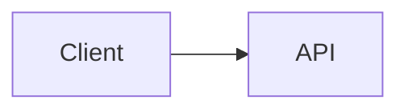

# Markdown Syntax Extension Design

## Context

This document keeps the implementation references for the integrated Markdown
syntax extension PR. It is based on the TUI optimization research from
`origin/docs/tui-optimization-design`, especially:

- `docs/design/tui-optimization/00-overview.md`
- `docs/design/tui-optimization/03-rendering-extensibility.md`
- `docs/design/tui-optimization/04-gemini-cli-research.md`
- `docs/design/tui-optimization/05-claude-code-research.md`
- `docs/design/tui-optimization/06-implementation-rollout-checklist.md`
- `docs/design/tui-optimization/08-execution-plan-and-test-matrix.md`

The referenced research recommends a long-term Markdown architecture built
around an AST parser, block/token caching, stable-prefix streaming, bounded
detail panels, and terminal capability detection. This first implementation
keeps the runtime footprint small and makes the new behavior visible
immediately.

## Integrated PR Scope

This PR treats Markdown syntax expansion as one coherent renderer improvement,
not separate feature PRs.

Included in the first implementation:

- Mermaid code blocks render visually in the TUI.
- Mermaid diagrams render through PNG terminal images when `mmdc` and a
  supported terminal image path are available.
- `flowchart` / `graph` Mermaid diagrams fall back to box-and-arrow previews.
- `sequenceDiagram` Mermaid diagrams fall back to participant-arrow previews.
- Unsupported Mermaid types render a compact visual placeholder instead of a
  raw source block.
- Task list items render checked/unchecked markers.
- Blockquotes render with a visible quote bar.
- Inline `$...$` math and block `$$...$$` math render with common Unicode
  substitutions.
- Existing Markdown tables continue to use `TableRenderer`.
- Existing non-Mermaid fenced code blocks continue to use `CodeColorizer`.

## Mermaid Rendering Strategy

### First version: capability-gated image rendering plus text fallback

The implementation now treats Mermaid's own layout as the preferred path. When
the local environment supports it, the TUI renders Mermaid blocks through this
pipeline:

```text
Mermaid source
  -> mmdc / Mermaid CLI
  -> PNG
  -> Kitty or iTerm2 terminal image protocol
```

If the terminal does not support inline images but `chafa` is installed, the
same PNG is rendered as ANSI block graphics. If neither image protocol nor
`chafa` is available, the renderer falls back to the synchronous terminal text
preview described below.

The image render is not attempted while a response is still streaming. During
streaming, Mermaid blocks show a bounded pending preview. Once the response is
finalized, the image path is attempted only when explicitly enabled. This keeps
slow `mmdc` startup, especially the opt-in `npx` path, out of the default
interactive render path.

PNG generation is cached independently from terminal placement. Repeated
renders of the same Mermaid source, including terminal resize updates, reuse
the generated PNG and only recompute the Kitty/iTerm2 placement dimensions.

The image path is intentionally opt-in and capability-gated instead of always
bundling or invoking Puppeteer/Chromium from the hot CLI path. A user can enable
the image path with `QWEN_CODE_MERMAID_IMAGE_RENDERING=1`, then provide
`@mermaid-js/mermaid-cli` by installing `mmdc` on `PATH` or by setting
`QWEN_CODE_MERMAID_MMD_CLI` to the binary path. For ad-hoc local verification,
`QWEN_CODE_MERMAID_ALLOW_NPX=1` allows the renderer to invoke
`npx -y @mermaid-js/mermaid-cli@11.12.0`; this is intentionally opt-in because
the first run may install Puppeteer/Chromium and block rendering. Repo-local
`node_modules/.bin` renderers are not auto-discovered unless
`QWEN_CODE_MERMAID_ALLOW_LOCAL_RENDERERS=1` is set. Terminal protocol selection
can be forced with `QWEN_CODE_MERMAID_IMAGE_PROTOCOL=kitty|iterm2|off`.

For Kitty-compatible terminals such as Ghostty, the renderer uses Kitty
Unicode placeholders instead of writing the image payload as Ink text. The PNG
is transmitted through raw stdout in quiet mode (`q=2`) with a virtual
placement (`U=1`), and the React tree renders the normal placeholder character
grid (`U+10EEEE`) with explicit row and column diacritics for each cell. This
keeps Ink responsible for layout and resize while preventing APC payload bytes
from being wrapped into visible base64 text.

### Fallback: resizable wireframe preview

The fallback avoids async work because Ink's `<Static>` path is append-only: a
finalized message cannot reliably wait for a background render job and then
update in place without forcing a full static refresh. The fallback must
therefore produce terminal output during the normal React render pass.

For `flowchart` / `graph` diagrams, the fallback builds a lightweight graph
model instead of printing one edge at a time:

- Nodes are normalized by Mermaid id, label, and basic shape.
- Node labels support Mermaid-style `\n` / `<br>` line breaks.
- Top-down diagrams are ranked into horizontal layers.
- Left-to-right diagrams are ranked into vertical columns when they fit.
- Multiple outgoing edges from the same node are drawn as one fork with
  bracketed edge labels such as `[Yes]`, `[No]`, `[是]`, and `[否]`.
- Back edges and cycles are summarized in a `Cycles:` section with explicit
  `↩ to <node>` markers. This avoids unstable long cross-diagram routes in
  terminal fonts while keeping the loop semantics visible.
- The graph is recomputed from `contentWidth`, so resize changes node width,
  spacing, and connector paths.
- Large previews are bounded before graph layout so very large Mermaid blocks
  do not allocate an unbounded terminal canvas during render.

Example:



renders as a terminal visual preview rather than Mermaid source.

The fallback is still not a complete Mermaid engine. It is a fast,
dependency-light wireframe preview for common LLM-generated diagrams when
high-fidelity rendering is not available.

### Future providers

The provider boundary is intentionally open for additional native image
providers:

- `mmdc` / `@mermaid-js/mermaid-cli` for SVG/PNG output.
- `terminal-image` for Kitty/iTerm2 plus ANSI fallback.
- `chafa` when present for Sixel/Kitty/iTerm2/Unicode mosaics.

This path should remain optional, cached, and capability-gated, with cache keys
based on source hash, terminal width, renderer provider, and terminal protocol.
It should not block startup or add bundled Mermaid/Puppeteer work to the hot TUI
path by default.

## AST Renderer Compatibility

The first version extends the existing parser to minimize blast radius. The
feature boundaries are still compatible with a future `marked` token pipeline:

- `code(lang=mermaid)` -> `MermaidDiagram`
- `code(lang=*)` -> existing `CodeColorizer`
- `table` -> existing `TableRenderer`
- `blockquote` -> quote block renderer
- `list(task=true)` -> task list renderer
- `paragraph/text` -> inline renderer with math/link/style support

The implementation does not cache React nodes. A future AST renderer should
cache tokens/blocks, then render from current width/theme/settings props.

## Safety And Performance

- Mermaid source is treated as untrusted input.
- The first renderer does not execute Mermaid JavaScript.
- Native image rendering must be opt-in or capability-gated.
- Future browser-based rendering must use timeouts and size limits.
- Rendering should degrade to terminal text instead of throwing.
- Large blocks should respect available height and width.

## Validation

Targeted unit verification:

```bash
cd packages/cli
npx vitest run src/ui/utils/MarkdownDisplay.test.tsx
npx vitest run src/ui/utils/mermaidImageRenderer.test.ts
```

Broader verification before PR submission:

```bash
npm run typecheck --workspace=packages/cli
npm run lint --workspace=packages/cli
git diff --check
```

Manual scenarios:

- Assistant response with a Mermaid `flowchart LR` block.
- Assistant response with a Mermaid `sequenceDiagram` block.
- Markdown table plus Mermaid in the same answer.
- Fenced JavaScript code block still showing code formatting.
- Narrow terminal width.
- Constrained tool/detail surface.
