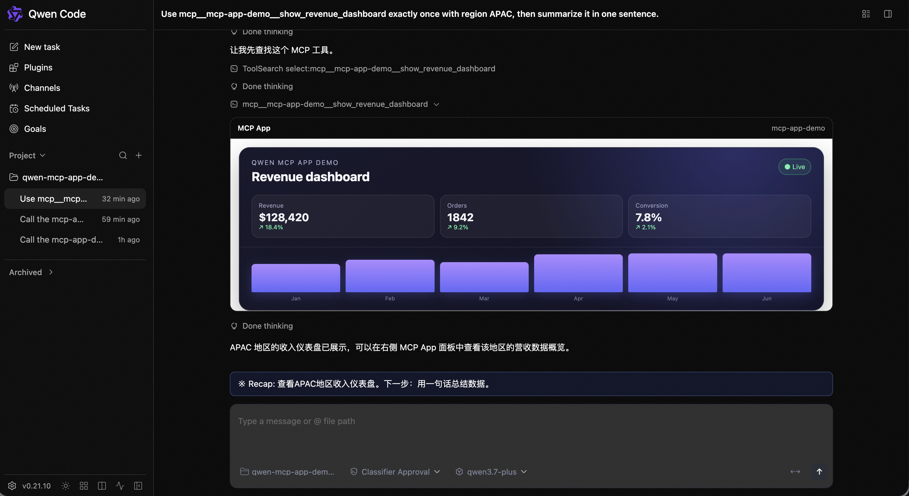

# MCP 2026 core client foundation

## Context

Qwen Code's configured MCP sessions currently use the v1 TypeScript SDK. A
server that only implements the MCP `2026-07-28` stateless protocol cannot
complete the legacy `initialize` handshake, while unconditionally switching to
the modern protocol would break existing servers.

The official TypeScript SDK v2 already owns the wire-level compatibility
logic: `server/discover` negotiation, legacy fallback, per-request metadata and
HTTP headers, pagination, and cache-hint handling. Qwen Code should configure
that behavior rather than duplicate it.

## Scope

This slice of #8968 migrates configured MCP sessions to the v2 client, opts them
into automatic protocol negotiation, and adds the first MCP Apps host for
daemon-backed WebShell sessions. Tool, prompt, resource-list, and resource-read
operations use the v2 cache-aware helpers when the negotiated protocol is
modern.

The following remain separate follow-ups:

- interactive MRTR elicitation and approval across TUI, WebShell, headless, and
  ACP;
- MCP App initiated tool calls, links, downloads, messages, model-context
  updates, and fullscreen display;
- migration of Qwen Code's internal IDE, Computer Use, and embedded MCP server
  integrations, which are not configured external MCP sessions.

## Design

Each configured MCP client uses SDK v2 with `versionNegotiation.mode = 'auto'`.
The SDK sends `server/discover` first. Definitive modern evidence selects the
stateless `2026-07-28` protocol; legacy evidence falls back to the unchanged
`initialize` flow.

Modern sessions use the typed v2 list/read methods so the SDK can aggregate
pagination and honor `ttlMs` and `cacheScope`. Legacy sessions keep Qwen Code's
raw request path for prompts and resources because it intentionally tolerates
older servers that expose methods without declaring the matching capability.

Tool discovery uses the single cache-aware `tools/list` result for both schema
registration and annotations. Tool execution continues through the raw client
so progress, cancellation, timeout, permission checks, and output handling stay
inside the existing Qwen Code path.

Configured clients advertise the `io.modelcontextprotocol/ui` extension and
the `text/html;profile=mcp-app` resource type. When a server also advertises
that extension, tool discovery preserves its `ui://` resource URI. After a
successful call, Qwen Code reads and validates the matching HTML resource and
stores it in a structured display result while leaving the model-visible result
unchanged. A missing, oversized, malformed, or unreadable resource falls back
to the normal text result.

The daemon serves a static sandbox proxy before bearer authentication. It
contains no session data or credentials. WebShell loads that proxy from a
different loopback origin, then uses the official AppBridge and postMessage
transport to deliver the validated HTML, tool input, and tool result to an
inner sandboxed iframe. The proxy validates parent and child origins, applies
resource CSP as an HTTP response header, and relays only JSON-RPC messages
between the two frames. The inner App iframe deliberately omits
`allow-same-origin`, giving untrusted HTML an opaque origin that cannot call the
daemon's loopback API as a same-origin client. The first host slice does not
advertise privileged App capabilities.

## Compatibility and safety

- No configured server is pinned to the modern protocol.
- Legacy fallback remains the SDK's byte-compatible v1 sequence.
- Authorization and Qwen Code's MCP permission boundary are unchanged.
- The modern cache is private per client instance; no result is shared across
  workspaces or authorization principals.
- MCP App HTML is limited to 1 MiB and never enters model context.
- App HTML runs in a double-iframe sandbox on a different loopback origin with
  server-declared CSP enforced by the daemon response.
- If the isolation origin is unavailable, WebShell displays the ordinary tool
  text rather than rendering the App.

## Verification

- A modern-only control transport must connect through `server/discover`, list
  and call a tool without `initialize`, and carry the modern request metadata.
- A real Streamable HTTP transport must send the negotiated protocol and method
  headers, plus the tool name header on `tools/call`.
- A legacy control transport must fall back to `initialize` and retain existing
  discovery and call behavior.
- A cache-hinted modern list result must be reused without a second wire
  request.
- A mock stdio MCP server must advertise the Apps extension, return a `ui://`
  dashboard resource, and render that dashboard inside an actual daemon-backed
  WebShell transcript. The PR description includes the external test fixture
  used for this verification without shipping it in the product repository.
- Invalid App resource MIME types and unavailable resources must retain the
  ordinary text result.
- The sandbox route must reject CSP directive injection and remain a static,
  no-store pre-auth resource.
- Existing MCP client, transport-pool, tool, OAuth, and resource tests must
  continue to pass, followed by the repository build and typecheck.

## Demo

The external stdio demo used for verification advertises one
`show_revenue_dashboard` tool and its `ui://revenue-dashboard` resource. The
screenshot below was captured from a real daemon-backed WebShell session after
the model called that tool with the APAC region. Its reference implementation
and daemon configuration are included in the PR description.

