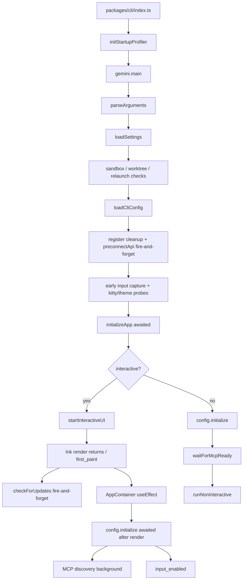
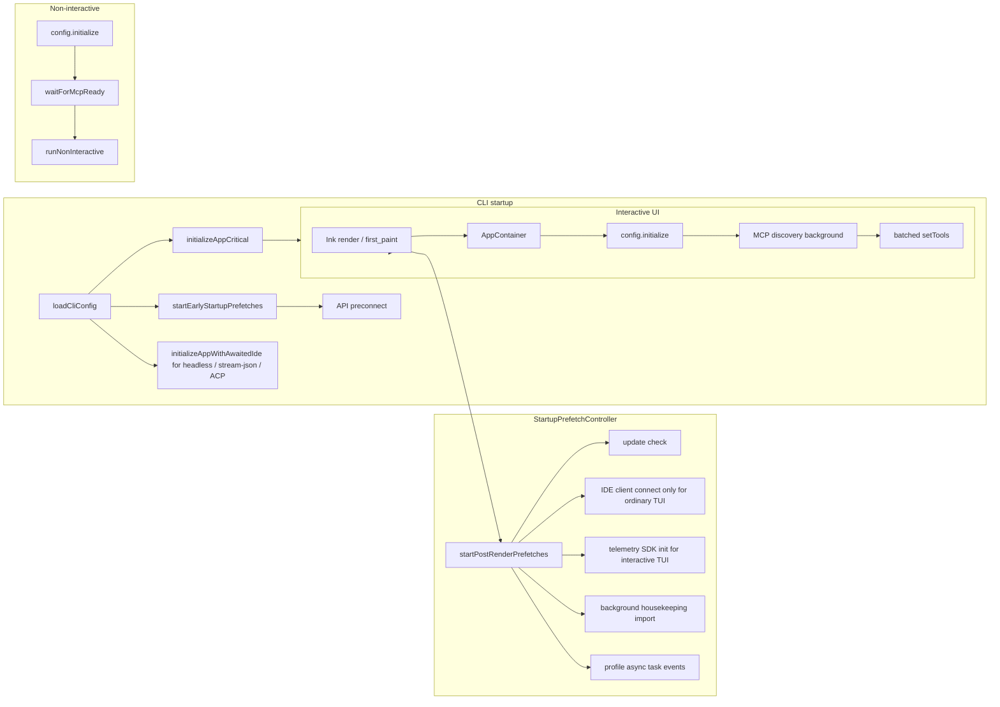
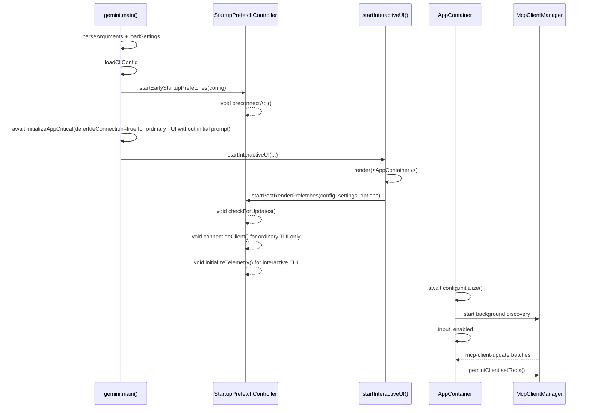

# Fire-and-Forget Startup Prefetch Optimization Design

## Background and Goals

The parent issue #3011 breaks down qwen-code startup optimization into multiple subtasks. The current repository has already landed several foundational capabilities:

- #3219: Startup performance profiler is integrated, supporting `QWEN_CODE_PROFILE_STARTUP=1` to output startup phase JSON.
- #3221: Tool registration has been converted to lazy factory; `Config.initialize()` no longer statically instantiates all tools.
- #3223: API preconnect already exists, currently triggered in a fire-and-forget fashion after `loadCliConfig()`.
- Early input capture, progressive MCP discovery, and `config.initialize()` after AppContainer render are also partially implemented.

The goal of #3222 is not to redo these capabilities, but to consolidate the non-critical startup operations still scattered across the startup path into a unified fire-and-forget prefetch layer: before first paint, only await operations that truly affect correctness; after first paint, launch background tasks that do not affect the correctness of the first interaction, while preserving compatible semantics for non-interactive modes.

## Current Startup Flow

The key flow of the current interactive startup path is as follows:



Current state assessment:

- `initializeApp()` still executes i18n, auth, theme validation, and IDE client connection serially before first paint.
- Auth and i18n must remain before first paint; IDE connection is not a hard dependency for the first paint of a plain TUI without an initial prompt, and can be deferred on the plain TUI path. However, for paths like `qwen -i "prompt"`, `qwen -p`, stream-json, and ACP/Zed — which have no safe post-render window or whose first request needs IDE context/status — IDE connection must continue to be awaited before the first request.
- `checkForUpdates()` is already fire-and-forget after render in `startInteractiveUI()`, but the logic is scattered within the UI startup function.
- `preconnectApi()` is already fire-and-forget and should be kept triggering as early as possible, but brought under unified scheduling.
- Telemetry SDK init previously occurred synchronously during `Config` construction; for plain interactive TUI it can be deferred to after render, while non-interactive paths retain the pre-first-request initialization semantics.
- On the interactive path, `config.initialize()` already executes after React mount; MCP discovery already runs in the background inside core, with AppContainer batch-refreshing the tool list.
- The non-interactive path still needs to await `config.waitForMcpReady()`, otherwise the first prompt might not see MCP tools, causing scripted behavior to regress.

## Target Architecture

Introduce a small startup prefetch scheduling layer that uniformly manages "start but don't await" tasks, split into two categories by trigger timing: early and post-render.



The interactive startup sequence under the new design:



## Design Changes

### 1. New Unified Startup Prefetch Scheduler

Add `packages/cli/src/startup/startup-prefetch.ts`, providing two entry points:

```ts
startEarlyStartupPrefetches(config: Config): void;
startPostRenderPrefetches(
  config: Config,
  settings: LoadedSettings,
  options?: { connectIde?: boolean; initializeTelemetry?: boolean },
): void;
```

The scheduler does exactly three things:

- Launches prefetch tasks by name.
- Uses `void task().catch(...)` to explicitly not await and not throw.
- Records debug logs and profiler async events to verify whether tasks are launched before or after render.

The scheduler must guarantee idempotency per phase, preventing React StrictMode, repeated test calls, or anomalous re-entries from launching the same task multiple times.

### 2. Early Prefetch: Maximize Head Start

`startEarlyStartupPrefetches(config)` is called immediately after `loadCliConfig()` succeeds.

The first phase includes only API preconnect:

- Reads the current auth type and resolved base URL from `config.getModelsConfig()`.
- Reads proxy from `config.getProxy()`.
- Calls the existing `preconnectApi(authType, { resolvedBaseUrl, proxy })`.
- Preserves existing environment gates: `QWEN_CODE_DISABLE_PRECONNECT`, sandbox, custom CA, non-Node runtime, no proxy, etc.

This adds no new configuration options. Preconnect failures only write debug logs and do not affect startup.

### 3. Post-Render Prefetch: Launch After First Paint

`startPostRenderPrefetches(config, settings)` is called in `startInteractiveUI()` after Ink `render()` returns and `first_paint` is recorded.

First batch includes:

- Update check: migrate the existing `checkForUpdates().then(handleAutoUpdate)` logic, preserving the `settings.merged.general?.enableAutoUpdate !== false` gate.
- IDE client connection: moved to post-render prefetch only on the plain interactive TUI path without an initial prompt. Callers must explicitly pass `connectIde: true`, and the scheduler internally still checks `config.getIdeMode()`. `qwen -i "prompt"`, non-interactive, stream-json, and ACP/Zed do not defer IDE connection through this entry point.
- Telemetry SDK init: moved to post-render prefetch only on the interactive TUI path. `Config` still retains telemetry settings, but skips the construction-time SDK side effect via `deferTelemetryInitialization`; post-render prefetch launches the SDK via `initializeTelemetry(config)`. Non-interactive, stream-json, and ACP/Zed do not defer.
- Background housekeeping: can be migrated from `gemini.tsx` to post-render prefetch, giving all background startup tasks a unified entry point; still limited to interactive, still uses dynamic import and error swallowing.

None of these tasks may affect the return value of `startInteractiveUI()`, nor may they write user-visible errors to the TUI stderr. Failures only go to debug logs.

### 4. Split `initializeApp()` Critical Path, Preserve Non-TUI Awaited IDE Connection

Add a shared helper to avoid duplicating IDE connection logic between the TUI deferred path and the non-TUI awaited path:

```ts
export async function connectIdeForStartup(config: Config): Promise<void> {
  if (!config.getIdeMode()) return;

  const ideClient = await IdeClient.getInstance();
  await ideClient.connect();
  logIdeConnection(config, new IdeConnectionEvent(IdeConnectionType.START));
}
```

`initializeApp()` remains as pre-first-paint critical initialization, but gains an explicit option:

```ts
interface InitializeAppOptions {
  deferIdeConnection?: boolean;
}
```

The default must remain backward-compatible: `deferIdeConnection` defaults to `false`. That is, when no option is passed, IDE connection is still awaited within `initializeApp()`.

The awaited content of `initializeApp()` becomes:

- `initializeI18n(...)`
- `performInitialAuth(...)`
- `validateTheme(settings)`
- When `deferIdeConnection !== true`, `await connectIdeForStartup(config)`
- Compute `shouldOpenAuthDialog`
- Read `config.getGeminiMdFileCount()`

The call site in `gemini.tsx` is responsible for selecting based on the run mode:

```ts
const deferIdeConnection =
  config.isInteractive() && !config.getExperimentalZedIntegration() && !input;

const initializationResult = await initializeApp(config, settings, {
  deferIdeConnection,
});
```

Subsequently, only when `deferIdeConnection === true`, `startInteractiveUI()` fires-and-forgets the IDE connection via `startPostRenderPrefetches(..., { connectIde: true })`; prompt-interactive, which auto-submits the first question, continues to await IDE before render and passes `connectIde: false` to avoid post-render duplicate connection.

This split addresses the compatibility risk flagged in review:

- Plain interactive TUI: IDE socket/IPC connection no longer blocks first paint.
- `qwen -i "prompt"`: continues to await IDE connection before the first auto-submitted request, and post-render does not reconnect.
- `qwen -p` / piped stdin: continues to await IDE connection before the first model request.
- stream-json: continues to complete IDE connection before session/control request handling.
- ACP/Zed: continues to retain awaited IDE startup, avoiding missing IDE context/status on the first request.

### 5. MCP and Non-Interactive Semantics Remain Unchanged

This design does not change the core MCP state machine.

Interactive:

- Continues to call `config.initialize()` in the mount effect of `AppContainer`.
- `Config.initialize()` continues to launch background MCP discovery.
- AppContainer continues to listen for `mcp-client-update` and batch-call `geminiClient.setTools()` at ~16ms intervals.
- First paint and input availability do not wait for MCP to fully settle.

Non-interactive / stream-json / ACP:

- Continues to await IDE connection before the first model request.
- Continues to await `config.waitForMcpReady()` before the first model request.
- Preserves the tool visibility semantics of the old synchronous path.
- Preserves the existing behavior of stderr warnings on MCP failure.

## Estimated Performance Gains

Gains fall into two categories.

The first is shortened critical path before first paint:

- IDE client connection for plain interactive TUI no longer blocks first paint; gains depend on IDE socket/IPC connection time, expected to be tens to hundreds of milliseconds.
- Telemetry SDK init for plain interactive TUI no longer blocks first paint; gains depend on OTel SDK/exporter construction cost, typically a small to moderate synchronous startup overhead.
- Update check, housekeeping, preconnect, and similar tasks have a unified fire-and-forget entry point, preventing future maintenance from accidentally placing them back on the awaited path.

The second is first API request gains:

- Continues to preserve the #3223 API preconnect design.
- When proxy/shared dispatcher is reusable, the first API request can avoid TCP+TLS handshake costs, expected 100-200ms.

Note: #3219's historical baseline showed module loading once accounted for ~94% of total startup time; #3221's lazy tool registration has already addressed the largest bottleneck. The core benefit of #3222 is more about perceived TTI and first-paint responsiveness, rather than eliminating all module loading costs.

## Risks and Scope of Impact

### Risks

- IDE capabilities on plain TUI may shift from "connected before first paint" to "connected very shortly after first paint". Mitigation: only defer on the plain interactive TUI path; non-interactive, stream-json, and ACP/Zed maintain awaited connection before the first request.
- Pre-render telemetry events may be no-op dropped when the SDK is not yet initialized. Mitigation: only defer for interactive TUI; non-interactive pre-first-request telemetry retains its original semantics, no new buffering queue added.
- Deferred task failures may not be prominent. Mitigation: unified wrapper records debug logs and profiler async events.
- Migrating update/preconnect may inadvertently change existing gates. Mitigation: verbatim preservation of existing settings/env conditions.
- Over-deferring may leave capabilities unready when the first user input depends on them. Mitigation: auth, config construction, permissions, hooks, memory, tool registry, and non-interactive MCP ready all remain awaited.

### Scope of Impact

Expected to only involve the CLI startup layer:

- `packages/cli/src/startup/startup-prefetch.ts`
- `packages/cli/src/core/initializer.ts`
- `packages/cli/src/gemini.tsx`
- `packages/cli/src/ui/startInteractiveUI.tsx`
- Corresponding unit tests

No changes to:

- CLI arguments and configuration schema
- Core tool registry protocol
- MCP discovery state machine
- Model request protocol
- User-visible command behavior

## Unit Test Plan

### `packages/cli/src/startup/startup-prefetch.test.ts`

Coverage:

- `startEarlyStartupPrefetches()` calls `preconnectApi()` with auth type, resolved base URL, and proxy.
- Early prefetch does not await task completion.
- Repeated calls are idempotent, not launching the same early task again.
- `startPostRenderPrefetches()` launches update check when `enableAutoUpdate !== false`.
- Does not launch update check when `enableAutoUpdate === false`.
- Launches IDE connect and calls `logIdeConnection()` when `options.connectIde === true` and `config.getIdeMode() === true`.
- Does not trigger IDE connect when `options.connectIde !== true`.
- Does not trigger IDE connect when `config.getIdeMode() === false` even if `options.connectIde === true`.
- Launches telemetry SDK init when `options.initializeTelemetry === true`.
- Does not trigger telemetry SDK init when `options.initializeTelemetry !== true`.
- Deferred task rejections do not cause the public API to throw, only write debug logs.

### `packages/cli/src/core/initializer.test.ts`

Adjustments and additions:

- `initializeApp()` by default awaits `connectIdeForStartup()`, preserving non-TUI path compatibility.
- `initializeApp(..., { deferIdeConnection: true })` does not call `IdeClient.getInstance()` or `connect()`.
- `initializeApp(..., { deferIdeConnection: false })` calls and awaits IDE connect when `config.getIdeMode() === true`.
- Still awaits `initializeI18n()`.
- Still awaits `performInitialAuth()`.
- On auth failure, retains `authError` and `shouldOpenAuthDialog === true`.
- On theme validation failure, retains `themeError`.
- When auth type is explicitly provided and auth succeeds, `shouldOpenAuthDialog === false`.

### `packages/cli/src/ui/startInteractiveUI.test.tsx`

Coverage:

- After Ink `render()` returns and `first_paint` is recorded, calls `startPostRenderPrefetches(config, settings)`.
- Plain TUI path passes `{ connectIde: true, initializeTelemetry: true }`.
- When prompt-interactive has already awaited IDE before render, passes `{ connectIde: false, initializeTelemetry: true }` to avoid duplicate IDE connect.
- Non-TUI paths do not trigger IDE/telemetry post-render prefetch through `startInteractiveUI()`.
- Post-render prefetch rejections do not cause `startInteractiveUI()` to reject.
- After update check is moved out of `startInteractiveUI()` inline logic, it is no longer directly called.

### `packages/cli/src/gemini.test.tsx`

Adjustments and additions:

- Plain interactive TUI calls `initializeApp(config, settings, { deferIdeConnection: true })`, and connects IDE in post-render prefetch.
- Prompt-interactive calls `initializeApp(config, settings, { deferIdeConnection: false })`, and post-render prefetch does not reconnect IDE.
- `qwen -p` / piped stdin / stream-json calls `initializeApp(config, settings, { deferIdeConnection: false })` or uses defaults, ensuring IDE is connected before the first request.
- ACP/Zed path does not enable IDE deferred prefetch, continues through awaited IDE startup.

### `packages/core/src/config/config.test.ts`

Coverage:

- When telemetry is enabled and `deferTelemetryInitialization` is not passed, `Config` construction still calls `initializeTelemetry(config)`.
- When telemetry is enabled and `deferTelemetryInitialization === true`, `Config` construction does not call `initializeTelemetry(config)`, but `config.getTelemetryEnabled()` still returns true.

### Regression Tests

Recommended execution:

```bash
cd packages/cli && npx vitest run src/core/initializer.test.ts src/startup/startup-prefetch.test.ts
cd packages/cli && npx vitest run src/gemini.test.tsx
cd packages/core && npx vitest run src/config/config.test.ts -t "telemetry"
```

## Acceptance Criteria

- Interactive REPL first paint does not wait for IDE connection, telemetry init, update check, or housekeeping.
- Non-interactive, stream-json, and ACP/Zed still await IDE connection before the first request.
- Non-interactive, stream-json, and ACP/Zed do not defer telemetry SDK init.
- API preconnect still fires-and-forgets as early as possible after `loadCliConfig()`.
- Auth, config, permissions, hooks, memory, and other correctness-critical initializations remain awaited where needed.
- Non-interactive first prompt still waits for MCP ready.
- All deferred task failures do not affect REPL rendering.
- Profiler shows deferred tasks launching as expected around first_paint.
- Unit tests cover critical paths, idempotency, error swallowing, and non-interactive compatibility constraints.

## Default Assumptions

- #3221 is actually an issue on GitHub, not a PR; the current repository already contains the lazy tool registry implementation.
- This design adds no new configuration options, avoiding turning startup optimization into user-configurable complexity.
- "REPL renders before deferred operations complete" means Ink first-paint return and input availability, not requiring all background capabilities to finish before the user sees the UI.
- Non-interactive mode prioritizes compatibility, not pursuing first-paint optimization as aggressively as interactive mode.
