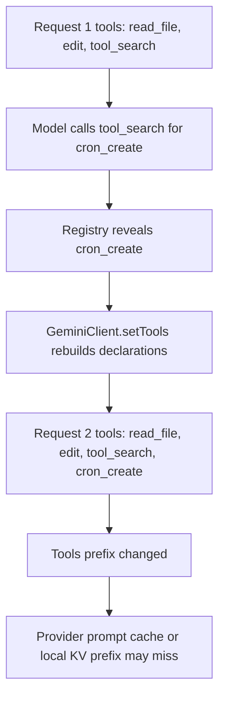

# Stable Schema Design for Deferred Tool Calls

## Problem

Prompt cache reuse depends on a stable request prefix. In Qwen Code, that
prefix starts with the API `tools` / `functionDeclarations` block, followed by
the system instruction and conversation history. Any early change can make the
following content ineligible for cache reuse.

Today, deferred tools in the main session are discovered through `tool_search`:

1. `tool_search` resolves the real tool and returns its schema.
2. `ToolRegistry.revealDeferredTool(name)` marks it as revealed.
3. `GeminiClient.setTools()` rebuilds declarations.
4. The real tool schema is added to the next API request.

The model can then call the tool, but the request prefix has changed.



Sorting declarations only solves unstable ordering within the same tool set. It
cannot make two different tool sets byte-identical. This proposal addresses the
tool-set mutation caused by deferred-tool reveal in the main session.

## Goals

- Keep main-session `functionDeclarations` bytes stable when `tool_search`
  presents a hidden deferred tool.
- Preserve discovery: the model still has to receive the target tool's real
  schema before it can call that tool.
- Preserve existing execution boundaries: target validation, permissions,
  confirmation, hooks, telemetry, streaming, truncation, cancellation, and result
  recording still go through `CoreToolScheduler`.
- Preserve subagent and teammate tool restrictions.
- Preserve plan mode, the startup path when `tool_search` is disabled,
  compression, and session resume behavior.
- Limit implementation to the registry, main-session tool surface, scheduler
  normalization, and lifecycle integration points.

## Benefit

After implementation, discovering a deferred tool no longer changes the main
session's API tools block. Providers can keep reusing the stable prefix that
contains `tools/functionDeclarations`, the system instruction, and early
history. Local model services that support prefix/KV reuse also avoid
re-prefilling an unchanged prefix merely because a deferred tool was discovered.

A flow closer to the real path:

```text
User request:
  "Run npm run report every morning at 9 and write the result into
   the daily report file."

Current behavior:
  Request 1
    tools/functionDeclarations:
      [read_file, edit, tool_search]
    history:
      user: Run npm run report every morning at 9 and write the result into
            the daily report file.

  The model discovers that it needs a scheduling tool:
    functionCall: tool_search({ query: "cron create scheduled task" })

  tool_search returns cron_create's schema and reveals this deferred tool.
  Qwen Code then calls setTools(), adding cron_create to the API tools.

  Request 2
    tools/functionDeclarations:
      [read_file, edit, tool_search, cron_create]
    history:
      user: Run npm run report every morning at 9 and write the result into
            the daily report file.
      model: tool_search(...)
      tool: cron_create schema

  Result:
    Request 2's tools prefix has cron_create in addition to Request 1.
    The change happens at the very front of the request, so the prompt-cache
    prefix built over tools + system + early history may not be reusable.

New design:
  Request 1
    tools/functionDeclarations:
      [read_file, edit, tool_search, deferred_tool_call, exit_plan_mode]
    history:
      user: Run npm run report every morning at 9 and write the result into
            the daily report file.

  The model still searches for the real tool first:
    functionCall: tool_search({ query: "cron create scheduled task" })

  tool_search returns cron_create's real schema and tells the model in the
  result to later call:
    deferred_tool_call({
      name: "cron_create",
      arguments: { ...params matching the cron_create schema... }
    })

  Qwen Code only records that cron_create's schema has been shown to the model.
  It does not call setTools(), and it does not add cron_create to API tools.

  Request 2
    tools/functionDeclarations:
      [read_file, edit, tool_search, deferred_tool_call, exit_plan_mode]
    history:
      user: Run npm run report every morning at 9 and write the result into
            the daily report file.
      model: tool_search(...)
      tool: cron_create schema plus instructions to use deferred_tool_call

  The model calls:
    functionCall: deferred_tool_call({
      name: "cron_create",
      arguments: {
        schedule: "0 9 * * *",
        command: "npm run report",
        description: "Generate the daily report file"
      }
    })

  After scheduler normalization, Qwen Code internally executes:
    cron_create({
      schedule: "0 9 * * *",
      command: "npm run report",
      description: "Generate the daily report file"
    })

  Result:
    Request 1 and Request 2 have exactly the same tools/functionDeclarations.
    The new cron_create schema appears only in the history tool-result suffix.
    It does not change the tools prefix at the very front of the request, so
    prompt cache is more likely to hit.
```

This benefit does not rely on bypassing permissions or weakening validation:
real execution still enters the existing `CoreToolScheduler`, where the target
tool's own permissions, parameter validation, hooks, telemetry, and result
recording apply.

## Design Invariants

The implementation must preserve all of the following invariants:

1. A proxy call must not grant permission to a target tool that the current
   execution context cannot call directly.
2. The model must not call a target through the proxy before that target's
   current schema has appeared in the active model context.
3. Permissions, hooks, UI, telemetry, validation, and execution use the real
   target name and target arguments.
4. Provider responses use the provider-visible call name and original call ID.
5. Normalization and execution use the same resolved target instance; a
   same-name replacement must never be substituted after authorization.
6. Tool removal, MCP reconnect, or schema changes invalidate prior proxy
   eligibility.
7. Compression and resume must not preserve only proxy eligibility without also
   restoring the corresponding current schema into model-visible context.
8. `includeDeferred`, `visibleTools`, `alwaysLoad`, resume-time direct
   compatibility exposure, and proxy eligibility remain independent from one
   another.

## Scope by Execution Context

| Context                                                          | Deferred tool exposure                                                             | `deferred_tool_call`                                                                      |
| ---------------------------------------------------------------- | ---------------------------------------------------------------------------------- | ----------------------------------------------------------------------------------------- |
| Main session with `tool_search` enabled                          | Schema is exposed through `tool_search`; execution goes through the proxy          | Included                                                                                  |
| Main session without `tool_search` enabled                       | All deferred declarations are exposed directly at startup                          | Omitted                                                                                   |
| Subagent or teammate                                             | Keep existing effective direct declarations after exclusions and `disallowedTools` | Omitted                                                                                   |
| Resume of an old-format session containing direct deferred calls | Real tool names used before are exposed directly in the resumed session            | Omitted for those calls; newly searched tools in the main session can still use the proxy |

Keeping the proxy out of subagent registries is a safety requirement, not an
optimization. Subagent authorization currently filters provider-visible tool
names before scheduling. If a shared proxy name were available, the real target
would be hidden and could bypass `EXCLUDED_TOOLS_FOR_SUBAGENTS` and
`disallowedTools` checks.

## Target Architecture

The proxy is only a stable provider declaration. It is not an executor. The
normalization boundary converts the provider call into a real scheduled call
before target permission checks.

```mermaid
flowchart LR
  subgraph ProviderBoundary["Provider boundary"]
    A["functionCall name: deferred_tool_call"]
    B["args: target name and target arguments"]
  end

  subgraph Normalization["Main-session call normalization"]
    C["Validate proxy envelope"]
    D["Resolve and retain current target instance"]
    E["Verify the retained instance and schema were presented"]
    F["Verify target is proxy-eligible"]
  end

  subgraph Scheduler["Existing CoreToolScheduler pipeline"]
    G["Target permission policy"]
    H["Target build and schema validation"]
    I["Confirmation and hooks"]
    J["Target execution and streaming"]
    K["Truncation, telemetry, recording"]
  end

  subgraph ResponseBoundary["Provider response boundary"]
    L["functionResponse name: deferred_tool_call"]
    M["Original provider call ID"]
  end

  A --> C
  B --> C
  C --> D --> E --> F --> G --> H --> I --> J --> K --> L --> M
```



The normalized `ToolCallRequestInfo` carries both identities. Normal tool calls
do not have `providerName`, so existing behavior is unchanged. A proxy call
looks like:

```text
providerName = deferred_tool_call
name         = cron_create
args         = {...}
```

All model-facing response builders use `providerName ?? name`. All internal
consumers use `name` and `args`.

A successful proxy normalization also carries the resolved target instance.
Before returning it, the helper verifies that `ToolRegistry` still maps the
canonical name to that same instance. `CoreToolScheduler` and ACP
`Session.runTool()` then build and execute this retained instance instead of
resolving the name again. This binds presentation authorization, validation,
and execution to one tool object and closes the same-name replacement TOCTOU
window. Ordinary calls carry no resolved instance and keep their existing
lookup path.

Normalization is shared core routing semantics, not private
`CoreToolScheduler` behavior. Both the main scheduler and ACP/daemon
`Session.runTool()` must call the same pure helper before tool lookup,
permission checks, hooks, telemetry, and execution.
This keeps the ACP execution path from executing the `deferred_tool_call`
wrapper fallback or bypassing the presentation gate. All provider/model-facing
function responses still use `providerName ?? name`, so hidden target names are
not written back to the provider.

## Stable Provider Tool

The main session adds an always-visible declaration:

```json
{
  "name": "deferred_tool_call",
  "description": "Calls a deferred tool after its current schema has been fetched with tool_search.",
  "parametersJsonSchema": {
    "type": "object",
    "properties": {
      "name": {
        "type": "string",
        "description": "Exact deferred tool name returned by tool_search."
      },
      "arguments": {
        "type": "object",
        "description": "Arguments matching the target schema returned by tool_search."
      }
    },
    "required": ["name", "arguments"],
    "additionalProperties": false
  }
}
```

`deferred_tool_call` is a reserved core name. Tool registration must reject any
MCP, command-discovered, extension, or plugin tool that tries to use this name.

If the proxy tool's `execute()` method is ever called, it must fail closed. It
must never call another tool itself. Every supported execution entrypoint must
intercept it during scheduler normalization.

When using `createToolRegistry({ forSubAgent: true })`, this proxy is not
registered. That prevents the agent runtime from accidentally authorizing by
the provider-visible proxy name.

## Registry State Model

The existing meaning of `revealedDeferred` is overloaded. Replace it with two
separate concepts.

### Proxy schema presentation

Maintain a map such as:

```ts
proxySchemaPresentations: Map<string, string>;
```

The key is the canonical target name. The value is the deterministic fingerprint
of the exact schema already shown to the model. Before this committed map is
updated, `tool_search` carries the displayed schema identity through the result
lifecycle as pending metadata:

```ts
interface DeferredToolPresentation {
  name: string;
  schemaFingerprint: string;
}
```

The fingerprint must be computed from the same captured `FunctionDeclaration`
that is rendered into the model-facing schema block. Committing a presentation
is a compare-and-set operation: resolve the current tool by `name`, verify that
it is still proxy-eligible, and commit only when its current schema fingerprint
equals `schemaFingerprint`. Never recompute authorization from the name alone.
If MCP refresh replaces schema A with schema B after rendering but before
commit, the pending presentation for A is rejected and the model must run
`tool_search` again for B.

A target is proxy-eligible only when all of these conditions hold:

- It currently exists.
- It is deferred.
- It is not `alwaysLoad` and not in `visibleTools`.
- Its current schema fingerprint matches the recorded fingerprint.
- The current execution context is the main session.

Deletion, MCP disconnect/reconnect, tool replacement, or schema fingerprint
changes invalidate the corresponding committed presentation entry. The
commit-time comparison additionally closes the render-to-commit replacement
window, including delayed ACP delivery.

### Direct declaration visibility

Direct declaration visibility remains an independent decision:

```text
include in declarations when:
  includeDeferred
  OR not shouldDefer
  OR alwaysLoad
  OR visibleTools contains the name
  OR revealDeferredTool(name) marked it revealed for this session
```

`proxySchemaPresentations` must never affect
`ToolRegistry.getFunctionDeclarations()`. Therefore, `tool_search` does not
change the API tools block.

For old direct-call history, resume uses the existing
`ToolRegistry.revealDeferredTool(name)` compatibility path before the first
request of the resumed chat. This keeps real deferred tool names that already
appear in history callable by direct declaration for that resumed session.
Normal `tool_search` calls do not use this direct compatibility path; they
return model-visible schemas for `deferred_tool_call` instead.

## Tool Search Flow

In the main session, `tool_search` continues to resolve lazy factories and
render real target schemas, but no longer calls `GeminiClient.setTools()`.

```mermaid
sequenceDiagram
  participant M as Model
  participant TS as tool_search
  participant R as ToolRegistry
  participant S as CoreToolScheduler
  participant H as Active chat history
  participant T as Real deferred tool
  participant P as Provider

  M->>TS: select:cron_create
  TS->>R: ensureTool(cron_create)
  R-->>TS: current tool and schema
  TS-->>S: escaped schema plus pending fingerprint metadata
  S->>H: append successful tool result
  H->>R: commit presented schema fingerprint
  H-->>M: next request contains the schema result
  Note over R,P: No setTools call. API declarations remain byte-stable
  M->>S: deferred_tool_call(name=cron_create, arguments=...)
  S->>R: resolve and retain current tool; verify current fingerprint
  S->>S: normalize to cron_create with the verified tool instance
  S->>S: permission, validation, confirmation, hooks
  S->>T: execute real invocation
  T-->>S: real tool result
  S-->>P: functionResponse name=deferred_tool_call, original call ID
```

Detailed behavior:

- Keep `ensureTool()`.
- Exact `select:` can re-render an already presented schema.
- Keyword search may omit already presented schemas to save tokens.
- Use the existing wrapper escaping when rendering schemas, so untrusted
  descriptions cannot break out of the model-facing envelope.
- Return `{ name, schemaFingerprint }` as internal pending metadata on the
  successful tool result. Compute the fingerprint from the same captured schema
  object used to render the response. Do not modify committed presentation
  state inside `tool_search.execute()`.
- Commit presentation state only after the successful result containing the
  schema has been appended to active chat history. Cancellation, result delivery
  failure, or history rollback must discard the pending metadata. At commit,
  reject the metadata if the current schema fingerprint no longer matches the
  displayed fingerprint.
- ACP/daemon stages `deferredToolPresentations` on the exact user message that
  carries the successful `tool_search` function response. It commits them only
  after that message enters active model history. Tool execution failure,
  cancellation, PostToolUse stop, delivery failure, or history rollback must
  not unlock the proxy.
- Remove `setTools()` and its reveal/API-sync rollback. If result construction
  or history commit fails, do not record the fingerprint.
- Explicitly tell the model to use `deferred_tool_call` on a later turn.

The same response cannot both present and invoke a new target. The scheduler
checks presentation state before executing the batch, so if the first
`tool_search` for a target is parallel with a proxy call for that target, the
proxy call is rejected.

## Scheduler Normalization and Authorization

Before the existing target permission flow:

1. Detect provider calls named `deferred_tool_call`.
2. Reject unless the runtime is a top-level main session.
3. Validate the envelope:
   - `name` is a non-empty string;
   - `arguments` is a non-null, non-array plain object.
4. Canonicalize the target name and reject self-target recursion, where the
   proxy envelope names
   `deferred_tool_call` itself as the target tool. This check does not reject
   multiple proxy calls to different real deferred tools in the same session.
5. Resolve the current target from `ToolRegistry`, retain that exact tool
   instance, and reject load failures or missing targets.
6. Verify that the registry still maps the canonical name to the retained
   instance.
7. Reject normally visible or `alwaysLoad` targets and tell the model to call
   them by their real names.
8. Compare the retained instance's current schema fingerprint with the
   presentation record.
9. Construct a normalized request using the real target `name` and `args`, while
   preserving `providerName`, call ID, provider call ID, prompt ID, response
   ID, and truncation state; return the retained target instance with it.
10. Run the unchanged target permission, build, confirmation, hook, scheduling,
    execution, timeout, streaming, truncation, and recording pipeline using the
    retained instance, without resolving the target name again.

Therefore, the first permission decision after normalization targets the real
tool, not the proxy. Unknown and unrevealed target errors are returned under the
provider-facing proxy name, preserving a valid provider call/result pair.

Self-target recursion should be handled as a normal tool-call error, not a
crash and not an attempt to keep executing. The response still uses the
provider-facing proxy name and original call ID, and tells the model to fetch
the intended real deferred tool schema with `tool_search`, then call
`deferred_tool_call` with that real target name. Allowing the proxy to target
itself has no valid execution semantics: the proxy is only a provider-facing
transport wrapper, not a business tool. Normalizing it to itself would make the
execution identity ambiguous.

## Response and Observability Rules

Use the real target identity in these places:

- permission rules and policy classifiers;
- parameter validation and retry counters;
- confirmation text;
- PreToolUse, PostToolUse, and PostToolUseFailure hooks;
- UI tool name, arguments, output, and duration;
- per-tool truncation limits;
- execution spans and tool statistics.

Use the provider identity in these places:

- `functionResponse.name`;
- provider tool-call pairing;
- reconstructed API history.

Record both identities for proxied calls:

```text
tool.name = cron_create
tool.provider_name = deferred_tool_call
```

All success, validation-error, permission-denial, hook-denial, cancellation,
timeout, and unhandled-exception response paths must use the same centralized
provider-name helper. Existing `FunctionResponse` parts returned by a tool must
also be normalized at this boundary instead of passing through with the target
name.

## Lifecycle and Compatibility

### Plan mode

`exit_plan_mode` is a lifecycle-control tool, not an ordinary on-demand feature.
It should appear directly in the stable main-session declaration set from
startup. `enter_plan_mode` no longer reveals it and no longer calls
`setTools()`.

Calling it outside plan mode still uses the existing runtime validation. The
cost is one additional tool in every stable schema; that cost is acceptable so
plan-mode exit does not depend on a special proxy/reveal exception.

### Unavailable discovery/proxy pair

In the main session, `tool_search` and `deferred_tool_call` form one capability.
If either tool is unavailable because of configuration or permission policy:

- omit both tools, rolling back a pending `tool_search` factory when proxy
  registration fails;
- build initial main-session declarations with
  `getFunctionDeclarations({ includeDeferred: true })`;
- do not advertise on-demand discovery.

This decision happens before the first request, so the larger declaration set is
still stable for that chat.

### Subagents and teammates

Subagents and teammates keep the current behavior:

- build direct declarations from their effective `toolsList`;
- apply context exclusions and `disallowedTools` to real names;
- never register or advertise `deferred_tool_call`;
- defensively reject hallucinated proxy names before target resolution.

### Compression

Compression preserves convenience only when schema visibility is preserved at
the same time:

1. Snapshot current valid proxy presentation names before compression.
2. After installing compressed history, resolve each target again.
3. Append the current escaped schemas as a user-role runtime reminder at the end
   of the new history.
4. Recompute and store fingerprints only for schemas that were appended
   successfully.
5. Drop entries for missing or changed tools.

This adds a suffix after compression; it does not modify the stable tools or
system prefix.

### Session resume

Resume handles two history formats:

- New proxy history: scan `deferred_tool_call` arguments for target names,
  resolve current schemas, append them to the startup runtime reminder, and
  rebuild presentation fingerprints.
- Old direct history: collect real deferred function-call names and pass them
  through `ToolRegistry.revealDeferredTool(name)` before building initial
  declarations. In that resumed chat, their declarations stay direct and
  stable.

History itself never grants execution permission. Current registry existence,
current schema presentation, execution-context policy, and target permissions
must still apply.

### Clear and MCP lifecycle

`/clear` clears proxy presentation and session-direct visibility state. MCP
removal, disconnect, reconnect, or replacement clears presentation state for
affected names. Reconnected tools must be searched again so the model can see
their current schemas.

## Before and After

Current main-session sequence:

```text
Request 1 tools:
[read_file, edit, tool_search]

tool_search reveals cron_create
  -> revealDeferredTool("cron_create")
  -> setTools()

Request 2 tools:
[read_file, edit, tool_search, cron_create]
```

Revised main-session sequence:

```text
Request 1 tools:
[read_file, edit, tool_search, deferred_tool_call, exit_plan_mode]

tool_search presents cron_create
  -> ensureTool("cron_create")
  -> return current escaped schema
  -> return pending { name, schemaFingerprint } metadata
  -> after the result enters active history, compare pending fingerprint with
     the current registry schema and commit only if they still match
  -> no setTools()

Request 2 tools:
[read_file, edit, tool_search, deferred_tool_call, exit_plan_mode]

Provider call:
deferred_tool_call({ name: "cron_create", arguments: {...} })

Internal scheduled call:
cron_create({...})

Provider response:
functionResponse({ name: "deferred_tool_call", id: originalCallId, ... })
```

## Costs and Acceptance Metrics

- The stable proxy and directly visible `exit_plan_mode` add fixed tokens to
  every normal main-session request.
- Each proxied call adds a small `name` / `arguments` envelope.
- The provider can only structurally validate the generic proxy envelope; target
  schema validation happens inside Qwen Code. Compared with sending the real
  target schema as an API declaration, this may increase invalid-parameter
  retries.
- Compression and resume may re-append schemas as tail context.
- The scheduler request identity model becomes slightly richer.

This change should ship only after an A/B report compares:

- serialized declaration bytes before and after repeated searches;
- cached input tokens or cache-read ratio;
- time to first token;
- fixed prompt-token overhead;
- deferred-call first-attempt success rate;
- target validation retry rate;
- behavior after compression and resume.

Byte stability is a hard acceptance requirement. Cache and quality metrics
depend on the provider/model, so the report should include raw measurements
instead of assuming that stable schema necessarily yields a net benefit.

## Security Analysis

- The proxy is not authorization. It only transports a provider call to the real
  target identity.
- Main-session-only registration prevents proxy-name authorization from
  bypassing agent real-name restrictions.
- The target permission manager runs after normalization and before execution.
- Real target schema validation remains mandatory; the generic proxy schema is
  insufficient.
- Schema fingerprints prevent a schema shown before MCP reconnect from
  authorizing a current tool with the same name but a different definition.
- Retaining the normalized tool instance prevents a same-name replacement from
  being executed after a different instance passed presentation checks.
- Reserved-name enforcement prevents registration sources from shadowing the
  dispatcher surface.
- Untrusted MCP schema text uses the existing escaping and is explicitly
  described as metadata, not instructions.
- Proxy recursion and proxying directly visible tools are rejected.
- Error responses do not leak hidden target schemas; when presentation is
  missing, they only tell the model to use `tool_search`.

## Source Change Map

| Source area                                                      | Required change                                                                                                                                                                                                                                           |
| ---------------------------------------------------------------- | --------------------------------------------------------------------------------------------------------------------------------------------------------------------------------------------------------------------------------------------------------- |
| `packages/core/src/tools/tool-names.ts`                          | Add the reserved proxy name and display name.                                                                                                                                                                                                             |
| `packages/core/src/config/config.ts`                             | Register `tool_search` and the proxy atomically for the main registry, rolling search back if proxy registration fails; keep the proxy out of `forSubAgent` registries.                                                                                   |
| `packages/core/src/tools/tool-registry.ts`                       | Separate committed proxy presentations from direct declaration visibility, compare pending and current schema fingerprints at commit, preserve `includeDeferred` behavior, reserve the proxy name, and invalidate fingerprints on tool lifecycle changes. |
| `packages/core/src/tools/tool-search.ts`                         | Render a captured schema and return its name plus fingerprint as pending presentation metadata without calling `setTools()`.                                                                                                                              |
| `packages/core/src/core/deferred-tool-call-normalization.ts`     | Provide the shared normalization helper for proxy envelope validation, target resolution, instance binding, presentation gating, and provider-facing response naming.                                                                                     |
| `packages/core/src/core/turn.ts`                                 | Explicitly represent provider identity and execution identity.                                                                                                                                                                                            |
| `packages/core/src/core/coreToolScheduler.ts`                    | Reuse the shared helper to normalize proxy calls before target authorization, execute the retained target instance, centralize provider response naming, and forward pending presentation metadata.                                                       |
| `packages/core/src/core/client.ts`                               | Commit presentation metadata after history append; handle disabled search, compression, resume, and clear.                                                                                                                                                |
| `packages/cli/src/acp-integration/session/Session.ts`            | Reuse the shared helper and retained target instance in ACP's independent `runTool()` path; commit presentations after their response message enters active history; keep all function response names provider-facing.                                    |
| `packages/core/src/tools/enterPlanMode.ts` and `exitPlanMode.ts` | Remove dynamic exit-tool reveal and keep the exit tool on the stable direct main-session surface.                                                                                                                                                         |
| `packages/core/src/agents/runtime/agent-core.ts`                 | Preserve real-name agent filtering and defensively reject hallucinated proxy names.                                                                                                                                                                       |
| Provider converter tests                                         | Verify Gemini, OpenAI, and Anthropic call/result pairing; if scheduler response normalization is complete, converter production code does not need proxy-specific routing.                                                                                |

## Implementation Plan

1. Add the reserved main-session `deferred_tool_call` declaration and omit it
   from subagent registries.
2. Split proxy schema presentation from direct declaration visibility in
   `ToolRegistry`; preserve `includeDeferred` behavior.
3. Update `tool_search` so it returns schemas and pending
   `{ name, schemaFingerprint }` metadata without calling `setTools()`; after
   active-history append, commit only if the current registry schema still
   matches the displayed fingerprint.
4. Add a shared core normalization helper and reuse it from both
   `CoreToolScheduler` and ACP `Session.runTool()` before target permission
   evaluation. Return and execute the same resolved target instance rather than
   resolving its name again.
5. Centralize provider response naming in every terminal path.
6. Commit `deferredToolPresentations` only after the associated response message
   enters active model history in both core and ACP flows.
7. Make `exit_plan_mode` part of the stable direct main-session surface and
   remove its dynamic reveal/setTools path.
8. Add integration for disabled `tool_search`, subagents, compression, resume,
   clear, and MCP lifecycle.
9. Run provider conversion tests, scheduler tests, ACP targeted tests, build,
   and typecheck.
10. Collect cache/quality A/B reports before rollout.

## Test Plan

### Registry and declaration stability

- After repeated `tool_search` calls, declaration names, length, order, and
  schema content remain byte-stable.
- Proxy presentation does not affect `getFunctionDeclarations()`.
- A constructed but cancelled or uncommitted `tool_search` result does not grant
  proxy eligibility.
- `includeDeferred`, `visibleTools`, `alwaysLoad`, and resume-time direct
  compatibility reveal preserve their documented behavior.
- All registration sources reject reserved-name collisions.
- MCP removal/reconnect invalidates prior fingerprints.
- If MCP refresh replaces schema A with same-name schema B between rendering and
  presentation commit, A's pending metadata is rejected; searching for B again
  produces metadata that can be committed.

### Authorization and security

- Proxy calls are rejected in subagents and teammates.
- `EXCLUDED_TOOLS_FOR_SUBAGENTS`, teammate exclusions, `disallowedTools`, and MCP
  pattern restrictions cannot be bypassed through the proxy.
- Unrevealed, stale-fingerprint, missing, normal-visible, `alwaysLoad`, and
  recursive proxy targets are rejected.
- If normalization observes one tool instance but the registry already maps the
  name to another, reject the call. If a same-name replacement appears after
  normalization, Core and ACP must still execute only the retained authorized
  instance, never the replacement.
- Real target permission denial, confirmation, and plan-mode policy use the
  target identity and target arguments.
- PreToolUse, PostToolUse, and PostToolUseFailure hooks receive target identity
  and preserve hook correlation IDs.

### Execution and response pairing

- Valid target parameters execute through the existing scheduler.
- Invalid parameters report real target validation errors.
- UI, streaming, truncation, telemetry, and statistics use the target name.
- Success, validation error, permission denial, hook denial, cancellation,
  timeout, and exception responses use `deferred_tool_call` plus the original
  provider call ID.
- Existing `FunctionResponse` parts produced by tools are normalized to the
  provider name.
- A parallel first `tool_search` plus proxy invocation is rejected; a later turn
  succeeds.
- ACP `Session.runTool()` success, soft error, thrown error, normalization
  failure, permission denial, duplicate/skip response, and chat recording all
  use the provider-facing function response name.

### Lifecycle and compatibility

- `enter_plan_mode` does not change declarations, and `exit_plan_mode` remains
  directly callable.
- When `tool_search` is disabled, deferred tools are exposed directly and the
  proxy is omitted.
- When `deferred_tool_call` is disabled or denied, `tool_search` registration is
  rolled back and deferred tools use the same direct-exposure fallback.
- ACP unlocks the proxy only after a successful `tool_search` result is returned
  to the model; failure, cancellation, PostToolUse stop, or non-delivery does
  not unlock it.
- Subagents preserve their direct effective tool declarations.
- Compression restores current schemas before restoring proxy eligibility.
- New proxy transcripts and old direct-call transcripts both resume correctly.
- `/clear` removes presentation and session-direct state.
- Removed or reconnected MCP tools require another search.

### Provider and model behavior

- Gemini, OpenAI, and Anthropic converters preserve proxy call/result pairing.
- Representative deferred schemas cover required fields, enums, nested objects,
  arrays, and union-like constraints.
- Model E2E tests compare first-attempt success and validation retry rates with
  the current direct-declaration behavior.
- Prompt-cache diagnostics confirm declaration bytes do not change and record
  cached-token/TTFT measurements.

## Decisions

- The proxy is only for the main session.
- Both provider identity and execution identity are recorded.
- Proxy eligibility is bound to the current presented schema fingerprint, not
  permanently granted by name alone.
- Compression and new-format resume restore current schema context before
  restoring eligibility.
- Old direct histories keep direct declarations in the resumed chat.
- `exit_plan_mode` is directly and stably visible.
- When `tool_search` is unavailable, deferred tools are exposed directly from
  startup instead of routed through the proxy.
