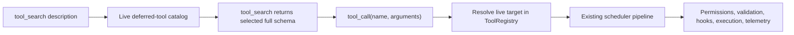

# Deferred Tool Catalog in `tool_search`

## Problem

Deferred tools were advertised through startup and lifecycle
`<system-reminder>` messages. That makes the catalog ordinary conversation
history: it can be diluted by a long context, removed by compression, or require
special restoration during resume and compaction. The restoration path also
coupled tool execution to bookkeeping about whether a schema was still present
in the active history.

## Design

The main session exposes two stable bridge tools:

- `tool_search` advertises the current deferred-tool catalog in its dynamic
  function description and returns full schemas for selected tools.
- `tool_call` accepts a target tool name and target arguments, then hands the
  request to the normal scheduler as that real target.

The catalog is built from the live `ToolRegistry` whenever the provider-facing
`tool_search` declaration is read. Bundled tools and MCP tools are grouped and
sorted. Names and one-line descriptions are JSON quoted; MCP metadata is
explicitly labelled as untrusted data rather than instructions.

`tool_search` remains the schema lookup mechanism. Search results contain the
matched declarations in the existing `<functions>` format, but discovering a
normal deferred tool does not add that tool to the provider declaration list.
An individually oversized schema may still use the existing direct-declaration
fallback, and the search result tells the model to call that tool directly.

```mermaid
flowchart LR
  A["tool_search description"] --> B["Live deferred-tool catalog"]
  B --> C["tool_search returns selected full schema"]
  C --> D["tool_call(name, arguments)"]
  D --> E["Resolve live target in ToolRegistry"]
  E --> F["Existing scheduler pipeline"]
  F --> G["Permissions, validation, hooks, execution, telemetry"]
```

## Lifecycle

The deferred catalog is no longer copied into startup, MCP-change, resume, or
post-compression reminder messages. Compression can discard prior search
results without making the catalog disappear because the current catalog is
part of the `tool_search` declaration on every request. If the model needs a
full schema again, it calls `tool_search` again.

MCP connection changes update the registry. The next declaration read therefore
contains the new catalog without appending synthetic user-history entries or
rewriting the system instruction.

## Execution and safety

`tool_call` is a transport bridge, not a separate executor. Before scheduling,
Qwen Code:

1. validates the bridge envelope;
2. canonicalizes and loads the current target;
3. rejects self-targeting, removed, replaced, directly visible, or otherwise
   ineligible targets;
4. retains the resolved target instance; and
5. schedules the request under the real target identity.

The real target continues to own argument validation, permission policy,
confirmation, hooks, cancellation, result truncation, telemetry, and UI
identity. The provider-facing response keeps the original `tool_call` name and
call ID so request/response pairing remains valid.

The old schema-presentation ledger is removed, and execution does not depend on
schema text surviving in history. This removes the need to restore schema
reminders after compression or resume. It does not grant access to arbitrary
tools: only live, hidden, proxy-eligible deferred tools may be targeted.

Subagents and teammates keep their existing direct declaration surface and do
not receive `tool_call`, preserving their tool restrictions. If `tool_search`
is unavailable in the main session, deferred tools continue to use the existing
direct-declaration fallback.

## Cache behavior

Ordinary discovery no longer mutates the provider's function-declaration set:
`tool_search` and `tool_call` remain stable bridge entries. The
`tool_search.description` catalog changes only when the live deferred catalog
changes, which is the intended capability change. Searching for or calling a
tool does not itself rewrite the catalog into conversation history.

## Verification

Tests cover:

- deterministic catalog rendering and live registry updates;
- absence of deferred catalog reminders from startup and lifecycle paths;
- repeated search after a prior schema result;
- `tool_call` normalization without history-presentation state;
- rejection of malformed, missing, replaced, or ineligible targets;
- preservation of real-target permissions, hooks, validation, telemetry, and
  provider response identity; and
- direct-declaration behavior for subagents and oversized schemas.
