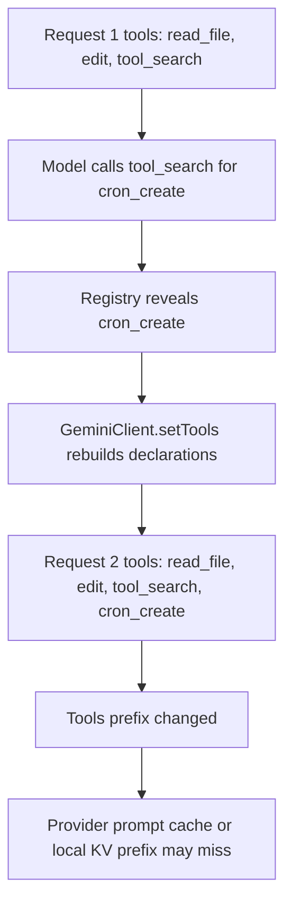
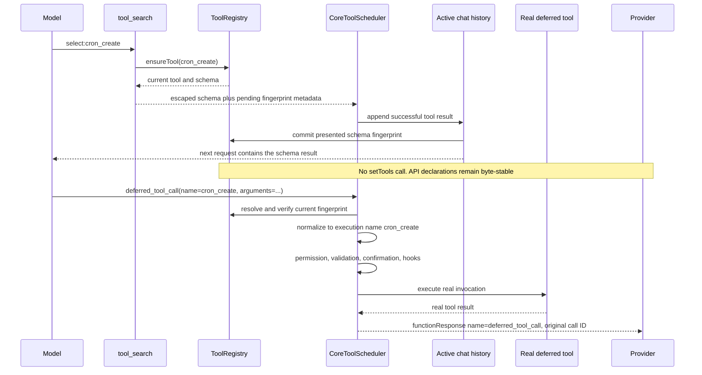

# 延迟工具调用的稳定 Schema 设计

## 问题

Prompt cache 复用依赖稳定的请求前缀。在 Qwen Code 中，这个前缀从 API
`tools` / `functionDeclarations` 块开始，后面接 system instruction 和会话历史。
靠前位置的任何变化都可能让其后的内容无法复用缓存。

今天主会话中的 deferred tool 通过 `tool_search` 被发现：

1. `tool_search` 解析真实工具并返回它的 schema。
2. `ToolRegistry.revealDeferredTool(name)` 将其标记为已 reveal。
3. `GeminiClient.setTools()` 重建 declarations。
4. 真实工具 schema 被加入下一次 API 请求。

模型随后可以调用这个工具，但请求前缀已经变化。



对 declarations 排序只能解决“同一个工具集合内顺序不稳定”的问题，但不能让两个不同的工具集合在字节上完全一致。本方案解决的，是主会话 deferred-tool reveal 造成的工具集合变更。

## 目标

- 当 `tool_search` 展示隐藏 deferred tool 时，保持主会话的
  `functionDeclarations` 字节稳定。
- 保留发现能力：模型仍然需要先收到目标工具的真实 schema，然后才能调用目标工具。
- 保留现有执行边界：目标校验、权限、确认、hooks、telemetry、streaming、truncation、cancellation 和结果记录仍然走 `CoreToolScheduler`。
- 保留 subagent 和 teammate 的工具限制。
- 保留 plan mode、禁用 `tool_search` 的启动路径、压缩和会话恢复行为。
- 将实现限制在 registry、主会话工具面、scheduler normalization 和生命周期集成点内。

## 收益

实施后，deferred tool 的发现不再改变主会话的 API tools block。Provider 可以继续复用包含 `tools/functionDeclarations`、system instruction 和早期 history 的稳定前缀；支持 prefix/KV reuse 的本地模型服务也不用仅因为发现了一个 deferred tool 就重新 prefill 未变化的前缀。

一个更接近真实链路的例子：

```text
用户请求：
  “每天早上 9 点运行 npm run report，把结果发到日报文件里。”

当前行为：
  Request 1
    tools/functionDeclarations:
      [read_file, edit, tool_search]
    history:
      user: 每天早上 9 点运行 npm run report，把结果发到日报文件里。

  模型发现自己需要一个定时任务工具：
    functionCall: tool_search({ query: "cron create scheduled task" })

  tool_search 返回 cron_create 的 schema，并 reveal 这个 deferred tool。
  Qwen Code 随后调用 setTools()，把 cron_create 加入 API tools。

  Request 2
    tools/functionDeclarations:
      [read_file, edit, tool_search, cron_create]
    history:
      user: 每天早上 9 点运行 npm run report，把结果发到日报文件里。
      model: tool_search(...)
      tool: cron_create 的 schema

  结果：
    Request 2 的 tools 前缀比 Request 1 多了 cron_create。
    变化发生在请求最前面，provider 对 tools + system + 早期 history
    建立的 prompt cache prefix 可能无法复用。

新方案：
  Request 1
    tools/functionDeclarations:
      [read_file, edit, tool_search, deferred_tool_call, exit_plan_mode]
    history:
      user: 每天早上 9 点运行 npm run report，把结果发到日报文件里。

  模型仍然先搜索真实工具：
    functionCall: tool_search({ query: "cron create scheduled task" })

  tool_search 返回 cron_create 的真实 schema，并在结果里告诉模型：
    后续调用 deferred_tool_call({
      name: "cron_create",
      arguments: { ...符合 cron_create schema 的参数... }
    })

  Qwen Code 只记录 cron_create schema 已经展示给模型，
  不调用 setTools()，也不把 cron_create 加入 API tools。

  Request 2
    tools/functionDeclarations:
      [read_file, edit, tool_search, deferred_tool_call, exit_plan_mode]
    history:
      user: 每天早上 9 点运行 npm run report，把结果发到日报文件里。
      model: tool_search(...)
      tool: cron_create 的 schema，以及使用 deferred_tool_call 的说明

  模型调用：
    functionCall: deferred_tool_call({
      name: "cron_create",
      arguments: {
        schedule: "0 9 * * *",
        command: "npm run report",
        description: "生成日报文件"
      }
    })

  Scheduler normalization 后，Qwen Code 内部执行：
    cron_create({
      schedule: "0 9 * * *",
      command: "npm run report",
      description: "生成日报文件"
    })

  结果：
    Request 1 和 Request 2 的 tools/functionDeclarations 完全一致。
    新增的 cron_create schema 只出现在 history 的 tool result 后缀里，
    不改变请求最前面的 tools 前缀，因此 prompt cache 更容易命中。
```

这个收益不依赖绕过权限或弱化校验：真实执行仍然进入现有 `CoreToolScheduler`，由目标工具自己的权限、参数校验、hooks、telemetry 和结果记录负责。

## 设计不变量

实现必须保留以下所有不变量：

1. Proxy 调用不能授予当前执行上下文无法直接调用的目标工具权限。
2. 模型在当前目标 schema 已经出现在 active model context 之前，不能通过 proxy 调用该目标。
3. 权限、hooks、UI、telemetry、校验和执行使用真实目标名和目标参数。
4. Provider responses 使用提供方可见的调用名和原始 call ID。
5. 工具移除、MCP 重连或 schema 变更会使之前的 proxy eligibility 失效。
6. 压缩和恢复不能只保留 proxy eligibility，而不同时恢复对应的当前 schema 到模型可见上下文。
7. `includeDeferred`、`visibleTools`、`alwaysLoad` 和 direct compatibility exposure 与 proxy eligibility 彼此独立。

## 按执行上下文划分范围

| 上下文                                      | Deferred tool 暴露方式                                                    | `deferred_tool_call`                                   |
| ------------------------------------------- | ------------------------------------------------------------------------- | ------------------------------------------------------ |
| 启用 `tool_search` 的主会话                 | Schema 通过 `tool_search` 暴露，执行通过 proxy                            | 包含                                                   |
| 未启用 `tool_search` 的主会话               | 启动时直接暴露所有 deferred declarations                                  | 省略                                                   |
| Subagent 或 teammate                        | 在 exclusions 和 `disallowedTools` 之后，保留现有有效 direct declarations | 省略                                                   |
| 恢复包含 direct deferred calls 的旧格式会话 | 之前使用过的真实工具名在该恢复会话中直接暴露                              | 这些调用省略；主会话中后续新搜索到的工具仍可使用 proxy |

Proxy 不进入 subagent registries 是安全要求，而不是优化。Subagent authorization
当前会在 scheduling 之前过滤 provider-visible tool names。如果共享一个 proxy
name，真实目标就会被隐藏，从而绕过 `EXCLUDED_TOOLS_FOR_SUBAGENTS` 和
`disallowedTools` 检查。

## 目标架构

Proxy 只是一个稳定的 provider declaration。它不是 executor。Normalization
边界会在目标权限检查之前，将 provider call 转换为真实 scheduled call。

```mermaid
flowchart LR
  subgraph ProviderBoundary["Provider boundary"]
    A["functionCall name: deferred_tool_call"]
    B["args: target name and target arguments"]
  end

  subgraph Normalization["Main-session call normalization"]
    C["Validate proxy envelope"]
    D["Resolve current target"]
    E["Verify schema fingerprint was presented"]
    F["Verify target is proxy-eligible"]
  end

  subgraph Scheduler["Existing CoreToolScheduler pipeline"]
    G["Target permission policy"]
    H["Target build and schema validation"]
    I["Confirmation and hooks"]
    J["Target execution and streaming"]
    K["Truncation, telemetry, recording"]
  end

  subgraph ResponseBoundary["Provider response boundary"]
    L["functionResponse name: deferred_tool_call"]
    M["Original provider call ID"]
  end

  A --> C
  B --> C
  C --> D --> E --> F --> G --> H --> I --> J --> K --> L --> M
```



Normalized request 同时携带两种身份：

```ts
interface NormalizedToolCallRequest extends ToolCallRequestInfo {
  // Real target identity used by scheduler policy and execution.
  name: string;
  args: Record<string, unknown>;

  // Present only when the provider called a stable proxy.
  providerName?: string;
  providerArgs?: Record<string, unknown>;
}
```

普通工具调用没有 `providerName`，现有行为不变。Proxy 调用则是：

```text
providerName = deferred_tool_call
providerArgs = { name: "cron_create", arguments: {...} }
name         = cron_create
args         = {...}
```

所有面向模型的 response builder 使用 `providerName ?? name`。所有内部消费者使用
`name` 和 `args`。

## 稳定的 Provider Tool

主会话增加一个始终可见的 declaration：

```json
{
  "name": "deferred_tool_call",
  "description": "Calls a deferred tool after its current schema has been fetched with tool_search.",
  "parametersJsonSchema": {
    "type": "object",
    "properties": {
      "name": {
        "type": "string",
        "description": "Exact deferred tool name returned by tool_search."
      },
      "arguments": {
        "type": "object",
        "description": "Arguments matching the target schema returned by tool_search."
      }
    },
    "required": ["name", "arguments"],
    "additionalProperties": false
  }
}
```

`deferred_tool_call` 是保留的 core name。工具注册必须拒绝任何试图使用这个名字的 MCP、command-discovered、extension 或 plugin tool。

如果 proxy tool 的 `execute()` 方法真的被调用，它必须 fail closed。它自身绝不能调用另一个工具。所有受支持的执行入口都必须在 scheduler normalization 阶段拦截它。

使用 `createToolRegistry({ forSubAgent: true })` 时，不注册这个 proxy。这样 agent
runtime 就不会意外地按 provider-visible name 授权 proxy。

## Registry 状态模型

现有 `revealedDeferred` 的含义过载。用两个独立概念替换它。

### Proxy schema presentation

维护一个 map，例如：

```ts
proxySchemaPresentations: Map<string, string>;
```

Key 是 canonical target name。Value 是已经展示给模型的精确 schema 的确定性 fingerprint。只有满足以下条件时，目标才具备 proxy eligibility：

- 它当前存在；
- 它是 deferred；
- 它不是 `alwaysLoad`、`visibleTools`，也不是为了兼容而直接暴露；
- 它当前的 schema fingerprint 与记录的 fingerprint 一致；
- 当前执行上下文是主会话。

删除、MCP 断开/重连、工具替换，或 schema fingerprint 变化，都会删除对应的 presentation entry。

### Direct declaration visibility

Direct declaration visibility 仍然是独立决策：

```text
include in declarations when:
  includeDeferred
  OR not shouldDefer
  OR alwaysLoad
  OR visibleTools contains the name
  OR directVisibleForSession contains the name
```

`proxySchemaPresentations` 绝不能影响
`ToolRegistry.getFunctionDeclarations()`。因此 `tool_search` 不会改变 API tools block。

`directVisibleForSession` 只用于新建或恢复 chat 在第一次请求之前建立的兼容场景。普通 `tool_search` 调用不会修改它，因此 declarations 在该 chat 内保持稳定。

## Tool Search 流程

在主会话中，`tool_search` 继续解析 lazy factories 并渲染真实目标 schema，但不再调用
`GeminiClient.setTools()`。



详细行为：

- 保留 `ensureTool()`。
- 精确 `select:` 可以重新渲染已经 presented 的 schema。
- Keyword search 可以省略已经 presented 的 schema，以节省 tokens。
- 使用现有 wrapper escaping 渲染 schemas，避免不可信描述跳出面向模型的 envelope。
- 将 name 和 fingerprint 作为成功工具结果的 internal pending metadata 返回。不要在
  `tool_search.execute()` 内修改 committed presentation state。
- 只有当包含 schema 的成功结果已经 append 到 active chat history 后，才 commit
  presentation state。取消、结果投递失败或 history rollback 必须丢弃 pending metadata。
- 移除 `setTools()` 以及它的 reveal/API-sync rollback。如果 result construction 或
  history commit 失败，不记录 fingerprint。
- 明确告诉模型后续 turn 使用 `deferred_tool_call`。

同一个 response 不能同时 present 并 invoke 一个新目标。Scheduler 在执行 batch 之前检查
presentation state，因此如果第一次 `tool_search` 某目标的同时并行 proxy call 该目标，这个
proxy call 会被拒绝。

## Scheduler Normalization 和授权

在现有目标权限流程之前：

1. 检测名为 `deferred_tool_call` 的 provider calls。
2. 除非 runtime 是顶层主会话，否则拒绝。
3. 校验 envelope：
   - `name` 是非空字符串；
   - `arguments` 是非 null、非 array 的 plain object；
   - 不存在非预期 envelope fields。
4. 从 `ToolRegistry` canonicalize 并解析当前目标。
5. 拒绝 self-target recursion，也就是 proxy envelope 将
   `deferred_tool_call` 自己作为目标工具名。这个检查不拒绝同一会话中多次使用 proxy
   调用不同的真实 deferred tools。
6. 拒绝 missing、normal visible、`alwaysLoad` 或直接暴露的目标，并提示使用其真实名字调用。
7. 比较当前目标 schema fingerprint 和 presentation record。
8. 构造 normalized request，使用真实目标 `name` 和 `args`，同时保留
   `providerName`、`providerArgs`、call ID、provider call ID、prompt ID、response ID 和
   truncation state。
9. 运行不变的目标权限、build、confirmation、hook、scheduling、execution、timeout、
   streaming、truncation 和 recording pipeline。

因此，normalization 后第一个 permission decision 面向的是真实目标，而不是 proxy。Unknown 和 unrevealed target errors 使用 provider-facing proxy name 返回，保证 provider call/result pair 有效。

Self-target recursion 应作为普通工具调用错误处理，而不是 crash，也不是继续尝试执行。Response 仍然使用 provider-facing proxy name 和原始 call ID，并提示模型通过 `tool_search` 获取真正想调用的 deferred tool schema，然后用该真实目标名调用 `deferred_tool_call`。允许 proxy 以自身为目标没有有效执行语义：proxy 只是 provider-facing transport wrapper，不是业务工具；如果把它 normalize 到自身，会让 execution identity 变得含糊。

## Response 和可观测性规则

以下位置使用真实目标身份：

- permission rules 和 policy classifiers；
- parameter validation 和 retry counters；
- confirmation text；
- PreToolUse、PostToolUse 和 PostToolUseFailure hooks；
- UI tool name、arguments、output 和 duration；
- per-tool truncation limits；
- execution spans 和 tool statistics。

以下位置使用 provider identity：

- `functionResponse.name`；
- provider tool-call pairing；
- reconstructed API history。

对 proxied calls 同时记录两种身份：

```text
tool.name = cron_create
tool.provider_name = deferred_tool_call
```

所有 success、validation-error、permission-denial、hook-denial、cancellation、timeout 和 unhandled-exception response paths 必须使用同一个中心化的 provider-name helper。工具返回的现有 `FunctionResponse` parts 也必须在这个边界被 normalize，而不是带着目标名直接透传。

## 生命周期和兼容性

### Plan mode

`exit_plan_mode` 是生命周期控制工具，不是普通的按需功能。它应从启动开始就直接出现在稳定的主会话 declaration set 中。`enter_plan_mode` 不再 reveal 它，也不再调用 `setTools()`。

在 plan mode 外调用它，仍然使用现有 runtime validation。代价是每个稳定 schema 中多一个工具；为了让 plan-mode exit 不依赖特殊 proxy/reveal 例外，这个成本可以接受。

### 禁用 `tool_search`

如果 `tool_search` 因配置或权限策略不可用：

- 省略 `deferred_tool_call`，因为它的 presentation gate 无法满足；
- 使用 `getFunctionDeclarations({ includeDeferred: true })` 构建初始主会话 declarations；
- 不宣传按需发现。

这个决策发生在第一次请求之前，因此更大的 declaration set 对该 chat 来说仍然稳定。

### Subagents 和 teammates

Subagents 和 teammates 保持当前行为：

- 从其有效 `toolsList` 构建 direct declarations；
- 将上下文 exclusions 和 `disallowedTools` 应用于真实名字；
- 永远不注册或宣传 `deferred_tool_call`；
- 在目标解析前防御性拒绝 hallucinated proxy call。

### 压缩

压缩只有在同时保留 schema 可见性时，才保留便利性：

1. 压缩前 snapshot 当前有效 proxy presentation names。
2. 安装 compressed history 后，再次解析每个目标。
3. 将当前 escaped schemas 作为 user-role runtime reminder append 到新 history 的尾部。
4. 只为成功 append 的 schemas 重新计算并存储 fingerprints。
5. 丢弃 missing 或 changed tools 的 entries。

这会在压缩后增加一个 suffix；它不会修改稳定 tools 或 system prefix。

### 会话恢复

Resume 处理两种 history format：

- 新 proxy history：扫描 `deferred_tool_call` arguments 得到 target names，解析当前 schemas，将它们 append 到启动时的 runtime reminder，并重建 presentation fingerprints。
- 旧 direct history：收集真实 deferred function-call names，并在构建初始 declarations 前把它们加入 `directVisibleForSession`。在该恢复 chat 中，它们的 declarations 保持 direct 且稳定。

History 本身永远不授予执行权限。当前 registry 是否存在、当前 schema presentation、execution-context policy 和目标权限仍然必须生效。

### Clear 和 MCP 生命周期

`/clear` 清空 proxy presentation 和 session-direct visibility state。MCP removal、disconnect、reconnect 或 replacement 会清空受影响名字的 presentation state。重连后的工具必须重新 search，让模型看到它的当前 schema。

## 修改前后对比

当前主会话序列：

```text
Request 1 tools:
[read_file, edit, tool_search]

tool_search reveals cron_create
  -> revealDeferredTool("cron_create")
  -> setTools()

Request 2 tools:
[read_file, edit, tool_search, cron_create]
```

修订后的主会话序列：

```text
Request 1 tools:
[read_file, edit, tool_search, deferred_tool_call, exit_plan_mode]

tool_search presents cron_create
  -> ensureTool("cron_create")
  -> return current escaped schema
  -> return pending schema fingerprint metadata
  -> commit fingerprint after the result enters active history
  -> no setTools()

Request 2 tools:
[read_file, edit, tool_search, deferred_tool_call, exit_plan_mode]

Provider call:
deferred_tool_call({ name: "cron_create", arguments: {...} })

Internal scheduled call:
cron_create({...})

Provider response:
functionResponse({ name: "deferred_tool_call", id: originalCallId, ... })
```

## 成本和验收指标

- 稳定 proxy 和直接可见的 `exit_plan_mode` 会给每个普通主会话请求增加固定 tokens。
- 每次 proxied call 都会增加一个小的 `name` / `arguments` envelope。
- Provider 只能结构化校验通用 proxy envelope；目标 schema 校验发生在 Qwen Code 内部。相比把真实目标 schema 作为 API declaration 发送，这可能增加 invalid-parameter retries。
- 压缩和恢复可能会把 schemas 作为 tail context 重新 append。
- Scheduler request identity model 会稍微更丰富。

只有在 A/B 报告比较以下指标后，才应发布该改动：

- repeated searches 前后的 serialized declaration bytes；
- cached input tokens 或 cache-read ratio；
- time to first token；
- fixed prompt-token overhead；
- deferred-call first-attempt success rate；
- target validation retry rate；
- 压缩和恢复后的行为。

字节稳定性是硬性验收要求。Cache 和质量指标依赖 provider/model，因此报告应该包含原始测量数据，而不是假设 schema 稳定一定带来净收益。

## 安全分析

- Proxy 不是授权。它只把 provider call 传输到真实目标身份。
- Main-session-only registration 防止 proxy-name authorization 绕过 agent real-name restrictions。
- Target permission manager 在 normalization 之后、execution 之前运行。
- 真实目标 schema validation 仍然是强制的；通用 proxy schema 不足以完成校验。
- Schema fingerprints 防止 MCP 重连前展示过的 schema 授权同名但定义不同的当前工具。
- Reserved-name enforcement 防止 registration sources shadow dispatcher surface。
- 不可信 MCP schema text 使用现有 escaping，并被明确描述为 metadata，而不是 instructions。
- Proxy recursion 和 proxying directly visible tools 都会被拒绝。
- Error responses 不泄露隐藏目标 schema；当 presentation 缺失时，只提示模型使用 `tool_search`。

## 源码改动地图

| 源码区域                                                        | 必要改动                                                                                                                                                           |
| --------------------------------------------------------------- | ------------------------------------------------------------------------------------------------------------------------------------------------------------------ |
| `packages/core/src/tools/tool-names.ts`                         | 增加保留 proxy name 和 display name。                                                                                                                              |
| `packages/core/src/config/config.ts`                            | 仅在主 registry 且 `tool_search` 可用时注册 proxy；保持它不进入 `forSubAgent` registries。                                                                         |
| `packages/core/src/tools/tool-registry.ts`                      | 将 committed proxy presentations 与 direct declaration visibility 分离，保留 `includeDeferred` 行为，保留 proxy name，并在工具生命周期变化时使 fingerprints 失效。 |
| `packages/core/src/tools/tool-search.ts`                        | 返回 escaped schemas 和 pending presentation metadata，不调用 `setTools()`。                                                                                       |
| `packages/core/src/core/turn.ts`                                | 显式表示 provider identity 和 execution identity。                                                                                                                 |
| `packages/core/src/core/coreToolScheduler.ts`                   | 在目标授权前 normalize proxy calls，执行真实目标，中心化 provider response naming，并转发 pending presentation metadata。                                          |
| `packages/core/src/core/client.ts`                              | 在 history append 后 commit presentation metadata；处理 disabled search、compression、resume 和 clear。                                                            |
| `packages/core/src/tools/enterPlanMode.ts` 和 `exitPlanMode.ts` | 移除动态 exit-tool reveal，并将 exit tool 保持在稳定 direct main-session surface 中。                                                                              |
| `packages/core/src/agents/runtime/agent-core.ts`                | 保留 real-name agent filtering，并防御性拒绝 hallucinated proxy name。                                                                                             |
| Provider converter tests                                        | 验证 Gemini、OpenAI 和 Anthropic 的 call/result pairing；如果 scheduler response normalization 完整，converter production code 不需要 proxy-specific routing。     |

## 实施计划

1. 增加保留的主会话 `deferred_tool_call` declaration，并从 subagent registries 中省略它。
2. 在 `ToolRegistry` 中拆分 proxy schema presentation 和 direct declaration visibility；保留 `includeDeferred` 行为。
3. 更新 `tool_search`，使其返回 schemas 和 pending fingerprints，但不调用 `setTools()`；然后只在 active-history append 后 commit 它们。
4. 在 `CoreToolScheduler` 的目标权限评估之前增加 provider/execution identities 和 proxy normalization。
5. 在每个 terminal path 中中心化 provider response naming。
6. 让 `exit_plan_mode` 成为稳定的 direct main-session surface 的一部分，并移除它的动态 reveal/setTools 路径。
7. 增加 `tool_search` disabled、subagent、compression、resume、clear 和 MCP lifecycle integration。
8. 运行 provider conversion tests、scheduler tests、targeted integration tests、build 和 typecheck。
9. Rollout 前收集 cache/quality A/B 报告。

## 测试计划

### Registry 和 declaration 稳定性

- 重复 `tool_search` 调用后，declaration names、length、order 和 schema content 保持字节一致。
- Proxy presentation 不影响 `getFunctionDeclarations()`。
- 构造但取消或未 commit 的 `tool_search` result 不授予 proxy eligibility。
- `includeDeferred`、`visibleTools`、`alwaysLoad` 和 `directVisibleForSession` 保留其文档化行为。
- 所有 registration sources 都拒绝 reserved-name collisions。
- MCP removal/reconnect 使之前的 fingerprint 失效。

### 授权和安全

- Proxy calls 在 subagents 和 teammates 中被拒绝。
- `EXCLUDED_TOOLS_FOR_SUBAGENTS`、teammate exclusions、`disallowedTools` 和 MCP pattern restrictions 不能通过 proxy 绕过。
- Unrevealed、stale-fingerprint、missing、normal-visible、`alwaysLoad` 和 recursive proxy targets 被拒绝。
- 真实目标 permission denial、confirmation 和 plan-mode policy 使用目标身份和目标参数。
- PreToolUse、PostToolUse 和 PostToolUseFailure hooks 接收目标身份并保留 hook correlation IDs。

### 执行和 response pairing

- 有效目标参数通过现有 scheduler 执行。
- 无效参数报告真实目标 validation error。
- UI、streaming、truncation、telemetry 和 statistics 使用目标名。
- Success、validation error、permission denial、hook denial、cancellation、timeout 和 exception responses 使用 `deferred_tool_call` 加原始 provider call ID。
- 工具产生的现有 `FunctionResponse` parts 会 normalize 到 provider name。
- 并行的首次 `tool_search` 加 proxy invocation 被拒绝；后续 turn 成功。

### 生命周期和兼容性

- `enter_plan_mode` 不改变 declarations，且 `exit_plan_mode` 仍然可直接调用。
- 禁用 `tool_search` 时直接暴露 deferred tools，并省略 proxy。
- Subagents 保留其 direct effective tool declarations。
- 压缩在恢复 proxy eligibility 前恢复当前 schemas。
- 新 proxy transcripts 和旧 direct-call transcripts 都可以正确 resume。
- `/clear` 移除 presentation 和 session-direct state。
- 被移除或重连的 MCP tools 需要重新 search。

### Provider 和模型行为

- Gemini、OpenAI 和 Anthropic converters 保留 proxy call/result pairing。
- 代表性 deferred schemas 覆盖 required fields、enums、nested objects、arrays 和 union-like constraints。
- Model E2E tests 将 first-attempt success 和 validation retry rates 与当前 direct-declaration 行为比较。
- Prompt-cache diagnostics 确认 declaration bytes 未变化，并记录 cached-token/TTFT measurements。

## 已决策事项

- Proxy 只用于主会话。
- Provider identity 和 execution identity 都会被记录。
- Proxy eligibility 绑定到当前已展示 schema fingerprint，而不是仅凭名字永久授予。
- 压缩和新格式恢复会先恢复当前 schema context，再恢复 eligibility。
- 旧 direct histories 在恢复后的 chat 中保留 direct declarations。
- `exit_plan_mode` 直接且稳定可见。
- 当 `tool_search` 不可用时，deferred tools 从启动开始直接暴露，而不是通过 proxy 路由。
