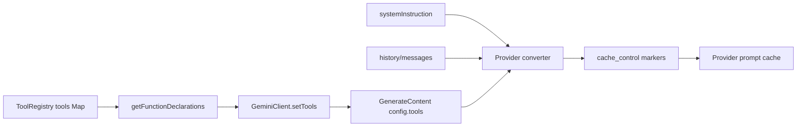
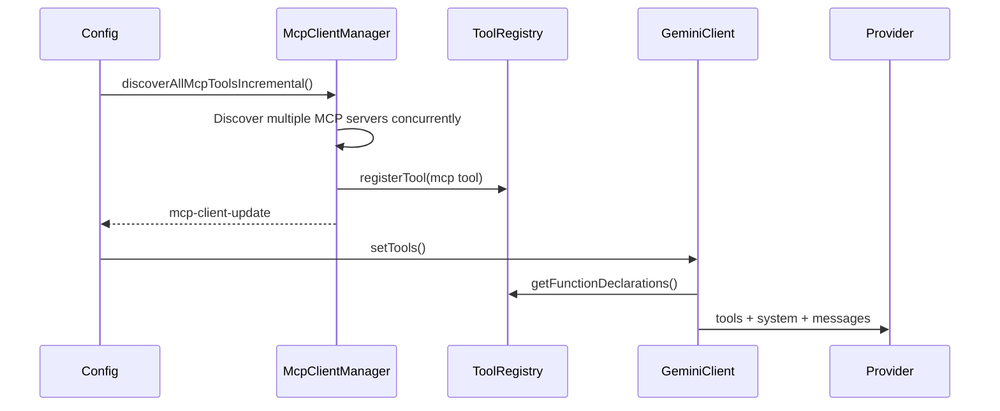

# Global Tool Schema Stable Sort Design

## Background

Qwen Code already supports `cache_control` in the Anthropic and DashScope
request conversion layers. When a provider supports prompt caching, a stable
request prefix can be cached and reused, reducing repeated input-token cost and
lowering time to first token.

The main prefix currently has three parts:

1. Tools schema: tool declarations generated by
   `ToolRegistry.getFunctionDeclarations()`.
2. System instruction: the main-session system prompt.
3. Messages/history: startup prelude, user messages, tool results, and related
   context.

The tools schema is often large and appears near the front of the provider cache
prefix. If the serialized bytes of the tools array change, the following system
and messages prefix can also lose reuse.

Today `GeminiClient.setTools()` directly uses the return value of
`ToolRegistry.getFunctionDeclarations()`, and `getFunctionDeclarations()`
iterates tools in `Map` insertion order. Built-in tool registration order is
usually stable, but progressive MCP discovery, ToolSearch reveals, MCP
reconnects, and external tool registration can all cause the same tool set to be
serialized in different orders. That creates unnecessary prompt cache misses.

## Goals

Implement global stable sorting for tool schemas: `functionDeclarations` sent to
model requests must have a stable order for the same tool set, independent of
registration completion order.

This design only addresses cache misses where the tool set is identical but the
order differs. Adding tools, removing tools, or changing schema content still
changes the prefix; those are legitimate cache misses.

This design does not include:

- System prompt blockification.
- Session-level tool schema snapshot/cache.
- Full prompt cache break detection implementation.
- Provider `cache_control` policy changes.

## Current Flow



Progressive MCP discovery is the most common source of order churn:



If two MCP servers eventually become available but settle in different orders,
the current tools block can differ:

```text
Run 1:
[
  read_file,
  shell,
  mcp__filesystem__read_tree,
  mcp__github__search_issues
]

Run 2:
[
  read_file,
  shell,
  mcp__github__search_issues,
  mcp__filesystem__read_tree
]
```

From a model-capability perspective, both runs expose the same tool set. From a
prompt-cache perspective, they are different tools prefixes.

After sorting, the same set stabilizes to:

```text
[
  mcp__filesystem__read_tree,
  mcp__github__search_issues,
  read_file,
  shell
]
```

## Prompt Cache Role and Hit/Miss Differences

Prompt cache lets the provider reuse KV/cache computation for a stable prefix.
For long tool lists, long system prompts, and long history prefixes, a cache hit
usually has two benefits:

- Lower input-token cost: the cached prefix enters the cache-read billing path.
- Lower TTFT: the provider does not need to reprocess the full prefix.

Before a hit:

```text
request bytes changed
-> tools/system/messages prefix cannot be reused
-> cache_read_input_tokens is low or 0
-> the full prefix is counted again as input/cache creation
-> TTFT is higher
```

After a hit:

```text
stable prefix bytes unchanged
-> tools/system/messages prefix is reused from provider cache
-> cache_read_input_tokens increases
-> only the new tail content is counted as input/cache creation
-> TTFT is lower
```

This design improves hit probability by stabilizing tools array order,
especially for registration-order churn caused by progressive MCP discovery and
ToolSearch reveals.

## Design

Sorting belongs in `ToolRegistry.getFunctionDeclarations()` because it is the
single generation point for current API tool declarations. Do not sort in the
provider converter, because other declaration readers would remain unstable. Do
not sort only in `GeminiClient.setTools()`, because diagnostics, context
estimation, and tests could still observe unsorted declarations.

Sorting rules:

1. First apply the existing filtering logic:
   - By default, exclude tools where
     `shouldDefer && !alwaysLoad && !revealedDeferred`.
   - `{ includeDeferred: true }` includes deferred tools.
   - `alwaysLoad` tools are always visible.
2. Sort the filtered tool instances.
3. Use `tool.schema.name ?? tool.name` as the primary sort key.
4. Use `tool.displayName` as the tie-breaker.
5. Return the sorted `tool.schema` values.

Pseudo-code:

```ts
getFunctionDeclarations(options?: { includeDeferred?: boolean }) {
  const includeDeferred = options?.includeDeferred === true;
  return Array.from(this.tools.values())
    .filter((tool) => {
      if (
        !includeDeferred &&
        tool.shouldDefer &&
        !tool.alwaysLoad &&
        !this.revealedDeferred.has(tool.name)
      ) {
        return false;
      }
      return true;
    })
    .sort(compareToolsByDeclarationName)
    .map((tool) => tool.schema);
}
```

Keep the comparison function local and simple. Do not add configuration:

```ts
function compareToolsByDeclarationName(
  a: AnyDeclarativeTool,
  b: AnyDeclarativeTool,
) {
  const aName = a.schema.name ?? a.name;
  const bName = b.schema.name ?? b.name;
  const byName = aName.localeCompare(bName);
  if (byName !== 0) return byName;
  return a.displayName.localeCompare(b.displayName);
}
```

Do not preserve registration order as implicit ranking. Tool order should not
express model preference; the model should choose tools based on name,
description, schema, and context.

## Test Plan

Add or update tests in `packages/core/src/tools/tool-registry.test.ts`.

### 1. Sort regular tools by canonical name

Registration order:

```text
zeta, alpha, middle
```

Assertion:

```text
getFunctionDeclarations().map(name) === [alpha, middle, zeta]
```

### 2. Filter deferred tools before sorting

Register:

```text
visible-z
hidden-a (shouldDefer)
visible-a
```

Default assertion:

```text
[visible-a, visible-z]
```

### 3. includeDeferred includes all tools and sorts them

Use the same tools as above and call:

```ts
getFunctionDeclarations({ includeDeferred: true });
```

Assertion:

```text
[hidden-a, visible-a, visible-z]
```

### 4. Revealed deferred tools appear at their sorted position

Register:

```text
visible-m
hidden-a (shouldDefer)
visible-z
```

Execute:

```ts
toolRegistry.revealDeferredTool('hidden-a');
```

Assertion:

```text
[hidden-a, visible-m, visible-z]
```

### 5. alwaysLoad deferred tools remain visible and sorted

Register:

```text
z (shouldDefer, alwaysLoad)
a
```

Default assertion:

```text
[a, z]
```

### 6. MCP tool registration order differs but output matches

Create two `ToolRegistry` instances:

```text
registryA registration order:
  mcp__github__search_issues
  mcp__filesystem__read_tree

registryB registration order:
  mcp__filesystem__read_tree
  mcp__github__search_issues
```

Assertion:

```text
registryA.getFunctionDeclarations().map(name)
  === registryB.getFunctionDeclarations().map(name)
```

### 7. Update old assertions

Existing tests that depend on registration order should be updated to depend on
the sorted order instead. For example, a deferred-filtering test that only
asserts `['visible']` can remain as-is; if it registers multiple visible tools
in the future, it should assert the sorted array.

Recommended verification commands:

```bash
cd packages/core && npx vitest run src/tools/tool-registry.test.ts
cd packages/core && npx vitest run src/tools/tool-search.test.ts
cd packages/core && npx vitest run src/core/client.test.ts
npm run build && npm run typecheck
```

## Risks and Constraints

- Changing tool order may affect the model's implicit selection preference. This
  risk is acceptable because tool order should not be product semantics; stable
  cache prefixes have higher priority.
- This design does not prevent cache misses caused by newly added tools. New MCP
  server tools, tool schema content changes, and ToolSearch reveals of new tools
  will still legitimately change the tools block.
- If a provider requires preserving tool registration semantics in the future,
  that should be handled in the provider layer. Current code has no such
  requirement.

## Next Step: Prompt Cache Break Detection

After global sorting lands, the next step should be lightweight prompt cache
break detection to validate the sorting benefit and locate remaining cache
misses.

Implement it in two phases:

1. Record a snapshot before each request:
   - model.
   - system instruction hash.
   - functionDeclaration names and schema hash.
   - cache control enabled/scope.
2. Read usage after each response:
   - `cache_read_input_tokens`.
   - `cache_creation_input_tokens`.
   - compatible cached-token metadata from OpenAI/DashScope/Gemini.

When cache read drops significantly from the previous turn, emit a debug log or
telemetry event:

```text
prompt_cache_break:
  reason: tools_order_changed | tools_schema_changed | system_changed |
          cache_control_changed | model_changed | likely_provider_ttl_or_eviction
  previousCacheReadTokens
  currentCacheReadTokens
  changedToolNames
```

The first version should observe only and must not change request behavior. Its
goal is to answer two questions:

1. Does global tool sorting reduce tools-order cache misses?
2. Do remaining cache misses mainly come from system text, tool schema content,
   `cache_control`, or provider TTL/eviction?
