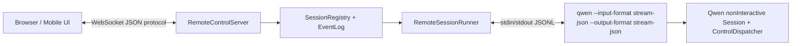

# Qwen Code Remote Control Technical Design

## 1. 结论

如果 Qwen Code 要实现真正可用的 remote-control，建议不要直接把
dual-output 改名或改造成 remote-control。dual-output 是本机 sidecar
I/O：它能把当前 TUI 的结构化事件写到 fd/file/FIFO，也能通过
`--input-file` 读入少量本机 JSONL 命令；但它没有网络 transport、鉴权、
session registry、重连、移动端连接、控制命令分发和多 session 编排。

最可落地的方案是新增 `qwen remote-control` 常驻命令，并以现有
non-interactive `stream-json` control plane 作为第一阶段的执行核心：



这个方案能先做到浏览器/手机同局域网控制本机 Qwen：创建会话、提交输入、
接收流式输出、审批工具、interrupt、set model、set permission mode、
重连恢复和安全配对。第二阶段再把当前 TUI 会话接入，复用 dual-output 和
RemoteInputWatcher 作为 “attach 当前 TUI” 的轻量桥。

PR [#2330](https://github.com/QwenLM/qwen-code/pull/2330) 可以参考其
WebSocket server、QR、token、rate limit、max payload、idle timeout 的骨架；
但不能作为可合并的 remote-control 主体，因为 PR 中 `user_input` 只返回
ack 后留下 TODO，`command_request` 与 `control_command` 都返回 not
implemented，未接入 Qwen 核心执行、stream-json、dual-output 或工具审批。

## 2. 目标与非目标

目标：

- 本地启动 `qwen remote-control` 后，手机或浏览器能连接到当前机器。
- 支持新建 remote session，远程提交 prompt，流式查看 assistant/tool/system
  事件。
- 支持工具审批：远端能看到 `can_use_tool`，选择 allow/deny 后回写到运行中
  的 Qwen 子进程。
- 支持 turn interrupt、model 切换、permission mode 切换、context usage 查询。
- 支持断线重连：客户端可携带 last sequence 恢复未读事件。
- 默认安全：只监听 localhost；开启 LAN 需要显式 flag 和醒目警告。
- 实现路径要能从当前 Qwen main 上逐步落地，不依赖 Claude 的私有云服务。

非目标：

- 第一阶段不实现 Claude `claude.ai/code` 等价云端 rendezvous。
- 第一阶段不实现原生移动 App，只提供响应式 Web UI 和公开协议。
- 第一阶段不把整个终端 PTY 暴露到网页；这可作为 fallback，但不是主方案。
- 第一阶段不做公网可用的 TLS 终止；建议交给反向代理或后续单独实现。

## 3. 源码审计范围

本报告只基于本地源码和 PR 源码核验：

- Claude Code：`/Users/gawain/Documents/codebase/opensource/claude-code`
- Gemini CLI：`/Users/gawain/Documents/codebase/opensource/gemini-cli`
- Qwen Code 当前实现 worktree：
  `/Users/gawain/.codex/worktrees/remote-control-phase1/qwen-code`
- Qwen PR #2330：通过 `gh api` 读取 fork
  `ossaidqadri/qwen-code@feature/remote-control`
- 外部成熟方案：只作为架构参考，来源列在第 12 节。

## 4. Claude Code 的可借鉴实现

Claude Code 有两条 remote-control 相关路径。

第一条是当前 REPL 的 `/remote-control`。入口是
`src/commands/bridge/index.ts:12-24`，命令名为 `remote-control`、alias 为
`rc`；执行体在 `src/commands/bridge/bridge.tsx:26-37`，注释明确说明它通过
AppState 触发 `useReplBridge`，注册 environment、创建 session、连接 ingress
WebSocket。`bridge.tsx:90-104` 设置 `replBridgeEnabled`、
`replBridgeExplicit`、`replBridgeOutboundOnly=false`；`bridge.tsx:155-185`
会把远端 URL 渲染成 QR。

第二条是常驻 `claude remote-control`。CLI fast path 在
`src/entrypoints/cli.tsx:108-160`，不仅匹配 `remote-control`/`rc`，还保留
`remote`/`sync`/`bridge` 等 legacy alias。这里先检查 OAuth，再检查 feature
gate、版本和 `allow_remote_control` policy，然后调用
`src/bridge/bridgeMain.ts`。这是一个真正的本机 agent server，而不是当前 TUI
的 sidecar。

Claude 的协议层有三个重点：

- `src/bridge/bridgeMessaging.ts:132-208` 解析 ingress message，优先处理
  `control_response` 和 server-initiated `control_request`，再处理远端 user
  message，并用 UUID 去重。
- `src/bridge/bridgeMessaging.ts:263-390` 支持 `initialize`、`set_model`、
  `set_max_thinking_tokens`、`set_permission_mode`、`interrupt`，并在
  outbound-only 模式拒绝可变控制请求。
- `src/entrypoints/sdk/controlSchemas.ts:57-155` 用 schema 固化
  initialize、interrupt、can_use_tool、set_permission_mode、set_model、
  set_max_thinking_tokens 等 control payload。

Claude 的当前 REPL 桥接也值得复用思路：

- `src/hooks/useReplBridge.tsx:172-215` 收到 Web/Mobile user message 后会处理
  附件并注入本地 REPL queue，且设置 `skipSlashCommands:true` 与
  `bridgeOrigin:true`，后续只允许 bridge-safe commands。
- `src/hooks/useReplBridge.tsx:223-330` 把 bridge 生命周期映射到 AppState，
  并在 connected 时发送 system/init。这里有刻意的隐私设计：REPL bridge 中
  `tools`、`mcpClients`、`plugins` 被置空，避免把本地集成和路径泄漏到远端。
- `src/hooks/useReplBridge.tsx:367-386` 维护 permission request id 到 handler
  的映射；`src/hooks/useReplBridge.tsx:538-582` 负责发送
  `can_use_tool`、`control_response` 和 cancel。
- `src/hooks/useReplBridge.tsx:387-475` 接收远端 interrupt、set model、
  thinking tokens、permission mode，并在 set_permission_mode 前做 policy guard。
- `src/hooks/useReplBridge.tsx:682-715` 把本地 user/assistant/system local_command
  消息增量转发到 remote session。

常驻 `claude remote-control` 的关键落点在 `bridgeMain` 和 `sessionRunner`：

- `src/bridge/bridgeMain.ts:1889-1950` 的 help 文案明确说这是一个持久 server，
  可以接受多个 session，并能选择 same-dir/worktree/session spawn mode。
- `src/bridge/bridgeMain.ts:760-1045` 是 work queue poll 与 session spawn 主循环：
  decode work secret、ack work、处理 capacity、CCR v2 worker register、为
  session 创建 worktree，然后 spawn child。
- `src/bridge/sessionRunner.ts:300-340` spawn 子进程时设置
  `CLAUDE_CODE_ENVIRONMENT_KIND=bridge`、`CLAUDE_CODE_SESSION_ACCESS_TOKEN`、
  CCR v2 相关 env，并把 child stdin/stdout/stderr 全部 pipe 起来。
- `src/bridge/sessionRunner.ts:368-435` 读取 child stdout NDJSON，识别
  `control_request can_use_tool` 并回调父进程。
- `src/bridge/sessionRunner.ts:519-545` 暴露 `writeStdin()` 和
  `updateAccessToken()`，后者通过 stdin 写 `update_environment_variables`。
- `src/cli/remoteIO.ts:35-150` 说明 child 的 `--sdk-url` transport 可以是
  Session-Ingress 或 CCR v2 SSE + POST；`src/cli/remoteIO.ts:176-195` 定时
  keep_alive；`src/cli/remoteIO.ts:225-245` 在 bridge mode 中先写远端
  transport，再把 `control_request` echo 到 stdout，供父进程记录/识别。

Claude 对 Qwen 的核心启发：

1. remote-control 应分成 transport/server、session runner、agent JSONL/control
   三层，不应把 WebSocket server 直接塞进 TUI。
2. 控制面必须是显式协议：initialize、interrupt、tool permission、permission
   mode、model、capabilities。
3. permission request 要有 request id、pending map、cancel、timeout，不可只
   用普通聊天消息模拟。
4. 子进程 worker 模式比“接管当前 TUI”更适合作为完整 remote-control 的第一步。
5. 多 session、worktree、云端 rendezvous 可以后置，但协议与 SessionRegistry
   要提前留扩展点。

## 5. Gemini CLI 的可借鉴实现

Gemini CLI 没有 Claude 那样的一等移动端 remote-control，但它有两个可借鉴
方向。

第一是 headless/streaming JSON。`docs/cli/headless.md:1-9` 说明 headless 是
无 TTY 的程序化接口；`docs/cli/headless.md:24-35` 说明 streaming JSON 输出是
JSONL event，包括 init、message、tool_use、tool_result、error、result。这和
Qwen 当前 `stream-json` worker 思路一致。

第二是 A2A server。`packages/a2a-server/package.json:1-14` 声明独立包
`@google/gemini-cli-a2a-server` 与 bin `gemini-cli-a2a-server`；
`package.json:27-36` 引入 `@a2a-js/sdk`、express、task store 等依赖。

A2A server 的 server 层：

- `packages/a2a-server/src/http/app.ts:43-88` 定义 AgentCard，声明
  `streaming:true`、`stateTransitionHistory:true`，并声明 bearer/basic auth
  security schemes。
- `app.ts:94-121` 的 auth 是 demo 性质：只接受硬编码 `Bearer valid-token`
  或 `admin:password`，不能照搬到生产。
- `app.ts:195-247` 创建 express app、加载 config/settings/extensions、选择
  GCS 或 in-memory TaskStore，然后通过 `A2AExpressApp` 挂载 A2A routes。
- `app.ts:250-365` 额外挂载 `/tasks`、`/executeCommand`、`/listCommands`、
  `/tasks/metadata` 和 `/tasks/:taskId/metadata`。
- `app.ts:372-395` 默认 listen 在 localhost，端口来自环境变量或随机端口。

A2A server 的 task/executor 层：

- `packages/a2a-server/src/agent/executor.ts:84-165` 维护 task map，并能按
  workspace/settings 创建或重建 task。
- `executor.ts:172-288` cancelTask 会 cancel pending tools、发布 canceled 状态、
  保存 task store 并 dispose。
- `executor.ts:450-465` 如果同一个 task 已有执行 loop，会接受新 user message
  并让主 loop 继续处理。
- `executor.ts:492-655` 是主执行循环：接收用户消息、消费 LLM stream、收集 tool
  calls、等待工具完成、把工具结果送回 LLM、最终进入 input-required 或终态。
- `packages/a2a-server/src/agent/task.ts:487-565` 把等待审批的 tool call 保存为
  confirmation details，并在只等待审批时发布 `input-required` 且 `final:true`，
  让客户端通过新 stream 发送确认。
- `task.ts:907-1050` 把客户端 data part 中的 `{callId,outcome,newContent}` 映射
  成 `ToolConfirmationOutcome` 并回调 scheduler/messageBus。
- `task.ts:1126-1168` 同一个 `acceptUserMessage` 同时处理普通文本和工具确认。
- `packages/a2a-server/src/types.ts:15-44` 把事件类型明确分成 tool confirmation、
  tool update、text content、state change、thought、citation。

Gemini IDE companion spec 也提供了本地发现和鉴权模式：

- `docs/ide-integration/ide-companion-spec.md:16-27` 要求本地 HTTP MCP server
  使用动态端口。
- `docs/ide-integration/ide-companion-spec.md:28-45` 通过
  `os.tmpdir()/gemini/ide/gemini-ide-server-${PID}-${PORT}.json` 做 discovery。
- `docs/ide-integration/ide-companion-spec.md:45-69` discovery file 里包含
  `port`、`workspacePath`、`authToken`、`ideInfo`，并要求 CLI 校验 workspace。
- `docs/ide-integration/ide-companion-spec.md:76-81` 要求每个请求都校验
  `Authorization: Bearer <token>`。

Gemini 对 Qwen 的核心启发：

1. 任务/会话模型应有状态机、metadata、event bus、task/session store。
2. 工具审批可以作为独立的 input-required 状态和确认消息，而不是普通聊天文本。
3. 本地 discovery file + bearer token 可作为 localhost/IDE 场景的补充，但
   手机连接仍需要 QR/LAN URL。
4. A2A 协议适合未来对外互操作，但第一阶段 Qwen remote-control 可以先定义
   自己的轻量 WebSocket 协议，再保留 A2A adapter。

## 6. Qwen 当前可复用能力

### 6.1 non-interactive stream-json control plane

Qwen 当前已有最接近 Claude worker 模式的底座：

- `packages/cli/src/gemini.tsx:677-684` 在 `inputFormat === STREAM_JSON` 时进入
  `runNonInteractiveStreamJson()`。
- `packages/cli/src/nonInteractive/session.ts:39-75` 的 `Session` 已维护
  user message queue、AbortController、StreamJsonInputReader、StreamJsonOutputAdapter、
  ControlContext、ControlDispatcher 和 ControlService。
- `session.ts:153-170` 会创建 control system，并把 `onInterrupt` 绑定到
  `handleInterrupt()`。
- `session.ts:190-220` 通过第一条消息决定 SDK/control 模式还是 direct user 模式：
  第一条是 `control_request initialize` 则启用 control plane；第一条是 user
  message 则走 direct mode。
- `session.ts:320-347` 用 `runNonInteractive()` 执行用户消息，并把
  `abortController`、output adapter、controlService 传入。
- `session.ts:349-389` 有用户消息队列，避免并发 prompt 撞车。
- `session.ts:497-545` 的主循环顺序很关键：先同步处理 `control_response`，
  再处理首消息、异步处理 `control_request`、同步处理 cancel，最后入队 user
  message。这个顺序避免 permission request 等待 response 时死锁。
- `packages/cli/src/nonInteractive/types.ts:296-425` 已定义 control payload：
  interrupt、can_use_tool、initialize、set_permission_mode、hook_callback、
  mcp_message、set_model、mcp_server_status、supported_commands、get_context_usage。
- `packages/cli/src/nonInteractive/control/ControlDispatcher.ts:116-174` 已能分发
  incoming control request、处理 outgoing response、发送 control request。
- `ControlDispatcher.ts:179-238` 支持 cancel 和 stdin closed 后拒绝 pending
  outgoing requests。
- `systemController.ts:46-73` 支持 initialize、interrupt、set_model、
  supported_commands、get_context_usage；`systemController.ts:125-269` 初始化
  SDK/external MCP servers、subagents，并返回 capabilities。
- `permissionController.ts:45-69` 支持 can_use_tool 与 set_permission_mode；
  `permissionController.ts:215-235` 实际更新 permission mode；
  `permissionController.ts:381-430` 在 stream-json 模式下会向 SDK 发送
  `can_use_tool` 并等待响应。

当前阻塞点也明确：

- `packages/cli/src/nonInteractive/session.ts:408-413` 的 interrupt 会 abort
  Session 级 AbortController，且注释明确说明不创建新 AbortController，后续 query
  会立即失败。remote-control 若要 interrupt 后继续使用，必须修复为 turn-level
  AbortController，或让 RemoteSessionRunner 在 interrupt 后重启 child。

### 6.2 dual-output 与 RemoteInputWatcher

dual-output 可作为第二阶段 “接管当前 TUI” 的桥，不适合作为第一阶段完整
remote-control 的执行核心。

- `packages/cli/src/dualOutput/DualOutputBridge.ts:35-53` 定义支持事件：
  system、user、assistant、stream_event、result、control_request、
  control_response，协议版本为 1。
- `DualOutputBridge.ts:63-74` 注释把它定义为 sidecar：TUI 正常渲染 stdout，
  同时把 JSON event stream 写到 fd 或 file/FIFO。
- `DualOutputBridge.ts:88-146` 只处理 fd/file stream，没有网络、鉴权、ack 或
  session registry。
- `DualOutputBridge.ts:148-160` 会发 `session_start` capability handshake。
- `DualOutputBridge.ts:224-262` 能发 `can_use_tool` permission request 和
  control response。
- `packages/cli/src/remoteInput/RemoteInputWatcher.ts:13-24` 输入命令只有
  `submit` 与 `confirmation_response`。
- `RemoteInputWatcher.ts:94-187` 通过 `watchFile` 读取 append-only JSONL，
  confirmation_response 立即处理，submit 入队。
- `RemoteInputWatcher.ts:189-240` 只有当 submitFn 明确返回 `false` 才会保留队列
  并重试。
- `packages/cli/src/gemini.tsx:178-219` 在 TUI 启动时根据 `--json-fd`、
  `--json-file`、`--input-file` 创建 DualOutputBridge 与 RemoteInputWatcher。
- `packages/cli/src/ui/AppContainer.tsx:897-913` 把 remote input 接到
  `submitQuery`，并在 TUI idle 时通知 watcher。
- `AppContainer.tsx:915-1021` 把 awaiting approval 的工具 call 映射到
  dual-output `control_request`，并把 `confirmation_response` 回到 `onConfirm`。
- `packages/cli/src/ui/hooks/useGeminiStream.ts:1281-1310` 的 `submitQuery` 在 busy
  分支是裸 `return`，不是 `return false`。因此 watcher 层有 retry 能力，但
  当前 TUI wiring 不能证明 busy submit 会可靠重试。

### 6.3 channels / ACP

channels 系统说明 Qwen 已经有“外部消息平台 -> agent”的思路，但它不是
remote-control：

- `docs/design/channels/channels-design.md:9` 定义 channel 是外部消息平台连接
  Qwen agent。
- `channels-design.md:13-43` 架构图显示 Platform Adapter、ACP Bridge、
  SenderGate、SessionRouter、ChannelBase。
- `channels-design.md:64-72` 说明一个 `qwen-code --acp` 进程可管理多个 ACP
  sessions，并有 crash backoff 与 session restore。
- `packages/channels/base/src/AcpBridge.ts:52-65` 通过 Node spawn `qwen --acp`。
- `AcpBridge.ts:103-113` 当前 permission request 是 auto-approve，注释说后续
  Phase 5 才加交互审批。因此 channels 不满足 remote-control 的安全审批要求。
- `packages/channels/base/src/ChannelBase.ts:238-430` 负责 gate、pairing、session
  routing、附件解析、dispatch modes（collect/steer/followup）和 prompt 串行。

channels 可复用思想：SenderGate/GroupGate、SessionRouter、dispatch mode、
附件保存、prompt 串行。但 remote-control 仍需要自己的浏览器/mobile 协议和
工具审批闭环。

## 7. PR #2330 审计结论

PR #2330 的信息：

- 标题：`feat: remote-control feature for browser-based CLI interaction`
- 状态：Open
- head：`ossaidqadri/qwen-code@feature/remote-control`
- URL：[https://github.com/QwenLM/qwen-code/pull/2330](https://github.com/QwenLM/qwen-code/pull/2330)

可参考的部分：

- `RemoteControlServer.ts:77-105` 有 server 状态、client map、history、session
  state 和 32-byte random token。
- `RemoteControlServer.ts:123-167` 启动 HTTP + WebSocket server，WebSocket path
  为 `/ws`，设置 `maxPayload`。
- `RemoteControlServer.ts:235-313` 有 `/health`、`/api/connect`、`/api/qr-data`
  和静态 UI 路由。
- `RemoteControlServer.ts:737-767` 有每 IP auth rate limit。
- `RemoteControlServer.ts:775-842` 有 max connections、client state、message
  parse、close/error handler。
- `RemoteControlServer.ts:896-941` token auth 在 WebSocket message 中完成。
- `RemoteControlServer.ts:948-965` 支持 sync session state 和 message history。
- `RemoteControlServer.ts:1115-1153` 支持广播 message_update/session_update。
- `packages/cli/src/commands/remote-control/index.ts:16-52` 提供
  `qwen remote-control [name]`、`--port`、`--host`、`--stop`。
- `packages/cli/src/ui/commands/remoteControlCommand.ts:33-44` 提供
  `/remote-control` slash command。

不能直接采用的部分：

- `RemoteControlServer.ts:972-997` 的 `handleUserInput()` 只发送
  `user_input_ack`，源码里明确写着 TODO：forward to Qwen Code core。
- `RemoteControlServer.ts:1004-1021` 的 `command_request` 返回
  `Command execution not yet implemented`。
- `RemoteControlServer.ts:1028-1045` 的 `control_command` 返回
  `Control commands not yet implemented`。
- `types.ts:164-167` 的 control command 只有 pause/resume/stop/restart，没有
  Qwen 已有的 initialize、can_use_tool、interrupt、set_model、
  set_permission_mode 等 control plane。
- `RemoteControlServer.ts:148-153` 和 `types.ts:272-280` 都说明 TLS/WSS 尚未实现；
  但 PR 文档 `docs/remote-control.md:100-107` 又让用户设置 `secure:true`，这与
  源码矛盾。
- `docs/remote-control.md:172-174` 写 `/api/connect?token=XXX` 和
  `/api/qr-data?token=XXX` 需要 token；但 server 源码 `RemoteControlServer.ts:265-287`
  已改为不需要 URL token，文档与实现不一致。
- subcommand 中 `server` 是进程内全局变量，`qwen remote-control --stop` 在新的
  CLI 进程里看不到既有 server，因此只能停止同进程内对象，不是 daemon stop。
- 该 PR 没有接入 dual-output、RemoteInputWatcher、stream-json worker、tool
  permission、event replay、session runner 或 current TUI message stream。

因此 PR #2330 更适合作为 UI/server 安全骨架参考，不适合作为 remote-control
主体实现。

## 8. 推荐架构

### 8.1 总体分层

建议新增包内模块：

```text
packages/cli/src/remoteControl/
  protocol/
    types.ts
    validation.ts
  server/
    RemoteControlServer.ts
    PairingManager.ts
    ClientManager.ts
    StaticAssets.ts
  session/
    SessionRegistry.ts
    RemoteSessionRunner.ts
    StreamJsonBridge.ts
    EventLog.ts
  tui/
    TuiRemoteBridge.ts
  security/
    origin.ts
    tokens.ts
    audit.ts
  ui/
    index.html
    app.ts
    styles.css
```

职责划分：

- `RemoteControlServer`：HTTP + WebSocket 入口，auth、origin check、rate limit、
  heartbeat、client lifecycle、serve Web UI。
- `PairingManager`：生成 one-time pairing token、TTL、token hash、QR payload。
- `ClientManager`：维护连接、订阅 session、backpressure、broadcast、disconnect。
- `SessionRegistry`：创建/关闭/列出 session，记录 cwd、model、permission mode、
  status、runner pid、last activity。
- `RemoteSessionRunner`：spawn `qwen` 子进程，传入 stream-json args，管理 stdin、
  stdout、stderr、exit、restart。
- `StreamJsonBridge`：把远端 command 转成 child stdin JSONL，把 child stdout JSONL
  转成 remote-control events。
- `EventLog`：每个 session 的单调 `seq`、ring buffer、可选磁盘持久化，用于重连。
- `TuiRemoteBridge`：第二阶段接入当前 TUI，包装 DualOutputBridge 和
  RemoteInputWatcher。
- `security/audit.ts`：记录 auth failure、LAN exposure、permission decision、
  tool approval、client disconnect 等安全事件。

### 8.2 CLI 与 Slash Command

新增 subcommand：

```bash
qwen remote-control [name]
qwen remote-control --host localhost --port 7373
qwen remote-control --port 0
qwen remote-control --allow-lan
qwen remote-control --cwd /path/to/project
qwen remote-control --no-ui
qwen remote-control --token-ttl 300
qwen --remote-control
qwen --remote-control --remote-control-port 0
qwen --remote-control --remote-control-allow-lan
```

当前 TUI 内也支持 slash command：

```bash
/remote-control
/remote-control start --allow-lan --port 0
/remote-control --allow-lan --port 0
/remote-control --host 0.0.0.0 --allow-lan --port 7373
/remote-control status
/remote-control stop
```

默认行为：

- host 默认 `127.0.0.1` 或 `localhost`。
- port 默认 7373；如果冲突，建议 `--port 0` 自动随机并打印真实端口。
- `--allow-lan` 才能绑定 `0.0.0.0` 或 LAN IP；启动时打印安全警告。
- `qwen remote-control` 是 worker server：远端 create session 后 spawn 子进程。
- `qwen --remote-control` 是当前 TUI attach：不 spawn 子进程，而是把当前 TUI 的
  dual-output 与 RemoteInputWatcher 接到同一个 server。

交互入口：

- `qwen --remote-control` 在 Ink TUI 启动前创建 `TuiRemoteBridge`，打印 URL 与
  pairing token，然后照常渲染当前 TUI。
- `/remote-control` 在 TUI 已经运行后按需启动同一个 current TUI attach 能力。
  它只作为启动、status、stop 和展示连接信息的 UI 包装，不引入第二套协议。
- `qwen --remote-control --remote-control-allow-lan` 与 `/remote-control --allow-lan`
  在未显式提供 host 时绑定 `0.0.0.0`，更符合移动端临时接入场景；仍要求用户显式
  确认 LAN 暴露。

### 8.3 Worker 启动参数

RemoteSessionRunner 启动 child 时建议使用：

```bash
qwen \
  --input-format stream-json \
  --output-format stream-json \
  --include-partial-messages \
  --model <model-if-set> \
  --approval-mode <mode-if-set>
```

stdin 第一条消息应优先发送 initialize：

```json
{
  "type": "control_request",
  "request_id": "init-...",
  "request": {
    "subtype": "initialize",
    "mcpServers": {},
    "sdkMcpServers": {},
    "agents": []
  }
}
```

收到 initialize success 后，server 再允许 `user/submit` 进入 session queue。
普通 user message 写入 child stdin 时使用 Qwen 现有 `CLIUserMessage` 形态
（`packages/cli/src/nonInteractive/types.ts:114-121`）：

```json
{
  "type": "user",
  "uuid": "u_01",
  "session_id": "qwen-session-id",
  "message": {
    "role": "user",
    "content": "请分析这个仓库的测试结构"
  },
  "parent_tool_use_id": null
}
```

`StreamJsonInputReader.ts:53-62` 当前只做 JSON parse 和顶层 `type` 字段校验，
因此 RemoteControlServer 在写入 child stdin 前必须用更严格的协议 schema 校验
session id、message role、content size、control subtype 和 request id，不能依赖
child 侧输入读取器兜底。

### 8.4 WebSocket 协议

建议统一 envelope：

```json
{
  "v": 1,
  "id": "msg_01",
  "type": "user/submit",
  "sessionId": "s_01",
  "seq": 12,
  "ts": "2026-05-07T12:00:00.000Z",
  "payload": {}
}
```

client -> server：

- `auth/pair`：携带 pairing token 或已签发 client token。
- `session/list`：列出本 server 下 session。
- `session/create`：创建 worker session，可带 cwd、name、model、permission mode。
- `session/attach`：订阅已有 session。
- `history/resume`：携带 lastSeq，服务端补发事件。
- `user/submit`：提交 prompt。
- `tool/respond`：回应 tool permission request。
- `control/interrupt`：中断当前 turn。
- `control/set_model`：切换 model。
- `control/set_permission_mode`：切换 approval mode。
- `control/get_context_usage`：查询 context usage。
- `session/close`：关闭 session。
- `ping`。

server -> client：

- `auth/result`：认证结果和 server capabilities。
- `session/list/result`。
- `session/state`：idle、working、waiting_for_approval、error、closed。
- `event/append`：用户、assistant partial、assistant final、tool update、system、
  result、error 等流式事件。
- `control/request`：从 child 出来的 `can_use_tool` 等 outgoing request。
- `control/response`：控制命令结果。
- `command/ack`：user submit 已入队/被拒绝/排队。
- `history/replay`。
- `error`。
- `pong`。

### 8.5 与 Qwen stream-json 的映射

核心映射表：

| Remote command                | Child stdin / internal action                                                                                               |
| ----------------------------- | --------------------------------------------------------------------------------------------------------------------------- |
| `session/create`              | spawn child，写 `control_request initialize`                                                                                |
| `user/submit`                 | 写 CLI user message，入 session queue                                                                                       |
| `tool/respond allow`          | worker/stream-json 写 `control_response success`，`response.behavior='allow'`；如有修改后的输入，写 `response.updatedInput` |
| `tool/respond deny`           | worker/stream-json 写 `control_response success`，`response.behavior='deny'`，可带 `response.message`                       |
| `control/interrupt`           | 写 `control_request interrupt`；当前必须修复 abort controller 或重启 child                                                  |
| `control/set_model`           | 写 `control_request set_model`                                                                                              |
| `control/set_permission_mode` | 写 `control_request set_permission_mode`                                                                                    |
| `control/get_context_usage`   | 写 `control_request get_context_usage`                                                                                      |

注意：Qwen 当前存在两种审批 wire shape。non-interactive stream-json 的
`permissionController.ts:439-461` 读取的是 `response.behavior='allow'|'deny'`；
interactive dual-output 的 `BaseJsonOutputAdapter.ts:1105-1112` 发的是
`response.allowed:boolean`，`AppContainer.tsx:972-1021` 再把 input-file 的
`confirmation_response.allowed` 映射到 TUI `onConfirm`。因此 Phase 1 worker 模式
必须使用 `behavior` 形态；Phase 2 TUI attach 才使用或兼容 `allowed` 形态。

child stdout -> remote event：

- `system` -> `event/append system`
- `user` -> `event/append user`
- `assistant` / partial assistant -> `event/append assistant`
- `stream_event` -> `event/append stream_event`
- `control_request can_use_tool` -> `control/request` 并进入 pending map
- `control_response` -> `control/response`
- `result` -> `event/append result`，turn 状态回到 idle
- stderr -> server audit/debug，不默认广播完整 stderr；可在 debug mode 下开放。

### 8.6 EventLog 与重连

每个 session 维护：

```ts
interface RemoteEvent {
  seq: number;
  id: string;
  sessionId: string;
  type: string;
  createdAt: string;
  payload: unknown;
}
```

要求：

- `seq` 单调递增，所有广播前先写 EventLog。
- 内存 ring buffer 默认保留最近 1000 条或 5MB。
- 客户端重连后发送 `history/resume { sessionId, lastSeq }`。
- 如果 lastSeq 太旧，返回 snapshot + truncated marker。
- 第二阶段可把 event log 落盘到 `~/.qwen/remote-control/sessions/<id>.jsonl`。

## 9. 安全设计

默认安全策略：

- 默认只绑定 `127.0.0.1`/`localhost`。
- 绑定 `0.0.0.0`、LAN IP 或非 loopback host 必须显式 `--allow-lan`。
- 启动时打印实际 URL、host、port、token TTL、LAN 风险提示。
- token 使用 `crypto.randomBytes(32)`，服务端只存 hash。
- pairing token 默认 5 分钟 TTL，一次使用后失效。
- token 不放 URL query。QR 只包含 URL 和短 pairing id；真正 secret 通过页面输入、
  同机剪贴板或一次性 code 完成。
- WebSocket auth 必须在第一条业务消息前完成。
- 校验 Origin：localhost 默认只接受同 origin；LAN 模式允许 server URL origin。
- 限制 max payload，例如 1MB；工具 diff 和大输出走分页或 artifact endpoint。
- 限制 max clients，例如默认 5。
- idle timeout，例如 30 分钟。
- heartbeat ping/pong，断线清理 pending subscriptions。
- CSP 不使用 `unsafe-inline`；前端 JS/CSS 独立静态资源并带 hash 或 nonce。
- 不声称支持 WSS，除非真的接入 TLS；第一阶段文档建议使用反向代理提供 HTTPS/WSS。
- 工具审批事件必须包含 tool name、tool_use_id、input、permission suggestions 和
  blocked path，但 UI 要避免默认展开敏感环境变量。
- slash command 远端执行必须 allowlist；默认仅支持安全查询类 command。
- audit log 至少记录 auth failure、client connected/disconnected、LAN mode、
  permission decision、session create/close、interrupt。

## 10. 分阶段实施计划

### Phase 0：补齐 stream-json worker 前置缺口

必须先解决：

1. 修复 `packages/cli/src/nonInteractive/session.ts` 的 interrupt 后不可继续
   问题。推荐改为每个 turn 一个 AbortController：Session 级 shutdown signal 与
   turn 级 abort 分开；interrupt 只 abort 当前 turn，下一条 user message 创建新
   turn controller。
2. 明确 `can_use_tool` response 的 wire shape，保证远端 allow/deny 能映射到
   `ToolConfirmationOutcome`。
3. 给 stream-json child runner 增加 stdout parser 单元测试，覆盖 partial、
   result、control_request、parse error。

### Phase 1：本地 worker remote-control

实现内容：

1. 新增 `packages/cli/src/remoteControl/protocol`，定义 envelope、payload、schema。
2. 新增 `RemoteControlServer`，实现 HTTP/WebSocket、auth、rate limit、origin、
   heartbeat、static UI。
3. 新增 `SessionRegistry`、`RemoteSessionRunner`、`StreamJsonBridge`、`EventLog`。
4. 新增 `qwen remote-control` subcommand，默认 worker mode。
5. Web UI 支持 session list/create/attach、prompt input、stream output、
   permission card、interrupt、model/permission mode 控件。
6. 文档新增用户说明与安全说明。

验收标准：

- 手机或浏览器连接后能创建新 session。
- 远端提交 prompt 后，child 收到 user message 并返回 assistant stream。
- 工具需要审批时，远端出现审批卡，allow/deny 能继续或取消工具。
- interrupt 后 session 仍能接受下一条 prompt。
- 刷新页面后可通过 lastSeq 恢复最近事件。

### Phase 2：当前 TUI attach

实现内容：

1. 新增 `TuiRemoteBridge`，把 dual-output event stream 接入 server EventLog。
2. 把 remote `user/submit` 映射到 RemoteInputWatcher 或内存 pipe。
3. 扩展 `RemoteInputCommand`，加入 command id、ack/error、interrupt、
   set_permission_mode、set_model 等。
4. 修复 `submitQuery()` busy 分支，使 RemoteInputWatcher 能收到 `false` 或由
   TuiRemoteBridge 自己等 idle 后再写入。
5. `qwen --remote-control` 与 `/remote-control` attach 当前 TUI，并显示
   URL/token；QR 可以作为后续 UI 增强。

验收标准：

- 当前 TUI 的消息和工具审批能同步到手机。
- 手机提交输入能像用户本地输入一样进入当前 TUI。
- 本地 TUI 与手机谁先审批工具都能胜出，另一端收到最终 control_response。

### Phase 3：高级能力

- 多 session + worktree spawn mode。
- session 持久化与 crash resume。
- A2A adapter：把 remote-control session 映射为 A2A task/event。
- 可选云端 relay/rendezvous：需要独立认证、relay token、worker heartbeat、ack、
  delivery sequencing 和 org policy，不建议混入 Phase 1。
- 文件上传：先落到 temp 目录，转成 `@path` 或 attachment metadata，并要求用户确认。
- Push notification：移动端断开长连接时可接入 Web Push 或平台推送。

## 11. 测试计划

单元测试：

- `PairingManager`：token 生成、hash、TTL、一次性消费、过期清理。
- `RemoteControlServer`：auth 成功/失败、rate limit、max connections、
  origin check、max payload、idle cleanup、heartbeat。
- `EventLog`：seq 单调、ring buffer 截断、resume、snapshot fallback。
- `StreamJsonBridge`：stdin 写入、stdout JSONL parse、control_request pending map、
  parse error 不杀 server。
- `RemoteSessionRunner`：spawn args/env、child exit、stderr capture、restart/close。
- `protocol/validation`：未知 type、缺字段、过大 payload、版本不兼容。

集成测试：

- 从 package 目录跑单测，遵守本仓库 AGENTS.md：
  `cd packages/cli && npx vitest run src/remoteControl/...test.ts`。
- 构建后运行：
  `npm run build && npm run bundle`。
- 启动 `qwen remote-control --port 0 --no-ui`，用测试 WebSocket client：
  auth -> session/create -> user/submit -> 收到 assistant/result。
- 模拟 tool permission：构造需要审批的工具调用，验证 `control/request` ->
  `tool/respond` -> child 继续执行。
- interrupt E2E：提交长任务 -> `control/interrupt` -> 状态回 idle ->
  再提交下一条 prompt 成功。
- reconnect E2E：client A 收到 seq N 后断开 -> client B `history/resume` ->
  收到 N+1 之后事件。

安全测试：

- token 不出现在 URL、HTTP access log 和 QR data。
- 未认证 client 不能 sync、submit、attach。
- 错误 Origin 被拒绝。
- 绑定 LAN 时必须 `--allow-lan`。
- 静态资源不能 path traversal。
- CSP 不允许 inline script。
- 大消息、重复 auth、连接洪泛不会导致进程崩溃。

## 12. 其他成熟开源方案参考

这些方案不能直接替代 Qwen remote-control，但可以借鉴成熟设计。

- code-server：官方 README 定位是 “VS Code in the browser”，并强调任意设备上的
  一致开发环境、WebSockets 需求和云端机器执行重任务。Coder 文档还列出
  code-server 具备可选登录表单、内置 dev proxy、health endpoint、上传/下载限制
  等能力。参考：
  [coder/code-server](https://github.com/coder/code-server)，
  [Coder docs: code-server](https://coder.com/docs/user-guides/workspace-access/code-server)。
- ttyd：成熟 WebTTY，基于 xterm.js 和 WebSocket，支持 SSL、Basic Auth、
  origin check、只读模式、单连接模式等。适合作为“完整终端共享” fallback，
  不适合作为结构化 agent remote-control 主协议。参考：
  [ttyd](https://github.com/tsl0922/ttyd)。
- A2A Protocol：开放 agent 互操作协议，支持 JSON-RPC over HTTP(S)、Agent Card
  discovery、SSE streaming、push notifications、文本/文件/结构化 JSON。适合作为
  Phase 3 对外协议 adapter 或移动端断线通知模型。参考：
  [a2aproject/A2A](https://github.com/a2aproject/A2A)，
  [a2a-js SDK](https://github.com/a2aproject/a2a-js)。

## 13. 关键设计决策

1. 第一阶段使用 stream-json worker，而不是 current TUI attach。
   原因：Qwen 已有 nonInteractive control plane，Claude 的常驻 remote-control
   也是 worker + structured stdin/stdout/remote transport 模式。current TUI attach
   涉及 React state、busy submit、双端审批 race，更适合第二阶段。

2. dual-output 继续保留为 sidecar primitive。
   原因：它现有语义清楚，适合 IDE/web sidecar 和 TUI attach；强行塞入网络、
   session registry 和 auth 会破坏边界。

3. PR #2330 只借鉴骨架，不直接合并。
   原因：核心输入、命令和控制都未实现，且文档与 TLS/token endpoint 实现不一致。

4. 默认不暴露公网。
   原因：remote-control 可以触发本机工具、文件修改、shell 命令；无 TLS/无强认证
   的公网暴露不可接受。

5. 远端 slash command 必须 allowlist。
   原因：Claude 的 REPL bridge 对远端命令有 bridge-safe command 过滤；Qwen 也应
   防止移动端绕过本地 UI 执行不安全 local-jsx 或退出类命令。

## 14. 后续实现切分建议

建议按以下三条 stacked PR 拆分：

1. `feat(cli): add remote-control foundation`
   - 修改 nonInteractive Session 的 AbortController 生命周期。
   - 增加 interrupt 后继续提交的测试。
   - 加入完整技术设计文档。

2. `feat(cli): add remote-control worker server`
   - 新增 protocol、validation、EventLog、PairingManager、RemoteControlServer、
     SessionRegistry、RemoteSessionRunner、StreamJsonBridge、subcommand 和最小
     Web UI。
   - 覆盖 worker session create/attach、prompt submit、stream replay、
     interrupt、model/permission mode 和 remote tool approval。

3. `feat(cli): attach current TUI to remote-control`
   - TuiRemoteBridge、dual-output/input-file 扩展、`qwen --remote-control` 与
     `/remote-control` 当前 TUI attach。
   - 覆盖当前 TUI 同屏事件、远端 submit、工具审批 race 和断线恢复。

## 15. 审计记录

第一轮：源码路径完整性审计。

- Claude 的 current REPL `/remote-control` 与常驻 `claude remote-control` 是两套
  路径，不应混为一谈。本文分别引用了 `commands/bridge`、`useReplBridge`、
  `bridgeMain`、`sessionRunner`、`remoteIO`。
- Qwen 当前已有 stream-json control plane，且 control payload 覆盖 remote-control
  必需的大部分能力。本文引用 `session.ts`、`types.ts`、`ControlDispatcher`、
  system/permission controllers。
- Qwen dual-output 只证明本机 sidecar 能力，不证明 remote-control 能力。本文已
  明确标注其 fd/file/FIFO 边界。
- Gemini A2A server 是任务/流式/审批模型参考，不是移动端 remote-control 成品。

第二轮：PR #2330 可行性审计。

- 已核对 fork 源码，`handleUserInput()` 存在 TODO，命令和控制均 not implemented。
- 已核对 PR 文档与源码矛盾：文档写 WSS/`secure:true` 与 token query endpoint，
  源码写 TLS 未实现且 endpoint 不再要求 token。
- 因此本文没有把 PR #2330 作为可运行 remote-control 实现，只把它归为可复用骨架。

第三轮：方案风险审计。

- 最大实现风险是 interrupt 后不可继续；已列为 Phase 0 必修。
- 第二大风险是把手机端 token 放入 URL/QR；本文要求 token 不进 URL，QR 只放 URL
  和短 pairing id。
- 第三大风险是工具审批 shape 不一致；本文要求先固定 stream-json permission
  response wire shape，并以 E2E 验证 allow/deny。
- 第四大风险是 current TUI attach 与 worker mode 混淆；本文把它拆到 Phase 2。

第四轮：可实现性审计。

- Phase 1 不依赖 Claude 私有云、OAuth、CCR、GrowthBook 或 Anthropic 后端。
- 所需依赖基本是 Node HTTP/WebSocket、现有 Qwen stream-json stdin/stdout 和
  当前 config/control controller。
- 即使 Web UI 暂时很薄，协议和测试也能先实现；后续移动 UI 可独立迭代。

第五轮：wire format 审计。

- 已区分 worker/stream-json 与 interactive dual-output 的工具审批响应形态：
  worker 使用 `response.behavior='allow'|'deny'`，dual-output 使用
  `response.allowed:boolean`。
- 已补充 child stdin 的 `CLIUserMessage` 示例，并记录 `StreamJsonInputReader`
  只校验顶层 `type`，所以 server 写入 child 前必须先做严格 schema 校验。

## 16. 二次审计补充与前瞻优化

本节记录实现后三轮无方向审计得到的前瞻优化项。它们不阻塞当前三段式
remote-control 落地，但应作为后续 PR 的优先队列。

### 16.1 协议演进

- 在 `auth/result.capabilities` 中继续细分能力位，例如
  `canGetContextUsage`、`canRegeneratePairingToken`、`serverMode`、
  `supportsDurableReplay`，避免客户端用 session mode 或错误响应来猜能力。
- 为所有 mutating command 引入 client-provided `commandId` 与幂等 ack，支持移动端
  断线重发时去重。
- 增加 heartbeat/ping timeout、server time、client last-seen metadata，便于移动端
  显示“已断开但可重连”。
- 对 event payload 做 schema version 标注；`REMOTE_CONTROL_PROTOCOL_VERSION`
  只表示 envelope 主版本，不应承载每类 payload 的细粒度演进。

### 16.2 安全与网络暴露

- `--allow-lan` 模式应打印可从手机访问的 LAN URL 列表；绑定 `0.0.0.0` 时只打印
  `127.0.0.1` 不足以支撑移动端连接。
- Pairing token 继续保持 one-time，QR 只包含 URL，不包含 token。后续可增加本机
  UI/CLI 命令显式 regenerate pairing token，而不是长时间复用初始 token。
- LAN 模式可增加 origin allowlist 与安全审计日志；当前最小实现只依赖 token 与
  basic origin check。
- 公网 relay/TLS 不应混入本地 PR；如要支持，应独立实现 relay token、org policy、
  server heartbeat、delivery ack 与端到端审计。

### 16.3 可靠性与可恢复性

- worker stdin 写入应逐步支持 backpressure 与内部 command queue；当前实现适合作为
  本地 MVP，但高频移动端输入需要显式排队。
- EventLog 可从内存 ring buffer 演进为可选磁盘持久化，路径建议
  `~/.qwen/remote-control/sessions/<sessionId>.jsonl`，并包含 snapshot fallback。
- child exit 后可提供“restart same session”能力，但必须保留旧 seq，不应让移动端
  把重启后的 child 误判为同一个 uninterrupted turn。
- JSONL sidecar 输入输出都应容忍半行写入；文件 watcher 不应在 EOF 处把未换行的
  partial JSON 当作永久坏行丢弃。

### 16.4 移动端体验

- Web UI 应补齐 model switch、permission mode switch、context usage、session
  close/detach 的显式按钮，而不是只暴露底层 WebSocket API。
- `--allow-lan` 时优先展示 LAN URL 和 QR；localhost URL 保留给本机浏览器。
- 当前 TUI attach 模式应在 UI 中明确标注“attached TUI”，避免用户误以为是在创建
  worker session。
- 后续可做 PWA/offline shell，让移动端刷新后立即用 client token 重连并 replay
  lastSeq。

### 16.5 测试策略

- 保留当前单元测试作为协议与 registry 的快速回归。
- 增加 WebSocket integration 测试：pair、create/attach、submit、tool/respond、
  interrupt、history/resume、LAN host reporting。
- 对 TUI attach 增加端到端快照或 tmux/PTY 回归：验证本地 TUI 与移动端工具审批谁先
  决策都只生效一次。
- 对移动端 UI 增加窄屏 viewport smoke test，至少覆盖 connect、attach、submit、
  approval card 和 reconnect。
