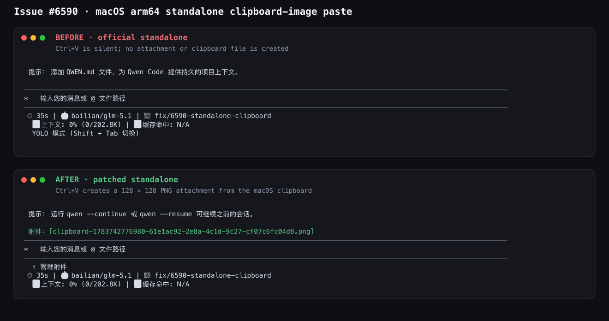

# Standalone clipboard native addon

## Problem

The CLI bundle keeps `@teddyzhu/clipboard` external so npm installations can
load the platform-specific native package at runtime. Standalone archives also
keep the import external, but currently copy only the audio-capture native
addon into `lib/node_modules`. Clipboard image paste therefore fails silently
in every standalone archive.

## Constraints

- Each archive must contain the `@teddyzhu/clipboard` JavaScript package and
  exactly one native package matching the archive target.
- The release job creates all supported targets on one Ubuntu runner. A normal
  `npm ci` only installs the runner's optional native package, so packaging
  cannot rely on the repository `node_modules` for cross-target artifacts.
- Clipboard package versions must come from the lockfile and remain aligned
  with the CLI optional dependencies.
- Local packaging should continue to work when a non-host clipboard artifact
  is unavailable, while release packaging must fail rather than publish a
  partially functional archive.

## Design

Before building release archives, install the locked clipboard meta package
and every supported target package into a temporary staging directory. Pass
that directory explicitly to the per-target packaging command.

The standalone packager maps each target to its native clipboard package and
copies only the meta package plus that target package into
`lib/node_modules/@teddyzhu`. When no explicit staging directory is supplied,
the packager uses the repository `node_modules`; a missing host artifact emits
a warning for local builds. Missing artifacts in an explicit staging directory
are fatal.

If the runtime module still cannot load, the input prompt reports a single
user-visible error on the first clipboard-image paste attempt. Existing Linux
`wl-paste` and `xclip` paths are unchanged.

## Verification

- Packaging tests cover target selection, exclusion of other native targets,
  and failure for incomplete explicit staging.
- Clipboard and input prompt tests cover the unavailable-module callback and
  one-time UI error.
- A real macOS arm64 archive is unpacked outside the repository, loaded with
  its bundled Node.js runtime, and exercised against an actual PNG in the
  system clipboard.

